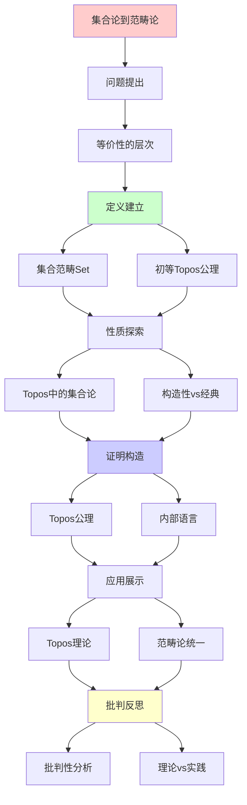
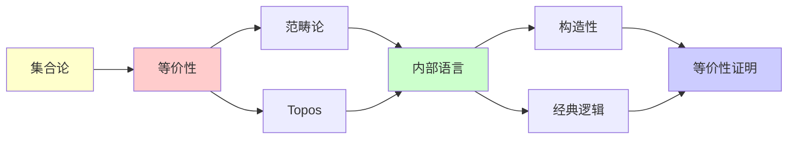

# 集合论到范畴论的等价性

> **主题**: ZF集合论 ≈ 初等Topos
> **创建日期**: 2025-12-02
> **难度**: ⭐⭐⭐⭐⭐
> **关键**: Topos作为"范畴论中的集合论"

---

## 📋 目录

- [集合论到范畴论的等价性](#集合论到范畴论的等价性)
  - [📋 目录](#-目录)
  - [1. 等价性的层次](#1-等价性的层次)
    - [1.1 三种"等价"](#11-三种等价)
    - [1.2 不是完全等价](#12-不是完全等价)
  - [2. 集合范畴Set](#2-集合范畴set)
    - [2.1 Set作为Topos](#21-set作为topos)
    - [2.2 Set的特殊性](#22-set的特殊性)
  - [3. 初等Topos公理](#3-初等topos公理)
    - [3.1 Topos = "广义集合论"](#31-topos--广义集合论)
    - [3.2 内部语言](#32-内部语言)
  - [4. Topos中的集合论](#4-topos中的集合论)
    - [4.1 可以定义什么](#41-可以定义什么)
    - [4.2 不能做什么（一般）](#42-不能做什么一般)
    - [4.3 布尔Topos](#43-布尔topos)
  - [5. 构造性 vs 经典](#5-构造性-vs-经典)
    - [5.1 内部逻辑的差异](#51-内部逻辑的差异)
    - [5.2 为什么这很重要？](#52-为什么这很重要)
    - [5.3 经典vs构造的统一](#53-经典vs构造的统一)
  - [6. 批判性分析](#6-批判性分析)
    - [6.1 理论优雅 vs 实践挑战](#61-理论优雅-vs-实践挑战)
    - [6.2 为什么不用Topos替代ZFC？](#62-为什么不用topos替代zfc)
    - [6.3 Topos vs HoTT](#63-topos-vs-hott)
  - [🎯 关键要点](#-关键要点)
    - [理论层面](#理论层面)
    - [实践层面](#实践层面)
  - [📚 学习资源](#-学习资源)
    - [Topos理论](#topos理论)
    - [连接视角](#连接视角)
  - [🎯 本文立场](#-本文立场)
  - [7. 主题-子主题论证逻辑关系图](#7-主题-子主题论证逻辑关系图)
    - [7.1 论证依赖关系](#71-论证依赖关系)
    - [7.2 概念依赖关系](#72-概念依赖关系)
  - [8. 参考资源](#8-参考资源)
    - [8.1 经典论文](#81-经典论文)
    - [8.2 教材](#82-教材)
    - [8.3 在线资源](#83-在线资源)


---

## 1. 等价性的层次

### 1.1 三种"等价"

**1. 语义等价**: Set是Topos的特例

```text
Set = 最简单的Topos
(布尔Topos, Ω = {0,1})
```

**2. 表达等价**: Topos内部语言 ≈ 集合论

```text
Topos内部可以做集合论数学
但可能是构造性的
```

**3. 基础等价**: 两者都可作为数学基础

```text
ZFC: 传统基础
Topos理论: 范畴论基础
```

### 1.2 不是完全等价

**关键差异**:

- ZFC: 经典逻辑
- Topos: 内部逻辑是直觉主义

**结论**:
> 集合论 ⊆ Topos理论
> (Set是特殊Topos)

---

## 2. 集合范畴Set

### 2.1 Set作为Topos

**验证Topos公理**:

**1. 有限极限**: ✅

```text
终对象: 单点集 {*}
积: A×B (笛卡尔积)
等化子: {a | f(a)=g(a)}
```

**2. CCC**: ✅

```text
指数对象: B^A = A→B (函数集)
Hom(C×A, B) ≅ Hom(C, B^A) (Curry化)
```

**3. 子对象分类器**: ✅

```text
Ω = {0,1}
true: {*} → {0,1}, *(↦1)

特征函数: χ_S: A → {0,1}
```

### 2.2 Set的特殊性

**Set是"经典"的**:

- Ω = {0,1} (二元)
- 排中律成立
- 选择公理可加入

**大多数Topos**: 非经典

- Ω可能更复杂（如开集格）
- 排中律不成立
- 内部是构造性的

---

## 3. 初等Topos公理

### 3.1 Topos = "广义集合论"

**三公理** (见03.2_Topos理论.md):

1. 有限极限
2. CCC (指数对象)
3. 子对象分类器

**直觉**:

```text
有限极限: 基本集合操作
CCC: 函数空间
子对象分类器: 真值对象（广义的{0,1}）
```

### 3.2 内部语言

**在Topos E中可以**:

- 定义"集合"（对象）
- 定义"函数"（态射）
- 定义"子集"（子对象）
- 定义"真值"（Ω的元素）
- 发展"数学"（内部逻辑）

**例子**: 自然数对象

```text
Topos中的ℕ = 对象配合
  0: 1 → ℕ
  succ: ℕ → ℕ
满足归纳原理
```

---

## 4. Topos中的集合论

### 4.1 可以定义什么

**在Topos E中**:

1. **自然数**: 自然数对象 ℕ
2. **幂集**: 子对象分类器 Ω^A
3. **函数**: 指数对象 B^A
4. **无限**: 归纳原理

**例子**: 实数 ℝ

```text
可以在Topos中定义
（作为Cauchy序列商等）
```

### 4.2 不能做什么（一般）

**经典性质**（可能失败）:

- 排中律 A ∨ ¬A
- 双重否定消除
- 选择公理

**原因**: Topos内部逻辑是**直觉主义**的

### 4.3 布尔Topos

**定义**: Ω = 1 + 1 的Topos

**性质**: 内部逻辑是**经典**的

**例子**:

- Set: 布尔Topos
- FinSet: 布尔Topos

**非布尔例子**:

- Sh(X): 层Topos（一般非布尔）

---

## 5. 构造性 vs 经典

### 5.1 内部逻辑的差异

**ZFC (经典)**:

```text
∀A: A ∨ ¬A (排中律)
∀A: ¬¬A → A (双重否定)
```

**Topos (直觉主义)**:

```text
一般不成立！
（除非布尔Topos）
```

### 5.2 为什么这很重要？

**构造性数学**:

- 存在性必须给出构造
- 析取必须知道哪边
- 更接近计算

**Topos自然地建模构造性数学**!

### 5.3 经典vs构造的统一

**定理**:

```text
ZFC可解释在布尔Topos中
构造性数学可解释在任意Topos中
```

**深刻**:
> Topos理论比ZFC更一般
> ZFC = Topos的特例（经典情形）

---

## 6. 批判性分析

### 6.1 理论优雅 vs 实践挑战

**理论**: Topos优雅统一

**实践**:

- ❌ 学习曲线极陡
- ❌ 需要大量范畴论背景
- ❌ 2025年仍小众

**批判**:
> "Topos理论深刻
> 但实用性有限（目前）"

### 6.2 为什么不用Topos替代ZFC？

**支持ZFC**:

- ✅ 100年传统
- ✅ 数学家熟悉
- ✅ 工具成熟

**支持Topos**:

- ✅ 更一般（统一构造性）
- ✅ 范畴论自然
- ✅ 连接拓扑、逻辑

**现实** (2025):

- 📊 多元共存
- 📊 领域分化

### 6.3 Topos vs HoTT

**两者都是**: 基于范畴论的新基础

**差异**:

- Topos: 1-范畴视角
- HoTT: ∞-范畴(∞-群胚)视角

**关系**: HoTT ≈ ∞-Topos的类型论

**未来**: 可能统一

---

## 🎯 关键要点

### 理论层面

**集合论 ↔ 范畴论**:

```text
Set范畴: 特殊的Topos
Topos: 广义的"集合论"
内部语言: 直觉主义高阶逻辑
```

**Post定理连接**:

```text
集合论的Σ₁⁰ = RE
= 文法生成 = 图灵可计算
```

### 实践层面

**选择基础**:

- 传统数学: ZFC
- 代数几何: Topos（层）
- 构造数学: Topos（内部逻辑）
- 计算机科学: 类型论

---

## 📚 学习资源

### Topos理论

1. **Goldblatt** - Topoi
   - 入门友好
2. **Mac Lane & Moerdijk** - Sheaves in Geometry and Logic
   - 标准教材

### 连接视角

1. **Lawvere & Schanuel** - Conceptual Mathematics
   - 范畴思维入门

---

## 🎯 本文立场

**理论价值**: ⭐⭐⭐⭐⭐

- Topos统一集合论与范畴论
- 深刻的理论洞察

**实践价值**: ⭐⭐

- 主要是理论兴趣
- 实际应用有限（2025）

**建议**:
> 理解核心思想（Topos=广义集合）
> 不必深入所有技术细节
> 除非研究范畴逻辑/代数几何

---

## 7. 主题-子主题论证逻辑关系图

### 7.1 论证依赖关系



### 7.2 概念依赖关系



**论证逻辑链条**：

1. **问题提出** (1节)：
   - 等价性的层次

2. **定义建立** (2-3节)：
   - 集合范畴Set（2节）
   - 初等Topos公理（3节）

3. **性质探索** (4-5节)：
   - Topos中的集合论（4节）
   - 构造性vs经典（5节）

4. **证明构造** (贯穿全文)：
   - Topos公理和内部语言

5. **应用展示** (贯穿全文)：
   - Topos理论和范畴论统一

6. **批判反思** (6节)：
   - 批判性分析

---

## 8. 参考资源

### 8.1 经典论文

1. **Lawvere, F. W.** (1964). "An Elementary Theory of the Category of Sets"
   - _Proceedings of the National Academy of Sciences_, 52(6), 1506-1511
   - Topos理论起源

2. **Mac Lane, S., & Moerdijk, I.** (1992). _Sheaves in Geometry and Logic: A First Introduction to Topos Theory_
   - Springer-Verlag. ISBN 978-0387977102
   - Topos理论标准教材

3. **Goldblatt, R.** (2006). _Topoi: The Categorial Analysis of Logic_ (revised ed.)
   - Dover Publications. ISBN 978-0486450261
   - Topos理论入门教材

### 8.2 教材

1. **Mac Lane, S., & Moerdijk, I.** (1992)
   - _Sheaves in Geometry and Logic: A First Introduction to Topos Theory_
   - Springer-Verlag. ISBN 978-0387977102
   - Topos理论标准教材

2. **Awodey, S.** (2010)
   - _Category Theory_ (2nd ed.)
   - Oxford University Press. ISBN 978-0199237180
   - 范畴论教材

3. **Lawvere, F. W., & Schanuel, S. H.** (2009)
   - _Conceptual Mathematics: A First Introduction to Categories_ (2nd ed.)
   - Cambridge University Press. ISBN 978-0521719162
   - 范畴思维入门

### 8.3 在线资源

1. **Topos**
   - https://en.wikipedia.org/wiki/Topos
   - Topos基本概念

2. **Elementary Topos**
   - https://ncatlab.org/nlab/show/elementary+topos
   - 初等Topos

3. **Category Theory**
   - https://en.wikipedia.org/wiki/Category_theory
   - 范畴论基本概念

---

**最后更新**: 2025-12-04
**难度**: ⭐⭐⭐⭐⭐
**理论性**: ⭐⭐⭐⭐⭐
**批判性**: 理论优雅，实践挑战，多元共存
**状态**: ✅ 已添加主题-子主题论证逻辑关系图和参考资源章节
