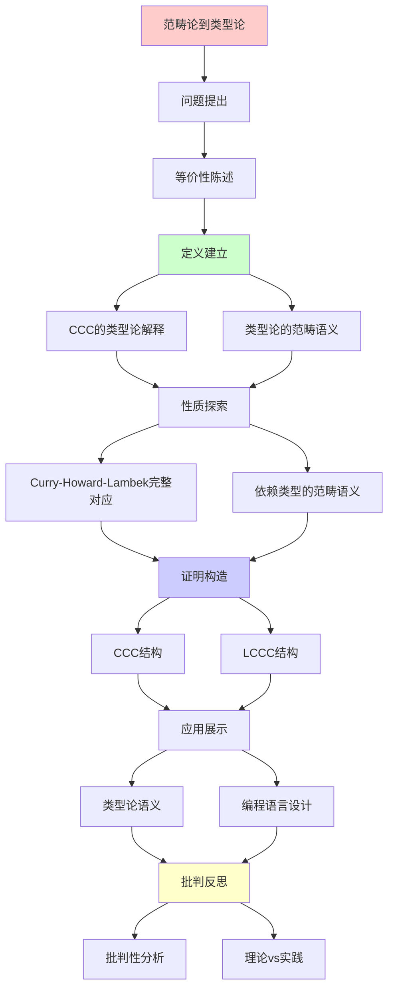
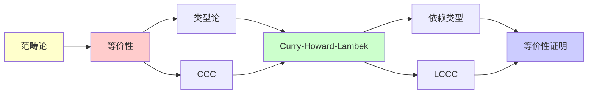

# 范畴论到类型论的等价性

> **主题**: Curry-Howard-Lambek对应的完整实现
> **创建日期**: 2025-12-02
> **难度**: ⭐⭐⭐⭐⭐
> **核心**: CCC ≅ Simply Typed Lambda Calculus

---

## 📋 目录

- [范畴论到类型论的等价性](#范畴论到类型论的等价性)
  - [📋 目录](#-目录)
  - [1. 等价性陈述](#1-等价性陈述)
    - [1.1 精确定理](#11-精确定理)
    - [1.2 扩展到依赖类型](#12-扩展到依赖类型)
  - [2. CCC的类型论解释](#2-ccc的类型论解释)
    - [2.1 对象 = 类型](#21-对象--类型)
    - [2.2 态射 = 项](#22-态射--项)
    - [2.3 CCC结构 = 类型构造](#23-ccc结构--类型构造)
    - [2.4 态射复合 = 程序复合](#24-态射复合--程序复合)
  - [3. 类型论的范畴语义](#3-类型论的范畴语义)
    - [3.1 解释函数 \_](#31-解释函数-_)
    - [3.2 保持性](#32-保持性)
  - [4. Curry-Howard-Lambek完整对应](#4-curry-howard-lambek完整对应)
    - [4.1 三位一体](#41-三位一体)
    - [4.2 证明即程序即态射](#42-证明即程序即态射)
    - [4.3 Lambek引理](#43-lambek引理)
  - [5. 依赖类型的范畴语义](#5-依赖类型的范畴语义)
    - [5.1 局部笛卡尔闭范畴 (LCCC)](#51-局部笛卡尔闭范畴-lccc)
    - [5.2 依赖类型解释](#52-依赖类型解释)
    - [5.3 量词作为伴随](#53-量词作为伴随)
  - [6. 批判性分析](#6-批判性分析)
    - [6.1 等价的精确性](#61-等价的精确性)
    - [6.2 语义的多样性](#62-语义的多样性)
    - [6.3 实践相关性](#63-实践相关性)
  - [🎯 关键要点](#-关键要点)
    - [理论层面](#理论层面)
    - [实践层面](#实践层面)
  - [📚 学习资源](#-学习资源)
    - [经典](#经典)
    - [现代](#现代)
  - [💡 深刻洞察](#-深刻洞察)
  - [🎯 本文立场](#-本文立场)
  - [7. 主题-子主题论证逻辑关系图](#7-主题-子主题论证逻辑关系图)
    - [7.1 论证依赖关系](#71-论证依赖关系)
    - [7.2 概念依赖关系](#72-概念依赖关系)
  - [8. 参考资源](#8-参考资源)
    - [8.1 经典论文](#81-经典论文)
    - [8.2 教材](#82-教材)
    - [8.3 在线资源](#83-在线资源)


---

## 1. 等价性陈述

### 1.1 精确定理

**定理1.1** (Lambek 1980):

```text
笛卡尔闭范畴 (CCC) ≅ 简单类型λ演算

更精确:
CCC ≅ STLC的范畴语义
```

**含义**:

- 每个CCC给出STLC模型
- 每个STLC项在CCC中有解释
- 两者本质同一

### 1.2 扩展到依赖类型

**定理1.2**:

```text
局部笛卡尔闭范畴 (LCCC) ≅ 依赖类型论
```

**应用**: Coq, Agda的范畴语义

---

## 2. CCC的类型论解释

### 2.1 对象 = 类型

**CCC对象** → **类型**

**例子**:

```text
范畴对象 A, B, C
类型 A, B, C
```

### 2.2 态射 = 项

**态射 f: A→B** → **项 λx:A.M : A→B**

**恒等态射** id_A → **恒等函数** λx:A.x

### 2.3 CCC结构 = 类型构造

| CCC | 类型论 |
|-----|--------|
| 终对象 1 | Unit类型 |
| 积 A×B | 对类型 A×B |
| 指数 B^A | 函数类型 A→B |

### 2.4 态射复合 = 程序复合

**范畴**:

```text
f: A→B, g: B→C
g∘f: A→C
```

**类型论**:

```text
f: A→B, g: B→C
λx:A. g(f(x)) : A→C
```

---

## 3. 类型论的范畴语义

### 3.1 解释函数 _

**类型解释** τ:

```text
Base = B (基础对象)
τ₁→τ₂ = τ₂^τ₁ (指数对象)
τ₁×τ₂ = τ₁ × τ₂ (积)
```

**项解释** Γ ⊢ M : τ:

```text
Γ ⊢ x : τ = 投影
Γ ⊢ λx.M : A→B = curry(Γ,x:A ⊢ M:B)
Γ ⊢ M N : B = eval ∘ ⟨M, N⟩
```

### 3.2 保持性

**定理**: 解释保持:

1. **类型**: 如果 Γ⊢M:τ，则 M: Γ→τ
2. **等价**: 如果 M =_β N，则 M = N
3. **代换**: M[x:=N] = M ∘ ⟨id, N⟩

---

## 4. Curry-Howard-Lambek完整对应

### 4.1 三位一体

| 逻辑 | 类型论 | 范畴论 (CCC) |
|------|--------|--------------|
| 命题 A | 类型 A | 对象 A |
| 证明 p:A | 项 t:A | 态射 t: 1→A |
| 蕴含 A→B | 函数类型 A→B | 指数对象 B^A |
| 合取 A∧B | 对类型 A×B | 积 A×B |
| 真 ⊤ | Unit类型 | 终对象 1 |
| 假 ⊥ | Empty类型 | 初对象 0 |

### 4.2 证明即程序即态射

**例子**: 证明 A→A

**逻辑**:

```text
命题: A → A
证明: 假设 a:A, 结论 a:A （恒等）
```

**类型论**:

```text
类型: A → A
项: λx:A. x
```

**范畴论**:

```text
对象: A
态射: id_A: A → A
```

**深刻**:
> 三者是同一数学实体的不同投影！

### 4.3 Lambek引理

**定理** (Lambek):

```text
在余连续范畴中，
μX.F(X) ≅ F(μX.F(X))

初始F-代数是F的不动点
```

**应用**: 归纳类型

```text
Nat = μX. 1+X
    ≅ 1 + Nat
    = 0 | succ(Nat)
```

**范畴论视角**: 归纳类型 = 初始代数

---

## 5. 依赖类型的范畴语义

### 5.1 局部笛卡尔闭范畴 (LCCC)

**定义**: 范畴C是LCCC，如果:

- C有有限极限
- 每个切片范畴 C/B 是CCC

### 5.2 依赖类型解释

**Π类型**:

```text
Γ, x:A ⊢ B(x) : Type
→
Γ ⊢ Π(x:A).B(x) : Type

范畴: 右伴随于弱化函子
```

**Σ类型**:

```text
Γ, x:A ⊢ B(x) : Type
→
Γ ⊢ Σ(x:A).B(x) : Type

范畴: 依赖和
```

### 5.3 量词作为伴随

**深刻对应**:

```text
∃ (Σ类型) ⊣ 弱化 ⊣ ∀ (Π类型)

存在 ⊣ ∆ ⊣ 全称
```

**Curry-Howard-Lambek扩展**:

```text
逻辑量词 ≅ 依赖类型 ≅ 伴随函子
```

---

## 6. 批判性分析

### 6.1 等价的精确性

**精确等价**: CCC ≅ STLC ✅

**近似等价**: LCCC ≈ 依赖类型 ⚠️

- 技术复杂
- 多种模型

**批判**:
> "简单类型论有完美语义
> 依赖类型论仍在发展"

### 6.2 语义的多样性

**问题**: 同一类型论可以有多个范畴模型

**例子** - STLC:

- Set: 集合论模型
- Poset: 序语义（Scott论域）
- Presheaf: Kripke模型

**含义**:
> "语法"（类型论）vs "语义"（范畴）
> 一对多关系

### 6.3 实践相关性

**理论**: Curry-Howard-Lambek深刻

**实践**:

- ⚠️ 大多数程序员不知道
- ✅ Haskell社区理解函子/幺半
- ⚠️ 形式化数学研究者使用

**价值**:

- 理解类型系统的本质
- 设计新语言的指导
- 证明助手的语义基础

---

## 🎯 关键要点

### 理论层面

**Curry-Howard-Lambek**:

```text
逻辑 ≅ 类型论 ≅ 范畴论

证明 ≅ 程序 ≅ 态射
计算 ≅ 归约 ≅ 态射复合
```

**深刻洞察**:

- CCC = λ演算的范畴语义
- 归纳类型 = 初始代数
- 依赖类型 = 伴随函子

### 实践层面

**应用**:

- Haskell类型类 = 范畴论概念
- Coq/Agda语义 = LCCC
- 编程语言设计

**价值**:

- 理解类型系统本质
- 连接数学与编程

---

## 📚 学习资源

### 经典

1. **Lambek & Scott** - Introduction to Higher-Order Categorical Logic
   - 原始论文风格
2. **Crole** - Categories for Types
   - 现代教材

### 现代

1. **Awodey** - Category Theory
   - Chapter 9: 类型论
2. **Jacobs** - Categorical Logic and Type Theory
   - 详尽深入

---

## 💡 深刻洞察

**洞察1**: 三位一体的完成

```text
Curry-Howard (1960s-70s):
  逻辑 ≅ 类型论

+ Lambek (1980):
  + 范畴论 (CCC)

= Curry-Howard-Lambek:
  逻辑 ≅ 类型论 ≅ 范畴论
```

**洞察2**: 范畴论的统一力

```text
不同类型论
  ↓ 范畴语义
统一在CCC/LCCC/Topos框架

→ 范畴论 = 元理论
```

**洞察3**: 递归的范畴本质

```text
Y组合子 (类型论)
= 不动点 (Domain理论)
= 初始代数 (范畴论)

→ 递归 = 范畴论的固有现象
```

---

## 🎯 本文立场

**Curry-Howard-Lambek的价值**:

- ✅ 20世纪最深刻的数学统一
- ✅ 连接三个领域
- ✅ 理论基础极其重要

**实践评估**:

- ⚠️ 抽象，学习难
- ⚠️ 直接应用有限
- ✅ 概念理解有价值

**建议**:
> 理解核心对应（逻辑≅类型≅范畴）
> 看经典例子
> 不必精通所有技术细节

---

## 7. 主题-子主题论证逻辑关系图

### 7.1 论证依赖关系



### 7.2 概念依赖关系



**论证逻辑链条**：

1. **问题提出** (1节)：
   - 等价性陈述

2. **定义建立** (2-3节)：
   - CCC的类型论解释（2节）
   - 类型论的范畴语义（3节）

3. **性质探索** (4-5节)：
   - Curry-Howard-Lambek完整对应（4节）
   - 依赖类型的范畴语义（5节）

4. **证明构造** (贯穿全文)：
   - CCC结构和LCCC结构

5. **应用展示** (贯穿全文)：
   - 类型论语义和编程语言设计

6. **批判反思** (6节)：
   - 批判性分析

---

## 8. 参考资源

### 8.1 经典论文

1. **Lambek, J., & Scott, P. J.** (1986). _Introduction to Higher-Order Categorical Logic_
   - Cambridge University Press. ISBN 978-0521356534
   - Curry-Howard-Lambek对应

2. **Lawvere, F. W.** (1969). "Adjointness in Foundations"
   - _Dialectica_, 23(3-4), 281-296
   - 范畴逻辑基础

3. **Awodey, S.** (2010). _Category Theory_ (2nd ed.)
   - Oxford University Press. ISBN 978-0199237180
   - 范畴论教材

### 8.2 教材

1. **Lambek, J., & Scott, P. J.** (1986)
   - _Introduction to Higher-Order Categorical Logic_
   - Cambridge University Press. ISBN 978-0521356534
   - 范畴逻辑教材

2. **Crole, R. L.** (1993)
   - _Categories for Types_
   - Cambridge University Press. ISBN 978-0521457019
   - 类型论范畴语义

3. **Jacobs, B.** (1999)
   - _Categorical Logic and Type Theory_
   - North-Holland. ISBN 978-0444508539
   - 范畴逻辑与类型论

### 8.3 在线资源

1. **Curry-Howard Correspondence**
   - https://en.wikipedia.org/wiki/Curry%E2%80%93Howard_correspondence
   - Curry-Howard对应

2. **Cartesian Closed Category**
   - https://en.wikipedia.org/wiki/Cartesian_closed_category
   - 笛卡尔闭范畴

3. **Type Theory**
   - https://en.wikipedia.org/wiki/Type_theory
   - 类型论基本概念

---

**最后更新**: 2025-12-04
**难度**: ⭐⭐⭐⭐⭐
**重要性**: ⭐⭐⭐⭐⭐ (理论基石)
**美学**: ⭐⭐⭐⭐⭐ (数学统一的典范)
**批判性**: 深刻但抽象，理解思想即可
**状态**: ✅ 已添加主题-子主题论证逻辑关系图和参考资源章节
