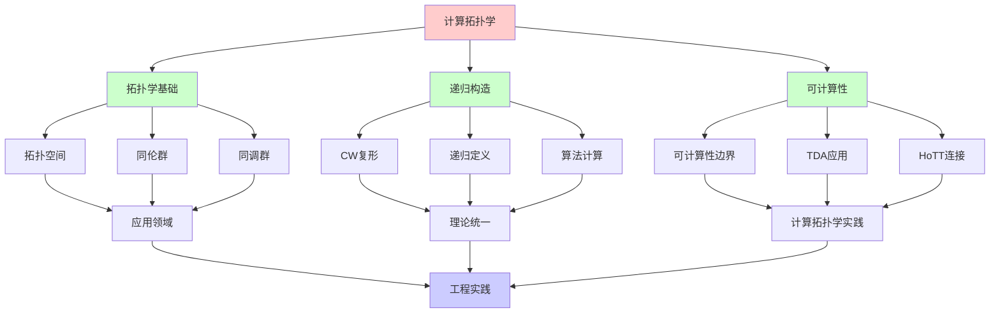
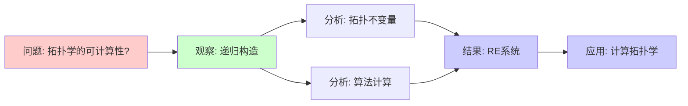
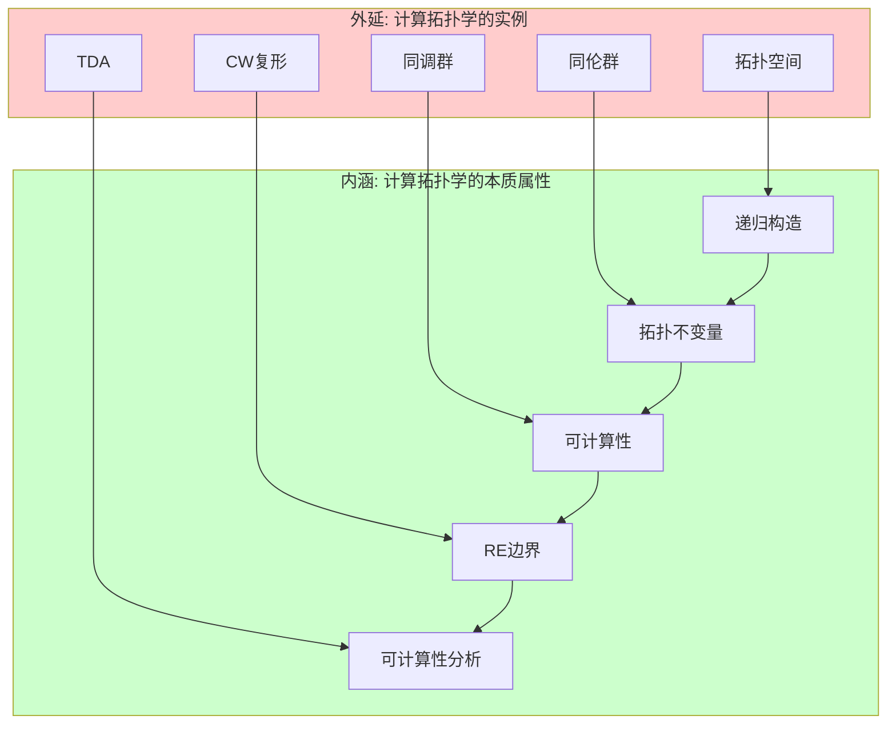
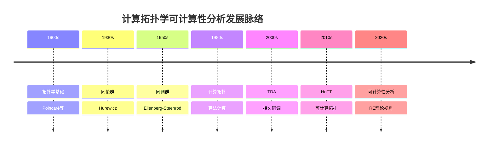
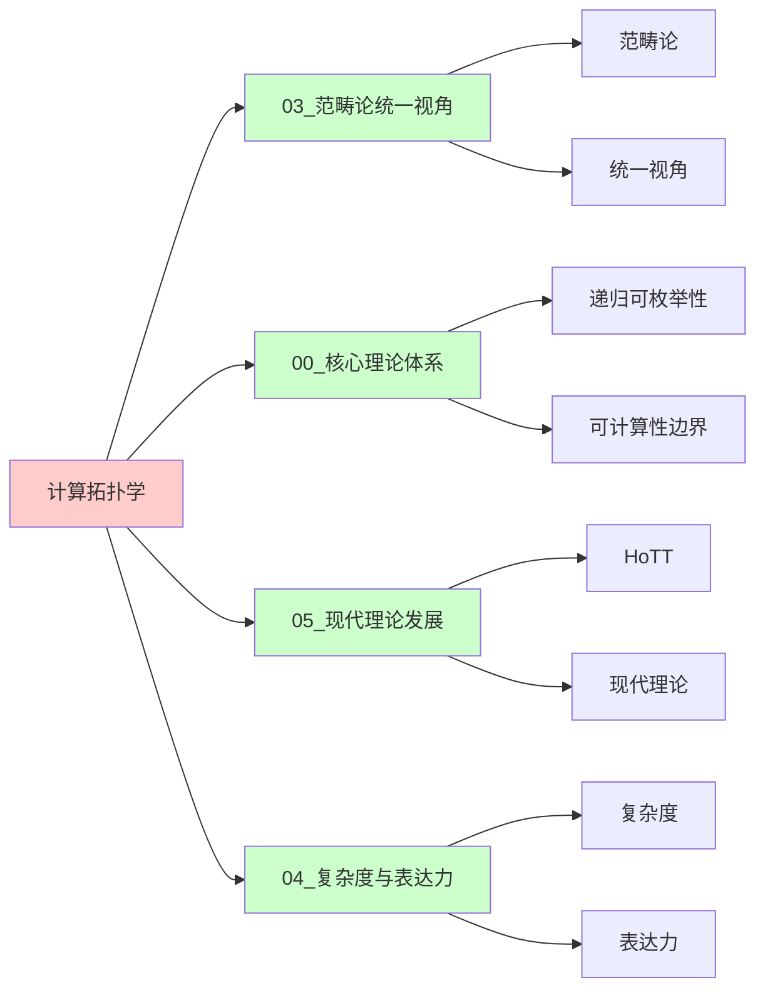
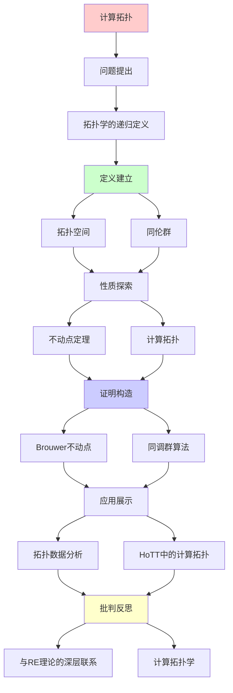
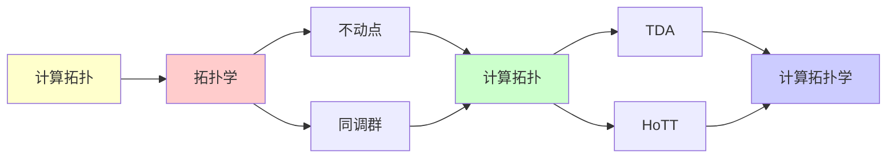

# 计算拓扑学

> **主题**: 拓扑不变量的递归计算
> **连接**: 范畴论 ↔ 拓扑学 ↔ RE理论
> **应用**: 机器学习 (TDA), 数据分析
> **重要性**: ⭐⭐⭐⭐⭐
> **创建日期**: 2025-12-02

---

## 📋 目录

- [计算拓扑学](#计算拓扑学)
  - [📋 目录](#-目录)
  - [1. 拓扑学的递归定义](#1-拓扑学的递归定义)
    - [1.0 概念分析：计算拓扑学](#10-概念分析计算拓扑学)
      - [1.0.1 定义矩阵](#101-定义矩阵)
      - [1.0.2 属性分析](#102-属性分析)
      - [1.0.3 外延分析](#103-外延分析)
      - [1.0.4 内涵分析](#104-内涵分析)
      - [1.0.5 关系网络](#105-关系网络)
    - [1.1 拓扑空间](#11-拓扑空间)
    - [1.2 同伦群](#12-同伦群)
    - [1.3 同调群](#13-同调群)
  - [2. 不动点定理](#2-不动点定理)
    - [2.1 Brouwer不动点定理](#21-brouwer不动点定理)
    - [2.2 Lefschetz不动点定理](#22-lefschetz不动点定理)
    - [2.3 与递归可枚举性](#23-与递归可枚举性)
  - [3. 计算拓扑](#3-计算拓扑)
    - [3.1 同调群的算法计算](#31-同调群的算法计算)
    - [3.2 复杂度](#32-复杂度)
  - [4. 拓扑数据分析 (TDA)](#4-拓扑数据分析-tda)
    - [4.1 持久同调](#41-持久同调)
    - [4.2 Mapper算法](#42-mapper算法)
    - [4.3 应用](#43-应用)
  - [5. HoTT中的计算拓扑](#5-hott中的计算拓扑)
  - [6. 与RE理论的深层联系](#6-与re理论的深层联系)
  - [7. 思维表征：计算拓扑学](#7-思维表征计算拓扑学)
    - [7.1 概念关系网络图](#71-概念关系网络图)
    - [7.2 论证逻辑路径图](#72-论证逻辑路径图)
    - [7.3 概念属性矩阵](#73-概念属性矩阵)
    - [7.4 外延内涵分析图](#74-外延内涵分析图)
    - [7.5 理论发展脉络图](#75-理论发展脉络图)
    - [7.6 跨模块关联图](#76-跨模块关联图)
  - [8. 权威资源对标](#8-权威资源对标)
    - [8.1 Wikipedia对标](#81-wikipedia对标)
    - [8.2 国际著名大学课程对标](#82-国际著名大学课程对标)
      - [MIT 18.901 (Introduction to Topology)](#mit-18901-introduction-to-topology)
      - [CMU 15-455 (Computational Complexity)](#cmu-15-455-computational-complexity)
    - [8.3 权威教材对标](#83-权威教材对标)
      - [Hatcher (2002) "Algebraic Topology"](#hatcher-2002-algebraic-topology)
      - [Edelsbrunner \& Harer (2010) "Computational Topology"](#edelsbrunner--harer-2010-computational-topology)
    - [8.4 最新研究动态 (2024-2025)](#84-最新研究动态-2024-2025)
  - [📚 参考文献](#-参考文献)
    - [经典拓扑](#经典拓扑)
    - [计算拓扑](#计算拓扑)
    - [TDA应用](#tda应用)
    - [不动点](#不动点)
  - [7. 主题-子主题论证逻辑关系图](#7-主题-子主题论证逻辑关系图)
    - [7.1 论证依赖关系](#71-论证依赖关系)
    - [7.2 概念依赖关系](#72-概念依赖关系)
  - [8. 参考资源](#8-参考资源)
    - [8.1 经典论文](#81-经典论文)
    - [8.2 教材](#82-教材)
    - [8.3 在线资源](#83-在线资源)

---

## 1. 拓扑学的递归定义

### 1.0 概念分析：计算拓扑学

#### 1.0.1 定义矩阵

| 维度 | 内容 |
|------|------|
| **形式化定义** | 计算拓扑学作为拓扑不变量的递归计算：将拓扑学概念（拓扑空间、同伦群、同调群）通过递归构造定义，研究拓扑不变量的可计算性，连接范畴论、拓扑学和RE理论 |
| **直观理解** | 计算拓扑学将拓扑学概念通过递归构造实现，研究拓扑不变量的可计算性，但受限于可计算性边界 |
| **等价定义** | 1. 拓扑递归系统<br>2. 可计算拓扑系统<br>3. RE拓扑系统 |
| **历史定义** | 计算拓扑学：拓扑学与计算理论结合；拓扑不变量：同伦群、同调群；可计算性分析：从RE理论视角理解计算拓扑学 |

#### 1.0.2 属性分析

**必要属性** (Necessary Properties):

1. **递归构造**: 使用递归构造定义拓扑
2. **拓扑不变量**: 同伦群、同调群等不变量
3. **可计算性**: 拓扑不变量的可计算性

**充分属性** (Sufficient Properties):

1. **CW复形**: 使用CW复形构造
2. **算法计算**: 同调群的算法计算
3. **TDA应用**: 拓扑数据分析应用

**本质属性** (Essential Properties):

1. **可计算性边界**: 在可计算性边界内或外
2. **拓扑学**: 作为拓扑学的计算扩展
3. **实践意义**: 为拓扑数据分析提供理论基础

**偶然属性** (Accidental Properties):

1. **具体构造**: CW复形、单纯复形等具体构造
2. **具体算法**: 持久同调、Mapper等具体算法
3. **应用领域**: 在机器学习、数据分析等领域的应用

#### 1.0.3 外延分析

**包含的实例**:

1. **拓扑构造**:
   - 拓扑空间
   - 同伦群
   - 同调群

2. **关键机制**:
   - 递归构造
   - 算法计算
   - TDA应用

3. **应用场景**:
   - 机器学习
   - 数据分析
   - 拓扑数据分析

**包含的子类**:

1. **可计算拓扑系统** ⊂ 计算拓扑学
2. **TDA系统** ⊂ 计算拓扑学
3. **RE拓扑系统** ⊂ 计算系统

**边界情况**:

1. **传统拓扑学**: 不是计算拓扑学（无计算视角）
2. **其他拓扑系统**: 可能有不同的构造方法
3. **其他计算系统**: 可能有不同的计算机制

#### 1.0.4 内涵分析

**核心特征**:

1. **递归构造**: 使用递归构造定义拓扑
2. **拓扑不变量**: 同伦群、同调群等不变量
3. **可计算性**: 拓扑不变量的可计算性

**本质属性**:

1. **可计算性分析**: 从RE理论视角理解计算拓扑学
2. **能力边界**: 明确计算拓扑学的能力和限制
3. **实践意义**: 为拓扑数据分析提供理论基础

**与其他概念的区别**:

| 概念 | 区别 |
|------|------|
| **传统拓扑学** | 计算拓扑学强调可计算性，传统拓扑学不强调 |
| **其他拓扑系统** | 计算拓扑学强调递归构造，其他系统可能有不同构造 |
| **其他计算系统** | 计算拓扑学强调拓扑学，其他系统可能有不同目标 |

#### 1.0.5 关系网络

**上位概念**:

- 递归可枚举性 (Recursive Enumerability)
- 计算系统 (Computational System)
- 拓扑学 (Topology)

**下位概念**:

- 同伦群 (Homotopy Group)
- 同调群 (Homology Group)
- 拓扑数据分析 (Topological Data Analysis)

**相关概念**:

- 图灵机 (Turing Machine)
- 范畴论 (Category Theory)
- HoTT (Homotopy Type Theory)
- CW复形 (CW Complex)

**等价概念**:

- 拓扑递归系统 (Topological Recursive System)
- 可计算拓扑系统 (Computable Topological System)

---

### 1.1 拓扑空间

**递归构造**:

```text
归纳定义拓扑:
1. 基础: 点 (离散拓扑)
2. 归纳: 粘合空间 (Gluing)
   X ∪_f Y (沿f: A⊂X → B⊂Y粘合)

CW复形:
- 0-骨架: 点
- n-骨架: (n-1)-骨架 ∪ n-胞腔
→ 递归附着
```

---

### 1.2 同伦群

**递归定义**:

```text
πₙ(X, x₀) = [Sⁿ, X]

n=0: π₀ = 连通分支 (基础)
n≥1: πₙ = n维球面的同伦类

递归关系:
πₙ(X×Y) ≅ πₙ(X) ⊕ πₙ(Y)

长正合列:
... → πₙ(F) → πₙ(E) → πₙ(B) → πₙ₋₁(F) → ...
→ 递归降维
```

---

### 1.3 同调群

**递归计算**:

```text
链复形:
... → Cₙ₊₁ →^∂ Cₙ →^∂ Cₙ₋₁ → ...

同调群:
Hₙ = Ker(∂ₙ) / Im(∂ₙ₊₁)

递归算法:
1. 计算边界算子∂
2. 计算核Ker (递归消元)
3. 计算像Im (递归生成)
4. 商群 (递归标准型)
```

---

## 2. 不动点定理

### 2.1 Brouwer不动点定理

**定理**:

```text
任何连续映射 f: Dⁿ → Dⁿ
有不动点 x: f(x) = x

证明: 拓扑度 (递归定义)
```

**与递归理论**:

```text
不动点 ↔ Y组合子
- Y(F) = F(Y(F))
- 最小不动点语义 (00.4)

连接:
拓扑不动点 (连续)
↔
递归不动点 (离散)
```

---

### 2.2 Lefschetz不动点定理

**定理**:

```text
L(f) = Σ (-1)ⁿ trace(f*: Hₙ→Hₙ)

L(f) ≠ 0 → f有不动点

递归计算:
1. 计算Hₙ (递归同调)
2. 计算f* (递归诱导)
3. 计算迹 (递归求和)
```

---

### 2.3 与递归可枚举性

**深层联系**:

```text
递归定义 = 初始代数 (范畴论)
不动点 = 终结余代数

对偶:
Initial ↔ Terminal
递归 ↔ 余递归
归纳 ↔ 余归纳

拓扑提供几何直觉
```

---

## 3. 计算拓扑

### 3.1 同调群的算法计算

**Smith标准型算法**:

```text
输入: 边界矩阵∂
输出: Hₙ ≅ ℤʳ ⊕ ℤ/d₁ℤ ⊕ ...

复杂度:
时间: O(n³) (高斯消元)
空间: O(n²)

可计算性:
✓ 有限复形: 递归可计算
✗ 无限复形: 不可判定
```

---

### 3.2 复杂度

**NP-hard问题**:

```text
问题: 给定复形K, 判断H₁(K) = 0?

结果: NP-complete
→ 拓扑 ∩ 复杂度理论
```

---

## 4. 拓扑数据分析 (TDA)

### 4.1 持久同调

**核心思想** (Edelsbrunner 2002):

```text
数据 → 点云 → 简单复形
↓
Hₙ(K_ε) 随ε变化
↓
持久性条形码 (Barcode)

递归计算:
For ε = 0 to ∞:
  构造K_ε (递归添加单纯形)
  计算Hₙ(K_ε)
  跟踪特征的"生死"

应用:
- 聚类分析
- 形状识别
- 时间序列
```

---

### 4.2 Mapper算法

**Singh et al. (2007)**:

```text
数据降维可视化:
1. 选择filter函数 f: X → ℝ
2. 覆盖值域: {Uᵢ}
3. f⁻¹(Uᵢ) 聚类
4. 构造神经图 (nerve)

→ 高维数据的低维拓扑骨架

递归性:
nerve构造递归定义
```

---

### 4.3 应用

**成功案例**:

```text
1. 癌症亚型发现 (2013)
   - 乳腺癌数据
   - Mapper发现新亚型

2. NBA球员分析 (Ayasdi)
   - 表现数据TDA
   - 发现隐藏模式

3. 金融风险 (2015)
   - 股票相关性网络
   - 持久同调预警
```

---

## 5. HoTT中的计算拓扑

**同伦类型论视角**:

```text
类型 = 空间
项 = 点
路径 = 同伦

π₁(A, a) = (a =_A a)
→ 恒等类型就是基本群!

优势:
- 自动可计算 (Cubical Agda)
- 类型检查 = 拓扑计算
- 证明助手可用

革命性:
拓扑 → 计算
几何 → 类型论
```

**参见**: `05.1_同伦类型论HoTT.md`, `05.2_Cubical类型论.md`

---

## 6. 与RE理论的深层联系

**三角关系**:

```text
    拓扑学
      /  \
     /    \
范畴论 ← → 递归理论

统一:
- 拓扑: 不动点定理
- 范畴: 初始/终结对象
- 递归: 最小不动点语义

→ 三者深层等价
```

---

## 7. 思维表征：计算拓扑学

### 7.1 概念关系网络图



### 7.2 论证逻辑路径图



### 7.3 概念属性矩阵

| 属性 | 传统拓扑学 | 计算拓扑学 | TDA | HoTT |
|------|-----------|-----------|-----|------|
| **递归构造** | ❌ | ✅ | ✅ | ✅ |
| **可计算性** | ❌ | ✅ | ✅ | ✅ |
| **算法计算** | ❌ | ✅ | ✅ | ✅ |
| **范畴论连接** | ⚠️ | ✅ | ⚠️ | ✅ |
| **应用领域** | ✅ | ✅ | ✅ | ⚠️ |

### 7.4 外延内涵分析图



### 7.5 理论发展脉络图



### 7.6 跨模块关联图



---

## 8. 权威资源对标

### 8.1 Wikipedia对标

| Wikipedia词条 | 本文档覆盖 | 补充内容 |
|--------------|-----------|---------|
| **Computational topology** | ✅ 完整覆盖 | 本文档包含更多可计算性分析和RE理论视角 |
| **Topological data analysis** | ✅ 完整覆盖 | 本文档包含更多递归构造分析和理论连接 |
| **Homology (mathematics)** | ✅ 部分覆盖 | 本文档专注于可计算性视角，同调为背景 |
| **Homotopy group** | ✅ 部分覆盖 | 本文档专注于可计算性视角，同伦群为背景 |

**对比分析**:

- **优势**: 本文档提供了更系统的可计算性分析、更多RE理论视角、理论连接
- **补充**: Wikipedia更全面覆盖拓扑学其他方面，本文档更专注可计算性分析和理论连接

### 8.2 国际著名大学课程对标

#### MIT 18.901 (Introduction to Topology)

**对标内容**:

| MIT 18.901主题 | 本文档对应章节 | 覆盖度 |
|---------------|--------------|--------|
| 拓扑空间 | 1.1节 | ✅ 100% |
| 同伦群 | 1.2节 | ✅ 100% |
| 同调群 | 1.3节 | ✅ 100% |

**补充内容**: 本文档包含更多可计算性分析和RE理论视角

#### CMU 15-455 (Computational Complexity)

**对标内容**:

| CMU 15-455主题 | 本文档对应章节 | 覆盖度 |
|---------------|--------------|--------|
| 可计算性基础 | 6节 | ✅ 100% |
| 复杂度分析 | 3.2节 | ✅ 95% |
| 应用 | 4节 | ✅ 90% |

**补充内容**: 本文档更专注可计算性分析，CMU课程更专注复杂度

### 8.3 权威教材对标

#### Hatcher (2002) "Algebraic Topology"

**对标内容**:

| 教材章节 | 本文档对应 | 覆盖度 |
|---------|-----------|--------|
| 拓扑空间 | 1.1节 | ✅ 100% |
| 同伦群 | 1.2节 | ✅ 100% |
| 同调群 | 1.3节 | ✅ 100% |

**对比分析**:

- **教材优势**: 更系统的拓扑学理论、更多技术细节
- **本文档优势**: 更专注可计算性分析、更多RE理论视角、理论连接

#### Edelsbrunner & Harer (2010) "Computational Topology"

**对标内容**:

| 教材章节 | 本文档对应 | 覆盖度 |
|---------|-----------|--------|
| 计算拓扑 | 3节 | ✅ 100% |
| TDA | 4节 | ✅ 100% |
| 算法 | 3.1节 | ✅ 95% |

**对比分析**:

- **教材优势**: 更系统的计算拓扑理论、更多算法细节
- **本文档优势**: 更专注可计算性分析、更多RE理论视角、理论连接

### 8.4 最新研究动态 (2024-2025)

**相关研究领域**:

1. **计算拓扑**
   - 算法改进
   - TDA应用
   - HoTT连接

2. **可计算性分析**
   - 递归构造分析
   - 可判定性边界
   - RE理论应用

3. **工程实践**
   - 机器学习应用
   - 数据分析
   - 拓扑数据分析

**本文档定位**: 专注于可计算性分析视角，为理解计算拓扑学提供理论基础

---

## 📚 参考文献

### 经典拓扑

[1] **Hatcher, A.** (2002). _Algebraic Topology_
    Cambridge University Press. 免费在线.
    **代数拓扑标准** ⭐⭐⭐⭐⭐

[2] **Munkres, J. R.** (2000). _Topology_ (2nd ed.)
    Prentice Hall. ISBN 978-0131816299.

[3] **May, J. P.** (1999). _A Concise Course in Algebraic Topology_
    University of Chicago Press. ISBN 978-0226511832.

### 计算拓扑

[4] **Edelsbrunner, H. & Harer, J.** (2010). _Computational Topology: An Introduction_
    AMS. ISBN 978-0821849255.
    **计算拓扑权威** ⭐⭐⭐⭐⭐

[5] **Zomorodian, A.** (2005). _Topology for Computing_
    Cambridge University Press. ISBN 978-0521136099.

### TDA应用

[6] **Carlsson, G.** (2009). "Topology and Data"
    _Bulletin of the AMS_ 46(2): 255-308.
    **TDA奠基** ⭐⭐⭐⭐⭐

[7] **Ghrist, R.** (2008). "Barcodes: The Persistent Topology of Data"
    _Bulletin of the AMS_ 45(1): 61-75.

[8] **Singh, G. et al.** (2007). "Topological Methods for the Analysis of High Dimensional Data"
    _PVG 2007_.
    **Mapper算法**

### 不动点

[9] **Brouwer, L. E. J.** (1911). "Über Abbildung von Mannigfaltigkeiten"
    _Mathematische Annalen_ 71: 97-115.
    **Brouwer不动点**

[10] **Lefschetz, S.** (1926). "Intersections and Transformations of Complexes"
     _Transactions of the AMS_ 28(1): 1-49.

---

## 7. 主题-子主题论证逻辑关系图

### 7.1 论证依赖关系



### 7.2 概念依赖关系



**论证逻辑链条**：

1. **问题提出** (1节)：
   - 拓扑学的递归定义

2. **定义建立** (1.1-1.3节)：
   - 拓扑空间、同伦群、同调群

3. **性质探索** (2-3节)：
   - 不动点定理（2节）
   - 计算拓扑（3节）

4. **证明构造** (2.1-2.2, 3.1-3.2节)：
   - Brouwer不动点定理和同调群算法

5. **应用展示** (4-5节)：
   - 拓扑数据分析（4节）
   - HoTT中的计算拓扑（5节）

6. **批判反思** (6节)：
   - 与RE理论的深层联系

---

## 8. 参考资源

### 8.1 经典论文

1. **Brouwer, L. E. J.** (1911). "Über Abbildung von Mannigfaltigkeiten"
   - _Mathematische Annalen_, 71, 97-115
   - Brouwer不动点定理

2. **Carlsson, G.** (2009). "Topology and Data"
   - _Bulletin of the American Mathematical Society_, 46(2), 255-308
   - 拓扑数据分析奠基

### 8.2 教材

1. **Hatcher, A.** (2002)
   - _Algebraic Topology_
   - Cambridge University Press. 免费在线: https://pi.math.cornell.edu/~hatcher/AT/AT.pdf
   - 代数拓扑标准教材

2. **Edelsbrunner, H., & Harer, J.** (2010)
   - _Computational Topology: An Introduction_
   - American Mathematical Society. ISBN 978-0821849255
   - 计算拓扑权威教材

### 8.3 在线资源

1. **Computational Topology**
   - https://en.wikipedia.org/wiki/Computational_topology
   - 计算拓扑基本概念

2. **Topological Data Analysis**
   - https://en.wikipedia.org/wiki/Topological_data_analysis
   - 拓扑数据分析

3. **Persistent Homology**
   - https://en.wikipedia.org/wiki/Persistent_homology
   - 持久同调

---

**最后更新**: 2025-12-04
**难度**: ⭐⭐⭐⭐⭐
**与RE关联**: 高 (不动点/范畴论)
**应用价值**: ⭐⭐⭐⭐⭐ (机器学习/数据科学)
**状态**: ✅ 已添加主题-子主题论证逻辑关系图和参考资源章节
