# 计算拓扑学

> **主题**: 拓扑不变量的递归计算
> **连接**: 范畴论 ↔ 拓扑学 ↔ RE理论
> **应用**: 机器学习 (TDA), 数据分析
> **重要性**: ⭐⭐⭐⭐⭐
> **创建日期**: 2025-12-02

---

## 📋 目录

- [计算拓扑学](#计算拓扑学)
  - [📋 目录](#-目录)
  - [1. 拓扑学的递归定义](#1-拓扑学的递归定义)
    - [1.1 拓扑空间](#11-拓扑空间)
    - [1.2 同伦群](#12-同伦群)
    - [1.3 同调群](#13-同调群)
  - [2. 不动点定理](#2-不动点定理)
    - [2.1 Brouwer不动点定理](#21-brouwer不动点定理)
    - [2.2 Lefschetz不动点定理](#22-lefschetz不动点定理)
    - [2.3 与递归可枚举性](#23-与递归可枚举性)
  - [3. 计算拓扑](#3-计算拓扑)
    - [3.1 同调群的算法计算](#31-同调群的算法计算)
    - [3.2 复杂度](#32-复杂度)
  - [4. 拓扑数据分析 (TDA)](#4-拓扑数据分析-tda)
    - [4.1 持久同调](#41-持久同调)
    - [4.2 Mapper算法](#42-mapper算法)
    - [4.3 应用](#43-应用)
  - [5. HoTT中的计算拓扑](#5-hott中的计算拓扑)
  - [6. 与RE理论的深层联系](#6-与re理论的深层联系)
  - [📚 参考文献](#-参考文献)
    - [经典拓扑](#经典拓扑)
    - [计算拓扑](#计算拓扑)
    - [TDA应用](#tda应用)
    - [不动点](#不动点)
  - [7. 主题-子主题论证逻辑关系图](#7-主题-子主题论证逻辑关系图)
    - [7.1 论证依赖关系](#71-论证依赖关系)
    - [7.2 概念依赖关系](#72-概念依赖关系)
  - [8. 参考资源](#8-参考资源)
    - [8.1 经典论文](#81-经典论文)
    - [8.2 教材](#82-教材)
    - [8.3 在线资源](#83-在线资源)

---

## 1. 拓扑学的递归定义

### 1.1 拓扑空间

**递归构造**:

```text
归纳定义拓扑:
1. 基础: 点 (离散拓扑)
2. 归纳: 粘合空间 (Gluing)
   X ∪_f Y (沿f: A⊂X → B⊂Y粘合)

CW复形:
- 0-骨架: 点
- n-骨架: (n-1)-骨架 ∪ n-胞腔
→ 递归附着
```

---

### 1.2 同伦群

**递归定义**:

```text
πₙ(X, x₀) = [Sⁿ, X]

n=0: π₀ = 连通分支 (基础)
n≥1: πₙ = n维球面的同伦类

递归关系:
πₙ(X×Y) ≅ πₙ(X) ⊕ πₙ(Y)

长正合列:
... → πₙ(F) → πₙ(E) → πₙ(B) → πₙ₋₁(F) → ...
→ 递归降维
```

---

### 1.3 同调群

**递归计算**:

```text
链复形:
... → Cₙ₊₁ →^∂ Cₙ →^∂ Cₙ₋₁ → ...

同调群:
Hₙ = Ker(∂ₙ) / Im(∂ₙ₊₁)

递归算法:
1. 计算边界算子∂
2. 计算核Ker (递归消元)
3. 计算像Im (递归生成)
4. 商群 (递归标准型)
```

---

## 2. 不动点定理

### 2.1 Brouwer不动点定理

**定理**:

```text
任何连续映射 f: Dⁿ → Dⁿ
有不动点 x: f(x) = x

证明: 拓扑度 (递归定义)
```

**与递归理论**:

```text
不动点 ↔ Y组合子
- Y(F) = F(Y(F))
- 最小不动点语义 (00.4)

连接:
拓扑不动点 (连续)
↔
递归不动点 (离散)
```

---

### 2.2 Lefschetz不动点定理

**定理**:

```text
L(f) = Σ (-1)ⁿ trace(f*: Hₙ→Hₙ)

L(f) ≠ 0 → f有不动点

递归计算:
1. 计算Hₙ (递归同调)
2. 计算f* (递归诱导)
3. 计算迹 (递归求和)
```

---

### 2.3 与递归可枚举性

**深层联系**:

```text
递归定义 = 初始代数 (范畴论)
不动点 = 终结余代数

对偶:
Initial ↔ Terminal
递归 ↔ 余递归
归纳 ↔ 余归纳

拓扑提供几何直觉
```

---

## 3. 计算拓扑

### 3.1 同调群的算法计算

**Smith标准型算法**:

```text
输入: 边界矩阵∂
输出: Hₙ ≅ ℤʳ ⊕ ℤ/d₁ℤ ⊕ ...

复杂度:
时间: O(n³) (高斯消元)
空间: O(n²)

可计算性:
✓ 有限复形: 递归可计算
✗ 无限复形: 不可判定
```

---

### 3.2 复杂度

**NP-hard问题**:

```text
问题: 给定复形K, 判断H₁(K) = 0?

结果: NP-complete
→ 拓扑 ∩ 复杂度理论
```

---

## 4. 拓扑数据分析 (TDA)

### 4.1 持久同调

**核心思想** (Edelsbrunner 2002):

```text
数据 → 点云 → 简单复形
↓
Hₙ(K_ε) 随ε变化
↓
持久性条形码 (Barcode)

递归计算:
For ε = 0 to ∞:
  构造K_ε (递归添加单纯形)
  计算Hₙ(K_ε)
  跟踪特征的"生死"

应用:
- 聚类分析
- 形状识别
- 时间序列
```

---

### 4.2 Mapper算法

**Singh et al. (2007)**:

```text
数据降维可视化:
1. 选择filter函数 f: X → ℝ
2. 覆盖值域: {Uᵢ}
3. f⁻¹(Uᵢ) 聚类
4. 构造神经图 (nerve)

→ 高维数据的低维拓扑骨架

递归性:
nerve构造递归定义
```

---

### 4.3 应用

**成功案例**:

```text
1. 癌症亚型发现 (2013)
   - 乳腺癌数据
   - Mapper发现新亚型

2. NBA球员分析 (Ayasdi)
   - 表现数据TDA
   - 发现隐藏模式

3. 金融风险 (2015)
   - 股票相关性网络
   - 持久同调预警
```

---

## 5. HoTT中的计算拓扑

**同伦类型论视角**:

```text
类型 = 空间
项 = 点
路径 = 同伦

π₁(A, a) = (a =_A a)
→ 恒等类型就是基本群!

优势:
- 自动可计算 (Cubical Agda)
- 类型检查 = 拓扑计算
- 证明助手可用

革命性:
拓扑 → 计算
几何 → 类型论
```

**参见**: `05.1_同伦类型论HoTT.md`, `05.2_Cubical类型论.md`

---

## 6. 与RE理论的深层联系

**三角关系**:

```text
    拓扑学
      /  \
     /    \
范畴论 ← → 递归理论

统一:
- 拓扑: 不动点定理
- 范畴: 初始/终结对象
- 递归: 最小不动点语义

→ 三者深层等价
```

---

## 📚 参考文献

### 经典拓扑

[1] **Hatcher, A.** (2002). _Algebraic Topology_
    Cambridge University Press. 免费在线.
    **代数拓扑标准** ⭐⭐⭐⭐⭐

[2] **Munkres, J. R.** (2000). _Topology_ (2nd ed.)
    Prentice Hall. ISBN 978-0131816299.

[3] **May, J. P.** (1999). _A Concise Course in Algebraic Topology_
    University of Chicago Press. ISBN 978-0226511832.

### 计算拓扑

[4] **Edelsbrunner, H. & Harer, J.** (2010). _Computational Topology: An Introduction_
    AMS. ISBN 978-0821849255.
    **计算拓扑权威** ⭐⭐⭐⭐⭐

[5] **Zomorodian, A.** (2005). _Topology for Computing_
    Cambridge University Press. ISBN 978-0521136099.

### TDA应用

[6] **Carlsson, G.** (2009). "Topology and Data"
    _Bulletin of the AMS_ 46(2): 255-308.
    **TDA奠基** ⭐⭐⭐⭐⭐

[7] **Ghrist, R.** (2008). "Barcodes: The Persistent Topology of Data"
    _Bulletin of the AMS_ 45(1): 61-75.

[8] **Singh, G. et al.** (2007). "Topological Methods for the Analysis of High Dimensional Data"
    _PVG 2007_.
    **Mapper算法**

### 不动点

[9] **Brouwer, L. E. J.** (1911). "Über Abbildung von Mannigfaltigkeiten"
    _Mathematische Annalen_ 71: 97-115.
    **Brouwer不动点**

[10] **Lefschetz, S.** (1926). "Intersections and Transformations of Complexes"
     _Transactions of the AMS_ 28(1): 1-49.

---

## 7. 主题-子主题论证逻辑关系图

### 7.1 论证依赖关系

```mermaid
graph TD
    A[计算拓扑] --> B[问题提出]
    B --> C[拓扑学的递归定义]

    C --> D[定义建立]
    D --> D1[拓扑空间]
    D --> D2[同伦群]

    D1 --> E[性质探索]
    D2 --> E
    E --> E1[不动点定理]
    E --> E2[计算拓扑]

    E1 --> F[证明构造]
    E2 --> F
    F --> F1[Brouwer不动点]
    F --> F2[同调群算法]

    F1 --> G[应用展示]
    F2 --> G
    G --> G1[拓扑数据分析]
    G --> G2[HoTT中的计算拓扑]

    G1 --> H[批判反思]
    G2 --> H
    H --> H1[与RE理论的深层联系]
    H --> H2[计算拓扑学]

    style A fill:#ffcccc
    style D fill:#ccffcc
    style F fill:#ccccff
    style H fill:#ffffcc
```



### 7.2 概念依赖关系

```mermaid
graph LR
    A[计算拓扑] --> B[拓扑学]

    B --> C[不动点]
    B --> D[同调群]

    C --> E[计算拓扑]
    D --> E

    E --> F[TDA]
    E --> G[HoTT]

    F --> H[计算拓扑学]
    G --> H

    style A fill:#ffffcc
    style B fill:#ffcccc
    style E fill:#ccffcc
    style H fill:#ccccff
```



**论证逻辑链条**：

1. **问题提出** (1节)：
   - 拓扑学的递归定义

2. **定义建立** (1.1-1.3节)：
   - 拓扑空间、同伦群、同调群

3. **性质探索** (2-3节)：
   - 不动点定理（2节）
   - 计算拓扑（3节）

4. **证明构造** (2.1-2.2, 3.1-3.2节)：
   - Brouwer不动点定理和同调群算法

5. **应用展示** (4-5节)：
   - 拓扑数据分析（4节）
   - HoTT中的计算拓扑（5节）

6. **批判反思** (6节)：
   - 与RE理论的深层联系

---

## 8. 参考资源

### 8.1 经典论文

1. **Brouwer, L. E. J.** (1911). "Über Abbildung von Mannigfaltigkeiten"
   - _Mathematische Annalen_, 71, 97-115
   - Brouwer不动点定理

2. **Carlsson, G.** (2009). "Topology and Data"
   - _Bulletin of the American Mathematical Society_, 46(2), 255-308
   - 拓扑数据分析奠基

### 8.2 教材

1. **Hatcher, A.** (2002)
   - _Algebraic Topology_
   - Cambridge University Press. 免费在线: https://pi.math.cornell.edu/~hatcher/AT/AT.pdf
   - 代数拓扑标准教材

2. **Edelsbrunner, H., & Harer, J.** (2010)
   - _Computational Topology: An Introduction_
   - American Mathematical Society. ISBN 978-0821849255
   - 计算拓扑权威教材

### 8.3 在线资源

1. **Computational Topology**
   - https://en.wikipedia.org/wiki/Computational_topology
   - 计算拓扑基本概念

2. **Topological Data Analysis**
   - https://en.wikipedia.org/wiki/Topological_data_analysis
   - 拓扑数据分析

3. **Persistent Homology**
   - https://en.wikipedia.org/wiki/Persistent_homology
   - 持久同调

---

**最后更新**: 2025-12-04
**难度**: ⭐⭐⭐⭐⭐
**与RE关联**: 高 (不动点/范畴论)
**应用价值**: ⭐⭐⭐⭐⭐ (机器学习/数据科学)
**状态**: ✅ 已添加主题-子主题论证逻辑关系图和参考资源章节
