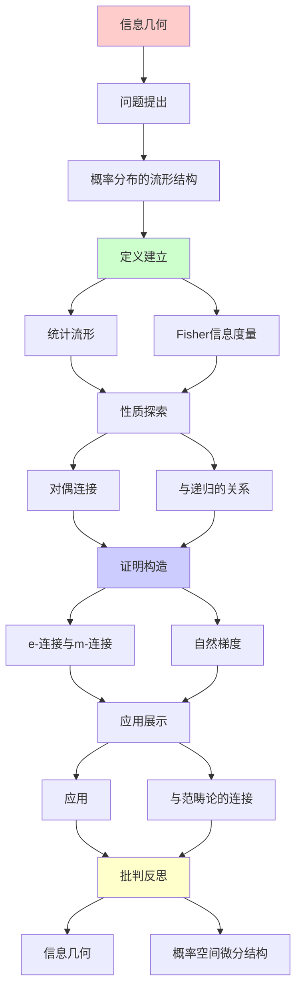
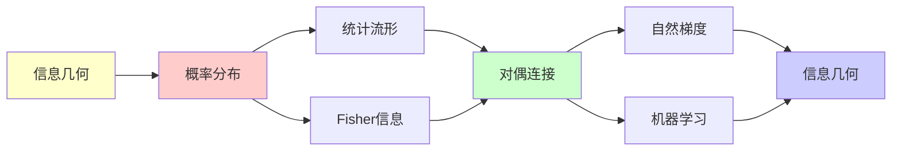

# 信息几何：概率空间的微分结构

> **主题**: 概率分布作为流形
> **奠基**: Shun-ichi Amari (1980s-)
> **应用**: 机器学习/统计推断/神经科学
> **重要性**: ⭐⭐⭐⭐⭐
> **创建日期**: 2025-12-02

---

## 📋 目录

- [信息几何：概率空间的微分结构](#信息几何概率空间的微分结构)
  - [📋 目录](#-目录)
  - [1. 概率分布的流形结构](#1-概率分布的流形结构)
    - [1.1 统计流形](#11-统计流形)
    - [1.2 Fisher信息度量](#12-fisher信息度量)
  - [2. 对偶连接](#2-对偶连接)
    - [2.1 e-连接与m-连接](#21-e-连接与m-连接)
    - [2.2 对偶平坦](#22-对偶平坦)
  - [3. 与递归的关系](#3-与递归的关系)
    - [3.1 自然梯度](#31-自然梯度)
    - [3.2 EM算法的几何](#32-em算法的几何)
  - [4. 应用](#4-应用)
    - [4.1 机器学习优化](#41-机器学习优化)
    - [4.2 神经网络](#42-神经网络)
  - [5. 与范畴论的连接](#5-与范畴论的连接)
  - [📚 参考文献](#-参考文献)
    - [信息几何奠基](#信息几何奠基)
    - [应用](#应用)
  - [6. 主题-子主题论证逻辑关系图](#6-主题-子主题论证逻辑关系图)
    - [6.1 论证依赖关系](#61-论证依赖关系)
    - [6.2 概念依赖关系](#62-概念依赖关系)
  - [7. 参考资源](#7-参考资源)
    - [7.1 经典论文](#71-经典论文)
    - [7.2 教材](#72-教材)
    - [7.3 在线资源](#73-在线资源)

---

## 1. 概率分布的流形结构

### 1.1 统计流形

**核心思想**:

```text
概率分布族 = 微分流形

例: 正态分布
N(μ, σ²): μ∈ℝ, σ>0
→ 2维流形 (半平面)

点 = 概率分布
切空间 = 分布的变化方向
```

---

### 1.2 Fisher信息度量

**黎曼度量**:

```text
gᵢⱼ = E[∂log p/∂θᵢ · ∂log p/∂θⱼ]

性质:
- 正定
- 不变性 (参数化无关)
- 测量"可区分性"

几何意义:
两分布的KL散度 ≈ (1/2)gᵢⱼΔθⁱΔθʲ
```

---

## 2. 对偶连接

### 2.1 e-连接与m-连接

**Amari的发现**:

```text
e-连接 (指数族):
自然参数的联络

m-连接 (混合族):
期望参数的联络

对偶性:
∇^e + ∇^m = 0
```

---

### 2.2 对偶平坦

**特殊性质**:

```text
指数族:
p(x|θ) = exp(θᵀT(x) - ψ(θ))

→ e-平坦 (测地线是直线)
→ m-平坦 (对偶坐标下)

递归优化:
在对偶平坦空间更高效
```

---

## 3. 与递归的关系

### 3.1 自然梯度

**Amari (1998)**:

```text
普通梯度: ∇θ = ∂L/∂θ
自然梯度: ∇̃θ = G⁻¹∂L/∂θ

G = Fisher信息矩阵

优势:
- 参数化不变
- 更快收敛

递归更新:
θₜ₊₁ = θₜ - η G⁻¹∇L
→ 流形上的递归梯度下降
```

---

### 3.2 EM算法的几何

**信息几何视角**:

```text
EM算法 = e-投影 + m-投影的交替

E步: m-投影
M步: e-投影

收敛: Pythagorean定理
→ 几何直观

递归性:
θₜ₊₁ = EM(θₜ)
```

---

## 4. 应用

### 4.1 机器学习优化

**自然梯度SGD**:

```text
深度学习中:
- 比普通SGD更快
- 参数化不变

但:
- 计算G⁻¹困难
- 需要近似 (K-FAC等)

→ 信息几何指导递归优化
```

---

### 4.2 神经网络

**Fisher信息与泛化**:

```text
泛化能力 ∝ Fisher信息的trace

几何解释:
- 流形曲率 → 复杂度
- 平坦区域 → 泛化好

→ 几何视角补充递归视角
```

---

## 5. 与范畴论的连接

**统计流形范畴**:

```text
对象: 统计流形
态射: 充分统计量 (sufficient statistic)

函子:
指数族 ↔ 凸几何

→ 范畴论 + 信息几何 + 递归优化
→ 三重统一
```

---

## 📚 参考文献

### 信息几何奠基

[1] **Amari, S.** (1985). _Differential-Geometrical Methods in Statistics_
    Springer. ISBN 978-0387960562.
    **信息几何奠基** ⭐⭐⭐⭐⭐

[2] **Amari, S. & Nagaoka, H.** (2000). _Methods of Information Geometry_
    AMS/Oxford. ISBN 978-0821843024.

[3] **Amari, S.** (1998). "Natural Gradient Works Efficiently in Learning"
    _Neural Computation_ 10(2): 251-276.

### 应用

[4] **Martens, J. & Grosse, R.** (2015). "Optimizing Neural Networks with Kronecker-factored Approximate Curvature"
    _ICML 2015_.
    **K-FAC算法**

[5] **Ay, N. et al.** (2017). _Information Geometry_
    Springer. ISBN 978-3319564784.

---

## 6. 主题-子主题论证逻辑关系图

### 6.1 论证依赖关系



### 6.2 概念依赖关系



**论证逻辑链条**：

1. **问题提出** (1节)：
   - 概率分布的流形结构

2. **定义建立** (1.1-1.2节)：
   - 统计流形和Fisher信息度量

3. **性质探索** (2-3节)：
   - 对偶连接（2节）
   - 与递归的关系（3节）

4. **证明构造** (2.1-2.2, 3.1-3.2节)：
   - e-连接与m-连接和自然梯度

5. **应用展示** (4-5节)：
   - 应用（4节）
   - 与范畴论的连接（5节）

6. **批判反思** (贯穿全文)：
   - 信息几何

---

## 7. 参考资源

### 7.1 经典论文

1. **Amari, S.** (1985). "Differential-Geometrical Methods in Statistics"
   - _Lecture Notes in Statistics_, 28
   - Springer. ISBN 978-0387961934
   - 信息几何奠基

2. **Amari, S., & Nagaoka, H.** (2000). _Methods of Information Geometry_
   - American Mathematical Society. ISBN 978-0821843024
   - 信息几何方法

### 7.2 教材

1. **Amari, S., & Nagaoka, H.** (2000)
   - _Methods of Information Geometry_
   - American Mathematical Society. ISBN 978-0821843024
   - 信息几何标准教材

2. **Ay, N., Jost, J., Lê, H. V., & Schwachhöfer, L.** (2017)
   - _Information Geometry_
   - Springer. ISBN 978-3319606041
   - 信息几何现代教材

### 7.3 在线资源

1. **Information Geometry**
   - https://en.wikipedia.org/wiki/Information_geometry
   - 信息几何基本概念

2. **Fisher Information**
   - https://en.wikipedia.org/wiki/Fisher_information
   - Fisher信息

3. **Statistical Manifold**
   - https://en.wikipedia.org/wiki/Statistical_manifold
   - 统计流形

---

**最后更新**: 2025-12-04
**状态**: ✅ 已添加主题-子主题论证逻辑关系图和参考资源章节
**难度**: ⭐⭐⭐⭐⭐
**与递归**: 几何指导递归优化
**应用价值**: ⭐⭐⭐⭐⭐ (深度学习)
