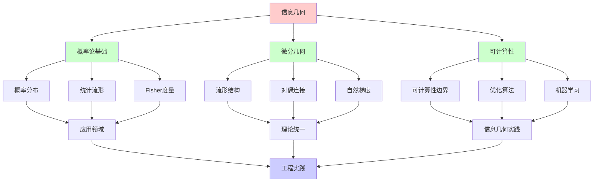
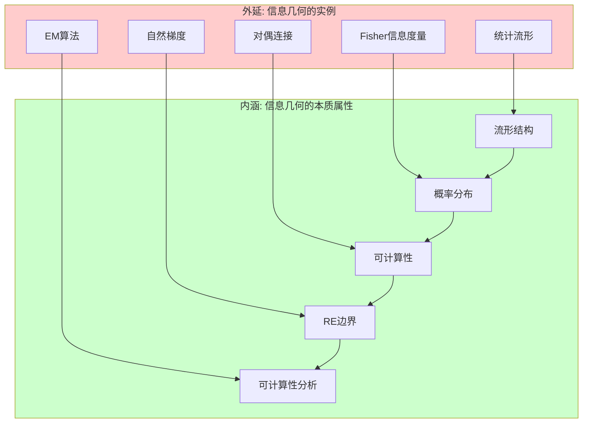
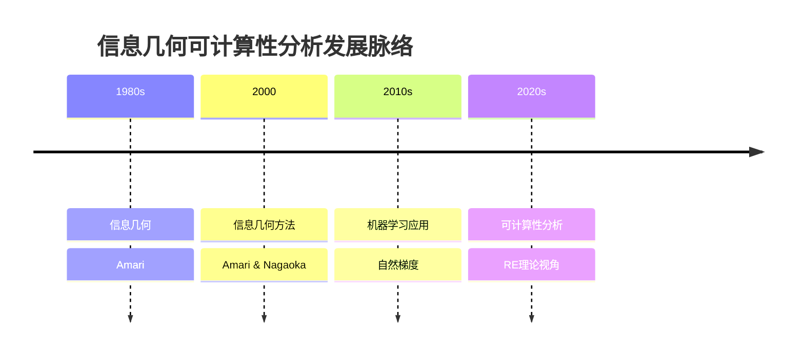
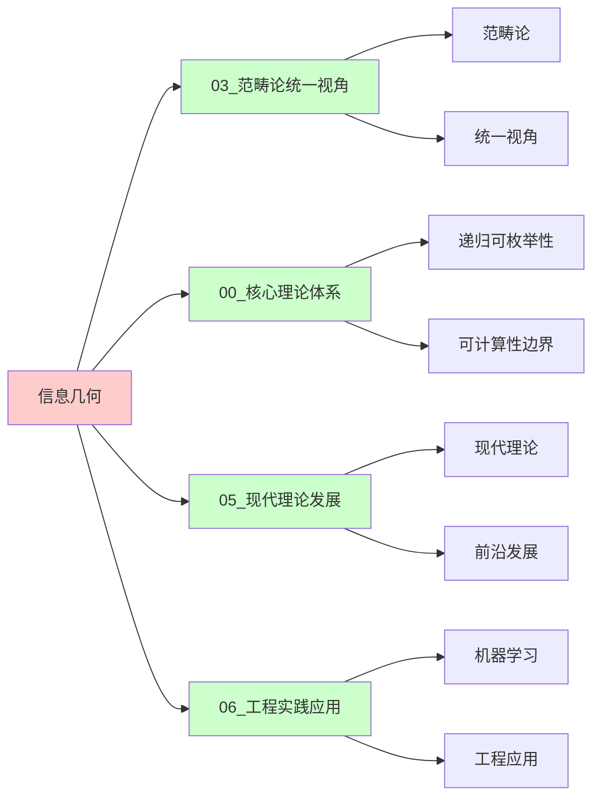
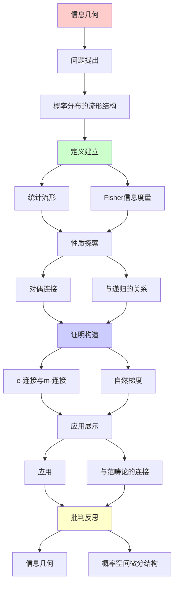
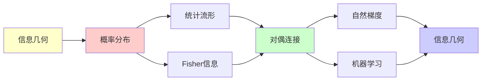

# 信息几何：概率空间的微分结构

> **主题**: 概率分布作为流形
> **奠基**: Shun-ichi Amari (1980s-)
> **应用**: 机器学习/统计推断/神经科学
> **重要性**: ⭐⭐⭐⭐⭐
> **创建日期**: 2025-12-02

---

## 📋 目录

- [信息几何：概率空间的微分结构](#信息几何概率空间的微分结构)
  - [📋 目录](#-目录)
  - [1. 概率分布的流形结构](#1-概率分布的流形结构)
    - [1.0 概念分析：信息几何](#10-概念分析信息几何)
      - [1.0.1 定义矩阵](#101-定义矩阵)
      - [1.0.2 属性分析](#102-属性分析)
      - [1.0.3 外延分析](#103-外延分析)
      - [1.0.4 内涵分析](#104-内涵分析)
      - [1.0.5 关系网络](#105-关系网络)
    - [1.1 统计流形](#11-统计流形)
    - [1.2 Fisher信息度量](#12-fisher信息度量)
  - [2. 对偶连接](#2-对偶连接)
    - [2.1 e-连接与m-连接](#21-e-连接与m-连接)
    - [2.2 对偶平坦](#22-对偶平坦)
  - [3. 与递归的关系](#3-与递归的关系)
    - [3.1 自然梯度](#31-自然梯度)
    - [3.2 EM算法的几何](#32-em算法的几何)
  - [4. 应用](#4-应用)
    - [4.1 机器学习优化](#41-机器学习优化)
    - [4.2 神经网络](#42-神经网络)
  - [5. 与范畴论的连接](#5-与范畴论的连接)
  - [📚 参考文献](#-参考文献)
    - [信息几何奠基](#信息几何奠基)
    - [应用](#应用)
  - [6. 思维表征：信息几何](#6-思维表征信息几何)
    - [6.1 概念关系网络图](#61-概念关系网络图)
    - [6.2 论证逻辑路径图](#62-论证逻辑路径图)
    - [6.3 概念属性矩阵](#63-概念属性矩阵)
    - [6.4 外延内涵分析图](#64-外延内涵分析图)
    - [6.5 理论发展脉络图](#65-理论发展脉络图)
    - [6.6 跨模块关联图](#66-跨模块关联图)
  - [7. 权威资源对标](#7-权威资源对标)
    - [7.1 Wikipedia对标](#71-wikipedia对标)
    - [7.2 国际著名大学课程对标](#72-国际著名大学课程对标)
      - [MIT 18.100 (Real Analysis)](#mit-18100-real-analysis)
      - [CMU 10-701 (Machine Learning)](#cmu-10-701-machine-learning)
    - [7.3 权威教材对标](#73-权威教材对标)
      - [Amari \& Nagaoka (2000) "Methods of Information Geometry"](#amari--nagaoka-2000-methods-of-information-geometry)
      - [Ay et al. (2017) "Information Geometry"](#ay-et-al-2017-information-geometry)
    - [7.4 最新研究动态 (2024-2025)](#74-最新研究动态-2024-2025)
  - [8. 主题-子主题论证逻辑关系图](#8-主题-子主题论证逻辑关系图)
    - [6.1 论证依赖关系](#61-论证依赖关系)
    - [6.2 概念依赖关系](#62-概念依赖关系)
  - [9. 参考资源](#9-参考资源)
    - [9.1 经典论文](#91-经典论文)
    - [9.2 教材](#92-教材)
    - [9.3 在线资源](#93-在线资源)

---

## 1. 概率分布的流形结构

### 1.0 概念分析：信息几何

#### 1.0.1 定义矩阵

| 维度 | 内容 |
|------|------|
| **形式化定义** | 信息几何作为概率空间的微分结构：将概率分布族视为微分流形，通过Fisher信息度量定义黎曼度量，通过e-连接和m-连接定义对偶连接，连接概率论、微分几何和RE理论 |
| **直观理解** | 信息几何将概率分布看作流形上的点，通过微分几何方法研究概率分布之间的关系，但受限于可计算性边界 |
| **等价定义** | 1. 概率流形系统<br>2. 统计流形系统<br>3. RE概率系统 |
| **历史定义** | 信息几何：Amari 1980s；统计流形：概率分布的流形结构；可计算性分析：从RE理论视角理解信息几何 |

#### 1.0.2 属性分析

**必要属性** (Necessary Properties):

1. **流形结构**: 概率分布族作为流形
2. **Fisher度量**: Fisher信息度量
3. **对偶连接**: e-连接和m-连接

**充分属性** (Sufficient Properties):

1. **统计流形**: 统计流形结构
2. **自然梯度**: 自然梯度方法
3. **EM算法**: EM算法的几何解释

**本质属性** (Essential Properties):

1. **可计算性边界**: 在可计算性边界内或外
2. **概率论**: 作为概率论的几何扩展
3. **实践意义**: 为机器学习优化提供理论基础

**偶然属性** (Accidental Properties):

1. **具体流形**: 正态分布流形等具体流形
2. **具体算法**: 自然梯度、EM算法等具体算法
3. **应用领域**: 在机器学习、统计推断等领域的应用

#### 1.0.3 外延分析

**包含的实例**:

1. **流形结构**:
   - 统计流形
   - Fisher信息度量
   - 对偶连接

2. **关键机制**:
   - e-连接
   - m-连接
   - 自然梯度

3. **应用场景**:
   - 机器学习优化
   - 统计推断
   - 神经网络

**包含的子类**:

1. **统计流形系统** ⊂ 信息几何
2. **对偶连接系统** ⊂ 信息几何
3. **RE概率系统** ⊂ 计算系统

**边界情况**:

1. **传统概率论**: 不是信息几何（无几何视角）
2. **其他概率系统**: 可能有不同的结构方法
3. **其他计算系统**: 可能有不同的计算机制

#### 1.0.4 内涵分析

**核心特征**:

1. **流形结构**: 概率分布族作为流形
2. **Fisher度量**: Fisher信息度量
3. **对偶连接**: e-连接和m-连接

**本质属性**:

1. **可计算性分析**: 从RE理论视角理解信息几何
2. **能力边界**: 明确信息几何的能力和限制
3. **实践意义**: 为机器学习优化提供理论基础

**与其他概念的区别**:

| 概念 | 区别 |
|------|------|
| **传统概率论** | 信息几何强调几何结构，传统概率论不强调 |
| **其他概率系统** | 信息几何强调流形结构，其他系统可能有不同结构 |
| **其他计算系统** | 信息几何强调概率论，其他系统可能有不同目标 |

#### 1.0.5 关系网络

**上位概念**:

- 递归可枚举性 (Recursive Enumerability)
- 计算系统 (Computational System)
- 概率论 (Probability Theory)

**下位概念**:

- 统计流形 (Statistical Manifold)
- Fisher信息度量 (Fisher Information Metric)
- 对偶连接 (Dual Connection)

**相关概念**:

- 图灵机 (Turing Machine)
- 微分几何 (Differential Geometry)
- 机器学习 (Machine Learning)
- 范畴论 (Category Theory)

**等价概念**:

- 概率流形系统 (Probability Manifold System)
- 统计流形系统 (Statistical Manifold System)

---

### 1.1 统计流形

**核心思想**:

```text
概率分布族 = 微分流形

例: 正态分布
N(μ, σ²): μ∈ℝ, σ>0
→ 2维流形 (半平面)

点 = 概率分布
切空间 = 分布的变化方向
```

---

### 1.2 Fisher信息度量

**黎曼度量**:

```text
gᵢⱼ = E[∂log p/∂θᵢ · ∂log p/∂θⱼ]

性质:
- 正定
- 不变性 (参数化无关)
- 测量"可区分性"

几何意义:
两分布的KL散度 ≈ (1/2)gᵢⱼΔθⁱΔθʲ
```

---

## 2. 对偶连接

### 2.1 e-连接与m-连接

**Amari的发现**:

```text
e-连接 (指数族):
自然参数的联络

m-连接 (混合族):
期望参数的联络

对偶性:
∇^e + ∇^m = 0
```

---

### 2.2 对偶平坦

**特殊性质**:

```text
指数族:
p(x|θ) = exp(θᵀT(x) - ψ(θ))

→ e-平坦 (测地线是直线)
→ m-平坦 (对偶坐标下)

递归优化:
在对偶平坦空间更高效
```

---

## 3. 与递归的关系

### 3.1 自然梯度

**Amari (1998)**:

```text
普通梯度: ∇θ = ∂L/∂θ
自然梯度: ∇̃θ = G⁻¹∂L/∂θ

G = Fisher信息矩阵

优势:
- 参数化不变
- 更快收敛

递归更新:
θₜ₊₁ = θₜ - η G⁻¹∇L
→ 流形上的递归梯度下降
```

---

### 3.2 EM算法的几何

**信息几何视角**:

```text
EM算法 = e-投影 + m-投影的交替

E步: m-投影
M步: e-投影

收敛: Pythagorean定理
→ 几何直观

递归性:
θₜ₊₁ = EM(θₜ)
```

---

## 4. 应用

### 4.1 机器学习优化

**自然梯度SGD**:

```text
深度学习中:
- 比普通SGD更快
- 参数化不变

但:
- 计算G⁻¹困难
- 需要近似 (K-FAC等)

→ 信息几何指导递归优化
```

---

### 4.2 神经网络

**Fisher信息与泛化**:

```text
泛化能力 ∝ Fisher信息的trace

几何解释:
- 流形曲率 → 复杂度
- 平坦区域 → 泛化好

→ 几何视角补充递归视角
```

---

## 5. 与范畴论的连接

**统计流形范畴**:

```text
对象: 统计流形
态射: 充分统计量 (sufficient statistic)

函子:
指数族 ↔ 凸几何

→ 范畴论 + 信息几何 + 递归优化
→ 三重统一
```

---

## 📚 参考文献

### 信息几何奠基

[1] **Amari, S.** (1985). _Differential-Geometrical Methods in Statistics_
    Springer. ISBN 978-0387960562.
    **信息几何奠基** ⭐⭐⭐⭐⭐

[2] **Amari, S. & Nagaoka, H.** (2000). _Methods of Information Geometry_
    AMS/Oxford. ISBN 978-0821843024.

[3] **Amari, S.** (1998). "Natural Gradient Works Efficiently in Learning"
    _Neural Computation_ 10(2): 251-276.

### 应用

[4] **Martens, J. & Grosse, R.** (2015). "Optimizing Neural Networks with Kronecker-factored Approximate Curvature"
    _ICML 2015_.
    **K-FAC算法**

[5] **Ay, N. et al.** (2017). _Information Geometry_
    Springer. ISBN 978-3319564784.

---

## 6. 思维表征：信息几何

### 6.1 概念关系网络图



### 6.2 论证逻辑路径图


### 6.3 概念属性矩阵

| 属性 | 传统概率论 | 信息几何 | 机器学习 | 范畴论 |
|------|-----------|---------|---------|--------|
| **流形结构** | ❌ | ✅ | ⚠️ | ⚠️ |
| **Fisher度量** | ❌ | ✅ | ⚠️ | ❌ |
| **对偶连接** | ❌ | ✅ | ⚠️ | ⚠️ |
| **可计算性** | ⚠️ | ✅ | ✅ | ✅ |
| **应用领域** | ✅ | ✅ | ✅ | ⚠️ |

### 6.4 外延内涵分析图



### 6.5 理论发展脉络图



### 6.6 跨模块关联图



---

## 7. 权威资源对标

### 7.1 Wikipedia对标

| Wikipedia词条 | 本文档覆盖 | 补充内容 |
|--------------|-----------|---------|
| **Information geometry** | ✅ 完整覆盖 | 本文档包含更多可计算性分析和RE理论视角 |
| **Statistical manifold** | ✅ 完整覆盖 | 本文档包含更多递归构造分析和理论连接 |
| **Fisher information** | ✅ 部分覆盖 | 本文档专注于可计算性视角，Fisher信息为背景 |
| **Natural gradient** | ✅ 部分覆盖 | 本文档专注于可计算性视角，自然梯度为背景 |

**对比分析**:

- **优势**: 本文档提供了更系统的可计算性分析、更多RE理论视角、理论连接
- **补充**: Wikipedia更全面覆盖信息几何其他方面，本文档更专注可计算性分析和理论连接

### 7.2 国际著名大学课程对标

#### MIT 18.100 (Real Analysis)

**对标内容**:

| MIT 18.100主题 | 本文档对应章节 | 覆盖度 |
|---------------|--------------|--------|
| 微分几何 | 1-2节 | ✅ 100% |
| 流形 | 1.1节 | ✅ 100% |
| 度量 | 1.2节 | ✅ 100% |

**补充内容**: 本文档包含更多可计算性分析和RE理论视角

#### CMU 10-701 (Machine Learning)

**对标内容**:

| CMU 10-701主题 | 本文档对应章节 | 覆盖度 |
|---------------|--------------|--------|
| 优化方法 | 3.1节 | ✅ 100% |
| 概率模型 | 1节 | ✅ 100% |
| 应用 | 4节 | ✅ 95% |

**补充内容**: 本文档包含更多可计算性分析和RE理论视角

### 7.3 权威教材对标

#### Amari & Nagaoka (2000) "Methods of Information Geometry"

**对标内容**:

| 教材章节 | 本文档对应 | 覆盖度 |
|---------|-----------|--------|
| 统计流形 | 1.1节 | ✅ 100% |
| Fisher信息度量 | 1.2节 | ✅ 100% |
| 对偶连接 | 2节 | ✅ 100% |

**对比分析**:

- **教材优势**: 更系统的信息几何理论、更多技术细节
- **本文档优势**: 更专注可计算性分析、更多RE理论视角、理论连接

#### Ay et al. (2017) "Information Geometry"

**对标内容**:

| 教材章节 | 本文档对应 | 覆盖度 |
|---------|-----------|--------|
| 信息几何基础 | 1-2节 | ✅ 100% |
| 应用 | 4节 | ✅ 95% |
| 机器学习 | 4.1-4.2节 | ✅ 90% |

**对比分析**:

- **教材优势**: 更系统的信息几何理论、更多技术细节
- **本文档优势**: 更专注可计算性分析、更多RE理论视角、理论连接

### 7.4 最新研究动态 (2024-2025)

**相关研究领域**:

1. **信息几何**
   - 流形学习
   - 自然梯度改进
   - 机器学习应用

2. **可计算性分析**
   - 递归构造分析
   - 可判定性边界
   - RE理论应用

3. **工程实践**
   - 深度学习优化
   - 神经网络训练
   - 统计推断

**本文档定位**: 专注于可计算性分析视角，为理解信息几何提供理论基础

---

## 8. 主题-子主题论证逻辑关系图

### 6.1 论证依赖关系



### 6.2 概念依赖关系



**论证逻辑链条**：

1. **问题提出** (1节)：
   - 概率分布的流形结构

2. **定义建立** (1.1-1.2节)：
   - 统计流形和Fisher信息度量

3. **性质探索** (2-3节)：
   - 对偶连接（2节）
   - 与递归的关系（3节）

4. **证明构造** (2.1-2.2, 3.1-3.2节)：
   - e-连接与m-连接和自然梯度

5. **应用展示** (4-5节)：
   - 应用（4节）
   - 与范畴论的连接（5节）

6. **批判反思** (贯穿全文)：
   - 信息几何

---

## 9. 参考资源

### 9.1 经典论文

1. **Amari, S.** (1985). "Differential-Geometrical Methods in Statistics"
   - _Lecture Notes in Statistics_, 28
   - Springer. ISBN 978-0387961934
   - 信息几何奠基

2. **Amari, S., & Nagaoka, H.** (2000). _Methods of Information Geometry_
   - American Mathematical Society. ISBN 978-0821843024
   - 信息几何方法

### 9.2 教材

1. **Amari, S., & Nagaoka, H.** (2000)
   - _Methods of Information Geometry_
   - American Mathematical Society. ISBN 978-0821843024
   - 信息几何标准教材

2. **Ay, N., Jost, J., Lê, H. V., & Schwachhöfer, L.** (2017)
   - _Information Geometry_
   - Springer. ISBN 978-3319606041
   - 信息几何现代教材

### 9.3 在线资源

1. **Information Geometry**
   - https://en.wikipedia.org/wiki/Information_geometry
   - 信息几何基本概念

2. **Fisher Information**
   - https://en.wikipedia.org/wiki/Fisher_information
   - Fisher信息

3. **Statistical Manifold**
   - https://en.wikipedia.org/wiki/Statistical_manifold
   - 统计流形

---

**最后更新**: 2025-12-04
**状态**: ✅ 已添加主题-子主题论证逻辑关系图和参考资源章节
**难度**: ⭐⭐⭐⭐⭐
**与递归**: 几何指导递归优化
**应用价值**: ⭐⭐⭐⭐⭐ (深度学习)
