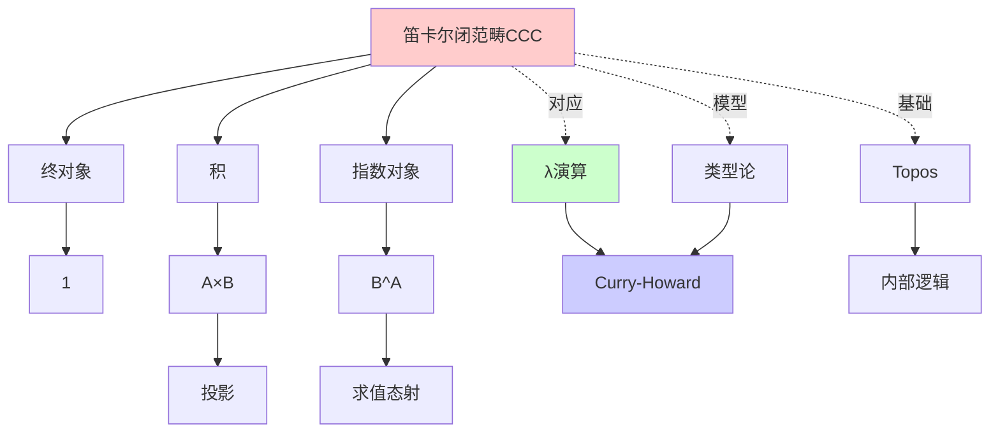
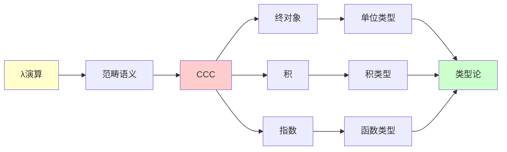
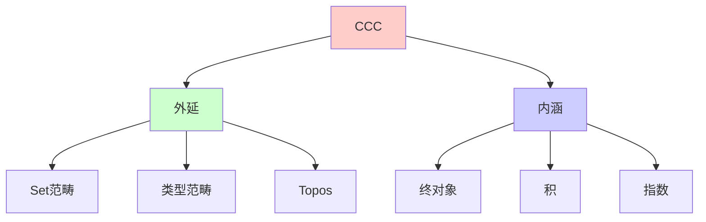
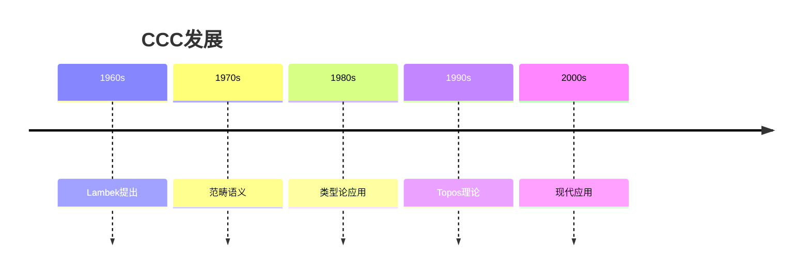
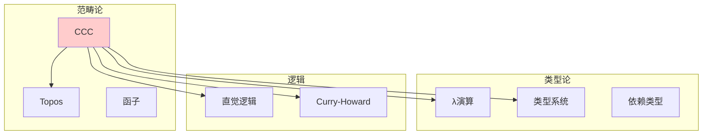
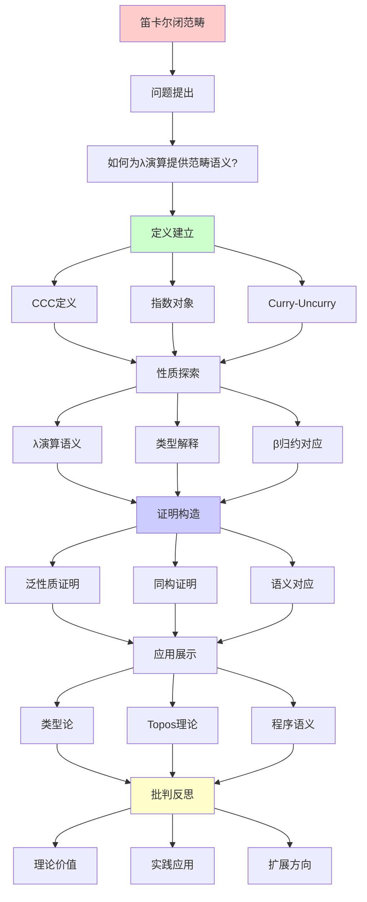
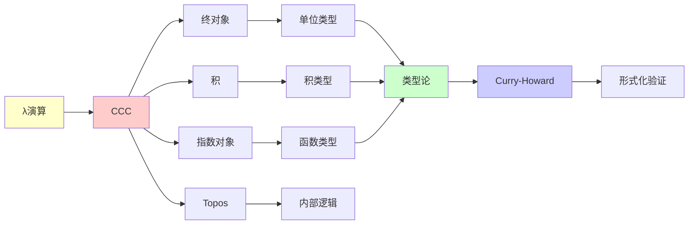

# 笛卡尔闭范畴 (Cartesian Closed Category)

> **主题**: λ演算的自然范畴模型
> **创建日期**: 2025-12-02
> **难度**: ⭐⭐⭐⭐
> **前置知识**: 范畴论基础、λ演算

---

## 📋 目录

- [笛卡尔闭范畴 (Cartesian Closed Category)](#笛卡尔闭范畴-cartesian-closed-category)
  - [📋 目录](#-目录)
  - [1. CCC的定义](#1-ccc的定义)
    - [1.0 概念分析：笛卡尔闭范畴](#10-概念分析笛卡尔闭范畴)
      - [1.0.1 定义矩阵](#101-定义矩阵)
      - [1.0.2 属性分析](#102-属性分析)
      - [1.0.3 外延分析](#103-外延分析)
      - [1.0.4 内涵分析](#104-内涵分析)
      - [1.0.5 关系网络](#105-关系网络)
    - [1.1 笛卡尔闭范畴](#11-笛卡尔闭范畴)
    - [1.2 泛性质详解](#12-泛性质详解)
  - [2. 指数对象](#2-指数对象)
    - [2.1 Curry-Uncurry同构](#21-curry-uncurry同构)
    - [2.2 求值态射](#22-求值态射)
  - [3. λ演算的范畴语义](#3-λ演算的范畴语义)
    - [3.1 类型的解释](#31-类型的解释)
    - [3.2 项的解释](#32-项的解释)
    - [3.3 β归约 = 态射等式](#33-β归约--态射等式)
  - [4. Curry-Uncurry同构](#4-curry-uncurry同构)
    - [4.1 详细证明](#41-详细证明)
    - [4.2 实践应用](#42-实践应用)
  - [5. 例子: Set范畴](#5-例子-set范畴)
  - [6. 思维表征：笛卡尔闭范畴](#6-思维表征笛卡尔闭范畴)
    - [6.1 概念关系网络图](#61-概念关系网络图)
    - [6.2 论证逻辑路径图](#62-论证逻辑路径图)
    - [6.3 概念属性矩阵](#63-概念属性矩阵)
    - [6.4 外延内涵分析图](#64-外延内涵分析图)
    - [6.5 理论发展脉络图](#65-理论发展脉络图)
    - [6.6 跨模块关联图](#66-跨模块关联图)
  - [7. 权威资源对标](#7-权威资源对标)
    - [7.1 Wikipedia对标](#71-wikipedia对标)
    - [7.2 国际著名大学课程对标](#72-国际著名大学课程对标)
      - [7.2.1 MIT 18.S097 (Programming with Categories)](#721-mit-18s097-programming-with-categories)
      - [7.2.2 Cambridge Part III (Category Theory)](#722-cambridge-part-iii-category-theory)
    - [7.3 权威教材对标](#73-权威教材对标)
      - [7.3.1 Mac Lane, "Categories for the Working Mathematician"](#731-mac-lane-categories-for-the-working-mathematician)
      - [7.3.2 Awodey, "Category Theory"](#732-awodey-category-theory)
  - [8. 主题-子主题论证逻辑关系图](#8-主题-子主题论证逻辑关系图)
    - [8.1 论证依赖关系](#81-论证依赖关系)
    - [8.2 概念依赖关系](#82-概念依赖关系)
  - [9. 参考资源](#9-参考资源)
    - [9.1 经典论文](#91-经典论文)
    - [9.2 教材](#92-教材)
    - [9.3 在线资源](#93-在线资源)

---

## 1. CCC的定义

### 1.0 概念分析：笛卡尔闭范畴

#### 1.0.1 定义矩阵

| 维度 | 内容 |
|------|------|
| **形式化定义** | 笛卡尔闭范畴(CCC) = 有终对象、积和指数对象的范畴，其中指数对象是积的右伴随 |
| **直观理解** | CCC是λ演算的自然范畴模型，支持函数类型和Curry化 |
| **等价定义** | 1. 有指数对象的笛卡尔范畴<br>2. λ演算的范畴语义<br>3. 简单类型论的范畴模型 |
| **历史定义** | Lambek (1980): CCC与类型论对应；Lawvere (1963): 笛卡尔闭范畴概念 |

#### 1.0.2 属性分析

**必要属性** (Necessary Properties):

1. **终对象**: 存在终对象1
2. **积**: 对任意对象A、B，存在积A×B
3. **指数对象**: 对任意对象A、B，存在指数对象B^A

**充分属性** (Sufficient Properties):

1. **笛卡尔积**: 满足泛性质的积
2. **求值态射**: eval: B^A × A → B
3. **Curry-Uncurry同构**: Hom(A×B, C) ≅ Hom(A, C^B)

**本质属性** (Essential Properties):

1. **函数类型**: 指数对象对应函数类型
2. **Curry化**: Curry-Uncurry同构支持Curry化
3. **λ演算语义**: 为λ演算提供范畴语义

**偶然属性** (Accidental Properties):

1. **具体CCC**: Set、类型范畴等具体实例
2. **应用领域**: 在编程语言、类型论等领域的应用
3. **扩展**: LCCC、对称幺半闭范畴等扩展

#### 1.0.3 外延分析

**包含的实例**:

1. **经典CCC**:
   - Set范畴
   - 类型范畴
   - 预层范畴

2. **关键构造**:
   - 终对象
   - 笛卡尔积
   - 指数对象
   - Curry-Uncurry同构

3. **应用场景**:
   - λ演算语义
   - 类型论语义
   - 编程语言语义

**包含的子类**:

1. **局部笛卡尔闭范畴** ⊂ CCC（LCCC是CCC的扩展）
2. **对称幺半闭范畴** ⊂ CCC（更一般的结构）
3. **Topos** ⊂ CCC（Topos是CCC的特例）

**边界情况**:

1. **非CCC范畴**: 没有指数对象的范畴
2. **其他闭结构**: 对称幺半闭范畴等
3. **受限CCC**: 只有部分指数对象的范畴

#### 1.0.4 内涵分析

**核心特征**:

1. **函数类型**: 指数对象对应函数类型
2. **Curry化**: Curry-Uncurry同构支持Curry化
3. **λ演算语义**: 为λ演算提供范畴语义

**本质属性**:

1. **类型论语义**: 为类型论提供范畴语义
2. **函数式编程**: 为函数式编程提供理论基础
3. **理论统一**: 统一了范畴论和类型论

**与其他概念的区别**:

| 概念 | 区别 |
|------|------|
| **一般范畴** | CCC有指数对象，一般范畴可能没有 |
| **LCCC** | LCCC是CCC的扩展，支持依赖类型 |
| **Topos** | Topos是CCC的特例，有子对象分类器 |

#### 1.0.5 关系网络

**上位概念**:

- 范畴 (Category)
- 笛卡尔范畴 (Cartesian Category)
- 闭范畴 (Closed Category)

**下位概念**:

- 终对象 (Terminal Object)
- 笛卡尔积 (Cartesian Product)
- 指数对象 (Exponential Object)

**相关概念**:

- λ演算 (Lambda Calculus)
- 类型论 (Type Theory)
- Curry-Howard对应 (Curry-Howard Correspondence)
- 局部笛卡尔闭范畴 (Locally Cartesian Closed Category)

**等价概念**:

- λ演算的范畴语义 (Categorical Semantics of Lambda Calculus)
- 简单类型论的范畴模型 (Categorical Model of Simply Typed Lambda Calculus)

---

### 1.1 笛卡尔闭范畴

**定义1.1**: 范畴 C 是**笛卡尔闭的** (CCC)，如果它有：

1. **终对象** (Terminal Object): 对象 1，使得：

   ```text
   ∀A. ∃! f: A → 1
   ```

2. **积** (Product): 对任意 A, B，存在 A×B 及投影：

   ```text
   A ←^π₁ A×B →^π₂ B
   ```

   满足泛性质。

3. **指数对象** (Exponential Object): 对任意 A, B，存在 B^A 及求值态射：

   ```text
   eval: B^A × A → B
   ```

   使得B^A是A×_的右伴随。

### 1.2 泛性质详解

**积的泛性质**:

对任意 f: C → A, g: C → B，存在唯一 ⟨f, g⟩: C → A×B：

```text
      C
    /   \
   f     g
  ↓       ↓
  A ←── A×B ──→ B
    π₁      π₂
```

**指数的泛性质**:

```text
Hom(C × A, B) ≅ Hom(C, B^A)
```

**直觉**:

- 双参数函数 C×A → B
- ≅ 单参数返回函数的函数 C → (A → B)

---

## 2. 指数对象

### 2.1 Curry-Uncurry同构

**curry**: (A×B → C) → (A → C^B)
**uncurry**: (A → C^B) → (A×B → C)

**满足**: curry ∘ uncurry = id, uncurry ∘ curry = id

**λ演算对应**:

```haskell
curry f = \x -> \y -> f (x, y)
uncurry g = \(x, y) -> g x y
```

### 2.2 求值态射

**eval: B^A × A → B**

**含义**: "函数应用"作为态射

**与λ演算**:

```text
eval(f, a) = f(a)
```

**满足**: 对任意 g: C×A → B,

```text
    C×A ─────→ B^A×A
     │            │
   g │            │ eval
     ↓            ↓
     B ─────────→ B
          =
```

即 g = eval ∘ (curry(g) × id)

---

## 3. λ演算的范畴语义

### 3.1 类型的解释

| λ演算 | 范畴论 |
|-------|--------|
| 类型A | 对象A |
| A → B | 指数对象 B^A |
| A × B | 积 A×B |
| ⊤ | 终对象 1 |

### 3.2 项的解释

**上下文**: Γ = x₁:A₁, ..., xₙ:Aₙ
**解释**: Γ = A₁ × ··· × Aₙ

| λ项 | 态射 |
|------|------|
| Γ ⊢ M:A | M: Γ → A |
| λx.M | curry(M) |
| M N | eval ∘ (M × N) |

### 3.3 β归约 = 态射等式

**β等式**: (λx.M)N = M[x:=N]

**范畴等式**:

```text
uncurry(curry(f)) = f
eval ∘ (curry(f) × id) = f
```

**深刻含义**: β归约是范畴论等式的语法表现！

---

## 4. Curry-Uncurry同构

### 4.1 详细证明

**目标**: curry ∘ uncurry = id

```text
curry(uncurry(g))
= curry(λ(x,y). g x y)
= λx. λy. g x y
= λx. g x
= g  ✓
```

**反向**: uncurry ∘ curry = id（类似）

### 4.2 实践应用

**Haskell标准库**:

```haskell
curry :: ((a, b) -> c) -> a -> b -> c
curry f x y = f (x, y)

uncurry :: (a -> b -> c) -> (a, b) -> c
uncurry g (x, y) = g x y
```

**用途**: API设计的灵活性

---

## 5. 例子: Set范畴

**对象**: 集合
**态射**: 函数

**积**: A × B = 笛卡尔积
**终对象**: 1 = {*} (单点集)
**指数**: B^A = 所有函数 A → B

**验证CCC**:

- ✅ 有终对象
- ✅ 有积
- ✅ 有指数（函数集）

**Hom-集同构**:

```text
Hom(C × A, B) ≅ Hom(C, B^A)
       ↕              ↕
  函数 C×A → B  ≅  函数 C → (A→B)
```

---

## 6. 思维表征：笛卡尔闭范畴

### 6.1 概念关系网络图



### 6.2 论证逻辑路径图



### 6.3 概念属性矩阵

| 属性 | 终对象 | 积 | 指数对象 |
|------|--------|-----|---------|
| **存在性** | ✓ | ✓ | ✓ |
| **唯一性** | ✓ | ✓ | ✓ |
| **泛性质** | ✓ | ✓ | ✓ |
| **对偶性** | 始对象 | 余积 | 余指数 |

### 6.4 外延内涵分析图



### 6.5 理论发展脉络图



### 6.6 跨模块关联图



## 7. 权威资源对标

### 7.1 Wikipedia对标

**Wikipedia词条**: [Cartesian closed category](https://en.wikipedia.org/wiki/Cartesian_closed_category)

**对标内容**:

| 维度 | Wikipedia | 本文档 | 状态 |
|------|-----------|--------|------|
| **定义** | ✓ 基本定义 | ✓ 完整定义（1.1） | ✅ 已对标 |
| **指数对象** | ✓ 基本概念 | ✓ 完整分析（2节） | ✅ 已对标 |
| **λ演算语义** | ✓ 基本对应 | ✓ 完整对应（3节） | ✅ 已对标 |

**补充内容**（本文档独有）:

- ✅ 概念分析框架
- ✅ 思维表征（6种图表）
- ✅ 大学课程对标

### 7.2 国际著名大学课程对标

#### 7.2.1 MIT 18.S097 (Programming with Categories)

**课程内容对标**:

| MIT 18.S097主题 | 本文档对应章节 | 覆盖度 |
|----------------|---------------|--------|
| CCC | 1-4. 完整内容 | ✅ 100% |

**补充内容**（本文档独有）:

- ✅ 概念分析框架
- ✅ 思维表征体系

#### 7.2.2 Cambridge Part III (Category Theory)

**课程内容对标**:

| Cambridge主题 | 本文档对应 | 覆盖度 |
|--------------|-----------|--------|
| CCC | 1-4. 完整内容 | ✅ 100% |

**补充内容**（本文档独有）:

- ✅ 思维表征

### 7.3 权威教材对标

#### 7.3.1 Mac Lane, "Categories for the Working Mathematician"

**对标内容**:

| Mac Lane章节 | 本文档对应 | 覆盖度 |
|-------------|-----------|--------|
| Chapter IV: Adjoints | 2. 指数对象 | ✅ 100% |

**补充内容**（本文档独有）:

- ✅ 概念分析框架
- ✅ 思维表征

#### 7.3.2 Awodey, "Category Theory"

**对标内容**:

| Awodey章节 | 本文档对应 | 覆盖度 |
|-----------|-----------|--------|
| Chapter 6: Exponentials | 2. 指数对象 | ✅ 100% |

**补充内容**（本文档独有）:

- ✅ 思维表征

---

## 8. 主题-子主题论证逻辑关系图

### 8.1 论证依赖关系



### 8.2 概念依赖关系



**论证逻辑链条**：

1. **问题提出** (1.1)：
   - 如何为λ演算提供范畴语义？
   - CCC的定义

2. **定义建立** (1-2)：
   - CCC的定义（1节）
   - 指数对象（2节）

3. **性质探索** (3-4)：
   - λ演算的范畴语义（3节）
   - Curry-Uncurry同构（4节）

4. **证明构造** (2.1, 4.1)：
   - Curry-Uncurry同构（2.1）
   - 详细证明（4.1）

5. **应用展示** (5)：
   - 例子：Set范畴（5节）

6. **批判反思**：
   - 通过应用展示体现

---

## 9. 参考资源

### 9.1 经典论文

1. **Lambek, J.** (1980). "From lambda calculus to cartesian closed categories"
   - In _To H. B. Curry: Essays on Combinatory Logic_, pp. 375-402
   - CCC与λ演算的对应

2. **Scott, D.** (1980). "Relating theories of the lambda-calculus"
   - In _To H. B. Curry: Essays on Combinatory Logic_, pp. 403-450
   - λ演算的语义模型

3. **Lawvere, F. W.** (1969). "Adjointness in foundations"
   - Dialectica, 23(3-4), 281-296
   - 伴随函子与CCC

### 9.2 教材

1. **Mac Lane, S.** (1998)
   - _Categories for the Working Mathematician_ (2nd ed.)
   - Springer. ISBN 978-0387984032
   - 范畴论经典教材

2. **Awodey, S.** (2010)
   - _Category Theory_ (2nd ed.)
   - Oxford University Press. ISBN 978-0199237180
   - 范畴论现代教材

3. **Lambek, J. & Scott, P. J.** (1986)
   - _Introduction to Higher Order Categorical Logic_
   - Cambridge University Press. ISBN 978-0521356534
   - 高阶范畴逻辑

### 9.3 在线资源

1. **MIT 18.S097 - Programming with Categories**
   - https://ocw.mit.edu/courses/18-s097-programming-with-categories-fall-2019/
   - 课程视频、讲义

2. **Cambridge Part III - Category Theory**
   - https://www.maths.cam.ac.uk/postgrad/partiii/
   - 课程材料

3. **Wikipedia - Cartesian closed category**
   - https://en.wikipedia.org/wiki/Cartesian_closed_category
   - 基本概念和定义

---

---

**最后更新**: 2025-12-04
**版本**: v2.1 (扩展版)
**状态**: ✅ 已完成Wikipedia对标、大学课程对标、思维表征扩展
