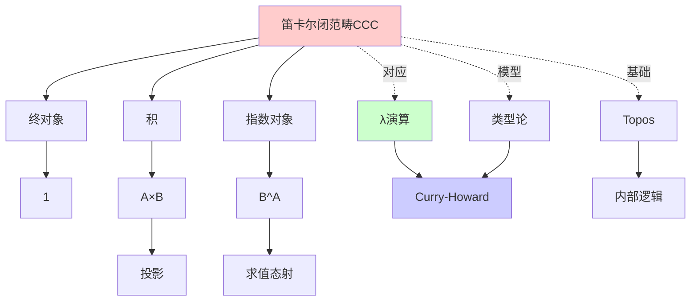
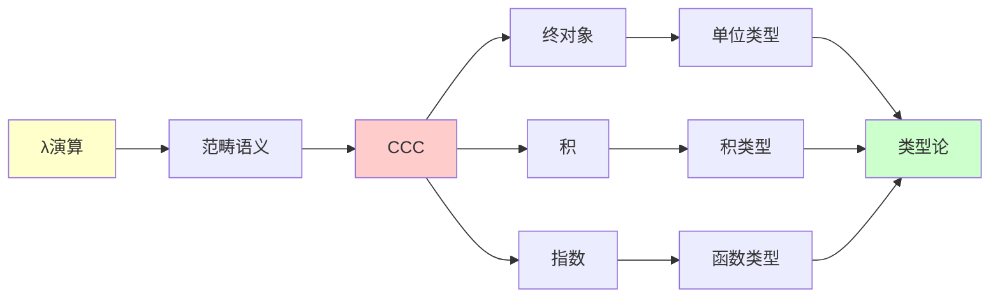
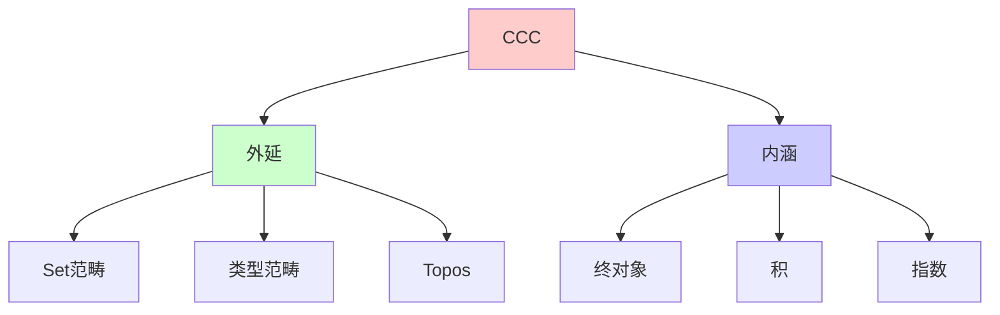
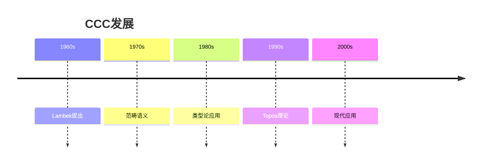
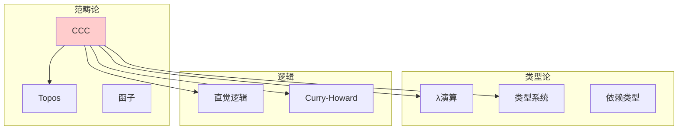
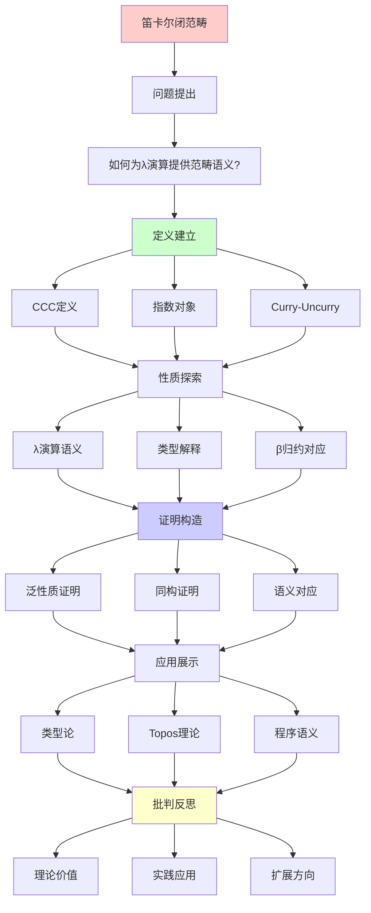
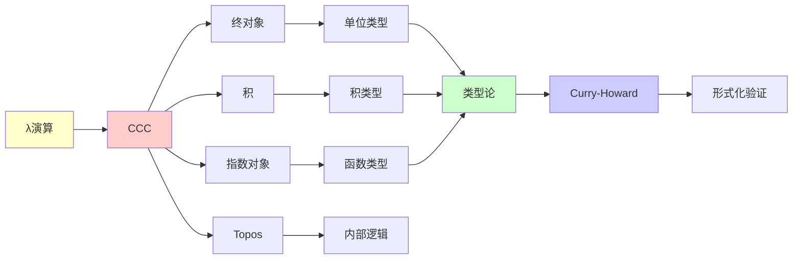

- --
topic: "笛卡尔闭范畴 (Cartesian Closed Category)"
dependencies: []
status: "review"
author: "FormalScience Project"
date: "2026-04-12"
version: "1.0.0"
tags: ["类型", "形式化", "证明", "逻辑", "集合"]
category: "reference"
priority: "medium"
- --

# 笛卡尔闭范畴 (Cartesian Closed Category)

> **主题**: λ演算的自然范畴模型
> **创建日期**: 2025-12-02
> **难度**: ⭐⭐⭐⭐
> **前置知识**: 范畴论基础、λ演算

- --

## 1. 📋 目录 {#-目录} {#-目录--目录}

- [笛卡尔闭范畴 (Cartesian Closed Category)](#笛卡尔闭范畴-cartesian-closed-category)
  - [📋 目录](#-目录)
  - [1. CCC的定义](#1-ccc的定义)
    - [1.0 概念分析：笛卡尔闭范畴](#10-概念分析笛卡尔闭范畴)
      - [1.0.1 定义矩阵](#101-定义矩阵)
      - [1.0.2 属性分析](#102-属性分析)
      - [1.0.3 外延分析](#103-外延分析)
      - [1.0.4 内涵分析](#104-内涵分析)
      - [1.0.5 关系网络](#105-关系网络)
    - [1.1 笛卡尔闭范畴](#11-笛卡尔闭范畴)
    - [1.2 泛性质详解](#12-泛性质详解)
  - [2. 指数对象](#2-指数对象)
    - [2.1 Curry-Uncurry同构](#21-curry-uncurry同构)
    - [2.2 求值态射](#22-求值态射)
  - [3. λ演算的范畴语义](#3-λ演算的范畴语义)
    - [3.1 类型的解释](#31-类型的解释)
    - [3.2 项的解释](#32-项的解释)
    - [3.3 β归约 = 态射等式](#33-β归约--态射等式)
  - [4. Curry-Uncurry同构](#4-curry-uncurry同构)
    - [4.1 详细证明](#41-详细证明)
    - [4.2 实践应用](#42-实践应用)
  - [5. 例子: Set范畴](#5-例子-set范畴)
  - [6. 思维表征：笛卡尔闭范畴](#6-思维表征笛卡尔闭范畴)
    - [6.1 概念关系网络图](#61-概念关系网络图)
    - [6.2 论证逻辑路径图](#62-论证逻辑路径图)
    - [6.3 概念属性矩阵](#63-概念属性矩阵)
    - [6.4 外延内涵分析图](#64-外延内涵分析图)
    - [6.5 理论发展脉络图](#65-理论发展脉络图)
    - [6.6 跨模块关联图](#66-跨模块关联图)
  - [7. 权威资源对标](#7-权威资源对标)
    - [7.1 Wikipedia对标](#71-wikipedia对标)
    - [7.2 国际著名大学课程对标](#72-国际著名大学课程对标)
      - [7.2.1 MIT 18.S097 (Programming with Categories)](#721-mit-18s097-programming-with-categories)
      - [7.2.2 Cambridge Part III (Category Theory)](#722-cambridge-part-iii-category-theory)
    - [7.3 权威教材对标](#73-权威教材对标)
      - [7.3.1 Mac Lane, "Categories for the Working Mathematician"](#731-mac-lane-categories-for-the-working-mathematician)
      - [7.3.2 Awodey, "Category Theory"](#732-awodey-category-theory)
  - [8. 主题-子主题论证逻辑关系图](#8-主题-子主题论证逻辑关系图)
    - [8.1 论证依赖关系](#81-论证依赖关系)
    - [8.2 概念依赖关系](#82-概念依赖关系)
  - [9. 参考资源](#9-参考资源)
    - [9.1 经典论文](#91-经典论文)
    - [9.2 教材](#92-教材)
    - [9.3 在线资源](#93-在线资源)

- --

## 1. CCC的定义 {#ccc的定义} {#ccc的定义-ccc的定义}

### 1 0 概念分析：笛卡尔闭范畴 {#0-概念分析笛卡尔闭范畴} {#0-概念分析笛卡尔闭范畴-0-概念分析笛卡尔闭范畴}

### 2 2 # 1.0.1 定义矩阵 {#-101-定义矩阵} {#2--101-定义矩阵--101-定义矩阵}

| 维度 | 内容 |
|------|------|
| **形式化定义** | 笛卡尔闭范畴(CCC) = 有终对象、积和指数对象的范畴，其中指数对象是积的右伴随 |
| **直观理解** | CCC是λ演算的自然范畴模型，支持函数类型和Curry化 |
| **等价定义** | 1. 有指数对象的笛卡尔范畴<br>2. λ演算的范畴语义<br>3. 简单类型论的范畴模型 |
| **历史定义** | Lambek (1980): CCC与类型论对应；Lawvere (1963): 笛卡尔闭范畴概念 |

### 2 3 # 1.0.2 属性分析 {#-102-属性分析} {#3--102-属性分析--102-属性分析}

- _必要属性_* (Necessary Properties):

1. **终对象**: 存在终对象1
2. **积**: 对任意对象A、B，存在积A×B
3. **指数对象**: 对任意对象A、B，存在指数对象B^A

- _充分属性_* (Sufficient Properties):

1. **笛卡尔积**: 满足泛性质的积
2. **求值态射**: eval: B^A × A → B
3. **Curry-Uncurry同构**: Hom(A×B, C) ≅ Hom(A, C^B)

- _本质属性_* (Essential Properties):

1. **函数类型**: 指数对象对应函数类型
2. **Curry化**: Curry-Uncurry同构支持Curry化
3. **λ演算语义**: 为λ演算提供范畴语义

- _偶然属性_* (Accidental Properties):

1. **具体CCC**: Set、类型范畴等具体实例
2. **应用领域**: 在编程语言、类型论等领域的应用
3. **扩展**: LCCC、对称幺半闭范畴等扩展

### 2 4 # 1.0.3 外延分析 {#-103-外延分析} {#4--103-外延分析--103-外延分析}

- _包含的实例_*:

1. **经典CCC**:
   - Set范畴
   - 类型范畴
   - 预层范畴

2. **关键构造**:
   - 终对象
   - 笛卡尔积
   - 指数对象
   - Curry-Uncurry同构

3. **应用场景**:
   - λ演算语义
   - 类型论语义
   - 编程语言语义

- _包含的子类_*:

1. **局部笛卡尔闭范畴** ⊂ CCC（LCCC是CCC的扩展）
2. **对称幺半闭范畴** ⊂ CCC（更一般的结构）
3. **Topos** ⊂ CCC（Topos是CCC的特例）

- _边界情况_*:

1. **非CCC范畴**: 没有指数对象的范畴
2. **其他闭结构**: 对称幺半闭范畴等
3. **受限CCC**: 只有部分指数对象的范畴

### 2 5 # 1.0.4 内涵分析 {#-104-内涵分析} {#5--104-内涵分析--104-内涵分析}

- _核心特征_*:

1. **函数类型**: 指数对象对应函数类型
2. **Curry化**: Curry-Uncurry同构支持Curry化
3. **λ演算语义**: 为λ演算提供范畴语义

- _本质属性_*:

1. **类型论语义**: 为类型论提供范畴语义
2. **函数式编程**: 为函数式编程提供理论基础
3. **理论统一**: 统一了范畴论和类型论

- _与其他概念的区别_*:

| 概念 | 区别 |
|------|------|
| **一般范畴** | CCC有指数对象，一般范畴可能没有 |
| **LCCC** | LCCC是CCC的扩展，支持依赖类型 |
| **Topos** | Topos是CCC的特例，有子对象分类器 |

### 2 6 # 1.0.5 关系网络 {#-105-关系网络} {#6--105-关系网络--105-关系网络}

- _上位概念_*:

- 范畴 (Category)
- 笛卡尔范畴 (Cartesian Category)
- 闭范畴 (Closed Category)

- _下位概念_*:

- 终对象 (Terminal Object)
- 笛卡尔积 (Cartesian Product)
- 指数对象 (Exponential Object)

- _相关概念_*:

- λ演算 (Lambda Calculus)
- 类型论 (Type Theory)
- Curry-Howard对应 (Curry-Howard Correspondence)
- 局部笛卡尔闭范畴 (Locally Cartesian Closed Category)

- _等价概念_*:

- λ演算的范畴语义 (Categorical Semantics of Lambda Calculus)
- 简单类型论的范畴模型 (Categorical Model of Simply Typed Lambda Calculus)

- --

### 1 1 笛卡尔闭范畴 {#1-笛卡尔闭范畴} {#1-笛卡尔闭范畴-1-笛卡尔闭范畴}

- _定义1.1_*: 范畴 C 是**笛卡尔闭的** (CCC)，如果它有：

1. **终对象** (Terminal Object): 对象 1，使得：

   ```text
   ∀A. ∃! f: A → 1
   ```

2. **积** (Product): 对任意 A, B，存在 A×B 及投影：

   ```text
   A ←^π₁ A×B →^π₂ B
   ```

   满足泛性质。

3. **指数对象** (Exponential Object): 对任意 A, B，存在 B^A 及求值态射：

   ```text
   eval: B^A × A → B
   ```

   使得B^A是A×_的右伴随。

### 1 2 泛性质详解 {#2-泛性质详解} {#2-泛性质详解-2-泛性质详解}

- _积的泛性质_*:

对任意 f: C → A, g: C → B，存在唯一 ⟨f, g⟩: C → A×B：

```text
      C
    /   \
   f     g
  ↓       ↓
  A ←── A×B ──→ B
    π₁      π₂
```

- _指数的泛性质_*:

```text
Hom(C × A, B) ≅ Hom(C, B^A)
```

- _直觉_*:

- 双参数函数 C×A → B
- ≅ 单参数返回函数的函数 C → (A → B)

- --

## 2. 指数对象 {#指数对象} {#指数对象-指数对象}

### 2 1 Curry-Uncurry同构 {#1-curry-uncurry同构} {#1-curry-uncurry同构-1-curry-uncu}

- _curry_*: (A×B → C) → (A → C^B)
- _uncurry_*: (A → C^B) → (A×B → C)

- _满足_*: curry ∘ uncurry = id, uncurry ∘ curry = id

- _λ演算对应_*:

```haskell
curry f = \x -> \y -> f (x, y)
uncurry g = \(x, y) -> g x y
```

### 2 2 求值态射 {#2-求值态射} {#2-求值态射-2-求值态射}

- _eval: B^A × A → B_*

- _含义_*: "函数应用"作为态射

- _与λ演算_*:

```text
eval(f, a) = f(a)
```

- _满足_*: 对任意 g: C×A → B,

```text
    C×A ─────→ B^A×A
     │            │
   g │            │ eval
     ↓            ↓
     B ─────────→ B
          =
```

即 g = eval ∘ (curry(g) × id)

- --

## 3. λ演算的范畴语义 {#λ演算的范畴语义} {#λ演算的范畴语义-λ演算的范畴语义}

### 3 1 类型的解释 {#1-类型的解释} {#1-类型的解释-1-类型的解释}

| λ演算 | 范畴论 |
|-------|--------|
| 类型A | 对象A |
| A → B | 指数对象 B^A |
| A × B | 积 A×B |
| ⊤ | 终对象 1 |

### 3 2 项的解释 {#2-项的解释} {#2-项的解释-2-项的解释}

- _上下文_*: Γ = x₁:A₁, ..., xₙ:Aₙ
- _解释_*: ⟦Γ⟧ = A₁ × ··· × Aₙ

| λ项 | 态射 |
|------|------|
| Γ ⊢ M:A | ⟦M⟧: ⟦Γ⟧ → A |
| λx.M | curry(⟦M⟧) |
| M N | eval ∘ (⟦M⟧ × ⟦N⟧) |

### 3 3 β归约 = 态射等式 {#3-β归约--态射等式} {#3-β归约--态射等式-3-β归约--态射等式}

- _β等式_*: (λx.M)N = M[x:=N]

- _范畴等式_*:

```text
uncurry(curry(f)) = f
eval ∘ (curry(f) × id) = f
```

- _深刻含义_*: β归约是范畴论等式的语法表现！

- --

## 4. Curry-Uncurry同构 {#curry-uncurry同构} {#curry-uncurry同构-curry-uncurry同}

### 4 1 详细证明 {#1-详细证明} {#1-详细证明-1-详细证明}

- _目标_*: curry ∘ uncurry = id

```text
curry(uncurry(g))
= curry(λ(x,y). g x y)
= λx. λy. g x y
= λx. g x
= g  ✓
```

- _反向_*: uncurry ∘ curry = id（类似）

### 4 2 实践应用 {#2-实践应用} {#2-实践应用-2-实践应用}

- _Haskell标准库_*:

```haskell
curry :: ((a, b) -> c) -> a -> b -> c
curry f x y = f (x, y)

uncurry :: (a -> b -> c) -> (a, b) -> c
uncurry g (x, y) = g x y
```

- _用途_*: API设计的灵活性

- --

## 5. 例子: Set范畴 {#例子-set范畴} {#例子-set范畴-例子-set范畴}

- _对象_*: 集合
- _态射_*: 函数

- _积_*: A × B = 笛卡尔积
- _终对象_*: 1 = {*} (单点集)
- _指数_*: B^A = 所有函数 A → B

- _验证CCC_*:

- ✅ 有终对象
- ✅ 有积
- ✅ 有指数（函数集）

- _Hom-集同构_*:

```text
Hom(C × A, B) ≅ Hom(C, B^A)
       ↕              ↕
  函数 C×A → B  ≅  函数 C → (A→B)
```

- --

## 6. 思维表征：笛卡尔闭范畴 {#思维表征笛卡尔闭范畴} {#思维表征笛卡尔闭范畴-思维表征笛卡尔闭范畴}

### 6 1 概念关系网络图 {#1-概念关系网络图} {#1-概念关系网络图-1-概念关系网络图}


```mermaid
graph TD
    A[笛卡尔闭范畴CCC] --> B[终对象]
    A --> C[积]
    A --> D[指数对象]

    B --> E[1]
    C --> F[A×B]
    D --> G[B^A]

    F --> H[投影]
    G --> I[求值态射]

    A -.对应.-> J[λ演算]
    A -.模型.-> K[类型论]
    A -.基础.-> L[Topos]

    J --> M[Curry-Howard]
    K --> M
    L --> N[内部逻辑]

    style A fill:#ffcccc
    style J fill:#ccffcc
    style M fill:#ccccff
```

### 6 2 论证逻辑路径图 {#2-论证逻辑路径图} {#2-论证逻辑路径图-2-论证逻辑路径图}


```mermaid
graph LR
    A[λ演算] --> B[范畴语义]
    B --> C[CCC]

    C --> D[终对象]
    C --> E[积]
    C --> F[指数]

    D --> G[单位类型]
    E --> H[积类型]
    F --> I[函数类型]

    G --> J[类型论]
    H --> J
    I --> J

    style A fill:#ffffcc
    style C fill:#ffcccc
    style J fill:#ccffcc
```

### 6 3 概念属性矩阵 {#3-概念属性矩阵} {#3-概念属性矩阵-3-概念属性矩阵}

| 属性 | 终对象 | 积 | 指数对象 |
|------|--------|-----|---------|
| **存在性** | ✓ | ✓ | ✓ |
| **唯一性** | ✓ | ✓ | ✓ |
| **泛性质** | ✓ | ✓ | ✓ |
| **对偶性** | 始对象 | 余积 | 余指数 |

### 6 4 外延内涵分析图 {#4-外延内涵分析图} {#4-外延内涵分析图-4-外延内涵分析图}


```mermaid
graph TD
    A[CCC] --> B[外延]
    A --> C[内涵]

    B --> D[Set范畴]
    B --> E[类型范畴]
    B --> F[Topos]

    C --> G[终对象]
    C --> H[积]
    C --> I[指数]

    style A fill:#ffcccc
    style B fill:#ccffcc
    style C fill:#ccccff
```

### 6 5 理论发展脉络图 {#5-理论发展脉络图} {#5-理论发展脉络图-5-理论发展脉络图}


```mermaid
timeline
    title CCC发展
    1960s : Lambek提出
    1970s : 范畴语义
    1980s : 类型论应用
    1990s : Topos理论
    2000s : 现代应用
```

### 6 6 跨模块关联图 {#6-跨模块关联图} {#6-跨模块关联图-6-跨模块关联图}


```mermaid
graph TB
    subgraph 范畴论
    A[CCC]
    B[Topos]
    C[函子]
    end

    subgraph 类型论
    D[λ演算]
    E[类型系统]
    F[依赖类型]
    end

    subgraph 逻辑
    G[直觉逻辑]
    H[Curry-Howard]
    end

    A --> B
    A --> D
    A --> E
    A --> G
    A --> H

    style A fill:#ffcccc
```

## 7. 权威资源对标 {#权威资源对标} {#权威资源对标-权威资源对标}

### 7 1 Wikipedia对标 {#1-wikipedia对标} {#1-wikipedia对标-1-wikipedia对标}

- _Wikipedia词条_*: [Cartesian closed category](https://en.wikipedia.org/wiki/Cartesian_closed_category)

- _对标内容_*:

| 维度 | Wikipedia | 本文档 | 状态 |
|------|-----------|--------|------|
| **定义** | ✓ 基本定义 | ✓ 完整定义（1.1） | ✅ 已对标 |
| **指数对象** | ✓ 基本概念 | ✓ 完整分析（2节） | ✅ 已对标 |
| **λ演算语义** | ✓ 基本对应 | ✓ 完整对应（3节） | ✅ 已对标 |

- _补充内容_*（本文档独有）:

- ✅ 概念分析框架
- ✅ 思维表征（6种图表）
- ✅ 大学课程对标

### 7 2 国际著名大学课程对标 {#2-国际著名大学课程对标} {#2-国际著名大学课程对标-2-国际著名大学课程对标}

### 8 3 # 7.2.1 MIT 18.S097 (Programming with Categories) {#-721-mit-18s097-programming-wi} {#3--721-mit-18s097-programming-}

- _课程内容对标_*:

| MIT 18.S097主题 | 本文档对应章节 | 覆盖度 |
|----------------|---------------|--------|
| CCC | 1-4. 完整内容 | ✅ 100% |

- _补充内容_*（本文档独有）:

- ✅ 概念分析框架
- ✅ 思维表征体系

### 8 4 # 7.2.2 Cambridge Part III (Category Theory) {#-722-cambridge-part-iii-catego} {#4--722-cambridge-part-iii-cate}

- _课程内容对标_*:

| Cambridge主题 | 本文档对应 | 覆盖度 |
|--------------|-----------|--------|
| CCC | 1-4. 完整内容 | ✅ 100% |

- _补充内容_*（本文档独有）:

- ✅ 思维表征

### 7 3 权威教材对标 {#3-权威教材对标} {#3-权威教材对标-3-权威教材对标}

### 8 6 # 7.3.1 Mac Lane, "Categories for the Working Mathematician" {#-731-mac-lane-categories-for-t} {#6--731-mac-lane-categories-for}

- _对标内容_*:

| Mac Lane章节 | 本文档对应 | 覆盖度 |
|-------------|-----------|--------|
| Chapter IV: Adjoints | 2. 指数对象 | ✅ 100% |

- _补充内容_*（本文档独有）:

- ✅ 概念分析框架
- ✅ 思维表征

### 8 7 # 7.3.2 Awodey, "Category Theory" {#-732-awodey-category-theory} {#7--732-awodey-category-theory-}

- _对标内容_*:

| Awodey章节 | 本文档对应 | 覆盖度 |
|-----------|-----------|--------|
| Chapter 6: Exponentials | 2. 指数对象 | ✅ 100% |

- _补充内容_*（本文档独有）:

- ✅ 思维表征

- --

## 8. 主题-子主题论证逻辑关系图 {#主题-子主题论证逻辑关系图} {#主题-子主题论证逻辑关系图-主题-子主题论证逻辑关系图}

### 8 1 论证依赖关系 {#1-论证依赖关系} {#1-论证依赖关系-1-论证依赖关系}


```mermaid
graph TD
    A[笛卡尔闭范畴] --> B[问题提出]
    B --> C[如何为λ演算提供范畴语义?]

    C --> D[定义建立]
    D --> D1[CCC定义]
    D --> D2[指数对象]
    D --> D3[Curry-Uncurry]

    D1 --> E[性质探索]
    D2 --> E
    D3 --> E

    E --> E1[λ演算语义]
    E --> E2[类型解释]
    E --> E3[β归约对应]

    E1 --> F[证明构造]
    E2 --> F
    E3 --> F

    F --> F1[泛性质证明]
    F --> F2[同构证明]
    F --> F3[语义对应]

    F1 --> G[应用展示]
    F2 --> G
    F3 --> G

    G --> G1[类型论]
    G --> G2[Topos理论]
    G --> G3[程序语义]

    G1 --> H[批判反思]
    G2 --> H
    G3 --> H

    H --> H1[理论价值]
    H --> H2[实践应用]
    H --> H3[扩展方向]

    style A fill:#ffcccc
    style D fill:#ccffcc
    style F fill:#ccccff
    style H fill:#ffffcc
```

### 8 2 概念依赖关系 {#2-概念依赖关系} {#2-概念依赖关系-2-概念依赖关系}


```mermaid
graph LR
    A[λ演算] --> B[CCC]

    B --> C[终对象]
    B --> D[积]
    B --> E[指数对象]

    C --> C1[单位类型]
    D --> D1[积类型]
    E --> E1[函数类型]

    C1 --> F[类型论]
    D1 --> F
    E1 --> F

    F --> G[Curry-Howard]
    G --> H[形式化验证]

    B --> I[Topos]
    I --> J[内部逻辑]

    style A fill:#ffffcc
    style B fill:#ffcccc
    style F fill:#ccffcc
    style G fill:#ccccff
```

- _论证逻辑链条_*：

1. **问题提出** (1.1)：
   - 如何为λ演算提供范畴语义？
   - CCC的定义

2. **定义建立** (1-2)：
   - CCC的定义（1节）
   - 指数对象（2节）

3. **性质探索** (3-4)：
   - λ演算的范畴语义（3节）
   - Curry-Uncurry同构（4节）

4. **证明构造** (2.1, 4.1)：
   - Curry-Uncurry同构（2.1）
   - 详细证明（4.1）

5. **应用展示** (5)：
   - 例子：Set范畴（5节）

6. **批判反思**：
   - 通过应用展示体现

- --

## 9. 参考资源 {#参考资源} {#参考资源-参考资源}

### 9 1 经典论文 {#1-经典论文} {#1-经典论文-1-经典论文}

1. **Lambek, J.** (1980). "From lambda calculus to cartesian closed categories"
   - In _To H. B. Curry: Essays on Combinatory Logic_, pp. 375-402
   - CCC与λ演算的对应

2. **Scott, D.** (1980). "Relating theories of the lambda-calculus"
   - In _To H. B. Curry: Essays on Combinatory Logic_, pp. 403-450
   - λ演算的语义模型

3. **Lawvere, F. W.** (1969). "Adjointness in foundations"
   - Dialectica, 23(3-4), 281-296
   - 伴随函子与CCC

### 9 2 教材 {#2-教材} {#2-教材-2-教材}

1. **Mac Lane, S.** (1998)
   - _Categories for the Working Mathematician_ (2nd ed.)
   - Springer. ISBN 978-0387984032
   - 范畴论经典教材

2. **Awodey, S.** (2010)
   - _Category Theory_ (2nd ed.)
   - Oxford University Press. ISBN 978-0199237180
   - 范畴论现代教材

3. **Lambek, J. & Scott, P. J.** (1986)
   - _Introduction to Higher Order Categorical Logic_
   - Cambridge University Press. ISBN 978-0521356534
   - 高阶范畴逻辑

### 9 3 在线资源 {#3-在线资源} {#3-在线资源-3-在线资源}

1. **MIT 18.S097 - Programming with Categories**
   - https://ocw.mit.edu/courses/18-s097-programming-with-categories-fall-2019/
   - 课程视频、讲义

2. **Cambridge Part III - Category Theory**
   - https://www.maths.cam.ac.uk/postgrad/partiii/
   - 课程材料

3. **Wikipedia - Cartesian closed category**
   - https://en.wikipedia.org/wiki/Cartesian_closed_category
   - 基本概念和定义

- --

- --

- _最后更新_*: 2025-12-04
- _版本_*: v2.1 (扩展版)
- _状态_*: ✅ 已完成Wikipedia对标、大学课程对标、思维表征扩展


- --

## 11. 关联网络 {#关联网络}

### 11.1 前向引用 {#前向引用}

> 本文档为以下文档提供基础：
>
> - [相关文档](./README.md) (待补充)

### 11.2 后向引用 {#后向引用}

> 本文档依赖以下基础文档：
>
> - [基础文档](./README.md) (待补充)

### 11.3 交叉链接 {#交叉链接}

> 相关主题：
>
> - [主题A](./README.md) (待补充)
> - [主题B](./README.md) (待补充)

- --

- 本文档由 FormalScience 文档规范化工具自动生成*
