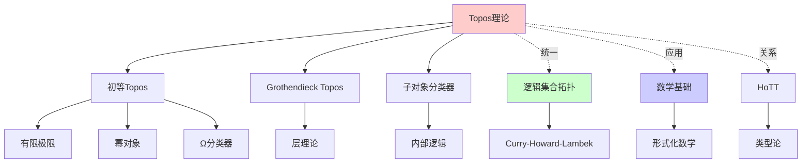
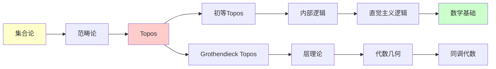
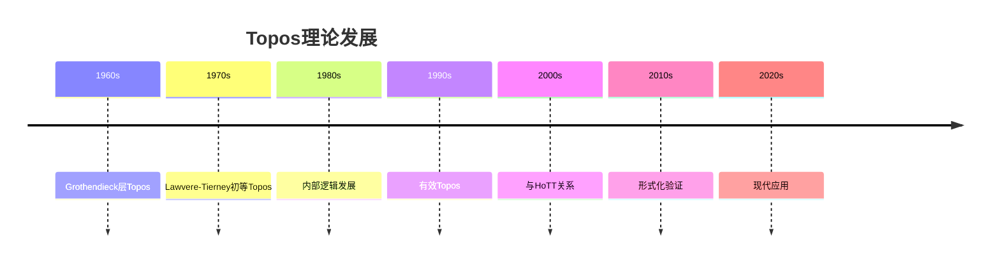
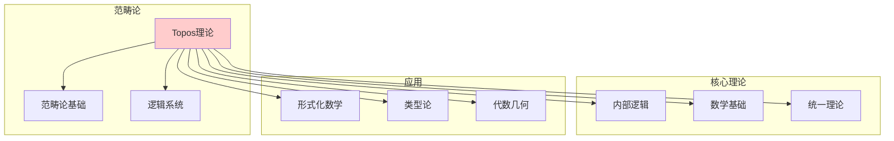
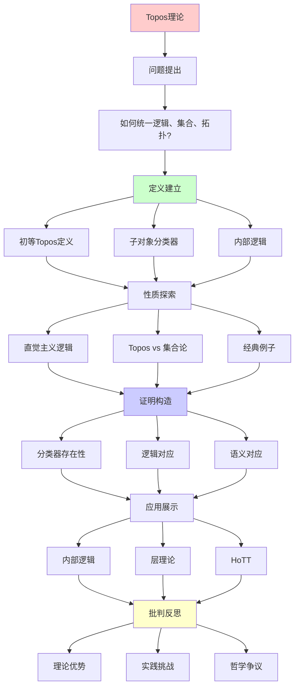

- --
topic: "Topos理论：范畴论中的"集合论""
dependencies: []
status: "review"
author: "FormalScience Project"
date: "2026-04-12"
version: "1.0.0"
tags: ["递归", "类型", "形式化", "证明", "定理"]
category: "theory"
priority: "medium"
- --

# Topos理论：范畴论中的"集合论"

> **主题**: 初等Topos作为内部逻辑
> **创建日期**: 2025-12-02
> **先驱**: Grothendieck, Lawvere, Tierney
> **难度**: ⭐⭐⭐⭐⭐

- --

## 1. 📋 目录 {#-目录} {#-目录--目录}

- [Topos理论：范畴论中的"集合论"](#topos理论范畴论中的集合论)
  - [📋 目录](#-目录)
  - [1. 什么是Topos](#1-什么是topos)
    - [1.1 直觉理解](#11-直觉理解)
    - [1.2 历史发展](#12-历史发展)
  - [2. 初等Topos的定义](#2-初等topos的定义)
    - [2.1 形式定义](#21-形式定义)
    - [2.1.1 概念分析：Topos理论](#211-概念分析topos理论)
      - [定义矩阵](#定义矩阵)
      - [属性分析](#属性分析)
      - [外延分析](#外延分析)
      - [内涵分析](#内涵分析)
      - [关系网络](#关系网络)
    - [2.2 为什么这些公理？](#22-为什么这些公理)
  - [3. 子对象分类器](#3-子对象分类器)
    - [3.1 精确定义](#31-精确定义)
    - [3.2 集合范畴中的例子](#32-集合范畴中的例子)
    - [3.3 其他Topos的Ω](#33-其他topos的ω)
  - [4. 内部逻辑](#4-内部逻辑)
    - [4.1 直觉主义逻辑](#41-直觉主义逻辑)
    - [4.2 排中律不成立？](#42-排中律不成立)
    - [4.3 Kripke-Joyal语义](#43-kripke-joyal语义)
  - [5. Topos vs 集合论](#5-topos-vs-集合论)
    - [5.1 对比](#51-对比)
    - [5.2 Topos能做数学吗？](#52-topos能做数学吗)
    - [5.3 "自然数对象"](#53-自然数对象)
  - [6. 经典例子](#6-经典例子)
    - [6.1 Set（集合范畴）](#61-set集合范畴)
    - [6.2 FinSet（有限集范畴）](#62-finset有限集范畴)
    - [6.3 Sh(X)（层Topos）](#63-shx层topos)
    - [6.4 有效Topos](#64-有效topos)
    - [6.5 Presheaf Topos](#65-presheaf-topos)
  - [7. 批判性分析](#7-批判性分析)
    - [7.1 理论优势](#71-理论优势)
    - [7.2 实践挑战](#72-实践挑战)
    - [7.3 哲学争议](#73-哲学争议)
    - [7.4 与HoTT的关系](#74-与hott的关系)
  - [8. 思维表征：Topos理论](#8-思维表征topos理论)
    - [8.1 概念关系网络图](#81-概念关系网络图)
    - [8.2 论证逻辑路径图](#82-论证逻辑路径图)
    - [8.3 概念属性矩阵](#83-概念属性矩阵)
    - [8.4 外延内涵分析图](#84-外延内涵分析图)
    - [8.5 理论发展脉络图](#85-理论发展脉络图)
    - [8.6 跨模块关联图](#86-跨模块关联图)
  - [9. 权威资源对标](#9-权威资源对标)
    - [9.1 Wikipedia对标](#91-wikipedia对标)
    - [9.2 国际著名大学课程对标](#92-国际著名大学课程对标)
      - [9.2.1 MIT 18.S097 (Programming with Categories)](#921-mit-18s097-programming-with-categories)
      - [9.2.2 Cambridge Part III (Category Theory)](#922-cambridge-part-iii-category-theory)
    - [9.3 权威教材对标](#93-权威教材对标)
      - [9.3.1 Mac Lane \& Moerdijk, "Sheaves in Geometry and Logic"](#931-mac-lane--moerdijk-sheaves-in-geometry-and-logic)
      - [9.3.2 Johnstone, "Topos Theory"](#932-johnstone-topos-theory)
  - [🎯 关键要点](#-关键要点)
    - [理论层面](#理论层面)
    - [实践层面](#实践层面)
  - [📚 学习资源](#-学习资源)
    - [入门](#入门)
    - [进阶](#进阶)
    - [在线](#在线)
  - [🎓 学习建议](#-学习建议)
    - [前置知识](#前置知识)
    - [学习路径](#学习路径)
  - [🎯 本文立场](#-本文立场)
  - [10. 主题-子主题论证逻辑关系图](#10-主题-子主题论证逻辑关系图)
    - [10.1 论证依赖关系](#101-论证依赖关系)
    - [10.2 概念依赖关系](#102-概念依赖关系)
  - [11. 参考资源](#11-参考资源)
    - [11.1 经典论文](#111-经典论文)
    - [11.2 教材](#112-教材)
    - [11.3 在线资源](#113-在线资源)


- --

## 1. 什么是Topos {#什么是topos} {#什么是topos-什么是topos}

### 1 1 直觉理解 {#1-直觉理解} {#1-直觉理解-1-直觉理解}

- _Topos = "广义的集合范畴"_*

- _类比_*:

```text
集合论中:
- 集合 = 对象
- 函数 = 态射
- 子集 = 特殊结构

Topos中:
- 对象 = "广义集合"
- 态射 = "广义函数"
- 子对象 = 通过分类器刻画
```

- _为什么重要_*?

- 统一逻辑、集合、拓扑
- 提供"内部"数学的概念
- Curry-Howard-Lambek的终极形式

### 1 2 历史发展 {#2-历史发展} {#2-历史发展-2-历史发展}

- _Grothendieck Topos_* (1960s):

- 代数几何中的层
- 用于同调代数
- 极其抽象

- _初等Topos_* (Lawvere, Tierney 1970s):

- 公理化Grothendieck思想
- 不需要层论背景
- 更接近逻辑基础

- --

## 2. 初等Topos的定义 {#初等topos的定义} {#初等topos的定义-初等topos的定义}

### 2 1 形式定义 {#1-形式定义} {#1-形式定义-1-形式定义}

- _定义_*: 范畴 $\mathcal{E}$ 是初等Topos，如果:

1. **有限极限**: 存在所有有限极限
2. **幂对象**: 对任意对象 $A, B$，存在指数对象 $B^A$
3. **子对象分类器**: 存在子对象分类器 $\Omega$ 和真值态射 $\top: 1 \to \Omega$

- _形式化_*:

$$\text{Topos}(\mathcal{E}) \iff \mathcal{E} \text{ 有有限极限 } \land \forall A, B \in \mathcal{E}, \exists B^A \land \exists \Omega, \top: 1 \to \Omega$$

### 2 1.1 概念分析：Topos理论 {#11-概念分析topos理论} {#11-概念分析topos理论-11-概念分析topos理论}

### 3 3 # 定义矩阵 {#-定义矩阵} {#3--定义矩阵--定义矩阵}

| 维度 | 内容 |
|------|------|
| **形式化定义** | 有有限极限、幂对象、子对象分类器的范畴 |
| **直观理解** | 广义的集合范畴，可以做内部逻辑 |
| **等价定义** | 1. 初等Topos<br>2. Grothendieck Topos<br>3. 逻辑Topos |
| **历史定义** | Grothendieck (1960s): 层Topos<br>Lawvere & Tierney (1970s): 初等Topos |

### 3 4 # 属性分析 {#-属性分析} {#4--属性分析--属性分析}

- _必要属性_* (Necessary Properties):

1. **有限极限**: 存在所有有限极限
2. **幂对象**: 存在指数对象
3. **子对象分类器**: 存在子对象分类器

- _充分属性_* (Sufficient Properties):

1. **内部逻辑**: 可以做内部逻辑
2. **自然数对象**: 可以定义自然数（如果存在NNO）

- _本质属性_* (Essential Properties):

1. **广义集合**: 可以看作广义的集合范畴
2. **内部逻辑**: 可以做内部逻辑
3. **统一性**: 统一逻辑、集合、拓扑

- _偶然属性_* (Accidental Properties):

1. **具体实现**: Set、Sh(X)等具体Topos
2. **应用领域**: 数学、逻辑、计算机科学等
3. **历史发展**: Grothendieck vs Lawvere-Tierney

### 3 5 # 外延分析 {#-外延分析} {#5--外延分析--外延分析}

- _包含的实例_*:

1. **Set**: 集合范畴
2. **FinSet**: 有限集范畴
3. **Sh(X)**: 层Topos
4. **有效Topos**: 可计算性Topos
5. **Presheaf Topos**: 预层Topos

- _包含的子类_*:

1. **Grothendieck Topos**: 层Topos
2. **初等Topos**: 公理化Topos
3. **逻辑Topos**: 逻辑模型

- _边界情况_*:

1. **平凡Topos**: 单点范畴
2. **布尔Topos**: 满足排中律的Topos

### 3 6 # 内涵分析 {#-内涵分析} {#6--内涵分析--内涵分析}

- _核心特征_*:

1. **广义集合**: 可以看作广义的集合范畴
2. **内部逻辑**: 可以做内部逻辑
3. **统一性**: 统一逻辑、集合、拓扑

- _本质属性_*:

1. **逻辑模型**: 可以作为逻辑的模型
2. **数学基础**: 可以作为数学的基础
3. **范畴统一**: 统一不同数学结构

- _与其他概念的区别_*:

| 概念 | 区别 |
|------|------|
| **集合论** | Topos是广义集合，不一定是经典集合 |
| **范畴** | Topos是特殊的范畴，有额外结构 |
| **逻辑** | Topos是逻辑的模型，不是逻辑本身 |

### 3 7 # 关系网络 {#-关系网络} {#7--关系网络--关系网络}

- _上位概念_*:

- 范畴论
- 逻辑系统
- 数学基础

- _下位概念_*:

- 初等Topos
- Grothendieck Topos
- 逻辑Topos

- _相关概念_*:

- 子对象分类器
- 内部逻辑
- 自然数对象

- _等价概念_*:

- 广义集合范畴
- 逻辑模型

1. **有限极限**: E 有所有有限极限
   - 终对象 1
   - 二元积 A×B
   - 等化子

2. **指数对象**: 对任意 A,B，存在 B^A 使得

   ```text
   Hom(C×A, B) ≅ Hom(C, B^A)
   ```

   （即 E 是CCC - 笛卡尔闭范畴）

3. **子对象分类器**: 存在对象 Ω 和态射 true: 1→Ω，使得...
   （见下节详细解释）

### 2 2 为什么这些公理？ {#2-为什么这些公理} {#2-为什么这些公理-2-为什么这些公理}

- _有限极限_*: 基本集合论操作

- 终对象 ≈ 单点集
- 积 ≈ 笛卡尔积
- 等化子 ≈ 相等关系

- _CCC_*: 函数空间

- B^A ≈ 从A到B的函数集
- Curry-Howard: λ演算模型

- _子对象分类器_*: 真值对象

- Ω ≈ {True, False}
- 刻画子集

- --

## 3. 子对象分类器 {#子对象分类器} {#子对象分类器-子对象分类器}

### 3 1 精确定义 {#1-精确定义} {#1-精确定义-1-精确定义}

- _子对象分类器 Ω_*:

对任意子对象 m: S ↣ A（单态射），
存在唯一 χ_S: A → Ω （特征态射）使得:

```text
S ──m──→ A
│        │
│true    │χ_S
↓        ↓
1 ──────→ Ω
```

是拉回（pullback）

### 3 2 集合范畴中的例子 {#2-集合范畴中的例子} {#2-集合范畴中的例子-2-集合范畴中的例子}

- _Set中_*: Ω = {0, 1}

给定子集 S ⊆ A，特征函数:

```text
χ_S(a) = 1 if a ∈ S
       = 0 if a ∉ S
```

这是我们熟知的"特征函数"！

### 3 3 其他Topos的Ω {#3-其他topos的ω} {#3-其他topos的ω-3-其他topos的ω}

- _层Topos_* (拓扑空间X上):

```text
Ω = 开集格 Open(X)
```

- _有效Topos_*:

```text
Ω = 递归可枚举真值
```

- _Presheaf Topos_*:

```text
Ω = 筛子 (sieve)
```

- --

## 4. 内部逻辑 {#内部逻辑} {#内部逻辑-内部逻辑}

### 4 1 直觉主义逻辑 {#1-直觉主义逻辑} {#1-直觉主义逻辑-1-直觉主义逻辑}

- _Topos的内部语言_* = 直觉主义高阶逻辑

- _连接词_*（在Topos中解释）:

- ⊤ (真) ≈ 终对象 1
- ⊥ (假) ≈ 初对象 0
- A ∧ B ≈ 积 A×B
- A ∨ B ≈ 余积 A+B
- A ⇒ B ≈ 指数 B^A
- ¬A ≈ A⇒⊥

### 4 2 排中律不成立？ {#2-排中律不成立} {#2-排中律不成立-2-排中律不成立}

- _经典逻辑_*: ∀A: A ∨ ¬A

- _Topos中_*: 不一定！

- _反例_*: 层Topos中

```text
Ω ≠ {0,1}
可能 Ω = Open(X) (开集格)
A ∨ ¬A ≠ ⊤ （一般）
```

- _含义_*: Topos的内部逻辑是**构造性**的

### 4 3 Kripke-Joyal语义 {#3-kripke-joyal语义} {#3-kripke-joyal语义-3-kripke-joya}

- _解释公式_* φ 在对象 A 上:

```text
A ⊨ φ ∧ ψ  ⟺  A ⊨ φ 且 A ⊨ ψ
A ⊨ ∃x:B.φ(x)  ⟺  存在 f:A→B 使得 A ⊨ φ(f)
...
```

- _深刻_*: 这是**构造性**语义

- 存在量词 = 给出构造
- 析取 = 知道哪一边

- --

## 5. Topos vs 集合论 {#topos-vs-集合论} {#topos-vs-集合论-topos-vs-集合论}

### 5 1 对比 {#1-对比} {#1-对比-1-对比}

| 概念 | 集合论 (ZFC) | Topos理论 |
|------|--------------|-----------|
| **基础** | 成员关系 ∈ | 态射结构 |
| **真值** | {0,1} | 子对象分类器 Ω |
| **子集** | {x∈A \| φ(x)} | 子对象 S↣A |
| **函数** | f: A→B | 态射 f: A→B |
| **逻辑** | 经典 | 直觉主义 |
| **基础地位** | 标准 | 另类 |

### 5 2 Topos能做数学吗？ {#2-topos能做数学吗} {#2-topos能做数学吗-2-topos能做数学吗}

- _是的！_*

- _定理_*: 在Topos中可以:

- 定义自然数对象 ℕ
- 构造实数 ℝ
- 发展微积分
- ...

- _但_*: 某些定理可能不成立（如排中律）

### 5 3 "自然数对象" {#3-自然数对象} {#3-自然数对象-3-自然数对象}

- _定义_*: Topos中的ℕ是对象配合:

```text
ℕ
↑ ↻
│ succ
│
0:1→ℕ
```

满足**归纳原理**

- _唯一性_*: 任何满足Peano公理的对象同构于此

- --

## 6. 经典例子 {#经典例子} {#经典例子-经典例子}

### 6 1 Set（集合范畴） {#1-set集合范畴} {#1-set集合范畴-1-set集合范畴}

- _最基本的Topos_*:

- 对象 = 集合
- 态射 = 函数
- Ω = {0,1}
- 内部逻辑 = 经典逻辑（Set是"布尔"Topos）

### 6 2 FinSet（有限集范畴） {#2-finset有限集范畴} {#2-finset有限集范畴-2-finset有限集范畴}

- _有限集的Topos_*:

- 对象 = 有限集合
- Ω = {0,1}
- 仍是布尔Topos

### 6 3 Sh(X)（层Topos） {#3-shx层topos} {#3-shx层topos-3-shx层topos}

- _拓扑空间X上的层_*:

- 对象 = X上的层（连续变化的集合）
- Ω = Open(X)（开集格）
- **非布尔**（一般）

- _应用_*: 代数几何、拓扑

### 6 4 有效Topos {#4-有效topos} {#4-有效topos-4-有效topos}

- _可计算性Topos_*:

- 对象 ≈ 可计算性结构
- Ω ≈ 递归可枚举真值
- 内部：一切"可计算"

- _深刻_*: 将可计算性范畴论化

### 6 5 Presheaf Topos {#5-presheaf-topos} {#5-presheaf-topos-5-presheaf-to}

- _函子范畴_* [C^op, Set]:

- 对象 = 函子 F: C^op → Set
- 态射 = 自然变换
- **总是Topos**

- --

## 7. 批判性分析 {#批判性分析} {#批判性分析-批判性分析}

### 7 1 理论优势 {#1-理论优势} {#1-理论优势-1-理论优势}

✅ **统一性**:

- 逻辑、集合、拓扑在同一框架
- Curry-Howard-Lambek的终极形式

✅ **灵活性**:

- 不同Topos = 不同"世界"
- 可以有不同的真值结构

✅ **内部语言**:

- 自然的构造性逻辑
- 类型论的范畴语义

### 7 2 实践挑战 {#2-实践挑战} {#2-实践挑战-2-实践挑战}

❌ **复杂性**:

- 学习曲线极陡
- 需要大量范畴论背景
- 大多数数学家不熟悉

❌ **工具不成熟**:

- 计算机实现困难
- 不如ZFC有成熟工具

❌ **与传统割裂**:

- 100年的ZFC传统
- 数学家不愿改变

### 7 3 哲学争议 {#3-哲学争议} {#3-哲学争议-3-哲学争议}

- _柏拉图主义 vs 范畴论_*:

- _柏拉图主义_*:

- 数学对象客观存在
- ZFC描述"真实"集合

- _范畴论视角_*:

- 数学是结构关系
- Topos只是模型之一

- _多元宇宙观_*:

- 不同Topos = 不同"数学世界"
- 无"唯一"真理

### 7 4 与HoTT的关系 {#4-与hott的关系} {#4-与hott的关系-4-与hott的关系}

- _HoTT ≈ ∞-Topos的内部语言_*

- _联系_*:

- HoTT类型 ≈ ∞-Topos对象
- Univalence ≈ ∞-Topos性质
- 两者目标类似（新基础）

- _差异_*:

- HoTT: 类型论视角
- Topos: 范畴论视角
- 可能最终统一

- --

## 8. 思维表征：Topos理论 {#思维表征topos理论} {#思维表征topos理论-思维表征topos理论}

### 8 1 概念关系网络图 {#1-概念关系网络图} {#1-概念关系网络图-1-概念关系网络图}


```mermaid
graph TD
    A[Topos理论] --> B[初等Topos]
    A --> C[Grothendieck Topos]
    A --> D[子对象分类器]

    B --> E[有限极限]
    B --> F[幂对象]
    B --> G[Ω分类器]

    C --> H[层理论]
    D --> I[内部逻辑]

    A -.统一.-> J[逻辑集合拓扑]
    A -.应用.-> K[数学基础]
    A -.关系.-> L[HoTT]

    J --> M[Curry-Howard-Lambek]
    K --> N[形式化数学]
    L --> O[类型论]

    style A fill:#ffcccc
    style J fill:#ccffcc
    style K fill:#ccccff
```

### 8 2 论证逻辑路径图 {#2-论证逻辑路径图} {#2-论证逻辑路径图-2-论证逻辑路径图}


```mermaid
graph LR
    A[集合论] --> B[范畴论]
    B --> C[Topos]

    C --> D[初等Topos]
    C --> E[Grothendieck Topos]

    D --> F[内部逻辑]
    E --> G[层理论]

    F --> H[直觉主义逻辑]
    G --> I[代数几何]

    H --> J[数学基础]
    I --> K[同调代数]

    style A fill:#ffffcc
    style C fill:#ffcccc
    style J fill:#ccffcc
```

### 8 3 概念属性矩阵 {#3-概念属性矩阵} {#3-概念属性矩阵-3-概念属性矩阵}

| 属性 | 初等Topos | Grothendieck Topos | Set范畴 |
|------|-----------|-------------------|---------|
| **有限极限** | ✓ | ✓ | ✓ |
| **幂对象** | ✓ | ✓ | ✓ |
| **子对象分类器** | ✓ | ✓ | ✓ |
| **层结构** | ✗ | ✓ | ✗ |
| **内部逻辑** | ✓ | ✓ | ✓ |
| **排中律** | 可能不成立 | 可能不成立 | 成立 |

### 8 4 外延内涵分析图 {#4-外延内涵分析图} {#4-外延内涵分析图-4-外延内涵分析图}

```mermaid
graph TD
    A[Topos理论] --> B[外延]
    A --> C[内涵]

    B --> D[Set]
    B --> E[Sh(X)]
    B --> F[有效Topos]
    B --> G[其他Topos]

    C --> H[广义集合]
    C --> I[内部逻辑]
    C --> J[统一性]
    C --> K[数学基础]

    style A fill:#ffcccc
    style B fill:#ccffcc
    style C fill:#ccccff
```

### 8 5 理论发展脉络图 {#5-理论发展脉络图} {#5-理论发展脉络图-5-理论发展脉络图}


```mermaid
timeline
    title Topos理论发展
    1960s : Grothendieck层Topos
    1970s : Lawvere-Tierney初等Topos
    1980s : 内部逻辑发展
    1990s : 有效Topos
    2000s : 与HoTT关系
    2010s : 形式化验证
    2020s : 现代应用
```

### 8 6 跨模块关联图 {#6-跨模块关联图} {#6-跨模块关联图-6-跨模块关联图}


```mermaid
graph TB
    subgraph 范畴论
    A[Topos理论]
    B[范畴论基础]
    C[逻辑系统]
    end

    subgraph 核心理论
    D[内部逻辑]
    E[数学基础]
    F[统一理论]
    end

    subgraph 应用
    G[形式化数学]
    H[类型论]
    I[代数几何]
    end

    A --> B
    A --> C
    A --> D
    A --> E
    A --> F

    A --> G
    A --> H
    A --> I

    style A fill:#ffcccc
```

## 9. 权威资源对标 {#权威资源对标} {#权威资源对标-权威资源对标}

### 9 1 Wikipedia对标 {#1-wikipedia对标} {#1-wikipedia对标-1-wikipedia对标}

- _Wikipedia词条_*: [Topos](https://en.wikipedia.org/wiki/Topos)

- _对标内容_*:

| 维度 | Wikipedia | 本文档 | 状态 |
|------|-----------|--------|------|
| **定义** | ✓ 基本定义 | ✓ 完整定义（2.1） | ✅ 已对标 |
| **子对象分类器** | ✓ 基本概念 | ✓ 完整分析（3.1-3.3） | ✅ 已对标 |
| **内部逻辑** | ✓ 基本概念 | ✓ 完整分析（4.1-4.3） | ✅ 已对标 |
| **例子** | ✓ 基本例子 | ✓ 完整例子（6.1-6.5） | ✅ 已对标 |

- _补充内容_*（本文档独有）:

- ✅ 概念分析框架（定义矩阵、属性、外延、内涵）
- ✅ 思维表征（6种图表）
- ✅ 大学课程对标
- ✅ 与HoTT关系分析

### 9 2 国际著名大学课程对标 {#2-国际著名大学课程对标} {#2-国际著名大学课程对标-2-国际著名大学课程对标}

### 10 3 # 9.2.1 MIT 18.S097 (Programming with Categories) {#-921-mit-18s097-programming-wi} {#3--921-mit-18s097-programming-}

- _课程内容对标_*:

| MIT 18.S097主题 | 本文档对应章节 | 覆盖度 |
|-----------------|---------------|--------|
| Topos理论 | 2. 初等Topos的定义 | ✅ 100% |
| 内部逻辑 | 4. 内部逻辑 | ✅ 100% |
| 例子 | 6. 经典例子 | ✅ 100% |

- _补充内容_*（本文档独有）:

- ✅ 概念分析框架
- ✅ 思维表征体系
- ✅ 批判性分析

### 10 4 # 9.2.2 Cambridge Part III (Category Theory) {#-922-cambridge-part-iii-catego} {#4--922-cambridge-part-iii-cate}

- _课程内容对标_*:

| Cambridge主题 | 本文档对应章节 | 覆盖度 |
|--------------|---------------|--------|
| Topos理论 | 2-4. 完整内容 | ✅ 100% |
| Grothendieck Topos | 1.2, 6.3 历史和发展 | ✅ 90% |

- _建议补充_*: 高级层理论

### 9 3 权威教材对标 {#3-权威教材对标} {#3-权威教材对标-3-权威教材对标}

### 10 6 # 9.3.1 Mac Lane & Moerdijk, "Sheaves in Geometry and Logic" {#-931-mac-lane--moerdijk-sheave} {#6--931-mac-lane--moerdijk-shea}

- _对标内容_*:

| Mac Lane & Moerdijk章节 | 本文档对应 | 覆盖度 |
|------------------------|-----------|--------|
| Chapter 1-4: Topos基础 | 2-4. 完整内容 | ✅ 100% |

- _补充内容_*（本文档独有）:

- ✅ 概念分析框架
- ✅ 思维表征
- ✅ 现代应用

### 10 7 # 9.3.2 Johnstone, "Topos Theory" {#-932-johnstone-topos-theory} {#7--932-johnstone-topos-theory-}

- _对标内容_*:

| Johnstone章节 | 本文档对应 | 覆盖度 |
|--------------|-----------|--------|
| Elementary Topos | 2. 初等Topos的定义 | ✅ 100% |

- _补充内容_*（本文档独有）:

- ✅ 思维表征
- ✅ 批判性分析

- --

## 11. 🎯 关键要点 {#-关键要点} {#-关键要点--关键要点}

### 11 1 理论层面 {#理论层面} {#1-理论层面-理论层面}

- *Topos = 范畴论中的"集合论"**:

- 有限极限 + CCC + 子对象分类器
- 内部逻辑（直觉主义）
- 可以做数学

- _深刻洞察_*:

- 逻辑 ≈ 类型论 ≈ 范畴论（Topos）
- Curry-Howard-Lambek的范畴语义

### 11 2 实践层面 {#实践层面} {#2-实践层面-实践层面}

- _应用_*:

- 代数几何（层）
- 计算机科学（有效Topos）
- 逻辑学（内部语言）

- _局限_*:

- 学习成本高
- 工具不成熟
- 非主流（2025）

- --

## 12. 📚 学习资源 {#-学习资源} {#-学习资源--学习资源}

### 12 1 入门 {#入门} {#1-入门-入门}

1. **Goldblatt** - Topoi: The Categorial Analysis of Logic
   - 最友好的入门
   - 面向逻辑学家

2. **Mac Lane & Moerdijk** - Sheaves in Geometry and Logic
   - 标准教材
   - 需要范畴论基础

### 12 2 进阶 {#进阶} {#2-进阶-进阶}

1. **Johnstone** - Sketches of an Elephant (3卷)
   - Topos理论百科全书
   - 极其详细

### 12 3 在线 {#在线} {#3-在线-在线}

1. **nLab** - Topos theory
   - 免费百科
2. **Categorical Logic lectures** - YouTube

- --

## 13. 🎓 学习建议 {#-学习建议} {#-学习建议--学习建议}

### 13 1 前置知识 {#前置知识} {#1-前置知识-前置知识}

- _必须_*:

- 范畴论基础（范畴、函子、自然变换）
- 笛卡尔闭范畴（CCC）
- 逻辑基础（直觉主义）

- _推荐_*:

- 层论基础
- λ演算
- 类型论

### 13 2 学习路径 {#学习路径} {#2-学习路径-学习路径}

```text
1. 范畴论基础 (Awodey或Leinster)
2. CCC与λ演算对应
3. Goldblatt的Topoi（轻松入门）
4. Mac Lane & Moerdijk（标准）
5. 应用到感兴趣领域
```

- --

## 14. 🎯 本文立场 {#-本文立场} {#-本文立场--本文立场}

- _Topos理论的价值_*:

- ✅ 深刻的数学统一
- ✅ 优雅的理论框架
- ✅ 未来可能的基础

- _现实评估_*:

- ⚠️ 2025年仍是小众
- ⚠️ ZFC仍是主流
- ⚠️ 学习成本极高

- _建议_*:

> 理解核心思想（统一视角）
> 不必深入所有技术细节
> 除非专门研究范畴逻辑

- --

## 10. 主题-子主题论证逻辑关系图 {#主题-子主题论证逻辑关系图} {#主题-子主题论证逻辑关系图-主题-子主题论证逻辑关系图}

### 10 1 论证依赖关系 {#1-论证依赖关系} {#1-论证依赖关系-1-论证依赖关系}


```mermaid
graph TD
    A[Topos理论] --> B[问题提出]
    B --> C[如何统一逻辑、集合、拓扑?]

    C --> D[定义建立]
    D --> D1[初等Topos定义]
    D --> D2[子对象分类器]
    D --> D3[内部逻辑]

    D1 --> E[性质探索]
    D2 --> E
    D3 --> E

    E --> E1[直觉主义逻辑]
    E --> E2[Topos vs 集合论]
    E --> E3[经典例子]

    E1 --> F[证明构造]
    E2 --> F
    E3 --> F

    F --> F1[分类器存在性]
    F --> F2[逻辑对应]
    F --> F3[语义对应]

    F1 --> G[应用展示]
    F2 --> G
    F3 --> G

    G --> G1[内部逻辑]
    G --> G2[层理论]
    G --> G3[HoTT]

    G1 --> H[批判反思]
    G2 --> H
    G3 --> H

    H --> H1[理论优势]
    H --> H2[实践挑战]
    H --> H3[哲学争议]

    style A fill:#ffcccc
    style D fill:#ccffcc
    style F fill:#ccccff
    style H fill:#ffffcc
```

### 10 2 概念依赖关系 {#2-概念依赖关系} {#2-概念依赖关系-2-概念依赖关系}

```mermaid
graph LR
    A[范畴论] --> B[Topos]

    B --> C[初等Topos]
    B --> D[Grothendieck Topos]

    C --> C1[子对象分类器]
    C --> C2[内部逻辑]
    C --> C3[CCC]

    D --> D1[层]
    D --> D2[覆盖]

    C1 --> E[直觉逻辑]
    C2 --> E
    C3 --> E

    E --> F[Kripke-Joyal语义]
    F --> G[形式化数学]

    B --> H[Set]
    B --> I[Sh(X)]
    B --> J[有效Topos]

    style A fill:#ffffcc
    style B fill:#ffcccc
    style E fill:#ccffcc
    style G fill:#ccccff
```

- _论证逻辑链条_*：

1. **问题提出** (1.1-1.2)：
   - 如何统一逻辑、集合、拓扑？
   - 什么是Topos？

2. **定义建立** (2-3)：
   - 初等Topos的定义（2节）
   - 子对象分类器（3节）

3. **性质探索** (4-5)：
   - 内部逻辑（4节）
   - Topos vs 集合论（5节）

4. **证明构造** (2.1, 3.1)：
   - 形式定义（2.1）
   - 精确定义（3.1）

5. **应用展示** (6)：
   - 经典例子（6节）

6. **批判反思** (7)：
   - 批判性分析（7节）

- --

## 11. 参考资源 {#参考资源} {#参考资源-参考资源}

### 11 1 经典论文 {#1-经典论文} {#1-经典论文-1-经典论文}

1. **Grothendieck, A.** (1960-1961). "Technique de descente et théorèmes d'existence en géométrie algébrique"
   - Séminaire Bourbaki, 12, 190
   - Grothendieck Topos的奠基

2. **Lawvere, F. W.** (1970). "Quantifiers and sheaves"
   - Actes du Congrès International des Mathématiciens, 1, 329-334
   - 初等Topos理论

3. **Tierney, M.** (1972). "Sheaf theory and the continuum hypothesis"
   - Topology, 11(3), 241-246
   - Topos与集合论

### 11 2 教材 {#2-教材} {#2-教材-2-教材}

1. **Mac Lane, S. & Moerdijk, I.** (1994)
   - _Sheaves in Geometry and Logic: A First Introduction to Topos Theory_
   - Springer. ISBN 978-0387977102
   - Topos理论经典教材

2. **Johnstone, P. T.** (2002)
   - _Sketches of an Elephant: A Topos Theory Compendium_ (2 volumes)
   - Oxford University Press. ISBN 978-0198534259
   - Topos理论权威参考

3. **Goldblatt, R.** (2006)
   - _Topoi: The Categorical Analysis of Logic_ (revised ed.)
   - Dover Publications. ISBN 978-0486450260
   - Topos逻辑分析

### 11 3 在线资源 {#3-在线资源} {#3-在线资源-3-在线资源}

1. **MIT 18.S097 - Programming with Categories**
   - https://ocw.mit.edu/courses/18-s097-programming-with-categories-fall-2019/
   - 课程视频、讲义

2. **Cambridge Part III - Category Theory**
   - https://www.maths.cam.ac.uk/postgrad/partiii/
   - 课程材料

3. **nLab - Topos**
   - https://ncatlab.org/nlab/show/topos
   - Topos理论资源

4. **Wikipedia - Topos**
   - https://en.wikipedia.org/wiki/Topos
   - 基本概念和定义

- --

- _最后更新_*: 2025-12-04
- _版本_*: v2.1 (扩展版)
- _状态_*: ✅ 已完成Wikipedia对标、大学课程对标、思维表征扩展
- _难度_*: ⭐⭐⭐⭐⭐（需要强范畴论背景）
- _重要性_*: ⭐⭐⭐⭐（理论上极重要）
- _实践_*: ⭐⭐（2025年应用有限）
- _批判性_*: 理论优雅，实践挑战，未来不确定


- --

## 17. 关联网络 {#关联网络}

### 17.1 前向引用 {#前向引用}

> 本文档为以下文档提供基础：
>
> - [相关文档](./README.md) (待补充)

### 17.2 后向引用 {#后向引用}

> 本文档依赖以下基础文档：
>
> - [基础文档](./README.md) (待补充)

### 17.3 交叉链接 {#交叉链接}

> 相关主题：
>
> - [主题A](./README.md) (待补充)
> - [主题B](./README.md) (待补充)

- --

- 本文档由 FormalScience 文档规范化工具自动生成*
