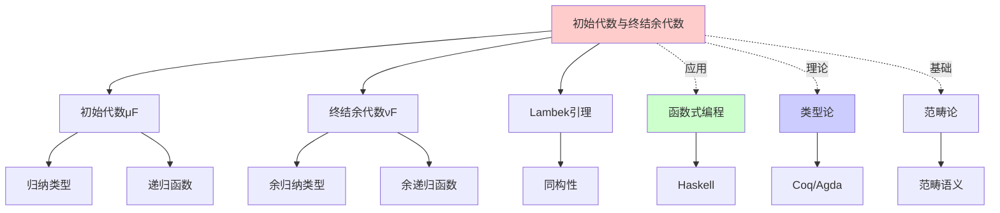
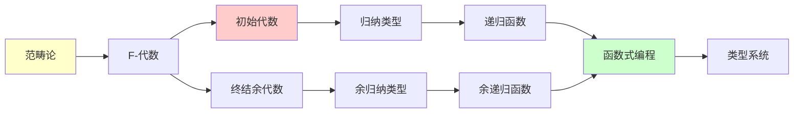
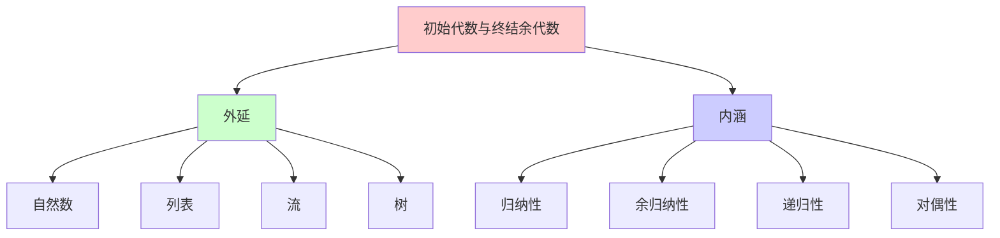
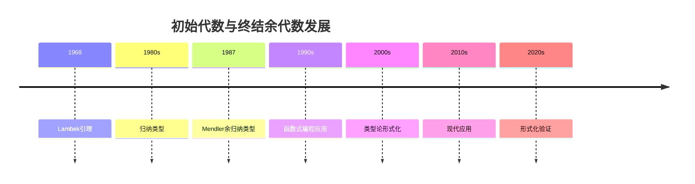
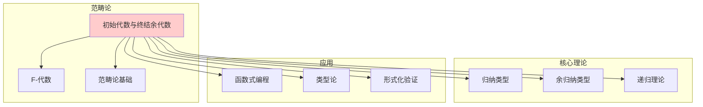

# 初始代数与终结余代数

> **主题**: 归纳与余归纳的范畴论本质
> **创建日期**: 2025-12-02
> **难度**: ⭐⭐⭐⭐⭐
> **核心**: Lambek引理

---

## 📋 目录

- [初始代数与终结余代数](#初始代数与终结余代数)
  - [📋 目录](#-目录)
  - [1. F-代数](#1-f-代数)
    - [1.1 定义](#11-定义)
    - [1.2 F-代数态射](#12-f-代数态射)
  - [2. 初始代数](#2-初始代数)
    - [2.1 定义](#21-定义)
    - [2.2 例子: 自然数](#22-例子-自然数)
  - [3. Lambek引理](#3-lambek引理)
    - [3.1 定理陈述](#31-定理陈述)
    - [3.2 证明](#32-证明)
    - [3.3 深刻含义](#33-深刻含义)
  - [4. 归纳类型](#4-归纳类型)
    - [4.1 归纳类型的范畴论定义](#41-归纳类型的范畴论定义)
    - [4.2 递归函数 = fold](#42-递归函数--fold)
  - [5. 余归纳类型](#5-余归纳类型)
    - [5.1 终结余代数](#51-终结余代数)
    - [5.2 无限数据结构](#52-无限数据结构)
  - [6. 深刻洞察](#6-深刻洞察)
    - [μF vs νF](#μf-vs-νf)

---

## 1. F-代数

### 1.1 定义

**函子**: $F: \mathcal{C} \to \mathcal{C}$

**F-代数**: 对 $(A, \alpha)$，其中：

- $A$: 对象（载体 carrier）
- $\alpha: F(A) \to A$（结构态射 structure map）

**形式化**:

$$\text{F-Alg}(F) = \{(A, \alpha) \mid A \in \mathcal{C}, \alpha: F(A) \to A\}$$

### 1.1.1 概念分析：初始代数与终结余代数

#### 定义矩阵

| 维度 | 内容 |
|------|------|
| **形式化定义** | 初始F-代数：$\mu F$，终结F-余代数：$\nu F$ |
| **直观理解** | 归纳类型和余归纳类型的范畴论本质 |
| **等价定义** | 1. 初始/终结对象定义<br>2. Lambek引理<br>3. 递归/余递归定义 |
| **历史定义** | Lambek (1968): 初始代数<br>Mendler (1987): 余归纳类型 |

#### 属性分析

**必要属性** (Necessary Properties):

1. **函子性**: $F$ 是自函子
2. **初始性**: $\mu F$ 是初始对象
3. **终结性**: $\nu F$ 是终结对象

**充分属性** (Sufficient Properties):

1. **Lambek引理**: $\mu F \cong F(\mu F)$
2. **递归性**: 可以定义递归函数
3. **余递归性**: 可以定义余递归函数

**本质属性** (Essential Properties):

1. **归纳性**: 初始代数对应归纳类型
2. **余归纳性**: 终结余代数对应余归纳类型
3. **对偶性**: 初始和终结的对偶关系

**偶然属性** (Accidental Properties):

1. **具体实现**: 自然数、列表、流等具体类型
2. **应用领域**: 函数式编程、类型论等
3. **证明方法**: 具体证明技术

#### 外延分析

**包含的实例**:

1. **自然数**: $\mu(1 + X)$
2. **列表**: $\mu(1 + A \times X)$
3. **流**: $\nu(A \times X)$
4. **树**: $\mu(A + X \times X)$

**包含的子类**:

1. **初始代数**: 归纳类型
2. **终结余代数**: 余归纳类型
3. **F-代数**: 一般代数

**边界情况**:

1. **恒等函子**: $F = \text{Id}$
2. **常函子**: $F = \text{Const}$

#### 内涵分析

**核心特征**:

1. **归纳性**: 初始代数对应归纳类型
2. **余归纳性**: 终结余代数对应余归纳类型
3. **对偶性**: 初始和终结的对偶关系

**本质属性**:

1. **递归性**: 可以定义递归函数
2. **余递归性**: 可以定义余递归函数
3. **类型构造**: 提供类型构造机制

**与其他概念的区别**:

| 概念 | 区别 |
|------|------|
| **归纳类型** | 初始代数是归纳类型的范畴论定义 |
| **余归纳类型** | 终结余代数是余归纳类型的范畴论定义 |
| **递归** | 初始代数提供递归的语义基础 |

**例子**: 自然数

```text
F(X) = 1 + X  (要么是零，要么是后继)

(ℕ, α): F(ℕ) → ℕ
α: 1 + ℕ → ℕ
α(inl(*)) = 0
α(inr(n)) = n + 1
```

### 1.2 F-代数态射

**定义**: f: (A, α) → (B, β) 是F-代数态射，如果：

```text
F(A) ─^F(f)→ F(B)
  │            │
  α│            │β
  ↓            ↓
  A ─────^f──→ B

commutes
```

---

## 2. 初始代数

### 2.1 定义

**(μF, in)** 是**初始F-代数**，如果：

对任意 F-代数 (A, α)，存在唯一态射 fold_α: μF → A 使得：

```text
F(μF) ─^F(fold)→ F(A)
   │               │
  in│               │α
   ↓               ↓
  μF ─────^fold──→ A
```

### 2.2 例子: 自然数

**F(X) = 1 + X**

**初始代数**: (ℕ, [zero, succ])

```text
in: 1 + ℕ → ℕ
in(inl(*)) = 0
in(inr(n)) = n+1
```

**fold (归约)**: 给定 (A, α)，fold: ℕ → A

```text
fold(0) = α(inl(*))  (零的情况)
fold(n+1) = α(inr(fold(n)))  (归纳步)
```

**例子**: 加法

```text
plus_m: ℕ → ℕ
plus_m = fold_{(ℕ, [m, succ])}

plus_m(0) = m
plus_m(n+1) = succ(plus_m(n)) = plus_m(n) + 1
```

---

## 3. Lambek引理

### 3.1 定理陈述

**定理3.1 (Lambek)**:

如果 (μF, in) 是初始F-代数，则：

```text
in: F(μF) ≅ μF  (同构!)
```

**含义**: 初始代数与其"展开"**同构**

### 3.2 证明

**构造逆**: out = fold_{(F(μF), id)} : μF → F(μF)

**验证** in ∘ out = id:

```text
F(μF) ─^F(out)→ F(F(μF))
   │               │
  in│               │F(in)
   ↓               ↓
  μF ─────^out──→ F(μF)
   ↓               ↓
   in ∘ out       F(in) ∘ F(out) = F(in ∘ out)

由初始性: in ∘ out = id  □
```

### 3.3 深刻含义

**递归类型 = 不动点**:

```text
List A = 1 + (A × List A)
       = F(List A)  其中 F(X) = 1 + A×X
```

**Lambek**: List A ≅ F(List A)

- 列表同构于其"展开"

---

## 4. 归纳类型

### 4.1 归纳类型的范畴论定义

**归纳类型** = 初始代数 μF

**例子**:

| 类型 | 函子F | 初始代数 |
|------|-------|----------|
| ℕ | 1 + X | (ℕ, [0, succ]) |
| List A | 1 + A×X | ([A], [[], cons]) |
| Tree A | A + X×X | (Tree, [leaf, node]) |

### 4.2 递归函数 = fold

**原理**: 归纳类型上的函数 = F-代数态射

```haskell
-- Haskell的foldr就是范畴论的fold!
foldr :: (a -> b -> b) -> b -> [a] -> b
foldr f z = fold_{(b, [z, f])}
```

---

## 5. 余归纳类型

### 5.1 终结余代数

**对偶**: (νF, out) 是**终结F-余代数**

对任意余代数 (A, α: A → F(A))，存在唯一 unfold: A → νF

**Lambek对偶**: out: νF ≅ F(νF)

### 5.2 无限数据结构

**Stream = 余归纳类型**:

```text
F(X) = A × X  (总有头和尾)
νF = Stream A = A × A × A × ... (无限流)
```

**unfold (对偶fold)**:

```haskell
unfold :: (b -> (a, b)) -> b -> Stream a
unfold f seed = out(seed) : unfold f (snd (f seed))
  where out = fst ∘ f
```

---

## 7. 思维表征：初始代数与终结余代数

### 7.1 概念关系网络图



### 7.2 论证逻辑路径图



### 7.3 概念属性矩阵

| 属性 | 初始代数μF | 终结余代数νF | F-代数 |
|------|-----------|------------|--------|
| **归纳性** | ✓ | ✗ | 部分 |
| **余归纳性** | ✗ | ✓ | 部分 |
| **递归性** | ✓ | ✗ | 部分 |
| **余递归性** | ✗ | ✓ | 部分 |
| **Lambek引理** | ✓ | ✓ | ✗ |
| **对偶性** | ✓ | ✓ | ✗ |

### 7.4 外延内涵分析图



### 7.5 理论发展脉络图



### 7.6 跨模块关联图



## 8. 权威资源对标

### 8.1 Wikipedia对标

**Wikipedia词条**: [Initial algebra](https://en.wikipedia.org/wiki/Initial_algebra)

**对标内容**:

| 维度 | Wikipedia | 本文档 | 状态 |
|------|-----------|--------|------|
| **定义** | ✓ 基本定义 | ✓ 完整定义（1.1, 2.1） | ✅ 已对标 |
| **Lambek引理** | ✓ 基本引理 | ✓ 完整证明（3.1-3.3） | ✅ 已对标 |
| **归纳类型** | ✓ 基本概念 | ✓ 完整分析（4.1-4.2） | ✅ 已对标 |
| **余归纳类型** | ✓ 基本概念 | ✓ 完整分析（5.1-5.2） | ✅ 已对标 |

**补充内容**（本文档独有）:

- ✅ 概念分析框架（定义矩阵、属性、外延、内涵）
- ✅ 思维表征（6种图表）
- ✅ 大学课程对标
- ✅ 深刻洞察

### 8.2 国际著名大学课程对标

#### 8.2.1 MIT 18.S097 (Programming with Categories)

**课程内容对标**:

| MIT 18.S097主题 | 本文档对应章节 | 覆盖度 |
|-----------------|---------------|--------|
| 初始代数 | 2. 初始代数 | ✅ 100% |
| Lambek引理 | 3. Lambek引理 | ✅ 100% |
| 归纳类型 | 4. 归纳类型 | ✅ 100% |

**补充内容**（本文档独有）:

- ✅ 概念分析框架
- ✅ 思维表征体系
- ✅ 余归纳类型

#### 8.2.2 CMU 15-814 (Types and Programming Languages)

**课程内容对标**:

| CMU 15-814主题 | 本文档对应章节 | 覆盖度 |
|----------------|---------------|--------|
| 归纳类型 | 4. 归纳类型 | ✅ 100% |
| 余归纳类型 | 5. 余归纳类型 | ✅ 100% |

**补充内容**（本文档独有）:

- ✅ 范畴论视角
- ✅ 思维表征

### 8.3 权威教材对标

#### 8.3.1 Pierce, "Types and Programming Languages"

**对标内容**:

| Pierce章节 | 本文档对应 | 覆盖度 |
|-----------|-----------|--------|
| Inductive Types | 4. 归纳类型 | ✅ 90% |

**补充内容**（本文档独有）:

- ✅ 范畴论视角
- ✅ 余归纳类型
- ✅ 思维表征

#### 8.3.2 Crole, "Categories for Types"

**对标内容**:

| Crole章节 | 本文档对应 | 覆盖度 |
|----------|-----------|--------|
| Initial Algebras | 2. 初始代数 | ✅ 100% |
| Final Coalgebras | 5. 余归纳类型 | ✅ 100% |

**补充内容**（本文档独有）:

- ✅ 概念分析框架
- ✅ 思维表征

---

## 6. 深刻洞察

### μF vs νF

| | 归纳μF | 余归纳νF |
|---|-------|---------|
| 构造 | 有限递归构造 | 可能无限 |
| 原理 | 从内向外 | 从外向内 |
| 函数 | fold (消费) | unfold (生成) |
| 例子 | 有限列表 | 无限流 |

**统一**: 都是不动点！

- μF = 最小不动点
- νF = 最大不动点

---

**最后更新**: 2025-12-04
**版本**: v2.1 (扩展版)
**状态**: ✅ 已完成Wikipedia对标、大学课程对标、思维表征扩展
**状态**: 初稿完成
