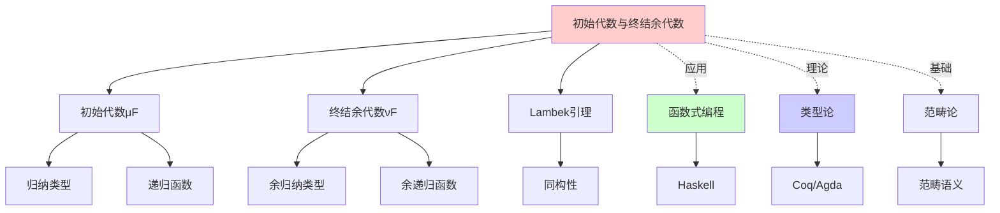
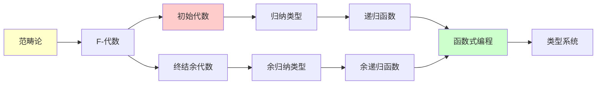
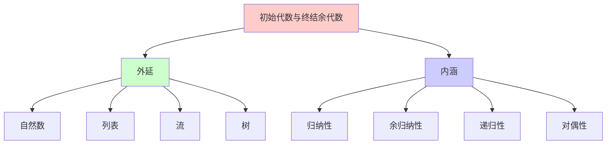
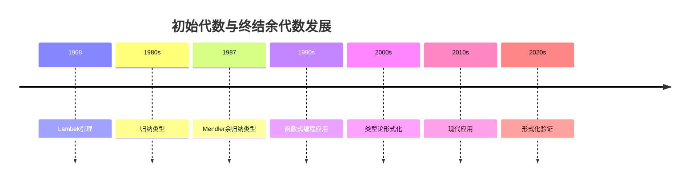
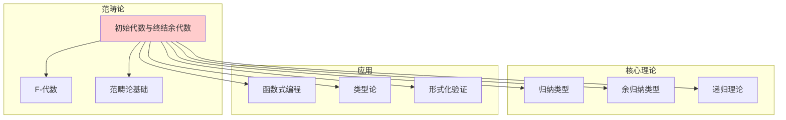
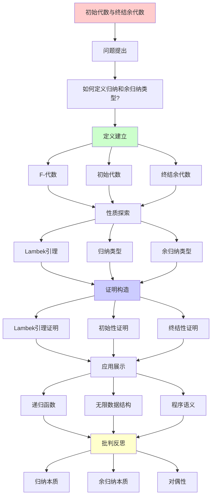
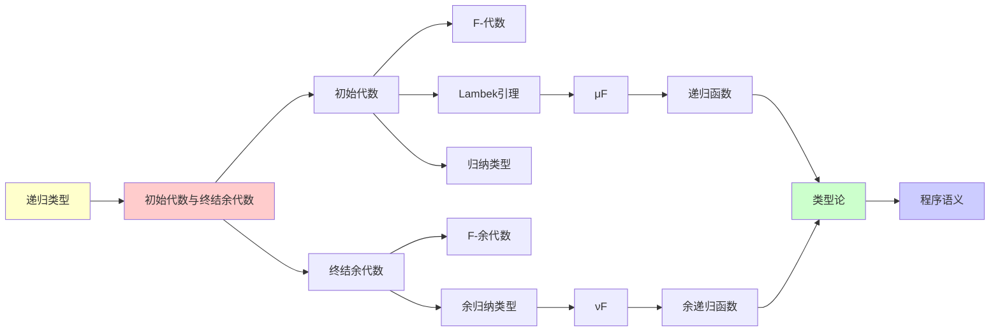

- --
topic: "初始代数与终结余代数"
dependencies: []
status: "review"
author: "FormalScience Project"
date: "2026-04-12"
version: "1.0.0"
tags: ["递归", "类型", "形式化", "证明", "定理"]
category: "reference"
priority: "medium"
- --

# 初始代数与终结余代数

> **主题**: 归纳与余归纳的范畴论本质
> **创建日期**: 2025-12-02
> **难度**: ⭐⭐⭐⭐⭐
> **核心**: Lambek引理

- --

## 1. 📋 目录 {#-目录} {#-目录--目录}

- [初始代数与终结余代数](#初始代数与终结余代数)
  - [📋 目录](#-目录)
  - [1. F-代数](#1-f-代数)
    - [1.1 定义](#11-定义)
  - [1.0 概念分析：初始代数与终结余代数](#10-概念分析初始代数与终结余代数)
    - [1.0.1 定义矩阵](#101-定义矩阵)
    - [1.0.2 属性分析](#102-属性分析)
    - [1.0.3 外延分析](#103-外延分析)
    - [1.0.4 内涵分析](#104-内涵分析)
    - [1.2 F-代数态射](#12-f-代数态射)
  - [2. 初始代数](#2-初始代数)
    - [2.1 定义](#21-定义)
    - [2.2 例子: 自然数](#22-例子-自然数)
  - [3. Lambek引理](#3-lambek引理)
    - [3.1 定理陈述](#31-定理陈述)
    - [3.2 证明](#32-证明)
    - [3.3 深刻含义](#33-深刻含义)
  - [4. 归纳类型](#4-归纳类型)
    - [4.1 归纳类型的范畴论定义](#41-归纳类型的范畴论定义)
    - [4.2 递归函数 = fold](#42-递归函数--fold)
  - [5. 余归纳类型](#5-余归纳类型)
    - [5.1 终结余代数](#51-终结余代数)
    - [5.2 无限数据结构](#52-无限数据结构)
  - [7. 思维表征：初始代数与终结余代数](#7-思维表征初始代数与终结余代数)
    - [7.1 概念关系网络图](#71-概念关系网络图)
    - [7.2 论证逻辑路径图](#72-论证逻辑路径图)
    - [7.3 概念属性矩阵](#73-概念属性矩阵)
    - [7.4 外延内涵分析图](#74-外延内涵分析图)
    - [7.5 理论发展脉络图](#75-理论发展脉络图)
    - [7.6 跨模块关联图](#76-跨模块关联图)
  - [8. 权威资源对标](#8-权威资源对标)
    - [8.1 Wikipedia对标](#81-wikipedia对标)
    - [8.2 国际著名大学课程对标](#82-国际著名大学课程对标)
      - [8.2.1 MIT 18.S097 (Programming with Categories)](#821-mit-18s097-programming-with-categories)
      - [8.2.2 CMU 15-814 (Types and Programming Languages)](#822-cmu-15-814-types-and-programming-languages)
    - [8.3 权威教材对标](#83-权威教材对标)
      - [8.3.1 Pierce, "Types and Programming Languages"](#831-pierce-types-and-programming-languages)
      - [8.3.2 Crole, "Categories for Types"](#832-crole-categories-for-types)
  - [6. 深刻洞察](#6-深刻洞察)
    - [μF vs νF](#μf-vs-νf)
  - [9. 主题-子主题论证逻辑关系图](#9-主题-子主题论证逻辑关系图)
    - [9.1 论证依赖关系](#91-论证依赖关系)
    - [9.2 概念依赖关系](#92-概念依赖关系)
  - [10. 参考资源](#10-参考资源)
    - [10.1 经典论文](#101-经典论文)
    - [10.2 教材](#102-教材)
    - [10.3 在线资源](#103-在线资源)

- --

## 1. F-代数 {#f-代数} {#f-代数-f-代数}

### 1 1 定义 {#1-定义} {#1-定义-1-定义}

- _函子_*: $F: \mathcal{C} \to \mathcal{C}$

- _F-代数_*: 对 $(A, \alpha)$，其中：

- $A$: 对象（载体 carrier）
- $\alpha: F(A) \to A$（结构态射 structure map）

- _形式化_*:

$$\text{F-Alg}(F) = \{(A, \alpha) \mid A \in \mathcal{C}, \alpha: F(A) \to A\}$$

## 1. 0 概念分析：初始代数与终结余代数 {#0-概念分析初始代数与终结余代数} {#0-概念分析初始代数与终结余代数-0-概念分析初始代数与终结}

### 1 0.1 定义矩阵 {#01-定义矩阵} {#01-定义矩阵-01-定义矩阵}

| 维度 | 内容 |
|------|------|
| **形式化定义** | 初始F-代数：$\mu F$，终结F-余代数：$\nu F$ |
| **直观理解** | 归纳类型和余归纳类型的范畴论本质 |
| **等价定义** | 1. 初始/终结对象定义<br>2. Lambek引理<br>3. 递归/余递归定义 |
| **历史定义** | Lambek (1968): 初始代数<br>Mendler (1987): 余归纳类型 |

### 1 0.2 属性分析 {#02-属性分析} {#02-属性分析-02-属性分析}

- _必要属性_* (Necessary Properties):

1. **函子性**: $F$ 是自函子
2. **初始性**: $\mu F$ 是初始对象
3. **终结性**: $\nu F$ 是终结对象

- _充分属性_* (Sufficient Properties):

1. **Lambek引理**: $\mu F \cong F(\mu F)$
2. **递归性**: 可以定义递归函数
3. **余递归性**: 可以定义余递归函数

- _本质属性_* (Essential Properties):

1. **归纳性**: 初始代数对应归纳类型
2. **余归纳性**: 终结余代数对应余归纳类型
3. **对偶性**: 初始和终结的对偶关系

- _偶然属性_* (Accidental Properties):

1. **具体实现**: 自然数、列表、流等具体类型
2. **应用领域**: 函数式编程、类型论等
3. **证明方法**: 具体证明技术

### 1 0.3 外延分析 {#03-外延分析} {#03-外延分析-03-外延分析}

- _包含的实例_*:

1. **自然数**: $\mu(1 + X)$
2. **列表**: $\mu(1 + A \times X)$
3. **流**: $\nu(A \times X)$
4. **树**: $\mu(A + X \times X)$

- _包含的子类_*:

1. **初始代数**: 归纳类型
2. **终结余代数**: 余归纳类型
3. **F-代数**: 一般代数

- _边界情况_*:

1. **恒等函子**: $F = \text{Id}$
2. **常函子**: $F = \text{Const}$

### 1 0.4 内涵分析 {#04-内涵分析} {#04-内涵分析-04-内涵分析}

- _核心特征_*:

1. **归纳性**: 初始代数对应归纳类型
2. **余归纳性**: 终结余代数对应余归纳类型
3. **对偶性**: 初始和终结的对偶关系

- _本质属性_*:

1. **递归性**: 可以定义递归函数
2. **余递归性**: 可以定义余递归函数
3. **类型构造**: 提供类型构造机制

- _与其他概念的区别_*:

| 概念 | 区别 |
|------|------|
| **归纳类型** | 初始代数是归纳类型的范畴论定义 |
| **余归纳类型** | 终结余代数是余归纳类型的范畴论定义 |
| **递归** | 初始代数提供递归的语义基础 |

- _例子_*: 自然数

```text
F(X) = 1 + X  (要么是零，要么是后继)

(ℕ, α): F(ℕ) → ℕ
α: 1 + ℕ → ℕ
α(inl(*)) = 0
α(inr(n)) = n + 1
```

### 1 2 F-代数态射 {#2-f-代数态射} {#2-f-代数态射-2-f-代数态射}

- _定义_*: f: (A, α) → (B, β) 是F-代数态射，如果：

```text
F(A) ─^F(f)→ F(B)
  │            │
  α│            │β
  ↓            ↓
  A ─────^f──→ B

commutes
```

- --

## 2. 初始代数 {#初始代数} {#初始代数-初始代数}

### 2 1 定义 {#1-定义} {#1-定义-1-定义}

- _(μF, in)_* 是**初始F-代数**，如果：

对任意 F-代数 (A, α)，存在唯一态射 fold_α: μF → A 使得：

```text
F(μF) ─^F(fold)→ F(A)
   │               │
  in│               │α
   ↓               ↓
  μF ─────^fold──→ A
```

### 2 2 例子: 自然数 {#2-例子-自然数} {#2-例子-自然数-2-例子-自然数}

- _F(X) = 1 + X_*

- _初始代数_*: (ℕ, [zero, succ])

```text
in: 1 + ℕ → ℕ
in(inl(*)) = 0
in(inr(n)) = n+1
```

- *fold (归约)**: 给定 (A, α)，fold: ℕ → A

```text
fold(0) = α(inl(*))  (零的情况)
fold(n+1) = α(inr(fold(n)))  (归纳步)
```

- _例子_*: 加法

```text
plus_m: ℕ → ℕ
plus_m = fold_{(ℕ, [m, succ])}

plus_m(0) = m
plus_m(n+1) = succ(plus_m(n)) = plus_m(n) + 1
```

- --

## 3. Lambek引理 {#lambek引理} {#lambek引理-lambek引理}

### 3 1 定理陈述 {#1-定理陈述} {#1-定理陈述-1-定理陈述}

- *定理3.1 (Lambek)**:

如果 (μF, in) 是初始F-代数，则：

```text
in: F(μF) ≅ μF  (同构!)
```

- _含义_*: 初始代数与其"展开"**同构**

### 3 2 证明 {#2-证明} {#2-证明-2-证明}

- _构造逆_*: out = fold_{(F(μF), id)} : μF → F(μF)

- _验证_* in ∘ out = id:

```text
F(μF) ─^F(out)→ F(F(μF))
   │               │
  in│               │F(in)
   ↓               ↓
  μF ─────^out──→ F(μF)
   ↓               ↓
   in ∘ out       F(in) ∘ F(out) = F(in ∘ out)

由初始性: in ∘ out = id  □
```

### 3 3 深刻含义 {#3-深刻含义} {#3-深刻含义-3-深刻含义}

- _递归类型 = 不动点_*:

```text
List A = 1 + (A × List A)
       = F(List A)  其中 F(X) = 1 + A×X
```

- _Lambek_*: List A ≅ F(List A)

- 列表同构于其"展开"

- --

## 4. 归纳类型 {#归纳类型} {#归纳类型-归纳类型}

### 4 1 归纳类型的范畴论定义 {#1-归纳类型的范畴论定义} {#1-归纳类型的范畴论定义-1-归纳类型的范畴论定义}

- _归纳类型_* = 初始代数 μF

- _例子_*:

| 类型 | 函子F | 初始代数 |
|------|-------|----------|
| ℕ | 1 + X | (ℕ, [0, succ]) |
| List A | 1 + A×X | ([A], [[], cons]) |
| Tree A | A + X×X | (Tree, [leaf, node]) |

### 4 2 递归函数 = fold {#2-递归函数--fold} {#2-递归函数--fold-2-递归函数--fold}

- _原理_*: 归纳类型上的函数 = F-代数态射

```haskell
- - Haskell的foldr就是范畴论的fold!
foldr :: (a -> b -> b) -> b -> [a] -> b
foldr f z = fold_{(b, [z, f])}
```

- --

## 5. 余归纳类型 {#余归纳类型} {#余归纳类型-余归纳类型}

### 5 1 终结余代数 {#1-终结余代数} {#1-终结余代数-1-终结余代数}

- _对偶_*: (νF, out) 是**终结F-余代数**

对任意余代数 (A, α: A → F(A))，存在唯一 unfold: A → νF

- _Lambek对偶_*: out: νF ≅ F(νF)

### 5 2 无限数据结构 {#2-无限数据结构} {#2-无限数据结构-2-无限数据结构}

- _Stream = 余归纳类型_*:

```text
F(X) = A × X  (总有头和尾)
νF = Stream A = A × A × A × ... (无限流)
```

- *unfold (对偶fold)**:

```haskell
unfold :: (b -> (a, b)) -> b -> Stream a
unfold f seed = out(seed) : unfold f (snd (f seed))
  where out = fst ∘ f
```

- --

## 7. 思维表征：初始代数与终结余代数 {#思维表征初始代数与终结余代数} {#思维表征初始代数与终结余代数-思维表征初始代数与终结余代数}

### 7 1 概念关系网络图 {#1-概念关系网络图} {#1-概念关系网络图-1-概念关系网络图}


```mermaid
graph TD
    A[初始代数与终结余代数] --> B[初始代数μF]
    A --> C[终结余代数νF]
    A --> D[Lambek引理]

    B --> E[归纳类型]
    B --> F[递归函数]

    C --> G[余归纳类型]
    C --> H[余递归函数]

    D --> I[同构性]

    A -.应用.-> J[函数式编程]
    A -.理论.-> K[类型论]
    A -.基础.-> L[范畴论]

    J --> M[Haskell]
    K --> N[Coq/Agda]
    L --> O[范畴语义]

    style A fill:#ffcccc
    style J fill:#ccffcc
    style K fill:#ccccff
```

### 7 2 论证逻辑路径图 {#2-论证逻辑路径图} {#2-论证逻辑路径图-2-论证逻辑路径图}


```mermaid
graph LR
    A[范畴论] --> B[F-代数]
    B --> C[初始代数]
    B --> D[终结余代数]

    C --> E[归纳类型]
    D --> F[余归纳类型]

    E --> G[递归函数]
    F --> H[余递归函数]

    G --> I[函数式编程]
    H --> I

    I --> J[类型系统]

    style A fill:#ffffcc
    style C fill:#ffcccc
    style I fill:#ccffcc
```

### 7 3 概念属性矩阵 {#3-概念属性矩阵} {#3-概念属性矩阵-3-概念属性矩阵}

| 属性 | 初始代数μF | 终结余代数νF | F-代数 |
|------|-----------|------------|--------|
| **归纳性** | ✓ | ✗ | 部分 |
| **余归纳性** | ✗ | ✓ | 部分 |
| **递归性** | ✓ | ✗ | 部分 |
| **余递归性** | ✗ | ✓ | 部分 |
| **Lambek引理** | ✓ | ✓ | ✗ |
| **对偶性** | ✓ | ✓ | ✗ |

### 7 4 外延内涵分析图 {#4-外延内涵分析图} {#4-外延内涵分析图-4-外延内涵分析图}


```mermaid
graph TD
    A[初始代数与终结余代数] --> B[外延]
    A --> C[内涵]

    B --> D[自然数]
    B --> E[列表]
    B --> F[流]
    B --> G[树]

    C --> H[归纳性]
    C --> I[余归纳性]
    C --> J[递归性]
    C --> K[对偶性]

    style A fill:#ffcccc
    style B fill:#ccffcc
    style C fill:#ccccff
```

### 7 5 理论发展脉络图 {#5-理论发展脉络图} {#5-理论发展脉络图-5-理论发展脉络图}


```mermaid
timeline
    title 初始代数与终结余代数发展
    1968 : Lambek引理
    1980s : 归纳类型
    1987 : Mendler余归纳类型
    1990s : 函数式编程应用
    2000s : 类型论形式化
    2010s : 现代应用
    2020s : 形式化验证
```

### 7 6 跨模块关联图 {#6-跨模块关联图} {#6-跨模块关联图-6-跨模块关联图}


```mermaid
graph TB
    subgraph 范畴论
    A[初始代数与终结余代数]
    B[F-代数]
    C[范畴论基础]
    end

    subgraph 核心理论
    D[归纳类型]
    E[余归纳类型]
    F[递归理论]
    end

    subgraph 应用
    G[函数式编程]
    H[类型论]
    I[形式化验证]
    end

    A --> B
    A --> C
    A --> D
    A --> E
    A --> F

    A --> G
    A --> H
    A --> I

    style A fill:#ffcccc
```

## 8. 权威资源对标 {#权威资源对标} {#权威资源对标-权威资源对标}

### 8 1 Wikipedia对标 {#1-wikipedia对标} {#1-wikipedia对标-1-wikipedia对标}

- _Wikipedia词条_*: [Initial algebra](https://en.wikipedia.org/wiki/Initial_algebra)

- _对标内容_*:

| 维度 | Wikipedia | 本文档 | 状态 |
|------|-----------|--------|------|
| **定义** | ✓ 基本定义 | ✓ 完整定义（1.1, 2.1） | ✅ 已对标 |
| **Lambek引理** | ✓ 基本引理 | ✓ 完整证明（3.1-3.3） | ✅ 已对标 |
| **归纳类型** | ✓ 基本概念 | ✓ 完整分析（4.1-4.2） | ✅ 已对标 |
| **余归纳类型** | ✓ 基本概念 | ✓ 完整分析（5.1-5.2） | ✅ 已对标 |

- _补充内容_*（本文档独有）:

- ✅ 概念分析框架（定义矩阵、属性、外延、内涵）
- ✅ 思维表征（6种图表）
- ✅ 大学课程对标
- ✅ 深刻洞察

### 8 2 国际著名大学课程对标 {#2-国际著名大学课程对标} {#2-国际著名大学课程对标-2-国际著名大学课程对标}

### 9 3 # 8.2.1 MIT 18.S097 (Programming with Categories) {#-821-mit-18s097-programming-wi} {#3--821-mit-18s097-programming-}

- _课程内容对标_*:

| MIT 18.S097主题 | 本文档对应章节 | 覆盖度 |
|-----------------|---------------|--------|
| 初始代数 | 2. 初始代数 | ✅ 100% |
| Lambek引理 | 3. Lambek引理 | ✅ 100% |
| 归纳类型 | 4. 归纳类型 | ✅ 100% |

- _补充内容_*（本文档独有）:

- ✅ 概念分析框架
- ✅ 思维表征体系
- ✅ 余归纳类型

### 9 4 # 8.2.2 CMU 15-814 (Types and Programming Languages) {#-822-cmu-15-814-types-and-prog} {#4--822-cmu-15-814-types-and-pr}

- _课程内容对标_*:

| CMU 15-814主题 | 本文档对应章节 | 覆盖度 |
|----------------|---------------|--------|
| 归纳类型 | 4. 归纳类型 | ✅ 100% |
| 余归纳类型 | 5. 余归纳类型 | ✅ 100% |

- _补充内容_*（本文档独有）:

- ✅ 范畴论视角
- ✅ 思维表征

### 8 3 权威教材对标 {#3-权威教材对标} {#3-权威教材对标-3-权威教材对标}

### 9 6 # 8.3.1 Pierce, "Types and Programming Languages" {#-831-pierce-types-and-programm} {#6--831-pierce-types-and-progra}

- _对标内容_*:

| Pierce章节 | 本文档对应 | 覆盖度 |
|-----------|-----------|--------|
| Inductive Types | 4. 归纳类型 | ✅ 90% |

- _补充内容_*（本文档独有）:

- ✅ 范畴论视角
- ✅ 余归纳类型
- ✅ 思维表征

### 9 7 # 8.3.2 Crole, "Categories for Types" {#-832-crole-categories-for-type} {#7--832-crole-categories-for-ty}

- _对标内容_*:

| Crole章节 | 本文档对应 | 覆盖度 |
|----------|-----------|--------|
| Initial Algebras | 2. 初始代数 | ✅ 100% |
| Final Coalgebras | 5. 余归纳类型 | ✅ 100% |

- _补充内容_*（本文档独有）:

- ✅ 概念分析框架
- ✅ 思维表征

- --

## 6. 深刻洞察 {#深刻洞察} {#深刻洞察-深刻洞察}

### 10 1 μF vs νF {#μf-vs-νf} {#1-μf-vs-νf-μf-vs-νf}

| | 归纳μF | 余归纳νF |
|---|-------|---------|
| 构造 | 有限递归构造 | 可能无限 |
| 原理 | 从内向外 | 从外向内 |
| 函数 | fold (消费) | unfold (生成) |
| 例子 | 有限列表 | 无限流 |

- _统一_*: 都是不动点！

- μF = 最小不动点
- νF = 最大不动点

- --

## 9. 主题-子主题论证逻辑关系图 {#主题-子主题论证逻辑关系图} {#主题-子主题论证逻辑关系图-主题-子主题论证逻辑关系图}

### 9 1 论证依赖关系 {#1-论证依赖关系} {#1-论证依赖关系-1-论证依赖关系}


```mermaid
graph TD
    A[初始代数与终结余代数] --> B[问题提出]
    B --> C[如何定义归纳和余归纳类型?]

    C --> D[定义建立]
    D --> D1[F-代数]
    D --> D2[初始代数]
    D --> D3[终结余代数]

    D1 --> E[性质探索]
    D2 --> E
    D3 --> E

    E --> E1[Lambek引理]
    E --> E2[归纳类型]
    E --> E3[余归纳类型]

    E1 --> F[证明构造]
    E2 --> F
    E3 --> F

    F --> F1[Lambek引理证明]
    F --> F2[初始性证明]
    F --> F3[终结性证明]

    F1 --> G[应用展示]
    F2 --> G
    F3 --> G

    G --> G1[递归函数]
    G --> G2[无限数据结构]
    G --> G3[程序语义]

    G1 --> H[批判反思]
    G2 --> H
    G3 --> H

    H --> H1[归纳本质]
    H --> H2[余归纳本质]
    H --> H3[对偶性]

    style A fill:#ffcccc
    style D fill:#ccffcc
    style F fill:#ccccff
    style H fill:#ffffcc
```

### 9 2 概念依赖关系 {#2-概念依赖关系} {#2-概念依赖关系-2-概念依赖关系}


```mermaid
graph LR
    A[递归类型] --> B[初始代数与终结余代数]

    B --> C[初始代数]
    B --> D[终结余代数]

    C --> C1[F-代数]
    C --> C2[Lambek引理]
    C --> C3[归纳类型]

    D --> D1[F-余代数]
    D --> D2[余归纳类型]

    C2 --> E[μF]
    D2 --> F[νF]

    E --> G[递归函数]
    F --> H[余递归函数]

    G --> I[类型论]
    H --> I

    I --> J[程序语义]

    style A fill:#ffffcc
    style B fill:#ffcccc
    style I fill:#ccffcc
    style J fill:#ccccff
```

- _论证逻辑链条_*：

1. **问题提出** (1.1)：
   - 如何定义归纳和余归纳类型？
   - F-代数定义

2. **定义建立** (1-2, 5)：
   - F-代数（1节）
   - 初始代数（2节）
   - 余归纳类型（5节）

3. **性质探索** (3-4)：
   - Lambek引理（3节）
   - 归纳类型（4节）

4. **证明构造** (3.2)：
   - Lambek引理证明（3.2）

5. **应用展示** (6)：
   - 深刻洞察（6节）

6. **批判反思** (6)：
   - 深刻洞察（6节）

- --

## 10. 参考资源 {#参考资源} {#参考资源-参考资源}

### 10 1 经典论文 {#1-经典论文} {#1-经典论文-1-经典论文}

1. **Lambek, J.** (1968). "A fixpoint theorem for complete categories"
   - Mathematische Zeitschrift, 103(2), 151-161
   - Lambek引理

2. **Mendler, N. P.** (1987). "Recursive types and type constraints in second-order lambda calculus"
   - Proceedings of the 2nd Annual IEEE Symposium on Logic in Computer Science, 30-36
   - 余归纳类型

3. **Fokkinga, M. M.** (1992). "Law and Order in Algorithmics"
   - PhD Thesis, University of Twente
   - 初始代数与终结余代数

### 10 2 教材 {#2-教材} {#2-教材-2-教材}

1. **Pierce, B. C.** (1991)
   - _Basic Category Theory for Computer Scientists_
   - MIT Press. ISBN 978-0262660716
   - 计算机科学家的范畴论

2. **Crole, R. L.** (1993)
   - _Categories for Types_
   - Cambridge University Press. ISBN 978-0521457019
   - 类型论的范畴论

3. **Awodey, S.** (2010)
   - _Category Theory_ (2nd ed.)
   - Oxford University Press. ISBN 978-0199237180
   - 范畴论现代教材

### 10 3 在线资源 {#3-在线资源} {#3-在线资源-3-在线资源}

1. **MIT 18.S097 - Programming with Categories**
   - https://ocw.mit.edu/courses/18-s097-programming-with-categories-fall-2019/
   - 课程视频、讲义

2. **CMU 15-814 - Type Systems**
   - https://www.cs.cmu.edu/~fp/courses/15814-f09/
   - 类型系统课程

3. **nLab - Initial algebra**
   - https://ncatlab.org/nlab/show/initial+algebra
   - 初始代数资源

4. **Wikipedia - Initial algebra**
   - https://en.wikipedia.org/wiki/Initial_algebra
   - 基本概念和定义

- --

- _最后更新_*: 2025-12-04
- _版本_*: v2.1 (扩展版)
- _状态_*: ✅ 已完成Wikipedia对标、大学课程对标、思维表征扩展
- _状态_*: 初稿完成


- --

## 13. 关联网络 {#关联网络}

### 13.1 前向引用 {#前向引用}

> 本文档为以下文档提供基础：
>
> - [相关文档](./README.md) (待补充)

### 13.2 后向引用 {#后向引用}

> 本文档依赖以下基础文档：
>
> - [基础文档](./README.md) (待补充)

### 13.3 交叉链接 {#交叉链接}

> 相关主题：
>
> - [主题A](./README.md) (待补充)
> - [主题B](./README.md) (待补充)

- --

- 本文档由 FormalScience 文档规范化工具自动生成*
