# 函子伴随与自然变换

> **主题**: 范畴论的核心概念
> **创建日期**: 2025-12-02
> **重要性**: ⭐⭐⭐⭐⭐
> **难度**: ⭐⭐⭐⭐

---

## 📋 目录

- [函子伴随与自然变换](#函子伴随与自然变换)
  - [📋 目录](#-目录)
  - [1. 函子回顾](#1-函子回顾)
    - [1.1 定义](#11-定义)
    - [1.2 例子](#12-例子)
  - [2. 自然变换](#2-自然变换)
    - [2.1 定义](#21-定义)
    - [2.2 直觉理解](#22-直觉理解)
    - [2.3 例子: reverse](#23-例子-reverse)
  - [3. 伴随函子](#3-伴随函子)
    - [3.1 定义](#31-定义)
    - [3.2 单位与余单位](#32-单位与余单位)
    - [3.3 为什么叫"伴随"？](#33-为什么叫伴随)
  - [4. 经典例子](#4-经典例子)
    - [4.1 自由-遗忘伴随](#41-自由-遗忘伴随)
    - [4.2 积与指数伴随](#42-积与指数伴随)
    - [4.3 量词作为伴随](#43-量词作为伴随)
  - [5. 与递归可枚举性的联系](#5-与递归可枚举性的联系)
    - [5.1 初始代数与不动点](#51-初始代数与不动点)
    - [5.2 余极限与RE语言](#52-余极限与re语言)
    - [5.3 Yoneda引理](#53-yoneda引理)
  - [6. 批判性分析](#6-批判性分析)
    - [6.1 为什么伴随重要？](#61-为什么伴随重要)
    - [6.2 抽象的代价](#62-抽象的代价)
    - [6.3 自然变换的哲学](#63-自然变换的哲学)
    - [6.4 实践相关性](#64-实践相关性)
  - [🎯 关键要点](#-关键要点)
    - [理论层面](#理论层面)
    - [实践层面](#实践层面)
  - [📚 学习资源](#-学习资源)
    - [入门](#入门)
    - [进阶](#进阶)
    - [实践](#实践)
  - [🎓 学习建议](#-学习建议)
    - [理解伴随](#理解伴随)
    - [自然性直觉](#自然性直觉)
  - [💡 深刻洞察](#-深刻洞察)
  - [🎯 本文立场](#-本文立场)
  - [7. 主题-子主题论证逻辑关系图](#7-主题-子主题论证逻辑关系图)
    - [7.1 论证依赖关系](#71-论证依赖关系)
    - [7.2 概念依赖关系](#72-概念依赖关系)
  - [8. 参考资源](#8-参考资源)
    - [8.1 经典论文](#81-经典论文)
    - [8.2 教材](#82-教材)
    - [8.3 在线资源](#83-在线资源)


---

## 1. 函子回顾

### 1.1 定义

**函子** F: C → D 包含:

- 对象映射: F(A) （A∈C）
- 态射映射: F(f: A→B) = F(f): F(A)→F(B)

**保持结构**:

1. F(id_A) = id_{F(A)}
2. F(g ∘ f) = F(g) ∘ F(f)

### 1.2 例子

**幂集函子** P: Set → Set:

```text
P(A) = 2^A (幂集)
P(f: A→B)(S) = {f(a) | a∈S}
```

**列表函子** List: Set → Set:

```text
List(A) = A的列表
List(f)(⟨a₁,...,aₙ⟩) = ⟨f(a₁),...,f(aₙ)⟩
```

---

## 2. 自然变换

### 2.1 定义

**自然变换** η: F ⇒ G（F,G: C→D）:

对每个对象 A∈C，给出态射 η_A: F(A)→G(A)

满足**自然性方格交换**:

```text
F(A) ─F(f)─→ F(B)
 │            │
η_A           η_B
 │            │
 ↓            ↓
G(A) ─G(f)─→ G(B)
```

### 2.2 直觉理解

**自然变换** = "函子之间的态射"

**类比**:

- 函数 f: A→B
- 函子 F: C→D
- 自然变换 η: F⇒G

**深刻**: 范畴论有"层次"

```text
对象 → 态射 → 函子 → 自然变换 → ...
```

### 2.3 例子: reverse

**函子**: List: Set→Set

**自然变换**: reverse: List ⇒ List

```text
reverse_A: List(A) → List(A)
reverse(⟨a₁,...,aₙ⟩) = ⟨aₙ,...,a₁⟩
```

**自然性**: 对任意 f: A→B

```text
List(f) ∘ reverse_A = reverse_B ∘ List(f)

即: map f (reverse xs) = reverse (map f xs)
```

**验证**:

```haskell
map f [1,2,3]   = [f(1), f(2), f(3)]
reverse [f(1), f(2), f(3)] = [f(3), f(2), f(1)]

reverse [1,2,3] = [3,2,1]
map f [3,2,1]   = [f(3), f(2), f(1)] ✓
```

---

## 3. 伴随函子

### 3.1 定义

**伴随** (Adjunction): F ⊣ G

```text
F: C → D (左伴随)
G: D → C (右伴随)

存在自然同构:
Hom_D(F(A), B) ≅ Hom_C(A, G(B))
```

**直觉**: F和G"互逆"（但不是完全逆）

### 3.2 单位与余单位

**伴随的等价刻画**:

1. **单位** (unit): η: Id_C ⇒ G∘F

   ```text
   η_A: A → G(F(A))
   ```

2. **余单位** (counit): ε: F∘G ⇒ Id_D

   ```text
   ε_B: F(G(B)) → B
   ```

**三角恒等式**:

```text
ε_{F(A)} ∘ F(η_A) = id_{F(A)}
G(ε_B) ∘ η_{G(B)} = id_{G(B)}
```

### 3.3 为什么叫"伴随"？

**数学类比**: 线性代数的伴随算子

**范畴论**:

```text
F(A) → B
≅
A → G(B)
```

F将A"推出去"，G将B"拉回来"

---

## 4. 经典例子

### 4.1 自由-遗忘伴随

**Free ⊣ Forgetful**

**例子**: 群范畴 Grp 与 集合范畴 Set

```text
F: Set → Grp (自由群)
U: Grp → Set (遗忘结构)

F ⊣ U
```

**含义**:

```text
Hom_Grp(F(S), G) ≅ Hom_Set(S, U(G))

从自由群F(S)到G的群同态
≅
从集合S到底层集合U(G)的函数
```

**直觉**: 自由构造是"最一般"的

### 4.2 积与指数伴随

**在CCC中**: A×_ ⊣ (\_)^A

```text
Hom(C×A, B) ≅ Hom(C, B^A)
```

**这正是Curry化**！

```haskell
curry :: ((c, a) -> b) -> (c -> (a -> b))
uncurry :: (c -> (a -> b)) -> ((c, a) -> b)
```

### 4.3 量词作为伴随

**依赖类型中**: ∀ ⊣ ∆ ⊣ ∃

```text
Σ类型 (存在) ⊣ 弱化 ⊣ Π类型 (全称)
```

**逻辑含义**:

```text
∃x:A. B(x) ⊣ ∆ ⊣ ∀x:A. B(x)
```

---

## 5. 与递归可枚举性的联系

### 5.1 初始代数与不动点

**初始代数** = **最小不动点**

**定理**: 如果 F ⊣ U，则

```text
初始F-代数 = F的最小不动点
```

**应用于RE**:

**函子** F(X) = ℕ + X（后继）

**初始代数** μF = ℕ

**递归定义**:

```text
ℕ = 0 | succ(ℕ)
  = μX. (1 + X)
```

### 5.2 余极限与RE语言

**定理**: RE语言 = Σ₁⁰公式定义的集合

**范畴论视角**:

```text
RE = colim_{n<ω} Σ_n
  = ⋃_{n∈ℕ} Σ_n
```

**余极限** = 范畴论的"并集"

### 5.3 Yoneda引理

**Yoneda引理**: 深刻但抽象

```text
[C^op, Set](Hom(A, −), F) ≅ F(A)
```

**含义**: 对象A由其"态射出发"完全确定

**应用**: 类型论中的"反射原理"

---

## 6. 批判性分析

### 6.1 为什么伴随重要？

**Mac Lane名言**:
> "伴随到处都是" (Adjunctions arise everywhere)

**原因**:

1. **最优性**: 伴随给出"最自由"/"最具体"构造
2. **对偶性**: 左/右伴随刻画对偶概念
3. **统一性**: 很多数学概念是伴随

**例子**:

- 极限 ⊣ 常函子
- 张量积 ⊣ Hom
- 量词 ⊣ 弱化

### 6.2 抽象的代价

**问题**: 极度抽象

**例子**: Yoneda引理

- 形式优美
- 但99%数学家不用

**批判**:
> "抽象有价值，但不是目的"
> 要平衡抽象与直觉

### 6.3 自然变换的哲学

**问题**: 为什么叫"自然"？

**历史**: Eilenberg-Mac Lane (1945)

- 观察到某些构造"不依赖选择"
- 形式化为"自然性"

**例子**:

- ✅ 自然: reverse（不依赖列表元素）
- ❌ 非自然: sort（依赖序关系）

**深刻**:
> 自然变换 = 不依赖于特定表示的变换

### 6.4 实践相关性

**理论**: 伴随、自然变换无处不在

**实践**（2025编程）:

- ⚠️ 大多数程序员不知道
- ✅ Haskell: Functor, Monad (应用范畴论)
- ⚠️ 但不需要知道"伴随"

**启示**:

- 范畴论提供**元语言**
- 理解思想 > 记住定义
- 抽象有价值，但要适度

---

## 🎯 关键要点

### 理论层面

**三大概念**:

1. **函子**: 范畴间的映射
2. **自然变换**: 函子间的态射
3. **伴随**: 函子的"互逆"关系

**深刻洞察**:

- 自然性 = 不依赖表示
- 伴随 = 最优构造
- 层次结构：对象→态射→函子→...

### 实践层面

**编程应用**:

```haskell
-- 函子
map :: (a -> b) -> [a] -> [b]

-- 自然变换
reverse :: [a] -> [a]  -- List ⇒ List

-- 伴随（Curry化）
curry :: ((a,b)->c) -> (a->b->c)
```

**选择**:

- 理解思想（有价值）
- 不必深究细节（除非研究范畴论）

---

## 📚 学习资源

### 入门

1. **Awodey** - Category Theory
   - 友好、清晰
2. **Leinster** - Basic Category Theory
   - 简洁、现代

### 进阶

1. **Mac Lane** - Categories for the Working Mathematician
   - 经典权威
2. **Riehl** - Category Theory in Context
   - 现代视角

### 实践

1. **Milewski** - Category Theory for Programmers
   - 面向程序员
   - 免费在线

---

## 🎓 学习建议

### 理解伴随

**不要**: 背定义

**要**: 理解例子

- 自由⊣遗忘（群、向量空间...）
- 积⊣指数（Curry化）
- 存在⊣全称（量词）

### 自然性直觉

**测试自然性**:

- 变换是否依赖元素？
- 是否对所有类型统一？
- 交换图是否成立？

---

## 💡 深刻洞察

**洞察1**: 层次结构

```text
集合论: 元素 ∈ 集合
范畴论: 对象 ─态射→ 对象
         ─函子→
         ─自然变换→
         ...
```

**洞察2**: 伴随的普遍性

```text
最自由构造 (自由群、自由幺半群...)
= 左伴随
最具体实现 (遗忘结构)
= 右伴随
```

**洞察3**: Curry-Howard-Lambek

```text
逻辑量词 ⊣ 类型构造 ⊣ 范畴极限
∀/∃ ⊣ Π/Σ ⊣ 极限/余极限
```

---

## 🎯 本文立场

**范畴论的价值**:

- ✅ 提供统一元语言
- ✅ 揭示深层结构
- ✅ 连接不同领域

**实践建议**:

- 理解核心思想（自然性、伴随）
- 看经典例子
- 不必过度抽象

**批判**:
> "抽象nonsense有价值
> 但也只是工具
> 不要为抽象而抽象"

---

## 7. 主题-子主题论证逻辑关系图

### 7.1 论证依赖关系

```mermaid
graph TD
    A[函子伴随] --> B[问题提出]
    B --> C[函子回顾]

    C --> D[定义建立]
    D --> D1[自然变换]
    D --> D2[伴随函子]

    D1 --> E[性质探索]
    D2 --> E
    E --> E1[经典例子]
    E --> E2[与递归可枚举性的联系]

    E1 --> F[证明构造]
    E2 --> F
    F --> F1[伴随定义]
    F --> F2[Yoneda引理]

    F1 --> G[应用展示]
    F2 --> G
    G --> G1[范畴论核心]
    G --> G2[编程应用]

    G1 --> H[批判反思]
    G2 --> H
    H --> H1[批判性分析]
    H --> H2[抽象vs直觉]

    style A fill:#ffcccc
    style D fill:#ccffcc
    style F fill:#ccccff
    style H fill:#ffffcc
```



### 7.2 概念依赖关系

```mermaid
graph LR
    A[函子] --> B[自然变换]

    B --> C[伴随函子]
    B --> D[Yoneda引理]

    C --> E[递归可枚举性]
    D --> E

    E --> F[范畴论]
    E --> G[编程语言]

    F --> H[函子伴随]
    G --> H

    style A fill:#ffffcc
    style B fill:#ffcccc
    style E fill:#ccffcc
    style H fill:#ccccff
```



**论证逻辑链条**：

1. **问题提出** (1节)：
   - 函子回顾

2. **定义建立** (2-3节)：
   - 自然变换（2节）
   - 伴随函子（3节）

3. **性质探索** (4-5节)：
   - 经典例子（4节）
   - 与递归可枚举性的联系（5节）

4. **证明构造** (贯穿全文)：
   - 伴随定义和Yoneda引理

5. **应用展示** (贯穿全文)：
   - 范畴论核心和编程应用

6. **批判反思** (6节)：
   - 批判性分析

---

## 8. 参考资源

### 8.1 经典论文

1. **Eilenberg, S., & Mac Lane, S.** (1945). "General Theory of Natural Equivalences"
   - _Transactions of the American Mathematical Society_, 58(2), 231-294
   - 自然变换奠基论文

2. **Kan, D. M.** (1958). "Adjoint Functors"
   - _Transactions of the American Mathematical Society_, 87(2), 294-329
   - 伴随函子奠基论文

3. **Yoneda, N.** (1954). "On the Homology Theory of Modules"
   - _Journal of the Faculty of Science, University of Tokyo. Section 1, Mathematics, astronomy, physics, chemistry_, 7(1), 193-227
   - Yoneda引理

### 8.2 教材

1. **Awodey, S.** (2010)
   - _Category Theory_ (2nd ed.)
   - Oxford University Press. ISBN 978-0199237180
   - 范畴论教材

2. **Mac Lane, S.** (1998)
   - _Categories for the Working Mathematician_ (2nd ed.)
   - Springer. ISBN 978-0387984032
   - 范畴论经典教材

3. **Riehl, E.** (2017)
   - _Category Theory in Context_
   - Dover Publications. ISBN 978-0486809038
   - 现代范畴论教材

### 8.3 在线资源

1. **Functor**
   - https://en.wikipedia.org/wiki/Functor
   - 函子基本概念

2. **Natural Transformation**
   - https://en.wikipedia.org/wiki/Natural_transformation
   - 自然变换

3. **Adjoint Functors**
   - https://en.wikipedia.org/wiki/Adjoint_functors
   - 伴随函子

---

**最后更新**: 2025-12-04
**难度**: ⭐⭐⭐⭐
**理论性**: ⭐⭐⭐⭐⭐
**实践性**: ⭐⭐⭐
**批判性**: 抽象有价值，但要平衡直觉
**状态**: ✅ 已添加主题-子主题论证逻辑关系图和参考资源章节
