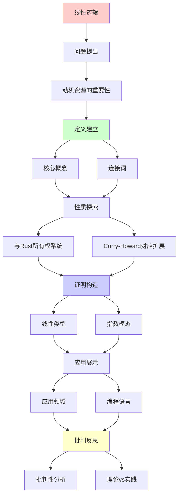
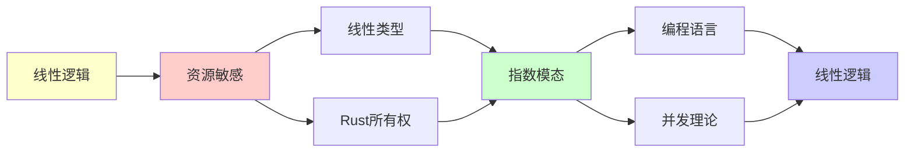

# 线性逻辑

> **主题**: 资源敏感的逻辑系统
> **创建日期**: 2025-12-02
> **难度**: ⭐⭐⭐⭐ (高级)
> **核心**: Rust所有权系统的理论基础

---

## 📋 目录

- [线性逻辑](#线性逻辑)
  - [📋 目录](#-目录)
  - [1. 动机：资源的重要性](#1-动机资源的重要性)
    - [1.1 经典逻辑的问题](#11-经典逻辑的问题)
    - [1.2 线性逻辑的直觉](#12-线性逻辑的直觉)
  - [2. 核心概念](#2-核心概念)
    - [2.1 连接词](#21-连接词)
    - [2.2 指数模态](#22-指数模态)
  - [3. 与Rust所有权系统](#3-与rust所有权系统)
    - [3.1 对应关系](#31-对应关系)
    - [3.2 借用检查器](#32-借用检查器)
  - [4. Curry-Howard对应扩展](#4-curry-howard对应扩展)
  - [5. 应用领域](#5-应用领域)
    - [5.1 编程语言](#51-编程语言)
    - [5.2 并发理论](#52-并发理论)
    - [5.3 量子计算](#53-量子计算)
  - [6. 批判性分析](#6-批判性分析)
    - [6.1 理论价值](#61-理论价值)
    - [6.2 工程实践](#62-工程实践)
    - [6.3 未来方向](#63-未来方向)
  - [📚 参考文献](#-参考文献)
    - [开创性论文](#开创性论文)
    - [编程语言应用](#编程语言应用)
    - [在线资源](#在线资源)
  - [🎯 关键要点](#-关键要点)
    - [核心概念](#核心概念)
    - [深刻洞察](#深刻洞察)
    - [实践意义](#实践意义)
  - [7. 主题-子主题论证逻辑关系图](#7-主题-子主题论证逻辑关系图)
    - [7.1 论证依赖关系](#71-论证依赖关系)
    - [7.2 概念依赖关系](#72-概念依赖关系)
  - [8. 参考资源](#8-参考资源)
    - [8.1 经典论文](#81-经典论文)
    - [8.2 教材](#82-教材)
    - [8.3 在线资源](#83-在线资源)

---

## 1. 动机：资源的重要性

### 1.1 经典逻辑的问题

**经典逻辑中的"不合理"**:

```text
规则: A ⊢ A ∧ A (复制)
      A ∧ B ⊢ A (弱化)

问题: 如果A代表资源...

例子:
  "你有5美元" ⊢ "你有5美元 ∧ 你有5美元"
  ❌ 错误！资源不能无中生有

  "你有5美元 ∧ 票3美元" ⊢ "你有5美元"
  ❌ 丢弃票的成本？
```

**Curry-Howard中的问题**:

```text
经典逻辑 ↔ 简单类型λ演算

λx.⟨x,x⟩ : A → A×A
  ↑
  复制！内存double

λxy.x : A×B → A
  ↑
  丢弃y！内存泄漏
```

**需求**: 资源敏感的逻辑！

### 1.2 线性逻辑的直觉

**核心思想** (Girard 1987):

> 每个假设**恰好使用一次**
> 资源必须被消耗，不能复制或丢弃

**简单例子**:

```text
线性逻辑:
  $5 ⊗ ($3票) ⊸ ($2找零 ⊗ 票)
   ↑     ↑           ↑        ↑
  花掉  花掉        获得      获得

所有资源被追踪！
```

---

## 2. 核心概念

### 2.1 连接词

**乘法连接词** (Multiplicative):

```text
A ⊗ B (张量积, tensor):
  "A和B都有，但各用一次"

  规则:
  Γ⊢A  Δ⊢B
  ─────────── (⊗-I)
  Γ,Δ ⊢ A⊗B

  Γ,A,B ⊢ C
  ────────── (⊗-E)
  Γ,A⊗B ⊢ C

A ⅋ B (par, 对偶):
  A⊥ ⊗ B⊥ 的对偶

A ⊸ B (线性蕴含):
  "消耗A产生B"

  A ⊸ B ≡ A⊥ ⅋ B
```

**加法连接词** (Additive):

```text
A & B (with, 外部选择):
  "可以选择A或B，但选择后另一个丢失"

A ⊕ B (plus, 内部选择):
  "我选择给你A或B"

对偶: (A&B)⊥ = A⊥⊕B⊥
```

### 2.2 指数模态

**!A (of course)**: "A可以任意使用"

```text
规则:
Γ,A,A ⊢ B          Γ ⊢ B
──────────  (收缩)  ──────── (弱化)
Γ,!A ⊢ B           Γ,!A ⊢ B

!A ⊢ A              !A ⊢ !!A
────── (解引用)    ──────── (提升)

→ !A = "无限供应的A"
```

**?A (why not)**: 对偶, "A可以任意丢弃"

```text
?A = (!A⊥)⊥
```

**深刻性**:

> 线性逻辑 = 直觉主义逻辑 - 结构规则
> 经典逻辑 = 线性逻辑 + 指数模态
> !A = 经典命题A

---

## 3. 与Rust所有权系统

### 3.1 对应关系

**Rust所有权 ↔ 线性类型**:

```text
线性逻辑         Rust
────────────────────────────
A ⊸ B           fn(A) -> B (转移所有权)
A ⊗ B           (A, B) (都拥有)
!A              &A (不可变借用)
                Copy trait (可复制)

核心:
- 值默认线性 (move语义)
- 引用是指数模态 (可复制)
```

**示例**:

```rust
// 线性 (默认)
fn consume(s: String) -> usize {
    s.len()  // s被消耗
}

let s = String::from("hello");
let len = consume(s);
// s不可再用 ✓ 线性

// 指数模态 (借用)
fn borrow(s: &String) -> usize {
    s.len()  // s未消耗
}

let s = String::from("hello");
let len1 = borrow(&s);
let len2 = borrow(&s);  // 可多次借用 ✓
// s仍可用 ✓ 指数
```

**类型对应**:

```text
String          线性类型 (A)
&String         指数类型 (!A)
&mut String     ?(A⊸B) (独占借用)

move语义 = 线性蕴含 ⊸
Copy trait = 指数模态 !
```

### 3.2 借用检查器

**Rust借用规则 ↔ 线性逻辑规则**:

```text
规则1: 值被移动后不可用
  → 线性假设用完即消耗

规则2: 不可变借用可多个
  → !A ⊢ !A ⊗ !A (指数可复制)

规则3: 可变借用唯一
  → ?A不允许复制

规则4: 生命周期
  → 类型依赖于时间 (依赖类型扩展)
```

**形式化 (简化)**:

```text
Γ ⊢ t : A
──────────── (move)
Γ ⊢ use(t) : B
∅ ⊢ ...       (Γ中的t不可再用)

Γ ⊢ t : A
──────────── (borrow)
Γ ⊢ &t : !A
Γ ⊢ t : A    (t仍可用！)
```

参考详细: [06.4 类型系统与编程语言](../06_工程实践应用/06.4_类型系统与编程语言.md)

---

## 4. Curry-Howard对应扩展

**经典Curry-Howard**:

```text
直觉主义逻辑 ≅ 简单类型λ演算
```

**线性Curry-Howard**:

```text
线性逻辑 ≅ 线性类型λ演算

命题    类型       程序
──────────────────────────────
A ⊸ B   A → B     线性函数 (消耗参数)
A ⊗ B   A × B     线性对 (都使用)
A ⅋ B   ...       并发?
!A      !A        可复制类型
?A      ?A        可丢弃类型
```

**范畴模型**:

```text
线性逻辑的范畴语义:
- 对称单子闭范畴 (Symmetric Monoidal Closed Category)
- ⊗ = 张量积
- ⊸ = 内Hom
- ! = 余单子 (Comonad)

参考: [03.1 CCC](03.1_笛卡尔闭范畴CCC.md), [00.2 Curry-Howard-Lambek](../00_核心理论体系/00.2_Curry-Howard-Lambek对应.md)
```

---

## 5. 应用领域

### 5.1 编程语言

**1. Rust** ✅ (实用)

- 所有权系统 = 线性类型
- 借用 = 指数模态
- 生命周期 = 依赖类型扩展

**2. Linear Haskell** ⚠️ (实验)

- GHC扩展
- 线性箭头 `a %1 -> b`

**3. ATS** ⚠️ (学术)

- 完整线性类型系统

### 5.2 并发理论

**应用**: 进程演算 (Process Calculi)

```text
A ⅋ B = "A和B并发执行"

CCS, π演算的线性逻辑语义
```

### 5.3 量子计算

**量子线性逻辑**:

```text
No-cloning定理:
  量子态不能复制

→ 量子态 = 线性类型！
  测量 = 消耗
```

参考: [05.5 量子计算](../05_现代理论发展/05.5_量子计算与RE.md)

---

## 6. 批判性分析

### 6.1 理论价值

**优势**:

- ✅ 资源追踪精确
- ✅ Curry-Howard扩展
- ✅ 并发/量子基础

**局限**:

- ⚠️ 实践采用有限
- ⚠️ 编程困难 (过于限制)
- ⚠️ 工具支持不足

### 6.2 工程实践

**成功案例**:

- ✅ Rust (主流！)
- ⚠️ Linear Haskell (小众)

**失败案例**:

- ❌ Clean语言 (未流行)

**批判**:

> 纯线性类型过于严格
> Rust的混合方案更实用:
>
> - 默认线性
> - 允许Copy
> - 借用逃生舱

### 6.3 未来方向

**研究前沿**:

- 线性依赖类型
- 分离逻辑集成 (见 [分离逻辑](03.6_分离逻辑.md) - 待创建)
- 并发线性逻辑

---

## 📚 参考文献

### 开创性论文

[1] **Girard, J.-Y.** (1987). "Linear Logic"
     _Theoretical Computer Science_ 50(1): 1-102.
     doi:10.1016/0304-3975(87)90045-4

[2] **Girard, J.-Y., Lafont, Y., & Taylor, P.** (1989).
     _Proofs and Types_
     Cambridge University Press. ISBN 978-0521371810.
     - Chapter 8: Linear Logic

### 编程语言应用

[3] **Bernardy, J.-P. et al.** (2018). "Linear Haskell: Practical Linearity in a Higher-Order Polymorphic Language"
     _POPL 2018_. doi:10.1145/3158093

[4] **Jung, R. et al.** (2017). "RustBelt: Securing the Foundations of the Rust Programming Language"
     _POPL 2018_. doi:10.1145/3158154
     - Rust所有权系统形式化

[5] **Matsakis, N. D. & Klock II, F. S.** (2014). "The Rust Language"
     _Ada Letters_ 34(3): 103-104.

### 在线资源

[6] **nLab**: Linear Logic
     URL: https://ncatlab.org/nlab/show/linear+logic
     (访问: 2025-12-02)

[7] **Rust Reference**: Ownership
     URL: https://doc.rust-lang.org/reference/ownership.html
     (访问: 2025-12-02)

---

## 🎯 关键要点

### 核心概念

1. **资源敏感**: 每个假设恰好用一次
2. **⊗ vs ⊸**: 张量积 vs 线性蕴含
3. **!A**: 指数模态 (可复制)
4. **Rust**: 线性逻辑的工业成功

### 深刻洞察

> 经典逻辑 = 线性逻辑 + !
> Rust = 线性类型 + 借用
> 内存安全 = 资源线性性

### 实践意义

**工程价值**: ⭐⭐⭐⭐⭐

- Rust已证明线性类型可行
- 内存安全编译时保证
- 无GC高性能

---

## 7. 主题-子主题论证逻辑关系图

### 7.1 论证依赖关系



### 7.2 概念依赖关系



**论证逻辑链条**：

1. **问题提出** (1节)：
   - 动机资源的重要性

2. **定义建立** (2节)：
   - 核心概念

3. **性质探索** (3-4节)：
   - 与Rust所有权系统（3节）
   - Curry-Howard对应扩展（4节）

4. **证明构造** (贯穿全文)：
   - 线性类型和指数模态

5. **应用展示** (5节)：
   - 应用领域

6. **批判反思** (6节)：
   - 批判性分析

---

## 8. 参考资源

### 8.1 经典论文

1. **Girard, J.-Y.** (1987). "Linear Logic"
   - _Theoretical Computer Science_, 50(1), 1-102
   - 线性逻辑奠基论文

2. **Girard, J.-Y., Lafont, Y., & Taylor, P.** (1989)
   - _Proofs and Types_
   - Cambridge University Press. ISBN 978-0521371810
   - 证明与类型

### 8.2 教材

1. **Girard, J.-Y.** (1995)
   - _Linear Logic: Its Syntax and Semantics_
   - In Girard, Lafont, & Regnier (eds.), _Advances in Linear Logic_
   - Cambridge University Press

2. **Troelstra, A. S.** (1992)
   - _Lectures on Linear Logic_
   - CSLI Publications. ISBN 978-0937073800
   - 线性逻辑教程

### 8.3 在线资源

1. **Linear Logic**
   - https://en.wikipedia.org/wiki/Linear_logic
   - 线性逻辑基本概念

2. **Rust Ownership**
   - https://doc.rust-lang.org/book/ch04-00-understanding-ownership.html
   - Rust所有权系统

3. **nLab - Linear Logic**
   - https://ncatlab.org/nlab/show/linear+logic
   - 线性逻辑nLab条目

---

**最后更新**: 2025-12-04
**难度**: ⭐⭐⭐⭐
**推荐**: Rust开发者必读
**批判性**: 理论优雅，Rust使其实用
**状态**: ✅ 已添加主题-子主题论证逻辑关系图和参考资源章节

**另见**:

- [06.4 类型系统与编程语言](../06_工程实践应用/06.4_类型系统与编程语言.md) (Rust所有权)
- [00.2 Curry-Howard-Lambek](../00_核心理论体系/00.2_Curry-Howard-Lambek对应.md)
- [03.1 笛卡尔闭范畴](03.1_笛卡尔闭范畴CCC.md)
