# 分离逻辑 (Separation Logic)

> **主题**: 程序验证的核心逻辑系统
> **创建日期**: 2025-12-02
> **难度**: ⭐⭐⭐⭐⭐ (高级)
> **核心**: Rust借用检查器的深层理论基础

---

## 📋 目录

- [分离逻辑 (Separation Logic)](#分离逻辑-separation-logic)
  - [📋 目录](#-目录)
  - [1. 动机：推理堆内存](#1-动机推理堆内存)
    - [1.1 Hoare逻辑的局限](#11-hoare逻辑的局限)
    - [1.2 分离逻辑的创新](#12-分离逻辑的创新)
  - [2. 核心概念](#2-核心概念)
    - [2.1 分离合取 (\*)](#21-分离合取-)
    - [2.2 点到断言 (↦)](#22-点到断言-)
    - [2.3 魔术棒 (−\*)](#23-魔术棒-)
  - [3. 推理规则](#3-推理规则)
    - [3.1 Frame规则](#31-frame规则)
    - [3.2 分配/回收规则](#32-分配回收规则)
  - [4. Rust借用检查的理论基础](#4-rust借用检查的理论基础)
    - [4.1 所有权 ↔ 分离逻辑](#41-所有权--分离逻辑)
    - [4.2 RustBelt项目](#42-rustbelt项目)
  - [5. 工具与应用](#5-工具与应用)
    - [5.1 验证工具](#51-验证工具)
    - [5.2 工业应用](#52-工业应用)
  - [6. 批判性分析](#6-批判性分析)
    - [6.1 理论优势](#61-理论优势)
    - [6.2 实践挑战](#62-实践挑战)
    - [6.3 未来方向](#63-未来方向)
  - [📚 参考文献](#-参考文献)
    - [开创性论文](#开创性论文)
    - [形式化与工具](#形式化与工具)
    - [标准教材](#标准教材)
    - [在线资源](#在线资源)
  - [🎯 关键要点](#-关键要点)
    - [核心概念](#核心概念)
    - [深刻洞察](#深刻洞察)
    - [工程价值](#工程价值)
  - [7. 主题-子主题论证逻辑关系图](#7-主题-子主题论证逻辑关系图)
    - [7.1 论证依赖关系](#71-论证依赖关系)
    - [7.2 概念依赖关系](#72-概念依赖关系)
  - [8. 参考资源](#8-参考资源)
    - [8.1 经典论文](#81-经典论文)
    - [8.2 教材](#82-教材)
    - [8.3 在线资源](#83-在线资源)

---

## 1. 动机：推理堆内存

### 1.1 Hoare逻辑的局限

**经典Hoare三元组**: `{P} C {Q}`

```text
例子: 链表反转

{list(x,α)} reverse(x) {list(result,rev(α))}

问题:
- list(x,α) 描述了什么内存？
- 其他内存呢？
- 并发修改如何处理？
```

**问题**: Hoare逻辑对**堆别名**推理困难

```c
// C代码
int *p = malloc(sizeof(int));
*p = 5;
int *q = p;  // 别名!
*q = 10;
// *p = ?  难以推理
```

### 1.2 分离逻辑的创新

**核心思想** (O'Hearn, Reynolds, Yang 2001):

> 引入**分离合取** `*`
> P * Q = "P和Q描述**不相交**的堆部分"

**优势**:

```text
{list(x,α) * list(y,β)} ...
  ↑
  x和y的链表在堆中分离！
  → 无别名
  → 独立推理
```

---

## 2. 核心概念

### 2.1 分离合取 (*)

**定义**:

```text
(h, s) ⊨ P * Q 当且仅当:
  ∃h₁, h₂. h = h₁ ⊎ h₂  (堆分离并)
           (h₁, s) ⊨ P
           (h₂, s) ⊨ Q
```

**与普通合取对比**:

```text
P ∧ Q: P和Q在同一堆上都成立
P * Q: P和Q在不相交堆部分上成立

例子:
x↦5 ∧ x↦10  ❌ 矛盾
x↦5 * y↦10  ✅ (x≠y)
```

**性质**:

```text
交换: P * Q ⟺ Q * P
结合: (P*Q)*R ⟺ P*(Q*R)
单位: P * emp ⟺ P (emp=空堆)
```

### 2.2 点到断言 (↦)

**定义**:

```text
(h, s) ⊨ e ↦ v 当且仅当:
  dom(h) = {⟦e⟧ₛ}  (h只有一个单元)
  h(⟦e⟧ₛ) = ⟦v⟧ₛ
```

**直觉**: `x ↦ 5` = "堆中**恰好**x位置存储5"

**组合**:

```text
x ↦ 5 * y ↦ 10 * z ↦ 15
  ↑
  堆恰好有3个单元: x, y, z
  (x, y, z互不相同)
```

### 2.3 魔术棒 (−*)

**定义** (分离蕴含):

```text
(h, s) ⊨ P −* Q 当且仅当:
  ∀h'. (h', s)⊨P 且 h⊥h' → (h⊎h', s)⊨Q
    ↑                ↑
  任何满足P的     与h分离
  分离堆h'
```

**直觉**: "如果给我满足P的堆，我能产生满足Q的堆"

**应用**: 部分数据结构规约

---

## 3. 推理规则

### 3.1 Frame规则

**核心规则** (局部推理):

```text
{P} C {Q}
───────────────── (Frame)
{P * R} C {Q * R}

只要C不修改R描述的堆
```

**威力**:

```text
局部推理 → 模块化验证

例子:
{x↦_} x:=5 {x↦5}
─────────────────────── (Frame: * y↦10)
{x↦_ * y↦10} x:=5 {x↦5 * y↦10}
  ↑
  y未改变！自动推导
```

**意义**:

> 只需关注**被修改的堆部分**
> 其他部分自动保持
> → 可扩展验证

### 3.2 分配/回收规则

**分配**:

```text
{emp} x := alloc(v) {x ↦ v}

新分配的单元与现有堆分离
```

**回收**:

```text
{x ↦ _} free(x) {emp}

释放后，堆变空
```

**示例推导**:

```c
// C代码
int *x = malloc(sizeof(int));  // {emp} → {x↦_}
*x = 5;                         // {x↦_} → {x↦5}
int y = *x;                     // {x↦5} → {x↦5 ∧ y=5}
free(x);                        // {x↦5} → {emp}
```

---

## 4. Rust借用检查的理论基础

### 4.1 所有权 ↔ 分离逻辑

**对应关系**:

```text
Rust概念        分离逻辑
────────────────────────────────
所有权          唯一指针 (x↦v)
不可变借用 &    共享读 (线性逻辑!引入)
可变借用 &mut   独占写 (x↦_的唯一持有)
move语义        堆部分转移 (P−*Q)
生命周期        时间依赖谓词
```

**示例**:

```rust
fn swap(x: &mut i32, y: &mut i32) {
    let tmp = *x;
    *x = *y;
    *y = tmp;
}
```

**分离逻辑规约**:

```text
前置: x↦v₁ * y↦v₂
后置: x↦v₂ * y↦v₁

关键: x↦_ * y↦_ 蕴含 x≠y (分离!)
      → 无别名
      → 安全swap
```

### 4.2 RustBelt项目

**目标**: Rust内存安全的形式化证明

**方法**: Iris框架 (并发分离逻辑)

```text
RustBelt (2018):
- 用Coq形式化Rust语义
- 证明类型系统安全性
- 基于分离逻辑

结果: ✅ Rust核心安全性已证明
```

**参考**: [06.5 形式化验证](../06_工程实践应用/06.5_形式化验证.md)

---

## 5. 工具与应用

### 5.1 验证工具

**1. VeriFast** (自动验证器)

- C/Java程序验证
- 分离逻辑标注
- 自动推导

**2. Viper** (中间语言)

- 分离逻辑IR
- 插件式验证后端

**3. Iris** (Coq框架)

- 并发分离逻辑
- 高阶、依赖类型
- RustBelt基础

### 5.2 工业应用

**成功案例**:

```text
✅ Facebook Infer:
   - 自动bug检测
   - 分离逻辑静态分析
   - 数百万行代码

✅ Microsoft HAVOC:
   - C程序验证

✅ RustBelt:
   - Rust安全性证明
```

---

## 6. 批判性分析

### 6.1 理论优势

**突破性**:

- ✅ 局部推理 (Frame规则)
- ✅ 模块化验证
- ✅ 并发扩展 (CSL)

**理论优美**:

- ✅ 线性逻辑扩展
- ✅ Curry-Howard对应
- ✅ BI逻辑 (Bunched Implications)

### 6.2 实践挑战

**工具成熟度**: ⚠️

```text
问题:
- 自动化程度有限
- 需要人工标注
- 学习曲线陡峭

对比:
- Rust借用检查: 自动 ✅
- VeriFast: 半自动 ⚠️
- Iris: 完全人工 ❌
```

**适用范围**:

```text
✅ 适合:
   - 关键系统 (seL4)
   - 内存安全研究
   - Rust形式化

⚠️ 不适合:
   - 一般应用 (成本过高)
   - 快速开发
```

### 6.3 未来方向

**研究前沿**:

- 并发分离逻辑 (Iris, iCAP)
- 分离逻辑 + 依赖类型
- 自动化改进

---

## 📚 参考文献

### 开创性论文

[1] **Reynolds, J. C.** (2002). "Separation Logic: A Logic for Shared Mutable Data Structures"
     _LICS 2002_. doi:10.1109/LICS.2002.1029817

[2] **O'Hearn, P., Reynolds, J., & Yang, H.** (2001). "Local Reasoning about Programs that Alter Data Structures"
     _CSL 2001_. Springer LNCS 2142: 1-19.

### 形式化与工具

[3] **Jung, R. et al.** (2018). "RustBelt: Securing the Foundations of the Rust Programming Language"
     _POPL 2018_. doi:10.1145/3158154

[4] **Jacobs, B. et al.** (2011). "VeriFast: A Powerful, Sound, Predictable, Fast Verifier for C and Java"
     _NFM 2011_. Springer LNCS 6617: 41-55.

[5] **Krebbers, R. et al.** (2017). "The Essence of Higher-Order Concurrent Separation Logic"
     _ESOP 2017_. (Iris框架)

### 标准教材

[6] **Reynolds, J. C. & O'Hearn, P. W.** (未出版). _Separation Logic Lecture Notes_
     Carnegie Mellon University.

[7] **Appel, A. W.** (2014). _Program Logics for Certified Compilers_
     Cambridge University Press.
     - Chapter 9: Separation Logic

### 在线资源

[8] **Software Foundations Vol 6**: Separation Logic
     URL: https://softwarefoundations.cis.upenn.edu/slf-current/
     (访问: 2025-12-02)

[9] **Iris Project**: https://iris-project.org/
     (访问: 2025-12-02)

---

## 🎯 关键要点

### 核心概念

1. **分离合取 (*)**: 堆不相交
2. **Frame规则**: 局部推理
3. **点到 (↦)**: 精确堆单元
4. **应用**: Rust借用检查理论

### 深刻洞察

> 分离逻辑 = 线性逻辑 + 堆模型
> Frame规则 = 模块化验证关键
> Rust = 分离逻辑的实用化

### 工程价值

**影响**: ⭐⭐⭐⭐⭐

- Facebook Infer (工业应用)
- RustBelt (Rust安全证明)
- 自动bug检测基础

---

## 7. 主题-子主题论证逻辑关系图

### 7.1 论证依赖关系

```mermaid
graph TD
    A[分离逻辑] --> B[问题提出]
    B --> C[动机推理堆内存]

    C --> D[定义建立]
    D --> D1[核心概念]
    D --> D2[分离合取]

    D1 --> E[性质探索]
    D2 --> E
    E --> E1[推理规则]
    E --> E2[Rust借用检查理论基础]

    E1 --> F[证明构造]
    E2 --> F
    F --> F1[Frame规则]
    F --> F2[分配回收规则]

    F1 --> G[应用展示]
    F2 --> G
    G --> G1[工具与应用]
    G --> G2[工业应用]

    G1 --> H[批判反思]
    G2 --> H
    H --> H1[批判性分析]
    H --> H2[理论vs实践]

    style A fill:#ffcccc
    style D fill:#ccffcc
    style F fill:#ccccff
    style H fill:#ffffcc
```



### 7.2 概念依赖关系

```mermaid
graph LR
    A[分离逻辑] --> B[堆内存推理]

    B --> C[分离合取]
    B --> D[Frame规则]

    C --> E[Rust借用]
    D --> E

    E --> F[工具应用]
    E --> G[形式化验证]

    F --> H[分离逻辑]
    G --> H

    style A fill:#ffffcc
    style B fill:#ffcccc
    style E fill:#ccffcc
    style H fill:#ccccff
```



**论证逻辑链条**：

1. **问题提出** (1节)：
   - 动机推理堆内存

2. **定义建立** (2节)：
   - 核心概念

3. **性质探索** (3-4节)：
   - 推理规则（3节）
   - Rust借用检查的理论基础（4节）

4. **证明构造** (贯穿全文)：
   - Frame规则和分配回收规则

5. **应用展示** (5节)：
   - 工具与应用

6. **批判反思** (6节)：
   - 批判性分析

---

## 8. 参考资源

### 8.1 经典论文

1. **Reynolds, J. C.** (2002). "Separation Logic: A Logic for Shared Mutable Data Structures"
   - _LICS 2002_. Proceedings of the 17th Annual IEEE Symposium on Logic in Computer Science
   - 分离逻辑奠基论文

2. **O'Hearn, P., Reynolds, J., & Yang, H.** (2001). "Local Reasoning about Programs that Alter Data Structures"
   - _CSL 2001_. Computer Science Logic
   - 局部推理

### 8.2 教材

1. **Reynolds, J. C., & O'Hearn, P. W.** (未出版)
   - _Separation Logic Lecture Notes_
   - Carnegie Mellon University

2. **Appel, A. W.** (2014)
   - _Program Logics for Certified Compilers_
   - Cambridge University Press. ISBN 978-1107036504
   - Chapter 9: Separation Logic

### 8.3 在线资源

1. **Separation Logic**
   - https://en.wikipedia.org/wiki/Separation_logic
   - 分离逻辑基本概念

2. **Software Foundations Vol 6**
   - https://softwarefoundations.cis.upenn.edu/slf-current/
   - 分离逻辑教程

3. **Iris Project**
   - https://iris-project.org/
   - Iris并发分离逻辑框架

---

**最后更新**: 2025-12-04
**难度**: ⭐⭐⭐⭐⭐
**推荐**: 系统程序员、验证研究者必读
**批判性**: 理论强大，工具待成熟
**状态**: ✅ 已添加主题-子主题论证逻辑关系图和参考资源章节

**另见**:

- [03.5 线性逻辑](03.5_线性逻辑.md) (理论基础)
- [06.4 类型系统与编程语言](../06_工程实践应用/06.4_类型系统与编程语言.md) (Rust)
- [06.5 形式化验证](../06_工程实践应用/06.5_形式化验证.md)
