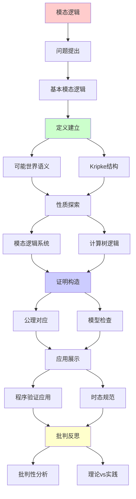
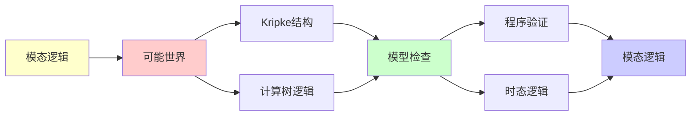

# 模态逻辑与可能世界 (Modal Logic)

> **主题**: 必然性与可能性的形式化
> **创建日期**: 2025-12-02
> **难度**: ⭐⭐⭐⭐
> **应用**: 程序验证、AI推理、哲学

---

## 📋 目录

- [模态逻辑与可能世界 (Modal Logic)](#模态逻辑与可能世界-modal-logic)
  - [📋 目录](#-目录)
  - [1. 基本模态逻辑](#1-基本模态逻辑)
    - [1.1 语法](#11-语法)
    - [1.2 直觉](#12-直觉)
  - [2. 可能世界语义](#2-可能世界语义)
    - [2.1 Kripke结构](#21-kripke结构)
    - [2.2 真值定义](#22-真值定义)
  - [3. 模态逻辑系统](#3-模态逻辑系统)
    - [3.1 系统K到S5](#31-系统k到s5)
    - [3.2 公理对应](#32-公理对应)
  - [4. 计算树逻辑](#4-计算树逻辑)
    - [4.1 CTL和CTL\*](#41-ctl和ctl)
    - [4.2 模型检查](#42-模型检查)
  - [5. 程序验证应用](#5-程序验证应用)
    - [5.1 Hoare逻辑扩展](#51-hoare逻辑扩展)
    - [5.2 时态规范](#52-时态规范)
  - [6. 批判性分析](#6-批判性分析)
    - [6.1 理论优势](#61-理论优势)
    - [6.2 工程价值](#62-工程价值)
    - [6.3 与范畴论](#63-与范畴论)
  - [📚 参考文献](#-参考文献)
    - [经典教材](#经典教材)
    - [可能世界语义](#可能世界语义)
    - [时态逻辑](#时态逻辑)
    - [在线资源](#在线资源)
  - [🎯 关键要点](#-关键要点)
    - [核心概念](#核心概念)
    - [深刻洞察](#深刻洞察)
    - [实践意义](#实践意义)
  - [7. 主题-子主题论证逻辑关系图](#7-主题-子主题论证逻辑关系图)
    - [7.1 论证依赖关系](#71-论证依赖关系)
    - [7.2 概念依赖关系](#72-概念依赖关系)
  - [8. 参考资源](#8-参考资源)
    - [8.1 经典论文](#81-经典论文)
    - [8.2 教材](#82-教材)
    - [8.3 在线资源](#83-在线资源)

---

## 1. 基本模态逻辑

### 1.1 语法

**命题模态逻辑**:

```text
公式 φ ::= p | ⊥ | φ → φ | □φ | ◇φ

其中:
□φ : "必然φ" (必然算子 Necessity)
◇φ : "可能φ" (可能算子 Possibility)

对偶关系:
◇φ ≡ ¬□¬φ
□φ ≡ ¬◇¬φ
```

### 1.2 直觉

**不同解释**:

```text
哲学:
□φ = "在所有可能世界中φ为真"
◇φ = "存在可能世界使φ为真"

时间逻辑:
□φ = "总是φ" (Always, G)
◇φ = "最终φ" (Eventually, F)

认知逻辑:
□φ = "Agent知道φ" (Knowledge)
◇φ = "与Agent知识兼容"

道义逻辑:
□φ = "义务φ" (Obligation)
◇φ = "允许φ" (Permission)
```

---

## 2. 可能世界语义

### 2.1 Kripke结构

**定义2.1** (Kripke模型):

```text
M = (W, R, V)

W: 可能世界集合
R ⊆ W×W: 可达关系 (Accessibility)
V: W → 2^Prop: 赋值函数

直觉:
- w ∈ W: 一个可能的状态/世界
- (w,w') ∈ R: 从w可达到w'
- V(w): 在世界w中为真的命题
```

**图示**:

```text
    w₀ ──→ w₁
    │      │
    ↓      ↓
    w₂ ──→ w₃

例:
w₀: {p}
w₁: {q}
w₂: {p,q}
w₃: {}
```

### 2.2 真值定义

**满足关系** M,w ⊨ φ:

```text
M,w ⊨ p     ⟺ p ∈ V(w)
M,w ⊨ φ→ψ   ⟺ M,w ⊭ φ or M,w ⊨ ψ
M,w ⊨ □φ    ⟺ ∀w'. (w,w')∈R → M,w' ⊨ φ
M,w ⊨ ◇φ    ⟺ ∃w'. (w,w')∈R ∧ M,w' ⊨ φ

关键: □看所有可达世界，◇看存在可达世界
```

---

## 3. 模态逻辑系统

### 3.1 系统K到S5

**系统K** (最弱):

```text
公理:
K: □(p→q) → (□p→□q)

规则:
Nec: 若 ⊢ φ 则 ⊢ □φ
MP: φ, φ→ψ ⊢ ψ

对应: R任意 (无约束)
```

**系统T**:

```text
K + T: □φ → φ (自反性)

对应: R自反 (wRw)
```

**系统S4**:

```text
T + 4: □φ → □□φ (传递性)

对应: R自反+传递
```

**系统S5**:

```text
S4 + 5: ◇φ → □◇φ (对称性)

对应: R等价关系

特殊性: S5中 □◇□φ ≡ □φ
```

### 3.2 公理对应

**Sahlqvist对应定理**:

```text
公理                 R的性质
─────────────────────────────────
□φ → φ              自反 (∀w. wRw)
□φ → □□φ            传递 (wRw'Rw'' → wRw'')
φ → □◇φ             对称 (wRw' → w'Rw)
◇□φ → □◇φ           欧几里得 (wRw',wRw'' → w'Rw'')

深刻: 逻辑公理 ↔ 语义性质
```

---

## 4. 计算树逻辑

### 4.1 CTL和CTL*

**CTL** (Computation Tree Logic):

```text
路径量词:
A: 所有路径 (All paths)
E: 存在路径 (Exists path)

时序算子:
X: 下一状态 (neXt)
F: 最终 (Eventually)
G: 总是 (Globally)
U: 直到 (Until)

CTL公式:
AG φ: 所有路径上总是φ
EF φ: 存在路径最终φ
AF φ: 所有路径最终φ (活性)
AG EF φ: 无限经常可能
```

**示例**:

```text
安全性: AG ¬error
活性: AF success
公平性: AG (request → AF grant)
```

### 4.2 模型检查

**算法** (CTL模型检查):

```text
输入: Kripke结构M, CTL公式φ
输出: {w ∈ W | M,w ⊨ φ}

复杂度:
时间: O(|M| × |φ|) (线性!)
空间: O(|M|)

→ 实践可行
```

**工具**:

- NuSMV
- SPIN
- TLA+ TLC

---

## 5. 程序验证应用

### 5.1 Hoare逻辑扩展

**动态逻辑** (PDL):

```text
[α]φ: 执行程序α后必然φ
⟨α⟩φ: 存在α的执行使得φ

程序构造:
α;β: 顺序
α∪β: 选择
α*: 循环

例:
[while B do C]φ
≡ φ ∨ (B ∧ ⟨C⟩[while B do C]φ)
```

### 5.2 时态规范

**LTL** (Linear Temporal Logic):

```text
□φ: 总是φ (G)
◇φ: 最终φ (F)
φ U ψ: φ直到ψ

规范:
安全: □(¬error)
活性: □(request → ◇grant)
公平: □◇scheduled
```

参考: [06.5 形式化验证](../06_工程实践应用/06.5_形式化验证.md)

---

## 6. 批判性分析

### 6.1 理论优势

**优势**:

- ✅ 语义优雅 (可能世界)
- ✅ 公理对应定理
- ✅ 模型检查高效

**局限**:

- ⚠️ 状态爆炸 (模型检查)
- ⚠️ 表达力限制 (一阶难)
- ⚠️ 哲学争议 (可能世界本体)

### 6.2 工程价值

**成功应用**: ⭐⭐⭐⭐

```text
✅ 硬件验证 (Intel用CTL)
✅ 协议验证 (SPIN)
✅ TLA+ (亚马逊S3等)
✅ AI规划

但: 软件验证困难 (状态空间大)
```

### 6.3 与范畴论

**模态范畴语义**:

```text
□φ = 内部算子 (Interior)
◇φ = 闭包算子 (Closure)

对应: Topos中的模态

参考: [03.2 Topos理论](03.2_Topos理论.md)
```

---

## 📚 参考文献

### 经典教材

[1] **Blackburn, P., de Rijke, M., & Venema, Y.** (2001).
     _Modal Logic_
     Cambridge University Press. ISBN 978-0521527149.
     (权威教材)

[2] **Chellas, B. F.** (1980). _Modal Logic: An Introduction_
     Cambridge University Press. ISBN 978-0521295154.

### 可能世界语义

[3] **Kripke, S. A.** (1963). "Semantical Considerations on Modal Logic"
     _Acta Philosophica Fennica_ 16: 83-94.
     (开创性论文)

### 时态逻辑

[4] **Pnueli, A.** (1977). "The Temporal Logic of Programs"
     _FOCS 1977_. doi:10.1109/SFCS.1977.32

[5] **Clarke, E. M., Emerson, E. A., & Sistla, A. P.** (1986). "Automatic Verification of Finite-State Concurrent Systems Using Temporal Logic Specifications"
     _ACM TOPLAS_ 8(2): 244-263.
     (模型检查)

### 在线资源

[6] **Stanford Encyclopedia of Philosophy**: Modal Logic
     URL: https://plato.stanford.edu/entries/logic-modal/
     (访问: 2025-12-02)

---

## 🎯 关键要点

### 核心概念

1. **□和◇**: 必然与可能
2. **Kripke结构**: 可能世界+可达关系
3. **公理对应**: 逻辑↔语义性质
4. **CTL**: 时序逻辑，模型检查

### 深刻洞察

> 模态逻辑 = 关系语义
> 可能世界 = 计算状态
> 模型检查 = 可达性算法

### 实践意义

- 硬件验证成功
- 协议验证广泛
- 软件验证挑战

---

## 7. 主题-子主题论证逻辑关系图

### 7.1 论证依赖关系



### 7.2 概念依赖关系



**论证逻辑链条**：

1. **问题提出** (1节)：
   - 基本模态逻辑

2. **定义建立** (2节)：
   - 可能世界语义

3. **性质探索** (3-4节)：
   - 模态逻辑系统（3节）
   - 计算树逻辑（4节）

4. **证明构造** (贯穿全文)：
   - 公理对应和模型检查

5. **应用展示** (5节)：
   - 程序验证应用

6. **批判反思** (6节)：
   - 批判性分析

---

## 8. 参考资源

### 8.1 经典论文

1. **Kripke, S. A.** (1963). "Semantical Considerations on Modal Logic"
   - _Acta Philosophica Fennica_, 16, 83-94
   - 可能世界语义奠基论文

2. **Pnueli, A.** (1977). "The Temporal Logic of Programs"
   - _FOCS 1977_. Proceedings of the 18th Annual Symposium on Foundations of Computer Science
   - 时态逻辑程序验证

### 8.2 教材

1. **Blackburn, P., de Rijke, M., & Venema, Y.** (2001)
   - _Modal Logic_
   - Cambridge University Press. ISBN 978-0521527149
   - 模态逻辑权威教材

2. **Chellas, B. F.** (1980)
   - _Modal Logic: An Introduction_
   - Cambridge University Press. ISBN 978-0521295154
   - 模态逻辑入门

### 8.3 在线资源

1. **Modal Logic**
   - https://en.wikipedia.org/wiki/Modal_logic
   - 模态逻辑基本概念

2. **Kripke Semantics**
   - https://en.wikipedia.org/wiki/Kripke_semantics
   - Kripke语义

3. **Stanford Encyclopedia of Philosophy - Modal Logic**
   - https://plato.stanford.edu/entries/logic-modal/
   - 模态逻辑哲学视角

---

**最后更新**: 2025-12-04
**难度**: ⭐⭐⭐⭐
**推荐**: 形式化方法人员
**批判性**: 理论深刻，实践有用但受限
**状态**: ✅ 已添加主题-子主题论证逻辑关系图和参考资源章节

**另见**:

- [03.2 Topos理论](03.2_Topos理论.md) (模态范畴语义)
- [06.5 形式化验证](../06_工程实践应用/06.5_形式化验证.md) (TLA+)
- [01.2 Petri网理论](../01_形式系统详解/01.2_Petri网理论.md) (状态空间)
