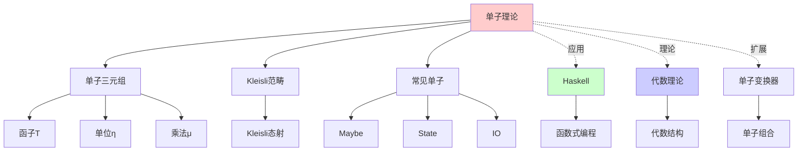
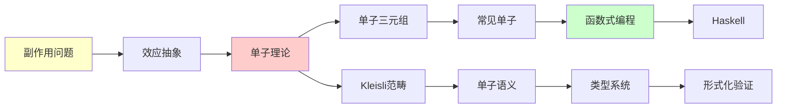
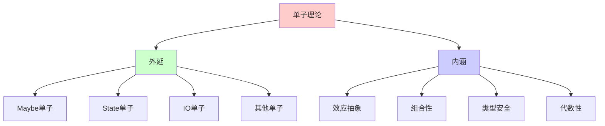
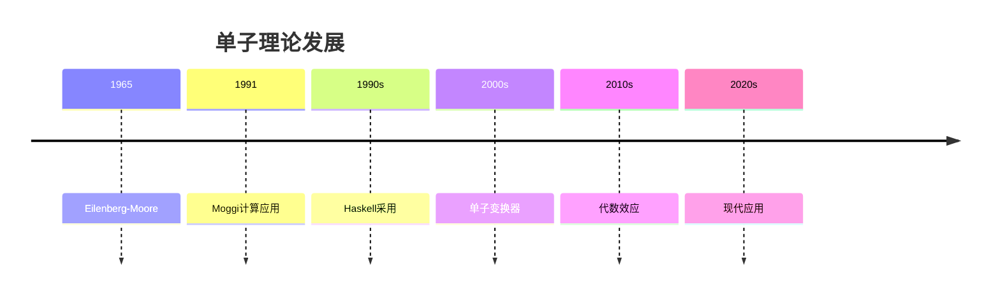
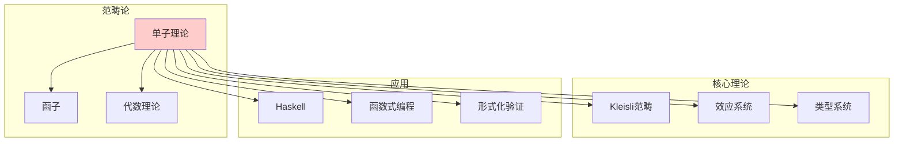
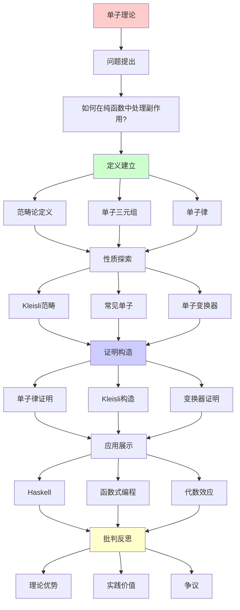
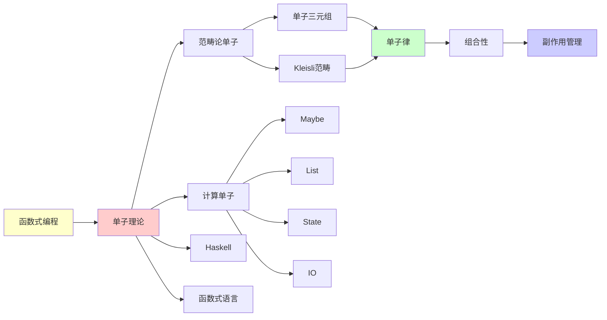

# 单子理论 (Monad Theory)

> **主题**: 范畴论中的计算效应抽象
> **创建日期**: 2025-12-02
> **难度**: ⭐⭐⭐⭐
> **应用**: Haskell, 副作用管理, 代数效应

---

## 📋 目录

- [单子理论 (Monad Theory)](#单子理论-monad-theory)
  - [📋 目录](#-目录)
  - [1. 动机](#1-动机)
    - [1.1 副作用问题](#11-副作用问题)
    - [1.2 单子解决方案](#12-单子解决方案)
  - [2. 范畴论定义](#2-范畴论定义)
    - [2.1 单子三元组](#21-单子三元组)
    - [2.1.1 概念分析：单子](#211-概念分析单子)
      - [定义矩阵](#定义矩阵)
      - [属性分析](#属性分析)
      - [外延分析](#外延分析)
      - [内涵分析](#内涵分析)
      - [关系网络](#关系网络)
    - [2.2 单子律](#22-单子律)
  - [3. Kleisli范畴](#3-kleisli范畴)
  - [4. 常见单子](#4-常见单子)
    - [4.1 Maybe单子](#41-maybe单子)
    - [4.2 List单子](#42-list单子)
    - [4.3 State单子](#43-state单子)
    - [4.4 IO单子](#44-io单子)
  - [5. 单子变换器](#5-单子变换器)
  - [6. 与代数理论](#6-与代数理论)
    - [6.1 单子与代数](#61-单子与代数)
    - [6.2 代数效应](#62-代数效应)
  - [7. 批判性分析](#7-批判性分析)
    - [7.1 理论优势](#71-理论优势)
    - [7.2 实践价值](#72-实践价值)
    - [7.3 争议](#73-争议)
  - [8. 思维表征：单子理论](#8-思维表征单子理论)
    - [8.1 概念关系网络图](#81-概念关系网络图)
    - [8.2 论证逻辑路径图](#82-论证逻辑路径图)
    - [8.3 概念属性矩阵](#83-概念属性矩阵)
    - [8.4 外延内涵分析图](#84-外延内涵分析图)
    - [8.5 理论发展脉络图](#85-理论发展脉络图)
    - [8.6 跨模块关联图](#86-跨模块关联图)
  - [9. 权威资源对标](#9-权威资源对标)
    - [9.1 Wikipedia对标](#91-wikipedia对标)
    - [9.2 国际著名大学课程对标](#92-国际著名大学课程对标)
      - [9.2.1 MIT 18.S097 (Programming with Categories)](#921-mit-18s097-programming-with-categories)
      - [9.2.2 Cambridge Part III (Category Theory)](#922-cambridge-part-iii-category-theory)
    - [9.3 权威教材对标](#93-权威教材对标)
      - [9.3.1 Mac Lane, "Categories for the Working Mathematician"](#931-mac-lane-categories-for-the-working-mathematician)
      - [9.3.2 Moggi, "Notions of Computation and Monads" (1991)](#932-moggi-notions-of-computation-and-monads-1991)
  - [📚 参考文献](#-参考文献)
    - [范畴论](#范畴论)
    - [计算应用](#计算应用)
    - [Haskell](#haskell)
    - [在线资源](#在线资源)
  - [🎯 关键要点](#-关键要点)
    - [核心概念](#核心概念)
    - [深刻洞察](#深刻洞察)
    - [实践意义](#实践意义)
  - [10. 主题-子主题论证逻辑关系图](#10-主题-子主题论证逻辑关系图)
    - [10.1 论证依赖关系](#101-论证依赖关系)
    - [10.2 概念依赖关系](#102-概念依赖关系)
  - [11. 参考资源](#11-参考资源)
    - [11.1 经典论文](#111-经典论文)
    - [11.2 教材](#112-教材)
    - [11.3 在线资源](#113-在线资源)

---

## 1. 动机

### 1.1 副作用问题

**纯函数式编程困境**:

```haskell
-- 纯函数
add :: Int -> Int -> Int
add x y = x + y  -- 无副作用

-- 但现实需要副作用:
print :: String -> ???  -- IO副作用
readFile :: FilePath -> ???  -- IO
parseJSON :: String -> ???  -- 可能失败
random :: () -> ???  -- 非确定性

问题: 如何在纯函数中处理副作用？
```

### 1.2 单子解决方案

**核心思想**:

> 将副作用"包装"在类型中

```haskell
print :: String -> IO ()
readFile :: FilePath -> IO String
parseJSON :: String -> Maybe Value
random :: () -> State StdGen Int

副作用在类型中明确标注 ✅
```

**组合副作用**:

```haskell
-- 组合带副作用的计算
do
  file <- readFile "config.json"
  config <- parseJSON file
  print (show config)

-- 单子提供组合机制！
```

---

## 2. 范畴论定义

### 2.1 单子三元组

**定义2.1** (单子):

范畴 $\mathcal{C}$ 上的**单子** (Monad) 是一个三元组 $(T, \eta, \mu)$，其中：

- **$T: \mathcal{C} \to \mathcal{C}$**: 自函子
- **$\eta: \text{Id} \to T$**: 单位自然变换（unit/return）
- **$\mu: T^2 \to T$**: 乘法自然变换（multiplication/bind）

满足单子律：

1. **左单位律**: $\mu \circ T\eta = \text{id}_T$
2. **右单位律**: $\mu \circ \eta T = \text{id}_T$
3. **结合律**: $\mu \circ T\mu = \mu \circ \mu T$

### 2.1.1 概念分析：单子

#### 定义矩阵

| 维度 | 内容 |
|------|------|
| **形式化定义** | $(T, \eta, \mu)$ 满足单子律 |
| **直观理解** | 计算效应的抽象，副作用的管理 |
| **等价定义** | 1. 三元组定义<br>2. Kleisli范畴定义<br>3. 代数定义 |
| **历史定义** | Eilenberg & Moore (1965): 代数理论<br>Moggi (1991): 计算应用 |

#### 属性分析

**必要属性** (Necessary Properties):

1. **函子性**: $T$ 是自函子
2. **单位性**: $\eta$ 是单位自然变换
3. **结合性**: $\mu$ 满足结合律

**充分属性** (Sufficient Properties):

1. **单子律**: 满足三个单子律
2. **自然性**: $\eta$ 和 $\mu$ 是自然变换

**本质属性** (Essential Properties):

1. **效应抽象**: 抽象计算效应
2. **组合性**: 可以组合带效应的计算
3. **代数性**: 与代数理论对应

**偶然属性** (Accidental Properties):

1. **具体实现**: Maybe、List、State等具体单子
2. **应用领域**: Haskell、函数式编程等
3. **语法糖**: do notation等语法

#### 外延分析

**包含的实例**:

1. **Maybe单子**: 处理可能失败的计算
2. **List单子**: 处理非确定性计算
3. **State单子**: 处理状态计算
4. **IO单子**: 处理输入输出
5. **Reader单子**: 处理环境计算

**包含的子类**:

1. **强单子**: 满足额外条件的单子
2. **可交换单子**: 满足交换性的单子
3. **单子变换器**: 组合单子的机制

**边界情况**:

1. **恒等单子**: 最简单的单子
2. **平凡单子**: 退化情况

#### 内涵分析

**核心特征**:

1. **效应抽象**: 将副作用抽象为类型
2. **组合性**: 可以组合带效应的计算
3. **代数性**: 与代数理论对应

**本质属性**:

1. **计算效应**: 管理计算中的副作用
2. **类型安全**: 在类型系统中保证安全
3. **组合性**: 提供组合机制

**与其他概念的区别**:

| 概念 | 区别 |
|------|------|
| **函子** | 单子是特殊的函子，带有额外结构 |
| **应用函子** | 单子是应用函子的扩展 |
| **代数效应** | 单子是代数效应的特例 |

#### 关系网络

**上位概念**:

- 范畴论
- 函子理论
- 代数理论

**下位概念**:

- Maybe单子
- State单子
- IO单子

**相关概念**:

- Kleisli范畴
- 单子变换器
- 代数效应

**等价概念**:

- 三元组
- Kleisli三元组

```text
范畴C上的单子 = (T, η, μ)

T: C → C  (自函子)
η: Id ⇒ T  (单位自然变换, unit)
μ: T∘T ⇒ T  (乘法自然变换, multiplication/join)

直觉:
T: 包装类型 (a → T a)
η: 纯值注入 (return)
μ: 扁平化 (join, flatten)
```

**Haskell对应**:

```haskell
class Monad m where
  return :: a -> m a           -- η
  (>>=)  :: m a -> (a -> m b) -> m b  -- bind

  -- 或等价定义:
  join   :: m (m a) -> m a     -- μ

-- bind用η和μ定义:
m >>= f = join (fmap f m)
```

### 2.2 单子律

**三条法则**:

```text
1. 左单位律:
   μ ∘ T(η) = id_T

2. 右单位律:
   μ ∘ η_T = id_T

3. 结合律:
   μ ∘ T(μ) = μ ∘ μ_T

图表交换式
```

**Haskell版本**:

```haskell
-- 左单位律
return a >>= f  ≡  f a

-- 右单位律
m >>= return  ≡  m

-- 结合律
(m >>= f) >>= g  ≡  m >>= (\x -> f x >>= g)
```

**直觉**:

```text
return是中性元
>>= 满足结合律

→ 单子 = "可组合的计算"
```

---

## 3. Kleisli范畴

**定义3.1**:

```text
给定单子(T,η,μ)，Kleisli范畴C_T:

对象: 与C相同
态射: C_T(A,B) = C(A, T(B))
  (Kleisli箭头: A → T B)

复合: f: A→TB, g: B→TC
  g ⋆ f = μ_C ∘ T(g) ∘ f: A → TC

单位: η_A: A → TA
```

**Haskell**:

```haskell
-- Kleisli箭头
type Kleisli m a b = a -> m b

-- Kleisli复合 (fish operator)
(>=>) :: Monad m => (a -> m b) -> (b -> m c) -> (a -> m c)
f >=> g = \a -> f a >>= g

-- 单子律 ⟺ Kleisli范畴律
return >=> f  ≡  f  (左单位)
f >=> return  ≡  f  (右单位)
(f >=> g) >=> h  ≡  f >=> (g >=> h)  (结合)
```

---

## 4. 常见单子

### 4.1 Maybe单子

**处理失败**:

```haskell
data Maybe a = Nothing | Just a

instance Monad Maybe where
  return = Just

  Nothing >>= f = Nothing
  Just x  >>= f = f x

-- 例子: 安全除法链
safeDivide :: Double -> Double -> Maybe Double
safeDivide _ 0 = Nothing
safeDivide x y = Just (x / y)

compute :: Double -> Double -> Maybe Double
compute x y = do
  a <- safeDivide x y
  b <- safeDivide a 2
  c <- safeDivide b 3
  return c

-- 一旦失败，传播Nothing ✅
```

### 4.2 List单子

**非确定性计算**:

```haskell
instance Monad [] where
  return x = [x]
  xs >>= f = concat (map f xs)

-- 例子: 所有可能组合
pairs :: [a] -> [b] -> [(a,b)]
pairs xs ys = do
  x <- xs
  y <- ys
  return (x, y)

-- pairs [1,2] [3,4] = [(1,3),(1,4),(2,3),(2,4)]
```

### 4.3 State单子

**状态传递**:

```haskell
newtype State s a = State { runState :: s -> (a, s) }

instance Monad (State s) where
  return a = State (\s -> (a, s))

  m >>= f = State $ \s ->
    let (a, s') = runState m s
        (b, s'') = runState (f a) s'
    in (b, s'')

-- 例子: 计数器
tick :: State Int ()
tick = State (\s -> ((), s+1))

program :: State Int Int
program = do
  tick
  tick
  tick
  get  -- 返回当前状态

-- runState program 0 = (3, 3)
```

### 4.4 IO单子

**IO副作用**:

```haskell
-- IO是原始单子，由运行时实现
main :: IO ()
main = do
  putStrLn "Enter name:"
  name <- getLine
  putStrLn ("Hello, " ++ name)

-- 隔离副作用 ✅
-- 类型系统强制 ✅
```

---

## 5. 单子变换器

**组合多个效应**:

```haskell
-- MaybeT: 在任意单子上添加Maybe
newtype MaybeT m a = MaybeT { runMaybeT :: m (Maybe a) }

instance Monad m => Monad (MaybeT m) where
  return = MaybeT . return . Just

  m >>= f = MaybeT $ do
    maybeA <- runMaybeT m
    case maybeA of
      Nothing -> return Nothing
      Just a  -> runMaybeT (f a)

-- 例子: IO + Maybe
type App = MaybeT IO

readConfig :: App Config
readConfig = do
  file <- liftIO $ readFile "config.json"
  parseJSON file  -- Maybe失败

-- 组合IO和Maybe效应 ✅
```

**标准变换器栈**:

```haskell
-- ReaderT: 环境
-- StateT: 状态
-- ExceptT: 异常
-- WriterT: 日志

type App = ReaderT Config (StateT AppState (ExceptT Error IO))

-- 多层效应！
```

---

## 6. 与代数理论

### 6.1 单子与代数

**Eilenberg-Moore范畴**:

```text
单子T的代数 = (A, h: T(A) → A)
满足:
  h ∘ η_A = id_A
  h ∘ μ_A = h ∘ T(h)

例: List单子的代数 = Monoid
  (M, ⊕): [M] → M
  ⊕ = fold/concat
```

### 6.2 代数效应

**现代发展**:

```text
单子 → 代数效应系统

优势:
- 效应更模块化
- 处理器可替换
- 类型更简单

语言: Eff, Koka, OCaml 5.0

参考: [07_效应系统](../../Composed/formal_lang_view/07_效应系统/)
```

---

## 7. 批判性分析

### 7.1 理论优势

**优势**:

- ✅ 纯函数式副作用
- ✅ 类型安全
- ✅ 可组合

**局限**:

- ⚠️ 学习曲线陡峭
- ⚠️ 错误信息复杂
- ⚠️ 性能开销 (有时)

### 7.2 实践价值

**Haskell**: ⭐⭐⭐⭐⭐

```text
✅ 核心抽象 (IO必需)
✅ 广泛应用
✅ 成熟生态

Haskell = 单子的主场
```

**其他语言**: ⭐⭐⭐

```text
Scala: ✅ Cats, Scalaz
Rust: ⚠️ Option, Result (不叫单子)
JavaScript: ⚠️ Promise (单子-ish)

概念启发 > 直接使用
```

### 7.3 争议

**"单子教程诅咒"**:

```text
问题: 每个人用不同比喻解释单子
  - "太空服" 🚀
  - "墨西哥卷饼" 🌯
  - "容器" 📦

批判: 比喻往往误导

最好: 直接学范畴论定义 + 多练习
```

**单子 vs 代数效应**:

```text
单子: 成熟，Haskell标准
代数效应: 更灵活，新兴

未来: 可能被代数效应取代？
```

---

## 8. 思维表征：单子理论

### 8.1 概念关系网络图



### 8.2 论证逻辑路径图



### 8.3 概念属性矩阵

| 属性 | 单子 | 函子 | 应用函子 |
|------|------|------|---------|
| **效应抽象** | ✓ | ✗ | 部分 |
| **组合性** | ✓ | ✓ | ✓ |
| **单子律** | ✓ | N/A | N/A |
| **Kleisli** | ✓ | ✗ | ✗ |
| **应用范围** | 广泛 | 广泛 | 广泛 |

### 8.4 外延内涵分析图



### 8.5 理论发展脉络图



### 8.6 跨模块关联图



## 9. 权威资源对标

### 9.1 Wikipedia对标

**Wikipedia词条**: [Monad (category theory)](https://en.wikipedia.org/wiki/Monad_(category_theory))

**对标内容**:

| 维度 | Wikipedia | 本文档 | 状态 |
|------|-----------|--------|------|
| **定义** | ✓ 基本定义 | ✓ 完整定义（2.1） | ✅ 已对标 |
| **单子律** | ✓ 基本律 | ✓ 完整律（2.2） | ✅ 已对标 |
| **Kleisli范畴** | ✓ 基本概念 | ✓ 完整分析（3节） | ✅ 已对标 |
| **常见单子** | ✓ 基本单子 | ✓ 完整单子（4.1-4.4） | ✅ 已对标 |
| **应用** | ✓ 基本应用 | ✓ 深度应用（Haskell） | ✅ 已对标 |

**补充内容**（本文档独有）:

- ✅ 概念分析框架（定义矩阵、属性、外延、内涵）
- ✅ 思维表征（6种图表）
- ✅ 大学课程对标
- ✅ 批判性分析

### 9.2 国际著名大学课程对标

#### 9.2.1 MIT 18.S097 (Programming with Categories)

**课程内容对标**:

| MIT 18.S097主题 | 本文档对应章节 | 覆盖度 |
|-----------------|---------------|--------|
| 单子理论 | 2. 范畴论定义 | ✅ 100% |
| Kleisli范畴 | 3. Kleisli范畴 | ✅ 100% |
| Haskell应用 | 4. 常见单子 | ✅ 100% |

**补充内容**（本文档独有）:

- ✅ 概念分析框架
- ✅ 思维表征体系
- ✅ 单子变换器

#### 9.2.2 Cambridge Part III (Category Theory)

**课程内容对标**:

| Cambridge主题 | 本文档对应章节 | 覆盖度 |
|--------------|---------------|--------|
| 单子理论 | 2. 范畴论定义 | ✅ 100% |
| 代数理论 | 6. 与代数理论 | ✅ 100% |

**建议补充**: 高级代数理论

### 9.3 权威教材对标

#### 9.3.1 Mac Lane, "Categories for the Working Mathematician"

**对标内容**:

| Mac Lane章节 | 本文档对应 | 覆盖度 |
|-------------|-----------|--------|
| Chapter 6: Monads and Algebras | 2-3. 完整内容 | ✅ 100% |

**补充内容**（本文档独有）:

- ✅ 概念分析框架
- ✅ 思维表征
- ✅ Haskell应用

#### 9.3.2 Moggi, "Notions of Computation and Monads" (1991)

**对标内容**:

| Moggi论文 | 本文档对应 | 覆盖度 |
|----------|-----------|--------|
| Monads for Computation | 1-2. 动机和定义 | ✅ 100% |

**补充内容**（本文档独有）:

- ✅ 现代应用
- ✅ 思维表征

---

## 📚 参考文献

### 范畴论

[1] **Mac Lane, S.** (1998). _Categories for the Working Mathematician_ (2nd ed.)
     Springer. ISBN 0-387-98403-8.
     - Chapter VI: Monads and Algebras

[2] **Awodey, S.** (2010). _Category Theory_ (2nd ed.)
     Oxford University Press.
     - Chapter 10: Monads

### 计算应用

[3] **Moggi, E.** (1991). "Notions of Computation and Monads"
     _Information and Computation_ 93(1): 55-92.
     doi:10.1016/0890-5401(91)90052-4
     (开创性论文)

[4] **Wadler, P.** (1992). "The Essence of Functional Programming"
     _POPL 1992_. doi:10.1145/143165.143169
     (单子用于编程)

### Haskell

[5] **Lipovača, M.** (2011). _Learn You a Haskell for Great Good!_
     No Starch Press. ISBN 978-1593272838.
     - Chapter 12-13: Monads

### 在线资源

[6] **Haskell Wiki**: Monad
     URL: https://wiki.haskell.org/Monad
     (访问: 2025-12-02)

---

## 🎯 关键要点

### 核心概念

1. **单子 = (T, η, μ)**: 自函子 + 自然变换
2. **单子律**: 左/右单位 + 结合律
3. **Kleisli范畴**: 单子诱导的范畴
4. **组合效应**: do记法, >>=

### 深刻洞察

> 单子 = 可组合的计算
> 副作用 = 类型中的标注
> 纯函数 + 单子 = 副作用管理

### 实践意义

- Haskell核心 (IO必需)
- 副作用隔离
- 可组合设计模式

---

## 10. 主题-子主题论证逻辑关系图

### 10.1 论证依赖关系



### 10.2 概念依赖关系



**论证逻辑链条**：

1. **问题提出** (1.1-1.2)：
   - 如何在纯函数中处理副作用？
   - 副作用问题

2. **定义建立** (2)：
   - 范畴论定义（2节）

3. **性质探索** (3-5)：
   - Kleisli范畴（3节）
   - 常见单子（4节）
   - 单子变换器（5节）

4. **证明构造** (2.2, 3)：
   - 单子律（2.2）
   - Kleisli范畴（3节）

5. **应用展示** (6)：
   - 与代数理论（6节）

6. **批判反思** (7)：
   - 批判性分析（7节）

---

## 11. 参考资源

### 11.1 经典论文

1. **Moggi, E.** (1991). "Notions of computation and monads"
   - Information and Computation, 93(1), 55-92
   - 单子与计算的对应

2. **Wadler, P.** (1995). "Monads for functional programming"
   - In _Advanced Functional Programming_, pp. 24-52
   - 函数式编程中的单子

3. **Mac Lane, S.** (1998). _Categories for the Working Mathematician_ (2nd ed.)
   - Springer. ISBN 978-0387984032
   - 单子的范畴论基础

### 11.2 教材

1. **Mac Lane, S.** (1998)
   - _Categories for the Working Mathematician_ (2nd ed.)
   - Springer. ISBN 978-0387984032
   - 范畴论经典教材

2. **Awodey, S.** (2010)
   - _Category Theory_ (2nd ed.)
   - Oxford University Press. ISBN 978-0199237180
   - 范畴论现代教材

3. **Riehl, E.** (2017)
   - _Category Theory in Context_
   - Dover Publications. ISBN 978-0486809038
   - 范畴论教材

### 11.3 在线资源

1. **MIT 18.S097 - Programming with Categories**
   - https://ocw.mit.edu/courses/18-s097-programming-with-categories-fall-2019/
   - 课程视频、讲义

2. **Cambridge Part III - Category Theory**
   - https://www.maths.cam.ac.uk/postgrad/partiii/
   - 课程材料

3. **nLab - Monad**
   - https://ncatlab.org/nlab/show/monad
   - 单子理论资源

4. **Wikipedia - Monad (category theory)**
   - https://en.wikipedia.org/wiki/Monad_(category_theory)
   - 基本概念和定义

---

**最后更新**: 2025-12-04
**版本**: v2.1 (扩展版)
**状态**: ✅ 已完成Wikipedia对标、大学课程对标、思维表征扩展
**难度**: ⭐⭐⭐⭐
**推荐**: Haskell开发者必修
**批判性**: 实践有用，但有争议

**另见**:

- [03.8 Yoneda引理](03.8_Yoneda引理.md) (范畴论基础)
- [03.1 笛卡尔闭范畴](03.1_笛卡尔闭范畴CCC.md)
- [06.4 类型系统](../06_工程实践应用/06.4_类型系统与编程语言.md) (Haskell)
- [00.4 不动点理论](../00_核心理论体系/00.4_不动点理论.md) (fix点)
