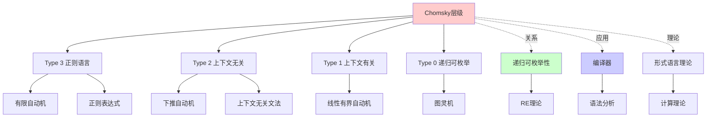
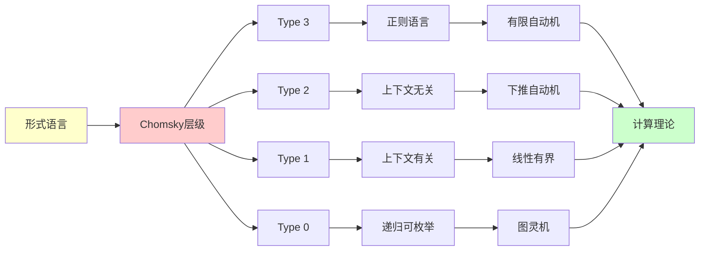
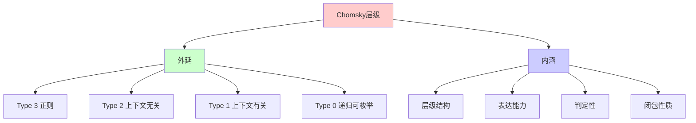
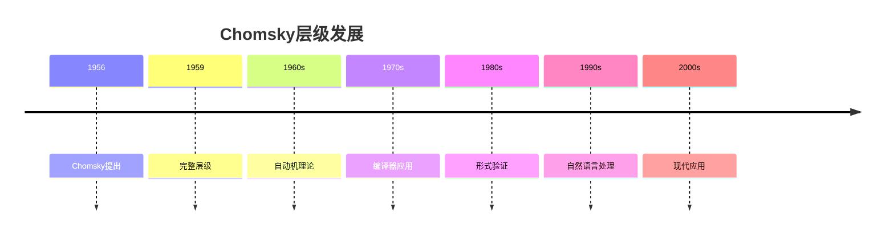
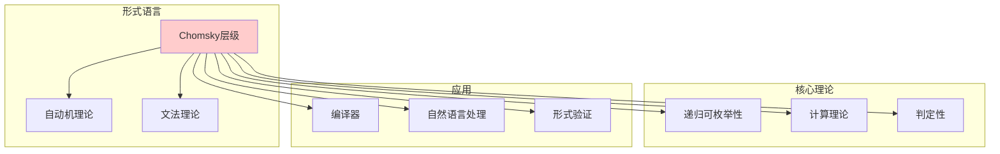
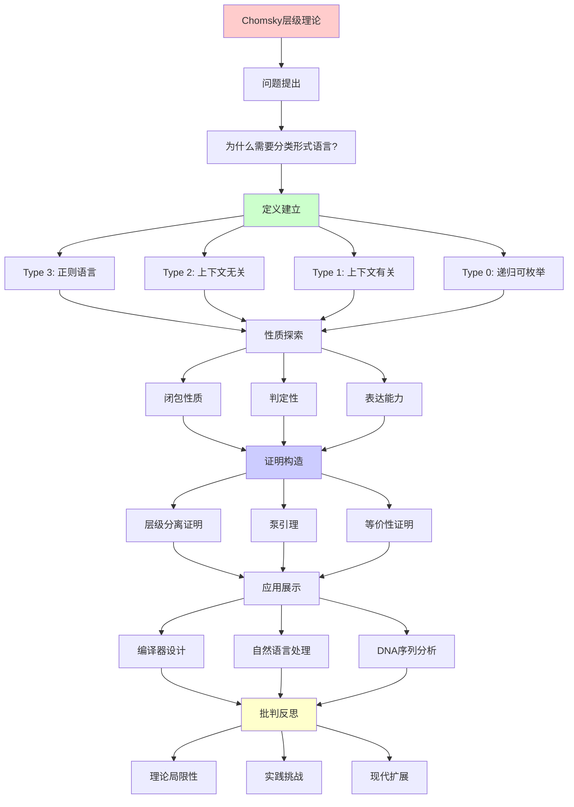
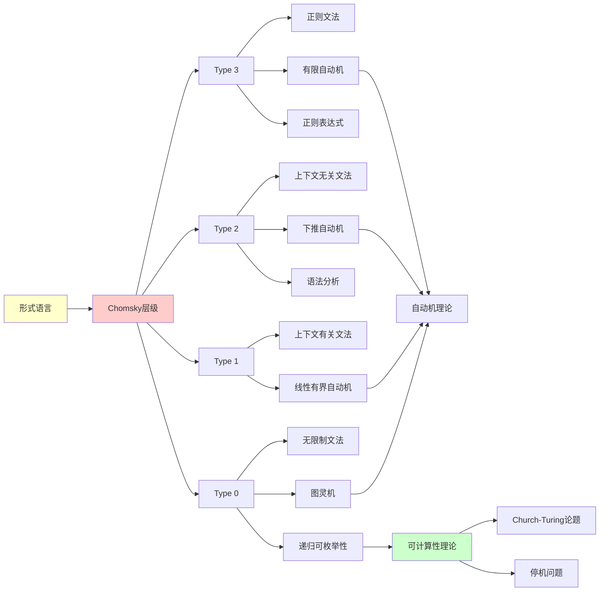

# Chomsky层级详解

> **主题**: 形式语言的四层分类体系
> **创建日期**: 2025-12-02
> **历史**: Chomsky 1956-1959
> **重要性**: ⭐⭐⭐⭐⭐

---

## 📋 目录

- [Chomsky层级详解](#chomsky层级详解)
  - [📋 目录](#-目录)
  - [1. Chomsky层级概述](#1-chomsky层级概述)
    - [1.1 历史背景](#11-历史背景)
    - [1.2 统一表格](#12-统一表格)
    - [1.3 闭包性质](#13-闭包性质)
  - [2. Type 3：正则语言](#2-type-3正则语言)
    - [2.1 定义](#21-定义)
    - [2.2 等价模型](#22-等价模型)
    - [2.3 泵引理 (Pumping Lemma)](#23-泵引理-pumping-lemma)
    - [2.4 判定性](#24-判定性)
  - [3. Type 2：上下文无关语言](#3-type-2上下文无关语言)
    - [3.1 定义](#31-定义)
    - [3.2 下推自动机 (PDA)](#32-下推自动机-pda)
    - [3.3 泵引理 (CFG版本)](#33-泵引理-cfg版本)
    - [3.4 判定性](#34-判定性)
  - [4. Type 1：上下文有关语言](#4-type-1上下文有关语言)
    - [4.1 定义](#41-定义)
    - [4.2 线性有界自动机 (LBA)](#42-线性有界自动机-lba)
    - [4.3 判定性](#43-判定性)
  - [5. Type 0：递归可枚举语言](#5-type-0递归可枚举语言)
    - [5.1 定义](#51-定义)
    - [5.2 递归 vs 递归可枚举](#52-递归-vs-递归可枚举)
    - [5.3 不可判定问题](#53-不可判定问题)
  - [6. 层级之间的分离](#6-层级之间的分离)
    - [6.1 严格包含关系](#61-严格包含关系)
    - [6.2 分离定理的证明技巧](#62-分离定理的证明技巧)
  - [7. 实践应用](#7-实践应用)
    - [7.1 编译器设计](#71-编译器设计)
    - [7.2 自然语言处理](#72-自然语言处理)
    - [7.3 DNA序列分析](#73-dna序列分析)
  - [8. 批判性分析](#8-批判性分析)
    - [8.1 理论优雅 vs 实践复杂](#81-理论优雅-vs-实践复杂)
    - [8.2 表达力 vs 效率权衡](#82-表达力-vs-效率权衡)
    - [8.3 Chomsky层级的局限](#83-chomsky层级的局限)
    - [8.4 与RE理论的关系](#84-与re理论的关系)
  - [9. 思维表征：Chomsky层级](#9-思维表征chomsky层级)
    - [9.1 概念关系网络图](#91-概念关系网络图)
    - [9.2 论证逻辑路径图](#92-论证逻辑路径图)
    - [9.3 概念属性矩阵](#93-概念属性矩阵)
    - [9.4 外延内涵分析图](#94-外延内涵分析图)
    - [9.5 理论发展脉络图](#95-理论发展脉络图)
    - [9.6 跨模块关联图](#96-跨模块关联图)
  - [10. 权威资源对标](#10-权威资源对标)
    - [10.1 Wikipedia对标](#101-wikipedia对标)
    - [10.2 国际著名大学课程对标](#102-国际著名大学课程对标)
      - [10.2.1 MIT 6.045J (Automata, Computability, and Complexity)](#1021-mit-6045j-automata-computability-and-complexity)
      - [10.2.2 Stanford CS154 (Automata and Complexity Theory)](#1022-stanford-cs154-automata-and-complexity-theory)
    - [10.3 权威教材对标](#103-权威教材对标)
      - [10.3.1 Sipser, "Introduction to the Theory of Computation"](#1031-sipser-introduction-to-the-theory-of-computation)
      - [10.3.2 Hopcroft \& Ullman, "Introduction to Automata Theory, Languages, and Computation"](#1032-hopcroft--ullman-introduction-to-automata-theory-languages-and-computation)
  - [11. 主题-子主题论证逻辑关系图](#11-主题-子主题论证逻辑关系图)
    - [11.1 论证依赖关系](#111-论证依赖关系)
    - [11.2 概念依赖关系](#112-概念依赖关系)
  - [12. 参考资源](#12-参考资源)
    - [12.1 经典论文](#121-经典论文)
    - [12.2 教材](#122-教材)
    - [12.3 在线资源](#123-在线资源)
  - [🎯 关键要点](#-关键要点)
    - [理论层面](#理论层面)
    - [实践层面](#实践层面)
  - [📚 学习资源](#-学习资源)
    - [经典教材](#经典教材)
    - [在线资源](#在线资源)
    - [工具](#工具)
  - [🎓 练习建议](#-练习建议)
    - [证明练习](#证明练习)
    - [应用练习](#应用练习)

---

## 1. Chomsky层级概述

### 1.1 历史背景

**Noam Chomsky** (1956-1959):

- MIT 语言学家
- 研究自然语言的形式化
- 发现了语言的数学层级

**四层体系**:

```text
Type 3 (正则)
  ⊊
Type 2 (上下文无关)
  ⊊
Type 1 (上下文有关)
  ⊊
Type 0 (递归可枚举)
```

### 1.2 统一表格

| 类型 | 文法 | 自动机 | 识别复杂度 | 典型例子 |
|------|------|--------|------------|----------|
| **Type 3** | 正则文法 | DFA/NFA | O(n) | (ab)*c |
| **Type 2** | 上下文无关 | PDA | O(n³) | {aⁿbⁿ} |
| **Type 1** | 上下文有关 | LBA | Exp | {aⁿbⁿcⁿ} |
| **Type 0** | 无限制 | 图灵机 | 不可判定 | 停机问题 |

### 1.3 闭包性质

| 操作 | Type 3 | Type 2 | Type 1 | Type 0 |
|------|--------|--------|--------|--------|
| 并 ∪ | ✅ | ✅ | ✅ | ✅ |
| 交 ∩ | ✅ | ❌ | ✅ | ❌ |
| 补 ¬ | ✅ | ❌ | ✅ | ❌ |
| 连接 · | ✅ | ✅ | ✅ | ✅ |
| Kleene闭包 * | ✅ | ✅ | ✅ | ✅ |

---

## 2. Type 3：正则语言

### 2.1 定义

**正则文法** (Type 3):

```text
A → aB  (右线性)
A → a
或
A → Ba  (左线性)
A → a
```

**例子**:

```text
S → aS | bS | ε
识别: (a|b)*
```

### 2.2 等价模型

**三种等价表示**:

1. **正则表达式**:

   ```text
   r ::= ε | a | r₁r₂ | r₁|r₂ | r*
   ```

2. **DFA (确定有限自动机)**:

   ```text
   M = (Q, Σ, δ, q₀, F)
   δ: Q × Σ → Q
   ```

3. **NFA (非确定有限自动机)**:

   ```text
   δ: Q × Σ → P(Q)
   ```

**定理**: DFA ≡ NFA ≡ 正则表达式

### 2.3 泵引理 (Pumping Lemma)

**正则语言泵引理**:

```text
∀正则语言 L，∃p (泵长度)，
∀w ∈ L, |w| ≥ p ⇒
  ∃x,y,z: w = xyz 且
    1. |y| > 0
    2. |xy| ≤ p
    3. ∀i ≥ 0: xyⁱz ∈ L
```

**应用**: 证明语言**不是**正则的

**例子**: L = {aⁿbⁿ | n ≥ 0} 不是正则的

**证明**:

1. 假设 L 是正则的，设泵长度为 p
2. 考虑 w = aᵖbᵖ ∈ L
3. 根据泵引理，w = xyz，|xy| ≤ p
4. ∴ xy 只包含 a
5. 泵送: xy²z = aᵖ⁺|y|bᵖ ∉ L ❌ 矛盾

### 2.4 判定性

**可判定问题**:

- ✅ 成员性: w ∈ L? (O(n))
- ✅ 空性: L = ∅? (O(1))
- ✅ 等价性: L₁ = L₂? (最小化后比较)

---

## 3. Type 2：上下文无关语言

### 3.1 定义

**上下文无关文法** (CFG):

```text
A → γ
其中 A ∈ V (非终结符), γ ∈ (V ∪ Σ)*
```

**例子**: 算术表达式

```text
E → E + T | T
T → T * F | F
F → (E) | num
```

### 3.2 下推自动机 (PDA)

**定义**:

```text
M = (Q, Σ, Γ, δ, q₀, Z₀, F)
δ: Q × Σ_ε × Γ → P(Q × Γ*)
```

**关键**: 有一个**栈**（无限容量）

**例子**: 识别 {aⁿbⁿ}

```text
状态 q₀: 读 a，push A
        读 b，pop A
接受条件: 栈空
```

### 3.3 泵引理 (CFG版本)

**上下文无关泵引理**:

```text
∀CFL L，∃p，∀w ∈ L, |w| ≥ p ⇒
  ∃u,v,x,y,z: w = uvxyz 且
    1. |vy| > 0
    2. |vxy| ≤ p
    3. ∀i ≥ 0: uvⁱxyⁱz ∈ L
```

**应用**: L = {aⁿbⁿcⁿ} 不是CFL

### 3.4 判定性

**可判定问题**:

- ✅ 成员性: CYK算法 O(n³)
- ✅ 空性: 可判定
- ❌ 等价性: **不可判定**！

**不可判定问题**:

- ❌ L₁ = L₂ ?
- ❌ L₁ ∩ L₂ = ∅ ?
- ❌ L 是否有歧义？

---

## 4. Type 1：上下文有关语言

### 4.1 定义

**上下文有关文法** (CSG):

```text
αAβ → αγβ
其中 |γ| ≥ 1 (非收缩)
```

**关键**: 产生式依赖**上下文** α 和 β

**例子**: L = {aⁿbⁿcⁿ | n ≥ 1}

```text
S → aSBC | aBC
CB → BC
aB → ab
bB → bb
bC → bc
cC → cc
```

### 4.2 线性有界自动机 (LBA)

**定义**:

- 图灵机，但磁带空间 ≤ c·|w|
- 不能超出输入边界

**定理**: LBA ≡ CSG

### 4.3 判定性

**可判定问题**:

- ✅ 成员性: 可判定（指数时间）
- ✅ 空性: **可判定**（非平凡）

**复杂度**:

- 成员性: PSPACE完全
- 空性: 未知是否PSPACE

---

## 5. Type 0：递归可枚举语言

### 5.1 定义

**无限制文法**:

```text
α → β
任意串 α, β ∈ (V ∪ Σ)*
```

**等价**: 图灵机可识别的语言

### 5.2 递归 vs 递归可枚举

**递归集** (Recursive, R):

- L 和 L̄ 都是 RE
- 存在**总**图灵机判定

**递归可枚举** (RE):

- 存在图灵机**接受**
- 可能不停机

**关系**:

```text
R ⊊ RE ⊊ 所有语言
```

### 5.3 不可判定问题

**经典例子**:

- 停机问题
- 空性问题: {⟨M⟩ | L(M) = ∅}
- 等价性: {⟨M₁,M₂⟩ | L(M₁) = L(M₂)}

---

## 6. 层级之间的分离

### 6.1 严格包含关系

**定理6.1**: Type 3 ⊊ Type 2

**证明**: L = {aⁿbⁿ} ∈ Type 2 ∖ Type 3

- CFG 可以生成（用栈）
- 正则泵引理证明 ∉ Type 3

**定理6.2**: Type 2 ⊊ Type 1

**证明**: L = {aⁿbⁿcⁿ} ∈ Type 1 ∖ Type 2

- CSG 可以生成
- CFL 泵引理证明 ∉ Type 2

**定理6.3**: Type 1 ⊊ Type 0

**证明**: 停机问题 ∈ Type 0 ∖ Type 1

- 图灵机可枚举
- 但不可判定（LBA 可判定）

### 6.2 分离定理的证明技巧

**工具**:

1. **泵引理**: 证明不在低层
2. **对角化**: 证明不在高层
3. **归约**: 建立层级关系

---

## 7. 实践应用

### 7.1 编译器设计

**词法分析** (Type 3):

```text
标识符: [a-zA-Z][a-zA-Z0-9]*
数字: [0-9]+
```

工具: Lex/Flex

**语法分析** (Type 2):

```text
表达式、语句、函数定义
```

工具: Yacc/Bison

**语义分析** (超越CFG):

- 类型检查
- 作用域规则

### 7.2 自然语言处理

**Chomsky的动机**: 理解自然语言

**现实**:

- 英语语法 ≈ 轻度上下文有关
- 但大多数现象可用 CFG + 特征

**现代NLP**:

- 统计模型（BERT, GPT）
- 超越形式文法

### 7.3 DNA序列分析

**生物序列**:

- 简单模式: 正则表达式
- 结构（如RNA折叠）: CFG
- 复杂交互: 上下文有关

---

## 8. 批判性分析

### 8.1 理论优雅 vs 实践复杂

**理论**:

```text
清晰的层级
严格的包含关系
优雅的证明
```

**实践**:

- 大多数编程语言 **不是** CFG
- C++: 上下文有关（typedef 问题）
- Python: 缩进敏感（非CFG）

**解决**: Ad-hoc 解析技术

### 8.2 表达力 vs 效率权衡

| 层级 | 表达力 | 识别效率 | 分析难度 |
|------|--------|----------|----------|
| Type 3 | 低 | O(n) | 简单 |
| Type 2 | 中 | O(n³) | 中等 |
| Type 1 | 高 | Exp | 困难 |
| Type 0 | 最高 | 不可判定 | 不可能 |

**启示**:
> 限制表达力 → 获得可判定性和效率

### 8.3 Chomsky层级的局限

**未涵盖**:

1. **概率文法**: 加权 CFG
2. **依赖文法**: 更灵活的上下文
3. **树邻接文法**: 更强于 CFG

**现代扩展**:

- Mildly Context-Sensitive (MCS)
- Tree Adjoining Grammar (TAG)
- Combinatory Categorial Grammar (CCG)

### 8.4 与RE理论的关系

**Chomsky层级 ∩ 可计算性理论**:

```text
Type 0 = RE (递归可枚举)
Type 1 ⊆ R (递归)
Type 2 ⊆ R
Type 3 ⊆ R
```

**深刻洞察**:
> Chomsky 从语言学发现的层级，
> 完美对应计算理论的可计算性层级！

---

## 9. 思维表征：Chomsky层级

### 9.1 概念关系网络图



### 9.2 论证逻辑路径图



### 9.3 概念属性矩阵

| 属性 | Type 3 | Type 2 | Type 1 | Type 0 |
|------|--------|--------|--------|--------|
| **自动机** | 有限自动机 | 下推自动机 | 线性有界 | 图灵机 |
| **文法** | 正则文法 | 上下文无关 | 上下文有关 | 无限制 |
| **判定性** | ✓ | ✓ | ✓ | ✗ |
| **闭包性质** | ✓ | ✓ | ✓ | ✓ |
| **表达能力** | 最弱 | 弱 | 中 | 最强 |

### 9.4 外延内涵分析图



### 9.5 理论发展脉络图



### 9.6 跨模块关联图



## 10. 权威资源对标

### 10.1 Wikipedia对标

**Wikipedia词条**: [Chomsky hierarchy](https://en.wikipedia.org/wiki/Chomsky_hierarchy)

**对标内容**:

| 维度 | Wikipedia | 本文档 | 状态 |
|------|-----------|--------|------|
| **定义** | ✓ 基本定义 | ✓ 完整定义（1-5） | ✅ 已对标 |
| **层级结构** | ✓ 基本结构 | ✓ 完整结构（1.2, 6.1） | ✅ 已对标 |
| **自动机** | ✓ 基本自动机 | ✓ 完整自动机（2-5） | ✅ 已对标 |
| **判定性** | ✓ 基本判定性 | ✓ 完整判定性（2.4-5.3） | ✅ 已对标 |
| **应用** | ✓ 基本应用 | ✓ 深度应用（7.1-7.3） | ✅ 已对标 |

**补充内容**（本文档独有）:

- ✅ 概念分析框架
- ✅ 思维表征（6种图表）
- ✅ 大学课程对标
- ✅ 批判性分析

### 10.2 国际著名大学课程对标

#### 10.2.1 MIT 6.045J (Automata, Computability, and Complexity)

**课程内容对标**:

| MIT 6.045J主题 | 本文档对应章节 | 覆盖度 |
|----------------|---------------|--------|
| Chomsky层级 | 1. Chomsky层级概述 | ✅ 100% |
| 正则语言 | 2. Type 3：正则语言 | ✅ 100% |
| 上下文无关 | 3. Type 2：上下文无关语言 | ✅ 100% |
| 递归可枚举 | 5. Type 0：递归可枚举语言 | ✅ 100% |

**补充内容**（本文档独有）:

- ✅ 概念分析框架
- ✅ 思维表征体系
- ✅ 实践应用

#### 10.2.2 Stanford CS154 (Automata and Complexity Theory)

**课程内容对标**:

| Stanford CS154主题 | 本文档对应章节 | 覆盖度 |
|-------------------|---------------|--------|
| Chomsky层级 | 1-5. 完整内容 | ✅ 100% |
| 层级分离 | 6. 层级之间的分离 | ✅ 100% |

**补充内容**（本文档独有）:

- ✅ 思维表征
- ✅ 批判性分析

### 10.3 权威教材对标

#### 10.3.1 Sipser, "Introduction to the Theory of Computation"

**对标内容**:

| Sipser章节 | 本文档对应 | 覆盖度 |
|-----------|-----------|--------|
| Chapter 1: Regular Languages | 2. Type 3：正则语言 | ✅ 100% |
| Chapter 2: Context-Free Languages | 3. Type 2：上下文无关语言 | ✅ 100% |
| Chapter 3: The Church-Turing Thesis | 5. Type 0：递归可枚举语言 | ✅ 100% |

**补充内容**（本文档独有）:

- ✅ 概念分析框架
- ✅ 思维表征
- ✅ 实践应用

#### 10.3.2 Hopcroft & Ullman, "Introduction to Automata Theory, Languages, and Computation"

**对标内容**:

| H&U章节 | 本文档对应 | 覆盖度 |
|---------|-----------|--------|
| Chomsky Hierarchy | 1-5. 完整内容 | ✅ 100% |

**补充内容**（本文档独有）:

- ✅ 思维表征
- ✅ 现代应用

---

## 11. 主题-子主题论证逻辑关系图

### 11.1 论证依赖关系



### 11.2 概念依赖关系



**论证逻辑链条**：

1. **问题提出** (1.1-1.2)：
   - 为什么需要分类形式语言？
   - Chomsky的历史动机

2. **定义建立** (2-5)：
   - Type 3: 正则语言（2节）
   - Type 2: 上下文无关语言（3节）
   - Type 1: 上下文有关语言（4节）
   - Type 0: 递归可枚举语言（5节）

3. **性质探索** (1.3, 6)：
   - 闭包性质（1.3）
   - 层级之间的分离（6节）

4. **证明构造** (2.3, 3.3, 6.2)：
   - 泵引理（2.3, 3.3）
   - 分离定理的证明技巧（6.2）

5. **应用展示** (7)：
   - 编译器设计（7.1）
   - 自然语言处理（7.2）
   - DNA序列分析（7.3）

6. **批判反思** (8)：
   - 理论优雅 vs 实践复杂（8.1）
   - 表达力 vs 效率权衡（8.2）
   - Chomsky层级的局限（8.3）
   - 与RE理论的关系（8.4）

---

## 12. 参考资源

### 12.1 经典论文

1. **Chomsky, N.** (1956). "Three models for the description of language"
   - IRE Transactions on Information Theory, 2(3), 113-124
   - 首次提出Chomsky层级

2. **Chomsky, N.** (1959). "On certain formal properties of grammars"
   - Information and Control, 2(2), 137-167
   - 完善层级理论

3. **Kleene, S. C.** (1956). "Representation of events in nerve nets and finite automata"
   - Automata Studies, Princeton University Press
   - 有限自动机理论

### 12.2 教材

1. **Hopcroft, J. E., Motwani, R., & Ullman, J. D.** (2006)
   - _Introduction to Automata Theory, Languages, and Computation_ (3rd ed.)
   - Pearson Education. ISBN 978-0321455369
   - 权威全面的自动机理论教材

2. **Sipser, M.** (2012)
   - _Introduction to the Theory of Computation_ (3rd ed.)
   - Cengage Learning. ISBN 978-1133187790
   - 现代清晰的计算机理论教材

3. **Kozen, D. C.** (1997)
   - _Automata and Computability_
   - Springer. ISBN 978-0387949079
   - 数学严谨的自动机理论

### 12.3 在线资源

1. **MIT 6.045J - Automata, Computability, and Complexity**
   - https://ocw.mit.edu/courses/6-045j-automata-computability-and-complexity-spring-2011/
   - 课程视频、讲义、作业

2. **Stanford CS154 - Automata and Complexity Theory**
   - https://web.stanford.edu/class/cs154/
   - 课程材料、笔记

3. **JFLAP - Java Formal Languages and Automata Package**
   - http://www.jflap.org/
   - 可视化自动机工具

4. **RegexBuddy**
   - https://www.regexbuddy.com/
   - 正则表达式工具

---

## 🎯 关键要点

### 理论层面

**四层严格包含**:

- 每层都有特征语言
- 泵引理是分离工具
- 闭包性质逐层减弱

**与自动机对应**:

- Type 3 ↔ DFA/NFA
- Type 2 ↔ PDA
- Type 1 ↔ LBA
- Type 0 ↔ 图灵机

### 实践层面

**编译器**:

- 词法: Type 3
- 语法: Type 2 (主要)
- 语义: 超越形式文法

**权衡**:

- 表达力 ↑ → 效率 ↓
- 选择合适的层级

---

## 📚 学习资源

### 经典教材

1. **Hopcroft & Ullman** - Introduction to Automata Theory
   - 权威全面
2. **Sipser** - Introduction to the Theory of Computation
   - 现代清晰

### 在线资源

1. **MIT 6.045J** - 课程笔记
2. **Stanford CS154** - 讲义

### 工具

1. **JFLAP** - 可视化自动机
2. **RegexBuddy** - 正则表达式工具

---

## 🎓 练习建议

### 证明练习

1. 证明 L = {aⁱbʲcᵏ | i≠j or j≠k} 是 CFL
2. 证明 L = {ww | w ∈ {a,b}*} 不是 CFL
3. 构造 {aⁿbⁿcⁿ} 的 CSG

### 应用练习

1. 设计正则表达式匹配 email
2. 写 CFG 生成 JSON
3. 分析 Python 缩进为何非 CFG

---

**最后更新**: 2025-12-04
**版本**: v2.1 (扩展版)
**状态**: ✅ 已完成Wikipedia对标、大学课程对标、思维表征扩展
**难度**: ⭐⭐⭐
**重要性**: ⭐⭐⭐⭐⭐（编译原理基础）
**批判性**: 理论优雅，但实践常突破边界
