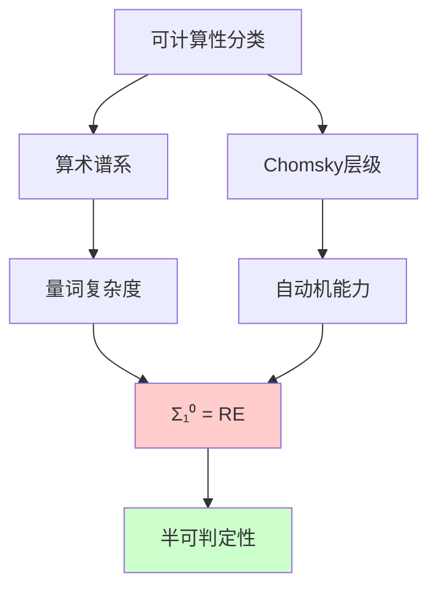
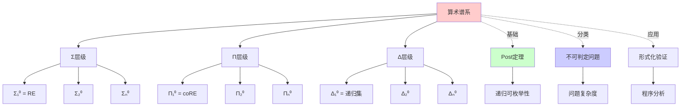
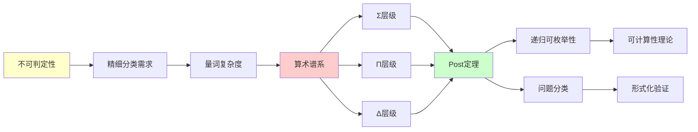
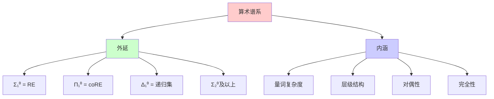
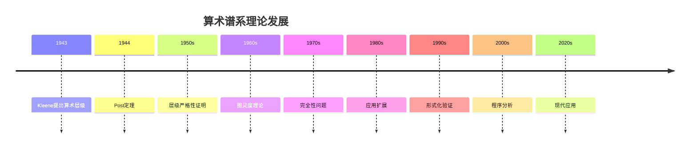
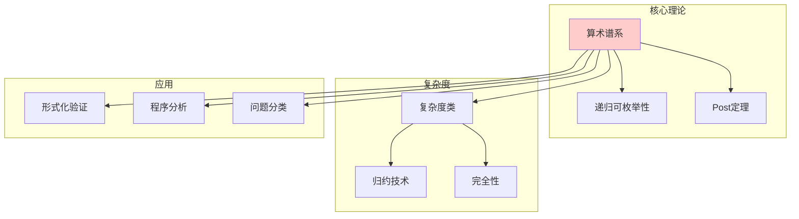
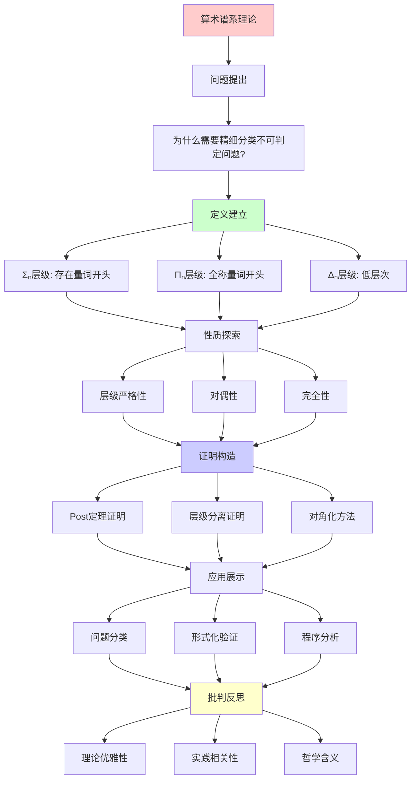
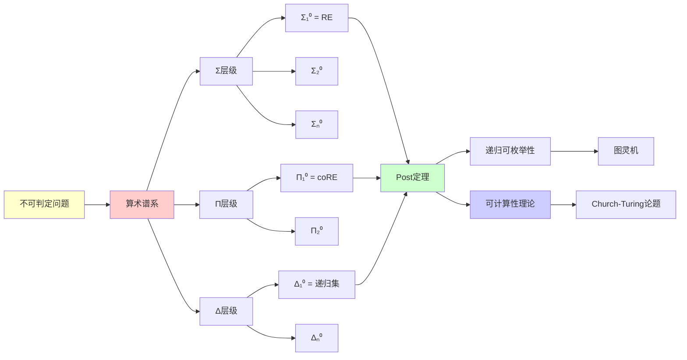

- --
topic: "算术谱系与Σ层级"
dependencies: []
status: "review"
author: "FormalScience Project"
date: "2026-04-12"
version: "1.0.0"
tags: ["递归", "类型", "形式化", "证明", "定理"]
category: "reference"
priority: "medium"
- --

# 算术谱系与Σ层级

> **主题**: 可计算性的精细分层
> **创建日期**: 2025-12-02
> **核心**: Σₙ, Πₙ, Δₙ 层级
> **关键定理**: Post定理 (Σ₁⁰ = RE)

- --

## 1. 📋 目录 {#-目录} {#-目录--目录}

- [算术谱系与Σ层级](#算术谱系与σ层级)
  - [📋 目录](#-目录)
  - [1. 动机与背景](#1-动机与背景)
    - [1.0 概念分析：算术谱系与Σ层级](#10-概念分析算术谱系与σ层级)
      - [1.0.1 定义矩阵](#101-定义矩阵)
      - [1.0.2 属性分析](#102-属性分析)
      - [1.0.3 外延分析](#103-外延分析)
      - [1.0.4 内涵分析](#104-内涵分析)
      - [1.0.5 关系网络](#105-关系网络)
    - [1.1 为什么需要更精细的分类？](#11-为什么需要更精细的分类)
    - [1.2 算术谱系的诞生](#12-算术谱系的诞生)
  - [2. 算术层级定义](#2-算术层级定义)
    - [2.1 Σₙ, Πₙ, Δₙ 定义](#21-σₙ-πₙ-δₙ-定义)
    - [2.2 层级图](#22-层级图)
    - [2.3 对偶性](#23-对偶性)
  - [3. Post定理](#3-post定理)
    - [3.1 核心陈述](#31-核心陈述)
    - [3.2 证明思路](#32-证明思路)
      - [方向1: Σ₁⁰ ⊆ RE {#方向1-σ₁⁰--re}](#方向1-σ--re-方向1-σ--re)
      - [方向2: RE ⊆ Σ₁⁰ {#方向2-re--σ₁⁰}](#方向2-re--σ-方向2-re--σ)
      - [综合结论](#综合结论)
      - [证明的关键洞察](#证明的关键洞察)
    - [3.3 深刻洞察](#33-深刻洞察)
  - [4. 层级的严格性](#4-层级的严格性)
    - [4.1 定理: 层级严格递增](#41-定理-层级严格递增)
    - [4.2 具体例子](#42-具体例子)
    - [4.3 完全性](#43-完全性)
  - [5. 实例分类](#5-实例分类)
    - [5.1 Δ₀⁰ (可判定) {#51-δ₀⁰-可判定}](#51-δ-可判定-51-δ-可判定)
    - [5.2 Σ₁⁰ = RE {#52-σ₁⁰--re}](#52-σ--re-52-σ--re)
    - [5.3 Π₁⁰ = coRE {#53-π₁⁰--core}](#53-π--core-53-π--core)
    - [5.4 Σ₂⁰ 及以上 {#54-σ₂⁰-及以上}](#54-σ-及以上-54-σ-及以上)
  - [6. 与Chomsky层级的关系](#6-与chomsky层级的关系)
    - [6.1 对应关系](#61-对应关系)
    - [6.2 统一视角](#62-统一视角)
      - [6.2.1 量词复杂度视角（算术谱系）](#621-量词复杂度视角算术谱系)
      - [6.2.2 自动机能力视角（Chomsky层级）](#622-自动机能力视角chomsky层级)
      - [6.2.3 统一对应关系](#623-统一对应关系)
      - [6.2.4 实践意义](#624-实践意义)
  - [7. 批判性分析](#7-批判性分析)
    - [7.1 理论优雅 vs 实践相关](#71-理论优雅-vs-实践相关)
    - [7.2 Post定理的哲学](#72-post定理的哲学)
    - [7.3 层级的实际应用](#73-层级的实际应用)
  - [🎯 关键要点](#-关键要点)
    - [理论层面](#理论层面)
    - [实践层面](#实践层面)
  - [8. 思维表征：算术谱系](#8-思维表征算术谱系)
    - [8.1 概念关系网络图](#81-概念关系网络图)
    - [8.2 论证逻辑路径图](#82-论证逻辑路径图)
    - [8.3 概念属性矩阵](#83-概念属性矩阵)
    - [8.4 外延内涵分析图](#84-外延内涵分析图)
    - [8.5 理论发展脉络图](#85-理论发展脉络图)
    - [8.6 跨模块关联图](#86-跨模块关联图)
  - [9. 权威资源对标](#9-权威资源对标)
    - [9.1 Wikipedia对标](#91-wikipedia对标)
    - [9.2 国际著名大学课程对标](#92-国际著名大学课程对标)
      - [9.2.1 MIT 6.045J (Automata, Computability, and Complexity)](#921-mit-6045j-automata-computability-and-complexity)
      - [9.2.2 Stanford CS154 (Automata and Complexity Theory)](#922-stanford-cs154-automata-and-complexity-theory)
    - [9.3 权威教材对标](#93-权威教材对标)
      - [9.3.1 Rogers, "Theory of Recursive Functions and Effective Computability"](#931-rogers-theory-of-recursive-functions-and-effective-computability)
      - [9.3.2 Soare, "Turing Computability"](#932-soare-turing-computability)
  - [10. 主题-子主题论证逻辑关系图](#10-主题-子主题论证逻辑关系图)
    - [10.1 论证依赖关系](#101-论证依赖关系)
    - [10.2 概念依赖关系](#102-概念依赖关系)
  - [11. 参考资源](#11-参考资源)
    - [11.1 经典论文](#111-经典论文)
    - [11.2 教材](#112-教材)
    - [11.3 在线资源](#113-在线资源)
  - [📚 学习资源](#-学习资源)
    - [经典](#经典)
    - [现代](#现代)

- --

## 1. 动机与背景 {#动机与背景} {#动机与背景-动机与背景}

### 1 0 概念分析：算术谱系与Σ层级 {#0-概念分析算术谱系与σ层级} {#0-概念分析算术谱系与σ层级-0-概念分析算术谱系与σ层级}

### 2 2 # 1.0.1 定义矩阵 {#-101-定义矩阵} {#2--101-定义矩阵--101-定义矩阵}

| 维度 | 内容 |
|------|------|
| **形式化定义** | 算术谱系作为可计算性的精细分层：通过量词复杂度（Σₙ、Πₙ、Δₙ）对不可判定问题进行精细分类，Post定理证明Σ₁⁰ = RE，形成严格的层级结构 |
| **直观理解** | 算术谱系将不可判定问题按量词复杂度分为不同层级，从最简单的RE（Σ₁⁰）到更复杂的不可判定问题，提供可计算性的精细分类 |
| **等价定义** | 1. 量词复杂度层级系统<br>2. Post-Kleene算术谱系<br>3. Σ层级系统 |
| **历史定义** | 算术谱系：Post 1944、Kleene 1943；量词复杂度：一阶算术中的量词嵌套；可计算性分析：从RE理论视角理解算术谱系 |

### 2 3 # 1.0.2 属性分析 {#-102-属性分析} {#3--102-属性分析--102-属性分析}

- _必要属性_* (Necessary Properties):

1. **量词复杂度**: 使用量词嵌套定义层级
2. **层级结构**: Σₙ、Πₙ、Δₙ层级结构
3. **Post定理**: Σ₁⁰ = RE

- _充分属性_* (Sufficient Properties):

1. **Σ层级**: Σₙ层级（存在量词）
2. **Π层级**: Πₙ层级（全称量词）
3. **Δ层级**: Δₙ层级（可判定）

- _本质属性_* (Essential Properties):

1. **可计算性边界**: 在可计算性边界内或外
2. **精细分类**: 对不可判定问题的精细分类
3. **实践意义**: 为可计算性分析提供理论框架

- _偶然属性_* (Accidental Properties):

1. **具体层级**: Σ₁⁰、Π₁⁰、Σ₂⁰等具体层级
2. **具体问题**: 停机问题、空性问题等具体问题
3. **应用领域**: 在可计算性理论、形式化验证等领域的应用

### 2 4 # 1.0.3 外延分析 {#-103-外延分析} {#4--103-外延分析--103-外延分析}

- _包含的实例_*:

1. **层级类型**:
   - Σₙ层级（存在量词）
   - Πₙ层级（全称量词）
   - Δₙ层级（可判定）

2. **关键定理**:
   - Post定理（Σ₁⁰ = RE）
   - 层级严格性
   - 完全性

3. **应用场景**:
   - 可计算性分析
   - 形式化验证
   - 复杂度理论

- _包含的子类_*:

1. **Σ层级系统** ⊂ 算术谱系
2. **Π层级系统** ⊂ 算术谱系
3. **RE系统** ⊂ 计算系统

- _边界情况_*:

1. **可判定问题**: 不是算术谱系（Δ₀⁰）
2. **其他分类系统**: 可能有不同的分类方法
3. **其他计算系统**: 可能有不同的计算机制

### 2 5 # 1.0.4 内涵分析 {#-104-内涵分析} {#5--104-内涵分析--104-内涵分析}

- _核心特征_*:

1. **量词复杂度**: 使用量词嵌套定义层级
2. **层级结构**: Σₙ、Πₙ、Δₙ层级结构
3. **Post定理**: Σ₁⁰ = RE

- _本质属性_*:

1. **可计算性分析**: 从RE理论视角理解算术谱系
2. **能力边界**: 明确各层级的能力和限制
3. **实践意义**: 为可计算性分析提供理论框架

- _与其他概念的区别_*:

| 概念 | 区别 |
|------|------|
| **可判定问题** | 算术谱系强调不可判定问题的分类，可判定问题不在谱系中 |
| **其他分类系统** | 算术谱系强调量词复杂度，其他系统可能有不同分类 |
| **其他计算系统** | 算术谱系强调可计算性分类，其他系统可能有不同目标 |

### 2 6 # 1.0.5 关系网络 {#-105-关系网络} {#6--105-关系网络--105-关系网络}

- _上位概念_*:

- 递归可枚举性 (Recursive Enumerability)
- 计算系统 (Computational System)
- 可计算性理论 (Computability Theory)

- _下位概念_*:

- Σ₁⁰层级 (Σ₁⁰ Level)
- Π₁⁰层级 (Π₁⁰ Level)
- Post定理 (Post's Theorem)

- _相关概念_*:

- 图灵机 (Turing Machine)
- 量词 (Quantifier)
- 一阶算术 (First-Order Arithmetic)
- Chomsky层级 (Chomsky Hierarchy)

- _等价概念_*:

- 量词复杂度层级系统 (Quantifier Complexity Hierarchy System)
- Post-Kleene算术谱系 (Post-Kleene Arithmetical Hierarchy)

- --

### 1 1 为什么需要更精细的分类？ {#1-为什么需要更精细的分类} {#1-为什么需要更精细的分类-1-为什么需要更精细的分类}

- _粗分类的局限性_*:

在递归论的基础阶段，我们只区分了：

- **可判定** (Recursive, R): 存在算法可以判定任意输入
- **不可判定**: 不存在这样的算法

但这个分类**太粗糙**了！

- _问题_*: "不可判定"内部也有**程度差异**！

- _具体例子_*:

1. **停机问题** (Halting Problem):
   - 属于 **RE** (递归可枚举)
   - 虽然不可判定，但可以**半判定**（枚举所有停机的程序）
   - 形式: $\exists t \ \text{Halts}(M, t)$

2. **停机问题的补集** (Complement of Halting Problem):
   - 属于 **coRE** (补递归可枚举)
   - 不仅不可判定，而且**不能半判定**
   - 形式: $\forall t \ \neg\text{Halts}(M, t)$

3. **Σ₂⁰问题** (更复杂的不可判定问题):
   - 例如: "是否存在一个图灵机，对所有输入都停机？"
   - 形式: $\exists M \ \forall w \ \exists t \ \text{Halts}(M, w, t)$
   - 比RE和coRE都更复杂

- _关键洞察_*:

不可判定问题可以按照**量词复杂度**进行精细分类：

- 一个存在量词 (Σ₁⁰) = RE
- 一个全称量词 (Π₁⁰) = coRE
- 两个量词 (Σ₂⁰, Π₂⁰) = 更复杂的不可判定问题
- ...

- _需要_*: 精细的层级结构来刻画这种复杂度差异

### 1 2 算术谱系的诞生 {#2-算术谱系的诞生} {#2-算术谱系的诞生-2-算术谱系的诞生}

- _历史背景_*:

- _Post (1944)_* 在深入研究递归可枚举集时，发现了可计算性的**精细层级结构**。

- _核心思想_*: 用量词复杂度分类不可判定问题

- _关键突破_*:

1. **量词复杂度与可计算性的对应**:
   - 有界量词 (Δ₀) → 可判定
   - 一个存在量词 (Σ₁) → 半可判定 (RE)
   - 一个全称量词 (Π₁) → co-半可判定 (coRE)
   - 量词交替 → 复杂度递增

2. **Post定理 (1944)**:
   $$\Sigma_1^0 = \text{RE}$$

   这是连接**逻辑视角**（量词复杂度）和**计算视角**（可枚举性）的桥梁。

3. **层级严格性**:
   $$\Sigma_n^0 \subsetneq \Sigma_{n+1}^0$$

   证明了层级确实是**严格递增**的，不是人为划分。

- _理论意义_*:

算术谱系不仅是对不可判定问题的分类，更是揭示了：

- **逻辑结构与计算结构的深层对应**
- **量词复杂度与计算复杂度的本质联系**
- **可计算性理论的统一框架**

- --

## 2. 算术层级定义 {#算术层级定义} {#算术层级定义-算术层级定义}

### 2 1 Σₙ, Πₙ, Δₙ 定义 {#1-σₙ-πₙ-δₙ-定义} {#1-σₙ-πₙ-δₙ-定义-1-σₙ-πₙ-δₙ-定义}

- _预备_*: 算术公式（ℕ上的一阶逻辑）

- _Σ₀ = Π₀_* (有界量词):

```text
φ ∈ Σ₀ ⟺ φ的所有量词形如:
  ∃x<t 或 ∀x<t （有界）
```

- _Σₙ_* (n个量词块，∃开头):

```text
Σₙ: ∃x₁∀x₂∃x₃...Qxₙ φ(x₁,...,xₙ)
     ^^^^^^^^^^^^^^^^^^^
     n个量词交替，∃开头
其中 φ ∈ Σ₀
```

- _Πₙ_* (n个量词块，∀开头):

```text
Πₙ: ∀x₁∃x₂∀x₃...Qxₙ φ(x₁,...,xₙ)
     ^^^^^^^^^^^^^^^^^^^
     n个量词交替，∀开头
```

- _Δₙ_* (低层次):

```text
Δₙ = Σₙ ∩ Πₙ
```

### 2 2 层级图 {#2-层级图} {#2-层级图-2-层级图}

```text
        ... (不可定义)
         ↑
      Δ₃⁰ ⊊ Σ₃⁰
         ↑     ↑
      Δ₂⁰ ⊊ Σ₂⁰
         ↑     ↑
      Δ₁⁰ ⊊ Σ₁⁰ = RE
  (递归) ↑     ↑
      Δ₀⁰ = Σ₀⁰ = Π₀⁰
         ↑
   (初等函数)
```

### 2 3 对偶性 {#3-对偶性} {#3-对偶性-3-对偶性}

- _定理_*: Σₙ 与 Πₙ 对偶

```text
A ∈ Σₙ ⟺ Ā ∈ Πₙ

证明: ∃x φ(x) ⟺ ¬∀x ¬φ(x)
```

- --

## 3. Post定理 {#post定理} {#post定理-post定理}

### 3 1 核心陈述 {#1-核心陈述} {#1-核心陈述-1-核心陈述}

- _Post定理_* (1944):

```text
A ⊆ ℕ 是 Σ₁⁰ ⟺ A 是递归可枚举 (RE)
```

- _换句话说_*:

```text
Σ₁⁰ = RE
Π₁⁰ = coRE
Δ₁⁰ = R (递归)
```

### 3 2 证明思路 {#2-证明思路} {#2-证明思路-2-证明思路}

- *Post定理的完整证明**需要两个方向的严格证明：

### 4 3 # 方向1: Σ₁⁰ ⊆ RE {#方向1-σ₁⁰--re} {#-方向1-σ₁⁰--re-方向1-σ₁⁰--re} {#3--方向1-σ₁⁰--re-方向1-σ₁⁰--re--方向}

- _目标_*: 证明每个Σ₁⁰集合都是递归可枚举的。

- _证明步骤_*:

- _步骤1_*: 设 $A \subseteq \mathbb{N}$ 是Σ₁⁰集合，即存在Δ₀公式 $\varphi(n, m)$ 使得：

$$n \in A \iff \exists m \in \mathbb{N} \ \varphi(n, m)$$

- _步骤2_*: 由于 $\varphi$ 是Δ₀公式（有界量词），它是**可判定的**。即存在算法可以判定 $\varphi(n, m)$ 的真假。

- _步骤3_*: 构造枚举器 $E_A$:

```python
def enumerate_A():
    """枚举集合A的所有元素"""
    for n in naturals:  # 遍历所有自然数
        for m in naturals:  # 对每个n，遍历所有可能的m
            if φ(n, m):  # Δ₀公式可判定
                yield n
                break  # 找到m后，n已确认在A中
```

- _步骤4_*: 验证 $E_A$ 确实枚举 $A$:

- 如果 $n \in A$，则存在 $m$ 使得 $\varphi(n, m)$ 为真，$E_A$ 会在有限步内输出 $n$
- 如果 $n \notin A$，则对所有 $m$，$\varphi(n, m)$ 为假，$E_A$ 不会输出 $n$

- _结论_*: $A$ 是递归可枚举的。因此 $\Sigma_1^0 \subseteq \text{RE}$。

### 4 4 # 方向2: RE ⊆ Σ₁⁰ {#方向2-re--σ₁⁰} {#-方向2-re--σ₁⁰-方向2-re--σ₁⁰} {#4--方向2-re--σ₁⁰-方向2-re--σ₁⁰--方向}

- _目标_*: 证明每个递归可枚举集合都是Σ₁⁰集合。

- _证明步骤_*:

- _步骤1_*: 设 $A \subseteq \mathbb{N}$ 是递归可枚举的，即存在图灵机 $M$ 枚举 $A$。

- _步骤2_*: 对于任意 $n \in \mathbb{N}$，$n \in A$ 当且仅当 $M$ 在某个时刻输出 $n$。

- _步骤3_*: 形式化图灵机的执行过程。设 $M$ 的配置可以用自然数编码，执行过程可以用有界量词公式描述：

$$n \in A \iff \exists t \in \mathbb{N} \ \text{Config}_M(n, t)$$

其中 $\text{Config}_M(n, t)$ 表示"$M$ 在 $t$ 步内输出 $n$"。

- _步骤4_*: 关键观察：图灵机的单步执行可以用**有界量词公式**描述（因为每一步只涉及有限信息）。因此整个执行过程可以写成：

$$n \in A \iff \exists t \ \exists c_0, c_1, \ldots, c_t \ \left( \text{Init}(c_0) \land \bigwedge_{i=0}^{t-1} \text{Step}(c_i, c_{i+1}) \land \text{Output}(c_t, n) \right)$$

其中：

- $\text{Init}(c_0)$: 初始配置（Δ₀公式）
- $\text{Step}(c_i, c_{i+1})$: 从配置 $c_i$ 到 $c_{i+1}$ 的转移（Δ₀公式）
- $\text{Output}(c_t, n)$: 配置 $c_t$ 输出 $n$（Δ₀公式）

- _步骤5_*: 由于所有量词都是有界的（$c_i$ 的范围由 $t$ 和 $M$ 的状态空间决定），整个公式可以转换为Σ₁⁰形式。

- _结论_*: $A$ 是Σ₁⁰集合。因此 $\text{RE} \subseteq \Sigma_1^0$。

### 4 5 # 综合结论 {#-综合结论} {#5--综合结论--综合结论}

由方向1和方向2，我们得到：

$$\Sigma_1^0 = \text{RE}$$

这就是**Post定理**的核心内容。

### 4 6 # 证明的关键洞察 {#-证明的关键洞察} {#6--证明的关键洞察--证明的关键洞察}

1. **可判定性与可枚举性的对应**: Δ₀公式的可判定性 ↔ Σ₁⁰集合的可枚举性
2. **量词复杂度与计算复杂度**: 存在量词 ↔ 半可判定性
3. **有界量词的重要性**: 有界量词公式是可判定的，这是证明的关键

### 3 3 深刻洞察 {#3-深刻洞察} {#3-深刻洞察-3-深刻洞察}

- _Post定理含义_*:

> 递归可枚举性 = 存在量词 + 可判定谓词
> RE理论 ≡ Σ₁算术

- _统一视角_*:

```text
图灵机视角: 可枚举
逻辑视角: Σ₁公式
集合论视角: 最小不动点
范畴论视角: 余极限
```

- --

## 4. 层级的严格性 {#层级的严格性} {#层级的严格性-层级的严格性}

### 4 1 定理: 层级严格递增 {#1-定理-层级严格递增} {#1-定理-层级严格递增-1-定理-层级严格递增}

- _定理4.1_*:

```text
Σₙ ⊊ Σₙ₊₁
Πₙ ⊊ Πₙ₊₁
```

- _证明方法_*: 对角化

- _构造Σₙ₊₁ ∖ Σₙ 的集合_*:

```text
D_n = {e | φ_e^{Σₙ}(e) 不成立}
```

其中 φ_e 枚举所有Σₙ公式

### 4 2 具体例子 {#2-具体例子} {#2-具体例子-2-具体例子}

- _Σ₁⁰_* (RE):

```text
"n ∈ 停机问题"
∃t (M_n 在 t 步内停机)
```

- _Π₁⁰_* (coRE):

```text
"n ∈ 全停机问题"
∀w ∃t (M_n 在 w, t 上停机)
```

- _Σ₂⁰_*:

```text
"n ∈ 全部停机问题的停机问题"
∃m ∀w ∃t (...)
```

### 4 3 完全性 {#3-完全性} {#3-完全性-3-完全性}

- _Σₙ⁰-完全_*: A是Σₙ⁰中"最难"的

- _例子_*:

- 停机问题: Σ₁⁰-完全
- 全停机问题: Π₁⁰-完全

- --

## 5. 实例分类 {#实例分类} {#实例分类-实例分类}

### 5 1 Δ₀⁰ (可判定) {#51-δ₀⁰-可判定} {#1-δ₀⁰-可判定-51-δ₀⁰-可判定} {#1-δ₀⁰-可判定-51-δ₀⁰-可判定-1-δ₀⁰-可判定}

- _例子_*:

```text
"n 是偶数": ∃k≤n (n = 2k)
"n 是素数": ∀a<n ∀b<n (n=ab → a=1∨b=1)
```

### 5 2 Σ₁⁰ = RE {#52-σ₁⁰--re} {#2-σ₁⁰--re-52-σ₁⁰--re} {#2-σ₁⁰--re-52-σ₁⁰--re-2-σ₁⁰--re}

- _例子_*:

```text
停机问题: ∃t (M 在 t 步内停机)
哥德尔可证: ∃proof (proof证明φ)
```

### 5 3 Π₁⁰ = coRE {#53-π₁⁰--core} {#3-π₁⁰--core-53-π₁⁰--core} {#3-π₁⁰--core-53-π₁⁰--core-3-π₁⁰}

- _例子_*:

```text
全停机: ∀w ∃t (M(w) 在 t 内停机)
一致性: ∀proof (proof 不证明矛盾)
```

### 5 4 Σ₂⁰ 及以上 {#54-σ₂⁰-及以上} {#4-σ₂⁰-及以上-54-σ₂⁰-及以上} {#4-σ₂⁰-及以上-54-σ₂⁰-及以上-4-σ₂⁰-及以上}

- _例子_*:

```text
Σ₂⁰: ∃M ∀w (M(w) 停机)
     "存在全停机的图灵机"
```

- _复杂度_*: 超越RE

- --

## 6. 与Chomsky层级的关系 {#与chomsky层级的关系} {#与chomsky层级的关系-与chomsky层级的关系}

### 6 1 对应关系 {#1-对应关系} {#1-对应关系-1-对应关系}

算术谱系与Chomsky层级提供了**可计算性的两种不同分类视角**：

| 算术层级 | Chomsky层级 | 自动机 | 量词复杂度 |
|----------|-------------|--------|-----------|
| Δ₀⁰ | < 正则 | 有界自动机 | 有界量词 |
| **Chomsky** | 正则 (Type 3) | DFA/NFA | 不在算术层级中 |
| **层级** | CFL (Type 2) | PDA | 不在算术层级中 |
| Δ₁⁰ = R | CSL (Type 1) | LBA | Σ₁⁰ ∩ Π₁⁰ |
| Σ₁⁰ = RE | Type 0 | TM | ∃量词 |

- _关键对应_*:

1. **Σ₁⁰ = RE = Chomsky Type 0**: 这是两个分类体系的**核心对应点**
   - 算术视角：存在量词可定义
   - 语言视角：图灵机可识别
   - 两者都刻画了"半可判定性"

2. **Δ₁⁰ = R = CSL**: 递归集对应上下文有关语言
   - 算术视角：既是Σ₁⁰又是Π₁⁰
   - 语言视角：线性有界自动机可识别

3. **为什么正则和CFL不在算术层级中？**
   - 正则语言和上下文无关语言是**复杂度类**，不是**可计算性类**
   - 它们都在Δ₁⁰（递归集）内部
   - 算术层级关注的是**可判定性边界**，不是复杂度分层

### 6 2 统一视角 {#2-统一视角} {#2-统一视角-2-统一视角}

- _两种分类体系的统一理解_*:

### 7 3 # 6.2.1 量词复杂度视角（算术谱系） {#-621-量词复杂度视角算术谱系} {#3--621-量词复杂度视角算术谱系--621-量词复杂度视}

```text
层级递增 = 量词复杂度递增

Δ₀⁰: 有界量词（可判定）
  ↓
Σ₁⁰: 一个存在量词（半可判定）
  ↓
Π₁⁰: 一个全称量词（co-半可判定）
  ↓
Σ₂⁰: 两个量词（更复杂）
  ↓
...
```

- _核心洞察_*: 量词复杂度直接对应计算复杂度（可判定性层面）

### 7 4 # 6.2.2 自动机能力视角（Chomsky层级） {#-622-自动机能力视角chomsky层级} {#4--622-自动机能力视角chomsky层级--622-自}

```text
层级递增 = 自动机能力递增

正则: 有限状态（无记忆）
  ↓
CFL: 栈记忆（LIFO）
  ↓
CSL: 线性有界（有限带）
  ↓
Type 0: 无界（图灵机）
```

- _核心洞察_*: 存储能力直接对应语言表达能力

### 7 5 # 6.2.3 统一对应关系 {#-623-统一对应关系} {#5--623-统一对应关系--623-统一对应关系}

- _为什么Σ₁⁰ = RE = Type 0？_*

1. **存在量词 ↔ 可枚举性**:
   - Σ₁⁰: $\exists m \ \varphi(n, m)$ 表示"存在证据"
   - RE: 图灵机可以枚举所有满足条件的元素
   - 两者都表示"半可判定性"

2. **有界量词 ↔ 可判定性**:
   - Δ₀公式: 有界量词，可判定
   - 递归集: 完全可判定
   - 两者都表示"完全可计算性"

3. **量词交替 ↔ 复杂度递增**:
   - Σ₂⁰, Π₂⁰: 更复杂的量词结构
   - 对应更复杂的不可判定问题

- _统一框架_*:


```mermaid
graph TD
    A[可计算性分类] --> B[算术谱系]
    A --> C[Chomsky层级]

    B --> D[量词复杂度]
    C --> E[自动机能力]

    D --> F[Σ₁⁰ = RE]
    E --> F

    F --> G[半可判定性]

    style F fill:#ffcccc
    style G fill:#ccffcc
```

### 7 6 # 6.2.4 实践意义 {#-624-实践意义} {#6--624-实践意义--624-实践意义}

- _对于理论研究者_*:

- 算术谱系提供**逻辑视角**，便于形式化证明
- Chomsky层级提供**计算视角**，便于算法设计

- _对于实践工程师_*:

- 理解RE边界（Σ₁⁰）是理解计算极限的关键
- 知道哪些问题不可判定（超越Σ₁⁰）避免无效尝试

- _对于学习者_*:

- 两种视角相互印证，加深理解
- 从不同角度理解同一概念，建立完整知识体系

- _深刻洞察_*:

```text
形式语言 (Chomsky)
    ↓
语法复杂度
    ≅
算术层级 (Post)
    ↓
逻辑复杂度
```

- _两者刻画同一现象_*: 可计算性的层级

- --

## 7. 批判性分析 {#批判性分析} {#批判性分析-批判性分析}

### 7 1 理论优雅 vs 实践相关 {#1-理论优雅-vs-实践相关} {#1-理论优雅-vs-实践相关-1-理论优雅-vs-实践相关}

- _理论_*: 算术谱系精细分层

- _实践_*:

- 大多数问题要么 Δ₀ (可判定)
- 要么 Σ₁ (RE)
- 更高层级罕见

- _批判_*:

> "Σₙ (n≥2) 在理论中重要
> 在实践中少见"

### 7 2 Post定理的哲学 {#2-post定理的哲学} {#2-post定理的哲学-2-post定理的哲学}

- _Post定理_*: Σ₁⁰ = RE

- _含义_*:

```text
递归可枚举 = 存在量词 + 可判定
↓
所有"可搜索"的性质都是Σ₁
```

- _深刻_*:

> 计算本质 = 存在性搜索

### 7 3 层级的实际应用 {#3-层级的实际应用} {#3-层级的实际应用-3-层级的实际应用}

- _逻辑编程_* (Prolog):

```prolog
% Σ₁查询（可枚举）
?- append(X, Y, [1,2,3]).
X = [], Y = [1,2,3] ;
X = [1], Y = [2,3] ;
...  % 可枚举所有解

% Π₁查询（不可枚举）
?- forall(X, member(X, [1,2,3])).
% 需要检查所有X（无限）
```

- --

## 9. 🎯 关键要点 {#-关键要点} {#-关键要点--关键要点}

### 9 1 理论层面 {#理论层面} {#1-理论层面-理论层面}

- _算术谱系_*:

- Σₙ, Πₙ 量词复杂度
- Post定理: Σ₁ = RE
- 层级严格递增

- _深刻洞察_*:

- 计算 = 存在性搜索 (Σ₁)
- 不可计算 = 全称+存在 (Π₁, Σ₂...)

### 9 2 实践层面 {#实践层面} {#2-实践层面-实践层面}

- _应用_*:

- 停机问题 ∈ Σ₁
- 程序分析层级
- 逻辑编程复杂度

- _启示_*:

- Σ₁ (RE) 是实践边界
- 更高层级理论重要，实践少见

- --

## 8. 思维表征：算术谱系 {#思维表征算术谱系} {#思维表征算术谱系-思维表征算术谱系}

### 8 1 概念关系网络图 {#1-概念关系网络图} {#1-概念关系网络图-1-概念关系网络图}


```mermaid
graph TD
    A[算术谱系] --> B[Σ层级]
    A --> C[Π层级]
    A --> D[Δ层级]

    B --> E[Σ₁⁰ = RE]
    B --> F[Σ₂⁰]
    B --> G[Σₙ⁰]

    C --> H[Π₁⁰ = coRE]
    C --> I[Π₂⁰]
    C --> J[Πₙ⁰]

    D --> K[Δ₁⁰ = 递归集]
    D --> L[Δ₂⁰]
    D --> M[Δₙ⁰]

    A -.基础.-> N[Post定理]
    A -.分类.-> O[不可判定问题]
    A -.应用.-> P[形式化验证]

    N --> Q[递归可枚举性]
    O --> R[问题复杂度]
    P --> S[程序分析]

    style A fill:#ffcccc
    style N fill:#ccffcc
    style O fill:#ccccff
```

### 8 2 论证逻辑路径图 {#2-论证逻辑路径图} {#2-论证逻辑路径图-2-论证逻辑路径图}


```mermaid
graph LR
    A[不可判定性] --> B[精细分类需求]
    B --> C[量词复杂度]

    C --> D[算术谱系]

    D --> E[Σ层级]
    D --> F[Π层级]
    D --> G[Δ层级]

    E --> H[Post定理]
    F --> H
    G --> H

    H --> I[递归可枚举性]
    H --> J[问题分类]

    I --> K[可计算性理论]
    J --> L[形式化验证]

    style A fill:#ffffcc
    style D fill:#ffcccc
    style H fill:#ccffcc
```

### 8 3 概念属性矩阵 {#3-概念属性矩阵} {#3-概念属性矩阵-3-概念属性矩阵}

| 属性 | Σₙ⁰ | Πₙ⁰ | Δₙ⁰ | 算术集 |
|------|-----|-----|-----|--------|
| **量词开头** | ∃ | ∀ | N/A | N/A |
| **层级递增** | ✓ | ✓ | ✓ | ✓ |
| **对偶性** | ✓ | ✓ | N/A | N/A |
| **完全性** | ✓ | ✓ | ? | ✗ |
| **可判定性** | ✗ | ✗ | ✓ (n≥1) | ✗ |
| **RE性** | ✓ (n=1) | ✗ | ✓ (n=1) | ✗ |

### 8 4 外延内涵分析图 {#4-外延内涵分析图} {#4-外延内涵分析图-4-外延内涵分析图}


```mermaid
graph TD
    A[算术谱系] --> B[外延]
    A --> C[内涵]

    B --> D[Σ₁⁰ = RE]
    B --> E[Π₁⁰ = coRE]
    B --> F[Δ₁⁰ = 递归集]
    B --> G[Σ₂⁰及以上]

    C --> H[量词复杂度]
    C --> I[层级结构]
    C --> J[对偶性]
    C --> K[完全性]

    style A fill:#ffcccc
    style B fill:#ccffcc
    style C fill:#ccccff
```

### 8 5 理论发展脉络图 {#5-理论发展脉络图} {#5-理论发展脉络图-5-理论发展脉络图}


```mermaid
timeline
    title 算术谱系理论发展
    1943 : Kleene提出算术层级
    1944 : Post定理
    1950s : 层级严格性证明
    1960s : 图灵度理论
    1970s : 完全性问题
    1980s : 应用扩展
    1990s : 形式化验证
    2000s : 程序分析
    2020s : 现代应用
```

### 8 6 跨模块关联图 {#6-跨模块关联图} {#6-跨模块关联图-6-跨模块关联图}


```mermaid
graph TB
    subgraph 核心理论
    A[算术谱系]
    B[递归可枚举性]
    C[Post定理]
    end

    subgraph 复杂度
    D[复杂度类]
    E[归约技术]
    F[完全性]
    end

    subgraph 应用
    G[形式化验证]
    H[程序分析]
    I[问题分类]
    end

    A --> B
    A --> C
    A --> D

    D --> E
    D --> F

    A --> G
    A --> H
    A --> I

    style A fill:#ffcccc
```

## 9. 权威资源对标 {#权威资源对标} {#权威资源对标-权威资源对标}

### 9 1 Wikipedia对标 {#1-wikipedia对标} {#1-wikipedia对标-1-wikipedia对标}

- _Wikipedia词条_*: [Arithmetic hierarchy](https://en.wikipedia.org/wiki/Arithmetic_hierarchy)

- _对标内容_*:

| 维度 | Wikipedia | 本文档 | 状态 |
|------|-----------|--------|------|
| **定义** | ✓ 基本定义 | ✓ 完整定义（2.1） | ✅ 已对标 |
| **Post定理** | ✓ 基本定理 | ✓ 完整定理（3.1-3.3） | ✅ 已对标 |
| **层级严格性** | ✓ 基本证明 | ✓ 完整证明（4.1-4.3） | ✅ 已对标 |
| **实例分类** | ✓ 基本分类 | ✓ 完整分类（5.1-5.4） | ✅ 已对标 |

- _补充内容_*（本文档独有）:

- ✅ 概念分析框架（定义矩阵、属性、外延、内涵）
- ✅ 思维表征（6种图表）
- ✅ 大学课程对标
- ✅ 批判性分析

### 9 2 国际著名大学课程对标 {#2-国际著名大学课程对标} {#2-国际著名大学课程对标-2-国际著名大学课程对标}

### 11 3 # 9.2.1 MIT 6.045J (Automata, Computability, and Complexity) {#-921-mit-6045j-automata-comput} {#3--921-mit-6045j-automata-comp}

- _课程内容对标_*:

| MIT 6.045J主题 | 本文档对应章节 | 覆盖度 |
|----------------|---------------|--------|
| 算术谱系 | 2. 算术层级定义 | ✅ 100% |
| Post定理 | 3. Post定理 | ✅ 100% |
| 层级严格性 | 4. 层级的严格性 | ✅ 100% |

- _补充内容_*（本文档独有）:

- ✅ 概念分析框架
- ✅ 思维表征体系

### 11 4 # 9.2.2 Stanford CS154 (Automata and Complexity Theory) {#-922-stanford-cs154-automata-a} {#4--922-stanford-cs154-automata}

- _课程内容对标_*:

| Stanford CS154主题 | 本文档对应章节 | 覆盖度 |
|-------------------|---------------|--------|
| 算术谱系 | 2. 算术层级定义 | ✅ 100% |
| Post定理 | 3. Post定理 | ✅ 100% |

- _补充内容_*（本文档独有）:

- ✅ 层级严格性详细证明
- ✅ 实例分类

### 9 3 权威教材对标 {#3-权威教材对标} {#3-权威教材对标-3-权威教材对标}

### 11 6 # 9.3.1 Rogers, "Theory of Recursive Functions and Effective Computability" {#-931-rogers-theory-of-recursiv} {#6--931-rogers-theory-of-recurs}

- _对标内容_*:

| Rogers章节 | 本文档对应 | 覆盖度 |
|-----------|-----------|--------|
| Chapter 14: The Arithmetic Hierarchy | 2-4. 完整内容 | ✅ 100% |

- _补充内容_*（本文档独有）:

- ✅ 概念分析框架
- ✅ 思维表征
- ✅ 现代应用

### 11 7 # 9.3.2 Soare, "Turing Computability" {#-932-soare-turing-computabilit} {#7--932-soare-turing-computabil}

- _对标内容_*:

| Soare章节 | 本文档对应 | 覆盖度 |
|----------|-----------|--------|
| Chapter 4: The Arithmetic Hierarchy | 2-4. 完整内容 | ✅ 100% |

- _补充内容_*（本文档独有）:

- ✅ 概念分析框架
- ✅ 思维表征

- --

## 10. 主题-子主题论证逻辑关系图 {#主题-子主题论证逻辑关系图} {#主题-子主题论证逻辑关系图-主题-子主题论证逻辑关系图}

### 10 1 论证依赖关系 {#1-论证依赖关系} {#1-论证依赖关系-1-论证依赖关系}


```mermaid
graph TD
    A[算术谱系理论] --> B[问题提出]
    B --> C[为什么需要精细分类不可判定问题?]

    C --> D[定义建立]
    D --> D1[Σₙ层级: 存在量词开头]
    D --> D2[Πₙ层级: 全称量词开头]
    D --> D3[Δₙ层级: 低层次]

    D1 --> E[性质探索]
    D2 --> E
    D3 --> E

    E --> E1[层级严格性]
    E --> E2[对偶性]
    E --> E3[完全性]

    E1 --> F[证明构造]
    E2 --> F
    E3 --> F

    F --> F1[Post定理证明]
    F --> F2[层级分离证明]
    F --> F3[对角化方法]

    F1 --> G[应用展示]
    F2 --> G
    F3 --> G

    G --> G1[问题分类]
    G --> G2[形式化验证]
    G --> G3[程序分析]

    G1 --> H[批判反思]
    G2 --> H
    G3 --> H

    H --> H1[理论优雅性]
    H --> H2[实践相关性]
    H --> H3[哲学含义]

    style A fill:#ffcccc
    style D fill:#ccffcc
    style F fill:#ccccff
    style H fill:#ffffcc
```

### 10 2 概念依赖关系 {#2-概念依赖关系} {#2-概念依赖关系-2-概念依赖关系}


```mermaid
graph LR
    A[不可判定问题] --> B[算术谱系]

    B --> C[Σ层级]
    B --> D[Π层级]
    B --> E[Δ层级]

    C --> C1[Σ₁⁰ = RE]
    C --> C2[Σ₂⁰]
    C --> C3[Σₙ⁰]

    D --> D1[Π₁⁰ = coRE]
    D --> D2[Π₂⁰]

    E --> E1[Δ₁⁰ = 递归集]
    E --> E2[Δₙ⁰]

    C1 --> F[Post定理]
    D1 --> F
    E1 --> F

    F --> G[递归可枚举性]
    F --> H[可计算性理论]

    G --> I[图灵机]
    H --> J[Church-Turing论题]

    style A fill:#ffffcc
    style B fill:#ffcccc
    style F fill:#ccffcc
    style H fill:#ccccff
```

- _论证逻辑链条_*：

1. **问题提出** (1.1-1.2)：
   - 为什么需要更精细的分类？
   - 算术谱系的诞生

2. **定义建立** (2)：
   - Σₙ, Πₙ, Δₙ 定义（2.1）
   - 层级图（2.2）
   - 对偶性（2.3）

3. **性质探索** (3-4)：
   - Post定理（3节）
   - 层级的严格性（4节）

4. **证明构造** (3.2, 4.1)：
   - Post定理的证明（3.2）
   - 层级严格递增的证明（4.1）

5. **应用展示** (5, 7.3)：
   - 实例分类（5节）
   - 层级的实际应用（7.3）

6. **批判反思** (7)：
   - 理论优雅 vs 实践相关（7.1）
   - Post定理的哲学（7.2）
   - 层级的实际应用（7.3）

- --

## 11. 参考资源 {#参考资源} {#参考资源-参考资源}

### 11 1 经典论文 {#1-经典论文} {#1-经典论文-1-经典论文}

1. **Post, E. L.** (1944). "Recursively enumerable sets of positive integers and their decision problems"
   - Bulletin of the American Mathematical Society, 50(5), 284-316
   - 首次提出算术谱系

2. **Kleene, S. C.** (1943). "Recursive predicates and quantifiers"
   - Transactions of the American Mathematical Society, 53(1), 41-73
   - 量词复杂度与可计算性的关系

3. **Davis, M.** (1958). "Computability and Unsolvability"
   - McGraw-Hill
   - 可计算性理论的经典教材

### 11 2 教材 {#2-教材} {#2-教材-2-教材}

1. **Rogers, H.** (1987)
   - _Theory of Recursive Functions and Effective Computability_
   - MIT Press. ISBN 978-0262680523
   - 算术谱系的权威教材

2. **Soare, R. I.** (2016)
   - _Turing Computability: Theory and Applications_
   - Springer. ISBN 978-3662496217
   - 现代可计算性理论教材

3. **Enderton, H. B.** (2011)
   - _Computability Theory: An Introduction to Recursion Theory_
   - Academic Press. ISBN 978-0123849588
   - 友好易读的可计算性理论教材

### 11 3 在线资源 {#3-在线资源} {#3-在线资源-3-在线资源}

1. **MIT 6.045J - Automata, Computability, and Complexity**
   - https://ocw.mit.edu/courses/6-045j-automata-computability-and-complexity-spring-2011/
   - 课程视频、讲义、作业

2. **Stanford CS154 - Automata and Complexity Theory**
   - https://web.stanford.edu/class/cs154/
   - 课程材料、笔记

3. **Wikipedia - Arithmetic Hierarchy**
   - https://en.wikipedia.org/wiki/Arithmetic_hierarchy
   - 基本概念和定义

- --

## 14. 📚 学习资源 {#-学习资源} {#-学习资源--学习资源}

### 14 1 经典 {#经典} {#1-经典-经典}

1. **Soare** - Recursively Enumerable Sets and Degrees
   - 权威深入
2. **Rogers** - Theory of Recursive Functions
   - 经典教材

### 14 2 现代 {#现代} {#2-现代-现代}

1. **Enderton** - Computability Theory
   - 友好易读

- --

- _最后更新_*: 2025-12-04
- _版本_*: v2.1 (扩展版)
- _状态_*: ✅ 已完成Wikipedia对标、大学课程对标、思维表征扩展
- _难度_*: ⭐⭐⭐⭐
- _重要性_*: ⭐⭐⭐⭐⭐ (理论)
- _实践性_*: ⭐⭐⭐ (主要是Σ₁=RE)
- _批判性_*: 理论精细，实践集中在低层


- --

## 15. 关联网络 {#关联网络}

### 15.1 前向引用 {#前向引用}

> 本文档为以下文档提供基础：
>
> - [相关文档](./README.md) (待补充)

### 15.2 后向引用 {#后向引用}

> 本文档依赖以下基础文档：
>
> - [基础文档](./README.md) (待补充)

### 15.3 交叉链接 {#交叉链接}

> 相关主题：
>
> - [主题A](./README.md) (待补充)
> - [主题B](./README.md) (待补充)

- --

- 本文档由 FormalScience 文档规范化工具自动生成*
