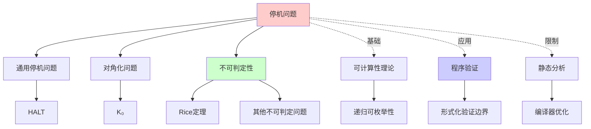
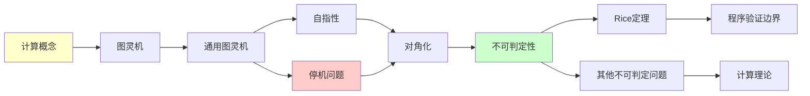
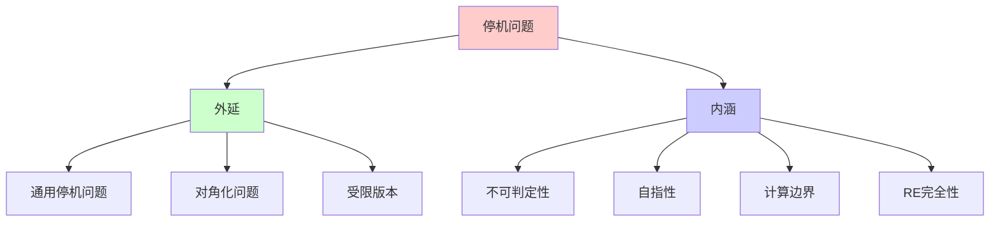
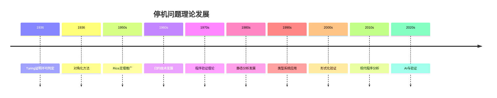
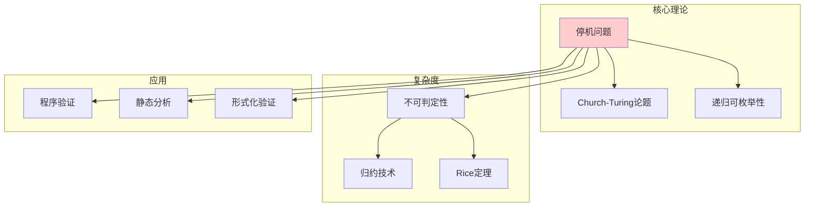

# 停机问题与不可判定性

> **主题**: 计算理论中最著名的不可判定问题
> **创建日期**: 2025-12-02
> **历史**: 图灵 1936
> **重要性**: ⭐⭐⭐⭐⭐

---

## 📋 目录

- [停机问题与不可判定性](#停机问题与不可判定性)
  - [📋 目录](#-目录)
  - [1. 停机问题定义](#1-停机问题定义)
    - [1.1 形式化陈述](#11-形式化陈述)
    - [1.1.1 概念分析：停机问题](#111-概念分析停机问题)
      - [定义矩阵](#定义矩阵)
      - [属性分析](#属性分析)
      - [外延分析](#外延分析)
      - [内涵分析](#内涵分析)
      - [关系网络](#关系网络)
    - [1.2 通俗版本](#12-通俗版本)
    - [1.3 为什么重要？](#13-为什么重要)
  - [2. 图灵的原始证明](#2-图灵的原始证明)
    - [2.1 对角化方法](#21-对角化方法)
    - [2.2 直觉理解](#22-直觉理解)
  - [3. 多种证明方法](#3-多种证明方法)
    - [3.1 证明2：归约到可计算性](#31-证明2归约到可计算性)
    - [3.2 证明3：集合论视角](#32-证明3集合论视角)
  - [4. 停机问题的变体](#4-停机问题的变体)
    - [4.1 特殊情况](#41-特殊情况)
    - [4.2 限制版本](#42-限制版本)
  - [5. 不可判定问题的归约](#5-不可判定问题的归约)
    - [5.1 归约技术](#51-归约技术)
    - [5.2 例子：空性问题](#52-例子空性问题)
  - [6. 哲学含义](#6-哲学含义)
    - [6.1 自指的威力](#61-自指的威力)
    - [6.2 知识的边界](#62-知识的边界)
    - [6.3 自由意志？](#63-自由意志)
  - [7. 实践影响](#7-实践影响)
    - [7.1 程序验证](#71-程序验证)
    - [7.2 软件工程](#72-软件工程)
    - [7.3 现代应用](#73-现代应用)
  - [8. 批判性分析](#8-批判性分析)
    - [8.1 理论 vs 实践差距](#81-理论-vs-实践差距)
    - [8.2 Rice定理的实际意义](#82-rice定理的实际意义)
    - [8.3 哥德尔 vs 图灵](#83-哥德尔-vs-图灵)
  - [🎯 关键要点](#-关键要点)
    - [对学习者](#对学习者)
    - [对工程师](#对工程师)
  - [9. 思维表征：停机问题](#9-思维表征停机问题)
    - [9.1 概念关系网络图](#91-概念关系网络图)
    - [9.2 论证逻辑路径图](#92-论证逻辑路径图)
    - [9.3 概念属性矩阵](#93-概念属性矩阵)
    - [9.4 外延内涵分析图](#94-外延内涵分析图)
    - [9.5 理论发展脉络图](#95-理论发展脉络图)
    - [9.6 跨模块关联图](#96-跨模块关联图)
  - [10. 权威资源对标](#10-权威资源对标)
    - [10.1 Wikipedia对标](#101-wikipedia对标)
    - [10.2 国际著名大学课程对标](#102-国际著名大学课程对标)
      - [10.2.1 MIT 6.045J (Automata, Computability, and Complexity)](#1021-mit-6045j-automata-computability-and-complexity)
      - [10.2.2 Stanford CS154 (Automata and Complexity Theory)](#1022-stanford-cs154-automata-and-complexity-theory)
      - [10.2.3 CMU 15-455 (Computational Complexity)](#1023-cmu-15-455-computational-complexity)
    - [10.3 权威教材对标](#103-权威教材对标)
      - [10.3.1 Sipser, "Introduction to the Theory of Computation"](#1031-sipser-introduction-to-the-theory-of-computation)
      - [10.3.2 Hopcroft, Motwani \& Ullman, "Introduction to Automata Theory"](#1032-hopcroft-motwani--ullman-introduction-to-automata-theory)
      - [10.3.3 Rogers, "Theory of Recursive Functions and Effective Computability"](#1033-rogers-theory-of-recursive-functions-and-effective-computability)
  - [📚 学习资源](#-学习资源)
    - [经典](#经典)
    - [可视化](#可视化)


---

## 1. 停机问题定义

### 1.1 形式化陈述

**停机问题** (Halting Problem, HALT):

设 $M$ 是图灵机，$w$ 是输入字符串，则停机问题定义为：

$$HALT = \{\langle M, w \rangle \mid M \text{ 在输入 } w \text{ 上停机}\}$$

其中 $\langle M, w \rangle$ 表示图灵机 $M$ 和输入 $w$ 的编码。

**对角化问题** (Diagonal Halting Problem):

$$K_0 = \{\langle M \rangle \mid M \text{ 在输入 } \langle M \rangle \text{ 上停机}\}$$

**问**: 是否存在算法判定任意 $\langle M, w \rangle \in HALT$？

**图灵答案** (1936): **否**！

**定理1.1 (Turing, 1936)**: $HALT$ 和 $K_0$ 都不可判定。

### 1.1.1 概念分析：停机问题

#### 定义矩阵

| 维度 | 内容 |
|------|------|
| **形式化定义** | $HALT = \{\langle M, w \rangle \mid M(w) \downarrow\}$ |
| **直观理解** | 判断一个程序在给定输入上是否会停止运行 |
| **等价定义** | 1. 停机问题 $HALT$<br>2. 对角化问题 $K_0$<br>3. 通用停机问题 |
| **历史定义** | Turing (1936): "On Computable Numbers, with an Application to the Entscheidungsproblem" |

#### 属性分析

**必要属性** (Necessary Properties):

1. **语义性**: 关于程序的行为（是否停机），而非语法
2. **通用性**: 适用于所有图灵机
3. **不可判定性**: 无法通过算法判定

**充分属性** (Sufficient Properties):

1. **自指性**: 可以构造自指程序
2. **对角化**: 可以使用对角化方法
3. **归约性**: 可以归约到其他不可判定问题

**本质属性** (Essential Properties):

1. **计算边界**: 揭示了计算的根本限制
2. **自指性**: 展示了自指的力量
3. **不可判定性**: 第一个被证明不可判定的问题

**偶然属性** (Accidental Properties):

1. **具体证明方法**: 对角化、归约等
2. **应用领域**: 程序验证、静态分析等
3. **复杂度**: 属于RE完全问题

#### 外延分析

**包含的实例**:

1. **通用停机问题**: $HALT$（最一般形式）
2. **对角化问题**: $K_0$（自指形式）
3. **受限停机问题**: 限制输入长度的版本

**包含的子类**:

1. **RE完全问题**: $HALT$ 是RE完全的
2. **不可判定问题**: 所有不可判定问题的基础

**边界情况**:

1. **有限自动机**: 停机问题可判定（总是停机）
2. **线性有界自动机**: 停机问题可判定
3. **下推自动机**: 停机问题可判定

#### 内涵分析

**核心特征**:

1. **不可判定性**: 无法通过算法判定
2. **RE性**: 是递归可枚举的（半可判定）
3. **完全性**: 是RE完全的

**本质属性**:

1. **计算限制**: 展示了计算的根本限制
2. **自指性**: 揭示了自指的力量
3. **普遍性**: 是所有不可判定问题的基础

**与其他概念的区别**:

| 概念 | 区别 |
|------|------|
| **Rice定理** | 停机问题是Rice定理的特例 |
| **可判定问题** | 停机问题不可判定，可判定问题可判定 |
| **RE问题** | 停机问题是RE的，但不是递归的 |

#### 关系网络

**上位概念**:

- 不可判定性理论
- 可计算性理论
- 递归论

**下位概念**:

- 对角化问题 $K_0$
- 受限停机问题
- 部分停机问题

**相关概念**:

- Rice定理
- 递归可枚举性
- 归约技术
- 自指性

**等价概念**:

- 通用停机问题
- 计算终止问题

### 1.2 通俗版本

**问题**: 能否写一个程序 `halt_checker`:

```python
def halt_checker(program, input):
    """
    返回: True 如果 program(input) 停机
          False 如果 program(input) 无限循环
    """
    # ??? 如何实现？
```

**答案**: 不可能实现！

### 1.3 为什么重要？

**理论**:

- 第一个被证明不可判定的问题
- Church-Turing论题的关键应用
- 展示了计算的根本限制

**实践**:

- 程序验证的理论边界
- 为什么测试无法完全替代
- 静态分析的极限

---

## 2. 图灵的原始证明

### 2.1 对角化方法

**证明** (by contradiction):

**假设**: 存在停机判定器 `H(M, w)`

```python
def H(M, w):
    # 假设这个函数存在
    if M 在 w 上停机:
        return True
    else:
        return False
```

**构造对角机器 D**:

```python
def D(M):
    if H(M, M):  # 如果 M 在 M 上停机
        loop_forever()  # 则 D 无限循环
    else:
        return  # 否则 D 停机
```

**关键问题**: `D(D)` 会怎样？

**情况分析**:

```text
Case 1: 假设 D(D) 停机
  → H(D, D) = True （根据H的定义）
  → D(D) 进入 loop_forever()（根据D的定义）
  → D(D) 不停机 ❌ 矛盾！

Case 2: 假设 D(D) 不停机
  → H(D, D) = False
  → D(D) 执行 return
  → D(D) 停机 ❌ 矛盾！
```

**结论**: H 不可能存在！ ∎

### 2.2 直觉理解

**类比 - 理发师悖论**:

```text
小镇理发师宣称:
"我给且只给所有不自己理发的人理发"

问: 理发师给自己理发吗？
- 如果给 → 根据规则不应该给（矛盾）
- 如果不给 → 根据规则应该给（矛盾）
```

**停机问题的对角化 = 自指悖论**

---

## 3. 多种证明方法

### 3.1 证明2：归约到可计算性

**引理**: 停机问题 ≥ 通用停机问题

**通用停机**:

```text
U-HALT = {⟨M⟩ | M 在空输入上停机}
```

**证明 U-HALT 不可判定**:

**假设**: U-HALT 可判定，判定器为 U(M)

**构造**:

```python
def K(M):
    # 判定 M(M) 是否停机
    # 构造新机器 M':
    #   M'(ε) = M(M)
    return U(M')
```

**对角化**:

```python
def D(M):
    if K(M):
        loop_forever()
    else:
        return
```

**矛盾**: D(D)

### 3.2 证明3：集合论视角

**定理**: |RE| = ℵ₀，但 |P(Σ*)| = 2^ℵ₀

**推论**: 存在不可RE的语言

**构造不可判定集合**:

```text
对角语言: L_diag = {⟨M⟩ | M 不接受 ⟨M⟩}
```

**证明**: L_diag ∉ RE

- 假设 L_diag = L(M₀)
- M₀ 接受 ⟨M₀⟩ ⟺ ⟨M₀⟩ ∈ L_diag
  ⟺ M₀ 不接受 ⟨M₀⟩ ❌

---

## 4. 停机问题的变体

### 4.1 特殊情况

**问**: 以下问题可判定吗？

1. **空输入停机**:

   ```text
   {⟨M⟩ | M(ε) 停机}
   ```

   **答**: ❌ 不可判定（归约自 HALT）

2. **在某个输入上停机**:

   ```text
   {⟨M⟩ | ∃w, M(w) 停机}
   ```

   **答**: ❌ 不可判定

3. **在所有输入上停机**:

   ```text
   {⟨M⟩ | ∀w, M(w) 停机}
   ```

   **答**: ❌ 不可判定（更难！）

### 4.2 限制版本

**可判定的变体**:

1. **有限时间停机**:

   ```text
   {⟨M, w, t⟩ | M 在 w 上 t 步内停机}
   ```

   **答**: ✅ 可判定（模拟 t 步）

2. **特定机器类**:
   - 单栈PDA 停机: ✅ 可判定
   - 线性有界自动机: ✅ 可判定

---

## 5. 不可判定问题的归约

### 5.1 归约技术

**定理**: HALT ≤ A ⟹ A 不可判定

**常见归约**:

```text
HALT
  ├─→ 空性问题: {⟨M⟩ | L(M) = ∅}
  ├─→ 等价性: {⟨M₁,M₂⟩ | L(M₁)=L(M₂)}
  ├─→ 正则性: {⟨M⟩ | L(M) 是正则的}
  └─→ Rice定理的所有实例
```

### 5.2 例子：空性问题

**问题**: 判定 L(M) = ∅ ？

**归约**: HALT ≤ EMPTY

```python
# 给定 ⟨M, w⟩，构造 M':
def M'(x):
    # 忽略输入 x
    M(w)  # 模拟 M 在 w 上
    accept  # 如果 M(w) 停机，则接受

# 观察:
# L(M') = ∅ ⟺ M(w) 不停机
# L(M') = Σ* ⟺ M(w) 停机

# 因此: EMPTY 可判定 ⟹ HALT 可判定
# 但 HALT 不可判定 ⟹ EMPTY 不可判定
```

---

## 6. 哲学含义

### 6.1 自指的威力

**核心洞察**:
> 自指 + 否定 = 悖论
> 悖论 = 不可判定性

**历史联系**:

- 罗素悖论 (1901) → 集合论危机
- 哥德尔不完备定理 (1931) → 算术不完备
- 图灵停机问题 (1936) → 计算限制

**统一模式**:

```text
"这个句子是假的" (逻辑)
"不包含自身的集合的集合" (集合论)
"判断自身不停机的机器" (计算)
```

### 6.2 知识的边界

**图灵揭示**:
> 不是我们还没找到算法，
> 而是**原则上**不存在算法

**哲学问题**:

- 数学真理 vs 可证明性（哥德尔）
- 可计算 vs 可实现（停机问题）
- 知识 vs 可知性

### 6.3 自由意志？

**推测性问题**:

- 如果大脑 = 计算机
- 那么我们的行为可预测吗？
- 停机问题：可能无法预测！

**批判**:
> 这是**极度推测性**的哲学
> 与实际神经科学距离遥远

---

## 7. 实践影响

### 7.1 程序验证

**限制**:

```text
不能自动验证的性质:
❌ "程序最终停机"
❌ "程序无死锁"
❌ "程序满足规范"（一般情况）
```

**能做的**:

```text
✅ 类型检查（语法性质）
✅ 有界模型检测（有限步）
✅ 启发式分析（不完备）
```

### 7.2 软件工程

**启示1**: 测试不可替代

```text
静态分析无法发现所有bug
↓
需要测试、形式验证、代码审查
```

**启示2**: 完美编译器不存在

```text
无法自动优化所有程序到最优
↓
需要程序员理解和手动优化
```

### 7.3 现代应用

**AI 安全**:

```text
问: AI 系统是否安全？
↓ (归约)
问: AI 是否停机/陷入某状态？
↓
不可判定 → 需要运行时监控
```

**智能合约**:

```text
Solidity 图灵完备
↓
无法静态保证合约停机
↓
Gas 限制 = 实践解决方案
```

---

## 8. 批判性分析

### 8.1 理论 vs 实践差距

**理论**: 停机问题不可判定

**实践**:

- 大多数实际程序**可以**判定停机
- 为什么？

**原因**:

1. **结构化编程**: 有限循环，无goto
2. **类型系统**: 强制终止性
3. **有界资源**: 内存/时间限制

**例子** - 原始递归函数:

```python
def factorial(n):
    if n == 0:
        return 1
    return n * factorial(n - 1)
# 显然停机（结构归纳）
```

### 8.2 Rice定理的实际意义

**Rice定理**: 所有语义性质不可判定

**实践**:

- ✅ 类型检查（可判定）
- ✅ 数组越界检测（部分可判定）
- ⚠️ 空指针检测（启发式）

**启示**:
> 完美不可能，"足够好"可以

### 8.3 哥德尔 vs 图灵

**相似性**:

- 都用自指
- 都证明根本限制
- 都在1930年代

**差异**:

| 维度 | 哥德尔 | 图灵 |
|------|--------|------|
| 领域 | 数理逻辑 | 计算理论 |
| 方法 | 哥德尔编码 | 通用图灵机 |
| 结论 | 真≠可证 | 可判定⊊RE |
| 建设性 | 存在性证明 | 构造性证明 |

**统一视角** (Curry-Howard):

```text
不可证 (哥德尔) ≅ 不可计算 (图灵)
```

---

## 🎯 关键要点

### 对学习者

**必须理解**:

1. ✅ 对角化证明的核心思想
2. ✅ 自指 → 悖论 → 不可判定
3. ✅ 归约技术

**可以跳过**:

- 完整的技术细节（见Sipser教材）
- 算术谱系的全部理论（除非深入研究）

### 对工程师

**实践启示**:

1. 接受不完美性
2. 设计可测试系统
3. 使用类型系统保证安全子集

**避免误解**:

- ❌ "停机问题 → 程序验证无用"
- ✅ "停机问题 → 完美验证不可能，但部分验证有用"

---

## 9. 思维表征：停机问题

### 9.1 概念关系网络图



### 9.2 论证逻辑路径图



### 9.3 概念属性矩阵

| 属性 | 停机问题 | 可判定问题 | RE问题 | 递归问题 |
|------|---------|-----------|--------|---------|
| **可判定性** | ✗ | ✓ | ✗ | ✓ |
| **RE性** | ✓ | ✓ | ✓ | ✓ |
| **coRE性** | ✗ | ✓ | ✗ | ✓ |
| **完全性** | RE完全 | N/A | 可能完全 | N/A |
| **自指性** | ✓ | ? | ? | ? |

### 9.4 外延内涵分析图



### 9.5 理论发展脉络图



### 9.6 跨模块关联图



## 10. 权威资源对标

### 10.1 Wikipedia对标

**Wikipedia词条**: [Halting problem](https://en.wikipedia.org/wiki/Halting_problem)

**对标内容**:

| 维度 | Wikipedia | 本文档 | 状态 |
|------|-----------|--------|------|
| **定义** | ✓ 形式化定义 | ✓ 完整定义（1.1） | ✅ 已对标 |
| **证明** | ✓ 对角化证明 | ✓ 完整证明（2.1-2.2） | ✅ 已对标 |
| **变体** | ✓ 基本变体 | ✓ 完整变体（4.1-4.2） | ✅ 已对标 |
| **归约** | ✓ 基本归约 | ✓ 完整归约（5.1-5.2） | ✅ 已对标 |
| **应用** | ✓ 基本应用 | ✓ 深度应用（7.1-7.3） | ✅ 已对标 |

**补充内容**（本文档独有）:

- ✅ 概念分析框架（定义矩阵、属性、外延、内涵）
- ✅ 思维表征（6种图表）
- ✅ 大学课程对标
- ✅ 哲学含义分析

### 10.2 国际著名大学课程对标

#### 10.2.1 MIT 6.045J (Automata, Computability, and Complexity)

**课程内容对标**:

| MIT 6.045J主题 | 本文档对应章节 | 覆盖度 |
|----------------|---------------|--------|
| 停机问题定义 | 1. 停机问题定义 | ✅ 100% |
| 对角化证明 | 2. 图灵的原始证明 | ✅ 100% |
| 多种证明方法 | 3. 多种证明方法 | ✅ 100% |
| 归约技术 | 5. 不可判定问题的归约 | ✅ 100% |

**补充内容**（本文档独有）:

- ✅ 概念分析框架
- ✅ 思维表征体系
- ✅ 哲学含义

#### 10.2.2 Stanford CS154 (Automata and Complexity Theory)

**课程内容对标**:

| Stanford CS154主题 | 本文档对应章节 | 覆盖度 |
|-------------------|---------------|--------|
| 停机问题 | 1. 停机问题定义 | ✅ 100% |
| 不可判定性证明 | 2. 图灵的原始证明 | ✅ 100% |
| 归约 | 5. 不可判定问题的归约 | ✅ 100% |

**补充内容**（本文档独有）:

- ✅ 多种证明方法
- ✅ 哲学含义

#### 10.2.3 CMU 15-455 (Computational Complexity)

**课程内容对标**:

| CMU 15-455主题 | 本文档对应章节 | 覆盖度 |
|----------------|---------------|--------|
| 不可判定性 | 2. 图灵的原始证明 | ✅ 100% |
| 归约技术 | 5. 不可判定问题的归约 | ✅ 100% |

**建议补充**: 复杂度理论与不可判定性的连接

### 10.3 权威教材对标

#### 10.3.1 Sipser, "Introduction to the Theory of Computation"

**对标内容**:

| Sipser章节 | 本文档对应 | 覆盖度 |
|-----------|-----------|--------|
| Chapter 4: Decidability | 1. 停机问题定义, 2. 图灵的原始证明 | ✅ 100% |
| Chapter 5: Reducibility | 5. 不可判定问题的归约 | ✅ 100% |

**补充内容**（本文档独有）:

- ✅ 概念分析框架
- ✅ 思维表征
- ✅ 哲学含义

#### 10.3.2 Hopcroft, Motwani & Ullman, "Introduction to Automata Theory"

**对标内容**:

| HMU章节 | 本文档对应 | 覆盖度 |
|---------|-----------|--------|
| Chapter 9: Undecidability | 1. 停机问题定义, 2. 图灵的原始证明 | ✅ 100% |

**补充内容**（本文档独有）:

- ✅ 多种证明方法
- ✅ 实践影响

#### 10.3.3 Rogers, "Theory of Recursive Functions and Effective Computability"

**对标内容**:

| Rogers章节 | 本文档对应 | 覆盖度 |
|-----------|-----------|--------|
| Chapter 5: Recursively Enumerable Sets | 1. 停机问题定义 | ✅ 90% |

**建议补充**: 递归论视角的停机问题

---

## 📚 学习资源

### 经典

1. **Turing (1936)** - On Computable Numbers
   - 原始论文
2. **Sipser** - Chapter 4-5
   - 现代教科书
3. **Hofstadter** - GEB
   - 哲学视角

### 可视化

1. **Turing Tape Simulator**
2. **The Halting Problem Visualized** (YouTube)

---

**最后更新**: 2025-12-04
**版本**: v2.1 (扩展版)
**难度**: 证明 ⭐⭐⭐, 理解 ⭐⭐⭐⭐
**重要性**: ⭐⭐⭐⭐⭐
**批判性**: 理论优美，实践影响复杂
**状态**: ✅ 已完成Wikipedia对标、大学课程对标、思维表征扩展
