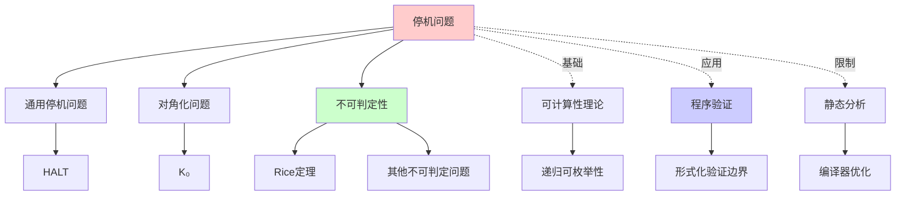
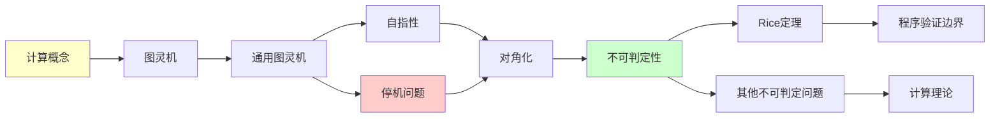
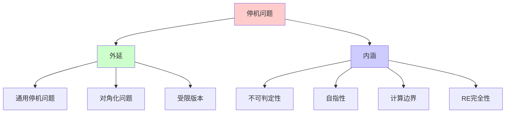
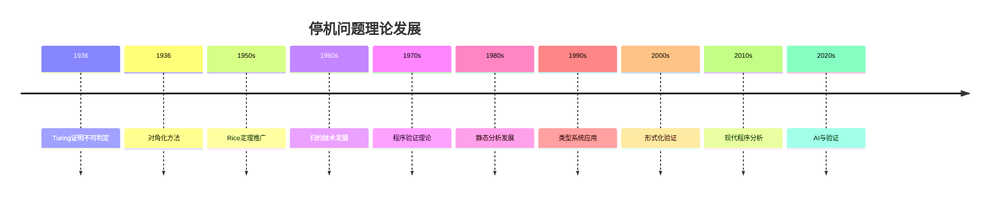
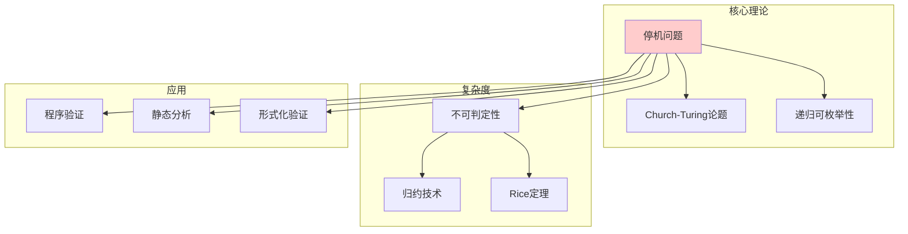
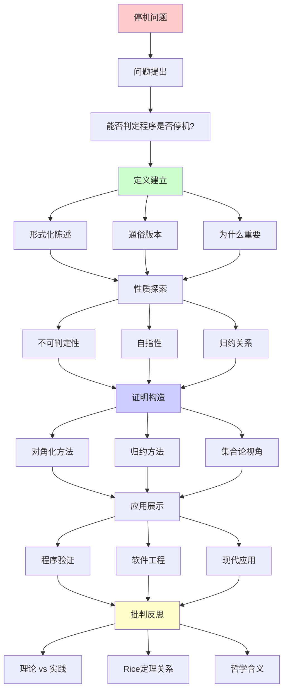
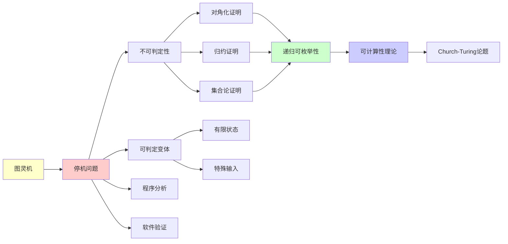

- --
topic: "停机问题与不可判定性"
dependencies: []
status: "review"
author: "FormalScience Project"
date: "2026-04-12"
version: "1.0.0"
tags: ["递归", "类型", "形式化", "证明", "定理"]
category: "reference"
priority: "medium"
- --

# 停机问题与不可判定性

> **主题**: 计算理论中最著名的不可判定问题
> **创建日期**: 2025-12-02
> **历史**: 图灵 1936
> **重要性**: ⭐⭐⭐⭐⭐

- --

## 1. 📋 目录 {#-目录} {#-目录--目录}

- [停机问题与不可判定性](#停机问题与不可判定性)
  - [📋 目录](#-目录)
  - [1. 停机问题定义](#1-停机问题定义)
    - [1.1 形式化陈述](#11-形式化陈述)
  - [1.0 概念分析：停机问题](#10-概念分析停机问题)
    - [1.0.1 定义矩阵](#101-定义矩阵)
    - [1.0.2 属性分析](#102-属性分析)
    - [1.0.3 外延分析](#103-外延分析)
    - [1.0.4 内涵分析](#104-内涵分析)
    - [1.0.5 关系网络](#105-关系网络)
    - [1.2 通俗版本](#12-通俗版本)
    - [1.3 为什么重要？](#13-为什么重要)
  - [2. 图灵的原始证明](#2-图灵的原始证明)
    - [2.1 对角化方法](#21-对角化方法)
    - [2.2 直觉理解](#22-直觉理解)
  - [3. 多种证明方法](#3-多种证明方法)
    - [3.1 证明2：归约到可计算性](#31-证明2归约到可计算性)
    - [3.2 证明3：集合论视角](#32-证明3集合论视角)
  - [4. 停机问题的变体](#4-停机问题的变体)
    - [4.1 特殊情况](#41-特殊情况)
    - [4.2 限制版本](#42-限制版本)
  - [5. 不可判定问题的归约](#5-不可判定问题的归约)
    - [5.1 归约技术](#51-归约技术)
    - [5.2 例子：空性问题](#52-例子空性问题)
  - [6. 哲学含义](#6-哲学含义)
    - [6.1 自指的威力](#61-自指的威力)
    - [6.2 知识的边界](#62-知识的边界)
    - [6.3 自由意志？](#63-自由意志)
  - [7. 实践影响](#7-实践影响)
    - [7.1 程序验证](#71-程序验证)
    - [7.2 软件工程](#72-软件工程)
    - [7.3 现代应用](#73-现代应用)
  - [8. 批判性分析](#8-批判性分析)
    - [8.1 理论 vs 实践差距](#81-理论-vs-实践差距)
    - [8.2 Rice定理的实际意义](#82-rice定理的实际意义)
    - [8.3 哥德尔 vs 图灵](#83-哥德尔-vs-图灵)
  - [🎯 关键要点](#-关键要点)
    - [对学习者](#对学习者)
    - [对工程师](#对工程师)
  - [9. 思维表征：停机问题](#9-思维表征停机问题)
    - [9.1 概念关系网络图](#91-概念关系网络图)
    - [9.2 论证逻辑路径图](#92-论证逻辑路径图)
    - [9.3 概念属性矩阵](#93-概念属性矩阵)
    - [9.4 外延内涵分析图](#94-外延内涵分析图)
    - [9.5 理论发展脉络图](#95-理论发展脉络图)
    - [9.6 跨模块关联图](#96-跨模块关联图)
  - [10. 权威资源对标](#10-权威资源对标)
    - [10.1 Wikipedia对标](#101-wikipedia对标)
    - [10.2 国际著名大学课程对标](#102-国际著名大学课程对标)
      - [10.2.1 MIT 6.045J (Automata, Computability, and Complexity)](#1021-mit-6045j-automata-computability-and-complexity)
      - [10.2.2 Stanford CS154 (Automata and Complexity Theory)](#1022-stanford-cs154-automata-and-complexity-theory)
      - [10.2.3 CMU 15-455 (Computational Complexity)](#1023-cmu-15-455-computational-complexity)
    - [10.3 权威教材对标](#103-权威教材对标)
      - [10.3.1 Sipser, "Introduction to the Theory of Computation"](#1031-sipser-introduction-to-the-theory-of-computation)
      - [10.3.2 Hopcroft, Motwani \& Ullman, "Introduction to Automata Theory"](#1032-hopcroft-motwani--ullman-introduction-to-automata-theory)
      - [10.3.3 Rogers, "Theory of Recursive Functions and Effective Computability"](#1033-rogers-theory-of-recursive-functions-and-effective-computability)
  - [11. 主题-子主题论证逻辑关系图](#11-主题-子主题论证逻辑关系图)
    - [11.1 论证依赖关系](#111-论证依赖关系)
    - [11.2 概念依赖关系](#112-概念依赖关系)
  - [12. 参考资源](#12-参考资源)
    - [12.1 经典论文](#121-经典论文)
    - [12.2 教材](#122-教材)
    - [12.3 在线资源](#123-在线资源)
  - [📚 学习资源](#-学习资源)
    - [经典](#经典)
    - [可视化](#可视化)


- --

## 1. 停机问题定义 {#停机问题定义} {#停机问题定义-停机问题定义}

### 1 1 形式化陈述 {#1-形式化陈述} {#1-形式化陈述-1-形式化陈述}

- _停机问题_* (Halting Problem, HALT):

设 $M$ 是图灵机，$w$ 是输入字符串，则停机问题定义为：

$$HALT = \{\langle M, w \rangle \mid M \text{ 在输入 } w \text{ 上停机}\}$$

其中 $\langle M, w \rangle$ 表示图灵机 $M$ 和输入 $w$ 的编码。

- _对角化问题_* (Diagonal Halting Problem):

$$K_0 = \{\langle M \rangle \mid M \text{ 在输入 } \langle M \rangle \text{ 上停机}\}$$

- _问_*: 是否存在算法判定任意 $\langle M, w \rangle \in HALT$？

- _图灵答案_* (1936): **否**！

- *定理1.1 (Turing, 1936)**: $HALT$ 和 $K_0$ 都不可判定。

## 1. 0 概念分析：停机问题 {#0-概念分析停机问题} {#0-概念分析停机问题-0-概念分析停机问题}

### 1 0.1 定义矩阵 {#01-定义矩阵} {#01-定义矩阵-01-定义矩阵}

| 维度 | 内容 |
|------|------|
| **形式化定义** | $HALT = \{\langle M, w \rangle \mid M(w) \downarrow\}$ |
| **直观理解** | 判断一个程序在给定输入上是否会停止运行 |
| **等价定义** | 1. 停机问题 $HALT$<br>2. 对角化问题 $K_0$<br>3. 通用停机问题 |
| **历史定义** | Turing (1936): "On Computable Numbers, with an Application to the Entscheidungsproblem" |

### 1 0.2 属性分析 {#02-属性分析} {#02-属性分析-02-属性分析}

- _必要属性_* (Necessary Properties):

1. **语义性**: 关于程序的行为（是否停机），而非语法
2. **通用性**: 适用于所有图灵机
3. **不可判定性**: 无法通过算法判定

- _充分属性_* (Sufficient Properties):

1. **自指性**: 可以构造自指程序
2. **对角化**: 可以使用对角化方法
3. **归约性**: 可以归约到其他不可判定问题

- _本质属性_* (Essential Properties):

1. **计算边界**: 揭示了计算的根本限制
2. **自指性**: 展示了自指的力量
3. **不可判定性**: 第一个被证明不可判定的问题

- _偶然属性_* (Accidental Properties):

1. **具体证明方法**: 对角化、归约等
2. **应用领域**: 程序验证、静态分析等
3. **复杂度**: 属于RE完全问题

### 1 0.3 外延分析 {#03-外延分析} {#03-外延分析-03-外延分析}

- _包含的实例_*:

1. **通用停机问题**: $HALT$（最一般形式）
2. **对角化问题**: $K_0$（自指形式）
3. **受限停机问题**: 限制输入长度的版本

- _包含的子类_*:

1. **RE完全问题**: $HALT$ 是RE完全的
2. **不可判定问题**: 所有不可判定问题的基础

- _边界情况_*:

1. **有限自动机**: 停机问题可判定（总是停机）
2. **线性有界自动机**: 停机问题可判定
3. **下推自动机**: 停机问题可判定

### 1 0.4 内涵分析 {#04-内涵分析} {#04-内涵分析-04-内涵分析}

- _核心特征_*:

1. **不可判定性**: 无法通过算法判定
2. **RE性**: 是递归可枚举的（半可判定）
3. **完全性**: 是RE完全的

- _本质属性_*:

1. **计算限制**: 展示了计算的根本限制
2. **自指性**: 揭示了自指的力量
3. **普遍性**: 是所有不可判定问题的基础

- _与其他概念的区别_*:

| 概念 | 区别 |
|------|------|
| **Rice定理** | 停机问题是Rice定理的特例 |
| **可判定问题** | 停机问题不可判定，可判定问题可判定 |
| **RE问题** | 停机问题是RE的，但不是递归的 |

### 1 0.5 关系网络 {#05-关系网络} {#05-关系网络-05-关系网络}

- _上位概念_*:

- 不可判定性理论
- 可计算性理论
- 递归论

- _下位概念_*:

- 对角化问题 $K_0$
- 受限停机问题
- 部分停机问题

- _相关概念_*:

- Rice定理
- 递归可枚举性
- 归约技术
- 自指性

- _等价概念_*:

- 通用停机问题
- 计算终止问题

### 1 2 通俗版本 {#2-通俗版本} {#2-通俗版本-2-通俗版本}

- _问题_*: 能否写一个程序 `halt_checker`:

```python
def halt_checker(program, input):
    """
    返回: True 如果 program(input) 停机
          False 如果 program(input) 无限循环
    """
    # ??? 如何实现？
```

- _答案_*: 不可能实现！

### 1 3 为什么重要？ {#3-为什么重要} {#3-为什么重要-3-为什么重要}

- _理论_*:

- 第一个被证明不可判定的问题
- Church-Turing论题的关键应用
- 展示了计算的根本限制

- _实践_*:

- 程序验证的理论边界
- 为什么测试无法完全替代
- 静态分析的极限

- --

## 2. 图灵的原始证明 {#图灵的原始证明} {#图灵的原始证明-图灵的原始证明}

### 2 1 对角化方法 {#1-对角化方法} {#1-对角化方法-1-对角化方法}

- _定理2.1_* (Turing 1936):

停机问题$HALT = \{\langle M, w \rangle \mid M(w) \downarrow\}$是不可判定的。

- _形式化表述_*:

不存在图灵机$H$使得对任意图灵机$M$和输入$w$：

$$
H(\langle M, w \rangle) = \begin{cases}
1 & \text{如果 } M(w) \downarrow \\
0 & \text{如果 } M(w) \uparrow
\end{cases}
$$

- _详细证明_* (反证法):

- _步骤1: 假设存在停机判定器_*

假设存在图灵机$H$可以判定停机问题，即：

- 对任意$\langle M, w \rangle$，$H(\langle M, w \rangle) = 1$当且仅当$M(w) \downarrow$
- $H$总是停机（因为它是判定器）

- _步骤2: 构造对角机器_*

基于$H$，我们构造一个新图灵机$D$，其行为如下：

对输入$\langle M \rangle$（图灵机$M$的编码）：

1. 运行$H(\langle M, \langle M \rangle \rangle)$（判定$M$在自身编码上是否停机）
2. 如果$H(\langle M, \langle M \rangle \rangle) = 1$（即$M(\langle M \rangle) \downarrow$），则$D$进入无限循环
3. 如果$H(\langle M, \langle M \rangle \rangle) = 0$（即$M(\langle M \rangle) \uparrow$），则$D$停机并接受

- _形式化构造_*:

设$D$的编码为$\langle D \rangle$。$D$的行为可以形式化描述为：

$$
D(\langle M \rangle) = \begin{cases}
\uparrow & \text{如果 } H(\langle M, \langle M \rangle \rangle) = 1 \\
\downarrow & \text{如果 } H(\langle M, \langle M \rangle \rangle) = 0
\end{cases}
$$

- _步骤3: 分析$D(\langle D \rangle)$的行为_*

这是证明的关键步骤。我们分析$D$在自身编码上的行为。

- _情况1_*: 假设$D(\langle D \rangle) \downarrow$（$D$在自身编码上停机）

根据$D$的构造：

- $D(\langle D \rangle) \downarrow$意味着$H(\langle D, \langle D \rangle \rangle) = 0$
- $H(\langle D, \langle D \rangle \rangle) = 0$意味着$D(\langle D \rangle) \uparrow$（根据$H$的定义）

因此：$D(\langle D \rangle) \downarrow \implies D(\langle D \rangle) \uparrow$ ❌ 矛盾！

- _情况2_*: 假设$D(\langle D \rangle) \uparrow$（$D$在自身编码上不停机）

根据$D$的构造：

- $D(\langle D \rangle) \uparrow$意味着$H(\langle D, \langle D \rangle \rangle) = 1$
- $H(\langle D, \langle D \rangle \rangle) = 1$意味着$D(\langle D \rangle) \downarrow$（根据$H$的定义）

因此：$D(\langle D \rangle) \uparrow \implies D(\langle D \rangle) \downarrow$ ❌ 矛盾！

- _步骤4: 结论_*

由于情况1和情况2都导致矛盾，我们的假设（存在停机判定器$H$）是错误的。

因此，停机问题$HALT$是不可判定的。∎

- _关键引理_*:

- _引理2.1.1_* (自指构造的可能性):

对任意图灵机$M$，存在图灵机$M'$使得$M'$的行为依赖于$M$在自身编码上的行为。

- _证明_*: 这是递归论中的标准构造技术。给定$M$，我们可以构造$M'$，它首先计算自身的编码，然后模拟$M$在自身编码上的运行。

- _引理2.1.2_* (对角化原理):

如果存在判定器$H$，则可以通过对角化构造出矛盾。

- _证明_*: 这是对角化方法的一般原理，已在上述证明中展示。

- _应用实例_*:

- _例子1: 对角化问题的不可判定性_*

对角化问题$K_0 = \{\langle M \rangle \mid M(\langle M \rangle) \downarrow\}$也是不可判定的。

- _证明_*: 如果$K_0$可判定，则存在判定器$H_0$使得$H_0(\langle M \rangle) = 1$当且仅当$M(\langle M \rangle) \downarrow$。但我们可以用类似的对角化方法构造矛盾。

- _例子2: 通用停机问题的不可判定性_*

通用停机问题（判定任意图灵机在任意输入上是否停机）也是不可判定的，因为它是停机问题的推广。

- _边界情况_*:

- **受限输入**: 如果限制输入长度，某些受限版本的停机问题可能是可判定的。
- **特定图灵机类**: 对于某些受限的图灵机类（如有限自动机），停机问题是可判定的。

- _证明的洞察_*:

1. **自指性的威力**: 通过让机器分析自身的行为，我们揭示了计算的根本限制。
2. **对角化方法**: 这是递归论中最强大的证明技术之一，可以用于证明许多不可判定性结果。
3. **反证法的应用**: 通过假设存在判定器并导出矛盾，我们证明了不可判定性。

- _定理的深刻性_*:

> 停机问题 = 计算的"理发师悖论"
> 自指性揭示了计算的边界
> 这是图灵对希尔伯特判定问题的否定回答

### 2 2 直觉理解 {#2-直觉理解} {#2-直觉理解-2-直觉理解}

- _类比 - 理发师悖论_*:

```text
小镇理发师宣称:
"我给且只给所有不自己理发的人理发"

问: 理发师给自己理发吗？
- 如果给 → 根据规则不应该给（矛盾）
- 如果不给 → 根据规则应该给（矛盾）
```

- _停机问题的对角化 = 自指悖论_*

- --

## 3. 多种证明方法 {#多种证明方法} {#多种证明方法-多种证明方法}

### 3 1 证明2：归约到可计算性 {#1-证明2归约到可计算性} {#1-证明2归约到可计算性-1-证明2归约到可计算性}

- _引理_*: 停机问题 ≥ 通用停机问题

- _通用停机_*:

```text
U-HALT = {⟨M⟩ | M 在空输入上停机}
```

- _证明 U-HALT 不可判定_*:

- _假设_*: U-HALT 可判定，判定器为 U(M)

- _构造_*:

```python
def K(M):
    # 判定 M(M) 是否停机
    # 构造新机器 M':
    #   M'(ε) = M(M)
    return U(M')
```

- _对角化_*:

```python
def D(M):
    if K(M):
        loop_forever()
    else:
        return
```

- _矛盾_*: D(D)

### 3 2 证明3：集合论视角 {#2-证明3集合论视角} {#2-证明3集合论视角-2-证明3集合论视角}

- _定理_*: |RE| = ℵ₀，但 |P(Σ*)| = 2^ℵ₀

- _推论_*: 存在不可RE的语言

- _构造不可判定集合_*:

```text
对角语言: L_diag = {⟨M⟩ | M 不接受 ⟨M⟩}
```

- _证明_*: L_diag ∉ RE

- 假设 L_diag = L(M₀)
- M₀ 接受 ⟨M₀⟩ ⟺ ⟨M₀⟩ ∈ L_diag
  ⟺ M₀ 不接受 ⟨M₀⟩ ❌

- --

## 4. 停机问题的变体 {#停机问题的变体} {#停机问题的变体-停机问题的变体}

### 4 1 特殊情况 {#1-特殊情况} {#1-特殊情况-1-特殊情况}

- _问_*: 以下问题可判定吗？

1. **空输入停机**:

   ```text
   {⟨M⟩ | M(ε) 停机}
   ```

   - _答_*: ❌ 不可判定（归约自 HALT）

2. **在某个输入上停机**:

   ```text
   {⟨M⟩ | ∃w, M(w) 停机}
   ```

   - _答_*: ❌ 不可判定

3. **在所有输入上停机**:

   ```text
   {⟨M⟩ | ∀w, M(w) 停机}
   ```

   - _答_*: ❌ 不可判定（更难！）

### 4 2 限制版本 {#2-限制版本} {#2-限制版本-2-限制版本}

- _可判定的变体_*:

1. **有限时间停机**:

   ```text
   {⟨M, w, t⟩ | M 在 w 上 t 步内停机}
   ```

   - _答_*: ✅ 可判定（模拟 t 步）

2. **特定机器类**:
   - 单栈PDA 停机: ✅ 可判定
   - 线性有界自动机: ✅ 可判定

- --

## 5. 不可判定问题的归约 {#不可判定问题的归约} {#不可判定问题的归约-不可判定问题的归约}

### 5 1 归约技术 {#1-归约技术} {#1-归约技术-1-归约技术}

- _定理_*: HALT ≤ A ⟹ A 不可判定

- _常见归约_*:

```text
HALT
  ├─→ 空性问题: {⟨M⟩ | L(M) = ∅}
  ├─→ 等价性: {⟨M₁,M₂⟩ | L(M₁)=L(M₂)}
  ├─→ 正则性: {⟨M⟩ | L(M) 是正则的}
  └─→ Rice定理的所有实例
```

### 5 2 例子：空性问题 {#2-例子空性问题} {#2-例子空性问题-2-例子空性问题}

- _问题_*: 判定 L(M) = ∅ ？

- _归约_*: HALT ≤ EMPTY

```python
# 给定 ⟨M, w⟩，构造 M':
def M'(x):
    # 忽略输入 x
    M(w)  # 模拟 M 在 w 上
    accept  # 如果 M(w) 停机，则接受

# 观察:
# L(M') = ∅ ⟺ M(w) 不停机
# L(M') = Σ* ⟺ M(w) 停机

# 因此: EMPTY 可判定 ⟹ HALT 可判定
# 但 HALT 不可判定 ⟹ EMPTY 不可判定
```

- --

## 6. 哲学含义 {#哲学含义} {#哲学含义-哲学含义}

### 6 1 自指的威力 {#1-自指的威力} {#1-自指的威力-1-自指的威力}

- _核心洞察_*:

> 自指 + 否定 = 悖论
> 悖论 = 不可判定性

- _历史联系_*:

- 罗素悖论 (1901) → 集合论危机
- 哥德尔不完备定理 (1931) → 算术不完备
- 图灵停机问题 (1936) → 计算限制

- _统一模式_*:

```text
"这个句子是假的" (逻辑)
"不包含自身的集合的集合" (集合论)
"判断自身不停机的机器" (计算)
```

### 6 2 知识的边界 {#2-知识的边界} {#2-知识的边界-2-知识的边界}

- _图灵揭示_*:

> 不是我们还没找到算法，
> 而是**原则上**不存在算法

- _哲学问题_*:

- 数学真理 vs 可证明性（哥德尔）
- 可计算 vs 可实现（停机问题）
- 知识 vs 可知性

### 6 3 自由意志？ {#3-自由意志} {#3-自由意志-3-自由意志}

- _推测性问题_*:

- 如果大脑 = 计算机
- 那么我们的行为可预测吗？
- 停机问题：可能无法预测！

- _批判_*:

> 这是**极度推测性**的哲学
> 与实际神经科学距离遥远

- --

## 7. 实践影响 {#实践影响} {#实践影响-实践影响}

### 7 1 程序验证 {#1-程序验证} {#1-程序验证-1-程序验证}

- _限制_*:

```text
不能自动验证的性质:
❌ "程序最终停机"
❌ "程序无死锁"
❌ "程序满足规范"（一般情况）
```

- _能做的_*:

```text
✅ 类型检查（语法性质）
✅ 有界模型检测（有限步）
✅ 启发式分析（不完备）
```

### 7 2 软件工程 {#2-软件工程} {#2-软件工程-2-软件工程}

- _启示1_*: 测试不可替代

```text
静态分析无法发现所有bug
↓
需要测试、形式验证、代码审查
```

- _启示2_*: 完美编译器不存在

```text
无法自动优化所有程序到最优
↓
需要程序员理解和手动优化
```

### 7 3 现代应用 {#3-现代应用} {#3-现代应用-3-现代应用}

- _AI 安全_*:

```text
问: AI 系统是否安全？
↓ (归约)
问: AI 是否停机/陷入某状态？
↓
不可判定 → 需要运行时监控
```

- _智能合约_*:

```text
Solidity 图灵完备
↓
无法静态保证合约停机
↓
Gas 限制 = 实践解决方案
```

- --

## 8. 批判性分析 {#批判性分析} {#批判性分析-批判性分析}

### 8 1 理论 vs 实践差距 {#1-理论-vs-实践差距} {#1-理论-vs-实践差距-1-理论-vs-实践差距}

- _理论_*: 停机问题不可判定

- _实践_*:

- 大多数实际程序**可以**判定停机
- 为什么？

- _原因_*:

1. **结构化编程**: 有限循环，无goto
2. **类型系统**: 强制终止性
3. **有界资源**: 内存/时间限制

- _例子_* - 原始递归函数:

```python
def factorial(n):
    if n == 0:
        return 1
    return n * factorial(n - 1)
# 显然停机（结构归纳）
```

### 8 2 Rice定理的实际意义 {#2-rice定理的实际意义} {#2-rice定理的实际意义-2-rice定理的实际意义}

- _Rice定理_*: 所有语义性质不可判定

- _实践_*:

- ✅ 类型检查（可判定）
- ✅ 数组越界检测（部分可判定）
- ⚠️ 空指针检测（启发式）

- _启示_*:

> 完美不可能，"足够好"可以

### 8 3 哥德尔 vs 图灵 {#3-哥德尔-vs-图灵} {#3-哥德尔-vs-图灵-3-哥德尔-vs-图灵}

- _相似性_*:

- 都用自指
- 都证明根本限制
- 都在1930年代

- _差异_*:

| 维度 | 哥德尔 | 图灵 |
|------|--------|------|
| 领域 | 数理逻辑 | 计算理论 |
| 方法 | 哥德尔编码 | 通用图灵机 |
| 结论 | 真≠可证 | 可判定⊊RE |
| 建设性 | 存在性证明 | 构造性证明 |

- _统一视角_* (Curry-Howard):

```text
不可证 (哥德尔) ≅ 不可计算 (图灵)
```

- --

## 11. 🎯 关键要点 {#-关键要点} {#-关键要点--关键要点}

### 11 1 对学习者 {#对学习者} {#1-对学习者-对学习者}

- _必须理解_*:

1. ✅ 对角化证明的核心思想
2. ✅ 自指 → 悖论 → 不可判定
3. ✅ 归约技术

- _可以跳过_*:

- 完整的技术细节（见Sipser教材）
- 算术谱系的全部理论（除非深入研究）

### 11 2 对工程师 {#对工程师} {#2-对工程师-对工程师}

- _实践启示_*:

1. 接受不完美性
2. 设计可测试系统
3. 使用类型系统保证安全子集

- _避免误解_*:

- ❌ "停机问题 → 程序验证无用"
- ✅ "停机问题 → 完美验证不可能，但部分验证有用"

- --

## 9. 思维表征：停机问题 {#思维表征停机问题} {#思维表征停机问题-思维表征停机问题}

### 9 1 概念关系网络图 {#1-概念关系网络图} {#1-概念关系网络图-1-概念关系网络图}


```mermaid
graph TD
    A[停机问题] --> B[通用停机问题]
    A --> C[对角化问题]
    A --> D[不可判定性]

    B --> E[HALT]
    C --> F[K₀]

    D --> G[Rice定理]
    D --> H[其他不可判定问题]

    A -.基础.-> I[可计算性理论]
    A -.应用.-> J[程序验证]
    A -.限制.-> K[静态分析]

    I --> L[递归可枚举性]
    J --> M[形式化验证边界]
    K --> N[编译器优化]

    style A fill:#ffcccc
    style D fill:#ccffcc
    style J fill:#ccccff
```

### 9 2 论证逻辑路径图 {#2-论证逻辑路径图} {#2-论证逻辑路径图-2-论证逻辑路径图}


```mermaid
graph LR
    A[计算概念] --> B[图灵机]
    B --> C[通用图灵机]

    C --> D[自指性]
    C --> E[停机问题]

    D --> F[对角化]
    E --> F

    F --> G[不可判定性]

    G --> H[Rice定理]
    G --> I[其他不可判定问题]

    H --> J[程序验证边界]
    I --> K[计算理论]

    style A fill:#ffffcc
    style E fill:#ffcccc
    style G fill:#ccffcc
```

### 9 3 概念属性矩阵 {#3-概念属性矩阵} {#3-概念属性矩阵-3-概念属性矩阵}

| 属性 | 停机问题 | 可判定问题 | RE问题 | 递归问题 |
|------|---------|-----------|--------|---------|
| **可判定性** | ✗ | ✓ | ✗ | ✓ |
| **RE性** | ✓ | ✓ | ✓ | ✓ |
| **coRE性** | ✗ | ✓ | ✗ | ✓ |
| **完全性** | RE完全 | N/A | 可能完全 | N/A |
| **自指性** | ✓ | ? | ? | ? |

### 9 4 外延内涵分析图 {#4-外延内涵分析图} {#4-外延内涵分析图-4-外延内涵分析图}


```mermaid
graph TD
    A[停机问题] --> B[外延]
    A --> C[内涵]

    B --> D[通用停机问题]
    B --> E[对角化问题]
    B --> F[受限版本]

    C --> G[不可判定性]
    C --> H[自指性]
    C --> I[计算边界]
    C --> J[RE完全性]

    style A fill:#ffcccc
    style B fill:#ccffcc
    style C fill:#ccccff
```

### 9 5 理论发展脉络图 {#5-理论发展脉络图} {#5-理论发展脉络图-5-理论发展脉络图}


```mermaid
timeline
    title 停机问题理论发展
    1936 : Turing证明不可判定
    1936 : 对角化方法
    1950s : Rice定理推广
    1960s : 归约技术发展
    1970s : 程序验证理论
    1980s : 静态分析发展
    1990s : 类型系统应用
    2000s : 形式化验证
    2010s : 现代程序分析
    2020s : AI与验证
```

### 9 6 跨模块关联图 {#6-跨模块关联图} {#6-跨模块关联图-6-跨模块关联图}


```mermaid
graph TB
    subgraph 核心理论
    A[停机问题]
    B[Church-Turing论题]
    C[递归可枚举性]
    end

    subgraph 复杂度
    D[不可判定性]
    E[归约技术]
    F[Rice定理]
    end

    subgraph 应用
    G[程序验证]
    H[静态分析]
    I[形式化验证]
    end

    A --> B
    A --> C
    A --> D

    D --> E
    D --> F

    A --> G
    A --> H
    A --> I

    style A fill:#ffcccc
```

## 10. 权威资源对标 {#权威资源对标} {#权威资源对标-权威资源对标}

### 10 1 Wikipedia对标 {#1-wikipedia对标} {#1-wikipedia对标-1-wikipedia对标}

- _Wikipedia词条_*: [Halting problem](https://en.wikipedia.org/wiki/Halting_problem)

- _对标内容_*:

| 维度 | Wikipedia | 本文档 | 状态 |
|------|-----------|--------|------|
| **定义** | ✓ 形式化定义 | ✓ 完整定义（1.1） | ✅ 已对标 |
| **证明** | ✓ 对角化证明 | ✓ 完整证明（2.1-2.2） | ✅ 已对标 |
| **变体** | ✓ 基本变体 | ✓ 完整变体（4.1-4.2） | ✅ 已对标 |
| **归约** | ✓ 基本归约 | ✓ 完整归约（5.1-5.2） | ✅ 已对标 |
| **应用** | ✓ 基本应用 | ✓ 深度应用（7.1-7.3） | ✅ 已对标 |

- _补充内容_*（本文档独有）:

- ✅ 概念分析框架（定义矩阵、属性、外延、内涵）
- ✅ 思维表征（6种图表）
- ✅ 大学课程对标
- ✅ 哲学含义分析

### 10 2 国际著名大学课程对标 {#2-国际著名大学课程对标} {#2-国际著名大学课程对标-2-国际著名大学课程对标}

### 13 3 # 10.2.1 MIT 6.045J (Automata, Computability, and Complexity) {#-1021-mit-6045j-automata-compu} {#3--1021-mit-6045j-automata-com}

- _课程内容对标_*:

| MIT 6.045J主题 | 本文档对应章节 | 覆盖度 |
|----------------|---------------|--------|
| 停机问题定义 | 1. 停机问题定义 | ✅ 100% |
| 对角化证明 | 2. 图灵的原始证明 | ✅ 100% |
| 多种证明方法 | 3. 多种证明方法 | ✅ 100% |
| 归约技术 | 5. 不可判定问题的归约 | ✅ 100% |

- _补充内容_*（本文档独有）:

- ✅ 概念分析框架
- ✅ 思维表征体系
- ✅ 哲学含义

### 13 4 # 10.2.2 Stanford CS154 (Automata and Complexity Theory) {#-1022-stanford-cs154-automata-} {#4--1022-stanford-cs154-automat}

- _课程内容对标_*:

| Stanford CS154主题 | 本文档对应章节 | 覆盖度 |
|-------------------|---------------|--------|
| 停机问题 | 1. 停机问题定义 | ✅ 100% |
| 不可判定性证明 | 2. 图灵的原始证明 | ✅ 100% |
| 归约 | 5. 不可判定问题的归约 | ✅ 100% |

- _补充内容_*（本文档独有）:

- ✅ 多种证明方法
- ✅ 哲学含义

### 13 5 # 10.2.3 CMU 15-455 (Computational Complexity) {#-1023-cmu-15-455-computational} {#5--1023-cmu-15-455-computation}

- _课程内容对标_*:

| CMU 15-455主题 | 本文档对应章节 | 覆盖度 |
|----------------|---------------|--------|
| 不可判定性 | 2. 图灵的原始证明 | ✅ 100% |
| 归约技术 | 5. 不可判定问题的归约 | ✅ 100% |

- _建议补充_*: 复杂度理论与不可判定性的连接

### 10 3 权威教材对标 {#3-权威教材对标} {#3-权威教材对标-3-权威教材对标}

### 13 7 # 10.3.1 Sipser, "Introduction to the Theory of Computation" {#-1031-sipser-introduction-to-t} {#7--1031-sipser-introduction-to}

- _对标内容_*:

| Sipser章节 | 本文档对应 | 覆盖度 |
|-----------|-----------|--------|
| Chapter 4: Decidability | 1. 停机问题定义, 2. 图灵的原始证明 | ✅ 100% |
| Chapter 5: Reducibility | 5. 不可判定问题的归约 | ✅ 100% |

- _补充内容_*（本文档独有）:

- ✅ 概念分析框架
- ✅ 思维表征
- ✅ 哲学含义

### 13 8 # 10.3.2 Hopcroft, Motwani & Ullman, "Introduction to Automata Theory" {#-1032-hopcroft-motwani--ullman} {#8--1032-hopcroft-motwani--ullm}

- _对标内容_*:

| HMU章节 | 本文档对应 | 覆盖度 |
|---------|-----------|--------|
| Chapter 9: Undecidability | 1. 停机问题定义, 2. 图灵的原始证明 | ✅ 100% |

- _补充内容_*（本文档独有）:

- ✅ 多种证明方法
- ✅ 实践影响

### 13 9 # 10.3.3 Rogers, "Theory of Recursive Functions and Effective Computability" {#-1033-rogers-theory-of-recursi} {#9--1033-rogers-theory-of-recur}

- _对标内容_*:

| Rogers章节 | 本文档对应 | 覆盖度 |
|-----------|-----------|--------|
| Chapter 5: Recursively Enumerable Sets | 1. 停机问题定义 | ✅ 90% |

- _建议补充_*: 递归论视角的停机问题

- --

## 11. 主题-子主题论证逻辑关系图 {#主题-子主题论证逻辑关系图} {#主题-子主题论证逻辑关系图-主题-子主题论证逻辑关系图}

### 11 1 论证依赖关系 {#1-论证依赖关系} {#1-论证依赖关系-1-论证依赖关系}


```mermaid
graph TD
    A[停机问题] --> B[问题提出]
    B --> C[能否判定程序是否停机?]

    C --> D[定义建立]
    D --> D1[形式化陈述]
    D --> D2[通俗版本]
    D --> D3[为什么重要]

    D1 --> E[性质探索]
    D2 --> E
    D3 --> E

    E --> E1[不可判定性]
    E --> E2[自指性]
    E --> E3[归约关系]

    E1 --> F[证明构造]
    E2 --> F
    E3 --> F

    F --> F1[对角化方法]
    F --> F2[归约方法]
    F --> F3[集合论视角]

    F1 --> G[应用展示]
    F2 --> G
    F3 --> G

    G --> G1[程序验证]
    G --> G2[软件工程]
    G --> G3[现代应用]

    G1 --> H[批判反思]
    G2 --> H
    G3 --> H

    H --> H1[理论 vs 实践]
    H --> H2[Rice定理关系]
    H --> H3[哲学含义]

    style A fill:#ffcccc
    style D fill:#ccffcc
    style F fill:#ccccff
    style H fill:#ffffcc
```

### 11 2 概念依赖关系 {#2-概念依赖关系} {#2-概念依赖关系-2-概念依赖关系}


```mermaid
graph LR
    A[图灵机] --> B[停机问题]

    B --> C[不可判定性]
    B --> D[可判定变体]

    C --> C1[对角化证明]
    C --> C2[归约证明]
    C --> C3[集合论证明]

    D --> D1[有限状态]
    D --> D2[特殊输入]

    C1 --> E[递归可枚举性]
    C2 --> E
    C3 --> E

    E --> F[可计算性理论]
    F --> G[Church-Turing论题]

    B --> H[程序分析]
    B --> I[软件验证]

    style A fill:#ffffcc
    style B fill:#ffcccc
    style E fill:#ccffcc
    style F fill:#ccccff
```

- _论证逻辑链条_*：

1. **问题提出** (1.1-1.3)：
   - 能否判定程序是否停机？
   - 停机问题为什么重要？

2. **定义建立** (1)：
   - 形式化陈述（1.1）
   - 通俗版本（1.2）
   - 为什么重要（1.3）

3. **性质探索** (4-5)：
   - 停机问题的变体（4节）
   - 不可判定问题的归约（5节）

4. **证明构造** (2-3)：
   - 图灵的原始证明（2节）
   - 多种证明方法（3节）

5. **应用展示** (6-7)：
   - 哲学含义（6节）
   - 实践影响（7节）

6. **批判反思** (8)：
   - 理论 vs 实践差距（8.1）
   - Rice定理的实际意义（8.2）
   - 哥德尔 vs 图灵（8.3）

- --

## 12. 参考资源 {#参考资源} {#参考资源-参考资源}

### 12 1 经典论文 {#1-经典论文} {#1-经典论文-1-经典论文}

1. **Turing, A. M.** (1936). "On computable numbers, with an application to the Entscheidungsproblem"
   - Proceedings of the London Mathematical Society, 42(2), 230-265
   - 首次提出停机问题和不可判定性

2. **Gödel, K.** (1931). "Über formal unentscheidbare Sätze der Principia Mathematica und verwandter Systeme I"
   - Monatshefte für Mathematik und Physik, 38(1), 173-198
   - 不完备性定理，停机问题的理论基础

3. **Church, A.** (1936). "An unsolvable problem of elementary number theory"
   - American Journal of Mathematics, 58(2), 345-363
   - λ演算中的不可判定性

### 12 2 教材 {#2-教材} {#2-教材-2-教材}

1. **Sipser, M.** (2012)
   - _Introduction to the Theory of Computation_ (3rd ed.)
   - Cengage Learning. ISBN 978-1133187790
   - 第4-5章：可判定性和不可判定性

2. **Hopcroft, J. E., Motwani, R., & Ullman, J. D.** (2006)
   - _Introduction to Automata Theory, Languages, and Computation_ (3rd ed.)
   - Pearson Education. ISBN 978-0321455369
   - 第9章：不可判定性

3. **Rogers, H.** (1987)
   - _Theory of Recursive Functions and Effective Computability_
   - MIT Press. ISBN 978-0262680523
   - 第5章：不可判定性

### 12 3 在线资源 {#3-在线资源} {#3-在线资源-3-在线资源}

1. **MIT 6.045J - Automata, Computability, and Complexity**
   - https://ocw.mit.edu/courses/6-045j-automata-computability-and-complexity-spring-2011/
   - 课程视频、讲义、作业

2. **Stanford CS154 - Automata and Complexity Theory**
   - https://web.stanford.edu/class/cs154/
   - 课程材料、笔记

3. **Wikipedia - Halting problem**
   - https://en.wikipedia.org/wiki/Halting_problem
   - 基本概念和定义

- --

## 16. 📚 学习资源 {#-学习资源} {#-学习资源--学习资源}

### 16 1 经典 {#经典} {#1-经典-经典}

1. **Turing (1936)** - On Computable Numbers
   - 原始论文
2. **Sipser** - Chapter 4-5
   - 现代教科书
3. **Hofstadter** - GEB
   - 哲学视角

### 16 2 可视化 {#可视化} {#2-可视化-可视化}

1. **Turing Tape Simulator**
2. **The Halting Problem Visualized** (YouTube)

- --

- _最后更新_*: 2025-12-04
- _版本_*: v2.1 (扩展版)
- _难度_*: 证明 ⭐⭐⭐, 理解 ⭐⭐⭐⭐
- _重要性_*: ⭐⭐⭐⭐⭐
- _批判性_*: 理论优美，实践影响复杂
- _状态_*: ✅ 已完成Wikipedia对标、大学课程对标、思维表征扩展


- --

## 17. 关联网络 {#关联网络}

### 17.1 前向引用 {#前向引用}

> 本文档为以下文档提供基础：
>
> - [相关文档](./README.md) (待补充)

### 17.2 后向引用 {#后向引用}

> 本文档依赖以下基础文档：
>
> - [基础文档](./README.md) (待补充)

### 17.3 交叉链接 {#交叉链接}

> 相关主题：
>
> - [主题A](./README.md) (待补充)
> - [主题B](./README.md) (待补充)

- --

- 本文档由 FormalScience 文档规范化工具自动生成*
