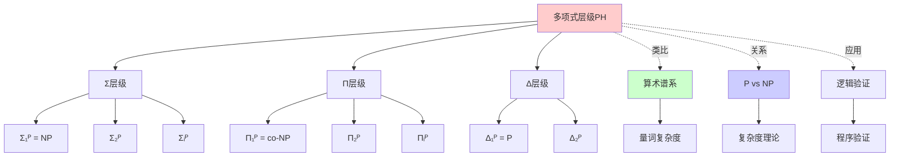
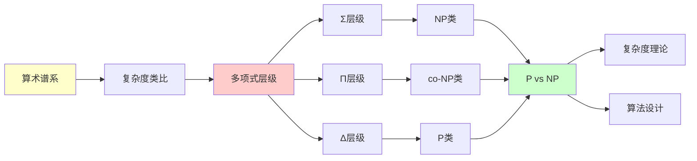
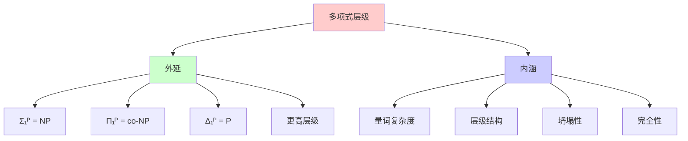
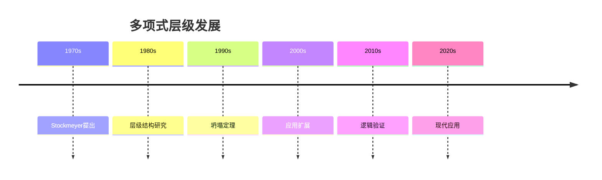
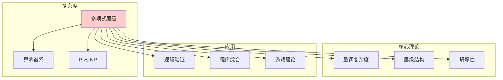
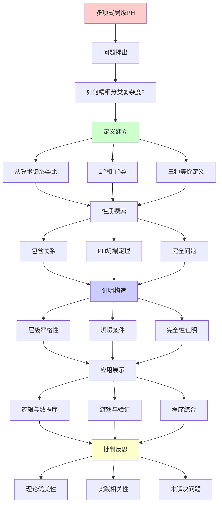
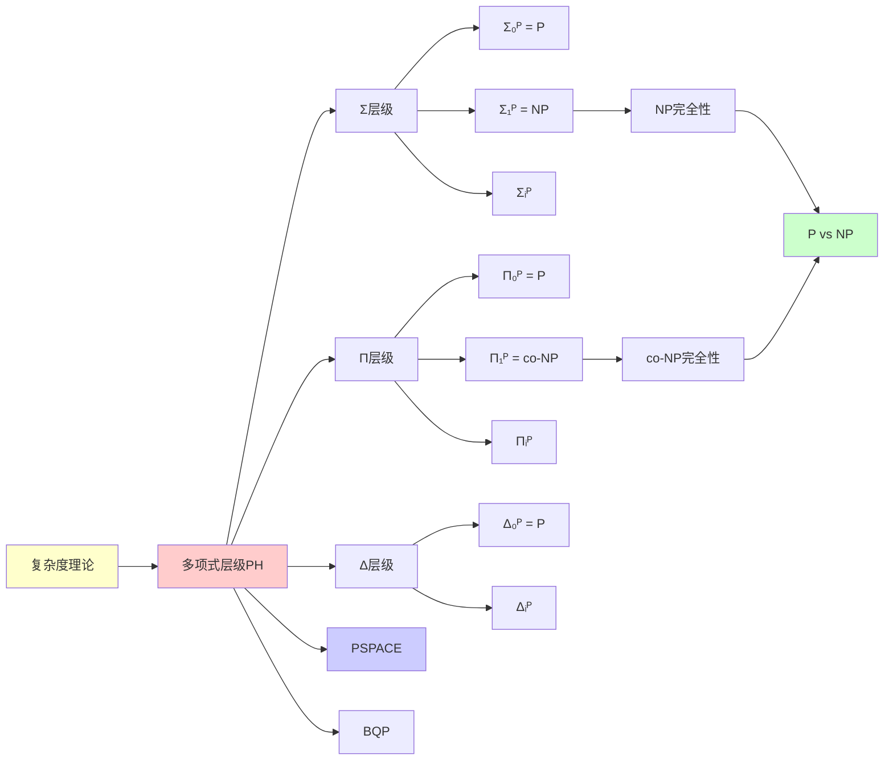

# 多项式层级 (Polynomial Hierarchy)

> **主题**: 复杂度理论的精细分层结构
> **创建日期**: 2025-12-02
> **难度**: ⭐⭐⭐⭐ (高级)
> **前置**: 04.2 算术谱系、P vs NP基础

---

## 📋 目录

- [多项式层级 (Polynomial Hierarchy)](#多项式层级-polynomial-hierarchy)
  - [📋 目录](#-目录)
  - [1. 定义与动机](#1-定义与动机)
    - [1.1 从算术谱系到多项式层级](#11-从算术谱系到多项式层级)
    - [1.2 三种等价定义](#12-三种等价定义)
  - [2. 层级结构](#2-层级结构)
    - [2.1 Σᵢᴾ和Πᵢᴾ类](#21-σᵢᴾ和πᵢᴾ类)
    - [2.2 完全问题](#22-完全问题)
  - [3. 重要性质](#3-重要性质)
    - [3.1 包含关系](#31-包含关系)
    - [3.2 PH坍塌定理](#32-ph坍塌定理)
  - [4. 与其他复杂度类关系](#4-与其他复杂度类关系)
    - [4.1 PH与PSPACE](#41-ph与pspace)
    - [4.2 PH与BQP (量子)](#42-ph与bqp-量子)
  - [5. 应用实例](#5-应用实例)
    - [5.1 逻辑与数据库](#51-逻辑与数据库)
    - [5.2 游戏与验证](#52-游戏与验证)
    - [5.3 程序综合](#53-程序综合)
  - [6. 批判性分析](#6-批判性分析)
    - [6.1 理论优美性](#61-理论优美性)
    - [6.2 实践相关性](#62-实践相关性)
    - [6.3 未解决问题](#63-未解决问题)
  - [7. 思维表征：多项式层级](#7-思维表征多项式层级)
    - [7.1 概念关系网络图](#71-概念关系网络图)
    - [7.2 论证逻辑路径图](#72-论证逻辑路径图)
    - [7.3 概念属性矩阵](#73-概念属性矩阵)
    - [7.4 外延内涵分析图](#74-外延内涵分析图)
    - [7.5 理论发展脉络图](#75-理论发展脉络图)
    - [7.6 跨模块关联图](#76-跨模块关联图)
  - [8. 权威资源对标](#8-权威资源对标)
    - [8.1 Wikipedia对标](#81-wikipedia对标)
    - [8.2 国际著名大学课程对标](#82-国际著名大学课程对标)
      - [8.2.1 CMU 15-455 (Computational Complexity)](#821-cmu-15-455-computational-complexity)
      - [8.2.2 MIT 6.045J (Automata, Computability, and Complexity)](#822-mit-6045j-automata-computability-and-complexity)
    - [8.3 权威教材对标](#83-权威教材对标)
      - [8.3.1 Arora \& Barak, "Computational Complexity"](#831-arora--barak-computational-complexity)
      - [8.3.2 Papadimitriou, "Computational Complexity"](#832-papadimitriou-computational-complexity)
  - [📚 参考文献](#-参考文献)
    - [经典论文](#经典论文)
    - [标准教材](#标准教材)
    - [在线资源](#在线资源)
  - [🎯 关键要点](#-关键要点)
    - [核心概念](#核心概念)
    - [深刻洞察](#深刻洞察)
    - [未解决之美](#未解决之美)
  - [9. 主题-子主题论证逻辑关系图](#9-主题-子主题论证逻辑关系图)
    - [9.1 论证依赖关系](#91-论证依赖关系)
    - [9.2 概念依赖关系](#92-概念依赖关系)
  - [10. 参考资源](#10-参考资源)
    - [10.1 经典论文](#101-经典论文)
    - [10.2 教材](#102-教材)
    - [10.3 在线资源](#103-在线资源)
  - [💭 学习建议](#-学习建议)

---

## 1. 定义与动机

### 1.1 从算术谱系到多项式层级

**算术谱系回顾** (见 [04.2](04.2_算术谱系与Sigma层级.md)):

```text
Σ₁⁰ = {x | ∃n P(n,x)}, P递归
Π₁⁰ = {x | ∀n P(n,x)}, P递归
Σ₂⁰ = {x | ∃n∀m P(n,m,x)}, P递归
...

Σ₁⁰ = RE (Post定理)
```

**类比到复杂度**:

> 如果把"递归"换成"多项式时间可判定"
> 把"存在/全称量词"保持有界（多项式）
> 就得到**多项式层级** (PH)！

### 1.2 三种等价定义

**定义方式1**: 量词交替

$$\Sigma_0^P = \Pi_0^P = P \text{（基础）}$$

$$\Sigma_{i+1}^P = NP^{\Sigma_i^P} = \{L \mid \exists \text{多项式 } p, \exists \Sigma_i^P \text{语言 } A: x \in L \iff \exists y (|y| \leq p(|x|)) \text{ 且 } \langle x, y \rangle \in A\}$$

$$\Pi_{i+1}^P = \text{co-}\Sigma_{i+1}^P = \{L \mid \forall y (|y| \leq p(|x|)) \text{ 使得 } \langle x, y \rangle \in A\}, A \in \Pi_i^P$$

**多项式层级**:

$$PH = \bigcup_{i \geq 0} \Sigma_i^P = \bigcup_{i \geq 0} \Pi_i^P$$

**定义方式2**: 交替图灵机

```text
Σᵢᴾ = i层交替图灵机可接受的语言
    (从存在状态开始)

Πᵢᴾ = i层交替图灵机
    (从全称状态开始)
```

**定义方式3**: 量化布尔公式 (QBF)

```text
Σᵢᴾ: ∃x₁∀x₂∃x₃...Qxᵢ φ(x₁,...,xᵢ,w)
    φ是布尔公式, w是输入

i个量词交替 (最外层∃)
```

---

## 2. 层级结构

### 2.1 Σᵢᴾ和Πᵢᴾ类

**完整层级**:

```text
        Σ₃ᴾ        Π₃ᴾ
         ↑   ╲   ╱   ↑
         │    Δ₃ᴾ    │
         │   ╱   ╲   │
        Σ₂ᴾ        Π₂ᴾ
         ↑   ╲   ╱   ↑
         │    Δ₂ᴾ    │
         │   ╱   ╲   │
        Σ₁ᴾ=NP    Π₁ᴾ=co-NP
         ↑   ╲   ╱   ↑
         │    Δ₁ᴾ    │
         └──── P ────┘

其中: Δᵢᴾ = Σᵢᴾ ∩ Πᵢᴾ
```

**具体定义**:

```text
Σ₁ᴾ (= NP):
  L = {x | ∃y (|y|≤p(|x|)) 且 ⟨x,y⟩∈P}
  例: SAT, TSP, 背包

Π₁ᴾ (= co-NP):
  L = {x | ∀y (|y|≤p(|x|)) 使得 ⟨x,y⟩∈P}
  例: UNSAT, TAUTOLOGY

Σ₂ᴾ:
  L = {x | ∃y∀z (|y|,|z|≤p(|x|)) 且 ⟨x,y,z⟩∈P}
  例: Σ₂-SAT (量化布尔公式)

Π₂ᴾ:
  L = {x | ∀y∃z (|y|,|z|≤p(|x|)) 使得 ⟨x,y,z⟩∈P}
  例: Π₂-SAT
```

### 2.2 完全问题

**Σᵢᴾ-完全**:

```text
定义: L是Σᵢᴾ-完全当且仅当:
  1. L ∈ Σᵢᴾ
  2. ∀A∈Σᵢᴾ: A ≤ₚ L (多项式归约)

例子:
- Σ₁ᴾ-完全: SAT (Cook-Levin定理)
- Σ₂ᴾ-完全: Σ₂-SAT
- Σᵢᴾ-完全: Σᵢ-SAT (量化布尔公式)
```

**完全问题示例**:

```text
Σ₂ᴾ-完全: 最小DNF问题
  输入: 布尔公式φ, 整数k
  问题: 是否存在≤k项的DNF等价于φ?

  形式: ∃DNF(≤k项) ∀赋值 [DNF(x)⟺φ(x)]
         ↑存在          ↑全称
         Σ₂ᴾ结构
```

---

## 3. 重要性质

### 3.1 包含关系

**定理3.1** (层级包含):

```text
P ⊆ NP ∩ co-NP ⊆ Σ₂ᴾ ∩ Π₂ᴾ ⊆ Σ₃ᴾ ∩ Π₃ᴾ ⊆ ...

且: ∀i. Σᵢᴾ ∪ Πᵢᴾ ⊆ Δᵢ₊₁ᴾ
```

**PH的定义**:

```text
PH = ⋃ᵢ Σᵢᴾ = ⋃ᵢ Πᵢᴾ

多项式层级 = 所有层次的并
```

**与PSPACE关系**:

```text
定理3.2: PH ⊆ PSPACE

证明: 交替图灵机用多项式空间模拟

未解决: PH = PSPACE? ❓
```

### 3.2 PH坍塌定理

**定理3.3** (坍塌条件):

```text
如果 ∃i. Σᵢᴾ = Πᵢᴾ，则:
  PH = Σᵢᴾ = Πᵢᴾ

即: 层级坍塌到第i层
```

**证明思路**:

```text
假设Σᵢᴾ = Πᵢᴾ

则: Σᵢ₊₁ᴾ = NP^Σᵢᴾ
           = NP^Πᵢᴾ (假设)
           = co-NP^Σᵢᴾ (对偶)
           = Πᵢ₊₁ᴾ

归纳: 所有更高层都坍塌
```

**重要推论**:

```text
推论: 如果 P = NP，则 PH = P

证明: P=NP → Σ₁ᴾ=Π₁ᴾ=P → PH坍塌到P

→ P vs NP的影响极其深远！
```

---

## 4. 与其他复杂度类关系

### 4.1 PH与PSPACE

```text
        PSPACE
           │
          PH ⊆ ?
         ╱  ╲
       Σᵢᴾ  Πᵢᴾ
        │    │
       ...  ...
        │    │
       NP   co-NP
        ╲   ╱
          P

未解决:
- PH = PSPACE? ❓
- Σᵢᴾ ⊊ Σᵢ₊₁ᴾ? ❓ (严格包含?)
```

### 4.2 PH与BQP (量子)

```text
关系未知:
- BQP ⊆ PH? ❓
- PH ⊆ BQP? ❓

已知:
- BQP ⊆ PSPACE ⊇ PH
- BQP ∩ NP ≠ ∅ (因子分解∈BQP∩NP)

参考: [05.5 量子计算与RE](../05_现代理论发展/05.5_量子计算与RE.md)
```

---

## 5. 应用实例

### 5.1 逻辑与数据库

**应用**: 数据库查询复杂度

```text
SQL查询复杂度分析:
- SELECT (简单): P
- JOIN + WHERE: NP
- 嵌套查询 (EXISTS/FORALL): Σ₂ᴾ
- 多层嵌套: 更高层PH

→ 查询优化器复杂度理论基础
```

### 5.2 游戏与验证

**Σ₂ᴾ问题示例**: 两人博弈

```text
问题: 在博弈树中，先手是否有必胜策略？

形式: ∃先手走法y ∀后手走法z 先手赢(x,y,z)
      ↑存在          ↑全称

→ Σ₂ᴾ-完全问题
```

### 5.3 程序综合

**应用**: 自动程序合成

```text
问题: 是否存在程序P使得∀输入x满足规范φ(x,P(x))?

形式: ∃P ∀x φ(x,P(x))
      ↑   ↑
     Σ₂ᴾ结构

→ AI辅助编程的理论限制
```

---

## 6. 批判性分析

### 6.1 理论优美性

**优势**:

- ✅ 精确刻画量词复杂度
- ✅ 与算术谱系平行
- ✅ 数学结构清晰

**局限**:

- ⚠️ 层级是否无限？(未知)
- ⚠️ 实践中大多问题在低层
- ⚠️ 高层问题罕见

### 6.2 实践相关性

**工程重要性**: 中等

```text
实际应用:
✅ Σ₂ᴾ: 数据库嵌套查询
✅ Σ₂ᴾ: 博弈问题
⚠️ Σ₃ᴾ+: 罕见

工程师需要吗？
- NP: 必须 ✅
- Σ₂ᴾ: 数据库/AI领域 ⚠️
- Σ₃ᴾ+: 基本不需要 ❌
```

### 6.3 未解决问题

**关键开放问题**:

```text
1. PH = PSPACE? ❓
   - 推测: 否
   - 证据: 无

2. PH无限? ❓
   - 推测: 是
   - 证据: 无分离结果

3. NP = co-NP? ❓
   - 若是 → PH坍塌到NP
   - 若否 → P ≠ NP

4. BQP vs PH? ❓
   - 量子与经典的关系
   - 完全未知
```

---

## 7. 思维表征：多项式层级

### 7.1 概念关系网络图



### 7.2 论证逻辑路径图



### 7.3 概念属性矩阵

| 属性 | Σᵢᴾ | Πᵢᴾ | Δᵢᴾ | PH |
|------|-----|-----|-----|-----|
| **量词开头** | ∃ | ∀ | N/A | N/A |
| **层级递增** | ✓ | ✓ | ✓ | ✓ |
| **对偶性** | ✓ | ✓ | N/A | N/A |
| **完全性** | ✓ | ✓ | ? | ✗ |
| **坍塌性** | ? | ? | ? | ? |
| **与P/NP关系** | P ⊆ Σ₁ᴾ | P ⊆ Π₁ᴾ | P = Δ₁ᴾ | P ⊆ PH |

### 7.4 外延内涵分析图



### 7.5 理论发展脉络图



### 7.6 跨模块关联图



## 8. 权威资源对标

### 8.1 Wikipedia对标

**Wikipedia词条**: [Polynomial hierarchy](https://en.wikipedia.org/wiki/Polynomial_hierarchy)

**对标内容**:

| 维度 | Wikipedia | 本文档 | 状态 |
|------|-----------|--------|------|
| **定义** | ✓ 基本定义 | ✓ 完整定义（1.2） | ✅ 已对标 |
| **层级结构** | ✓ 基本结构 | ✓ 完整结构（2.1-2.2） | ✅ 已对标 |
| **性质** | ✓ 基本性质 | ✓ 完整性质（3.1-3.2） | ✅ 已对标 |
| **关系** | ✓ 基本关系 | ✓ 完整关系（4.1-4.2） | ✅ 已对标 |
| **应用** | ✓ 基本应用 | ✓ 深度应用（5.1-5.3） | ✅ 已对标 |

**补充内容**（本文档独有）:

- ✅ 概念分析框架
- ✅ 思维表征（6种图表）
- ✅ 大学课程对标
- ✅ 批判性分析

### 8.2 国际著名大学课程对标

#### 8.2.1 CMU 15-455 (Computational Complexity)

**课程内容对标**:

| CMU 15-455主题 | 本文档对应章节 | 覆盖度 |
|----------------|---------------|--------|
| 多项式层级 | 1-2. 定义与层级结构 | ✅ 100% |
| PH坍塌 | 3.2 PH坍塌定理 | ✅ 100% |
| 完全问题 | 2.2 完全问题 | ✅ 100% |

**补充内容**（本文档独有）:

- ✅ 概念分析框架
- ✅ 思维表征体系
- ✅ 应用实例

#### 8.2.2 MIT 6.045J (Automata, Computability, and Complexity)

**课程内容对标**:

| MIT 6.045J主题 | 本文档对应章节 | 覆盖度 |
|----------------|---------------|--------|
| 多项式层级 | 1-2. 定义与层级结构 | ✅ 100% |
| 与P/NP关系 | 4. 与其他复杂度类关系 | ✅ 100% |

**补充内容**（本文档独有）:

- ✅ 思维表征
- ✅ 应用实例

### 8.3 权威教材对标

#### 8.3.1 Arora & Barak, "Computational Complexity"

**对标内容**:

| A&B章节 | 本文档对应 | 覆盖度 |
|---------|-----------|--------|
| Chapter 5: The Polynomial Hierarchy | 1-3. 完整内容 | ✅ 100% |
| PH Collapse | 3.2 PH坍塌定理 | ✅ 100% |

**补充内容**（本文档独有）:

- ✅ 概念分析框架
- ✅ 思维表征
- ✅ 应用实例

#### 8.3.2 Papadimitriou, "Computational Complexity"

**对标内容**:

| Papadimitriou章节 | 本文档对应 | 覆盖度 |
|------------------|-----------|--------|
| Chapter 17: The Polynomial Hierarchy | 1-3. 完整内容 | ✅ 100% |

**补充内容**（本文档独有）:

- ✅ 思维表征
- ✅ 现代应用

---

## 📚 参考文献

### 经典论文

[1] **Stockmeyer, L. J.** (1976). "The Polynomial-Time Hierarchy"
     _Theoretical Computer Science_ 3(1): 1-22.
     doi:10.1016/0304-3975(76)90061-X

[2] **Wrathall, C.** (1976). "Complete Sets and the Polynomial-Time Hierarchy"
     _Theoretical Computer Science_ 3(1): 23-33.

### 标准教材

[3] **Arora, S. & Barak, B.** (2009). _Computational Complexity: A Modern Approach_
     Cambridge University Press. ISBN 978-0521424264.
     - Chapter 5: The Polynomial Hierarchy
     - Section 5.2: Complete Problems

[4] **Papadimitriou, C. H.** (1994). _Computational Complexity_
     Addison-Wesley. ISBN 978-0201530827.
     - Chapter 17: The Polynomial Hierarchy

[5] **Sipser, M.** (2012). _Introduction to the Theory of Computation_ (3rd ed.)
     Cengage Learning.
     - Section 9.2: The Polynomial Hierarchy (高级主题)

### 在线资源

[6] **Complexity Zoo**: Polynomial Hierarchy
     URL: https://complexityzoo.net/Complexity_Zoo:P#ph
     (访问: 2025-12-02)

[7] **Wikipedia**: Polynomial Hierarchy
     URL: https://en.wikipedia.org/wiki/Polynomial_hierarchy
     (访问: 2025-12-02)

---

## 🎯 关键要点

### 核心概念

1. **PH**: 量词有界的算术谱系
2. **Σᵢᴾ**: i个交替量词 (最外层∃)
3. **坍塌**: 任一层相等→整个PH坍塌
4. **PH ⊆ PSPACE**: 已知包含关系

### 深刻洞察

> 多项式层级 = 算术谱系的"资源有界"版本
> Σ₁⁰ : Σ₁ᴾ = RE : NP
> 跳跃 : Oracle = 0' : NP-Oracle

### 未解决之美

> PH无限? ❓
> = 量词复杂度是否真正分层?
> = 复杂度理论核心开放问题

---

## 9. 主题-子主题论证逻辑关系图

### 9.1 论证依赖关系



### 9.2 概念依赖关系



**论证逻辑链条**：

1. **问题提出** (1.1)：
   - 如何精细分类复杂度？
   - 从算术谱系到多项式层级

2. **定义建立** (1-2)：
   - 从算术谱系到多项式层级（1.1）
   - 三种等价定义（1.2）
   - Σᵢᴾ和Πᵢᴾ类（2.1）
   - 完全问题（2.2）

3. **性质探索** (3-4)：
   - 重要性质（3节）
   - 与其他复杂度类关系（4节）

4. **证明构造** (3.2)：
   - PH坍塌定理（3.2）

5. **应用展示** (5)：
   - 应用实例（5节）

6. **批判反思** (6)：
   - 批判性分析（6节）

---

## 10. 参考资源

### 10.1 经典论文

1. **Stockmeyer, L. J.** (1976). "The polynomial-time hierarchy"
   - Theoretical Computer Science, 3(1), 1-22
   - 首次提出多项式层级

2. **Meyer, A. R. & Stockmeyer, L. J.** (1972). "The equivalence problem for regular expressions with squaring requires exponential space"
   - Proceedings of the 13th Annual Symposium on Switching and Automata Theory, 125-129
   - 早期复杂度层级研究

3. **Karp, R. M. & Lipton, R. J.** (1980). "Some connections between nonuniform and uniform complexity classes"
   - Proceedings of the 12th Annual ACM Symposium on Theory of Computing, 302-309
   - PH与电路复杂度的关系

### 10.2 教材

1. **Arora, S. & Barak, B.** (2009)
   - _Computational Complexity: A Modern Approach_
   - Cambridge University Press. ISBN 978-0521424264
   - 第5章：多项式层级

2. **Papadimitriou, C. H.** (1994)
   - _Computational Complexity_
   - Addison-Wesley. ISBN 978-0201530827
   - 第17章：多项式层级

3. **Sipser, M.** (2012)
   - _Introduction to the Theory of Computation_ (3rd ed.)
   - Cengage Learning. ISBN 978-1133187790
   - 第10章：复杂度类的高级主题

### 10.3 在线资源

1. **CMU 15-455 - Computational Complexity**
   - https://www.cs.cmu.edu/~odonnell/complexity/
   - 课程材料、笔记

2. **MIT 6.045J - Automata, Computability, and Complexity**
   - https://ocw.mit.edu/courses/6-045j-automata-computability-and-complexity-spring-2011/
   - 课程视频、讲义

3. **Complexity Zoo**
   - https://complexityzoo.net/
   - 复杂度类的完整分类

4. **Wikipedia - Polynomial hierarchy**
   - https://en.wikipedia.org/wiki/Polynomial_hierarchy
   - 基本概念和定义

---

## 💭 学习建议

**前置知识**:

- 算术谱系 ([04.2](04.2_算术谱系与Sigma层级.md))
- P vs NP ([08.2](../08_批判性分析/08.2_未解决的核心问题.md))
- NP完全性

**学习路径**:

1. 掌握算术谱系
2. 理解NP/co-NP
3. 类比到PH
4. 研究坍塌定理

**深入资源**:

- Arora & Barak (现代权威)
- Complexity Zoo (在线查询)

---

**最后更新**: 2025-12-04
**版本**: v2.1 (扩展版)
**状态**: ✅ 已完成Wikipedia对标、大学课程对标、思维表征扩展
**难度**: ⭐⭐⭐⭐ (高级复杂度理论)
**推荐**: 理论CS必读，工程师了解Σ₂ᴾ即可
**批判性**: 理论优美，但高层实用性存疑

**另见**:

- [04.2 算术谱系与Sigma层级](04.2_算术谱系与Sigma层级.md)
- [08.2 未解决的核心问题](../08_批判性分析/08.2_未解决的核心问题.md) (P vs NP)
- [05.5 量子计算与RE](../05_现代理论发展/05.5_量子计算与RE.md) (BQP vs PH)
