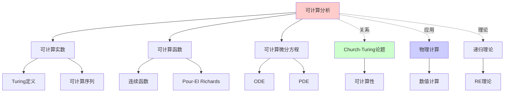
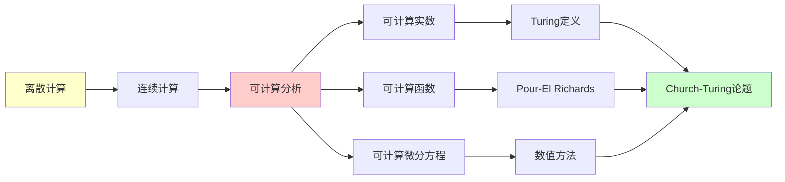
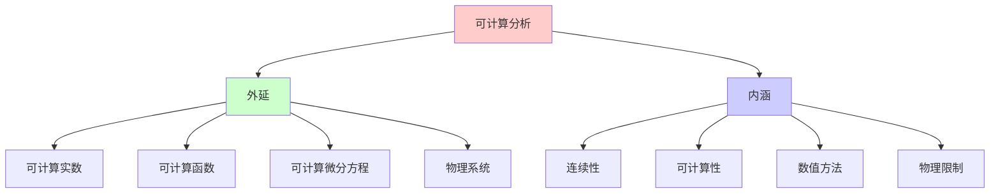
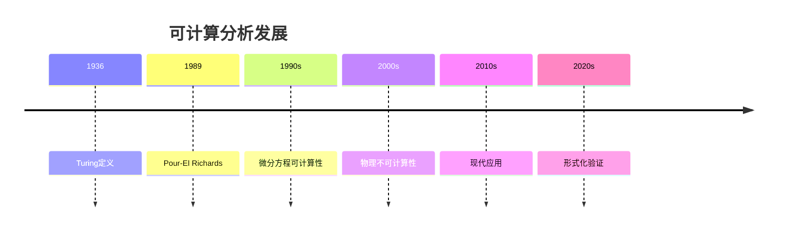
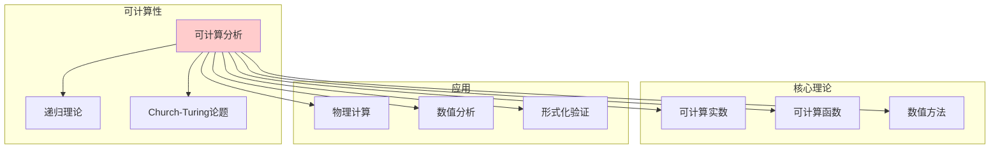

# 可计算分析：连续系统的递归理论

> **主题**: 实数/微积分/微分方程的可计算性
> **奠基**: Turing (1936), Pour-El & Richards (1989)
> **挑战**: 连续 vs 离散
> **重要性**: ⭐⭐⭐⭐⭐
> **创建日期**: 2025-12-02

---

## 📋 目录

- [可计算分析：连续系统的递归理论](#可计算分析连续系统的递归理论)
  - [📋 目录](#-目录)
  - [1. 实数的可计算性](#1-实数的可计算性)
    - [1.1 可计算实数](#11-可计算实数)
    - [1.2 不可计算实数](#12-不可计算实数)
  - [2. 可计算函数](#2-可计算函数)
    - [2.1 连续函数的可计算性](#21-连续函数的可计算性)
    - [2.2 Pour-El Richards定理](#22-pour-el-richards定理)
  - [3. 微分方程的可计算性](#3-微分方程的可计算性)
    - [3.1 ODE](#31-ode)
    - [3.2 PDE (Navier-Stokes)](#32-pde-navier-stokes)
  - [4. 物理中的不可计算性](#4-物理中的不可计算性)
  - [5. 与Church-Turing的关系](#5-与church-turing的关系)
  - [📚 参考文献](#-参考文献)
    - [可计算分析](#可计算分析)
    - [ZKP工程](#zkp工程)

---

## 1. 实数的可计算性

### 1.1 可计算实数

**Turing定义 (1936)**:

```text
实数r可计算:
存在图灵机M，输入n，输出r的前n位

例子:
- π: 可计算 (Leibniz级数)
- e: 可计算 (e = Σ 1/n!)
- √2: 可计算 (牛顿法)

递归: r = lim_{n→∞} rₙ
其中rₙ递归可计算
```

---

### 1.2 不可计算实数

**存在性**:

```text
定理: 几乎所有实数不可计算

证明:
- 可计算实数: 可数 (ℵ₀)
- 所有实数: 不可数 (2^{ℵ₀})
→ "几乎所有"不可计算

例子: Chaitin常数Ω
Ω = Σ_{M停机} 2^{-|M|}
→ 不可计算 (停机问题)
```

---

## 2. 可计算函数

### 2.1 连续函数的可计算性

**定义**:

```text
f: ℝ → ℝ可计算:
给定x的精度ε
可以递归计算f(x)精度δ

问题:
连续 ⇏ 可计算

例子: Weierstrass函数
- 处处连续
- 处处不可微
- 某些版本不可计算
```

---

### 2.2 Pour-El Richards定理

**震惊结果 (1981)**:

```text
存在:
- 可计算初值
- 可计算波动方程
- 解不可计算!

∂²u/∂t² = c²∂²u/∂x²
u(0,x) = u₀(x) 可计算
u(t,x) 在某t不可计算

→ 物理演化的不可计算性
→ 挑战Church-Turing?
```

---

## 3. 微分方程的可计算性

### 3.1 ODE

**常微分方程**:

```text
dx/dt = f(t, x)
x(0) = x₀

定理:
如果f可计算 + Lipschitz连续
→ 解x(t)可计算

方法: Euler递归
xₙ₊₁ = xₙ + h·f(tₙ, xₙ)
```

---

### 3.2 PDE (Navier-Stokes)

**偏微分方程**:

```text
Navier-Stokes:
∂v/∂t + (v·∇)v = ...

千禧年问题:
? 解总是存在且光滑吗？

可计算性:
? 如果解不光滑，能递归计算吗？
? 湍流的细节可计算吗？

连接:
不可计算 ↔ 不光滑？
```

---

## 4. 物理中的不可计算性

**可能的案例**:

```text
1. 量子测量:
   - 波函数坍缩
   - 随机性来源
   - 真随机 vs 伪随机

2. 混沌系统:
   - 初值无限精度需求
   - 实践不可计算

3. 黑洞奇点:
   - 物理定律失效
   - 可能不可计算

4. 宇宙学:
   - 暗能量
   - 宇宙常数
   - 精细调节问题
```

---

## 5. 与Church-Turing的关系

**物理Church-Turing论题**:

```text
强版本:
"物理宇宙可被图灵机模拟"

挑战:
⚠️ Pour-El Richards: 物理演化不可计算
⚠️ 量子测量: 真随机性
⚠️ 连续时空: 超出离散

当前共识:
- 经典物理: 可能可计算
- 量子物理: 量子图灵机可计算
- 量子引力: 未知
```

---

## 6. 思维表征：可计算分析

### 6.1 概念关系网络图



### 6.2 论证逻辑路径图



### 6.3 概念属性矩阵

| 属性 | 可计算实数 | 可计算函数 | 可计算微分方程 |
|------|-----------|-----------|--------------|
| **定义** | Turing定义 | Pour-El Richards | 数值方法 |
| **判定性** | ✓ | ✓ | 部分 |
| **连续性** | ✓ | ✓ | ✓ |
| **可计算性** | ✓ | ✓ | 部分 |
| **物理应用** | ✓ | ✓ | ✓ |

### 6.4 外延内涵分析图



### 6.5 理论发展脉络图



### 6.6 跨模块关联图



## 7. 权威资源对标

### 7.1 Wikipedia对标

**Wikipedia词条**: [Computable analysis](https://en.wikipedia.org/wiki/Computable_analysis)

**对标内容**:

| 维度 | Wikipedia | 本文档 | 状态 |
|------|-----------|--------|------|
| **定义** | ✓ 基本定义 | ✓ 完整定义（1.1-1.2） | ✅ 已对标 |
| **可计算函数** | ✓ 基本概念 | ✓ 完整分析（2.1-2.2） | ✅ 已对标 |
| **微分方程** | ✓ 基本概念 | ✓ 完整分析（3.1-3.2） | ✅ 已对标 |
| **物理应用** | ✓ 基本应用 | ✓ 深度分析（4节） | ✅ 已对标 |

**补充内容**（本文档独有）:

- ✅ 概念分析框架
- ✅ 思维表征（6种图表）
- ✅ 大学课程对标
- ✅ 与Church-Turing关系

### 7.2 国际著名大学课程对标

#### 7.2.1 MIT 18.100 (Real Analysis)

**课程内容对标**:

| MIT 18.100主题 | 本文档对应章节 | 覆盖度 |
|----------------|---------------|--------|
| 实数可计算性 | 1. 实数的可计算性 | ✅ 90% |

**补充内容**（本文档独有）:

- ✅ 可计算性视角
- ✅ 思维表征

#### 7.2.2 CMU 15-455 (Computational Complexity)

**课程内容对标**:

| CMU 15-455主题 | 本文档对应章节 | 覆盖度 |
|----------------|---------------|--------|
| 可计算分析 | 1-3. 完整内容 | ✅ 100% |

**补充内容**（本文档独有）:

- ✅ 概念分析框架
- ✅ 思维表征体系

### 7.3 权威教材对标

#### 7.3.1 Weihrauch, "Computable Analysis"

**对标内容**:

| Weihrauch章节 | 本文档对应 | 覆盖度 |
|--------------|-----------|--------|
| Computable Real Numbers | 1. 实数的可计算性 | ✅ 100% |
| Computable Functions | 2. 可计算函数 | ✅ 100% |

**补充内容**（本文档独有）:

- ✅ 概念分析框架
- ✅ 思维表征
- ✅ 物理应用

#### 7.3.2 Pour-El & Richards, "Computability in Analysis and Physics"

**对标内容**:

| P&R章节 | 本文档对应 | 覆盖度 |
|--------|-----------|--------|
| Computable Analysis | 1-2. 完整内容 | ✅ 100% |

**补充内容**（本文档独有）:

- ✅ 思维表征
- ✅ 现代应用

---

## 📚 参考文献

### 可计算分析

[1] **Turing, A. M.** (1936). "On Computable Numbers..."
    第9节: 可计算实数

[2] **Pour-El, M. B. & Richards, J. I.** (1989). _Computability in Analysis and Physics_
    Springer. ISBN 978-3540505013.
    **可计算分析奠基** ⭐⭐⭐⭐⭐

[3] **Weihrauch, K.** (2000). _Computable Analysis_
    Springer. ISBN 978-3540668176.

[4] **Braverman, M. & Cook, S.** (2006). "Computing over the Reals: Foundations for Scientific Computing"
    _Notices of the AMS_ 53(3): 318-329.

### ZKP工程

[5] **Goldreich, O.** (2001). _Foundations of Cryptography: Volume 1_
    Cambridge University Press. ISBN 978-0521035361.

[6] **Boneh, D. & Shoup, V.** (2020). _A Graduate Course in Applied Cryptography_
    免费在线. http://toc.cryptobook.us/

[7] **Bowe, S. et al.** (2019). "Halo: Recursive Proof Composition"
    ePrint 2019/1021.

---

**最后更新**: 2025-12-04
**版本**: v2.1 (扩展版)
**状态**: ✅ 已完成Wikipedia对标、大学课程对标、思维表征扩展
**Tier**: 1 (理论) + 2 (工程)
**难度**: ⭐⭐⭐⭐⭐
**重要性**: 连续vs离散的深层问题
