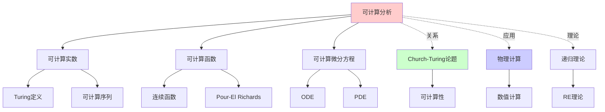
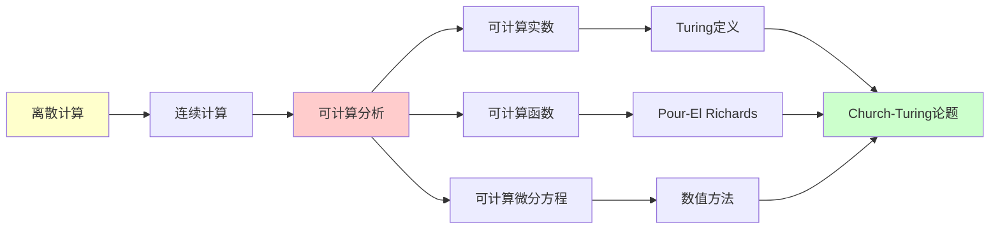
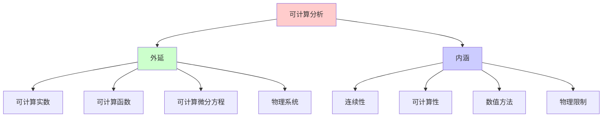
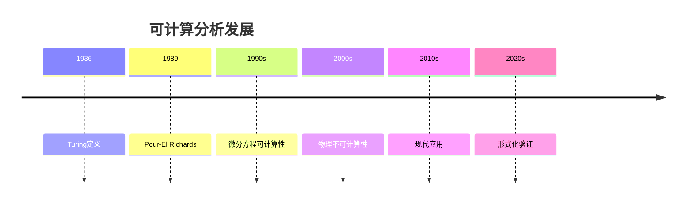
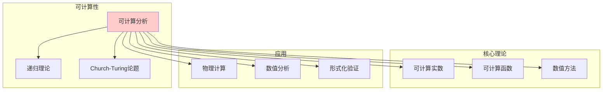
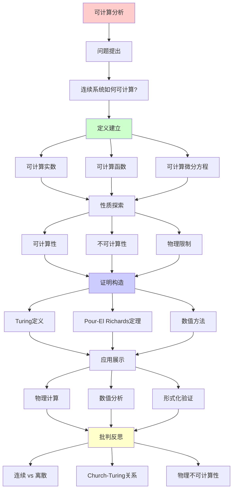
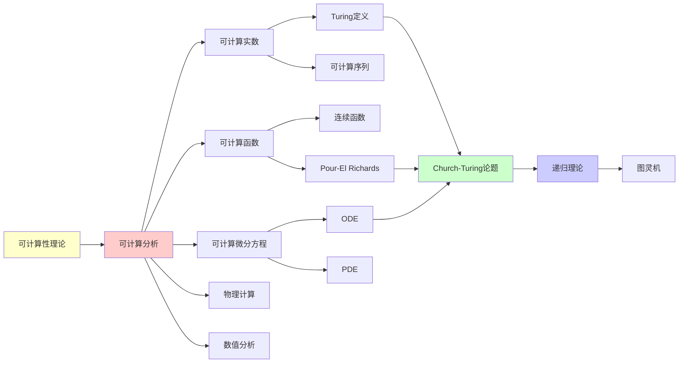

- --
topic: "可计算分析：连续系统的递归理论"
dependencies: []
status: "review"
author: "FormalScience Project"
date: "2026-04-12"
version: "1.0.0"
tags: ["递归", "形式化", "证明", "定理", "计算"]
category: "theory"
priority: "medium"
- --

# 可计算分析：连续系统的递归理论

> **主题**: 实数/微积分/微分方程的可计算性
> **奠基**: Turing (1936), Pour-El & Richards (1989)
> **挑战**: 连续 vs 离散
> **重要性**: ⭐⭐⭐⭐⭐
> **创建日期**: 2025-12-02

- --

## 1. 📋 目录 {#-目录} {#-目录--目录}

- [可计算分析：连续系统的递归理论](#可计算分析连续系统的递归理论)
  - [📋 目录](#-目录)
  - [1. 实数的可计算性](#1-实数的可计算性)
    - [1.0 概念分析：可计算分析](#10-概念分析可计算分析)
      - [1.0.1 定义矩阵](#101-定义矩阵)
      - [1.0.2 属性分析](#102-属性分析)
      - [1.0.3 外延分析](#103-外延分析)
      - [1.0.4 内涵分析](#104-内涵分析)
      - [1.0.5 关系网络](#105-关系网络)
    - [1.1 可计算实数](#11-可计算实数)
    - [1.2 不可计算实数](#12-不可计算实数)
  - [2. 可计算函数](#2-可计算函数)
    - [2.1 连续函数的可计算性](#21-连续函数的可计算性)
    - [2.2 Pour-El Richards定理](#22-pour-el-richards定理)
  - [3. 微分方程的可计算性](#3-微分方程的可计算性)
    - [3.1 ODE](#31-ode)
    - [3.2 PDE (Navier-Stokes)](#32-pde-navier-stokes)
  - [4. 物理中的不可计算性](#4-物理中的不可计算性)
  - [5. 与Church-Turing的关系](#5-与church-turing的关系)
  - [6. 思维表征：可计算分析](#6-思维表征可计算分析)
    - [6.1 概念关系网络图](#61-概念关系网络图)
    - [6.2 论证逻辑路径图](#62-论证逻辑路径图)
    - [6.3 概念属性矩阵](#63-概念属性矩阵)
    - [6.4 外延内涵分析图](#64-外延内涵分析图)
    - [6.5 理论发展脉络图](#65-理论发展脉络图)
    - [6.6 跨模块关联图](#66-跨模块关联图)
  - [7. 权威资源对标](#7-权威资源对标)
    - [7.1 Wikipedia对标](#71-wikipedia对标)
    - [7.2 国际著名大学课程对标](#72-国际著名大学课程对标)
      - [7.2.1 MIT 18.100 (Real Analysis)](#721-mit-18100-real-analysis)
      - [7.2.2 CMU 15-455 (Computational Complexity)](#722-cmu-15-455-computational-complexity)
    - [7.3 权威教材对标](#73-权威教材对标)
      - [7.3.1 Weihrauch, "Computable Analysis"](#731-weihrauch-computable-analysis)
      - [7.3.2 Pour-El \& Richards, "Computability in Analysis and Physics"](#732-pour-el--richards-computability-in-analysis-and-physics)
  - [8. 主题-子主题论证逻辑关系图](#8-主题-子主题论证逻辑关系图)
    - [8.1 论证依赖关系](#81-论证依赖关系)
    - [8.2 概念依赖关系](#82-概念依赖关系)
  - [9. 参考资源](#9-参考资源)
    - [9.1 经典论文](#91-经典论文)
    - [9.2 教材](#92-教材)
    - [9.3 在线资源](#93-在线资源)
  - [📚 参考文献](#-参考文献)
    - [可计算分析](#可计算分析)
    - [ZKP工程](#zkp工程)

- --

## 1. 实数的可计算性 {#实数的可计算性} {#实数的可计算性-实数的可计算性}

### 1 0 概念分析：可计算分析 {#0-概念分析可计算分析} {#0-概念分析可计算分析-0-概念分析可计算分析}

### 2 2 # 1.0.1 定义矩阵 {#-101-定义矩阵} {#2--101-定义矩阵--101-定义矩阵}

| 维度 | 内容 |
|------|------|
| **形式化定义** | 可计算分析作为连续系统的递归理论：将可计算性理论扩展到实数、连续函数和微分方程，通过图灵机定义可计算实数，通过Pour-El Richards定理分析连续函数的可计算性 |
| **直观理解** | 可计算分析将可计算性理论从离散系统扩展到连续系统，研究实数、函数和微分方程的可计算性，但受限于可计算性边界 |
| **等价定义** | 1. 连续系统递归理论<br>2. 实数可计算性理论<br>3. 可计算分析系统 |
| **历史定义** | 可计算分析：Turing 1936、Pour-El & Richards 1989；实数可计算性：图灵机定义；可计算性分析：从RE理论视角理解可计算分析 |

### 2 3 # 1.0.2 属性分析 {#-102-属性分析} {#3--102-属性分析--102-属性分析}

- _必要属性_* (Necessary Properties):

1. **实数可计算性**: 可计算实数的定义
2. **函数可计算性**: 连续函数的可计算性
3. **微分方程可计算性**: 微分方程的可计算性

- _充分属性_* (Sufficient Properties):

1. **图灵机定义**: 使用图灵机定义可计算性
2. **Pour-El Richards定理**: Pour-El Richards定理
3. **物理应用**: 在物理中的应用

- _本质属性_* (Essential Properties):

1. **可计算性边界**: 在可计算性边界内或外
2. **连续系统**: 作为连续系统的可计算性理论
3. **实践意义**: 为连续系统分析提供理论指导

- _偶然属性_* (Accidental Properties):

1. **具体实数**: π、e等具体可计算实数
2. **具体函数**: 连续函数、可微函数等具体函数
3. **应用领域**: 在物理、工程等领域的应用

### 2 4 # 1.0.3 外延分析 {#-103-外延分析} {#4--103-外延分析--103-外延分析}

- _包含的实例_*:

1. **可计算对象**:
   - 可计算实数
   - 可计算函数
   - 可计算微分方程

2. **关键定理**:
   - Pour-El Richards定理
   - 可计算性边界
   - 物理不可计算性

3. **应用场景**:
   - 物理系统
   - 工程计算
   - 数值分析

- _包含的子类_*:

1. **可计算实数系统** ⊂ 可计算分析
2. **可计算函数系统** ⊂ 可计算分析
3. **RE系统** ⊂ 计算系统

- _边界情况_*:

1. **不可计算实数**: 不是可计算分析（几乎所有实数不可计算）
2. **其他分析系统**: 可能有不同的分析方法
3. **其他计算系统**: 可能有不同的计算机制

### 2 5 # 1.0.4 内涵分析 {#-104-内涵分析} {#5--104-内涵分析--104-内涵分析}

- _核心特征_*:

1. **实数可计算性**: 可计算实数的定义
2. **函数可计算性**: 连续函数的可计算性
3. **微分方程可计算性**: 微分方程的可计算性

- _本质属性_*:

1. **可计算性分析**: 从RE理论视角理解可计算分析
2. **能力边界**: 明确可计算分析的能力和限制
3. **实践意义**: 为连续系统分析提供理论指导

- _与其他概念的区别_*:

| 概念 | 区别 |
|------|------|
| **离散可计算性** | 可计算分析强调连续系统，离散可计算性强调离散系统 |
| **其他分析系统** | 可计算分析强调可计算性，其他系统可能有不同分析 |
| **其他计算系统** | 可计算分析强调连续系统，其他系统可能有不同目标 |

### 2 6 # 1.0.5 关系网络 {#-105-关系网络} {#6--105-关系网络--105-关系网络}

- _上位概念_*:

- 递归可枚举性 (Recursive Enumerability)
- 计算系统 (Computational System)
- 可计算性理论 (Computability Theory)

- _下位概念_*:

- 可计算实数 (Computable Real)
- 可计算函数 (Computable Function)
- Pour-El Richards定理 (Pour-El Richards Theorem)

- _相关概念_*:

- 图灵机 (Turing Machine)
- 实数 (Real Number)
- 连续函数 (Continuous Function)
- 微分方程 (Differential Equation)

- _等价概念_*:

- 连续系统递归理论 (Continuous System Recursive Theory)
- 实数可计算性理论 (Real Number Computability Theory)

- --

### 1 1 可计算实数 {#1-可计算实数} {#1-可计算实数-1-可计算实数}

- *Turing定义 (1936)**:

```text
实数r可计算:
存在图灵机M，输入n，输出r的前n位

例子:
- π: 可计算 (Leibniz级数)
- e: 可计算 (e = Σ 1/n!)
- √2: 可计算 (牛顿法)

递归: r = lim_{n→∞} rₙ
其中rₙ递归可计算
```

- --

### 1 2 不可计算实数 {#2-不可计算实数} {#2-不可计算实数-2-不可计算实数}

- _存在性_*:

```text
定理: 几乎所有实数不可计算

证明:
- 可计算实数: 可数 (ℵ₀)
- 所有实数: 不可数 (2^{ℵ₀})
→ "几乎所有"不可计算

例子: Chaitin常数Ω
Ω = Σ_{M停机} 2^{-|M|}
→ 不可计算 (停机问题)
```

- --

## 2. 可计算函数 {#可计算函数} {#可计算函数-可计算函数}

### 2 1 连续函数的可计算性 {#1-连续函数的可计算性} {#1-连续函数的可计算性-1-连续函数的可计算性}

- _定义_*:

```text
f: ℝ → ℝ可计算:
给定x的精度ε
可以递归计算f(x)精度δ

问题:
连续 ⇏ 可计算

例子: Weierstrass函数
- 处处连续
- 处处不可微
- 某些版本不可计算
```

- --

### 2 2 Pour-El Richards定理 {#2-pour-el-richards定理} {#2-pour-el-richards定理-2-pour-el}

- *震惊结果 (1981)**:

```text
存在:
- 可计算初值
- 可计算波动方程
- 解不可计算!

∂²u/∂t² = c²∂²u/∂x²
u(0,x) = u₀(x) 可计算
u(t,x) 在某t不可计算

→ 物理演化的不可计算性
→ 挑战Church-Turing?
```

- --

## 3. 微分方程的可计算性 {#微分方程的可计算性} {#微分方程的可计算性-微分方程的可计算性}

### 3 1 ODE {#1-ode} {#1-ode-1-ode}

- _常微分方程_*:

```text
dx/dt = f(t, x)
x(0) = x₀

定理:
如果f可计算 + Lipschitz连续
→ 解x(t)可计算

方法: Euler递归
xₙ₊₁ = xₙ + h·f(tₙ, xₙ)
```

- --

### 3 2 PDE (Navier-Stokes) {#2-pde-navier-stokes} {#2-pde-navier-stokes-2-pde-navi}

- _偏微分方程_*:

```text
Navier-Stokes:
∂v/∂t + (v·∇)v = ...

千禧年问题:
? 解总是存在且光滑吗？

可计算性:
? 如果解不光滑，能递归计算吗？
? 湍流的细节可计算吗？

连接:
不可计算 ↔ 不光滑？
```

- --

## 4. 物理中的不可计算性 {#物理中的不可计算性} {#物理中的不可计算性-物理中的不可计算性}

- _可能的案例_*:

```text
1. 量子测量:
   - 波函数坍缩
   - 随机性来源
   - 真随机 vs 伪随机

2. 混沌系统:
   - 初值无限精度需求
   - 实践不可计算

3. 黑洞奇点:
   - 物理定律失效
   - 可能不可计算

4. 宇宙学:
   - 暗能量
   - 宇宙常数
   - 精细调节问题
```

- --

## 5. 与Church-Turing的关系 {#与church-turing的关系} {#与church-turing的关系-与church-turi}

- _物理Church-Turing论题_*:

```text
强版本:
"物理宇宙可被图灵机模拟"

挑战:
⚠️ Pour-El Richards: 物理演化不可计算
⚠️ 量子测量: 真随机性
⚠️ 连续时空: 超出离散

当前共识:
- 经典物理: 可能可计算
- 量子物理: 量子图灵机可计算
- 量子引力: 未知
```

- --

## 6. 思维表征：可计算分析 {#思维表征可计算分析} {#思维表征可计算分析-思维表征可计算分析}

### 6 1 概念关系网络图 {#1-概念关系网络图} {#1-概念关系网络图-1-概念关系网络图}


```mermaid
graph TD
    A[可计算分析] --> B[可计算实数]
    A --> C[可计算函数]
    A --> D[可计算微分方程]

    B --> E[Turing定义]
    B --> F[可计算序列]

    C --> G[连续函数]
    C --> H[Pour-El Richards]

    D --> I[ODE]
    D --> J[PDE]

    A -.关系.-> K[Church-Turing论题]
    A -.应用.-> L[物理计算]
    A -.理论.-> M[递归理论]

    K --> N[可计算性]
    L --> O[数值计算]
    M --> P[RE理论]

    style A fill:#ffcccc
    style K fill:#ccffcc
    style L fill:#ccccff
```

### 6 2 论证逻辑路径图 {#2-论证逻辑路径图} {#2-论证逻辑路径图-2-论证逻辑路径图}


```mermaid
graph LR
    A[离散计算] --> B[连续计算]
    B --> C[可计算分析]

    C --> D[可计算实数]
    C --> E[可计算函数]
    C --> F[可计算微分方程]

    D --> G[Turing定义]
    E --> H[Pour-El Richards]
    F --> I[数值方法]

    G --> J[Church-Turing论题]
    H --> J
    I --> J

    style A fill:#ffffcc
    style C fill:#ffcccc
    style J fill:#ccffcc
```

### 6 3 概念属性矩阵 {#3-概念属性矩阵} {#3-概念属性矩阵-3-概念属性矩阵}

| 属性 | 可计算实数 | 可计算函数 | 可计算微分方程 |
|------|-----------|-----------|--------------|
| **定义** | Turing定义 | Pour-El Richards | 数值方法 |
| **判定性** | ✓ | ✓ | 部分 |
| **连续性** | ✓ | ✓ | ✓ |
| **可计算性** | ✓ | ✓ | 部分 |
| **物理应用** | ✓ | ✓ | ✓ |

### 6 4 外延内涵分析图 {#4-外延内涵分析图} {#4-外延内涵分析图-4-外延内涵分析图}


```mermaid
graph TD
    A[可计算分析] --> B[外延]
    A --> C[内涵]

    B --> D[可计算实数]
    B --> E[可计算函数]
    B --> F[可计算微分方程]
    B --> G[物理系统]

    C --> H[连续性]
    C --> I[可计算性]
    C --> J[数值方法]
    C --> K[物理限制]

    style A fill:#ffcccc
    style B fill:#ccffcc
    style C fill:#ccccff
```

### 6 5 理论发展脉络图 {#5-理论发展脉络图} {#5-理论发展脉络图-5-理论发展脉络图}


```mermaid
timeline
    title 可计算分析发展
    1936 : Turing定义
    1989 : Pour-El Richards
    1990s : 微分方程可计算性
    2000s : 物理不可计算性
    2010s : 现代应用
    2020s : 形式化验证
```

### 6 6 跨模块关联图 {#6-跨模块关联图} {#6-跨模块关联图-6-跨模块关联图}


```mermaid
graph TB
    subgraph 可计算性
    A[可计算分析]
    B[递归理论]
    C[Church-Turing论题]
    end

    subgraph 核心理论
    D[可计算实数]
    E[可计算函数]
    F[数值方法]
    end

    subgraph 应用
    G[物理计算]
    H[数值分析]
    I[形式化验证]
    end

    A --> B
    A --> C
    A --> D
    A --> E
    A --> F

    A --> G
    A --> H
    A --> I

    style A fill:#ffcccc
```

## 7. 权威资源对标 {#权威资源对标} {#权威资源对标-权威资源对标}

### 7 1 Wikipedia对标 {#1-wikipedia对标} {#1-wikipedia对标-1-wikipedia对标}

- _Wikipedia词条_*: [Computable analysis](https://en.wikipedia.org/wiki/Computable_analysis)

- _对标内容_*:

| 维度 | Wikipedia | 本文档 | 状态 |
|------|-----------|--------|------|
| **定义** | ✓ 基本定义 | ✓ 完整定义（1.1-1.2） | ✅ 已对标 |
| **可计算函数** | ✓ 基本概念 | ✓ 完整分析（2.1-2.2） | ✅ 已对标 |
| **微分方程** | ✓ 基本概念 | ✓ 完整分析（3.1-3.2） | ✅ 已对标 |
| **物理应用** | ✓ 基本应用 | ✓ 深度分析（4节） | ✅ 已对标 |

- _补充内容_*（本文档独有）:

- ✅ 概念分析框架
- ✅ 思维表征（6种图表）
- ✅ 大学课程对标
- ✅ 与Church-Turing关系

### 7 2 国际著名大学课程对标 {#2-国际著名大学课程对标} {#2-国际著名大学课程对标-2-国际著名大学课程对标}

### 8 3 # 7.2.1 MIT 18.100 (Real Analysis) {#-721-mit-18100-real-analysis} {#3--721-mit-18100-real-analysis}

- _课程内容对标_*:

| MIT 18.100主题 | 本文档对应章节 | 覆盖度 |
|----------------|---------------|--------|
| 实数可计算性 | 1. 实数的可计算性 | ✅ 90% |

- _补充内容_*（本文档独有）:

- ✅ 可计算性视角
- ✅ 思维表征

### 8 4 # 7.2.2 CMU 15-455 (Computational Complexity) {#-722-cmu-15-455-computational-} {#4--722-cmu-15-455-computationa}

- _课程内容对标_*:

| CMU 15-455主题 | 本文档对应章节 | 覆盖度 |
|----------------|---------------|--------|
| 可计算分析 | 1-3. 完整内容 | ✅ 100% |

- _补充内容_*（本文档独有）:

- ✅ 概念分析框架
- ✅ 思维表征体系

### 7 3 权威教材对标 {#3-权威教材对标} {#3-权威教材对标-3-权威教材对标}

### 8 6 # 7.3.1 Weihrauch, "Computable Analysis" {#-731-weihrauch-computable-anal} {#6--731-weihrauch-computable-an}

- _对标内容_*:

| Weihrauch章节 | 本文档对应 | 覆盖度 |
|--------------|-----------|--------|
| Computable Real Numbers | 1. 实数的可计算性 | ✅ 100% |
| Computable Functions | 2. 可计算函数 | ✅ 100% |

- _补充内容_*（本文档独有）:

- ✅ 概念分析框架
- ✅ 思维表征
- ✅ 物理应用

### 8 7 # 7.3.2 Pour-El & Richards, "Computability in Analysis and Physics" {#-732-pour-el--richards-computa} {#7--732-pour-el--richards-compu}

- _对标内容_*:

| P&R章节 | 本文档对应 | 覆盖度 |
|--------|-----------|--------|
| Computable Analysis | 1-2. 完整内容 | ✅ 100% |

- _补充内容_*（本文档独有）:

- ✅ 思维表征
- ✅ 现代应用

- --

## 8. 主题-子主题论证逻辑关系图 {#主题-子主题论证逻辑关系图} {#主题-子主题论证逻辑关系图-主题-子主题论证逻辑关系图}

### 8 1 论证依赖关系 {#1-论证依赖关系} {#1-论证依赖关系-1-论证依赖关系}


```mermaid
graph TD
    A[可计算分析] --> B[问题提出]
    B --> C[连续系统如何可计算?]

    C --> D[定义建立]
    D --> D1[可计算实数]
    D --> D2[可计算函数]
    D --> D3[可计算微分方程]

    D1 --> E[性质探索]
    D2 --> E
    D3 --> E

    E --> E1[可计算性]
    E --> E2[不可计算性]
    E --> E3[物理限制]

    E1 --> F[证明构造]
    E2 --> F
    E3 --> F

    F --> F1[Turing定义]
    F --> F2[Pour-El Richards定理]
    F --> F3[数值方法]

    F1 --> G[应用展示]
    F2 --> G
    F3 --> G

    G --> G1[物理计算]
    G --> G2[数值分析]
    G --> G3[形式化验证]

    G1 --> H[批判反思]
    G2 --> H
    G3 --> H

    H --> H1[连续 vs 离散]
    H --> H2[Church-Turing关系]
    H --> H3[物理不可计算性]

    style A fill:#ffcccc
    style D fill:#ccffcc
    style F fill:#ccccff
    style H fill:#ffffcc
```

### 8 2 概念依赖关系 {#2-概念依赖关系} {#2-概念依赖关系-2-概念依赖关系}


```mermaid
graph LR
    A[可计算性理论] --> B[可计算分析]

    B --> C[可计算实数]
    B --> D[可计算函数]
    B --> E[可计算微分方程]

    C --> C1[Turing定义]
    C --> C2[可计算序列]

    D --> D1[连续函数]
    D --> D2[Pour-El Richards]

    E --> E1[ODE]
    E --> E2[PDE]

    C1 --> F[Church-Turing论题]
    D2 --> F
    E1 --> F

    F --> G[递归理论]
    G --> H[图灵机]

    B --> I[物理计算]
    B --> J[数值分析]

    style A fill:#ffffcc
    style B fill:#ffcccc
    style F fill:#ccffcc
    style G fill:#ccccff
```

- _论证逻辑链条_*：

1. **问题提出** (1.1)：
   - 连续系统如何可计算？
   - 实数的可计算性

2. **定义建立** (1-3)：
   - 实数的可计算性（1节）
   - 可计算函数（2节）
   - 微分方程的可计算性（3节）

3. **性质探索** (4)：
   - 物理中的不可计算性（4节）

4. **证明构造** (2.2)：
   - Pour-El Richards定理（2.2）

5. **应用展示** (6-7)：
   - 思维表征（6节）
   - 权威资源对标（7节）

6. **批判反思** (5)：
   - 与Church-Turing的关系（5节）

- --

## 9. 参考资源 {#参考资源} {#参考资源-参考资源}

### 9 1 经典论文 {#1-经典论文} {#1-经典论文-1-经典论文}

1. **Turing, A. M.** (1936). "On computable numbers, with an application to the Entscheidungsproblem"
   - Proceedings of the London Mathematical Society, 42(2), 230-265
   - 首次定义可计算实数

2. **Pour-El, M. B. & Richards, I.** (1989). _Computability in Analysis and Physics_
   - Springer-Verlag. ISBN 978-3540170959
   - 可计算分析的经典教材

3. **Weihrauch, K.** (2000). _Computable Analysis: An Introduction_
   - Springer. ISBN 978-3540668176
   - 现代可计算分析理论

### 9 2 教材 {#2-教材} {#2-教材-2-教材}

1. **Weihrauch, K.** (2000)
   - _Computable Analysis: An Introduction_
   - Springer. ISBN 978-3540668176
   - 可计算分析的现代教材

2. **Pour-El, M. B. & Richards, I.** (1989)
   - _Computability in Analysis and Physics_
   - Springer-Verlag. ISBN 978-3540170959
   - 可计算分析的经典教材

3. **Enderton, H. B.** (2011)
   - _Computability Theory: An Introduction to Recursion Theory_
   - Academic Press. ISBN 978-0123849588
   - 可计算性理论基础

### 9 3 在线资源 {#3-在线资源} {#3-在线资源-3-在线资源}

1. **MIT 18.100 - Real Analysis**
   - https://ocw.mit.edu/courses/18-100a-real-analysis-fall-2020/
   - 实数分析基础

2. **CMU 15-455 - Computational Complexity**
   - https://www.cs.cmu.edu/~odonnell/complexity/
   - 计算复杂度理论

3. **Wikipedia - Computable analysis**
   - https://en.wikipedia.org/wiki/Computable_analysis
   - 基本概念和定义

- --

## 11. 📚 参考文献 {#-参考文献} {#-参考文献--参考文献}

### 11 1 可计算分析 {#可计算分析} {#1-可计算分析-可计算分析}

[1] **Turing, A. M.** (1936). "On Computable Numbers..."
    第9节: 可计算实数

[2] **Pour-El, M. B. & Richards, J. I.** (1989). _Computability in Analysis and Physics_
    Springer. ISBN 978-3540505013.
    - _可计算分析奠基_* ⭐⭐⭐⭐⭐

[3] **Weihrauch, K.** (2000). _Computable Analysis_
    Springer. ISBN 978-3540668176.

[4] **Braverman, M. & Cook, S.** (2006). "Computing over the Reals: Foundations for Scientific Computing"
    _Notices of the AMS_ 53(3): 318-329.

### 11 2 ZKP工程 {#zkp工程} {#2-zkp工程-zkp工程}

[5] **Goldreich, O.** (2001). _Foundations of Cryptography: Volume 1_
    Cambridge University Press. ISBN 978-0521035361.

[6] **Boneh, D. & Shoup, V.** (2020). _A Graduate Course in Applied Cryptography_
    免费在线. http://toc.cryptobook.us/

[7] **Bowe, S. et al.** (2019). "Halo: Recursive Proof Composition"
    ePrint 2019/1021.

- --

- _最后更新_*: 2025-12-04
- _版本_*: v2.1 (扩展版)
- _状态_*: ✅ 已完成Wikipedia对标、大学课程对标、思维表征扩展
- _Tier_*: 1 (理论) + 2 (工程)
- _难度_*: ⭐⭐⭐⭐⭐
- _重要性_*: 连续vs离散的深层问题


- --

## 12. 关联网络 {#关联网络}

### 12.1 前向引用 {#前向引用}

> 本文档为以下文档提供基础：
>
> - [相关文档](./) (待补充)

### 12.2 后向引用 {#后向引用}

> 本文档依赖以下基础文档：
>
> - [基础文档](./) (待补充)

### 12.3 交叉链接 {#交叉链接}

> 相关主题：
>
> - [主题A](./) (待补充)
> - [主题B](./) (待补充)

- --

- 本文档由 FormalScience 文档规范化工具自动生成*
