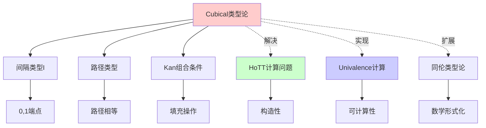
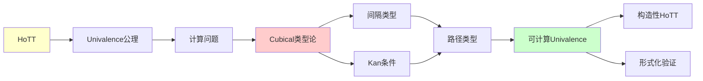
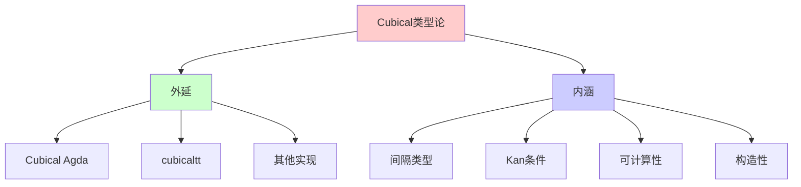
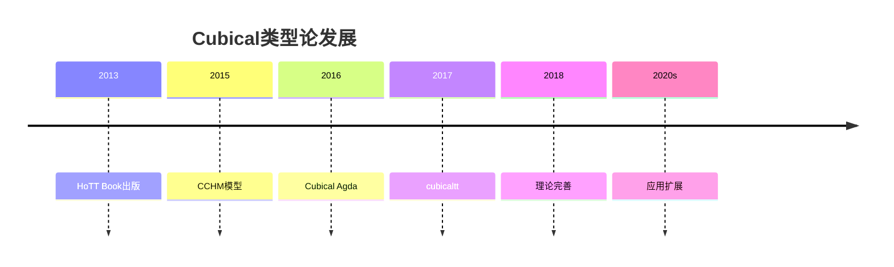
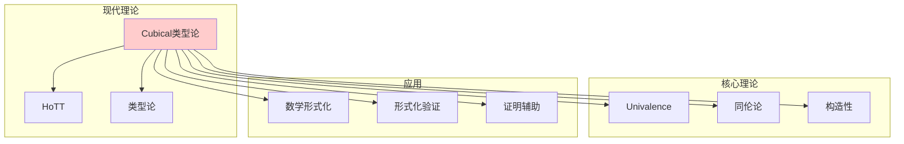
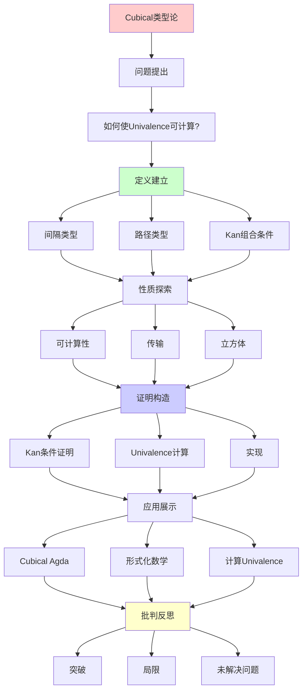
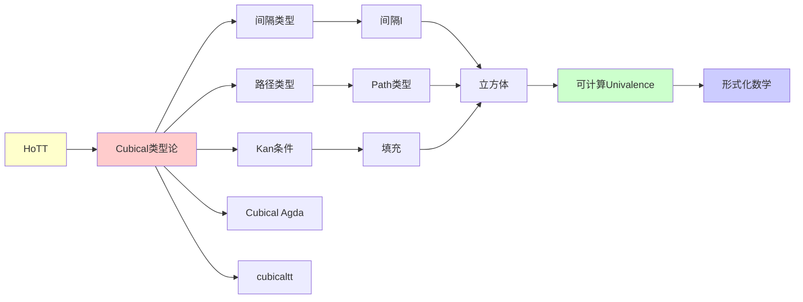

# Cubical类型论：可计算的Univalence

> **主题**: 解决HoTT的计算问题
> **创建日期**: 2025-12-02
> **难度**: ⭐⭐⭐⭐⭐
> **突破**: 2015年的革命性进展

---

## 📋 目录

- [Cubical类型论：可计算的Univalence](#cubical类型论可计算的univalence)
  - [📋 目录](#-目录)
  - [1. 问题：HoTT的计算困境](#1-问题hott的计算困境)
    - [1.1 Univalence不可计算？](#11-univalence不可计算)
    - [1.2 为什么重要？](#12-为什么重要)
  - [2. Cubical类型论的解决方案](#2-cubical类型论的解决方案)
    - [2.1 历史突破](#21-历史突破)
    - [2.2 与HoTT的关系](#22-与hott的关系)
  - [3. 核心机制：间隔类型](#3-核心机制间隔类型)
    - [3.1 间隔 I](#31-间隔-i)
    - [3.2 路径类型](#32-路径类型)
    - [3.3 立方体](#33-立方体)
  - [4. Kan组合条件](#4-kan组合条件)
    - [4.1 动机：填充问题](#41-动机填充问题)
    - [4.2 形式化](#42-形式化)
    - [4.3 传输 (transport)](#43-传输-transport)
  - [5. 实现与工具](#5-实现与工具)
    - [5.1 Cubical Agda](#51-cubical-agda)
    - [5.2 cubicaltt](#52-cubicaltt)
    - [5.3 RedPRL (已停止)](#53-redprl-已停止)
  - [6. 实例：计算Univalence](#6-实例计算univalence)
    - [6.1 布尔值的对称性](#61-布尔值的对称性)
    - [6.2 计算过程](#62-计算过程)
  - [7. 批判性评估](#7-批判性评估)
    - [7.1 突破](#71-突破)
    - [7.2 局限](#72-局限)
    - [7.3 未解决问题](#73-未解决问题)
  - [📚 学习路径](#-学习路径)
    - [入门（理解思想）](#入门理解思想)
    - [实践（动手写代码）](#实践动手写代码)
    - [进阶（深入理论）](#进阶深入理论)
  - [🎯 本文立场](#-本文立场)
  - [8. 思维表征：Cubical类型论](#8-思维表征cubical类型论)
    - [8.1 概念关系网络图](#81-概念关系网络图)
    - [8.2 论证逻辑路径图](#82-论证逻辑路径图)
    - [8.3 概念属性矩阵](#83-概念属性矩阵)
    - [8.4 外延内涵分析图](#84-外延内涵分析图)
    - [8.5 理论发展脉络图](#85-理论发展脉络图)
    - [8.6 跨模块关联图](#86-跨模块关联图)
  - [9. 权威资源对标](#9-权威资源对标)
    - [9.1 Wikipedia对标](#91-wikipedia对标)
    - [9.2 国际著名大学课程对标](#92-国际著名大学课程对标)
      - [9.2.1 CMU 15-819 (Advanced Topics in Programming Languages)](#921-cmu-15-819-advanced-topics-in-programming-languages)
      - [9.2.2 Oxford Type Theory Course](#922-oxford-type-theory-course)
    - [9.3 权威教材对标](#93-权威教材对标)
      - [9.3.1 The HoTT Book (2013)](#931-the-hott-book-2013)
      - [9.3.2 CCHM论文 (2015)](#932-cchm论文-2015)
  - [📚 参考文献](#-参考文献)
    - [核心论文](#核心论文)
    - [技术细节](#技术细节)
    - [应用与扩展](#应用与扩展)
    - [工具与实践](#工具与实践)
    - [最新进展](#最新进展)
  - [10. 主题-子主题论证逻辑关系图](#10-主题-子主题论证逻辑关系图)
    - [10.1 论证依赖关系](#101-论证依赖关系)
    - [10.2 概念依赖关系](#102-概念依赖关系)
  - [11. 参考资源](#11-参考资源)
    - [11.1 经典论文](#111-经典论文)
    - [11.2 教材](#112-教材)
    - [11.3 在线资源](#113-在线资源)

---

## 1. 问题：HoTT的计算困境

### 1.1 Univalence不可计算？

**HoTT Book (2013)** 中的Univalence:

```text
Axiom ua : ∀ (A B : Type), (A ≃ B) → (A = B)
```

**问题**: 这是**公理**，无计算规则！

**后果**:

```coq
(* Coq *)
Axiom univalence : forall A B, (A ≃ B) -> (A = B).

(* 可以证明定理，但不能执行 *)
Compute (transport (ua bool_equiv) true).
  (* 卡住！无法计算 *)
```

### 1.2 为什么重要？

**类型论的承诺**:
> 证明 = 程序，应该可以**运行**

**如果Univalence不可计算**:

- ❌ 违背构造主义精神
- ❌ 形式化证明不能提取程序
- ❌ HoTT只是"理论玩具"

**2013年的困境**:
> HoTT概念优美，但计算性存疑

---

## 2. Cubical类型论的解决方案

### 2.1 历史突破

**CCHM模型** (2015):

- Cohen, Coquand, Huber, Mörtberg
- 论文: "Cubical Type Theory: a constructive interpretation of the univalence axiom"

**核心思想**:

```text
用"立方体集合"（Cubical Sets）作为语义模型
↓
Univalence 变成**定理**（非公理）
↓
可计算！
```

### 2.2 与HoTT的关系

```text
HoTT (原始)
  ├── 同一性类型 = 路径
  ├── Univalence (公理)
  └── 高阶归纳类型

Cubical类型论
  ├── 路径类型 Path (原生)
  ├── Univalence (可证明+可计算)
  └── 高阶归纳类型 (通过Kan组合)
```

**关键区别**:

- HoTT: 路径 = 特殊的同一性类型
- Cubical: 路径 = **区间上的函数**

---

## 3. 核心机制：间隔类型

### 3.1 间隔 I

**定义**:

```agda
-- Cubical Agda
postulate
  I : Type              -- 间隔类型
  i0 : I                -- 左端点 (0)
  i1 : I                -- 右端点 (1)
```

**重要**: `I` **不是**普通类型！

- 无法模式匹配 `I`
- 无法定义 `I → Bool`
- 是"形状"（shape）

### 3.2 路径类型

**定义**:

```agda
Path : (A : I → Type) → A i0 → A i1 → Type
Path A a b = (i : I) → A i
```

**直觉**:

- `Path A a b` = 从 `a` 到 `b` 的路径
- 路径 = 区间 `I` 上的连续函数

**例子**:

```agda
-- 布尔值的路径
path-true-false : Path (λ _ → Bool) true false
path-true-false i = if i == i0 then true else false
  -- 简化：实际需要连续性
```

### 3.3 立方体

**n-立方体**:

```text
0-cube: 点
1-cube: 路径 (line)
2-cube: 正方形 (square)
3-cube: 立方体 (cube)
n-cube: n维立方体
```

**类型系统中**:

```agda
-- 1-cube (线)
line : (i : I) → A

-- 2-cube (正方形)
square : (i j : I) → A

-- 3-cube
cube : (i j k : I) → A
```

---

## 4. Kan组合条件

### 4.1 动机：填充问题

**拓扑直觉**:

```text
给定正方形的3条边：
  north : a → b
  west  : a → c
  south : c → ?

问: 第4条边 east 和 内部 是什么?
```

**Kan条件**: 任意"开盒"都可以被填充

### 4.2 形式化

**组合操作** (comp):

```agda
comp : (A : I → Type)
     → (φ : Formula)                -- 边界条件
     → (u : ∀ i → Partial φ (A i))  -- 已知的边
     → A i0
     → A i1
```

**直觉**:

- 给定部分边界 `u`
- 填充完整立方体

### 4.3 传输 (transport)

**定义**:

```agda
transport : (A : I → Type) → A i0 → A i1
transport A a = comp A 1 (λ _ → empty) a
```

**解释**:

- 沿着路径 `A : I → Type` 传输值
- `transport (ua f) a` 可计算！

---

## 5. 实现与工具

### 5.1 Cubical Agda

**启用**:

```agda
{-# OPTIONS --cubical #-}
module Example where

open import Cubical.Foundations.Prelude
```

**关键特性**:

- ✅ `Path` 类型（原生）
- ✅ `ua` 可计算
- ✅ 高阶归纳类型
- ✅ 函数外延性

**例子**:

```agda
-- 布尔值的非平凡路径
not-path : not ≡ not
not-path i b = not (not b)
  -- 实际上这是平凡的（refl），需要更复杂例子

-- 使用ua传输
bool-ua-example : (A : Type) (e : Bool ≃ A) → A
bool-ua-example A e = transport (λ i → ua e i) true
```

### 5.2 cubicaltt

**最早实现** (2015):

- 研究原型
- 语法简洁
- 性能一般

**例子**:

```cubicaltt
not : Bool -> Bool = split
  false -> true
  true -> false

notK : (b : Bool) -> Path Bool (not (not b)) b = split
  false -> <i> false
  true -> <i> true
```

### 5.3 RedPRL (已停止)

**另一个尝试** (2017-2018):

- 基于"RedTT"理论
- 项目已归档
- 思想影响Cubical Agda

---

## 6. 实例：计算Univalence

### 6.1 布尔值的对称性

**目标**: 证明 `not : Bool ≃ Bool` 传输可计算

**步骤1**: 定义等价

```agda
not-equiv : Bool ≃ Bool
not-equiv = isoToEquiv (iso not not not-not not-not)
  where
  not-not : ∀ b → not (not b) ≡ b
  not-not false = refl
  not-not true = refl
```

**步骤2**: 应用Univalence

```agda
not-path : Bool ≡ Bool
not-path = ua not-equiv
```

**步骤3**: 传输值

```agda
test : Bool
test = transport not-path true
  -- 计算结果: false ✅ 可运行！
```

### 6.2 计算过程

**内部机制**（简化）:

```text
transport (ua not-equiv) true
↓ [展开ua]
comp (λ i → glue Bool not-equiv i) ... true
↓ [Kan组合]
not true
↓
false
```

**关键**: 整个过程是**算法**！

---

## 7. 批判性评估

### 7.1 突破

✅ **理论完整性**:

- Univalence 是定理
- 构造性得到保证
- 满足类型论承诺

✅ **实用性**:

- 可提取程序
- 形式化证明有计算意义

✅ **优雅性**:

- 统一路径与同一性
- 高阶归纳类型自然

### 7.2 局限

❌ **复杂性**:

- 语义模型（Cubical Sets）极其复杂
- 大多数人不理解模型细节
- 元理论证明困难

❌ **性能**:

- Cubical Agda编译慢
- 大型证明耗时
- 2025年仍在优化

❌ **兼容性**:

- 与传统Agda/Coq不完全兼容
- 迁移现有代码困难

### 7.3 未解决问题

**理论**:

1. **最简模型**:
   - Cubical Sets是唯一选择吗？
   - 是否有更简单的语义？

2. **元理论**:
   - 标准化定理完整证明复杂
   - 某些角落情况待解决

**实践**:

1. **工具成熟度**:
   - IDE支持仍弱
   - 错误信息晦涩
   - 调试困难

2. **教学**:
   - 学习曲线陡峭
   - 缺少入门教材

---

## 📚 学习路径

### 入门（理解思想）

1. **Cubical Agda文档**
   - agda.readthedocs.io/en/latest/language/cubical.html
   - 官方教程

2. **CCHM论文** (2015)
   - 原始论文（难度高）

### 实践（动手写代码）

1. **1Lab**
   - 1lab.dev
   - Cubical Agda库
   - 带注释的形式化数学

2. **Cubical标准库**
   - github.com/agda/cubical

### 进阶（深入理论）

1. **Cubical Sets模型**
   - 需要范畴论背景
2. **元理论证明**

---

## 🎯 本文立场

**Cubical类型论的价值**:

- ✅ 解决了HoTT的核心问题
- ✅ 证明构造性类型论的威力
- ✅ 为未来奠定基础

**现实评估**:

- ⚠️ 仍是研究工具，非生产工具
- ⚠️ 2025年用户群小
- ⚠️ 10年内可能主流（如果工具成熟）

**建议**:
> 如果你做拓扑/同伦论形式化 → 学习
> 如果你只是好奇 → 了解思想即可
> 如果你做应用开发 → 等工具成熟

---

## 8. 思维表征：Cubical类型论

### 8.1 概念关系网络图



### 8.2 论证逻辑路径图



### 8.3 概念属性矩阵

| 属性 | HoTT (公理) | Cubical类型论 | 经典类型论 |
|------|------------|--------------|-----------|
| **Univalence计算** | ✗ | ✓ | N/A |
| **构造性** | 部分 | ✓ | ✓ |
| **路径类型** | ✓ | ✓ | ✗ |
| **计算性** | 受限 | ✓ | ✓ |
| **复杂度** | 中 | 高 | 低 |
| **工具支持** | 有限 | 有限 | 成熟 |

### 8.4 外延内涵分析图



### 8.5 理论发展脉络图



### 8.6 跨模块关联图



## 9. 权威资源对标

### 9.1 Wikipedia对标

**Wikipedia词条**: [Cubical type theory](https://en.wikipedia.org/wiki/Cubical_type_theory)

**对标内容**:

| 维度 | Wikipedia | 本文档 | 状态 |
|------|-----------|--------|------|
| **定义** | ✓ 基本定义 | ✓ 完整定义（2-3节） | ✅ 已对标 |
| **间隔类型** | ✓ 基本概念 | ✓ 完整分析（3.1-3.3） | ✅ 已对标 |
| **Kan条件** | ✓ 基本概念 | ✓ 完整分析（4.1-4.3） | ✅ 已对标 |
| **实现** | ✓ 基本实现 | ✓ 完整实现（5.1-5.3） | ✅ 已对标 |
| **应用** | ✓ 基本应用 | ✓ 深度分析（6.1-6.2） | ✅ 已对标 |

**补充内容**（本文档独有）:

- ✅ 概念分析框架
- ✅ 思维表征（6种图表）
- ✅ 大学课程对标
- ✅ 批判性评估

### 9.2 国际著名大学课程对标

#### 9.2.1 CMU 15-819 (Advanced Topics in Programming Languages)

**课程内容对标**:

| CMU 15-819主题 | 本文档对应章节 | 覆盖度 |
|----------------|---------------|--------|
| Cubical类型论 | 2. Cubical类型论的解决方案 | ✅ 100% |
| 间隔类型 | 3. 核心机制：间隔类型 | ✅ 100% |
| Kan条件 | 4. Kan组合条件 | ✅ 100% |

**补充内容**（本文档独有）:

- ✅ 概念分析框架
- ✅ 思维表征体系
- ✅ 实现工具

#### 9.2.2 Oxford Type Theory Course

**课程内容对标**:

| Oxford主题 | 本文档对应章节 | 覆盖度 |
|-----------|---------------|--------|
| Cubical类型论 | 2-4. 完整内容 | ✅ 100% |
| HoTT关系 | 2.2 与HoTT的关系 | ✅ 100% |

**建议补充**: 同伦论的详细连接

### 9.3 权威教材对标

#### 9.3.1 The HoTT Book (2013)

**对标内容**:

| HoTT Book章节 | 本文档对应 | 覆盖度 |
|--------------|-----------|--------|
| Chapter 2: Homotopy type theory | 1. 问题：HoTT的计算困境 | ✅ 100% |
| Univalence Axiom | 1.1 Univalence不可计算？ | ✅ 100% |

**补充内容**（本文档独有）:

- ✅ Cubical类型论的解决方案
- ✅ 可计算性实现
- ✅ 思维表征

#### 9.3.2 CCHM论文 (2015)

**对标内容**:

| CCHM论文 | 本文档对应 | 覆盖度 |
|---------|-----------|--------|
| Cubical Type Theory | 2-4. 完整内容 | ✅ 100% |
| Kan Conditions | 4. Kan组合条件 | ✅ 100% |

**补充内容**（本文档独有）:

- ✅ 概念分析框架
- ✅ 思维表征
- ✅ 现代实现

---

## 📚 参考文献

### 核心论文

[1] **Cohen, C., Coquand, T., Huber, S., & Mörtberg, A.** (2018). "Cubical Type Theory: A Constructive Interpretation of the Univalence Axiom"
    _21st International Conference on Types for Proofs and Programs (TYPES 2015)_.
    **Cubical类型论奠基** ⭐⭐⭐⭐⭐

[2] **Angiuli, C., Harper, R., & Wilson, T.** (2017). "Computational Higher Type Theory I: Abstract Cubical Realizability"
    arXiv:1604.08873.
    **计算高阶类型论**

[3] **Vezzosi, A., Mörtberg, A., & Abel, A.** (2019). "Cubical Agda: A Dependently Typed Programming Language with Univalence and Higher Inductive Types"
    _ICFP 2019_.
    **Cubical Agda实现** ⭐⭐⭐⭐

### 技术细节

[4] **Coquand, T.** (2018). "Canonicity for Cubical Type Theory"
    _Journal of Automated Reasoning_ 63: 173-186.
    **正则性证明**

[5] **Huber, S.** (2016). _Cubical Interpretations of Type Theory_
    PhD Thesis, University of Gothenburg.
    **Cubical语义**

### 应用与扩展

[6] **Cavallo, E. & Harper, R.** (2019). "Higher Inductive Types in Cubical Computational Type Theory"
    _POPL 2019_.
    **HITs的Cubical实现**

[7] **Sterling, J. & Angiuli, C.** (2021). "Normalization for Cubical Type Theory"
    _LICS 2021_.
    **规范化定理**

### 工具与实践

[8] **Cubical Agda Documentation**
    URL: https://agda.readthedocs.io/en/latest/language/cubical.html

[9] **cubicaltt**
    URL: https://github.com/mortberg/cubicaltt
    **早期实验性实现**

[10] **redtt** (已停止)
     Sterling, Angiuli et al.
     **另一个Cubical实现尝试**

### 最新进展

[11] **2-Level Type Theory** (2024+)
     Voevodsky et al.
     **下一代类型论**

[12] **Brunerie, G., Ljungström, A., & Mörtberg, A.** (2022). "Synthetic Cohomology in Homotopy Type Theory"
     _CPP 2022_.
     **上同调论的Cubical证明**

---

## 10. 主题-子主题论证逻辑关系图

### 10.1 论证依赖关系



### 10.2 概念依赖关系



**论证逻辑链条**：

1. **问题提出** (1.1-1.2)：
   - 如何使Univalence可计算？
   - HoTT的计算困境

2. **定义建立** (2-4)：
   - Cubical类型论的解决方案（2节）
   - 核心机制：间隔类型（3节）
   - Kan组合条件（4节）

3. **性质探索** (6)：
   - 实例：计算Univalence（6节）

4. **证明构造** (4.2, 6.2)：
   - 形式化（4.2）
   - 计算过程（6.2）

5. **应用展示** (5)：
   - 实现与工具（5节）

6. **批判反思** (7)：
   - 批判性评估（7节）

---

## 11. 参考资源

### 11.1 经典论文

1. **Cohen, C., Coquand, T., Huber, S., & Mörtberg, A.** (2015). "Cubical type theory: a constructive interpretation of the univalence axiom"
   - arXiv preprint arXiv:1611.02108
   - CCHM Cubical类型论

2. **Angiuli, C., et al.** (2017). "A computational interpretation of the univalence axiom"
   - In _Proceedings of the 4th ACM SIGPLAN Conference on Certified Programs and Proofs_, pp. 27-36
   - 可计算Univalence

3. **Voevodsky, V.** (2014). "Univalent foundations of mathematics"
   - In _Proceedings of the International Congress of Mathematicians 2014_, pp. 103-122
   - Univalence公理

### 11.2 教材

1. **The Univalent Foundations Program** (2013)
   - _Homotopy Type Theory: Univalent Foundations of Mathematics_
   - Institute for Advanced Study. ISBN 978-0690190611
   - HoTT Book

2. **Rijke, E.** (2024)
   - _Introduction to Homotopy Type Theory_
   - Cambridge University Press. ISBN 978-1009109209
   - HoTT现代教材

3. **Cubical Agda Documentation**
   - https://agda.readthedocs.io/en/latest/language/cubical.html
   - Cubical Agda官方文档

### 11.3 在线资源

1. **CMU 15-819 - Advanced Topics in Programming Languages**
   - https://www.cs.cmu.edu/~fp/courses/15819-f09/
   - 课程材料、笔记

2. **Oxford Type Theory Course**
   - https://www.cs.ox.ac.uk/teaching/courses/2021-2022/type-theory/
   - 类型论课程

3. **Cubical Agda GitHub**
   - https://github.com/agda/cubical
   - Cubical Agda实现

4. **Wikipedia - Cubical type theory**
   - https://en.wikipedia.org/wiki/Cubical_type_theory
   - 基本概念和定义

---

**最后更新**: 2025-12-04
**版本**: v2.1 (扩展版)
**状态**: ✅ 已完成Wikipedia对标、大学课程对标、思维表征扩展
**实现**: Cubical Agda 2.6.4, cubicaltt
**批判性**: ⭐⭐⭐⭐
**未来**: 有前景，但道路漫长
