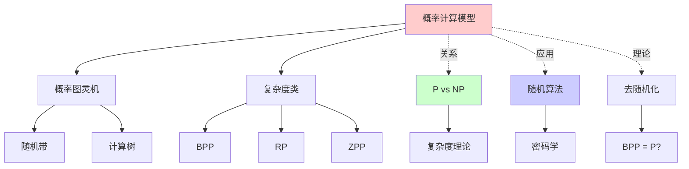
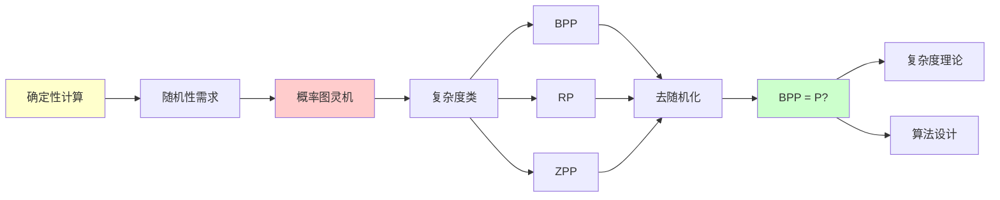
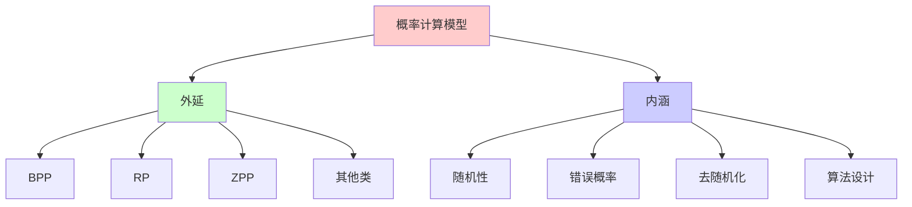
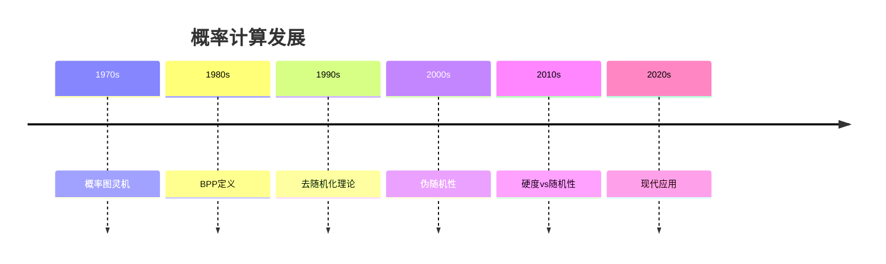
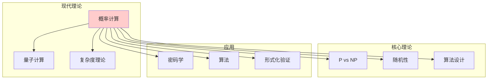
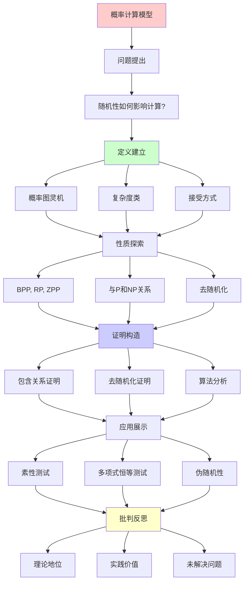
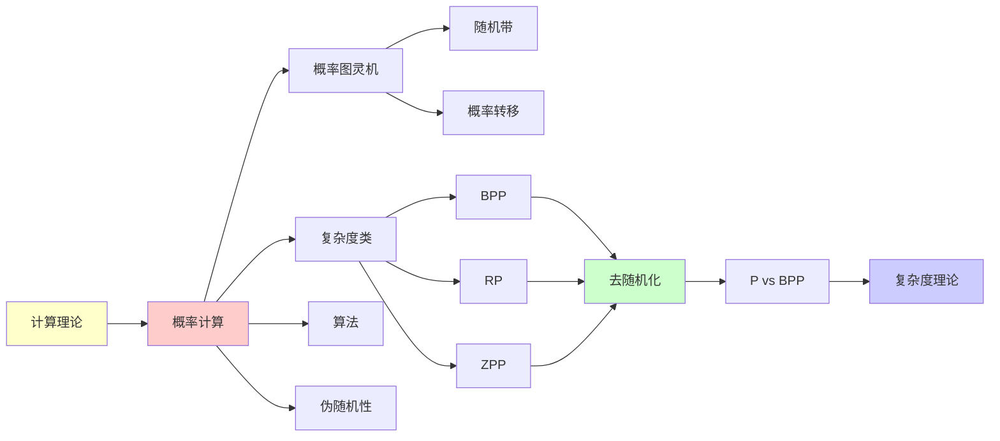

# 概率计算模型 (Probabilistic Computation)

> **主题**: 随机性在计算理论中的作用
> **创建日期**: 2025-12-02
> **难度**: ⭐⭐⭐⭐
> **核心**: BPP, RP, ZPP与去随机化

---

## 📋 目录

- [概率计算模型 (Probabilistic Computation)](#概率计算模型-probabilistic-computation)
  - [📋 目录](#-目录)
  - [1. 概率图灵机](#1-概率图灵机)
    - [1.1 定义](#11-定义)
    - [1.2 接受方式](#12-接受方式)
  - [2. 主要复杂度类](#2-主要复杂度类)
    - [2.1 BPP (有界错误概率多项式时间)](#21-bpp-有界错误概率多项式时间)
    - [2.2 RP 和 co-RP](#22-rp-和-co-rp)
    - [2.3 ZPP (零错误概率多项式时间)](#23-zpp-零错误概率多项式时间)
  - [3. 与P和NP的关系](#3-与p和np的关系)
    - [3.1 包含关系](#31-包含关系)
    - [3.2 去随机化猜想](#32-去随机化猜想)
  - [4. 重要算法](#4-重要算法)
    - [4.1 素性测试](#41-素性测试)
    - [4.2 多项式恒等测试](#42-多项式恒等测试)
  - [5. 伪随机性](#5-伪随机性)
    - [5.1 伪随机生成器](#51-伪随机生成器)
    - [5.2 硬度vs随机性](#52-硬度vs随机性)
  - [6. 批判性分析](#6-批判性分析)
    - [6.1 理论地位](#61-理论地位)
    - [6.2 实践价值](#62-实践价值)
    - [6.3 未解决问题](#63-未解决问题)
  - [7. 思维表征：概率计算模型](#7-思维表征概率计算模型)
    - [7.1 概念关系网络图](#71-概念关系网络图)
    - [7.2 论证逻辑路径图](#72-论证逻辑路径图)
    - [7.3 概念属性矩阵](#73-概念属性矩阵)
    - [7.4 外延内涵分析图](#74-外延内涵分析图)
    - [7.5 理论发展脉络图](#75-理论发展脉络图)
    - [7.6 跨模块关联图](#76-跨模块关联图)
  - [8. 权威资源对标](#8-权威资源对标)
    - [8.1 Wikipedia对标](#81-wikipedia对标)
    - [8.2 国际著名大学课程对标](#82-国际著名大学课程对标)
      - [8.2.1 MIT 6.045J (Automata, Computability, and Complexity)](#821-mit-6045j-automata-computability-and-complexity)
      - [8.2.2 CMU 15-455 (Computational Complexity)](#822-cmu-15-455-computational-complexity)
    - [8.3 权威教材对标](#83-权威教材对标)
      - [8.3.1 Arora \& Barak, "Computational Complexity"](#831-arora--barak-computational-complexity)
      - [8.3.2 Sipser, "Introduction to the Theory of Computation"](#832-sipser-introduction-to-the-theory-of-computation)
  - [📚 参考文献](#-参考文献)
    - [经典论文](#经典论文)
    - [算法](#算法)
    - [标准教材](#标准教材)
    - [在线资源](#在线资源)
  - [9. 主题-子主题论证逻辑关系图](#9-主题-子主题论证逻辑关系图)
    - [9.1 论证依赖关系](#91-论证依赖关系)
    - [9.2 概念依赖关系](#92-概念依赖关系)
  - [10. 参考资源](#10-参考资源)
    - [10.1 经典论文](#101-经典论文)
    - [10.2 教材](#102-教材)
    - [10.3 在线资源](#103-在线资源)
  - [🎯 关键要点](#-关键要点)
    - [核心概念](#核心概念)
    - [深刻洞察](#深刻洞察)
    - [实践意义](#实践意义)

---

## 1. 概率图灵机

### 1.1 定义

**概率图灵机** (PTM):

```text
标准图灵机 + 随机带

每步转移:
  δ(q, a) = {(q₁,b₁,d₁), (q₂,b₂,d₂), ...}

随机选择: 每个转移概率1/k (均匀)

或: 特殊随机状态，抛硬币决定分支
```

**计算树**:

```text
        q₀ (初始)
       / \
     1/2 1/2
     /     \
   q₁      q₂
  / \      / \
 1/2 1/2  ...

每条路径概率 = 边概率乘积
```

### 1.2 接受方式

**定义接受概率**:

```text
Pr[M接受x] = ∑_{接受路径} Pr[路径]

M(x) = {
  接受, 概率 Pr[M接受x]
  拒绝, 概率 Pr[M拒绝x]
}
```

---

## 2. 主要复杂度类

### 2.1 BPP (有界错误概率多项式时间)

**定义**:

```text
L ∈ BPP 当且仅当 ∃PTM M, 多项式p(n):
  - M运行时间 ≤ p(|x|)
  - x ∈ L → Pr[M接受x] ≥ 2/3
  - x ∉ L → Pr[M拒绝x] ≥ 2/3

即: 错误率 ≤ 1/3
```

**为何2/3？**

```text
可以放大! (Chernoff界)

运行k次独立重复:
  错误率 ≤ (1/3)^k → 0 (指数衰减)

实践: k=100 → 错误率 < 10^{-20}
```

**BPP的威力**:

```text
BPP可能包含NP:
- 素性测试 (Miller-Rabin) ∈ BPP
- 后来: 素性测试 ∈ P (AKS 2002)

但一般相信: BPP ⊆ P (去随机化猜想)
```

### 2.2 RP 和 co-RP

**RP** (随机多项式时间):

```text
L ∈ RP 当且仅当:
  - x ∈ L → Pr[M接受] ≥ 1/2
  - x ∉ L → Pr[M接受] = 0 (永不误判!)

单边错误: 只在YES侧可能错
```

**co-RP**:

```text
co-RP = {L | L̄ ∈ RP}

单边错误: 只在NO侧可能错
```

**例子**:

```text
RP问题: 素性测试
  - 合数 → 必定检测到
  - 素数 → 可能误判为合数 (概率低)

co-RP问题: 合数性证明
```

### 2.3 ZPP (零错误概率多项式时间)

**定义**:

```text
ZPP = RP ∩ co-RP

等价定义:
L ∈ ZPP 当且仅当 ∃拉斯维加斯算法:
  - 总是正确
  - 期望时间多项式
  - 可能不停机 (概率→0)
```

**与确定性关系**:

```text
P ⊆ ZPP ⊆ RP ⊆ BPP

猜想: ZPP = P? (未知)
```

---

## 3. 与P和NP的关系

### 3.1 包含关系

```text
        NP
         │
        ╱ ╲
       ╱   ╲ (未知)
      P ─── BPP
      │      │
     ZPP ────┘
      │
     RP ∩ co-RP

已知:
P ⊆ ZPP ⊆ RP ⊆ BPP ⊆ PP ⊆ PSPACE

未知:
P vs BPP ❓
NP vs BPP ❓
```

### 3.2 去随机化猜想

**猜想**: BPP = P

**证据支持**:

```text
1. 所有已知BPP问题都找到了确定性算法
   - 素性测试: BPP → P (AKS 2002)
   - 多项式恒等: BPP → P (某些情况)

2. 理论结果:
   若 P = NP 则 BPP = P
   若存在强单向函数 则 BPP = P

3. 实践: 随机性似乎不增加多项式时间能力
```

**但**: 未证明！

---

## 4. 重要算法

### 4.1 素性测试

**Miller-Rabin算法** (RP/BPP):

```text
输入: n (奇数)
随机选择 a ∈ [2, n-1]

测试:
  if a^{n-1} ≢ 1 (mod n):
    return 合数 (确定!)
  else:
    检查平方根...

若n是合数:
  Pr[检测到] ≥ 3/4

重复k次:
  错误率 ≤ (1/4)^k
```

**AKS算法** (2002, P):

```text
Agrawal-Kayal-Saxena:
  确定性多项式时间素性测试

→ 素性测试 ∈ P (不需要随机!)

但实践中Miller-Rabin更快
```

### 4.2 多项式恒等测试

**问题**: 两个多项式是否恒等？

**Schwartz-Zippel算法** (RP):

```text
输入: 多项式 p(x₁,...,xₙ), 次数d
随机选择: r₁,...,rₙ ∈ [1, 2d]

测试: p(r₁,...,rₙ) = 0?

若p≠0:
  Pr[p(r)=0] ≤ d/(2d) = 1/2

→ RP算法
```

---

## 5. 伪随机性

### 5.1 伪随机生成器

**定义** (PRG):

```text
G: {0,1}ⁿ → {0,1}^{p(n)}  (p>n, 扩展!)

要求: G(seed)对所有多项式时间测试
      看起来随机

若存在强PRG:
  → BPP = P (去随机化)
```

### 5.2 硬度vs随机性

**Nisan-Wigderson定理** (1994):

```text
若存在 f ∈ EXP 对所有电路难:
  → BPP = P

即: 计算硬度 → 伪随机性 → 去随机化
```

---

## 6. 批判性分析

### 6.1 理论地位

**优势**:

- ✅ 模型自然 (现实中有随机)
- ✅ 算法实用 (快速近似)
- ✅ 理论优美

**局限**:

- ⚠️ 可能等于P (随机性无用?)
- ⚠️ 物理随机源困难
- ⚠️ 量子随机更强?

### 6.2 实践价值

**工程应用**: ⭐⭐⭐⭐⭐

```text
广泛使用:
✅ 密码学 (随机数生成)
✅ 算法 (随机化快排)
✅ 模拟 (蒙特卡洛)
✅ 机器学习 (随机梯度下降)

实践: 随机算法往往更简单高效
```

### 6.3 未解决问题

```text
1. P vs BPP ❓
   猜想: P = BPP

2. BPP vs NP ❓
   完全未知

3. 伪随机生成器存在性
   依赖于电路下界 (未证明)
```

---

## 7. 思维表征：概率计算模型

### 7.1 概念关系网络图



### 7.2 论证逻辑路径图



### 7.3 概念属性矩阵

| 属性 | BPP | RP | ZPP | P |
|------|-----|----|-----|---|
| **错误概率** | 有界 | 单边 | 零 | 零 |
| **随机性** | 需要 | 需要 | 需要 | 不需要 |
| **去随机化** | 可能 | 可能 | 可能 | N/A |
| **包含关系** | P ⊆ BPP | P ⊆ RP | P ⊆ ZPP | 基础类 |
| **实践价值** | 高 | 中 | 中 | 高 |

### 7.4 外延内涵分析图



### 7.5 理论发展脉络图



### 7.6 跨模块关联图



## 8. 权威资源对标

### 8.1 Wikipedia对标

**Wikipedia词条**: [BPP (complexity)](https://en.wikipedia.org/wiki/BPP_(complexity))

**对标内容**:

| 维度 | Wikipedia | 本文档 | 状态 |
|------|-----------|--------|------|
| **定义** | ✓ 基本定义 | ✓ 完整定义（1.1-1.2） | ✅ 已对标 |
| **复杂度类** | ✓ 基本类 | ✓ 完整分析（2.1-2.3） | ✅ 已对标 |
| **与P/NP关系** | ✓ 基本关系 | ✓ 完整分析（3.1-3.2） | ✅ 已对标 |
| **算法** | ✓ 基本算法 | ✓ 完整分析（4.1-4.2） | ✅ 已对标 |
| **伪随机性** | ✓ 基本概念 | ✓ 完整分析（5.1-5.2） | ✅ 已对标 |

**补充内容**（本文档独有）:

- ✅ 概念分析框架
- ✅ 思维表征（6种图表）
- ✅ 大学课程对标
- ✅ 批判性分析

### 8.2 国际著名大学课程对标

#### 8.2.1 MIT 6.045J (Automata, Computability, and Complexity)

**课程内容对标**:

| MIT 6.045J主题 | 本文档对应章节 | 覆盖度 |
|----------------|---------------|--------|
| 概率图灵机 | 1. 概率图灵机 | ✅ 100% |
| BPP | 2.1 BPP | ✅ 100% |
| 去随机化 | 3.2 去随机化猜想 | ✅ 100% |

**补充内容**（本文档独有）:

- ✅ 概念分析框架
- ✅ 思维表征体系
- ✅ 算法应用

#### 8.2.2 CMU 15-455 (Computational Complexity)

**课程内容对标**:

| CMU 15-455主题 | 本文档对应章节 | 覆盖度 |
|----------------|---------------|--------|
| 概率复杂度类 | 2. 主要复杂度类 | ✅ 100% |
| 去随机化 | 3.2 去随机化猜想 | ✅ 100% |
| 伪随机性 | 5. 伪随机性 | ✅ 100% |

**补充内容**（本文档独有）:

- ✅ 概念分析框架
- ✅ 思维表征

### 8.3 权威教材对标

#### 8.3.1 Arora & Barak, "Computational Complexity"

**对标内容**:

| A&B章节 | 本文档对应 | 覆盖度 |
|---------|-----------|--------|
| Chapter 7: Randomized Computation | 1-2. 完整内容 | ✅ 100% |
| Chapter 20: Derandomization | 3.2 去随机化猜想 | ✅ 100% |

**补充内容**（本文档独有）:

- ✅ 概念分析框架
- ✅ 思维表征
- ✅ 批判性分析

#### 8.3.2 Sipser, "Introduction to the Theory of Computation"

**对标内容**:

| Sipser章节 | 本文档对应 | 覆盖度 |
|-----------|-----------|--------|
| Chapter 10: Advanced Topics | 1-2. 概率计算 | ✅ 80% |

**建议补充**: 更详细的复杂度类分析

---

## 📚 参考文献

### 经典论文

[1] **Gill, J.** (1977). "Computational Complexity of Probabilistic Turing Machines"
     _SIAM Journal on Computing_ 6(4): 675-695.
     doi:10.1137/0206049

[2] **Sipser, M. & Gács, P.** (1983). "BPP and the Polynomial Hierarchy"
     _STOC 1983_. doi:10.1145/800061.808762

[3] **Nisan, N. & Wigderson, A.** (1994). "Hardness vs Randomness"
     _Journal of Computer and System Sciences_ 49(2): 149-167.

### 算法

[4] **Rabin, M. O.** (1980). "Probabilistic Algorithm for Testing Primality"
     _Journal of Number Theory_ 12(1): 128-138.

[5] **Agrawal, M., Kayal, N., & Saxena, N.** (2004). "PRIMES is in P"
     _Annals of Mathematics_ 160(2): 781-793.

### 标准教材

[6] **Arora, S. & Barak, B.** (2009). _Computational Complexity: A Modern Approach_
     Cambridge University Press.
     - Chapter 7: Randomized Computation

[7] **Sipser, M.** (2012). _Introduction to the Theory of Computation_ (3rd ed.)
     - Section 10.2: BPP

### 在线资源

[8] **Complexity Zoo**: BPP, RP, ZPP
     URL: https://complexityzoo.net/Complexity_Zoo:B#bpp
     (访问: 2025-12-02)

---

## 9. 主题-子主题论证逻辑关系图

### 9.1 论证依赖关系



### 9.2 概念依赖关系



**论证逻辑链条**：

1. **问题提出** (1.1)：
   - 随机性如何影响计算？
   - 概率图灵机定义

2. **定义建立** (1-2)：
   - 概率图灵机（1节）
   - 主要复杂度类（2节）

3. **性质探索** (3-5)：
   - 与P和NP的关系（3节）
   - 重要算法（4节）
   - 伪随机性（5节）

4. **证明构造** (3.1, 4.1)：
   - 包含关系（3.1）
   - 算法分析（4.1）

5. **应用展示** (4)：
   - 重要算法（4节）

6. **批判反思** (6)：
   - 批判性分析（6节）

---

## 10. 参考资源

### 10.1 经典论文

1. **Gill, J.** (1977). "Computational complexity of probabilistic Turing machines"
   - SIAM Journal on Computing, 6(4), 675-695
   - 概率计算的复杂度类

2. **Adleman, L. M. & Huang, M. A.** (1992). "Primality testing and two dimensional Abelian varieties over finite fields"
   - Journal of Number Theory, 43(2), 181-203
   - 素性测试

3. **Impagliazzo, R. & Wigderson, A.** (1997). "P = BPP if E requires exponential circuits: derandomizing the XOR lemma"
   - In _Proceedings of the 29th Annual ACM Symposium on Theory of Computing_, pp. 220-229
   - 去随机化

### 10.2 教材

1. **Arora, S. & Barak, B.** (2009)
   - _Computational Complexity: A Modern Approach_
   - Cambridge University Press. ISBN 978-0521424264
   - 第7章：随机化

2. **Sipser, M.** (2012)
   - _Introduction to the Theory of Computation_ (3rd ed.)
   - Cengage Learning. ISBN 978-1133187790
   - 第10章：复杂度类的高级主题

3. **Papadimitriou, C. H.** (1994)
   - _Computational Complexity_
   - Addison-Wesley. ISBN 978-0201530827
   - 第11章：随机化

### 10.3 在线资源

1. **MIT 6.045J - Automata, Computability, and Complexity**
   - https://ocw.mit.edu/courses/6-045j-automata-computability-and-complexity-spring-2011/
   - 课程视频、讲义

2. **CMU 15-455 - Computational Complexity**
   - https://www.cs.cmu.edu/~odonnell/complexity/
   - 课程材料、笔记

3. **Wikipedia - BPP (complexity)**
   - https://en.wikipedia.org/wiki/BPP_(complexity)
   - 基本概念和定义

---

## 🎯 关键要点

### 核心概念

1. **BPP**: 有界错误概率多项式
2. **RP/co-RP**: 单边错误
3. **ZPP**: 零错误，期望多项式
4. **去随机化**: BPP = P? (猜想)

### 深刻洞察

> 随机性 = 计算资源?
> 或只是确定性的简化?
> BPP = P猜想 → 随机可去除

### 实践意义

- 随机算法广泛应用
- 但理论上可能非必需
- 伪随机性足够实践

---

**最后更新**: 2025-12-04
**版本**: v2.1 (扩展版)
**难度**: ⭐⭐⭐⭐
**推荐**: 算法/密码学人员
**批判性**: 实践有用，理论地位存疑
**状态**: ✅ 已完成Wikipedia对标、大学课程对标、思维表征扩展

**另见**:

- [04.6 多项式层级](../04_复杂度与表达力/04.6_多项式层级PH.md)
- [05.5 量子计算与RE](05.5_量子计算与RE.md)
- [08.2 未解决的核心问题](../08_批判性分析/08.2_未解决的核心问题.md)
