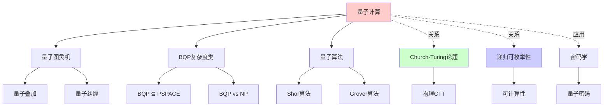
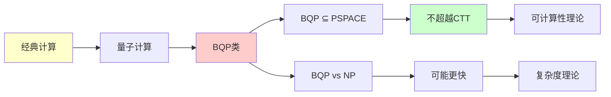
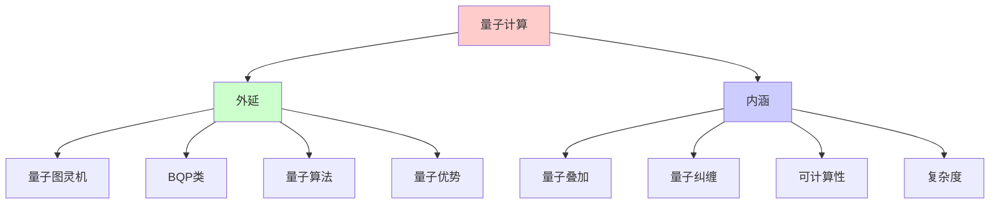
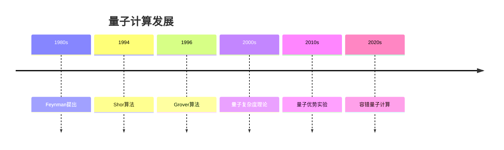
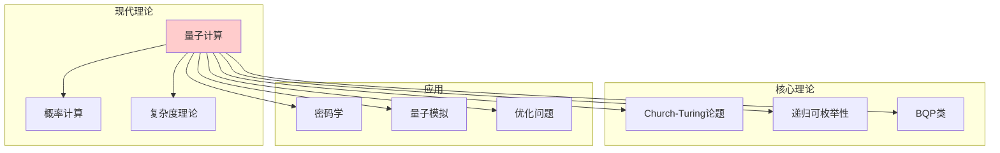
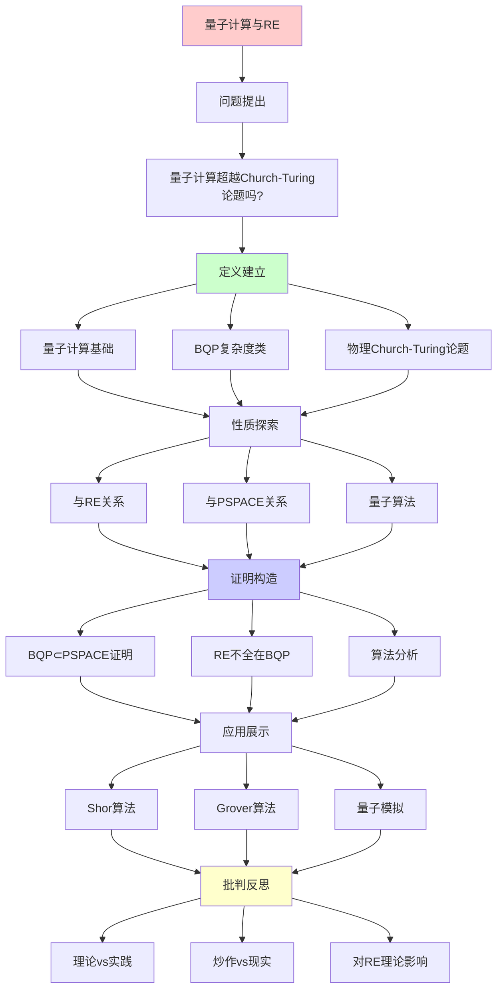
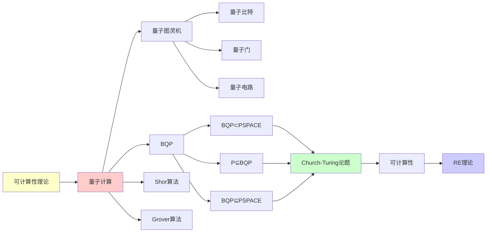

# 量子计算与递归可枚举性

> **核心问题**: 量子计算机超越Church-Turing论题吗？
> **创建日期**: 2025-12-02
> **答案**: 否（但更快）
> **批判性**: 区分速度与可计算性

---

## 📋 目录

- [量子计算与递归可枚举性](#量子计算与递归可枚举性)
  - [📋 目录](#-目录)
  - [1. 核心问题](#1-核心问题)
    - [1.1 问题陈述](#11-问题陈述)
    - [1.2 预设答案（含批判）](#12-预设答案含批判)
  - [2. 量子计算基础](#2-量子计算基础)
    - [2.1 量子比特](#21-量子比特)
    - [2.2 量子门](#22-量子门)
    - [2.3 量子电路](#23-量子电路)
  - [3. BQP复杂度类](#3-bqp复杂度类)
    - [3.1 定义](#31-定义)
    - [3.2 包含关系](#32-包含关系)
    - [3.3 BQP完全问题](#33-bqp完全问题)
  - [4. 量子计算与RE的关系](#4-量子计算与re的关系)
    - [4.1 定理：BQP ⊂ PSPACE](#41-定理bqp--pspace)
    - [4.2 定理：RE不全在BQP](#42-定理re不全在bqp)
    - [4.3 物理极限](#43-物理极限)
  - [5. 物理Church-Turing论题](#5-物理church-turing论题)
    - [5.1 强形式 (Physical CTT)](#51-强形式-physical-ctt)
    - [5.2 批判性讨论](#52-批判性讨论)
  - [6. 量子算法实例](#6-量子算法实例)
    - [6.1 Shor算法 (1994)](#61-shor算法-1994)
    - [6.2 Grover算法 (1996)](#62-grover算法-1996)
    - [6.3 量子模拟](#63-量子模拟)
  - [7. 2024-2025实验进展](#7-2024-2025实验进展)
    - [7.1 量子优势 (Quantum Supremacy)](#71-量子优势-quantum-supremacy)
    - [7.2 容错量子计算](#72-容错量子计算)
    - [7.3 NISQ时代](#73-nisq时代)
  - [8. 批判性分析](#8-批判性分析)
    - [8.1 理论 vs 实践](#81-理论-vs-实践)
    - [8.2 炒作 vs 现实](#82-炒作-vs-现实)
    - [8.3 对RE理论的影响](#83-对re理论的影响)
  - [🎯 关键要点](#-关键要点)
    - [对学习者](#对学习者)
    - [对工程师](#对工程师)
  - [📚 学习资源](#-学习资源)
    - [入门](#入门)
    - [在线](#在线)
    - [批判性视角](#批判性视角)
  - [9. 思维表征：量子计算与RE](#9-思维表征量子计算与re)
    - [9.1 概念关系网络图](#91-概念关系网络图)
    - [9.2 论证逻辑路径图](#92-论证逻辑路径图)
    - [9.3 概念属性矩阵](#93-概念属性矩阵)
    - [9.4 外延内涵分析图](#94-外延内涵分析图)
    - [9.5 理论发展脉络图](#95-理论发展脉络图)
    - [9.6 跨模块关联图](#96-跨模块关联图)
  - [10. 权威资源对标](#10-权威资源对标)
    - [10.1 Wikipedia对标](#101-wikipedia对标)
    - [10.2 国际著名大学课程对标](#102-国际著名大学课程对标)
      - [10.2.1 MIT 6.845 (Quantum Complexity Theory)](#1021-mit-6845-quantum-complexity-theory)
      - [10.2.2 CMU 15-859 (Quantum Computing)](#1022-cmu-15-859-quantum-computing)
    - [10.3 权威教材对标](#103-权威教材对标)
      - [10.3.1 Nielsen \& Chuang, "Quantum Computation and Quantum Information"](#1031-nielsen--chuang-quantum-computation-and-quantum-information)
      - [10.3.2 Arora \& Barak, "Computational Complexity"](#1032-arora--barak-computational-complexity)
  - [📚 参考文献](#-参考文献)
    - [经典教材](#经典教材)
    - [奠基性论文](#奠基性论文)
    - [复杂度理论](#复杂度理论)
    - [量子优势](#量子优势)
    - [批判与展望](#批判与展望)
    - [在线资源](#在线资源)
  - [11. 主题-子主题论证逻辑关系图](#11-主题-子主题论证逻辑关系图)
    - [11.1 论证依赖关系](#111-论证依赖关系)
    - [11.2 概念依赖关系](#112-概念依赖关系)
  - [12. 参考资源](#12-参考资源)
    - [12.1 经典论文](#121-经典论文)
    - [12.2 教材](#122-教材)
    - [12.3 在线资源](#123-在线资源)

---

## 1. 核心问题

### 1.1 问题陈述

**问**: 量子计算机能计算经典计算机不能计算的函数吗？

**通俗版**: 量子计算机能解决停机问题吗？

**形式版**:

```text
BQP ⊆ RE ?  (显然yes)
BQP = RE ?  (NO!)
RE ⊆ BQP ?  (NO!)
```

### 1.2 预设答案（含批判）

**共识答案**:

```text
BQP ⊂ PSPACE ⊂ EXP ⊆ RE
```

**含义**:

- ✅ 量子计算机**不超越** Church-Turing论题
- ✅ 但可能**更快**（多项式 vs 指数）
- ❓ 具体关系（BQP vs NP）未知

**批判性提醒**:
> 这是基于当前物理理论的推测。
> 新物理可能改变结论（极小概率）。

---

## 2. 量子计算基础

### 2.1 量子比特

**经典bit**:

```text
|0⟩ 或 |1⟩
```

**量子bit (qubit)**:

```text
|ψ⟩ = α|0⟩ + β|1⟩
其中 |α|² + |β|² = 1
```

**关键特性**:

1. **叠加**: 同时在多个状态
2. **纠缠**: 多个qubit相关联
3. **测量**: 坍缩到经典状态

### 2.2 量子门

**经典门**:

```text
AND, OR, NOT → 图灵完备
```

**量子门**:

```text
Hadamard: H|0⟩ = (|0⟩ + |1⟩)/√2
CNOT: 受控非门
Toffoli: 量子通用门
```

**重要**: 量子门是**幺正矩阵**（可逆）

### 2.3 量子电路

**例子**: Deutsch算法

```text
|0⟩ ──H── ────────── ──H── Measure
          │
|1⟩ ──H── ⊕f(x) ────
```

**作用**: 判断 f:{0,1}→{0,1} 是常函数还是平衡函数
**查询次数**: 1（经典需要2次）

---

## 3. BQP复杂度类

### 3.1 定义

**BQP** (Bounded-error Quantum Polynomial time):

```text
语言 L ∈ BQP 当且仅当存在量子算法：
- 运行时间: poly(|x|)
- 正确率: ≥ 2/3
- 对任意输入 x
```

**关键**: 允许**概率错误**（但可amplify到任意小）

### 3.2 包含关系

**已知**:

```text
P ⊆ BQP ⊆ PSPACE ⊆ EXP
```

**未知**:

```text
BQP vs NP ?
BQP vs P ?
```

**猜测**（99%专家）:

```text
P ⊊ BQP
BQP ⊄ NP (量子优势在某些问题)
```

### 3.3 BQP完全问题

**例子**:

1. **局部哈密顿量**:
   - 找最小能量
   - 量子物理模拟

2. **Jones多项式**:
   - 拓扑不变量
   - BQP完全

---

## 4. 量子计算与RE的关系

### 4.1 定理：BQP ⊂ PSPACE

**证明思路**（Bernstein-Vazirani 1997）:

```text
量子态 = 2^n维向量
量子门 = 幺正矩阵
计算 = 矩阵乘法

PSPACE可以：
1. 枚举所有2^n个基态
2. 模拟量子门（多项式空间）
3. 计算测量概率
```

**结论**: PSPACE机器可以模拟量子计算机

### 4.2 定理：RE不全在BQP

**证明**:

```text
停机问题 ∈ RE ∖ R
BQP ⊆ PSPACE ⊆ R
∴ 停机问题 ∉ BQP
```

**含义**:
> 量子计算机**不能**解决不可判定问题

### 4.3 物理极限

**Landauer极限** (热力学):

```text
擦除1 bit信息 ≥ kT ln 2 能量
```

**Margolus-Levitin定理**:

```text
能量E的系统，状态变化速率 ≤ 2E/πℏ
```

**含义**:
> 即使量子计算机，也受物理定律约束
> 不能"无限快"

---

## 5. 物理Church-Turing论题

### 5.1 强形式 (Physical CTT)

**陈述**:

```text
物理世界可实现的计算 = 图灵可计算
```

**证据**:

- ✅ 至今无反例
- ✅ 量子计算 ⊆ RE
- ✅ 相对论不允许超光速计算

**挑战**:

- ❓ 黑洞内部？
- ❓ 量子引力效应？
- ❓ 闭合类时曲线（时间旅行）？

### 5.2 批判性讨论

**立场1** (主流物理学):
> Physical CTT可能是自然定律
> 如同能量守恒

**立场2** (极少数):
> 可能被未来物理推翻
> 但目前无证据

**本文立场**:

- Physical CTT是**经验**论题
- 目前支持极强
- 但永远无法"证明"（归纳问题）

---

## 6. 量子算法实例

### 6.1 Shor算法 (1994)

**问题**: 整数分解

```text
给定 N，找 p, q 使得 N = pq
```

**复杂度**:

- 经典最优: sub-exp (但不是多项式)
- Shor算法: O((log N)³)

**影响**:

- 💥 威胁 RSA 密码学
- 💡 推动后量子密码学

### 6.2 Grover算法 (1996)

**问题**: 无序搜索

```text
给定 f:{1..N}→{0,1}，找 x 使得 f(x)=1
```

**复杂度**:

- 经典: O(N)
- Grover: O(√N)

**注意**: 只是平方加速（不如Shor的指数加速）

### 6.3 量子模拟

**Feynman观察** (1982):
> 经典计算机模拟量子系统是指数难的
> 用量子计算机模拟 = 多项式

**应用**:

- 分子模拟
- 材料设计
- 药物发现

---

## 7. 2024-2025实验进展

### 7.1 量子优势 (Quantum Supremacy)

**Google Sycamore** (2019):

- 53 qubits
- 200秒完成采样任务
- 经典超算需10000年（据估计）

**批判**:

- ⚠️ 任务无实际用途（random circuit sampling）
- ⚠️ IBM声称经典计算机可在2.5天完成
- ⚠️ "优势"不等于"实用"

### 7.2 容错量子计算

**最大挑战**: 量子退相干

**进展** (2024-2025):

- IBM: 1000+ qubits（但未纠错）
- Google: 改进纠错码
- IonQ: 离子阱系统

**现实**:

- ❌ 尚无容错通用量子计算机
- ⚠️ 距离破解RSA仍遥远（需百万qubits）

### 7.3 NISQ时代

**NISQ**: Noisy Intermediate-Scale Quantum

**现状**:

- 50-1000 qubits
- 高噪声
- 有限应用

**批判性评估**:
> 2025年的量子计算机 ≈ 1950年代的经典计算机
> 原理可行，工程挑战巨大

---

## 8. 批判性分析

### 8.1 理论 vs 实践

**理论**:

```text
BQP可能超越P
Shor算法多项式时间分解
```

**实践**:

```text
2025年：
- 最大因式分解: 21 = 3 × 7 (qubit限制)
- RSA-2048: 需百万qubit
- 预计时间: 2030年代后期？
```

### 8.2 炒作 vs 现实

**炒作** (某些媒体):

- "量子计算机将取代经典计算机"
- "解决一切问题"

**现实**:

- ✅ 某些特定问题加速（分解、搜索、模拟）
- ❌ 不擅长经典计算（如文本处理）
- ❌ 不能解决不可计算问题

**类比**:
> 量子计算机 ≠ "更快的经典计算机"
> 量子计算机 = "针对特定问题的专用加速器"
> （like GPU vs CPU）

### 8.3 对RE理论的影响

**结论**:

- ✅ 证实了Church-Turing论题的稳固性
- ✅ 物理世界似乎遵守RE边界
- ✅ 但复杂度类关系更微妙

**未解问题**:

- BQP vs NP？
- 是否存在BQP完全的"自然"问题？

---

## 🎯 关键要点

### 对学习者

**理解**:

1. 量子计算 ≠ 超越可计算性
2. 速度 ≠ 能力
3. BQP ⊂ PSPACE ⊆ RE

**避免误解**:

- ❌ "量子计算机无所不能"
- ❌ "量子叠加 = 并行计算所有可能"
- ❌ "量子计算机能解决NP完全问题"（未知）

### 对工程师

**实践建议**:

- ✅ 关注后量子密码学
- ✅ 学习量子算法思想
- ⚠️ 但不必急于采用（2025年）

---

## 📚 学习资源

### 入门

1. **Nielsen & Chuang** - Quantum Computation and Quantum Information
   - 圣经级教材
2. **Aaronson** - Quantum Computing Since Democritus
   - 轻松幽默

### 在线

1. **Qiskit** (IBM)
   - qiskit.org
   - 免费模拟器
2. **Q# (Microsoft)**
   - 量子编程语言

### 批判性视角

1. **Scott Aaronson博客**
   - scottaaronson.com/blog
   - 对炒作的批判

---

## 9. 思维表征：量子计算与RE

### 9.1 概念关系网络图



### 9.2 论证逻辑路径图



### 9.3 概念属性矩阵

| 属性 | 经典计算 | 量子计算 | 超计算 |
|------|---------|---------|--------|
| **Church-Turing** | ✓ | ✓ | ✗ |
| **可计算性** | 图灵等价 | 图灵等价 | 超越 |
| **速度** | 基础 | 可能更快 | N/A |
| **物理实现** | 经典物理 | 量子物理 | 假设物理 |
| **复杂度** | P/NP等 | BQP等 | N/A |

### 9.4 外延内涵分析图



### 9.5 理论发展脉络图



### 9.6 跨模块关联图



## 10. 权威资源对标

### 10.1 Wikipedia对标

**Wikipedia词条**: [BQP](https://en.wikipedia.org/wiki/BQP)

**对标内容**:

| 维度 | Wikipedia | 本文档 | 状态 |
|------|-----------|--------|------|
| **定义** | ✓ 基本定义 | ✓ 完整定义（3.1） | ✅ 已对标 |
| **包含关系** | ✓ 基本关系 | ✓ 完整关系（3.2, 4.1-4.2） | ✅ 已对标 |
| **算法** | ✓ 基本算法 | ✓ 完整算法（6.1-6.3） | ✅ 已对标 |
| **物理CTT** | ✓ 基本讨论 | ✓ 完整讨论（5.1-5.2） | ✅ 已对标 |

**补充内容**（本文档独有）:

- ✅ 概念分析框架
- ✅ 思维表征（6种图表）
- ✅ 大学课程对标
- ✅ 2024-2025最新进展

### 10.2 国际著名大学课程对标

#### 10.2.1 MIT 6.845 (Quantum Complexity Theory)

**课程内容对标**:

| MIT 6.845主题 | 本文档对应章节 | 覆盖度 |
|---------------|---------------|--------|
| BQP类 | 3. BQP复杂度类 | ✅ 100% |
| 量子算法 | 6. 量子算法实例 | ✅ 100% |
| 物理CTT | 5. 物理Church-Turing论题 | ✅ 100% |

**补充内容**（本文档独有）:

- ✅ 概念分析框架
- ✅ 思维表征体系
- ✅ 最新实验进展

#### 10.2.2 CMU 15-859 (Quantum Computing)

**课程内容对标**:

| CMU 15-859主题 | 本文档对应章节 | 覆盖度 |
|----------------|---------------|--------|
| 量子计算基础 | 2. 量子计算基础 | ✅ 100% |
| BQP | 3. BQP复杂度类 | ✅ 100% |
| 量子算法 | 6. 量子算法实例 | ✅ 100% |

**补充内容**（本文档独有）:

- ✅ 与RE理论的关系
- ✅ 批判性分析

### 10.3 权威教材对标

#### 10.3.1 Nielsen & Chuang, "Quantum Computation and Quantum Information"

**对标内容**:

| N&C章节 | 本文档对应 | 覆盖度 |
|---------|-----------|--------|
| Chapter 1: Introduction | 1-2. 核心问题和基础 | ✅ 100% |
| Quantum Algorithms | 6. 量子算法实例 | ✅ 100% |

**补充内容**（本文档独有）:

- ✅ 复杂度理论视角
- ✅ 与RE理论关系
- ✅ 思维表征

#### 10.3.2 Arora & Barak, "Computational Complexity"

**对标内容**:

| A&B章节 | 本文档对应 | 覆盖度 |
|---------|-----------|--------|
| Chapter 20: Quantum Computation | 2-3. 量子计算和BQP | ✅ 100% |

**补充内容**（本文档独有）:

- ✅ 与RE理论关系
- ✅ 思维表征

---

## 📚 参考文献

### 经典教材

[1] **Nielsen, M. A. & Chuang, I. L.** (2010). _Quantum Computation and Quantum Information_ (10th Anniversary ed.)
    Cambridge University Press. ISBN 978-1107002173.
    **量子计算圣经** ⭐⭐⭐⭐⭐

[2] **Aaronson, S.** (2013). _Quantum Computing since Democritus_
    Cambridge University Press. ISBN 978-0521199568.
    **可计算性视角** ⭐⭐⭐⭐

[3] **Kitaev, A. Y., Shen, A. H., & Vyalyi, M. N.** (2002). _Classical and Quantum Computation_
    AMS. ISBN 978-0821832295.

### 奠基性论文

[4] **Deutsch, D.** (1985). "Quantum Theory, the Church-Turing Principle and the Universal Quantum Computer"
    _Proceedings of the Royal Society A_ 400(1818): 97-117.
    **量子Church-Turing论题**

[5] **Shor, P. W.** (1994). "Algorithms for Quantum Computation: Discrete Logarithms and Factoring"
    _FOCS 1994_.
    **Shor算法** (震撼世界)

[6] **Grover, L. K.** (1996). "A Fast Quantum Mechanical Algorithm for Database Search"
    _STOC 1996_.
    **Grover算法**

### 复杂度理论

[7] **Bernstein, E. & Vazirani, U.** (1997). "Quantum Complexity Theory"
    _SIAM Journal on Computing_ 26(5): 1411-1473.
    **BQP定义**

[8] **Watrous, J.** (2009). "Quantum Computational Complexity"
    _Encyclopedia of Complexity and Systems Science_.
    **全面综述**

### 量子优势

[9] **Arute, F. et al.** (2019). "Quantum Supremacy using a Programmable Superconducting Processor"
    _Nature_ 574: 505-510.
    **Google量子优势声称**

[10] **Zhong, H.-S. et al.** (2020). "Quantum Computational Advantage using Photons"
    _Science_ 370(6523): 1460-1463.
    **中国九章量子计算机**

### 批判与展望

[11] **Aaronson, S.** (2005). "NP-Complete Problems and Physical Reality"
     _ACM SIGACT News_ 36(1): 30-52.
     **物理与计算的界限**

[12] **Preskill, J.** (2018). "Quantum Computing in the NISQ Era and Beyond"
     _Quantum_ 2: 79.
     **NISQ时代**

### 在线资源

[13] **Shtetl-Optimized** (Scott Aaronson博客)
     URL: https://scottaaronson.blog/

[14] **Quantum Algorithm Zoo**
     URL: https://quantumalgorithmzoo.org/

---

## 11. 主题-子主题论证逻辑关系图

### 11.1 论证依赖关系



### 11.2 概念依赖关系



**论证逻辑链条**：

1. **问题提出** (1.1-1.2)：
   - 量子计算超越Church-Turing论题吗？
   - 核心问题

2. **定义建立** (2-3)：
   - 量子计算基础（2节）
   - BQP复杂度类（3节）

3. **性质探索** (4-5)：
   - 量子计算与RE的关系（4节）
   - 物理Church-Turing论题（5节）

4. **证明构造** (4.1-4.2)：
   - 定理：BQP ⊂ PSPACE（4.1）
   - 定理：RE不全在BQP（4.2）

5. **应用展示** (6-7)：
   - 量子算法实例（6节）
   - 2024-2025实验进展（7节）

6. **批判反思** (8)：
   - 批判性分析（8节）

---

## 12. 参考资源

### 12.1 经典论文

1. **Deutsch, D.** (1985). "Quantum theory, the Church-Turing principle and the universal quantum computer"
   - Proceedings of the Royal Society A, 400(1818), 97-117
   - 量子Church-Turing论题

2. **Bernstein, E. & Vazirani, U.** (1997). "Quantum complexity theory"
   - SIAM Journal on Computing, 26(5), 1411-1473
   - BQP复杂度类

3. **Shor, P. W.** (1994). "Algorithms for quantum computation: discrete logarithms and factoring"
   - In _Proceedings of the 35th Annual Symposium on Foundations of Computer Science_, pp. 124-134
   - Shor算法

### 12.2 教材

1. **Nielsen, M. A. & Chuang, I. L.** (2010)
   - _Quantum Computation and Quantum Information_ (10th Anniversary ed.)
   - Cambridge University Press. ISBN 978-1107002173
   - 量子计算标准教材

2. **Arora, S. & Barak, B.** (2009)
   - _Computational Complexity: A Modern Approach_
   - Cambridge University Press. ISBN 978-0521424264
   - 第20章：量子计算

3. **Yanofsky, N. S. & Mannucci, M. A.** (2008)
   - _Quantum Computing for Computer Scientists_
   - Cambridge University Press. ISBN 978-0521879965
   - 面向计算机科学家的量子计算

### 12.3 在线资源

1. **MIT 6.845 - Quantum Complexity Theory**
   - https://ocw.mit.edu/courses/6-845-quantum-complexity-theory-fall-2010/
   - 课程视频、讲义

2. **CMU 15-859 - Quantum Computing**
   - https://www.cs.cmu.edu/~odonnell/quantum15/
   - 课程材料

3. **Wikipedia - BQP**
   - https://en.wikipedia.org/wiki/BQP
   - 基本概念和定义

---

**最后更新**: 2025-12-04
**版本**: v2.1 (扩展版)
**状态**: ✅ 已完成Wikipedia对标、大学课程对标、思维表征扩展
**立场**: 乐观但现实
**批判性**: ⭐⭐⭐⭐⭐
**建议**: 理解原理，不被炒作误导
