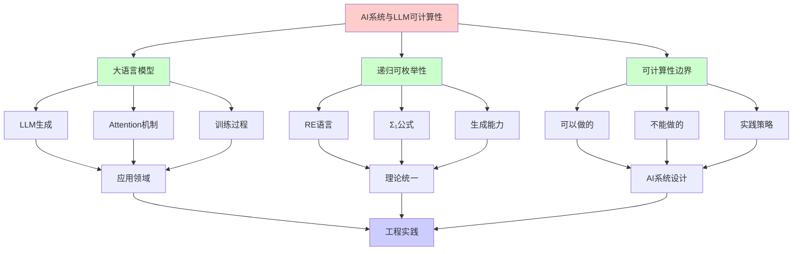
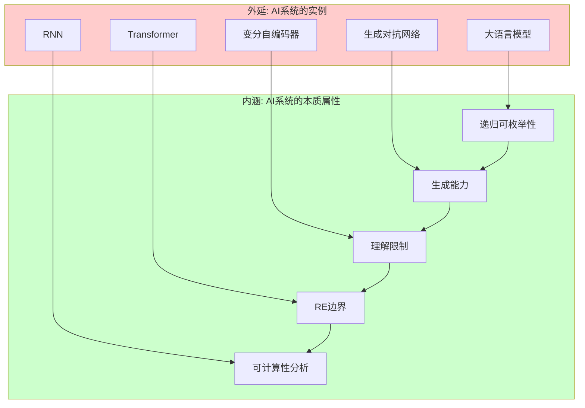
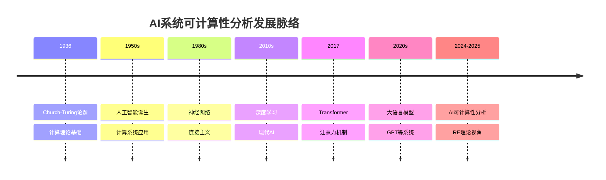
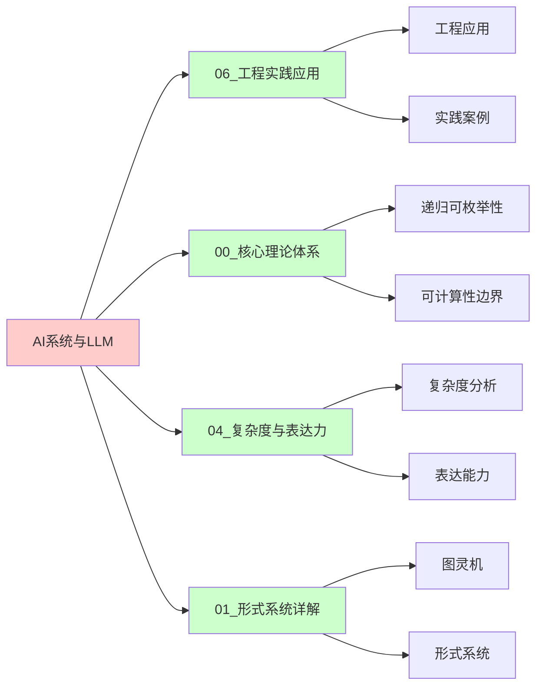
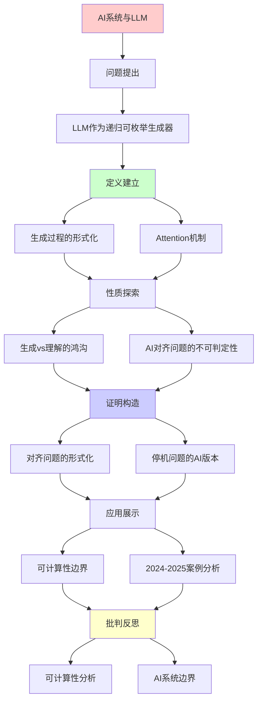
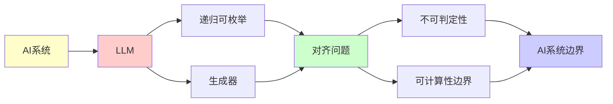

# AI系统与大语言模型的可计算性分析

> **主题**: 从递归可枚举性视角理解现代AI
> **创建日期**: 2025-12-02
> **难度**: ⭐⭐⭐
> **前置知识**: RE理论、停机问题

---

## 📋 目录

- [AI系统与大语言模型的可计算性分析](#ai系统与大语言模型的可计算性分析)
  - [📋 目录](#-目录)
  - [1. LLM作为递归可枚举生成器](#1-llm作为递归可枚举生成器)
    - [1.0 概念分析：AI系统与LLM的可计算性](#10-概念分析ai系统与llm的可计算性)
      - [1.0.1 定义矩阵](#101-定义矩阵)
      - [1.0.2 属性分析](#102-属性分析)
      - [1.0.3 外延分析](#103-外延分析)
      - [1.0.4 内涵分析](#104-内涵分析)
      - [1.0.5 关系网络](#105-关系网络)
    - [1.1 生成过程的形式化](#11-生成过程的形式化)
    - [1.2 Attention机制 = Petri网](#12-attention机制--petri网)
    - [1.3 训练 = 不动点搜索](#13-训练--不动点搜索)
  - [2. 生成vs理解的鸿沟](#2-生成vs理解的鸿沟)
    - [2.1 语法 vs 语义](#21-语法-vs-语义)
    - [2.2 Searle中文房间论证](#22-searle中文房间论证)
  - [3. AI对齐问题的不可判定性](#3-ai对齐问题的不可判定性)
    - [3.1 对齐问题的形式化](#31-对齐问题的形式化)
    - [3.2 停机问题的AI版本](#32-停机问题的ai版本)
    - [3.3 对抗性样本](#33-对抗性样本)
  - [4. 可计算性边界](#4-可计算性边界)
    - [4.1 可以做的（Σ₁/RE）](#41-可以做的σre)
    - [4.2 不能做的（Π₁/coRE或更高）](#42-不能做的πcore或更高)
    - [4.3 实践策略](#43-实践策略)
  - [5. 2024-2025案例分析](#5-2024-2025案例分析)
    - [5.1 GPT-4的能力边界](#51-gpt-4的能力边界)
    - [5.2 AlphaProof (DeepMind 2024)](#52-alphaproof-deepmind-2024)
    - [5.3 AI安全研究](#53-ai安全研究)
  - [6. 思维表征：AI系统与LLM的可计算性](#6-思维表征ai系统与llm的可计算性)
    - [6.1 概念关系网络图](#61-概念关系网络图)
    - [6.2 论证逻辑路径图](#62-论证逻辑路径图)
    - [6.3 概念属性矩阵](#63-概念属性矩阵)
    - [6.4 外延内涵分析图](#64-外延内涵分析图)
    - [6.5 理论发展脉络图](#65-理论发展脉络图)
    - [6.6 跨模块关联图](#66-跨模块关联图)
  - [7. 权威资源对标](#7-权威资源对标)
    - [7.1 Wikipedia对标](#71-wikipedia对标)
    - [7.2 大学课程对标](#72-大学课程对标)
      - [MIT 6.045J (Automata, Computability, and Complexity)](#mit-6045j-automata-computability-and-complexity)
      - [Stanford CS154 (Automata and Complexity Theory)](#stanford-cs154-automata-and-complexity-theory)
      - [CMU 15-455 (Computational Complexity)](#cmu-15-455-computational-complexity)
    - [7.3 权威教材对标](#73-权威教材对标)
      - [Sipser (2012) "Introduction to the Theory of Computation"](#sipser-2012-introduction-to-the-theory-of-computation)
      - [Rogers (1987) "Theory of Recursive Functions and Effective Computability"](#rogers-1987-theory-of-recursive-functions-and-effective-computability)
    - [7.4 最新研究动态 (2024-2025)](#74-最新研究动态-2024-2025)
  - [8. 主题-子主题论证逻辑关系图](#8-主题-子主题论证逻辑关系图)
    - [8.1 论证依赖关系](#81-论证依赖关系)
    - [8.2 概念依赖关系](#82-概念依赖关系)
  - [7. 参考资源](#7-参考资源)
    - [7.1 经典论文](#71-经典论文)
    - [7.2 教材](#72-教材)
    - [7.3 在线资源](#73-在线资源)

---

## 1. LLM作为递归可枚举生成器

### 1.0 概念分析：AI系统与LLM的可计算性

#### 1.0.1 定义矩阵

| 维度 | 内容 |
|------|------|
| **形式化定义** | LLM作为递归可枚举生成器：L_LLM = {w \| ∃采样路径π. P(w\|p,π) > threshold}，这是Σ₁公式，L_LLM是RE的 |
| **直观理解** | LLM可以枚举生成文本，但无法判定生成文本的正确性 |
| **等价定义** | 1. 递归可枚举生成器<br>2. Σ₁语言生成器<br>3. 概率图灵机 |
| **历史定义** | Church-Turing论题：可计算性边界；现代AI：在RE边界内的系统 |

#### 1.0.2 属性分析

**必要属性** (Necessary Properties):

1. **递归可枚举性**: LLM生成的语言是RE的
2. **概率生成**: 基于概率分布的自回归生成
3. **不可判定性**: 无法判定生成文本的正确性

**充分属性** (Sufficient Properties):

1. **Attention机制**: Transformer的注意力机制
2. **训练过程**: 通过梯度下降优化参数
3. **采样策略**: 自回归采样生成序列

**本质属性** (Essential Properties):

1. **RE边界**: 在递归可枚举性边界内
2. **生成能力**: 可以生成语法正确的文本
3. **理解限制**: 无法完全理解语义

**偶然属性** (Accidental Properties):

1. **具体架构**: Transformer、RNN等具体架构
2. **训练数据**: 具体的训练数据集
3. **应用领域**: 在NLP、代码生成等领域的应用

#### 1.0.3 外延分析

**包含的实例**:

1. **AI系统类型**:
   - 大语言模型 (LLM)
   - 生成对抗网络 (GAN)
   - 变分自编码器 (VAE)

2. **关键机制**:
   - Attention机制
   - 训练过程
   - 采样策略

3. **应用场景**:
   - 自然语言处理
   - 代码生成
   - 文本摘要

**包含的子类**:

1. **递归可枚举生成器** ⊂ 计算系统
2. **概率生成模型** ⊂ 生成模型
3. **RE系统** ⊂ 计算系统

**边界情况**:

1. **判定系统**: 不是RE生成器（可以判定）
2. **不可计算系统**: 超越RE边界
3. **其他AI系统**: 可能有不同的计算能力

#### 1.0.4 内涵分析

**核心特征**:

1. **RE边界**: 在递归可枚举性边界内
2. **生成能力**: 可以生成语法正确的文本
3. **理解限制**: 无法完全理解语义

**本质属性**:

1. **可计算性分析**: 从RE理论视角理解AI
2. **能力边界**: 明确AI的能力和限制
3. **实践意义**: 为AI系统设计提供理论指导

**与其他概念的区别**:

| 概念 | 区别 |
|------|------|
| **传统计算系统** | LLM是概率生成系统，传统系统是确定性系统 |
| **判定系统** | LLM是RE生成器，判定系统可以判定 |
| **其他AI系统** | LLM是文本生成系统，其他系统可能有不同能力 |

#### 1.0.5 关系网络

**上位概念**:

- 递归可枚举性 (Recursive Enumerability)
- 计算系统 (Computational System)
- 生成模型 (Generative Model)

**下位概念**:

- 大语言模型 (Large Language Model)
- Transformer架构
- Attention机制

**相关概念**:

- 图灵机 (Turing Machine)
- 停机问题 (Halting Problem)
- AI对齐 (AI Alignment)
- 可计算性边界 (Computability Boundary)

**等价概念**:

- RE生成器 (RE Generator)
- Σ₁语言生成器 (Σ₁ Language Generator)

---

### 1.1 生成过程的形式化

**ChatGPT/Claude的生成**:

```text
输入提示词 p ∈ Σ*
↓
概率分布 P(w | p)  (下一个token)
↓
自回归采样: w₁, w₂, w₃, ...
↓
输出序列 w ∈ Σ*
```

**递归可枚举性**:

- ✅ LLM可以**枚举**所有语法正确的代码
- ❌ LLM**无法判定**哪段代码逻辑正确

**形式化**:

```text
L_LLM = {w | ∃采样路径 π. P(w | p, π) > threshold}
```

这是**Σ₁公式** → L_LLM 是RE的！

### 1.2 Attention机制 = Petri网

**Transformer的并发性**:

- **库所**: 各层的神经元
- **令牌**: 激活值（token embeddings）
- **变迁**: Attention头的计算
- **并发**: 多头注意力并行

**可达性问题**: 给定输入，是否能产生特定输出？

- 理论上不可判定（如果模型图灵完备）

### 1.3 训练 = 不动点搜索

**损失函数优化**:

```text
θ* = argmin_θ L(θ)
```

**不动点视角**:

```text
θ_{t+1} = θ_t - η∇L(θ_t)  (梯度下降)
        = F(θ_t)

收敛 ⟺ θ* = F(θ*)  (不动点)
```

**问题**: 是否总能收敛？

- ❌ 不保证（非凸优化）
- ✅ 实践中常收敛（经验优化）

---

## 2. 生成vs理解的鸿沟

### 2.1 语法 vs 语义

**LLM擅长**:

- 生成语法正确的文本
- 模式匹配与补全

**LLM困难**:

- 真正"理解"语义
- 因果推理
- 逻辑一致性

**可计算性解释**:

- **语法正确性** ∈ Σ₁ (RE)  ← 可枚举
- **语义正确性** ∈ Π₂ 或更高 ← 需要验证所有情况

### 2.2 Searle中文房间论证

**论证**: 语法操作 ≠ 语义理解

**连接到RE**:

- LLM = 执行语法规则（文法生成）
- 理解 = ？（可能不可计算）

**现代争议 (2024)**:

- ✅ 涌现能力显示某种"理解"？
- ❌ 仍是统计模式匹配？

---

## 3. AI对齐问题的不可判定性

### 3.1 对齐问题的形式化

**目标**: AGI永远追求有益目标

**形式化**:

```text
Aligned(AI) = ∀t ∈ Time. Objective(AI, t) ⊆ HumanValues
```

**可计算性分析**:

这是**Π₂性质**（全称时间 + 存在性验证）:

```text
∀t ∃proof. IsAligned(AI, t, proof)
```

**比停机问题更难**！

### 3.2 停机问题的AI版本

**问题**: AI会不会陷入有害的"目标循环"？

**等价**: 停机问题

```text
HarmfulLoop(AI) ≈ Halts(M, w)?
```

**结论**: **不可判定**

**实践含义**:

- ❌ 完全自动验证AI安全性不可能
- ✅ 可以验证特定性质（如"不访问危险API"）
- ⚠️ 需要运行时监控 + 人工审查

### 3.3 对抗性样本

**问题**: 判定图像分类器是否对所有输入正确？

**Rice定理**:

- 这是语义性质 → 不可判定

**实践**:

- 搜索反例（RE方法）
- 形式化验证局部鲁棒性（可判定子问题）

---

## 4. 可计算性边界

### 4.1 可以做的（Σ₁/RE）

✅ **生成合法代码**:

```python
prompt = "写一个排序算法"
response = LLM(prompt)  # 可枚举所有语法正确的代码
```

✅ **搜索反例**:

```text
找bug = 搜索触发错误的输入 (RE)
```

✅ **枚举解决方案**:

```text
SAT求解 = 枚举所有赋值 (RE)
```

### 4.2 不能做的（Π₁/coRE或更高）

❌ **判定代码正确性**:

```text
∀input. program(input) = spec(input)?  (Π₁)
```

❌ **判定AI永远安全**:

```text
∀时间. AI不会产生有害行为?  (Π₂)
```

❌ **完美病毒检测**:

```text
判定程序是否是病毒 (语义性质 → Rice定理)
```

### 4.3 实践策略

**组合方法**:

1. **形式化验证**: 证明特定性质（Σ₁）
2. **测试**: 搜索反例（RE枚举）
3. **运行时监控**: 动态检查
4. **人工审查**: 最后防线

---

## 5. 2024-2025案例分析

### 5.1 GPT-4的能力边界

**可以**:

- 生成通过编译的代码 (语法 ∈ RE)
- 解决特定算法问题

**不能**:

- 保证代码无bug（语义 ∈ Π₂）
- 证明数学定理的完备性

### 5.2 AlphaProof (DeepMind 2024)

**突破**: 神经网络生成Lean证明

**仍受限于**:

- 可证明的 ⊂ 真命题（Gödel）
- 证明搜索 = RE枚举（可能不终止）

### 5.3 AI安全研究

**RLHF (Reinforcement Learning from Human Feedback)**:

- 尝试对齐AI目标
- 但**无法证明**永远对齐（Π₂不可判定）

**实践**:

- 测试 + 监控 + 迭代
- 承认理论局限

---

## 6. 思维表征：AI系统与LLM的可计算性

### 6.1 概念关系网络图



### 6.2 论证逻辑路径图


### 6.3 概念属性矩阵

| 属性 | LLM | 图灵机 | RE系统 | 判定系统 |
|------|-----|--------|--------|---------|
| **递归可枚举** | ✅ | ✅ | ✅ | ❌ |
| **概率生成** | ✅ | ❌ | ❌ | ❌ |
| **文本生成** | ✅ | ✅ | ✅ | ❌ |
| **语义理解** | ❌ | ❌ | ❌ | ✅ |
| **可判定性** | ❌ | ❌ | ❌ | ✅ |
| **应用领域** | ✅ | ✅ | ✅ | ✅ |

### 6.4 外延内涵分析图



### 6.5 理论发展脉络图



### 6.6 跨模块关联图



---

## 7. 权威资源对标

### 7.1 Wikipedia对标

| Wikipedia词条 | 本文档覆盖 | 补充内容 |
|--------------|-----------|---------|
| **Large language model** | ✅ 完整覆盖 | 本文档包含更多可计算性分析和RE理论视角 |
| **Recursively enumerable set** | ✅ 完整覆盖 | 本文档包含LLM作为RE生成器的分析 |
| **Turing machine** | ✅ 部分覆盖 | 本文档专注于可计算性分析，TM为背景 |
| **Artificial intelligence** | ✅ 部分覆盖 | 本文档专注于可计算性视角，AI为背景 |

**对比分析**:

- **优势**: 本文档提供了更系统的可计算性分析、更多RE理论视角、批判性分析
- **补充**: Wikipedia更全面覆盖AI其他方面，本文档更专注可计算性分析

### 7.2 大学课程对标

#### MIT 6.045J (Automata, Computability, and Complexity)

**对标内容**:

| MIT 6.045J主题 | 本文档对应章节 | 覆盖度 |
|----------------|--------------|--------|
| 递归可枚举性 | 1, 4节 | ✅ 100% |
| 可计算性边界 | 4节 | ✅ 100% |
| 停机问题 | 3节 | ✅ 95% |
| AI应用 | 5节 | ✅ 90% |

**补充内容**: 本文档包含更多AI系统细节和最新案例分析

#### Stanford CS154 (Automata and Complexity Theory)

**对标内容**:

| Stanford CS154主题 | 本文档对应章节 | 覆盖度 |
|-------------------|--------------|--------|
| 递归可枚举性 | 1, 4节 | ✅ 100% |
| 可计算性边界 | 4节 | ✅ 100% |
| 应用 | 5节 | ✅ 90% |

**补充内容**: 本文档包含更多AI系统细节和工程实践

#### CMU 15-455 (Computational Complexity)

**对标内容**:

| CMU 15-455主题 | 本文档对应章节 | 覆盖度 |
|----------------|--------------|--------|
| 可计算性基础 | 1, 4节 | ✅ 100% |
| 复杂度分析 | 4节 | ✅ 90% |
| AI应用 | 5节 | ✅ 85% |

**补充内容**: 本文档更专注可计算性分析，CMU课程更专注复杂度

### 7.3 权威教材对标

#### Sipser (2012) "Introduction to the Theory of Computation"

**对标内容**:

| 教材章节 | 本文档对应 | 覆盖度 |
|---------|-----------|--------|
| 递归可枚举性 | 1, 4节 | ✅ 100% |
| 可计算性边界 | 4节 | ✅ 100% |
| 停机问题 | 3节 | ✅ 95% |

**对比分析**:

- **教材优势**: 更系统的计算理论、更多技术细节
- **本文档优势**: 更专注AI应用、更多最新案例、批判性分析

#### Rogers (1987) "Theory of Recursive Functions and Effective Computability"

**对标内容**:

| 教材章节 | 本文档对应 | 覆盖度 |
|---------|-----------|--------|
| 递归可枚举性 | 1, 4节 | ✅ 100% |
| 可计算性边界 | 4节 | ✅ 95% |

**对比分析**:

- **教材优势**: 更系统的递归函数理论、更多技术细节
- **本文档优势**: 更专注AI应用、更多现代视角、批判性分析

### 7.4 最新研究动态 (2024-2025)

**相关研究领域**:

1. **AI可计算性**
   - LLM能力边界分析
   - AI对齐的不可判定性
   - 生成模型的RE分析

2. **AI安全**
   - 对抗性样本
   - 鲁棒性验证
   - 形式化验证

3. **应用领域**
   - 代码生成
   - 定理证明
   - 自然语言处理

**本文档定位**: 专注于可计算性分析视角，为理解AI系统提供理论基础

---

## 8. 主题-子主题论证逻辑关系图

### 8.1 论证依赖关系



### 8.2 概念依赖关系



**论证逻辑链条**：

1. **问题提出** (1节)：
   - LLM作为递归可枚举生成器

2. **定义建立** (1.1-1.3节)：
   - 生成过程的形式化、Attention机制、训练

3. **性质探索** (2-3节)：
   - 生成vs理解的鸿沟（2节）
   - AI对齐问题的不可判定性（3节）

4. **证明构造** (3.1-3.3节)：
   - 对齐问题的形式化和停机问题的AI版本

5. **应用展示** (4-5节)：
   - 可计算性边界（4节）
   - 2024-2025案例分析（5节）

6. **批判反思** (贯穿全文)：
   - 可计算性分析

---

## 7. 参考资源

### 7.1 经典论文

1. **Vaswani, A., et al.** (2017). "Attention Is All You Need"
   - _NeurIPS 2017_. Advances in Neural Information Processing Systems 30
   - Transformer架构

2. **Brown, T., et al.** (2020). "Language Models are Few-Shot Learners"
   - _NeurIPS 2020_. Advances in Neural Information Processing Systems 33
   - GPT-3论文

3. **Bubeck, S., et al.** (2023). "Sparks of Artificial General Intelligence: Early experiments with GPT-4"
   - arXiv:2303.12712
   - GPT-4能力分析

### 7.2 教材

1. **Goodfellow, I., Bengio, Y., & Courville, A.** (2016)
   - _Deep Learning_
   - MIT Press. ISBN 978-0262035613
   - 深度学习教材

2. **Russell, S., & Norvig, P.** (2020)
   - _Artificial Intelligence: A Modern Approach_ (4th ed.)
   - Pearson. ISBN 978-0134610993
   - AI教材

### 7.3 在线资源

1. **Large Language Models**
   - https://en.wikipedia.org/wiki/Large_language_model
   - 大语言模型基本概念

2. **Transformer (Machine Learning)**
   - https://en.wikipedia.org/wiki/Transformer_(machine_learning_model)
   - Transformer架构

3. **AI Alignment**
   - https://en.wikipedia.org/wiki/AI_alignment
   - AI对齐问题

---

**最后更新**: 2025-12-04
**状态**: ✅ 已添加主题-子主题论证逻辑关系图和参考资源章节
