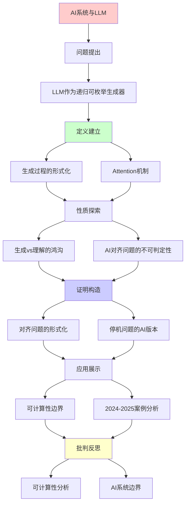
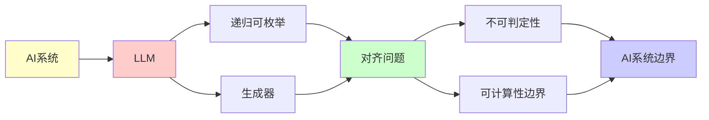

# AI系统与大语言模型的可计算性分析

> **主题**: 从递归可枚举性视角理解现代AI
> **创建日期**: 2025-12-02
> **难度**: ⭐⭐⭐
> **前置知识**: RE理论、停机问题

---

## 📋 目录

- [AI系统与大语言模型的可计算性分析](#ai系统与大语言模型的可计算性分析)
  - [📋 目录](#-目录)
  - [1. LLM作为递归可枚举生成器](#1-llm作为递归可枚举生成器)
    - [1.1 生成过程的形式化](#11-生成过程的形式化)
    - [1.2 Attention机制 = Petri网](#12-attention机制--petri网)
    - [1.3 训练 = 不动点搜索](#13-训练--不动点搜索)
  - [2. 生成vs理解的鸿沟](#2-生成vs理解的鸿沟)
    - [2.1 语法 vs 语义](#21-语法-vs-语义)
    - [2.2 Searle中文房间论证](#22-searle中文房间论证)
  - [3. AI对齐问题的不可判定性](#3-ai对齐问题的不可判定性)
    - [3.1 对齐问题的形式化](#31-对齐问题的形式化)
    - [3.2 停机问题的AI版本](#32-停机问题的ai版本)
    - [3.3 对抗性样本](#33-对抗性样本)
  - [4. 可计算性边界](#4-可计算性边界)
    - [4.1 可以做的（Σ₁/RE）](#41-可以做的σre)
    - [4.2 不能做的（Π₁/coRE或更高）](#42-不能做的πcore或更高)
    - [4.3 实践策略](#43-实践策略)
  - [5. 2024-2025案例分析](#5-2024-2025案例分析)
    - [5.1 GPT-4的能力边界](#51-gpt-4的能力边界)
    - [5.2 AlphaProof (DeepMind 2024)](#52-alphaproof-deepmind-2024)
    - [5.3 AI安全研究](#53-ai安全研究)
  - [6. 主题-子主题论证逻辑关系图](#6-主题-子主题论证逻辑关系图)
    - [6.1 论证依赖关系](#61-论证依赖关系)
    - [6.2 概念依赖关系](#62-概念依赖关系)
  - [7. 参考资源](#7-参考资源)
    - [7.1 经典论文](#71-经典论文)
    - [7.2 教材](#72-教材)
    - [7.3 在线资源](#73-在线资源)

---

## 1. LLM作为递归可枚举生成器

### 1.1 生成过程的形式化

**ChatGPT/Claude的生成**:

```text
输入提示词 p ∈ Σ*
↓
概率分布 P(w | p)  (下一个token)
↓
自回归采样: w₁, w₂, w₃, ...
↓
输出序列 w ∈ Σ*
```

**递归可枚举性**:

- ✅ LLM可以**枚举**所有语法正确的代码
- ❌ LLM**无法判定**哪段代码逻辑正确

**形式化**:

```text
L_LLM = {w | ∃采样路径 π. P(w | p, π) > threshold}
```

这是**Σ₁公式** → L_LLM 是RE的！

### 1.2 Attention机制 = Petri网

**Transformer的并发性**:

- **库所**: 各层的神经元
- **令牌**: 激活值（token embeddings）
- **变迁**: Attention头的计算
- **并发**: 多头注意力并行

**可达性问题**: 给定输入，是否能产生特定输出？

- 理论上不可判定（如果模型图灵完备）

### 1.3 训练 = 不动点搜索

**损失函数优化**:

```text
θ* = argmin_θ L(θ)
```

**不动点视角**:

```text
θ_{t+1} = θ_t - η∇L(θ_t)  (梯度下降)
        = F(θ_t)

收敛 ⟺ θ* = F(θ*)  (不动点)
```

**问题**: 是否总能收敛？

- ❌ 不保证（非凸优化）
- ✅ 实践中常收敛（经验优化）

---

## 2. 生成vs理解的鸿沟

### 2.1 语法 vs 语义

**LLM擅长**:

- 生成语法正确的文本
- 模式匹配与补全

**LLM困难**:

- 真正"理解"语义
- 因果推理
- 逻辑一致性

**可计算性解释**:

- **语法正确性** ∈ Σ₁ (RE)  ← 可枚举
- **语义正确性** ∈ Π₂ 或更高 ← 需要验证所有情况

### 2.2 Searle中文房间论证

**论证**: 语法操作 ≠ 语义理解

**连接到RE**:

- LLM = 执行语法规则（文法生成）
- 理解 = ？（可能不可计算）

**现代争议 (2024)**:

- ✅ 涌现能力显示某种"理解"？
- ❌ 仍是统计模式匹配？

---

## 3. AI对齐问题的不可判定性

### 3.1 对齐问题的形式化

**目标**: AGI永远追求有益目标

**形式化**:

```text
Aligned(AI) = ∀t ∈ Time. Objective(AI, t) ⊆ HumanValues
```

**可计算性分析**:

这是**Π₂性质**（全称时间 + 存在性验证）:

```text
∀t ∃proof. IsAligned(AI, t, proof)
```

**比停机问题更难**！

### 3.2 停机问题的AI版本

**问题**: AI会不会陷入有害的"目标循环"？

**等价**: 停机问题

```text
HarmfulLoop(AI) ≈ Halts(M, w)?
```

**结论**: **不可判定**

**实践含义**:

- ❌ 完全自动验证AI安全性不可能
- ✅ 可以验证特定性质（如"不访问危险API"）
- ⚠️ 需要运行时监控 + 人工审查

### 3.3 对抗性样本

**问题**: 判定图像分类器是否对所有输入正确？

**Rice定理**:

- 这是语义性质 → 不可判定

**实践**:

- 搜索反例（RE方法）
- 形式化验证局部鲁棒性（可判定子问题）

---

## 4. 可计算性边界

### 4.1 可以做的（Σ₁/RE）

✅ **生成合法代码**:

```python
prompt = "写一个排序算法"
response = LLM(prompt)  # 可枚举所有语法正确的代码
```

✅ **搜索反例**:

```text
找bug = 搜索触发错误的输入 (RE)
```

✅ **枚举解决方案**:

```text
SAT求解 = 枚举所有赋值 (RE)
```

### 4.2 不能做的（Π₁/coRE或更高）

❌ **判定代码正确性**:

```text
∀input. program(input) = spec(input)?  (Π₁)
```

❌ **判定AI永远安全**:

```text
∀时间. AI不会产生有害行为?  (Π₂)
```

❌ **完美病毒检测**:

```text
判定程序是否是病毒 (语义性质 → Rice定理)
```

### 4.3 实践策略

**组合方法**:

1. **形式化验证**: 证明特定性质（Σ₁）
2. **测试**: 搜索反例（RE枚举）
3. **运行时监控**: 动态检查
4. **人工审查**: 最后防线

---

## 5. 2024-2025案例分析

### 5.1 GPT-4的能力边界

**可以**:

- 生成通过编译的代码 (语法 ∈ RE)
- 解决特定算法问题

**不能**:

- 保证代码无bug（语义 ∈ Π₂）
- 证明数学定理的完备性

### 5.2 AlphaProof (DeepMind 2024)

**突破**: 神经网络生成Lean证明

**仍受限于**:

- 可证明的 ⊂ 真命题（Gödel）
- 证明搜索 = RE枚举（可能不终止）

### 5.3 AI安全研究

**RLHF (Reinforcement Learning from Human Feedback)**:

- 尝试对齐AI目标
- 但**无法证明**永远对齐（Π₂不可判定）

**实践**:

- 测试 + 监控 + 迭代
- 承认理论局限

---

## 6. 主题-子主题论证逻辑关系图

### 6.1 论证依赖关系



### 6.2 概念依赖关系



**论证逻辑链条**：

1. **问题提出** (1节)：
   - LLM作为递归可枚举生成器

2. **定义建立** (1.1-1.3节)：
   - 生成过程的形式化、Attention机制、训练

3. **性质探索** (2-3节)：
   - 生成vs理解的鸿沟（2节）
   - AI对齐问题的不可判定性（3节）

4. **证明构造** (3.1-3.3节)：
   - 对齐问题的形式化和停机问题的AI版本

5. **应用展示** (4-5节)：
   - 可计算性边界（4节）
   - 2024-2025案例分析（5节）

6. **批判反思** (贯穿全文)：
   - 可计算性分析

---

## 7. 参考资源

### 7.1 经典论文

1. **Vaswani, A., et al.** (2017). "Attention Is All You Need"
   - _NeurIPS 2017_. Advances in Neural Information Processing Systems 30
   - Transformer架构

2. **Brown, T., et al.** (2020). "Language Models are Few-Shot Learners"
   - _NeurIPS 2020_. Advances in Neural Information Processing Systems 33
   - GPT-3论文

3. **Bubeck, S., et al.** (2023). "Sparks of Artificial General Intelligence: Early experiments with GPT-4"
   - arXiv:2303.12712
   - GPT-4能力分析

### 7.2 教材

1. **Goodfellow, I., Bengio, Y., & Courville, A.** (2016)
   - _Deep Learning_
   - MIT Press. ISBN 978-0262035613
   - 深度学习教材

2. **Russell, S., & Norvig, P.** (2020)
   - _Artificial Intelligence: A Modern Approach_ (4th ed.)
   - Pearson. ISBN 978-0134610993
   - AI教材

### 7.3 在线资源

1. **Large Language Models**
   - https://en.wikipedia.org/wiki/Large_language_model
   - 大语言模型基本概念

2. **Transformer (Machine Learning)**
   - https://en.wikipedia.org/wiki/Transformer_(machine_learning_model)
   - Transformer架构

3. **AI Alignment**
   - https://en.wikipedia.org/wiki/AI_alignment
   - AI对齐问题

---

**最后更新**: 2025-12-04
**状态**: ✅ 已添加主题-子主题论证逻辑关系图和参考资源章节
