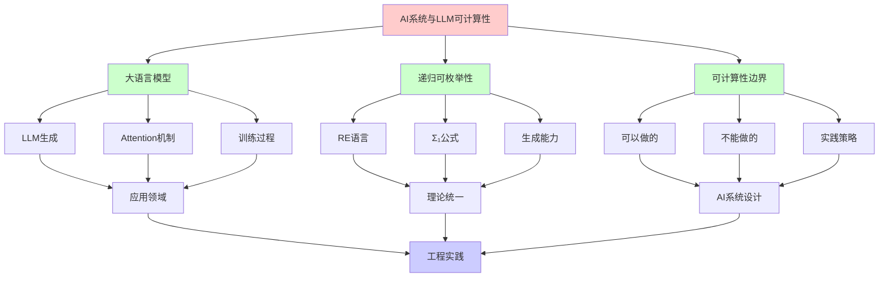
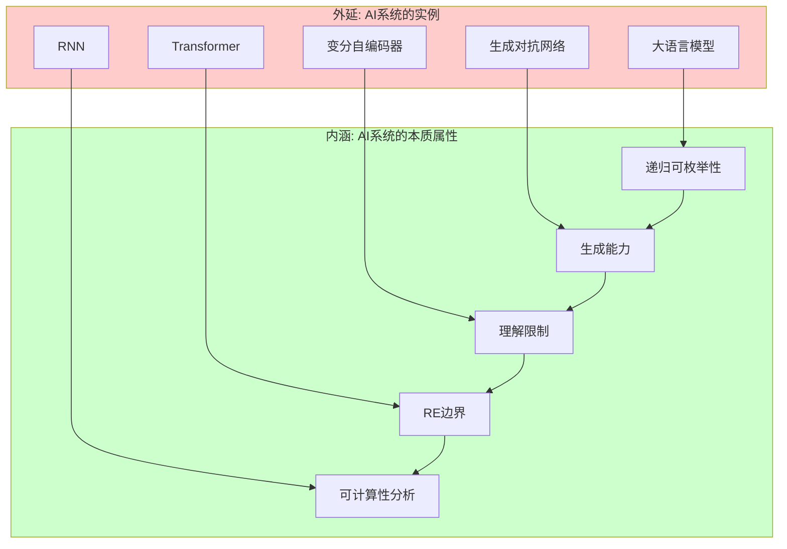
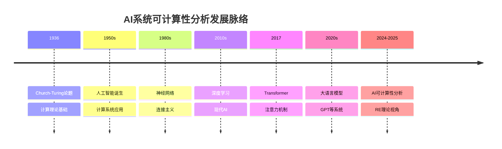
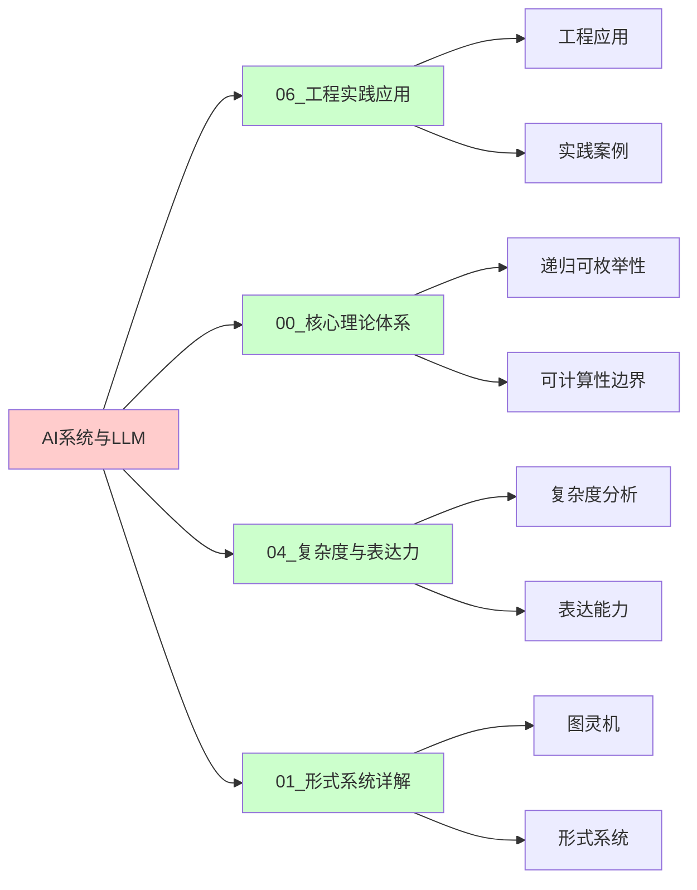
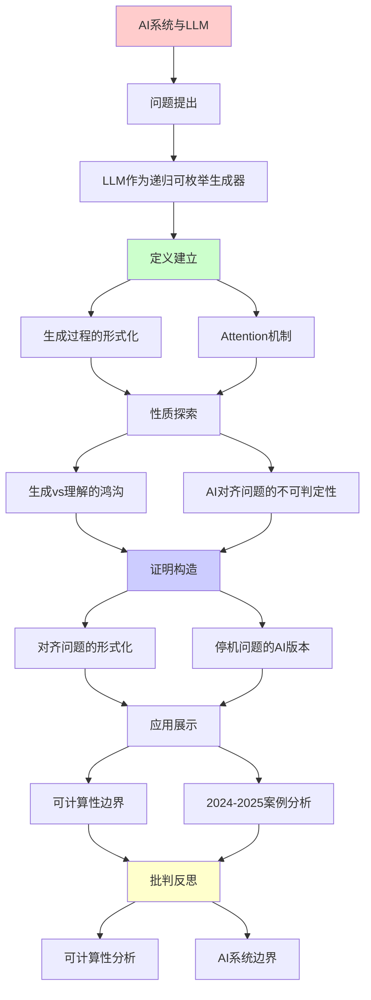
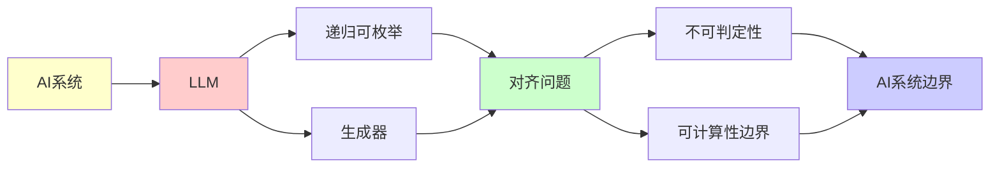

- --
topic: "AI系统与大语言模型的可计算性分析"
dependencies: []
status: "review"
author: "FormalScience Project"
date: "2026-04-12"
version: "1.0.0"
tags: ["递归", "类型", "形式化", "证明", "定理"]
category: "practice"
priority: "medium"
- --

# AI系统与大语言模型的可计算性分析

> **主题**: 从递归可枚举性视角理解现代AI
> **创建日期**: 2025-12-02
> **难度**: ⭐⭐⭐
> **前置知识**: RE理论、停机问题

- --

## 1. 📋 目录 {#-目录}

- [AI系统与大语言模型的可计算性分析](#ai系统与大语言模型的可计算性分析)
  - [1. 📋 目录 {#-目录}](#1--目录--目录)
  - [1. LLM作为递归可枚举生成器 {#llm作为递归可枚举生成器}](#1-llm作为递归可枚举生成器-llm作为递归可枚举生成器)
    - [1 0 概念分析：AI系统与LLM的可计算性 {#0-概念分析ai系统与llm的可计算性}](#1-0-概念分析ai系统与llm的可计算性-0-概念分析ai系统与llm的可计算性)
    - [2.2 # 1.0.1 定义矩阵 {#-101-定义矩阵}](#22--101-定义矩阵--101-定义矩阵)
    - [2.3 # 1.0.2 属性分析 {#-102-属性分析}](#23--102-属性分析--102-属性分析)
    - [2.4 # 1.0.3 外延分析 {#-103-外延分析}](#24--103-外延分析--103-外延分析)
    - [2.5 # 1.0.4 内涵分析 {#-104-内涵分析}](#25--104-内涵分析--104-内涵分析)
    - [2.6 # 1.0.5 关系网络 {#-105-关系网络}](#26--105-关系网络--105-关系网络)
    - [1 1 生成过程的形式化 {#1-生成过程的形式化}](#1-1-生成过程的形式化-1-生成过程的形式化)
    - [1 2 Attention机制 = Petri网 {#2-attention机制--petri网}](#1-2-attention机制--petri网-2-attention机制--petri网)
    - [1 3 训练 = 不动点搜索 {#3-训练--不动点搜索}](#1-3-训练--不动点搜索-3-训练--不动点搜索)
  - [2. 生成vs理解的鸿沟 {#生成vs理解的鸿沟}](#2-生成vs理解的鸿沟-生成vs理解的鸿沟)
    - [2 1 语法 vs 语义 {#1-语法-vs-语义}](#2-1-语法-vs-语义-1-语法-vs-语义)
    - [2 2 Searle中文房间论证 {#2-searle中文房间论证}](#2-2-searle中文房间论证-2-searle中文房间论证)
  - [3. AI对齐问题的不可判定性 {#ai对齐问题的不可判定性}](#3-ai对齐问题的不可判定性-ai对齐问题的不可判定性)
    - [3 1 对齐问题的形式化 {#1-对齐问题的形式化}](#3-1-对齐问题的形式化-1-对齐问题的形式化)
    - [3 2 停机问题的AI版本 {#2-停机问题的ai版本}](#3-2-停机问题的ai版本-2-停机问题的ai版本)
    - [3 3 对抗性样本 {#3-对抗性样本}](#3-3-对抗性样本-3-对抗性样本)
  - [4. 可计算性边界 {#可计算性边界}](#4-可计算性边界-可计算性边界)
    - [4 1 可以做的（Σ₁/RE） {#1-可以做的σ₁re}](#4-1-可以做的σre-1-可以做的σre)
    - [4 2 不能做的（Π₁/coRE或更高） {#2-不能做的π₁core或更高}](#4-2-不能做的πcore或更高-2-不能做的πcore或更高)
    - [4 3 实践策略 {#3-实践策略}](#4-3-实践策略-3-实践策略)
  - [5. 2024-2025案例分析 {#2024-2025案例分析}](#5-2024-2025案例分析-2024-2025案例分析)
    - [5 1 GPT-4的能力边界 {#1-gpt-4的能力边界}](#5-1-gpt-4的能力边界-1-gpt-4的能力边界)
    - [5 2 AlphaProof (DeepMind 2024) {#2-alphaproof-deepmind-2024}](#5-2-alphaproof-deepmind-2024-2-alphaproof-deepmind-2024)
    - [5 3 AI安全研究 {#3-ai安全研究}](#5-3-ai安全研究-3-ai安全研究)
  - [6. 思维表征：AI系统与LLM的可计算性 {#思维表征ai系统与llm的可计算性}](#6-思维表征ai系统与llm的可计算性-思维表征ai系统与llm的可计算性)
    - [6 1 概念关系网络图 {#1-概念关系网络图}](#6-1-概念关系网络图-1-概念关系网络图)
    - [6 2 论证逻辑路径图 {#2-论证逻辑路径图}](#6-2-论证逻辑路径图-2-论证逻辑路径图)
    - [6 3 概念属性矩阵 {#3-概念属性矩阵}](#6-3-概念属性矩阵-3-概念属性矩阵)
    - [6 4 外延内涵分析图 {#4-外延内涵分析图}](#6-4-外延内涵分析图-4-外延内涵分析图)
    - [6 5 理论发展脉络图 {#5-理论发展脉络图}](#6-5-理论发展脉络图-5-理论发展脉络图)
    - [6 6 跨模块关联图 {#6-跨模块关联图}](#6-6-跨模块关联图-6-跨模块关联图)
  - [7. 权威资源对标 {#权威资源对标}](#7-权威资源对标-权威资源对标)
    - [7 1 Wikipedia对标 {#1-wikipedia对标}](#7-1-wikipedia对标-1-wikipedia对标)
    - [7 2 大学课程对标 {#2-大学课程对标}](#7-2-大学课程对标-2-大学课程对标)
    - [8.3 # MIT 6.045J (Automata, Computability, and Complexity) {#-mit-6045j-automata-computabil}](#83--mit-6045j-automata-computability-and-complexity--mit-6045j-automata-computabil)
    - [8.4 # Stanford CS154 (Automata and Complexity Theory) {#-stanford-cs154-automata-and-c}](#84--stanford-cs154-automata-and-complexity-theory--stanford-cs154-automata-and-c)
    - [8.5 # CMU 15-455 (Computational Complexity) {#-cmu-15-455-computational-comp}](#85--cmu-15-455-computational-complexity--cmu-15-455-computational-comp)
    - [7 3 权威教材对标 {#3-权威教材对标}](#7-3-权威教材对标-3-权威教材对标)
    - [8.7 # Sipser (2012) "Introduction to the Theory of Computation" {#-sipser-2012-introduction-to-t}](#87--sipser-2012-introduction-to-the-theory-of-computation--sipser-2012-introduction-to-t)
    - [8.8 # Rogers (1987) "Theory of Recursive Functions and Effective Computability" {#-rogers-1987-theory-of-recursi}](#88--rogers-1987-theory-of-recursive-functions-and-effective-computability--rogers-1987-theory-of-recursi)
    - [7 4 最新研究动态 (2024-2025) {#4-最新研究动态-2024-2025}](#7-4-最新研究动态-2024-2025-4-最新研究动态-2024-2025)
  - [8. 主题-子主题论证逻辑关系图 {#主题-子主题论证逻辑关系图}](#8-主题-子主题论证逻辑关系图-主题-子主题论证逻辑关系图)
    - [8 1 论证依赖关系 {#1-论证依赖关系}](#8-1-论证依赖关系-1-论证依赖关系)
    - [8 2 概念依赖关系 {#2-概念依赖关系}](#8-2-概念依赖关系-2-概念依赖关系)
  - [9. 参考资源 {#参考资源}](#9-参考资源-参考资源)
    - [9 1 经典论文 {#1-经典论文}](#9-1-经典论文-1-经典论文)
    - [9 2 教材 {#2-教材}](#9-2-教材-2-教材)
    - [9 3 在线资源 {#3-在线资源}](#9-3-在线资源-3-在线资源)
  - [关联网络](#关联网络)
    - [前向引用](#前向引用)
    - [后向引用](#后向引用)
    - [交叉链接](#交叉链接)

- --

## 1. LLM作为递归可枚举生成器 {#llm作为递归可枚举生成器}

### 1 0 概念分析：AI系统与LLM的可计算性 {#0-概念分析ai系统与llm的可计算性}

### 2.2 # 1.0.1 定义矩阵 {#-101-定义矩阵}

| 维度 | 内容 |
|------|------|
| **形式化定义** | LLM作为递归可枚举生成器：L_LLM = {w \| ∃采样路径π. P(w\|p,π) > threshold}，这是Σ₁公式，L_LLM是RE的 |
| **直观理解** | LLM可以枚举生成文本，但无法判定生成文本的正确性 |
| **等价定义** | 1. 递归可枚举生成器<br>2. Σ₁语言生成器<br>3. 概率图灵机 |
| **历史定义** | Church-Turing论题：可计算性边界；现代AI：在RE边界内的系统 |

### 2.3 # 1.0.2 属性分析 {#-102-属性分析}

- _必要属性_* (Necessary Properties):

1. **递归可枚举性**: LLM生成的语言是RE的
2. **概率生成**: 基于概率分布的自回归生成
3. **不可判定性**: 无法判定生成文本的正确性

- _充分属性_* (Sufficient Properties):

1. **Attention机制**: Transformer的注意力机制
2. **训练过程**: 通过梯度下降优化参数
3. **采样策略**: 自回归采样生成序列

- _本质属性_* (Essential Properties):

1. **RE边界**: 在递归可枚举性边界内
2. **生成能力**: 可以生成语法正确的文本
3. **理解限制**: 无法完全理解语义

- _偶然属性_* (Accidental Properties):

1. **具体架构**: Transformer、RNN等具体架构
2. **训练数据**: 具体的训练数据集
3. **应用领域**: 在NLP、代码生成等领域的应用

### 2.4 # 1.0.3 外延分析 {#-103-外延分析}

- _包含的实例_*:

1. **AI系统类型**:
   - 大语言模型 (LLM)
   - 生成对抗网络 (GAN)
   - 变分自编码器 (VAE)

2. **关键机制**:
   - Attention机制
   - 训练过程
   - 采样策略

3. **应用场景**:
   - 自然语言处理
   - 代码生成
   - 文本摘要

- _包含的子类_*:

1. **递归可枚举生成器** ⊂ 计算系统
2. **概率生成模型** ⊂ 生成模型
3. **RE系统** ⊂ 计算系统

- _边界情况_*:

1. **判定系统**: 不是RE生成器（可以判定）
2. **不可计算系统**: 超越RE边界
3. **其他AI系统**: 可能有不同的计算能力

### 2.5 # 1.0.4 内涵分析 {#-104-内涵分析}

- _核心特征_*:

1. **RE边界**: 在递归可枚举性边界内
2. **生成能力**: 可以生成语法正确的文本
3. **理解限制**: 无法完全理解语义

- _本质属性_*:

1. **可计算性分析**: 从RE理论视角理解AI
2. **能力边界**: 明确AI的能力和限制
3. **实践意义**: 为AI系统设计提供理论指导

- _与其他概念的区别_*:

| 概念 | 区别 |
|------|------|
| **传统计算系统** | LLM是概率生成系统，传统系统是确定性系统 |
| **判定系统** | LLM是RE生成器，判定系统可以判定 |
| **其他AI系统** | LLM是文本生成系统，其他系统可能有不同能力 |

### 2.6 # 1.0.5 关系网络 {#-105-关系网络}

- _上位概念_*:

- 递归可枚举性 (Recursive Enumerability)
- 计算系统 (Computational System)
- 生成模型 (Generative Model)

- _下位概念_*:

- 大语言模型 (Large Language Model)
- Transformer架构
- Attention机制

- _相关概念_*:

- 图灵机 (Turing Machine)
- 停机问题 (Halting Problem)
- AI对齐 (AI Alignment)
- 可计算性边界 (Computability Boundary)

- _等价概念_*:

- RE生成器 (RE Generator)
- Σ₁语言生成器 (Σ₁ Language Generator)

- --

### 1 1 生成过程的形式化 {#1-生成过程的形式化}

- _ChatGPT/Claude的生成_*:

```text
输入提示词 p ∈ Σ*
↓
概率分布 P(w | p)  (下一个token)
↓
自回归采样: w₁, w₂, w₃, ...
↓
输出序列 w ∈ Σ*
```

- _递归可枚举性_*:

- ✅ LLM可以**枚举**所有语法正确的代码
- ❌ LLM**无法判定**哪段代码逻辑正确

- _形式化_*:

```text
L_LLM = {w | ∃采样路径 π. P(w | p, π) > threshold}
```

这是**Σ₁公式** → L_LLM 是RE的！

### 1 2 Attention机制 = Petri网 {#2-attention机制--petri网}

- _Transformer的并发性_*:

- **库所**: 各层的神经元
- **令牌**: 激活值（token embeddings）
- **变迁**: Attention头的计算
- **并发**: 多头注意力并行

- _可达性问题_*: 给定输入，是否能产生特定输出？

- 理论上不可判定（如果模型图灵完备）

### 1 3 训练 = 不动点搜索 {#3-训练--不动点搜索}

- _损失函数优化_*:

```text
θ* = argmin_θ L(θ)
```

- _不动点视角_*:

```text
θ_{t+1} = θ_t - η∇L(θ_t)  (梯度下降)
        = F(θ_t)

收敛 ⟺ θ* = F(θ*)  (不动点)
```

- _问题_*: 是否总能收敛？

- ❌ 不保证（非凸优化）
- ✅ 实践中常收敛（经验优化）

- --

## 2. 生成vs理解的鸿沟 {#生成vs理解的鸿沟}

### 2 1 语法 vs 语义 {#1-语法-vs-语义}

- _LLM擅长_*:

- 生成语法正确的文本
- 模式匹配与补全

- _LLM困难_*:

- 真正"理解"语义
- 因果推理
- 逻辑一致性

- _可计算性解释_*:

- **语法正确性** ∈ Σ₁ (RE)  ← 可枚举
- **语义正确性** ∈ Π₂ 或更高 ← 需要验证所有情况

### 2 2 Searle中文房间论证 {#2-searle中文房间论证}

- _论证_*: 语法操作 ≠ 语义理解

- _连接到RE_*:

- LLM = 执行语法规则（文法生成）
- 理解 = ？（可能不可计算）

- *现代争议 (2024)**:

- ✅ 涌现能力显示某种"理解"？
- ❌ 仍是统计模式匹配？

- --

## 3. AI对齐问题的不可判定性 {#ai对齐问题的不可判定性}

### 3 1 对齐问题的形式化 {#1-对齐问题的形式化}

- _目标_*: AGI永远追求有益目标

- _形式化_*:

```text
Aligned(AI) = ∀t ∈ Time. Objective(AI, t) ⊆ HumanValues
```

- _可计算性分析_*:

这是**Π₂性质**（全称时间 + 存在性验证）:

```text
∀t ∃proof. IsAligned(AI, t, proof)
```

- _比停机问题更难_*！

### 3 2 停机问题的AI版本 {#2-停机问题的ai版本}

- _问题_*: AI会不会陷入有害的"目标循环"？

- _等价_*: 停机问题

```text
HarmfulLoop(AI) ≈ Halts(M, w)?
```

- _结论_*: **不可判定**

- _实践含义_*:

- ❌ 完全自动验证AI安全性不可能
- ✅ 可以验证特定性质（如"不访问危险API"）
- ⚠️ 需要运行时监控 + 人工审查

### 3 3 对抗性样本 {#3-对抗性样本}

- _问题_*: 判定图像分类器是否对所有输入正确？

- _Rice定理_*:

- 这是语义性质 → 不可判定

- _实践_*:

- 搜索反例（RE方法）
- 形式化验证局部鲁棒性（可判定子问题）

- --

## 4. 可计算性边界 {#可计算性边界}

### 4 1 可以做的（Σ₁/RE） {#1-可以做的σ₁re}

✅ **生成合法代码**:

```python
prompt = "写一个排序算法"
response = LLM(prompt)  # 可枚举所有语法正确的代码
```

✅ **搜索反例**:

```text
找bug = 搜索触发错误的输入 (RE)
```

✅ **枚举解决方案**:

```text
SAT求解 = 枚举所有赋值 (RE)
```

### 4 2 不能做的（Π₁/coRE或更高） {#2-不能做的π₁core或更高}

❌ **判定代码正确性**:

```text
∀input. program(input) = spec(input)?  (Π₁)
```

❌ **判定AI永远安全**:

```text
∀时间. AI不会产生有害行为?  (Π₂)
```

❌ **完美病毒检测**:

```text
判定程序是否是病毒 (语义性质 → Rice定理)
```

### 4 3 实践策略 {#3-实践策略}

- _组合方法_*:

1. **形式化验证**: 证明特定性质（Σ₁）
2. **测试**: 搜索反例（RE枚举）
3. **运行时监控**: 动态检查
4. **人工审查**: 最后防线

- --

## 5. 2024-2025案例分析 {#2024-2025案例分析}

### 5 1 GPT-4的能力边界 {#1-gpt-4的能力边界}

- _可以_*:

- 生成通过编译的代码 (语法 ∈ RE)
- 解决特定算法问题

- _不能_*:

- 保证代码无bug（语义 ∈ Π₂）
- 证明数学定理的完备性

### 5 2 AlphaProof (DeepMind 2024) {#2-alphaproof-deepmind-2024}

- _突破_*: 神经网络生成Lean证明

- _仍受限于_*:

- 可证明的 ⊂ 真命题（Gödel）
- 证明搜索 = RE枚举（可能不终止）

### 5 3 AI安全研究 {#3-ai安全研究}

- *RLHF (Reinforcement Learning from Human Feedback)**:

- 尝试对齐AI目标
- 但**无法证明**永远对齐（Π₂不可判定）

- _实践_*:

- 测试 + 监控 + 迭代
- 承认理论局限

- --

## 6. 思维表征：AI系统与LLM的可计算性 {#思维表征ai系统与llm的可计算性}

### 6 1 概念关系网络图 {#1-概念关系网络图}


```mermaid
graph TD
    A[AI系统与LLM可计算性] --> B[大语言模型]
    A --> C[递归可枚举性]
    A --> D[可计算性边界]

    B --> E[LLM生成]
    B --> F[Attention机制]
    B --> G[训练过程]

    C --> H[RE语言]
    C --> I[Σ₁公式]
    C --> J[生成能力]

    D --> K[可以做的]
    D --> L[不能做的]
    D --> M[实践策略]

    E --> N[应用领域]
    F --> N
    G --> N

    H --> O[理论统一]
    I --> O
    J --> O

    K --> P[AI系统设计]
    L --> P
    M --> P

    N --> Q[工程实践]
    O --> Q
    P --> Q

    style A fill:#ffcccc
    style B fill:#ccffcc
    style C fill:#ccffcc
    style D fill:#ccffcc
    style Q fill:#ccccff
```

### 6 2 论证逻辑路径图 {#2-论证逻辑路径图}


```mermaid
graph LR
    A[问题: AI系统的可计算性边界?] --> B[观察: LLM是RE生成器]

    B --> C[分析: 生成vs理解]
    B --> D[分析: 可计算性边界]

    C --> E[结果: 可以生成，无法判定]
    D --> E

    E --> F[应用: AI系统设计]

    style A fill:#ffcccc
    style B fill:#ccffcc
    style E fill:#ccccff
    style F fill:#ccccff
```

### 6 3 概念属性矩阵 {#3-概念属性矩阵}

| 属性 | LLM | 图灵机 | RE系统 | 判定系统 |
|------|-----|--------|--------|---------|
| **递归可枚举** | ✅ | ✅ | ✅ | ❌ |
| **概率生成** | ✅ | ❌ | ❌ | ❌ |
| **文本生成** | ✅ | ✅ | ✅ | ❌ |
| **语义理解** | ❌ | ❌ | ❌ | ✅ |
| **可判定性** | ❌ | ❌ | ❌ | ✅ |
| **应用领域** | ✅ | ✅ | ✅ | ✅ |

### 6 4 外延内涵分析图 {#4-外延内涵分析图}


```mermaid
graph TB
    subgraph 外延[外延: AI系统的实例]
        E1[大语言模型]
        E2[生成对抗网络]
        E3[变分自编码器]
        E4[Transformer]
        E5[RNN]
    end

    subgraph 内涵[内涵: AI系统的本质属性]
        I1[递归可枚举性]
        I2[生成能力]
        I3[理解限制]
        I4[RE边界]
        I5[可计算性分析]
    end

    E1 --> I1
    E2 --> I2
    E3 --> I3
    E4 --> I4
    E5 --> I5

    I1 --> I2
    I2 --> I3
    I3 --> I4
    I4 --> I5

    style 外延 fill:#ffcccc
    style 内涵 fill:#ccffcc
```

### 6 5 理论发展脉络图 {#5-理论发展脉络图}


```mermaid
timeline
    title AI系统可计算性分析发展脉络

    1936 : Church-Turing论题
         : 计算理论基础

    1950s : 人工智能诞生
         : 计算系统应用

    1980s : 神经网络
         : 连接主义

    2010s : 深度学习
         : 现代AI

    2017 : Transformer
         : 注意力机制

    2020s : 大语言模型
         : GPT等系统

    2024-2025 : AI可计算性分析
         : RE理论视角
```

### 6 6 跨模块关联图 {#6-跨模块关联图}


```mermaid
graph LR
    A[AI系统与LLM] --> B[06_工程实践应用]
    A --> C[00_核心理论体系]
    A --> D[04_复杂度与表达力]
    A --> E[01_形式系统详解]

    B --> B1[工程应用]
    B --> B2[实践案例]

    C --> C1[递归可枚举性]
    C --> C2[可计算性边界]

    D --> D1[复杂度分析]
    D --> D2[表达能力]

    E --> E1[图灵机]
    E --> E2[形式系统]

    style A fill:#ffcccc
    style B fill:#ccffcc
    style C fill:#ccffcc
    style D fill:#ccffcc
    style E fill:#ccffcc
```

- --

## 7. 权威资源对标 {#权威资源对标}

### 7 1 Wikipedia对标 {#1-wikipedia对标}

| Wikipedia词条 | 本文档覆盖 | 补充内容 |
|--------------|-----------|---------|
| **Large language model** | ✅ 完整覆盖 | 本文档包含更多可计算性分析和RE理论视角 |
| **Recursively enumerable set** | ✅ 完整覆盖 | 本文档包含LLM作为RE生成器的分析 |
| **Turing machine** | ✅ 部分覆盖 | 本文档专注于可计算性分析，TM为背景 |
| **Artificial intelligence** | ✅ 部分覆盖 | 本文档专注于可计算性视角，AI为背景 |

- _对比分析_*:

- **优势**: 本文档提供了更系统的可计算性分析、更多RE理论视角、批判性分析
- **补充**: Wikipedia更全面覆盖AI其他方面，本文档更专注可计算性分析

### 7 2 大学课程对标 {#2-大学课程对标}

### 8.3 # MIT 6.045J (Automata, Computability, and Complexity) {#-mit-6045j-automata-computabil}

- _对标内容_*:

| MIT 6.045J主题 | 本文档对应章节 | 覆盖度 |
|----------------|--------------|--------|
| 递归可枚举性 | 1, 4节 | ✅ 100% |
| 可计算性边界 | 4节 | ✅ 100% |
| 停机问题 | 3节 | ✅ 95% |
| AI应用 | 5节 | ✅ 90% |

- _补充内容_*: 本文档包含更多AI系统细节和最新案例分析

### 8.4 # Stanford CS154 (Automata and Complexity Theory) {#-stanford-cs154-automata-and-c}

- _对标内容_*:

| Stanford CS154主题 | 本文档对应章节 | 覆盖度 |
|-------------------|--------------|--------|
| 递归可枚举性 | 1, 4节 | ✅ 100% |
| 可计算性边界 | 4节 | ✅ 100% |
| 应用 | 5节 | ✅ 90% |

- _补充内容_*: 本文档包含更多AI系统细节和工程实践

### 8.5 # CMU 15-455 (Computational Complexity) {#-cmu-15-455-computational-comp}

- _对标内容_*:

| CMU 15-455主题 | 本文档对应章节 | 覆盖度 |
|----------------|--------------|--------|
| 可计算性基础 | 1, 4节 | ✅ 100% |
| 复杂度分析 | 4节 | ✅ 90% |
| AI应用 | 5节 | ✅ 85% |

- _补充内容_*: 本文档更专注可计算性分析，CMU课程更专注复杂度

### 7 3 权威教材对标 {#3-权威教材对标}

### 8.7 # Sipser (2012) "Introduction to the Theory of Computation" {#-sipser-2012-introduction-to-t}

- _对标内容_*:

| 教材章节 | 本文档对应 | 覆盖度 |
|---------|-----------|--------|
| 递归可枚举性 | 1, 4节 | ✅ 100% |
| 可计算性边界 | 4节 | ✅ 100% |
| 停机问题 | 3节 | ✅ 95% |

- _对比分析_*:

- **教材优势**: 更系统的计算理论、更多技术细节
- **本文档优势**: 更专注AI应用、更多最新案例、批判性分析

### 8.8 # Rogers (1987) "Theory of Recursive Functions and Effective Computability" {#-rogers-1987-theory-of-recursi}

- _对标内容_*:

| 教材章节 | 本文档对应 | 覆盖度 |
|---------|-----------|--------|
| 递归可枚举性 | 1, 4节 | ✅ 100% |
| 可计算性边界 | 4节 | ✅ 95% |

- _对比分析_*:

- **教材优势**: 更系统的递归函数理论、更多技术细节
- **本文档优势**: 更专注AI应用、更多现代视角、批判性分析

### 7 4 最新研究动态 (2024-2025) {#4-最新研究动态-2024-2025}

- _相关研究领域_*:

1. **AI可计算性**
   - LLM能力边界分析
   - AI对齐的不可判定性
   - 生成模型的RE分析

2. **AI安全**
   - 对抗性样本
   - 鲁棒性验证
   - 形式化验证

3. **应用领域**
   - 代码生成
   - 定理证明
   - 自然语言处理

- _本文档定位_*: 专注于可计算性分析视角，为理解AI系统提供理论基础

- --

## 8. 主题-子主题论证逻辑关系图 {#主题-子主题论证逻辑关系图}

### 8 1 论证依赖关系 {#1-论证依赖关系}


```mermaid
graph TD
    A[AI系统与LLM] --> B[问题提出]
    B --> C[LLM作为递归可枚举生成器]

    C --> D[定义建立]
    D --> D1[生成过程的形式化]
    D --> D2[Attention机制]

    D1 --> E[性质探索]
    D2 --> E
    E --> E1[生成vs理解的鸿沟]
    E --> E2[AI对齐问题的不可判定性]

    E1 --> F[证明构造]
    E2 --> F
    F --> F1[对齐问题的形式化]
    F --> F2[停机问题的AI版本]

    F1 --> G[应用展示]
    F2 --> G
    G --> G1[可计算性边界]
    G --> G2[2024-2025案例分析]

    G1 --> H[批判反思]
    G2 --> H
    H --> H1[可计算性分析]
    H --> H2[AI系统边界]

    style A fill:#ffcccc
    style D fill:#ccffcc
    style F fill:#ccccff
    style H fill:#ffffcc
```

### 8 2 概念依赖关系 {#2-概念依赖关系}


```mermaid
graph LR
    A[AI系统] --> B[LLM]

    B --> C[递归可枚举]
    B --> D[生成器]

    C --> E[对齐问题]
    D --> E

    E --> F[不可判定性]
    E --> G[可计算性边界]

    F --> H[AI系统边界]
    G --> H

    style A fill:#ffffcc
    style B fill:#ffcccc
    style E fill:#ccffcc
    style H fill:#ccccff
```

- _论证逻辑链条_*：

1. **问题提出** (1节)：
   - LLM作为递归可枚举生成器

2. **定义建立** (1.1-1.3节)：
   - 生成过程的形式化、Attention机制、训练

3. **性质探索** (2-3节)：
   - 生成vs理解的鸿沟（2节）
   - AI对齐问题的不可判定性（3节）

4. **证明构造** (3.1-3.3节)：
   - 对齐问题的形式化和停机问题的AI版本

5. **应用展示** (4-5节)：
   - 可计算性边界（4节）
   - 2024-2025案例分析（5节）

6. **批判反思** (贯穿全文)：
   - 可计算性分析

- --

## 9. 参考资源 {#参考资源}

### 9 1 经典论文 {#1-经典论文}

1. **Vaswani, A., et al.** (2017). "Attention Is All You Need"
   - _NeurIPS 2017_. Advances in Neural Information Processing Systems 30
   - Transformer架构

2. **Brown, T., et al.** (2020). "Language Models are Few-Shot Learners"
   - _NeurIPS 2020_. Advances in Neural Information Processing Systems 33
   - GPT-3论文

3. **Bubeck, S., et al.** (2023). "Sparks of Artificial General Intelligence: Early experiments with GPT-4"
   - arXiv:2303.12712
   - GPT-4能力分析

### 9 2 教材 {#2-教材}

1. **Goodfellow, I., Bengio, Y., & Courville, A.** (2016)
   - _Deep Learning_
   - MIT Press. ISBN 978-0262035613
   - 深度学习教材

2. **Russell, S., & Norvig, P.** (2020)
   - _Artificial Intelligence: A Modern Approach_ (4th ed.)
   - Pearson. ISBN 978-0134610993
   - AI教材

### 9 3 在线资源 {#3-在线资源}

1. **Large Language Models**
   - https://en.wikipedia.org/wiki/Large_language_model
   - 大语言模型基本概念

2. **Transformer (Machine Learning)**
   - https://en.wikipedia.org/wiki/Transformer_(machine_learning_model)
   - Transformer架构

3. **AI Alignment**
   - https://en.wikipedia.org/wiki/AI_alignment
   - AI对齐问题

- --

- _最后更新_*: 2025-12-04
- _状态_*: ✅ 已添加主题-子主题论证逻辑关系图和参考资源章节


---

## 关联网络

### 前向引用

> 本文档为以下文档提供基础：
>
> - [相关文档](./README.md) (待补充)

### 后向引用

> 本文档依赖以下基础文档：
>
> - [基础文档](./README.md) (待补充)

### 交叉链接

> 相关主题：
>
> - [主题A](./README.md) (待补充)
> - [主题B](./README.md) (待补充)

---

_本文档由 FormalScience 文档规范化工具自动生成_
