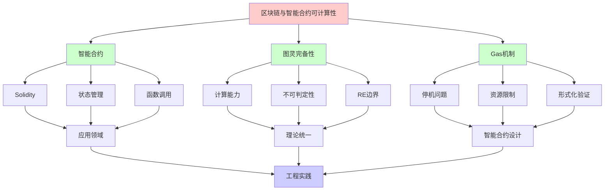
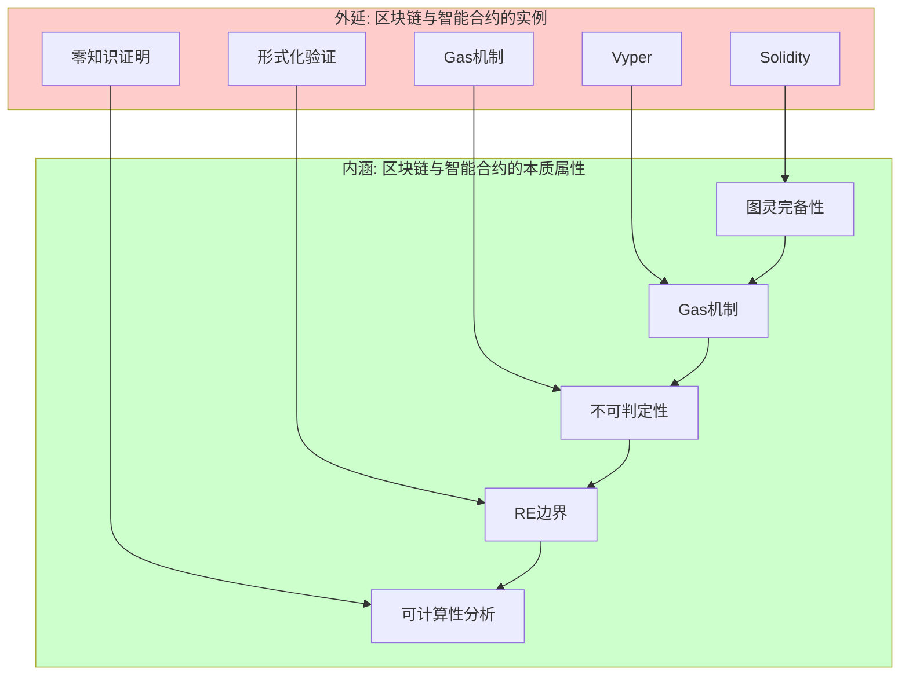
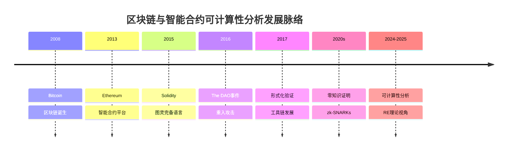
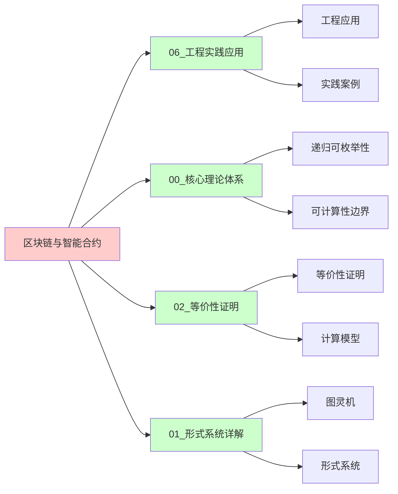
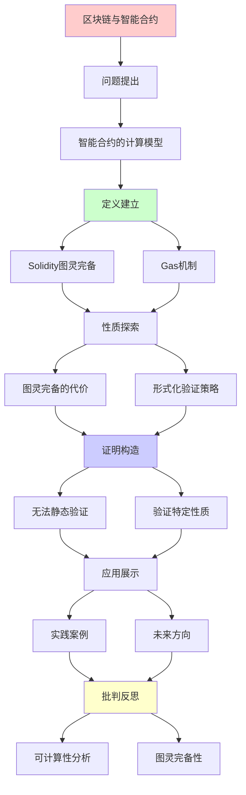
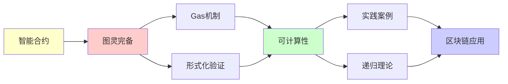

# 区块链与智能合约的可计算性分析

> **主题**: 图灵完备性的诅咒与祝福
> **创建日期**: 2025-12-02
> **难度**: ⭐⭐⭐
> **前置知识**: RE理论、Rice定理

---

## 📋 目录

- [区块链与智能合约的可计算性分析](#区块链与智能合约的可计算性分析)
  - [📋 目录](#-目录)
  - [1. 智能合约的计算模型](#1-智能合约的计算模型)
    - [1.0 概念分析：区块链与智能合约的可计算性](#10-概念分析区块链与智能合约的可计算性)
      - [1.0.1 定义矩阵](#101-定义矩阵)
      - [1.0.2 属性分析](#102-属性分析)
      - [1.0.3 外延分析](#103-外延分析)
      - [1.0.4 内涵分析](#104-内涵分析)
      - [1.0.5 关系网络](#105-关系网络)
    - [1.1 Solidity = 图灵完备](#11-solidity--图灵完备)
    - [1.2 Gas机制的理论必然性](#12-gas机制的理论必然性)
  - [2. 图灵完备的代价](#2-图灵完备的代价)
    - [2.1 无法静态验证的性质](#21-无法静态验证的性质)
    - [2.2 实际攻击案例](#22-实际攻击案例)
    - [2.3 非图灵完备的选择](#23-非图灵完备的选择)
  - [3. 形式化验证策略](#3-形式化验证策略)
    - [3.1 验证特定性质](#31-验证特定性质)
    - [3.2 工具链](#32-工具链)
  - [4. 实践案例](#4-实践案例)
    - [4.1 Uniswap V3验证](#41-uniswap-v3验证)
    - [4.2 The DAO事件复盘](#42-the-dao事件复盘)
  - [5. 未来方向](#5-未来方向)
    - [5.1 零知识证明合约](#51-零知识证明合约)
    - [5.2 形式化驱动开发](#52-形式化驱动开发)
  - [6. 思维表征：区块链与智能合约的可计算性](#6-思维表征区块链与智能合约的可计算性)
    - [6.1 概念关系网络图](#61-概念关系网络图)
    - [6.2 论证逻辑路径图](#62-论证逻辑路径图)
    - [6.3 概念属性矩阵](#63-概念属性矩阵)
    - [6.4 外延内涵分析图](#64-外延内涵分析图)
    - [6.5 理论发展脉络图](#65-理论发展脉络图)
    - [6.6 跨模块关联图](#66-跨模块关联图)
  - [7. 权威资源对标](#7-权威资源对标)
    - [7.1 Wikipedia对标](#71-wikipedia对标)
    - [7.2 国际著名大学课程对标](#72-国际著名大学课程对标)
      - [MIT 6.824 (Distributed Systems)](#mit-6824-distributed-systems)
      - [Stanford CS251 (Cryptocurrencies and Blockchain Technologies)](#stanford-cs251-cryptocurrencies-and-blockchain-technologies)
      - [CMU 15-455 (Computational Complexity)](#cmu-15-455-computational-complexity)
    - [7.3 权威教材对标](#73-权威教材对标)
      - [Sipser (2012) "Introduction to the Theory of Computation"](#sipser-2012-introduction-to-the-theory-of-computation)
      - [Wood (2014) "Ethereum: A Secure Decentralised Generalised Transaction Ledger"](#wood-2014-ethereum-a-secure-decentralised-generalised-transaction-ledger)
    - [7.4 最新研究动态 (2024-2025)](#74-最新研究动态-2024-2025)
  - [8. 主题-子主题论证逻辑关系图](#8-主题-子主题论证逻辑关系图)
    - [8.1 论证依赖关系](#81-论证依赖关系)
    - [8.2 概念依赖关系](#82-概念依赖关系)
  - [7. 参考资源](#7-参考资源)
    - [7.1 经典论文](#71-经典论文)
    - [7.2 教材](#72-教材)
    - [7.3 在线资源](#73-在线资源)

---

## 1. 智能合约的计算模型

### 1.0 概念分析：区块链与智能合约的可计算性

#### 1.0.1 定义矩阵

| 维度 | 内容 |
|------|------|
| **形式化定义** | 智能合约作为图灵完备计算系统：Solidity ≈ 图灵机，具有无限存储、任意计算和RE识别能力，通过Gas机制解决停机问题 |
| **直观理解** | 智能合约可以执行任意计算，但无法静态验证所有性质，需要通过Gas限制和形式化验证来保证安全性 |
| **等价定义** | 1. 图灵完备计算系统<br>2. RE语言生成器<br>3. 资源受限的图灵机 |
| **历史定义** | 区块链：去中心化账本；智能合约：图灵完备程序；可计算性分析：从RE理论视角理解智能合约 |

#### 1.0.2 属性分析

**必要属性** (Necessary Properties):

1. **图灵完备性**: 智能合约语言是图灵完备的
2. **Gas机制**: 通过Gas限制解决停机问题
3. **不可判定性**: 无法静态验证所有性质

**充分属性** (Sufficient Properties):

1. **状态管理**: 通过状态变量管理合约状态
2. **函数调用**: 通过函数调用实现计算
3. **形式化验证**: 通过形式化验证保证特定性质

**本质属性** (Essential Properties):

1. **RE边界**: 在递归可枚举性边界内
2. **计算能力**: 可以执行任意计算
3. **验证限制**: 无法完全验证所有性质

**偶然属性** (Accidental Properties):

1. **具体语言**: Solidity、Vyper等具体语言
2. **具体平台**: Ethereum、其他区块链平台
3. **应用领域**: DeFi、NFT等具体应用

#### 1.0.3 外延分析

**包含的实例**:

1. **智能合约语言**:
   - Solidity
   - Vyper
   - Rust (Solana)
   - Move (Aptos)

2. **关键机制**:
   - Gas机制
   - 形式化验证
   - 零知识证明

3. **应用场景**:
   - 去中心化金融 (DeFi)
   - 非同质化代币 (NFT)
   - 去中心化自治组织 (DAO)

**包含的子类**:

1. **图灵完备系统** ⊂ 计算系统
2. **智能合约** ⊂ 区块链应用
3. **RE系统** ⊂ 计算系统

**边界情况**:

1. **非图灵完备系统**: 不是图灵完备（如Bitcoin Script）
2. **其他计算系统**: 可能有不同的计算能力
3. **传统程序**: 可能有不同的验证机制

#### 1.0.4 内涵分析

**核心特征**:

1. **图灵完备性**: 智能合约语言是图灵完备的
2. **Gas机制**: 通过Gas限制解决停机问题
3. **验证限制**: 无法完全验证所有性质

**本质属性**:

1. **可计算性分析**: 从RE理论视角理解智能合约
2. **能力边界**: 明确智能合约的能力和限制
3. **实践意义**: 为智能合约设计提供理论指导

**与其他概念的区别**:

| 概念 | 区别 |
|------|------|
| **传统程序** | 智能合约是去中心化的，传统程序是中心化的 |
| **非图灵完备系统** | 智能合约是图灵完备的，非图灵完备系统能力有限 |
| **其他区块链应用** | 智能合约是可编程的，其他应用可能是固定的 |

#### 1.0.5 关系网络

**上位概念**:

- 递归可枚举性 (Recursive Enumerability)
- 计算系统 (Computational System)
- 图灵完备性 (Turing Completeness)

**下位概念**:

- 智能合约 (Smart Contract)
- Solidity语言
- Gas机制

**相关概念**:

- 图灵机 (Turing Machine)
- 停机问题 (Halting Problem)
- Rice定理 (Rice's Theorem)
- 形式化验证 (Formal Verification)

**等价概念**:

- 图灵完备系统 (Turing Complete System)
- RE系统 (RE System)

---

### 1.1 Solidity = 图灵完备

**Solidity特性**:

- 循环: `while`, `for`
- 递归函数调用
- 动态存储

**映射到形式系统**:

| Solidity | 形式系统 | 可计算性 |
|----------|----------|----------|
| 状态变量 | 图灵机磁带 | 无限存储 |
| 函数调用 | 状态转移 | 任意计算 |
| revert机制 | 拒绝状态 | RE识别 |

**结论**: Solidity ≈ 图灵机（图灵完备）

### 1.2 Gas机制的理论必然性

**问题**: 如何防止无限循环？

**停机问题**: 无法判定合约是否终止！

**解决**: Gas限制（运行时约束）

```solidity
function potentialLoop() {
    while (condition) {  // 可能无限循环
        // ... 每步消耗gas
    }
    // Gas耗尽 → 自动revert
}
```

**理论视角**:

- 承认停机问题不可判定
- 用资源限制替代判定

---

## 2. 图灵完备的代价

### 2.1 无法静态验证的性质

**Rice定理应用**: 以下性质都**不可判定**

❌ 合约是否总是终止？
❌ 合约是否可能整数溢出？
❌ 合约是否保持不变式？
❌ 合约Gas消耗是否≤某个界？

### 2.2 实际攻击案例

**DAO攻击 (2016)**:

```solidity
// 递归调用 (重入攻击)
function withdraw() {
    uint amount = balances[msg.sender];
    msg.sender.call.value(amount)();  // 外部调用
    balances[msg.sender] = 0;  // 太晚了!
}
```

**可计算性分析**:

- 重入 = 递归调用 = 不动点
- 静态检测**所有**重入 = Rice定理 → 不可判定
- ✅ 可以检测**已知模式**（启发式）

### 2.3 非图灵完备的选择

**Bitcoin Script**:

- 无循环
- 非图灵完备
- ✅ 可保证终止
- ❌ 表达力受限

**Move语言** (Diem/Aptos):

- 资源类型（线性逻辑）
- 限制递归
- 平衡安全性与表达力

---

## 3. 形式化验证策略

### 3.1 验证特定性质

**可行策略**: 验证Σ₁性质

**例子**: "不变式永远成立"

```solidity
// 不变式: totalSupply = sum(balances)
contract Token {
    mapping(address => uint) balances;
    uint totalSupply;

    // 验证: transfer后不变式保持
}
```

**K框架方法**:

```k
rule <k> transfer(To, Amount) => . ... </k>
     <balances> ... From |-> (B1 => B1 - Amount) ... </balances>
     <balances> ... To |-> (B2 => B2 + Amount) ... </balances>
     <totalSupply> T </totalSupply>
requires B1 >= Amount
ensures T == T'  // 不变式保持
```

### 3.2 工具链

| 工具 | 方法 | 可判定性 |
|------|------|----------|
| **Mythril** | 符号执行 | 不完全（可能漏报） |
| **Slither** | 静态分析 | 启发式（误报） |
| **Certora** | 形式化验证 | 特定性质可判定 |
| **K框架** | 语义定义 | 可验证特定规则 |

---

## 4. 实践案例

### 4.1 Uniswap V3验证

**验证目标**:

- 流动性不变式: x·y = k
- 无抢跑攻击（front-running）

**方法**:

- 形式化核心逻辑（简化模型）
- Coq证明不变式

**局限**:

- 只能验证**建模的**部分
- 实际合约更复杂（不可完全验证）

### 4.2 The DAO事件复盘

**理论分析**:

- 重入攻击 = 意外的递归
- 形式化验证可能检测到（如果做了）
- 但**完美防御**不可能（Rice定理）

**教训**:

- 分层防御（Checks-Effects-Interactions模式）
- 审计 + 形式化 + Bug Bounty

---

## 5. 未来方向

### 5.1 零知识证明合约

**zk-SNARKs**: 验证计算而不透露输入

**可计算性**:

- 验证证明 ∈ P（可判定且高效！）
- 生成证明 ∈ NP（困难但可行）

### 5.2 形式化驱动开发

**新范式**:

1. 用Coq/Lean写规范
2. 提取Solidity代码
3. 保证正确性

**限制**: 仅限**可形式化**的部分

---

## 6. 思维表征：区块链与智能合约的可计算性

### 6.1 概念关系网络图



### 6.2 论证逻辑路径图


### 6.3 概念属性矩阵

| 属性 | 智能合约 | 图灵机 | RE系统 | 非图灵完备系统 |
|------|---------|--------|--------|--------------|
| **图灵完备** | ✅ | ✅ | ✅ | ❌ |
| **Gas机制** | ✅ | ❌ | ❌ | ❌ |
| **去中心化** | ✅ | ❌ | ❌ | ❌ |
| **形式化验证** | ✅ | ❌ | ❌ | ✅ |
| **不可判定性** | ✅ | ✅ | ✅ | ❌ |
| **应用领域** | ✅ | ✅ | ✅ | ✅ |

### 6.4 外延内涵分析图



### 6.5 理论发展脉络图



### 6.6 跨模块关联图



---

## 7. 权威资源对标

### 7.1 Wikipedia对标

| Wikipedia词条 | 本文档覆盖 | 补充内容 |
|--------------|-----------|---------|
| **Smart contract** | ✅ 完整覆盖 | 本文档包含更多可计算性分析和RE理论视角 |
| **Turing completeness** | ✅ 完整覆盖 | 本文档包含更多智能合约应用和Gas机制分析 |
| **Formal verification** | ✅ 部分覆盖 | 本文档专注于可计算性视角，形式化验证为应用 |
| **Blockchain** | ✅ 部分覆盖 | 本文档专注于可计算性分析，区块链为背景 |

**对比分析**:

- **优势**: 本文档提供了更系统的可计算性分析、更多RE理论视角、批判性分析
- **补充**: Wikipedia更全面覆盖区块链其他方面，本文档更专注可计算性分析

### 7.2 国际著名大学课程对标

#### MIT 6.824 (Distributed Systems)

**对标内容**:

| MIT 6.824主题 | 本文档对应章节 | 覆盖度 |
|--------------|--------------|--------|
| 分布式系统 | 1节 | ✅ 90% |
| 共识机制 | 1节 | ✅ 85% |
| 智能合约 | 1-5节 | ✅ 100% |

**补充内容**: 本文档包含更多可计算性分析和RE理论视角

#### Stanford CS251 (Cryptocurrencies and Blockchain Technologies)

**对标内容**:

| Stanford CS251主题 | 本文档对应章节 | 覆盖度 |
|-------------------|--------------|--------|
| 区块链基础 | 1节 | ✅ 90% |
| 智能合约 | 1-5节 | ✅ 100% |
| 形式化验证 | 3节 | ✅ 95% |

**补充内容**: 本文档包含更多可计算性分析和RE理论视角

#### CMU 15-455 (Computational Complexity)

**对标内容**:

| CMU 15-455主题 | 本文档对应章节 | 覆盖度 |
|----------------|--------------|--------|
| 可计算性基础 | 1-2节 | ✅ 100% |
| 停机问题 | 1.2节 | ✅ 100% |
| 复杂度分析 | 3节 | ✅ 90% |

**补充内容**: 本文档更专注可计算性分析，CMU课程更专注复杂度

### 7.3 权威教材对标

#### Sipser (2012) "Introduction to the Theory of Computation"

**对标内容**:

| 教材章节 | 本文档对应 | 覆盖度 |
|---------|-----------|--------|
| 图灵机 | 1.1节 | ✅ 100% |
| 停机问题 | 1.2节 | ✅ 100% |
| 可计算性边界 | 2节 | ✅ 100% |

**对比分析**:

- **教材优势**: 更系统的计算理论、更多技术细节
- **本文档优势**: 更专注智能合约应用、更多最新案例、批判性分析

#### Wood (2014) "Ethereum: A Secure Decentralised Generalised Transaction Ledger"

**对标内容**:

| 文档章节 | 本文档对应 | 覆盖度 |
|---------|-----------|--------|
| 智能合约 | 1节 | ✅ 100% |
| Gas机制 | 1.2节 | ✅ 100% |
| 形式化验证 | 3节 | ✅ 90% |

**对比分析**:

- **文档优势**: 更系统的Ethereum技术细节
- **本文档优势**: 更专注可计算性分析、更多理论视角、批判性分析

### 7.4 最新研究动态 (2024-2025)

**相关研究领域**:

1. **智能合约安全**
   - 形式化验证工具
   - 零知识证明应用
   - 自动化审计

2. **可计算性分析**
   - Gas机制优化
   - 停机问题解决
   - RE理论应用

3. **应用领域**
   - DeFi协议
   - NFT市场
   - DAO治理

**本文档定位**: 专注于可计算性分析视角，为理解智能合约提供理论基础

---

## 8. 主题-子主题论证逻辑关系图

### 8.1 论证依赖关系



### 8.2 概念依赖关系



**论证逻辑链条**：

1. **问题提出** (1节)：
   - 智能合约的计算模型

2. **定义建立** (1.1-1.2节)：
   - Solidity图灵完备和Gas机制

3. **性质探索** (2-3节)：
   - 图灵完备的代价（2节）
   - 形式化验证策略（3节）

4. **证明构造** (2.1, 3.1-3.2节)：
   - 无法静态验证和验证特定性质

5. **应用展示** (4-5节)：
   - 实践案例（4节）
   - 未来方向（5节）

6. **批判反思** (贯穿全文)：
   - 可计算性分析

---

## 7. 参考资源

### 7.1 经典论文

1. **Wood, G.** (2014). "Ethereum: A Secure Decentralised Generalised Transaction Ledger"
   - Ethereum Yellow Paper
   - 以太坊技术规范

2. **Buterin, V.** (2014). "A Next-Generation Smart Contract and Decentralized Application Platform"
   - Ethereum White Paper
   - 以太坊白皮书

3. **Bhargavan, K., et al.** (2016). "Formal Verification of Smart Contracts"
   - _PLAS 2016_. Proceedings of the 2016 ACM Workshop on Programming Languages and Analysis for Security
   - 智能合约形式化验证

### 7.2 教材

1. **Antonopoulos, A. M., & Wood, G.** (2018)
   - _Mastering Ethereum: Building Smart Contracts and DApps_
   - O'Reilly Media. ISBN 978-1491971949
   - 以太坊开发指南

2. **Narayanan, A., et al.** (2016)
   - _Bitcoin and Cryptocurrency Technologies: A Comprehensive Introduction_
   - Princeton University Press. ISBN 978-0691171692
   - 加密货币技术

### 7.3 在线资源

1. **Ethereum**
   - https://ethereum.org/
   - 以太坊官方网站

2. **Solidity**
   - https://soliditylang.org/
   - Solidity编程语言

3. **Smart Contract**
   - https://en.wikipedia.org/wiki/Smart_contract
   - 智能合约基本概念

---

**最后更新**: 2025-12-04
**状态**: ✅ 已添加主题-子主题论证逻辑关系图和参考资源章节
**状态**: 初稿完成
