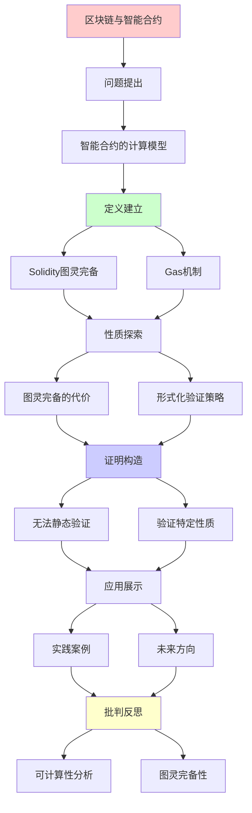
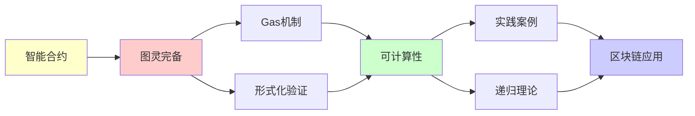

# 区块链与智能合约的可计算性分析

> **主题**: 图灵完备性的诅咒与祝福
> **创建日期**: 2025-12-02
> **难度**: ⭐⭐⭐
> **前置知识**: RE理论、Rice定理

---

## 📋 目录

- [区块链与智能合约的可计算性分析](#区块链与智能合约的可计算性分析)
  - [📋 目录](#-目录)
  - [1. 智能合约的计算模型](#1-智能合约的计算模型)
    - [1.1 Solidity = 图灵完备](#11-solidity--图灵完备)
    - [1.2 Gas机制的理论必然性](#12-gas机制的理论必然性)
  - [2. 图灵完备的代价](#2-图灵完备的代价)
    - [2.1 无法静态验证的性质](#21-无法静态验证的性质)
    - [2.2 实际攻击案例](#22-实际攻击案例)
    - [2.3 非图灵完备的选择](#23-非图灵完备的选择)
  - [3. 形式化验证策略](#3-形式化验证策略)
    - [3.1 验证特定性质](#31-验证特定性质)
    - [3.2 工具链](#32-工具链)
  - [4. 实践案例](#4-实践案例)
    - [4.1 Uniswap V3验证](#41-uniswap-v3验证)
    - [4.2 The DAO事件复盘](#42-the-dao事件复盘)
  - [5. 未来方向](#5-未来方向)
    - [5.1 零知识证明合约](#51-零知识证明合约)
    - [5.2 形式化驱动开发](#52-形式化驱动开发)
  - [6. 主题-子主题论证逻辑关系图](#6-主题-子主题论证逻辑关系图)
    - [6.1 论证依赖关系](#61-论证依赖关系)
    - [6.2 概念依赖关系](#62-概念依赖关系)
  - [7. 参考资源](#7-参考资源)
    - [7.1 经典论文](#71-经典论文)
    - [7.2 教材](#72-教材)
    - [7.3 在线资源](#73-在线资源)

---

## 1. 智能合约的计算模型

### 1.1 Solidity = 图灵完备

**Solidity特性**:

- 循环: `while`, `for`
- 递归函数调用
- 动态存储

**映射到形式系统**:

| Solidity | 形式系统 | 可计算性 |
|----------|----------|----------|
| 状态变量 | 图灵机磁带 | 无限存储 |
| 函数调用 | 状态转移 | 任意计算 |
| revert机制 | 拒绝状态 | RE识别 |

**结论**: Solidity ≈ 图灵机（图灵完备）

### 1.2 Gas机制的理论必然性

**问题**: 如何防止无限循环？

**停机问题**: 无法判定合约是否终止！

**解决**: Gas限制（运行时约束）

```solidity
function potentialLoop() {
    while (condition) {  // 可能无限循环
        // ... 每步消耗gas
    }
    // Gas耗尽 → 自动revert
}
```

**理论视角**:

- 承认停机问题不可判定
- 用资源限制替代判定

---

## 2. 图灵完备的代价

### 2.1 无法静态验证的性质

**Rice定理应用**: 以下性质都**不可判定**

❌ 合约是否总是终止？
❌ 合约是否可能整数溢出？
❌ 合约是否保持不变式？
❌ 合约Gas消耗是否≤某个界？

### 2.2 实际攻击案例

**DAO攻击 (2016)**:

```solidity
// 递归调用 (重入攻击)
function withdraw() {
    uint amount = balances[msg.sender];
    msg.sender.call.value(amount)();  // 外部调用
    balances[msg.sender] = 0;  // 太晚了!
}
```

**可计算性分析**:

- 重入 = 递归调用 = 不动点
- 静态检测**所有**重入 = Rice定理 → 不可判定
- ✅ 可以检测**已知模式**（启发式）

### 2.3 非图灵完备的选择

**Bitcoin Script**:

- 无循环
- 非图灵完备
- ✅ 可保证终止
- ❌ 表达力受限

**Move语言** (Diem/Aptos):

- 资源类型（线性逻辑）
- 限制递归
- 平衡安全性与表达力

---

## 3. 形式化验证策略

### 3.1 验证特定性质

**可行策略**: 验证Σ₁性质

**例子**: "不变式永远成立"

```solidity
// 不变式: totalSupply = sum(balances)
contract Token {
    mapping(address => uint) balances;
    uint totalSupply;

    // 验证: transfer后不变式保持
}
```

**K框架方法**:

```k
rule <k> transfer(To, Amount) => . ... </k>
     <balances> ... From |-> (B1 => B1 - Amount) ... </balances>
     <balances> ... To |-> (B2 => B2 + Amount) ... </balances>
     <totalSupply> T </totalSupply>
requires B1 >= Amount
ensures T == T'  // 不变式保持
```

### 3.2 工具链

| 工具 | 方法 | 可判定性 |
|------|------|----------|
| **Mythril** | 符号执行 | 不完全（可能漏报） |
| **Slither** | 静态分析 | 启发式（误报） |
| **Certora** | 形式化验证 | 特定性质可判定 |
| **K框架** | 语义定义 | 可验证特定规则 |

---

## 4. 实践案例

### 4.1 Uniswap V3验证

**验证目标**:

- 流动性不变式: x·y = k
- 无抢跑攻击（front-running）

**方法**:

- 形式化核心逻辑（简化模型）
- Coq证明不变式

**局限**:

- 只能验证**建模的**部分
- 实际合约更复杂（不可完全验证）

### 4.2 The DAO事件复盘

**理论分析**:

- 重入攻击 = 意外的递归
- 形式化验证可能检测到（如果做了）
- 但**完美防御**不可能（Rice定理）

**教训**:

- 分层防御（Checks-Effects-Interactions模式）
- 审计 + 形式化 + Bug Bounty

---

## 5. 未来方向

### 5.1 零知识证明合约

**zk-SNARKs**: 验证计算而不透露输入

**可计算性**:

- 验证证明 ∈ P（可判定且高效！）
- 生成证明 ∈ NP（困难但可行）

### 5.2 形式化驱动开发

**新范式**:

1. 用Coq/Lean写规范
2. 提取Solidity代码
3. 保证正确性

**限制**: 仅限**可形式化**的部分

---

## 6. 主题-子主题论证逻辑关系图

### 6.1 论证依赖关系



### 6.2 概念依赖关系



**论证逻辑链条**：

1. **问题提出** (1节)：
   - 智能合约的计算模型

2. **定义建立** (1.1-1.2节)：
   - Solidity图灵完备和Gas机制

3. **性质探索** (2-3节)：
   - 图灵完备的代价（2节）
   - 形式化验证策略（3节）

4. **证明构造** (2.1, 3.1-3.2节)：
   - 无法静态验证和验证特定性质

5. **应用展示** (4-5节)：
   - 实践案例（4节）
   - 未来方向（5节）

6. **批判反思** (贯穿全文)：
   - 可计算性分析

---

## 7. 参考资源

### 7.1 经典论文

1. **Wood, G.** (2014). "Ethereum: A Secure Decentralised Generalised Transaction Ledger"
   - Ethereum Yellow Paper
   - 以太坊技术规范

2. **Buterin, V.** (2014). "A Next-Generation Smart Contract and Decentralized Application Platform"
   - Ethereum White Paper
   - 以太坊白皮书

3. **Bhargavan, K., et al.** (2016). "Formal Verification of Smart Contracts"
   - _PLAS 2016_. Proceedings of the 2016 ACM Workshop on Programming Languages and Analysis for Security
   - 智能合约形式化验证

### 7.2 教材

1. **Antonopoulos, A. M., & Wood, G.** (2018)
   - _Mastering Ethereum: Building Smart Contracts and DApps_
   - O'Reilly Media. ISBN 978-1491971949
   - 以太坊开发指南

2. **Narayanan, A., et al.** (2016)
   - _Bitcoin and Cryptocurrency Technologies: A Comprehensive Introduction_
   - Princeton University Press. ISBN 978-0691171692
   - 加密货币技术

### 7.3 在线资源

1. **Ethereum**
   - https://ethereum.org/
   - 以太坊官方网站

2. **Solidity**
   - https://soliditylang.org/
   - Solidity编程语言

3. **Smart Contract**
   - https://en.wikipedia.org/wiki/Smart_contract
   - 智能合约基本概念

---

**最后更新**: 2025-12-04
**状态**: ✅ 已添加主题-子主题论证逻辑关系图和参考资源章节
**状态**: 初稿完成
