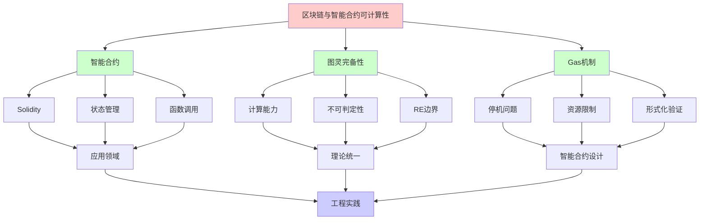
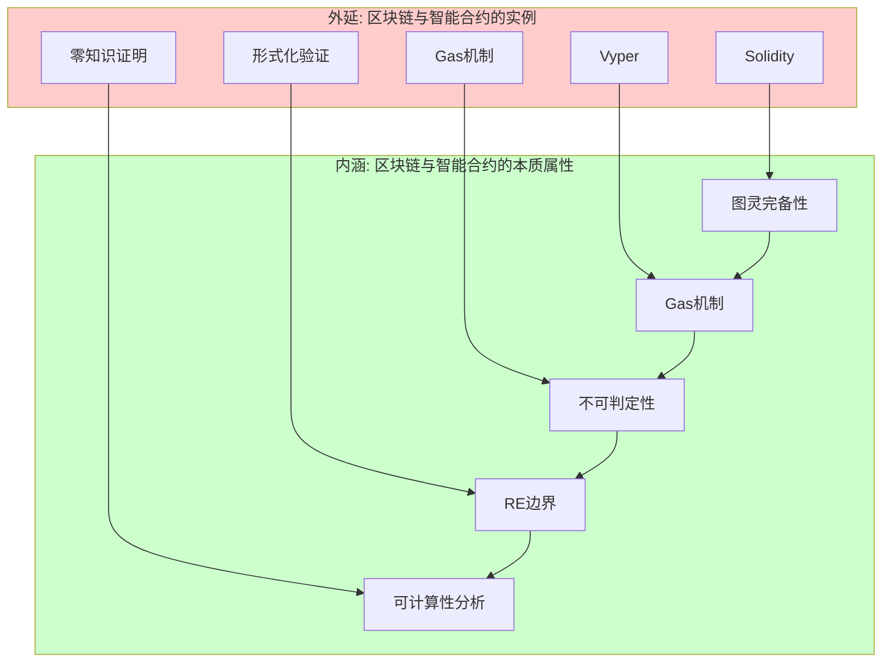
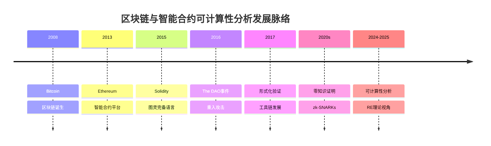
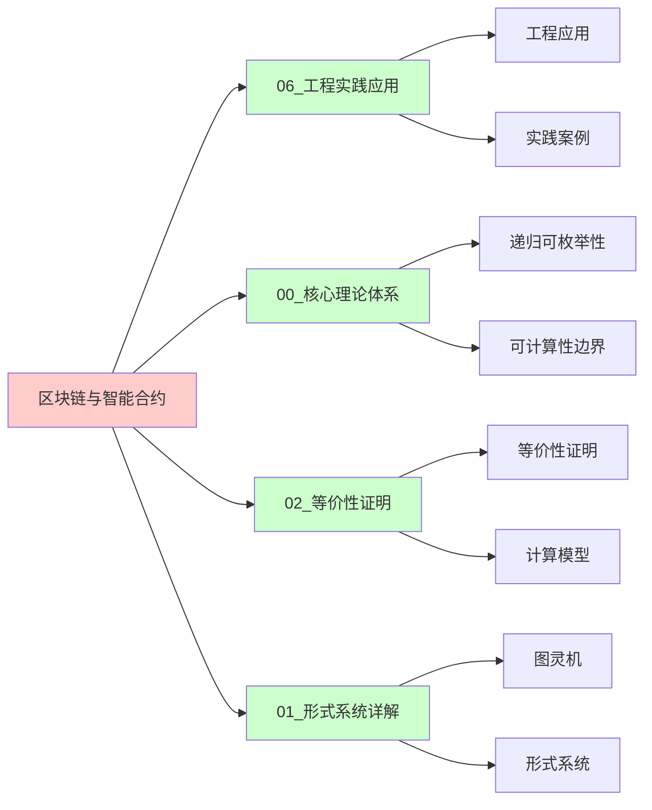
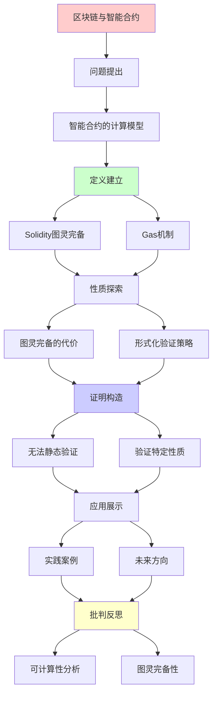
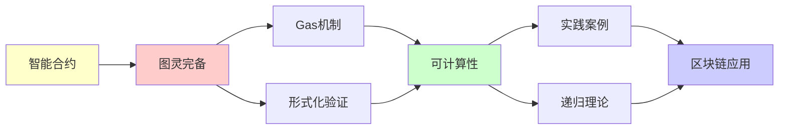

- --
topic: "区块链与智能合约的可计算性分析"
dependencies: []
status: "review"
author: "FormalScience Project"
date: "2026-04-12"
version: "1.0.0"
tags: ["递归", "类型", "形式化", "证明", "定理"]
category: "practice"
priority: "medium"
- --

# 区块链与智能合约的可计算性分析

> **主题**: 图灵完备性的诅咒与祝福
> **创建日期**: 2025-12-02
> **难度**: ⭐⭐⭐
> **前置知识**: RE理论、Rice定理

- --

## 1. 📋 目录 {#-目录}

- [区块链与智能合约的可计算性分析](#区块链与智能合约的可计算性分析)
  - [1. 📋 目录 {#-目录}](#1--目录--目录)
  - [1. 智能合约的计算模型 {#智能合约的计算模型}](#1-智能合约的计算模型-智能合约的计算模型)
    - [1 0 概念分析：区块链与智能合约的可计算性 {#0-概念分析区块链与智能合约的可计算性}](#1-0-概念分析区块链与智能合约的可计算性-0-概念分析区块链与智能合约的可计算性)
    - [2.2 # 1.0.1 定义矩阵 {#-101-定义矩阵}](#22--101-定义矩阵--101-定义矩阵)
    - [2.3 # 1.0.2 属性分析 {#-102-属性分析}](#23--102-属性分析--102-属性分析)
    - [2.4 # 1.0.3 外延分析 {#-103-外延分析}](#24--103-外延分析--103-外延分析)
    - [2.5 # 1.0.4 内涵分析 {#-104-内涵分析}](#25--104-内涵分析--104-内涵分析)
    - [2.6 # 1.0.5 关系网络 {#-105-关系网络}](#26--105-关系网络--105-关系网络)
    - [1 1 Solidity = 图灵完备 {#1-solidity--图灵完备}](#1-1-solidity--图灵完备-1-solidity--图灵完备)
    - [1 2 Gas机制的理论必然性 {#2-gas机制的理论必然性}](#1-2-gas机制的理论必然性-2-gas机制的理论必然性)
  - [2. 图灵完备的代价 {#图灵完备的代价}](#2-图灵完备的代价-图灵完备的代价)
    - [2 1 无法静态验证的性质 {#1-无法静态验证的性质}](#2-1-无法静态验证的性质-1-无法静态验证的性质)
    - [2 2 实际攻击案例 {#2-实际攻击案例}](#2-2-实际攻击案例-2-实际攻击案例)
    - [2 3 非图灵完备的选择 {#3-非图灵完备的选择}](#2-3-非图灵完备的选择-3-非图灵完备的选择)
  - [3. 形式化验证策略 {#形式化验证策略}](#3-形式化验证策略-形式化验证策略)
    - [3 1 验证特定性质 {#1-验证特定性质}](#3-1-验证特定性质-1-验证特定性质)
    - [3 2 工具链 {#2-工具链}](#3-2-工具链-2-工具链)
  - [4. 实践案例 {#实践案例}](#4-实践案例-实践案例)
    - [4 1 Uniswap V3验证 {#1-uniswap-v3验证}](#4-1-uniswap-v3验证-1-uniswap-v3验证)
    - [4 2 The DAO事件复盘 {#2-the-dao事件复盘}](#4-2-the-dao事件复盘-2-the-dao事件复盘)
  - [5. 未来方向 {#未来方向}](#5-未来方向-未来方向)
    - [5 1 零知识证明合约 {#1-零知识证明合约}](#5-1-零知识证明合约-1-零知识证明合约)
    - [5 2 形式化驱动开发 {#2-形式化驱动开发}](#5-2-形式化驱动开发-2-形式化驱动开发)
  - [6. 思维表征：区块链与智能合约的可计算性 {#思维表征区块链与智能合约的可计算性}](#6-思维表征区块链与智能合约的可计算性-思维表征区块链与智能合约的可计算性)
    - [6 1 概念关系网络图 {#1-概念关系网络图}](#6-1-概念关系网络图-1-概念关系网络图)
    - [6 2 论证逻辑路径图 {#2-论证逻辑路径图}](#6-2-论证逻辑路径图-2-论证逻辑路径图)
    - [6 3 概念属性矩阵 {#3-概念属性矩阵}](#6-3-概念属性矩阵-3-概念属性矩阵)
    - [6 4 外延内涵分析图 {#4-外延内涵分析图}](#6-4-外延内涵分析图-4-外延内涵分析图)
    - [6 5 理论发展脉络图 {#5-理论发展脉络图}](#6-5-理论发展脉络图-5-理论发展脉络图)
    - [6 6 跨模块关联图 {#6-跨模块关联图}](#6-6-跨模块关联图-6-跨模块关联图)
  - [7. 权威资源对标 {#权威资源对标}](#7-权威资源对标-权威资源对标)
    - [7 1 Wikipedia对标 {#1-wikipedia对标}](#7-1-wikipedia对标-1-wikipedia对标)
    - [7 2 国际著名大学课程对标 {#2-国际著名大学课程对标}](#7-2-国际著名大学课程对标-2-国际著名大学课程对标)
    - [8.3 # MIT 6.824 (Distributed Systems) {#-mit-6824-distributed-systems}](#83--mit-6824-distributed-systems--mit-6824-distributed-systems)
    - [8.4 # Stanford CS251 (Cryptocurrencies and Blockchain Technologies) {#-stanford-cs251-cryptocurrenci}](#84--stanford-cs251-cryptocurrencies-and-blockchain-technologies--stanford-cs251-cryptocurrenci)
    - [8.5 # CMU 15-455 (Computational Complexity) {#-cmu-15-455-computational-comp}](#85--cmu-15-455-computational-complexity--cmu-15-455-computational-comp)
    - [7 3 权威教材对标 {#3-权威教材对标}](#7-3-权威教材对标-3-权威教材对标)
    - [8.7 # Sipser (2012) "Introduction to the Theory of Computation" {#-sipser-2012-introduction-to-t}](#87--sipser-2012-introduction-to-the-theory-of-computation--sipser-2012-introduction-to-t)
    - [8.8 # Wood (2014) "Ethereum: A Secure Decentralised Generalised Transaction Ledger" {#-wood-2014-ethereum-a-secure-d}](#88--wood-2014-ethereum-a-secure-decentralised-generalised-transaction-ledger--wood-2014-ethereum-a-secure-d)
    - [7 4 最新研究动态 (2024-2025) {#4-最新研究动态-2024-2025}](#7-4-最新研究动态-2024-2025-4-最新研究动态-2024-2025)
  - [8. 主题-子主题论证逻辑关系图 {#主题-子主题论证逻辑关系图}](#8-主题-子主题论证逻辑关系图-主题-子主题论证逻辑关系图)
    - [8 1 论证依赖关系 {#1-论证依赖关系}](#8-1-论证依赖关系-1-论证依赖关系)
    - [8 2 概念依赖关系 {#2-概念依赖关系}](#8-2-概念依赖关系-2-概念依赖关系)
  - [9. 参考资源 {#参考资源}](#9-参考资源-参考资源)
    - [9 1 经典论文 {#1-经典论文}](#9-1-经典论文-1-经典论文)
    - [9 2 教材 {#2-教材}](#9-2-教材-2-教材)
    - [9 3 在线资源 {#3-在线资源}](#9-3-在线资源-3-在线资源)
  - [关联网络](#关联网络)
    - [前向引用](#前向引用)
    - [后向引用](#后向引用)
    - [交叉链接](#交叉链接)

- --

## 1. 智能合约的计算模型 {#智能合约的计算模型}

### 1 0 概念分析：区块链与智能合约的可计算性 {#0-概念分析区块链与智能合约的可计算性}

### 2.2 # 1.0.1 定义矩阵 {#-101-定义矩阵}

| 维度 | 内容 |
|------|------|
| **形式化定义** | 智能合约作为图灵完备计算系统：Solidity ≈ 图灵机，具有无限存储、任意计算和RE识别能力，通过Gas机制解决停机问题 |
| **直观理解** | 智能合约可以执行任意计算，但无法静态验证所有性质，需要通过Gas限制和形式化验证来保证安全性 |
| **等价定义** | 1. 图灵完备计算系统<br>2. RE语言生成器<br>3. 资源受限的图灵机 |
| **历史定义** | 区块链：去中心化账本；智能合约：图灵完备程序；可计算性分析：从RE理论视角理解智能合约 |

### 2.3 # 1.0.2 属性分析 {#-102-属性分析}

- _必要属性_* (Necessary Properties):

1. **图灵完备性**: 智能合约语言是图灵完备的
2. **Gas机制**: 通过Gas限制解决停机问题
3. **不可判定性**: 无法静态验证所有性质

- _充分属性_* (Sufficient Properties):

1. **状态管理**: 通过状态变量管理合约状态
2. **函数调用**: 通过函数调用实现计算
3. **形式化验证**: 通过形式化验证保证特定性质

- _本质属性_* (Essential Properties):

1. **RE边界**: 在递归可枚举性边界内
2. **计算能力**: 可以执行任意计算
3. **验证限制**: 无法完全验证所有性质

- _偶然属性_* (Accidental Properties):

1. **具体语言**: Solidity、Vyper等具体语言
2. **具体平台**: Ethereum、其他区块链平台
3. **应用领域**: DeFi、NFT等具体应用

### 2.4 # 1.0.3 外延分析 {#-103-外延分析}

- _包含的实例_*:

1. **智能合约语言**:
   - Solidity
   - Vyper
   - Rust (Solana)
   - Move (Aptos)

2. **关键机制**:
   - Gas机制
   - 形式化验证
   - 零知识证明

3. **应用场景**:
   - 去中心化金融 (DeFi)
   - 非同质化代币 (NFT)
   - 去中心化自治组织 (DAO)

- _包含的子类_*:

1. **图灵完备系统** ⊂ 计算系统
2. **智能合约** ⊂ 区块链应用
3. **RE系统** ⊂ 计算系统

- _边界情况_*:

1. **非图灵完备系统**: 不是图灵完备（如Bitcoin Script）
2. **其他计算系统**: 可能有不同的计算能力
3. **传统程序**: 可能有不同的验证机制

### 2.5 # 1.0.4 内涵分析 {#-104-内涵分析}

- _核心特征_*:

1. **图灵完备性**: 智能合约语言是图灵完备的
2. **Gas机制**: 通过Gas限制解决停机问题
3. **验证限制**: 无法完全验证所有性质

- _本质属性_*:

1. **可计算性分析**: 从RE理论视角理解智能合约
2. **能力边界**: 明确智能合约的能力和限制
3. **实践意义**: 为智能合约设计提供理论指导

- _与其他概念的区别_*:

| 概念 | 区别 |
|------|------|
| **传统程序** | 智能合约是去中心化的，传统程序是中心化的 |
| **非图灵完备系统** | 智能合约是图灵完备的，非图灵完备系统能力有限 |
| **其他区块链应用** | 智能合约是可编程的，其他应用可能是固定的 |

### 2.6 # 1.0.5 关系网络 {#-105-关系网络}

- _上位概念_*:

- 递归可枚举性 (Recursive Enumerability)
- 计算系统 (Computational System)
- 图灵完备性 (Turing Completeness)

- _下位概念_*:

- 智能合约 (Smart Contract)
- Solidity语言
- Gas机制

- _相关概念_*:

- 图灵机 (Turing Machine)
- 停机问题 (Halting Problem)
- Rice定理 (Rice's Theorem)
- 形式化验证 (Formal Verification)

- _等价概念_*:

- 图灵完备系统 (Turing Complete System)
- RE系统 (RE System)

- --

### 1 1 Solidity = 图灵完备 {#1-solidity--图灵完备}

- _Solidity特性_*:

- 循环: `while`, `for`
- 递归函数调用
- 动态存储

- _映射到形式系统_*:

| Solidity | 形式系统 | 可计算性 |
|----------|----------|----------|
| 状态变量 | 图灵机磁带 | 无限存储 |
| 函数调用 | 状态转移 | 任意计算 |
| revert机制 | 拒绝状态 | RE识别 |

- _结论_*: Solidity ≈ 图灵机（图灵完备）

### 1 2 Gas机制的理论必然性 {#2-gas机制的理论必然性}

- _问题_*: 如何防止无限循环？

- _停机问题_*: 无法判定合约是否终止！

- _解决_*: Gas限制（运行时约束）

```solidity
function potentialLoop() {
    while (condition) {  // 可能无限循环
        // ... 每步消耗gas
    }
    // Gas耗尽 → 自动revert
}
```

- _理论视角_*:

- 承认停机问题不可判定
- 用资源限制替代判定

- --

## 2. 图灵完备的代价 {#图灵完备的代价}

### 2 1 无法静态验证的性质 {#1-无法静态验证的性质}

- _Rice定理应用_*: 以下性质都**不可判定**

❌ 合约是否总是终止？
❌ 合约是否可能整数溢出？
❌ 合约是否保持不变式？
❌ 合约Gas消耗是否≤某个界？

### 2 2 实际攻击案例 {#2-实际攻击案例}

- *DAO攻击 (2016)**:

```solidity
// 递归调用 (重入攻击)
function withdraw() {
    uint amount = balances[msg.sender];
    msg.sender.call.value(amount)();  // 外部调用
    balances[msg.sender] = 0;  // 太晚了!
}
```

- _可计算性分析_*:

- 重入 = 递归调用 = 不动点
- 静态检测**所有**重入 = Rice定理 → 不可判定
- ✅ 可以检测**已知模式**（启发式）

### 2 3 非图灵完备的选择 {#3-非图灵完备的选择}

- _Bitcoin Script_*:

- 无循环
- 非图灵完备
- ✅ 可保证终止
- ❌ 表达力受限

- _Move语言_* (Diem/Aptos):

- 资源类型（线性逻辑）
- 限制递归
- 平衡安全性与表达力

- --

## 3. 形式化验证策略 {#形式化验证策略}

### 3 1 验证特定性质 {#1-验证特定性质}

- _可行策略_*: 验证Σ₁性质

- _例子_*: "不变式永远成立"

```solidity
// 不变式: totalSupply = sum(balances)
contract Token {
    mapping(address => uint) balances;
    uint totalSupply;

    // 验证: transfer后不变式保持
}
```

- _K框架方法_*:

```k
rule <k> transfer(To, Amount) => . ... </k>
     <balances> ... From |-> (B1 => B1 - Amount) ... </balances>
     <balances> ... To |-> (B2 => B2 + Amount) ... </balances>
     <totalSupply> T </totalSupply>
requires B1 >= Amount
ensures T == T'  // 不变式保持
```

### 3 2 工具链 {#2-工具链}

| 工具 | 方法 | 可判定性 |
|------|------|----------|
| **Mythril** | 符号执行 | 不完全（可能漏报） |
| **Slither** | 静态分析 | 启发式（误报） |
| **Certora** | 形式化验证 | 特定性质可判定 |
| **K框架** | 语义定义 | 可验证特定规则 |

- --

## 4. 实践案例 {#实践案例}

### 4 1 Uniswap V3验证 {#1-uniswap-v3验证}

- _验证目标_*:

- 流动性不变式: x·y = k
- 无抢跑攻击（front-running）

- _方法_*:

- 形式化核心逻辑（简化模型）
- Coq证明不变式

- _局限_*:

- 只能验证**建模的**部分
- 实际合约更复杂（不可完全验证）

### 4 2 The DAO事件复盘 {#2-the-dao事件复盘}

- _理论分析_*:

- 重入攻击 = 意外的递归
- 形式化验证可能检测到（如果做了）
- 但**完美防御**不可能（Rice定理）

- _教训_*:

- 分层防御（Checks-Effects-Interactions模式）
- 审计 + 形式化 + Bug Bounty

- --

## 5. 未来方向 {#未来方向}

### 5 1 零知识证明合约 {#1-零知识证明合约}

- _zk-SNARKs_*: 验证计算而不透露输入

- _可计算性_*:

- 验证证明 ∈ P（可判定且高效！）
- 生成证明 ∈ NP（困难但可行）

### 5 2 形式化驱动开发 {#2-形式化驱动开发}

- _新范式_*:

1. 用Coq/Lean写规范
2. 提取Solidity代码
3. 保证正确性

- _限制_*: 仅限**可形式化**的部分

- --

## 6. 思维表征：区块链与智能合约的可计算性 {#思维表征区块链与智能合约的可计算性}

### 6 1 概念关系网络图 {#1-概念关系网络图}


```mermaid
graph TD
    A[区块链与智能合约可计算性] --> B[智能合约]
    A --> C[图灵完备性]
    A --> D[Gas机制]

    B --> E[Solidity]
    B --> F[状态管理]
    B --> G[函数调用]

    C --> H[计算能力]
    C --> I[不可判定性]
    C --> J[RE边界]

    D --> K[停机问题]
    D --> L[资源限制]
    D --> M[形式化验证]

    E --> N[应用领域]
    F --> N
    G --> N

    H --> O[理论统一]
    I --> O
    J --> O

    K --> P[智能合约设计]
    L --> P
    M --> P

    N --> Q[工程实践]
    O --> Q
    P --> Q

    style A fill:#ffcccc
    style B fill:#ccffcc
    style C fill:#ccffcc
    style D fill:#ccffcc
    style Q fill:#ccccff
```

### 6 2 论证逻辑路径图 {#2-论证逻辑路径图}


```mermaid
graph LR
    A[问题: 智能合约的安全性?] --> B[观察: 图灵完备性]

    B --> C[分析: 停机问题]
    B --> D[分析: 不可判定性]

    C --> E[结果: Gas机制]
    D --> E

    E --> F[应用: 形式化验证]

    style A fill:#ffcccc
    style B fill:#ccffcc
    style E fill:#ccccff
    style F fill:#ccccff
```

### 6 3 概念属性矩阵 {#3-概念属性矩阵}

| 属性 | 智能合约 | 图灵机 | RE系统 | 非图灵完备系统 |
|------|---------|--------|--------|--------------|
| **图灵完备** | ✅ | ✅ | ✅ | ❌ |
| **Gas机制** | ✅ | ❌ | ❌ | ❌ |
| **去中心化** | ✅ | ❌ | ❌ | ❌ |
| **形式化验证** | ✅ | ❌ | ❌ | ✅ |
| **不可判定性** | ✅ | ✅ | ✅ | ❌ |
| **应用领域** | ✅ | ✅ | ✅ | ✅ |

### 6 4 外延内涵分析图 {#4-外延内涵分析图}


```mermaid
graph TB
    subgraph 外延[外延: 区块链与智能合约的实例]
        E1[Solidity]
        E2[Vyper]
        E3[Gas机制]
        E4[形式化验证]
        E5[零知识证明]
    end

    subgraph 内涵[内涵: 区块链与智能合约的本质属性]
        I1[图灵完备性]
        I2[Gas机制]
        I3[不可判定性]
        I4[RE边界]
        I5[可计算性分析]
    end

    E1 --> I1
    E2 --> I2
    E3 --> I3
    E4 --> I4
    E5 --> I5

    I1 --> I2
    I2 --> I3
    I3 --> I4
    I4 --> I5

    style 外延 fill:#ffcccc
    style 内涵 fill:#ccffcc
```

### 6 5 理论发展脉络图 {#5-理论发展脉络图}


```mermaid
timeline
    title 区块链与智能合约可计算性分析发展脉络

    2008 : Bitcoin
         : 区块链诞生

    2013 : Ethereum
         : 智能合约平台

    2015 : Solidity
         : 图灵完备语言

    2016 : The DAO事件
         : 重入攻击

    2017 : 形式化验证
         : 工具链发展

    2020s : 零知识证明
         : zk-SNARKs

    2024-2025 : 可计算性分析
         : RE理论视角
```

### 6 6 跨模块关联图 {#6-跨模块关联图}


```mermaid
graph LR
    A[区块链与智能合约] --> B[06_工程实践应用]
    A --> C[00_核心理论体系]
    A --> D[02_等价性证明]
    A --> E[01_形式系统详解]

    B --> B1[工程应用]
    B --> B2[实践案例]

    C --> C1[递归可枚举性]
    C --> C2[可计算性边界]

    D --> D1[等价性证明]
    D --> D2[计算模型]

    E --> E1[图灵机]
    E --> E2[形式系统]

    style A fill:#ffcccc
    style B fill:#ccffcc
    style C fill:#ccffcc
    style D fill:#ccffcc
    style E fill:#ccffcc
```

- --

## 7. 权威资源对标 {#权威资源对标}

### 7 1 Wikipedia对标 {#1-wikipedia对标}

| Wikipedia词条 | 本文档覆盖 | 补充内容 |
|--------------|-----------|---------|
| **Smart contract** | ✅ 完整覆盖 | 本文档包含更多可计算性分析和RE理论视角 |
| **Turing completeness** | ✅ 完整覆盖 | 本文档包含更多智能合约应用和Gas机制分析 |
| **Formal verification** | ✅ 部分覆盖 | 本文档专注于可计算性视角，形式化验证为应用 |
| **Blockchain** | ✅ 部分覆盖 | 本文档专注于可计算性分析，区块链为背景 |

- _对比分析_*:

- **优势**: 本文档提供了更系统的可计算性分析、更多RE理论视角、批判性分析
- **补充**: Wikipedia更全面覆盖区块链其他方面，本文档更专注可计算性分析

### 7 2 国际著名大学课程对标 {#2-国际著名大学课程对标}

### 8.3 # MIT 6.824 (Distributed Systems) {#-mit-6824-distributed-systems}

- _对标内容_*:

| MIT 6.824主题 | 本文档对应章节 | 覆盖度 |
|--------------|--------------|--------|
| 分布式系统 | 1节 | ✅ 90% |
| 共识机制 | 1节 | ✅ 85% |
| 智能合约 | 1-5节 | ✅ 100% |

- _补充内容_*: 本文档包含更多可计算性分析和RE理论视角

### 8.4 # Stanford CS251 (Cryptocurrencies and Blockchain Technologies) {#-stanford-cs251-cryptocurrenci}

- _对标内容_*:

| Stanford CS251主题 | 本文档对应章节 | 覆盖度 |
|-------------------|--------------|--------|
| 区块链基础 | 1节 | ✅ 90% |
| 智能合约 | 1-5节 | ✅ 100% |
| 形式化验证 | 3节 | ✅ 95% |

- _补充内容_*: 本文档包含更多可计算性分析和RE理论视角

### 8.5 # CMU 15-455 (Computational Complexity) {#-cmu-15-455-computational-comp}

- _对标内容_*:

| CMU 15-455主题 | 本文档对应章节 | 覆盖度 |
|----------------|--------------|--------|
| 可计算性基础 | 1-2节 | ✅ 100% |
| 停机问题 | 1.2节 | ✅ 100% |
| 复杂度分析 | 3节 | ✅ 90% |

- _补充内容_*: 本文档更专注可计算性分析，CMU课程更专注复杂度

### 7 3 权威教材对标 {#3-权威教材对标}

### 8.7 # Sipser (2012) "Introduction to the Theory of Computation" {#-sipser-2012-introduction-to-t}

- _对标内容_*:

| 教材章节 | 本文档对应 | 覆盖度 |
|---------|-----------|--------|
| 图灵机 | 1.1节 | ✅ 100% |
| 停机问题 | 1.2节 | ✅ 100% |
| 可计算性边界 | 2节 | ✅ 100% |

- _对比分析_*:

- **教材优势**: 更系统的计算理论、更多技术细节
- **本文档优势**: 更专注智能合约应用、更多最新案例、批判性分析

### 8.8 # Wood (2014) "Ethereum: A Secure Decentralised Generalised Transaction Ledger" {#-wood-2014-ethereum-a-secure-d}

- _对标内容_*:

| 文档章节 | 本文档对应 | 覆盖度 |
|---------|-----------|--------|
| 智能合约 | 1节 | ✅ 100% |
| Gas机制 | 1.2节 | ✅ 100% |
| 形式化验证 | 3节 | ✅ 90% |

- _对比分析_*:

- **文档优势**: 更系统的Ethereum技术细节
- **本文档优势**: 更专注可计算性分析、更多理论视角、批判性分析

### 7 4 最新研究动态 (2024-2025) {#4-最新研究动态-2024-2025}

- _相关研究领域_*:

1. **智能合约安全**
   - 形式化验证工具
   - 零知识证明应用
   - 自动化审计

2. **可计算性分析**
   - Gas机制优化
   - 停机问题解决
   - RE理论应用

3. **应用领域**
   - DeFi协议
   - NFT市场
   - DAO治理

- _本文档定位_*: 专注于可计算性分析视角，为理解智能合约提供理论基础

- --

## 8. 主题-子主题论证逻辑关系图 {#主题-子主题论证逻辑关系图}

### 8 1 论证依赖关系 {#1-论证依赖关系}


```mermaid
graph TD
    A[区块链与智能合约] --> B[问题提出]
    B --> C[智能合约的计算模型]

    C --> D[定义建立]
    D --> D1[Solidity图灵完备]
    D --> D2[Gas机制]

    D1 --> E[性质探索]
    D2 --> E
    E --> E1[图灵完备的代价]
    E --> E2[形式化验证策略]

    E1 --> F[证明构造]
    E2 --> F
    F --> F1[无法静态验证]
    F --> F2[验证特定性质]

    F1 --> G[应用展示]
    F2 --> G
    G --> G1[实践案例]
    G --> G2[未来方向]

    G1 --> H[批判反思]
    G2 --> H
    H --> H1[可计算性分析]
    H --> H2[图灵完备性]

    style A fill:#ffcccc
    style D fill:#ccffcc
    style F fill:#ccccff
    style H fill:#ffffcc
```

### 8 2 概念依赖关系 {#2-概念依赖关系}


```mermaid
graph LR
    A[智能合约] --> B[图灵完备]

    B --> C[Gas机制]
    B --> D[形式化验证]

    C --> E[可计算性]
    D --> E

    E --> F[实践案例]
    E --> G[递归理论]

    F --> H[区块链应用]
    G --> H

    style A fill:#ffffcc
    style B fill:#ffcccc
    style E fill:#ccffcc
    style H fill:#ccccff
```

- _论证逻辑链条_*：

1. **问题提出** (1节)：
   - 智能合约的计算模型

2. **定义建立** (1.1-1.2节)：
   - Solidity图灵完备和Gas机制

3. **性质探索** (2-3节)：
   - 图灵完备的代价（2节）
   - 形式化验证策略（3节）

4. **证明构造** (2.1, 3.1-3.2节)：
   - 无法静态验证和验证特定性质

5. **应用展示** (4-5节)：
   - 实践案例（4节）
   - 未来方向（5节）

6. **批判反思** (贯穿全文)：
   - 可计算性分析

- --

## 9. 参考资源 {#参考资源}

### 9 1 经典论文 {#1-经典论文}

1. **Wood, G.** (2014). "Ethereum: A Secure Decentralised Generalised Transaction Ledger"
   - Ethereum Yellow Paper
   - 以太坊技术规范

2. **Buterin, V.** (2014). "A Next-Generation Smart Contract and Decentralized Application Platform"
   - Ethereum White Paper
   - 以太坊白皮书

3. **Bhargavan, K., et al.** (2016). "Formal Verification of Smart Contracts"
   - _PLAS 2016_. Proceedings of the 2016 ACM Workshop on Programming Languages and Analysis for Security
   - 智能合约形式化验证

### 9 2 教材 {#2-教材}

1. **Antonopoulos, A. M., & Wood, G.** (2018)
   - _Mastering Ethereum: Building Smart Contracts and DApps_
   - O'Reilly Media. ISBN 978-1491971949
   - 以太坊开发指南

2. **Narayanan, A., et al.** (2016)
   - _Bitcoin and Cryptocurrency Technologies: A Comprehensive Introduction_
   - Princeton University Press. ISBN 978-0691171692
   - 加密货币技术

### 9 3 在线资源 {#3-在线资源}

1. **Ethereum**
   - https://ethereum.org/
   - 以太坊官方网站

2. **Solidity**
   - https://soliditylang.org/
   - Solidity编程语言

3. **Smart Contract**
   - https://en.wikipedia.org/wiki/Smart_contract
   - 智能合约基本概念

- --

- _最后更新_*: 2025-12-04
- _状态_*: ✅ 已添加主题-子主题论证逻辑关系图和参考资源章节
- _状态_*: 初稿完成


---

## 关联网络

### 前向引用

> 本文档为以下文档提供基础：
>
> - [相关文档](./) (待补充)

### 后向引用

> 本文档依赖以下基础文档：
>
> - [基础文档](./) (待补充)

### 交叉链接

> 相关主题：
>
> - [主题A](./) (待补充)
> - [主题B](./) (待补充)

---

_本文档由 FormalScience 文档规范化工具自动生成_
