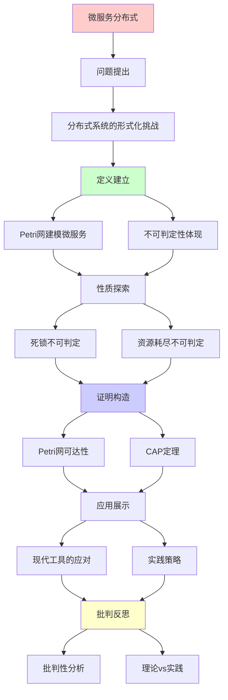
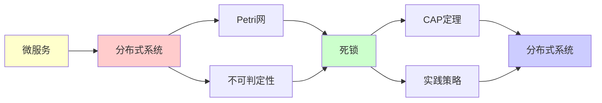

# 微服务与分布式系统中的递归可枚举性

> **主题**: Petri网视角看分布式系统
> **创建日期**: 2025-12-02
> **应用**: Kubernetes, Service Mesh, Event-driven架构
> **批判性**: 理论限制与工程实践

---

## 📋 目录

- [微服务与分布式系统中的递归可枚举性](#微服务与分布式系统中的递归可枚举性)
  - [📋 目录](#-目录)
  - [1. 分布式系统的形式化挑战](#1-分布式系统的形式化挑战)
    - [1.1 核心问题](#11-核心问题)
    - [1.2 Petri网的天然优势](#12-petri网的天然优势)
  - [2. Petri网建模微服务](#2-petri网建模微服务)
    - [2.1 例子：订单处理系统](#21-例子订单处理系统)
    - [2.2 Kubernetes编排](#22-kubernetes编排)
    - [2.3 事件驱动架构](#23-事件驱动架构)
  - [3. 不可判定性在实践中的体现](#3-不可判定性在实践中的体现)
    - [3.1 死锁不可判定](#31-死锁不可判定)
    - [3.2 资源耗尽不可判定](#32-资源耗尽不可判定)
    - [3.3 服务可达性](#33-服务可达性)
  - [4. 现代工具的应对](#4-现代工具的应对)
    - [4.1 Service Mesh (Istio)](#41-service-mesh-istio)
    - [4.2 Chaos Engineering](#42-chaos-engineering)
    - [4.3 Event Sourcing](#43-event-sourcing)
  - [5. 批判性分析](#5-批判性分析)
    - [5.1 理论 vs 实践](#51-理论-vs-实践)
    - [5.2 形式化验证在分布式系统](#52-形式化验证在分布式系统)
    - [5.3 CAP定理的启示](#53-cap定理的启示)
  - [🎯 关键要点](#-关键要点)
    - [理论层面](#理论层面)
    - [实践层面](#实践层面)
  - [📚 学习资源](#-学习资源)
    - [理论](#理论)
    - [实践](#实践)
    - [工具](#工具)
  - [🎯 本文立场](#-本文立场)
  - [6. 主题-子主题论证逻辑关系图](#6-主题-子主题论证逻辑关系图)
    - [6.1 论证依赖关系](#61-论证依赖关系)
    - [6.2 概念依赖关系](#62-概念依赖关系)
  - [7. 参考资源](#7-参考资源)
    - [7.1 经典论文](#71-经典论文)
    - [7.2 教材](#72-教材)
    - [7.3 在线资源](#73-在线资源)

---

## 1. 分布式系统的形式化挑战

### 1.1 核心问题

**微服务架构**的本质困难:

```text
服务A ─调用→ 服务B ─调用→ 服务C
  ↑                         │
  └─────────调用─────────────┘
```

**问题**:

- 会死锁吗？
- 会无限递归调用吗？
- 资源会耗尽吗？

**形式化视角**: 这是**可达性问题**！

### 1.2 Petri网的天然优势

**为什么Petri网适合**:

| 概念 | 微服务 | Petri网 |
|------|--------|---------|
| **服务实例** | Pod/Container | 令牌(Token) |
| **消息队列** | Kafka/RabbitMQ | 库所(Place) |
| **服务调用** | HTTP/gRPC | 变迁(Transition) |
| **并发** | 多请求 | 并发触发 |
| **资源限制** | CPU/Memory | 抑止弧 |

---

## 2. Petri网建模微服务

### 2.1 例子：订单处理系统

**业务流程**:

```text
下单 → 库存检查 → 支付 → 发货
       ↓ (库存不足)
       取消订单
```

**Petri网模型**:

```text
库所:
- p_order: 待处理订单
- p_inventory: 库存数量
- p_payment: 待支付
- p_shipping: 待发货
- p_cancelled: 已取消

变迁:
- t_check_inventory:
    输入: p_order, p_inventory
    输出: p_payment, p_inventory (归还)
    抑止弧: 如果 p_inventory=0 → 不触发

- t_cancel:
    输入: p_order
    抑止弧: p_inventory (库存=0时触发)
    输出: p_cancelled
```

### 2.2 Kubernetes编排

**Deployment ≈ Petri网**:

```yaml
apiVersion: apps/v1
kind: Deployment
spec:
  replicas: 3  # 库所p_pod的令牌数
  template:
    containers:
    - name: api-server
      resources:
        limits:
          cpu: "500m"  # 抑止弧：CPU资源限制
```

**对应Petri网**:

```text
p_cpu_pool: 10个令牌（集群总CPU）
p_pod: 3个令牌（运行中的Pod）

t_create_pod:
  输入: p_cpu_pool (消耗5个)
  输出: p_pod (1个)
  抑止弧: 如果 p_cpu_pool < 5 → 不触发
```

### 2.3 事件驱动架构

**Kafka主题 ≈ 库所**:

```text
Topic: order-created
       ↓ (消费)
服务: inventory-service
       ↓ (发布)
Topic: order-validated
       ↓
服务: payment-service
```

**Petri网**:

```text
p_order_created ─→ t_inventory ─→ p_order_validated
                     ↑
                  p_inventory (检查)
```

---

## 3. 不可判定性在实践中的体现

### 3.1 死锁不可判定

**理论**: 带抑止弧的Petri网，死锁问题不可判定

**实践体现**:

```text
服务A等待服务B响应
服务B等待服务A释放锁
→ 死锁！
```

**无法静态判定**: 是否所有可能的调用序列都无死锁

**工程解决**:

- ⚠️ 接受不可判定性
- ✅ 运行时检测（超时）
- ✅ Chaos Engineering（Netflix）

### 3.2 资源耗尽不可判定

**问题**: 系统是否会耗尽内存/连接/CPU？

**形式化**: Petri网的**有界性问题**

```text
{⟨N⟩ | ∃k ∀可达标识M: |M| ≤ k}
```

**状态**: 带抑止弧 → **不可判定**

**实践**:

- Netflix Chaos Monkey: 随机杀服务
- Kubernetes: 资源限制 + 监控
- 不预测，只应对

### 3.3 服务可达性

**问题**: 从状态A能否到达状态B？

**例子**: 订单从"待支付"能否到"已发货"？

**理论**: Petri网可达性

- 基本Petri网: 可判定（Mayr 1984）
- 带抑止弧: **不可判定**

**实践**:

- 分布式追踪（Jaeger, Zipkin）
- 观测 vs 预测
- 事后分析 vs 事前保证

---

## 4. 现代工具的应对

### 4.1 Service Mesh (Istio)

**理念**: 可观测性 > 可预测性

```text
不尝试证明"无死锁"
而是:
- 可视化所有调用（令牌流动）
- 实时监控
- 快速恢复
```

**Petri网视角**:

```text
Istio = Petri网的"运行时可视化"
令牌 = 请求
库所 = 服务队列
变迁 = 服务调用
```

### 4.2 Chaos Engineering

**Netflix方法**:

```text
1. 接受不可预测性
2. 随机注入故障
3. 验证系统韧性
```

**理论基础**:

- Petri网可达性不可判定
- ∴ 无法穷尽所有场景
- ∴ 用随机采样近似

### 4.3 Event Sourcing

**模式**: 存储所有事件，重建状态

```text
状态 = fold(初始状态, 事件序列)
```

**Petri网视角**:

```text
标识 M = 初始标识 M₀ + 触发序列
可达集 = μX.(M₀ ∪ fire(X))
```

**优势**:

- 可追溯
- 可重放
- 事后分析

**劣势**:

- 存储开销
- 查询慢

---

## 5. 批判性分析

### 5.1 理论 vs 实践

**理论**: 死锁、资源耗尽 **不可判定**

**实践**:

- 系统大多数时候**工作正常**
- 为什么？

**原因**:

1. **简化设计**: 避免复杂交互
2. **运行时保护**: 超时、熔断
3. **监控**: 提前发现问题
4. **冗余**: 允许失败

**启示**:
> "不可判定 → 不尝试完美预测
> 而是设计容错系统"

### 5.2 形式化验证在分布式系统

**TLA+** (Leslie Lamport):

- 形式化规范分布式协议
- 模型检测（有界）

**例子**: Raft共识算法

```tla
Next == \/ ReceiveVote
        \/ BecomeLeader
        \/ ...
```

**局限**:

- 只能检测**有界**行为
- 状态空间爆炸
- 不能证明"完全正确"

**批判**:
> "形式化有用，但不是银弹"

### 5.3 CAP定理的启示

**CAP定理** (Brewer):

```text
分布式系统最多满足:
- Consistency (一致性)
- Availability (可用性)
- Partition tolerance (分区容忍)
中的2个
```

**与不可判定性的联系**:

- 完美一致性 = 判定全局状态
- 网络分区时不可能
- ∴ 必须权衡

**Petri网视角**:

```text
CAP = 分布式Petri网的固有限制
不是工程问题，是理论边界
```

---

## 🎯 关键要点

### 理论层面

**Petri网 ≈ 分布式系统**:

- 库所 = 消息队列、资源池
- 令牌 = 服务实例、请求
- 变迁 = 服务调用
- 抑止弧 = 资源限制

**不可判定性**:

- 死锁、资源耗尽、可达性

### 实践层面

**工程策略**:

1. **不追求完美预测** → 运行时监控
2. **接受不确定性** → Chaos Engineering
3. **设计容错** → 熔断、重试、降级

**工具**:

- Istio: 可观测性
- Jaeger: 分布式追踪
- TLA+: 有界验证

---

## 📚 学习资源

### 理论

1. **Petri Nets** - Reisig
2. **分布式系统** - Tanenbaum

### 实践

1. **Designing Data-Intensive Applications** - Kleppmann
   - 现代分布式系统圣经
2. **Chaos Engineering** - Netflix论文

### 工具

1. **Istio文档**: istio.io
2. **TLA+**: lamport.azurewebsites.net/tla/tla.html

---

## 🎯 本文立场

**理论价值**: ⭐⭐⭐⭐

- Petri网是自然模型
- 不可判定性是根本

**实践价值**: ⭐⭐⭐⭐⭐

- 理解限制 → 设计更好
- 接受不确定 → 容错设计

**建议**:
> 理解理论限制（不可判定）
> 采用工程方法（监控、容错）
> 不追求不可能的完美

---

## 6. 主题-子主题论证逻辑关系图

### 6.1 论证依赖关系



### 6.2 概念依赖关系



**论证逻辑链条**：

1. **问题提出** (1节)：
   - 分布式系统的形式化挑战

2. **定义建立** (1.1-1.2, 2节)：
   - Petri网建模微服务

3. **性质探索** (3节)：
   - 不可判定性在实践中的体现

4. **证明构造** (贯穿全文)：
   - Petri网可达性和CAP定理

5. **应用展示** (4节)：
   - 现代工具的应对

6. **批判反思** (5节)：
   - 批判性分析

---

## 7. 参考资源

### 7.1 经典论文

1. **Peterson, J. L.** (1981). _Petri Net Theory and the Modeling of Systems_
   - Prentice Hall. ISBN 978-0136619833
   - Petri网理论教材

2. **Brewer, E. A.** (2000). "Towards Robust Distributed Systems"
   - _PODC 2000_. Keynote Address
   - CAP定理原始猜想

3. **Gilbert, S., & Lynch, N.** (2002). "Brewer's Conjecture and the Feasibility of Consistent, Available, Partition-Tolerant Web Services"
   - _ACM SIGACT News_, 33(2), 51-59
   - CAP定理形式化证明

### 7.2 教材

1. **Tanenbaum, A. S., & Van Steen, M.** (2017)
   - _Distributed Systems: Principles and Paradigms_ (3rd ed.)
   - Pearson. ISBN 978-1530281756
   - 分布式系统教材

2. **Kleppmann, M.** (2017)
   - _Designing Data-Intensive Applications: The Big Ideas Behind Reliable, Scalable, and Maintainable Systems_
   - O'Reilly Media. ISBN 978-1449373320
   - 数据密集型应用设计

### 7.3 在线资源

1. **Petri Net**
   - https://en.wikipedia.org/wiki/Petri_net
   - Petri网基本概念

2. **CAP Theorem**
   - https://en.wikipedia.org/wiki/CAP_theorem
   - CAP定理

3. **Kubernetes**
   - https://kubernetes.io/
   - Kubernetes文档

---

**最后更新**: 2025-12-04
**实践性**: ⭐⭐⭐⭐⭐
**批判性**: 理论指导实践，但不教条
**现实**: Petri网思想无处不在（虽不显式使用）
**状态**: ✅ 已添加主题-子主题论证逻辑关系图和参考资源章节
