# 类型系统与编程语言中的递归可枚举性

> **主题**: 从类型论到实际编程语言
> **创建日期**: 2025-12-02
> **核心**: 表达力 vs 可判定性权衡
> **批判性**: Turing完备的诅咒

---

## 📋 目录

- [类型系统与编程语言中的递归可枚举性](#类型系统与编程语言中的递归可枚举性)
  - [📋 目录](#-目录)
  - [1. 类型系统谱系](#1-类型系统谱系)
    - [1.1 表达力 vs 可判定性](#11-表达力-vs-可判定性)
    - [1.2 类型系统层级](#12-类型系统层级)
  - [2. 简单类型系统](#2-简单类型系统)
    - [2.1 Simply Typed Lambda Calculus (STLC)](#21-simply-typed-lambda-calculus-stlc)
    - [2.2 Gödel's System T](#22-gödels-system-t)
  - [3. 图灵完备类型系统](#3-图灵完备类型系统)
    - [3.1 无类型λ演算](#31-无类型λ演算)
    - [3.2 依赖类型 (Coq/Agda)](#32-依赖类型-coqagda)
  - [4. 实际语言的权衡](#4-实际语言的权衡)
    - [4.1 Haskell](#41-haskell)
    - [4.2 Rust](#42-rust)
    - [4.3 TypeScript](#43-typescript)
    - [4.4 Dhall (非图灵完备)](#44-dhall-非图灵完备)
  - [5. Rust所有权系统](#5-rust所有权系统)
    - [5.1 线性类型的实践](#51-线性类型的实践)
    - [5.2 借用检查器](#52-借用检查器)
    - [5.3 与线性逻辑的对应](#53-与线性逻辑的对应)
  - [6. 批判性分析](#6-批判性分析)
    - [6.1 图灵完备是诅咒？](#61-图灵完备是诅咒)
    - [6.2 实践语言的选择](#62-实践语言的选择)
    - [6.3 类型系统的未来](#63-类型系统的未来)
  - [🎯 关键要点](#-关键要点)
    - [理论层面](#理论层面)
    - [实践层面](#实践层面)
  - [📚 学习资源](#-学习资源)
    - [经典](#经典)
    - [实践](#实践)
    - [前沿](#前沿)
  - [🎯 本文立场](#-本文立场)
  - [7. 主题-子主题论证逻辑关系图](#7-主题-子主题论证逻辑关系图)
    - [7.1 论证依赖关系](#71-论证依赖关系)
    - [7.2 概念依赖关系](#72-概念依赖关系)
  - [8. 参考资源](#8-参考资源)
    - [8.1 经典论文](#81-经典论文)
    - [8.2 教材](#82-教材)
    - [8.3 在线资源](#83-在线资源)


---

## 1. 类型系统谱系

### 1.1 表达力 vs 可判定性

**根本权衡**:

```text
                可判定性
                    ↑
简单类型λ演算 ────────┤
(总终止)              │
                      │
System F ─────────────┤
(参数多态)            │
                      │
依赖类型 ─────────────┤ 表达力
(Coq/Agda)            │    ↓
                      │
无类型λ演算 ──────────┤
(图灵完备)            │
```

**深刻洞察**:
> 增强表达力 → 失去判定性
> 这是**固有的**，非工程问题

### 1.2 类型系统层级

| 系统 | 表达力 | 终止性 | 类型检查 | 实例 |
|------|--------|--------|----------|------|
| **简单类型** | 低 | ✅ 总终止 | ✅ 可判定 | Simply Typed LC |
| **System F** | 中 | ✅ 总终止 | ✅ 可判定 | Haskell (部分) |
| **System Fω** | 中高 | ✅ 总终止 | ✅ 可判定 | Haskell 类型族 |
| **依赖类型** | 高 | ⚠️ 部分 | ⚠️ 需证明 | Coq, Agda, Lean |
| **无类型** | 最高 | ❌ 不保证 | N/A | Scheme, Python |

---

## 2. 简单类型系统

### 2.1 Simply Typed Lambda Calculus (STLC)

**类型语法**:

```text
τ ::= Base | τ₁ → τ₂
```

**关键性质**:

1. **强标准化**: 所有项都终止
2. **类型检查可判定**: O(n) Hindley-Milner

**例子**:

```haskell
id :: a -> a
id x = x

-- 不能写无限递归（没有Y组合子的类型）
-- loop = loop  ❌ 类型错误！
```

### 2.2 Gödel's System T

**扩展STLC**: 添加自然数

```text
T ::= Nat | T₁ → T₂

原始递归:
rec : Nat → T → (Nat → T → T) → T
```

**性质**:

- ✅ 仍然强标准化
- ✅ 可定义所有**原始递归函数**
- ❌ 不能定义Ackermann函数（非原始递归）

**含义**:
> 限制递归 → 保证终止

---

## 3. 图灵完备类型系统

### 3.1 无类型λ演算

**极端**: 无类型 = 无限制

```scheme
;; Scheme (无类型)
(define (loop) (loop))  ; ✅ 合法，永不终止
```

**Y组合子**:

```scheme
(define Y
  (lambda (f)
    ((lambda (x) (f (x x)))
     (lambda (x) (f (x x))))))
```

**类型**: **无法**给Y组合子STLC类型！

**证明**（非形式）:

```text
Y :: (a → a) → a
Y f = (λx. f (x x)) (λx. f (x x))

x x 的类型?
x :: t → a
x :: t
∴ t = t → a ❌ 无限类型！
```

### 3.2 依赖类型 (Coq/Agda)

**权衡**: 表达力 + 部分可判定性

**Coq策略**:

1. **默认**: 强制终止性检查

   ```coq
   Fixpoint fact (n : nat) : nat :=
     match n with
     | 0 => 1
     | S n' => n * fact n'
     end.
   (* ✅ 终止性显然（结构归纳） *)
   ```

2. **选择性逃逸**: `Axiom` 或 `admit`

   ```coq
   Axiom magic : forall A, A.  (* 危险！ *)
   ```

**Agda策略**:

- 默认终止性检查
- `{-# NON_TERMINATING #-}` 标记

**批判**:
> "允许逃逸 → 失去形式保证
> 但实践需要灵活性"

---

## 4. 实际语言的权衡

### 4.1 Haskell

**类型系统**: System F + 扩展

**终止性**: ❌ 不保证

```haskell
-- 可以写无限递归
loop = loop

-- 可以写部分函数
head :: [a] -> a
head (x:xs) = x
head [] = error "empty list"  -- 运行时错误
```

**权衡**: 表达力 > 完全安全

### 4.2 Rust

**核心**: 所有权系统 + 线性类型

```rust
fn take_ownership(s: String) {
    // s 被移动
}

let s = String::from("hello");
take_ownership(s);
// s 不可再用 ✓ 编译时保证
```

**终止性**: ❌ 不保证（图灵完备）

```rust
loop { }  // ✅ 合法，永不终止
```

**但**: 内存安全、线程安全 **可判定**！

**批判**:
> "放弃完全终止性检查
> 换取内存安全可判定性
> 这是明智的权衡"

### 4.3 TypeScript

**类型系统**: 结构化类型

**图灵完备**: ✅ 类型级计算！

```typescript
type Ack<M, N> = M extends 0
  ? Succ<N>
  : N extends 0
    ? Ack<Pred<M>, 1>
    : Ack<Pred<M>, Ack<M, Pred<N>>>;

// 类型检查可能不终止！
```

**问题**: 类型检查器可能**挂起**

**解决**: 递归深度限制

**批判**:
> "TypeScript的图灵完备是Bug还是Feature？
> 强大但危险"

### 4.4 Dhall (非图灵完备)

**设计目标**: 配置语言，**保证终止**

**限制**:

- ❌ 无通用递归
- ✅ 只有原始递归
- ✅ 类型检查总终止

**例子**:

```dhall
let factorial = λ(n : Natural) →
  Natural/fold n Natural (λ(x : Natural) → x + 1) 1

-- ✅ 保证终止
-- ❌ 不能定义Ackermann
```

**适用**: Kubernetes配置、CI/CD

**批判**:
> "放弃图灵完备 → 获得安全性
> 这对配置语言是正确选择"

---

## 5. Rust所有权系统

### 5.1 线性类型的实践

**理论**: 线性逻辑 (Girard 1987)

**Rust应用**:

```rust
fn consume(s: String) {
    // s 被消费，使用1次
}

let s = String::from("hello");
consume(s);
// consume(s); ❌ 编译错误：s已被移动
```

**线性类型**:
> 值必须使用恰好1次
> （或明确 Clone/Copy）

### 5.2 借用检查器

**规则**:

1. 多个不可变借用 OR 一个可变借用
2. 引用生命周期不超过所有者

**形式化**:

```text
Γ ⊢ e : T @ κ
其中 κ = 生命周期
```

**可判定性**: ✅ 编译时检查

**批判**:
> "Rust = 受限的类型系统
> 限制 → 安全保证
> 这是有意的设计"

### 5.3 与线性逻辑的对应

| 线性逻辑 | Rust类型系统 |
|----------|--------------|
| A ⊗ B | (A, B) 元组 |
| A ⊸ B | FnOnce(A)->B |
| !A | Clone/Copy trait |
| A & B | (&A, &B) 借用 |

**深刻**:
> Rust = 线性逻辑的实际应用
> Curry-Howard-Lambek在系统编程中

---

## 6. 批判性分析

### 6.1 图灵完备是诅咒？

**传统观点**: 图灵完备 = 好（强大）

**批判视角**:

- ❌ 类型检查可能不终止
- ❌ 无法保证程序终止
- ❌ Rice定理 → 无法判定语义性质

**例子**: C++ 模板图灵完备

```cpp
template<int N>
struct Factorial {
    static const int value = N * Factorial<N-1>::value;
};

template<>
struct Factorial<0> {
    static const int value = 1;
};

// 编译时计算，但可能不终止！
```

### 6.2 实践语言的选择

**案例1: Haskell**

- 选择: 图灵完备（表达力）
- 代价: 类型检查可能不终止（实践中罕见）

**案例2: Rust**

- 选择: 图灵完备 + 所有权（安全）
- 代价: 学习曲线陡峭

**案例3: Dhall**

- 选择: 非图灵完备（安全）
- 代价: 表达力受限

**启示**:
> "没有完美语言
> 只有适合场景的权衡"

### 6.3 类型系统的未来

**趋势**（2025）:

- ✅ 更强的类型（依赖类型逐渐主流）
- ✅ 更好的推导（Hindley-Milner扩展）
- ⚠️ 平衡表达力与可判定性

**可能方向**:

1. **分层系统**: 核心可判定，扩展图灵完备
2. **效应系统**: 跟踪副作用
3. **形式化验证**: IDE集成Coq/Lean

**批判**:
> "类型系统军备竞赛
> 可能永无终点
> 因为Gödel/Turing限制"

---

## 🎯 关键要点

### 理论层面

**类型系统 ≈ 逻辑系统**:

- 简单类型 = 原始递归
- 依赖类型 = 高阶逻辑
- 图灵完备 = 不可判定

**Curry-Howard**:

```text
类型检查 = 证明验证
类型推导 = 定理证明
```

### 实践层面

**选择原则**:

1. **配置/规范**: 非图灵完备（Dhall, YAML）
2. **应用开发**: 图灵完备 + 强类型（Rust, Haskell）
3. **形式化**: 依赖类型（Coq, Lean）

**权衡**:

- 表达力 ↑ → 保证 ↓
- 安全性 ↑ → 灵活性 ↓

---

## 📚 学习资源

### 经典

1. **Pierce** - Types and Programming Languages
   - 类型系统圣经
2. **Harper** - Practical Foundations for Programming Languages
   - CMU课程教材

### 实践

1. **Rust Book**: doc.rust-lang.org
2. **Haskell Wiki**: wiki.haskell.org
3. **Dhall**: dhall-lang.org

### 前沿

1. **Lean 4**: 依赖类型实践
2. **Idris**: 依赖类型编程

---

## 🎯 本文立场

**类型系统的价值**:

- ✅ 编译时捕获bug
- ✅ 文档与约束
- ✅ 优化机会

**现实评估**:

- ⚠️ 不是银弹
- ⚠️ 学习成本
- ⚠️ 表达力权衡

**建议**:
> 理解类型系统的理论限制
> 选择适合项目的权衡
> 不盲目追求"最强"类型系统

---

## 7. 主题-子主题论证逻辑关系图

### 7.1 论证依赖关系

```mermaid
graph TD
    A[类型系统] --> B[问题提出]
    B --> C[类型系统谱系]

    C --> D[定义建立]
    D --> D1[表达力vs可判定性]
    D --> D2[类型系统层级]

    D1 --> E[性质探索]
    D2 --> E
    E --> E1[简单类型系统]
    E --> E2[图灵完备类型系统]

    E1 --> F[证明构造]
    E2 --> F
    F --> F1[类型检查]
    F --> F2[Rust所有权系统]

    F1 --> G[应用展示]
    F2 --> G
    G --> G1[实际语言的权衡]
    G --> G2[类型系统实践]

    G1 --> H[批判反思]
    G2 --> H
    H --> H1[批判性分析]
    H --> H2[图灵完备的诅咒]

    style A fill:#ffcccc
    style D fill:#ccffcc
    style F fill:#ccccff
    style H fill:#ffffcc
```



### 7.2 概念依赖关系

```mermaid
graph LR
    A[类型系统] --> B[表达力]

    B --> C[可判定性]
    B --> D[图灵完备]

    C --> E[Rust所有权]
    D --> E

    E --> F[实践语言]
    E --> G[递归理论]

    F --> H[类型系统实践]
    G --> H

    style A fill:#ffffcc
    style B fill:#ffcccc
    style E fill:#ccffcc
    style H fill:#ccccff
```



**论证逻辑链条**：

1. **问题提出** (1节)：
   - 类型系统谱系

2. **定义建立** (1.1-1.2节)：
   - 表达力vs可判定性和类型系统层级

3. **性质探索** (2-3节)：
   - 简单类型系统（2节）
   - 图灵完备类型系统（3节）

4. **证明构造** (5节)：
   - Rust所有权系统

5. **应用展示** (4节)：
   - 实际语言的权衡

6. **批判反思** (6节)：
   - 批判性分析

---

## 8. 参考资源

### 8.1 经典论文

1. **Hindley, J. R.** (1969). "The Principal Type-Scheme of an Object in Combinatory Logic"
   - _Transactions of the American Mathematical Society_, 146, 29-60
   - Hindley-Milner类型推导

2. **Milner, R.** (1978). "A Theory of Type Polymorphism in Programming"
   - _Journal of Computer and System Sciences_, 17(3), 348-375
   - 多态类型系统

3. **Girard, J.-Y.** (1972). "Interprétation fonctionnelle et élimination des coupures de l'arithmétique d'ordre supérieur"
   - Thèse de doctorat, Université Paris VII
   - System F

### 8.2 教材

1. **Pierce, B. C.** (2002)
   - _Types and Programming Languages_
   - MIT Press. ISBN 978-0262162098
   - 类型系统教材

2. **Harper, R.** (2016)
   - _Practical Foundations for Programming Languages_ (2nd ed.)
   - Cambridge University Press. ISBN 978-1107150300
   - 编程语言基础

3. **Rust Book**
   - https://doc.rust-lang.org/book/
   - Rust官方教程

### 8.3 在线资源

1. **Type System**
   - https://en.wikipedia.org/wiki/Type_system
   - 类型系统基本概念

2. **Hindley-Milner Type Inference**
   - https://en.wikipedia.org/wiki/Hindley%E2%80%93Milner_type_system
   - Hindley-Milner类型推导

3. **Rust Ownership**
   - https://doc.rust-lang.org/book/ch04-00-understanding-ownership.html
   - Rust所有权系统

---

**最后更新**: 2025-12-04
**实践性**: ⭐⭐⭐⭐⭐
**批判性**: 类型系统有价值，但有限制
**建议**: Rust ≈ 当前最佳平衡（2025）
**状态**: ✅ 已添加主题-子主题论证逻辑关系图和参考资源章节
