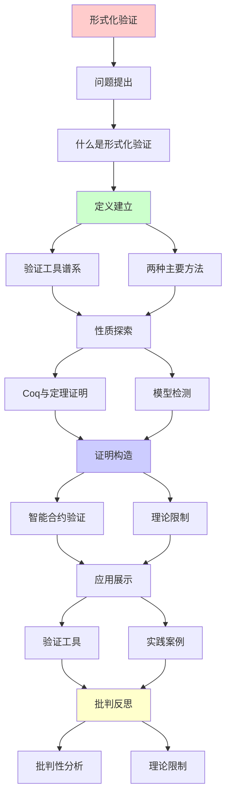
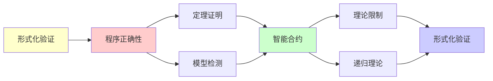

# 形式化验证中的递归可枚举性

> **主题**: 程序正确性的形式化证明
> **创建日期**: 2025-12-02
> **核心**: 理论限制与实践方法
> **批判性**: 形式化验证不是银弹

---

## 📋 目录

- [形式化验证中的递归可枚举性](#形式化验证中的递归可枚举性)
  - [📋 目录](#-目录)
  - [1. 什么是形式化验证](#1-什么是形式化验证)
    - [1.1 定义](#11-定义)
    - [1.2 两种主要方法](#12-两种主要方法)
  - [2. 验证工具谱系](#2-验证工具谱系)
    - [2.1 工具分类](#21-工具分类)
    - [2.2 递归可枚举性的体现](#22-递归可枚举性的体现)
  - [3. Coq与定理证明](#3-coq与定理证明)
    - [3.1 Coq工作流](#31-coq工作流)
    - [3.2 Curry-Howard的实践](#32-curry-howard的实践)
    - [3.3 实际案例](#33-实际案例)
  - [4. 模型检测](#4-模型检测)
    - [4.1 TLA+ (Leslie Lamport)](#41-tla-leslie-lamport)
    - [4.2 SPIN](#42-spin)
    - [4.3 状态爆炸](#43-状态爆炸)
  - [5. 智能合约验证](#5-智能合约验证)
    - [5.1 为什么关键](#51-为什么关键)
    - [5.2 形式化方法](#52-形式化方法)
    - [5.3 批判现实](#53-批判现实)
  - [6. 理论限制](#6-理论限制)
    - [6.1 Rice定理的阴影](#61-rice定理的阴影)
    - [6.2 Gödel不完备定理](#62-gödel不完备定理)
    - [6.3 停机问题](#63-停机问题)
  - [7. 批判性分析](#7-批判性分析)
    - [7.1 成功案例 vs 普遍性](#71-成功案例-vs-普遍性)
    - [7.2 完整性的幻觉](#72-完整性的幻觉)
    - [7.3 工业采用情况](#73-工业采用情况)
    - [7.4 未来趋势](#74-未来趋势)
  - [🎯 关键要点](#-关键要点)
    - [理论层面](#理论层面)
    - [实践层面](#实践层面)
  - [📚 学习资源](#-学习资源)
    - [定理证明](#定理证明)
    - [模型检测](#模型检测)
    - [智能合约](#智能合约)
  - [🎯 本文立场](#-本文立场)
  - [8. 主题-子主题论证逻辑关系图](#8-主题-子主题论证逻辑关系图)
    - [8.1 论证依赖关系](#81-论证依赖关系)
    - [7.2 概念依赖关系](#72-概念依赖关系)
  - [9. 参考资源](#9-参考资源)
    - [9.1 经典论文](#91-经典论文)
    - [9.2 教材](#92-教材)
    - [9.3 在线资源](#93-在线资源)

---

## 1. 什么是形式化验证

### 1.1 定义

**形式化验证**: 用数学方法证明程序满足规范

**与测试对比**:

| 维度 | 测试 | 形式化验证 |
|------|------|------------|
| **覆盖** | 部分输入 | 所有输入 |
| **保证** | bug的存在 | bug的不存在 |
| **成本** | 低 | 高 |
| **适用** | 一般程序 | 关键系统 |

### 1.2 两种主要方法

**1. 定理证明** (Theorem Proving):

```text
程序 + 规范 → 人工证明 → 正确性保证
工具: Coq, Lean, Isabelle
```

**2. 模型检测** (Model Checking):

```text
程序 + 规范 → 自动搜索 → 反例或正确
工具: SPIN, TLA+, NuSMV
```

---

## 2. 验证工具谱系

### 2.1 工具分类

**按自动化程度**:

```text
                自动化
                  ↑
模型检测 ─────────┤ (自动，有界)
(SPIN, TLA+)      │
                  │
SMT求解器 ────────┤ (自动，理论限制)
(Z3, CVC5)        │
                  │
定理证明器 ───────┤ (交互，完全)
(Coq, Lean)       │
                  ↓
               表达力
```

### 2.2 递归可枚举性的体现

**模型检测**:

- 搜索有界状态空间
- 状态爆炸 = RE的实践体现
- 不可判定 → 有界近似

**定理证明**:

- 类型检查 = 证明验证
- Coq的CiC = 依赖类型
- 类型检查可能不终止（依赖类型）

---

## 3. Coq与定理证明

### 3.1 Coq工作流

**步骤**:

```coq
(* 1. 定义程序 *)
Fixpoint factorial (n : nat) : nat :=
  match n with
  | 0 => 1
  | S n' => n * factorial n'
  end.

(* 2. 陈述规范 *)
Theorem fact_positive : forall n, factorial n > 0.

(* 3. 交互式证明 *)
Proof.
  induction n.
  - (* n = 0 *) simpl. omega.
  - (* n = S n' *) simpl.
    apply Nat.mul_pos_pos.
    + omega.
    + apply IHn.
Qed.
```

### 3.2 Curry-Howard的实践

**深刻洞察**:

```text
定理: forall n, factorial n > 0
证明: 归纳法
类型: Π(n:Nat). factorial(n) > 0

→ 证明 = 依赖类型的项
→ 写证明 = 写程序
```

### 3.3 实际案例

**CompCert** (C编译器):

- 4万行Coq证明
- 保证编译器正确性
- 编译结果与源语义一致

**seL4** (微内核):

- 操作系统内核
- 完全形式化验证
- 10人年工作

**批判**:
> "成本巨大（CompCert: ~6人年）
> 只适用于关键系统"

---

## 4. 模型检测

### 4.1 TLA+ (Leslie Lamport)

**用途**: 分布式协议验证

**例子**: Raft共识算法

```tla
Init == /\ currentTerm = 0
        /\ votedFor = Nil
        /\ log = <<>>

Next == \/ RequestVote
        \/ AppendEntries
        \/ BecomeLeader

Spec == Init /\ [][Next]_vars
```

**检测**:

```text
TLC (模型检测器) 搜索状态空间
找反例或验证有界正确性
```

### 4.2 SPIN

**应用**: 并发协议

**Promela语言**:

```promela
active proctype Producer() {
  do
  :: queue!msg -> produced++
  od
}

active proctype Consumer() {
  do
  :: queue?msg -> consumed++
  od
}

ltl no_loss { [](produced == consumed) }
```

**验证**: LTL性质（线性时序逻辑）

### 4.3 状态爆炸

**问题**: 状态数指数增长

**例子**: n个布尔变量 → 2ⁿ个状态

**对策**:

1. **部分序约简**: 减少等价状态
2. **抽象**: 忽略细节
3. **有界检测**: 限制深度

**理论根源**:
> 可达性问题的复杂度
> Petri网: 带抑止弧 → 不可判定

---

## 5. 智能合约验证

### 5.1 为什么关键

**智能合约特点**:

- 不可更改（部署后）
- 控制资金（高价值）
- 公开代码（黑客target）

**2016-2024损失**: 数十亿美元

**案例**: The DAO (2016)

```solidity
// 重入漏洞
function withdraw() {
    uint amount = balances[msg.sender];
    msg.sender.call.value(amount)();  // 危险！
    balances[msg.sender] = 0;  // 太晚了
}
```

### 5.2 形式化方法

**1. Coq验证** (学术):

```coq
Definition withdraw (state : State) (caller : Address) : State :=
  (* 形式化定义 *)

Theorem withdraw_safe :
  forall s c, balance_nonneg s -> balance_nonneg (withdraw s c).
```

**2. SMT求解器** (实用):

```python
# Python + Z3
from z3 import *

balance = Int('balance')
amount = Int('amount')

solver = Solver()
solver.add(balance >= 0)
solver.add(amount > balance)  # 尝试超额提取

if solver.check() == sat:
    print("找到漏洞!")
```

**3. 符号执行** (Mythril, Slither):

- 自动分析合约
- 找常见漏洞模式
- 启发式，不完全

### 5.3 批判现实

**形式化验证**:

- ✅ 理论上完美
- ❌ 成本极高
- ⚠️ 需要精确规范

**实践** (2025):

- 大多数合约: 审计 + 测试
- 关键合约: 形式化（部分）
- 工具: 主要是启发式检测

**批判**:
> "形式化验证存在
> 但昂贵且难
> 不是所有项目都需要"

---

## 6. 理论限制

### 6.1 Rice定理的阴影

**Rice定理**: 所有语义性质不可判定

**对验证的影响**:

```text
不能自动验证:
❌ 程序是否满足任意规范
❌ 程序是否等价
❌ 程序是否最优
```

**能做什么**:

```text
✅ 类型检查（语法性质）
✅ 有界模型检测
✅ 特定规范的证明（人工）
```

### 6.2 Gödel不完备定理

**影响**: 形式系统不完备

**含义**:

- 存在真但不可证的性质
- 某些程序性质可能永远无法形式化

**实践**:

- 大多数实际性质**可以**证明
- 极端情况可能遇到限制

### 6.3 停机问题

**根本限制**: 不能判定程序是否停机

**对验证的影响**:

- 不能自动验证"总终止"
- 需要人工提供终止性证明
- Coq强制提供（结构归纳）

---

## 7. 批判性分析

### 7.1 成功案例 vs 普遍性

**成功**: CompCert, seL4, 智能合约

**成本**:

- CompCert: ~6人年
- seL4: ~10人年
- 单个智能合约: 数周到数月

**批判**:
> "形式化验证**可行**
> 但对大多数项目**不经济**"

### 7.2 完整性的幻觉

**问题**: "形式化验证 = 完全正确"？

**现实**:

- 规范可能错误
- 模型可能不完整
- 验证工具可能有bug

**例子**: seL4

- 内核形式化 ✅
- 但驱动程序未验证 ❌

**批判**:
> "形式化验证的正确性
> 依赖于规范的正确性
> 'Garbage in, garbage out'"

### 7.3 工业采用情况

**2025年现状**:

**高度采用**:

- ✅ 航空航天（关键系统）
- ✅ 密码学（协议验证）
- ⚠️ 区块链（高价值合约）

**有限采用**:

- ⚠️ 金融系统（部分）
- ❌ 一般应用开发

**原因**:

- 成本高
- 专业技能稀缺
- 工具不成熟

**批判**:
> "形式化验证像F1赛车：
> 技术先进，但不是日常交通工具"

### 7.4 未来趋势

**乐观** (AI辅助):

- AI生成证明（AlphaProof 2024）
- 降低人工成本
- 工具更智能

**悲观** (固有限制):

- Rice定理不会消失
- 停机问题永远存在
- 规范仍需人工

**现实** (渐进采用):

- 关键系统: 全面验证
- 一般系统: 类型检查 + 测试
- 混合方法（最可能）

---

## 🎯 关键要点

### 理论层面

**形式化验证面临的根本限制**:

- Rice定理: 语义性质不可判定
- 停机问题: 终止性不可判定
- Gödel: 不完备性

**能做什么**:

- 类型系统（可判定）
- 人工证明（交互）
- 有界检测（近似）

### 实践层面

**权衡**:

```text
成本 vs 保证
时间 vs 正确性
自动化 vs 完整性
```

**选择指南**:

- 关键系统: 形式化
- 一般系统: 类型 + 测试
- 配置: 受限语言（Dhall）

---

## 📚 学习资源

### 定理证明

1. **Software Foundations** (Coq)
   - 免费，最佳入门
2. **Concrete Semantics** (Isabelle)
   - 语义学 + 验证

### 模型检测

1. **TLA+**: learntla.com
2. **SPIN**: spinroot.com

### 智能合约

1. **Certora**: certora.com (商业)
2. **K Framework**: 形式化EVM

---

## 🎯 本文立场

**形式化验证的价值**:

- ✅ 最强的正确性保证
- ✅ 关键系统必需
- ✅ 理论上完美

**现实评估**:

- ❌ 成本极高
- ❌ 专业技能稀缺
- ⚠️ 不适合所有项目

**建议**:
> 理解形式化验证的能力与限制
> 关键系统采用（航空、金融、区块链）
> 一般系统: 类型系统 + 测试足够

**实践智慧**:

```text
"形式化验证 = 最后一道防线，不是第一道"
先: 好的设计 + 类型系统
再: 充分测试
最后: 关键部分形式化验证
```

---

## 8. 主题-子主题论证逻辑关系图

### 8.1 论证依赖关系



### 7.2 概念依赖关系



**论证逻辑链条**：

1. **问题提出** (1节)：
   - 什么是形式化验证

2. **定义建立** (1.1-1.2, 2节)：
   - 定义和验证工具谱系

3. **性质探索** (3-4节)：
   - Coq与定理证明（3节）
   - 模型检测（4节）

4. **证明构造** (5-6节)：
   - 智能合约验证（5节）
   - 理论限制（6节）

5. **应用展示** (贯穿全文)：
   - 验证工具和实践案例

6. **批判反思** (7节)：
   - 批判性分析

---

## 9. 参考资源

### 9.1 经典论文

1. **Hoare, C. A. R.** (1969). "An Axiomatic Basis for Computer Programming"
   - _Communications of the ACM_, 12(10), 576-580
   - Hoare逻辑

2. **Floyd, R. W.** (1967). "Assigning Meanings to Programs"
   - _Proceedings of Symposia in Applied Mathematics_, 19, 19-32
   - 程序验证基础

3. **Lamport, L.** (2002). _Specifying Systems: The TLA+ Language and Tools for Hardware and Software Engineers_
   - Addison-Wesley. ISBN 978-0321143068
   - TLA+规范语言

### 9.2 教材

1. **Pierce, B. C., et al.** (2018)
   - _Software Foundations_ (Vol. 1-4)
   - Available at https://softwarefoundations.cis.upenn.edu/
   - Coq形式化验证教程

2. **Nipkow, T., Klein, G.** (2014)
   - _Concrete Semantics: With Isabelle/HOL_
   - Springer. ISBN 978-3319105418
   - Isabelle/HOL教程

3. **Lamport, L.** (2002)
   - _Specifying Systems: The TLA+ Language and Tools for Hardware and Software Engineers_
   - Addison-Wesley. ISBN 978-0321143068
   - TLA+教材

### 9.3 在线资源

1. **Coq**
   - https://coq.inria.fr/
   - Coq证明助手

2. **TLA+**
   - https://lamport.azurewebsites.net/tla/tla.html
   - TLA+工具

3. **Formal Verification**
   - https://en.wikipedia.org/wiki/Formal_verification
   - 形式化验证基本概念

---

**最后更新**: 2025-12-04
**实践性**: ⭐⭐⭐⭐⭐
**批判性**: 有价值但有代价，选择需权衡
**建议**: CompCert/seL4案例学习，理解成本
**状态**: ✅ 已添加主题-子主题论证逻辑关系图和参考资源章节
