# 数据库理论与查询语言中的递归可枚举性

> **主题**: SQL的计算理论基础
> **创建日期**: 2025-12-02
> **核心**: 查询语言表达力与复杂度
> **实践性**: ⭐⭐⭐⭐⭐

---

## 📋 目录

- [数据库理论与查询语言中的递归可枚举性](#数据库理论与查询语言中的递归可枚举性)
  - [📋 目录](#-目录)
  - [1. 数据库查询的计算视角](#1-数据库查询的计算视角)
    - [1.1 关系代数 = 形式语言](#11-关系代数--形式语言)
    - [1.2 SQL的图灵完备性](#12-sql的图灵完备性)
  - [2. 查询复杂度层次](#2-查询复杂度层次)
    - [2.1 数据复杂度 vs 查询复杂度](#21-数据复杂度-vs-查询复杂度)
    - [2.2 SQL查询的PH层次](#22-sql查询的ph层次)
  - [3. 递归查询](#3-递归查询)
    - [3.1 WITH RECURSIVE](#31-with-recursive)
    - [3.2 Datalog与不动点](#32-datalog与不动点)
  - [4. 事务与并发](#4-事务与并发)
    - [4.1 ACID与形式化](#41-acid与形式化)
    - [4.2 并发控制的不可判定性](#42-并发控制的不可判定性)
  - [5. 实际系统](#5-实际系统)
    - [5.1 主流数据库](#51-主流数据库)
    - [5.2 NoSQL的计算模型](#52-nosql的计算模型)
  - [6. 批判性分析](#6-批判性分析)
    - [6.1 理论vs实践](#61-理论vs实践)
    - [6.2 查询优化的限制](#62-查询优化的限制)
    - [6.3 未来方向](#63-未来方向)
  - [📚 参考文献](#-参考文献)
    - [数据库理论](#数据库理论)
    - [SQL标准](#sql标准)
    - [复杂度理论](#复杂度理论)
    - [在线资源](#在线资源)
  - [🎯 关键要点](#-关键要点)
    - [理论层面](#理论层面)
    - [实践层面](#实践层面)
    - [技术镜像](#技术镜像)
  - [7. 主题-子主题论证逻辑关系图](#7-主题-子主题论证逻辑关系图)
    - [7.1 论证依赖关系](#71-论证依赖关系)
    - [7.2 概念依赖关系](#72-概念依赖关系)
  - [8. 参考资源](#8-参考资源)
    - [8.1 经典论文](#81-经典论文)
    - [8.2 教材](#82-教材)
    - [8.3 在线资源](#83-在线资源)

---

## 1. 数据库查询的计算视角

### 1.1 关系代数 = 形式语言

**关系代数操作**:

```text
σ (选择): σ_{age>18}(Students)
π (投影): π_{name,id}(Students)
⨝ (连接): Students ⨝ Courses
∪, ∩, − (集合运算)
```

**与形式语言对应**:

```text
关系代数     形式语言
─────────────────────────
关系         语言
元组         字符串
查询         文法/自动机
```

**表达力**:

```text
基本关系代数:
- 不能表达传递闭包 ❌
- 仅等价于一阶逻辑
- 无递归能力

SQL (有递归):
- 图灵完备 ✅ (WITH RECURSIVE)
- 可表达RE语言
```

### 1.2 SQL的图灵完备性

**SQL + WITH RECURSIVE = 图灵完备**

**示例**: 计算阶乘

```sql
WITH RECURSIVE factorial(n, result) AS (
  -- 基础情况
  SELECT 0, 1
  UNION ALL
  -- 递归步骤
  SELECT n+1, (n+1)*result
  FROM factorial
  WHERE n < 10
)
SELECT * FROM factorial;
```

**等价性**:

```text
WITH RECURSIVE ↔ 最小不动点 (μ)
             ↔ Y组合子
             ↔ 图灵机循环

参考: [00.4 不动点理论](../00_核心理论体系/00.4_不动点理论.md)
```

**实践限制**:

```text
PostgreSQL, MySQL:
- 限制递归深度 (防止无限)
- 检测循环
- 超时机制

→ 有界图灵机 (实践中)
→ 理论上图灵完备
```

---

## 2. 查询复杂度层次

### 2.1 数据复杂度 vs 查询复杂度

**数据复杂度**: 查询固定，数据大小变化

```text
简单SELECT: O(n) (扫描)
JOIN: O(n²) (嵌套循环) 或 O(n log n) (索引)
嵌套子查询: 指数级
```

**查询复杂度**: 数据固定，查询表达式大小变化

```text
一般SQL查询: PSPACE-完全 ❌

原因: 嵌套深度可达查询大小
```

### 2.2 SQL查询的PH层次

**查询分类** (按量词复杂度):

```text
Σ₁ᴾ (NP):
  SELECT ... WHERE EXISTS (...)
  单层EXISTS子查询

Π₁ᴾ (co-NP):
  SELECT ... WHERE NOT EXISTS (...)
  或 FORALL (伪造的)

Σ₂ᴾ:
  SELECT ... WHERE EXISTS (
    SELECT ... WHERE FORALL ...
  )
  两层量词交替

参考: [04.6 多项式层级](../04_复杂度与表达力/04.6_多项式层级PH.md)
```

**实例**:

```sql
-- Σ₂ᴾ查询: "存在分组使得所有元素满足..."
SELECT dept
FROM employees e1
WHERE EXISTS (
  SELECT 1 FROM projects p
  WHERE NOT EXISTS (
    SELECT 1 FROM employees e2
    WHERE e2.dept = e1.dept
      AND NOT has_worked_on(e2, p)
  )
);
-- ∃项目p ∀部门员工 都做过p
```

---

## 3. 递归查询

### 3.1 WITH RECURSIVE

**传递闭包示例**:

```sql
-- 计算组织层级的传递闭包
WITH RECURSIVE transitive_closure(manager, employee) AS (
  -- 基础: 直接下属
  SELECT manager_id, employee_id
  FROM direct_reports

  UNION ALL

  -- 递归: 间接下属
  SELECT tc.manager, dr.employee_id
  FROM transitive_closure tc
  JOIN direct_reports dr ON tc.employee = dr.manager_id
)
SELECT * FROM transitive_closure;
```

**不动点语义**:

```text
TC = μR. (Base ∪ Step(R))

Base = SELECT manager, employee FROM direct_reports
Step(R) = SELECT tc.manager, dr.employee
          FROM R tc JOIN ...

不动点计算:
R₀ = ∅
R₁ = Base
R₂ = Base ∪ Step(R₁)
...
Rₙ = Rₙ₊₁ (不动点！)

参考: [00.4 不动点理论](../00_核心理论体系/00.4_不动点理论.md)
```

### 3.2 Datalog与不动点

**Datalog**: 数据库的逻辑编程语言

**例子**: 可达性

```prolog
% 可达性规则
reachable(X, Y) :- edge(X, Y).
reachable(X, Z) :- edge(X, Y), reachable(Y, Z).

% 查询
?- reachable(a, d).
```

**语义**:

```text
最小不动点语义:
  Reach = μR. (Edges ∪ Compose(Edges, R))

计算:
  R₀ = ∅
  R₁ = Edges
  R₂ = Edges ∪ Compose(Edges, Edges)
  ...
  直到不动点

保证终止: Datalog不允许否定递归
```

**表达力**:

```text
Datalog (无否定):
  = 单调Datalog
  = 表达P中的问题
  = 总终止 ✅

Datalog (有分层否定):
  = 可表达部分NP
  = 仍保证终止

Datalog (任意否定):
  = 图灵完备 ⚠️
  = 可能不终止
```

---

## 4. 事务与并发

### 4.1 ACID与形式化

**ACID属性**:

```text
Atomicity (原子性):
  - 全或无
  - 事务 = 不可分割单元

Consistency (一致性):
  - 约束保持
  - 不变量维护

Isolation (隔离性):
  - 并发事务互不影响
  - 可串行化

Durability (持久性):
  - 提交后永久
```

**形式化建模**:

```text
事务 = 状态转移函数
  T: State → State

ACID = 状态机性质
  - Atomic: T不可分割
  - Consistent: Inv(s) → Inv(T(s))
  - Isolated: 可串行化调度
  - Durable: 提交→不可撤销

可用Petri网建模:
参考: [01.2 Petri网理论](../01_形式系统详解/01.2_Petri网理论.md)
```

### 4.2 并发控制的不可判定性

**可串行化判定**:

```text
问题: 给定并发调度，是否可串行化？

对于一般事务:
  → 不可判定 ❌ (Rice定理)

原因:
  - 事务可包含任意程序
  - 语义性质不可判定

实践:
  - 限制事务类型
  - 2PL, MVCC等协议
  - 保守近似 (允许误报)

参考: [04.4 Rice定理](../04_复杂度与表达力/04.4_Rice定理.md)
```

**死锁检测**:

```text
理论: 一般情况不可判定
实践: 等待图检测 (特定场景)

应对:
- 超时回滚
- 死锁检测器 (启发式)
- 避免策略 (资源排序)

参考: [06.3 微服务与分布式](06.3_微服务与分布式系统.md)
```

---

## 5. 实际系统

### 5.1 主流数据库

**PostgreSQL**:

- WITH RECURSIVE ✅
- CTE (Common Table Expressions)
- 完整SQL:2011标准

**MySQL**:

- WITH RECURSIVE (8.0+) ✅
- 之前: 存储过程模拟

**SQLite**:

- WITH RECURSIVE ✅
- 轻量但功能完整

**Oracle**:

- CONNECT BY (专有递归语法)
- WITH也支持

### 5.2 NoSQL的计算模型

**MongoDB聚合管道**:

```javascript
db.collection.aggregate([
  {$match: {...}},
  {$group: {...}},
  {$sort: {...}}
])
```

**表达力**:

- 基本操作: 关系代数子集
- 聚合: 扩展能力
- 无递归: **非图灵完备** ✅

**批判**:

> NoSQL牺牲表达力换性能
> 适合特定场景
> 复杂查询仍需SQL

---

## 6. 批判性分析

### 6.1 理论vs实践

**理论**:

- SQL图灵完备
- 查询复杂度PSPACE

**实践**:

- 大多查询在P或NP
- 递归查询罕见
- 优化器启发式

**批判**:

> 图灵完备 = 理论上可能
> 但实践中:
>
> - 递归查询<5%使用
> - 优化器针对常见模式
> - 复杂查询性能差

### 6.2 查询优化的限制

**Rice定理影响**:

```text
问题: 两个查询是否等价？
答案: 一般不可判定 ❌

实践:
- 规范化 (特定形式)
- 规则重写 (启发式)
- 成本估算 (统计)

→ 不追求完美优化
→ 实用启发式

参考: [04.4 Rice定理](../04_复杂度与表达力/04.4_Rice定理.md)
```

### 6.3 未来方向

**ML + 数据库**:

- 查询优化器AI化
- 索引自动推荐
- 但受Rice定理限制

**形式化验证**:

- 查询正确性证明
- SQL漏洞检测
- 工具: 待成熟

---

## 📚 参考文献

### 数据库理论

[1] **Abiteboul, S., Hull, R., & Vianu, V.** (1995).
     _Foundations of Databases_
     Addison-Wesley. ISBN 978-0201537710.
     - Chapter 5: Datalog
     - Chapter 12: Complexity

[2] **Ullman, J. D.** (1988). _Principles of Database and Knowledge-Base Systems_ (Vol. 1)
     Computer Science Press. ISBN 978-0716781585.
     - Chapter 3: Logic and Databases

### SQL标准

[3] **ISO/IEC 9075-1:2011** - SQL Standard
     (WITH RECURSIVE在SQL:1999引入)

### 复杂度理论

[4] **Vardi, M. Y.** (1982). "The Complexity of Relational Query Languages"
     _STOC 1982_. doi:10.1145/800070.802186

### 在线资源

[5] **PostgreSQL文档**: Recursive Queries
     URL: https://www.postgresql.org/docs/current/queries-with.html
     (访问: 2025-12-02)

[6] **Wikipedia**: Datalog
     URL: https://en.wikipedia.org/wiki/Datalog
     (访问: 2025-12-02)

---

## 🎯 关键要点

### 理论层面

1. **SQL图灵完备** (WITH RECURSIVE)
2. **查询复杂度**: 一般PSPACE
3. **Datalog**: 最小不动点语义
4. **Rice定理**: 查询优化限制

### 实践层面

- **递归查询**: 传递闭包、层级
- **复杂度**: 大多在P/NP
- **优化**: 启发式，非完美
- **并发**: 死锁不可判定→启发式

### 技术镜像

> **集合论 ↔ 关系数据库**
> (view00.md镜像5)
>
> - 集合 = 表
> - 元素 = 行
> - Σ₁⁰查询 = SQL WITH RECURSIVE
> - 不动点 = 递归查询语义

---

## 7. 主题-子主题论证逻辑关系图

### 7.1 论证依赖关系

```mermaid
graph TD
    A[数据库理论] --> B[问题提出]
    B --> C[数据库查询的计算视角]

    C --> D[定义建立]
    D --> D1[关系代数]
    D --> D2[SQL图灵完备性]

    D1 --> E[性质探索]
    D2 --> E
    E --> E1[查询复杂度层次]
    E --> E2[递归查询]

    E1 --> F[证明构造]
    E2 --> F
    F --> F1[WITH RECURSIVE]
    F --> F2[Datalog与不动点]

    F1 --> G[应用展示]
    F2 --> G
    G --> G1[事务与并发]
    G --> G2[实际系统]

    G1 --> H[批判反思]
    G2 --> H
    H --> H1[批判性分析]
    H --> H2[理论vs实践]

    style A fill:#ffcccc
    style D fill:#ccffcc
    style F fill:#ccccff
    style H fill:#ffffcc
```



### 7.2 概念依赖关系

```mermaid
graph LR
    A[数据库] --> B[查询语言]

    B --> C[SQL]
    B --> D[递归查询]

    C --> E[Datalog]
    D --> E

    E --> F[不动点]
    E --> G[递归理论]

    F --> H[数据库理论]
    G --> H

    style A fill:#ffffcc
    style B fill:#ffcccc
    style E fill:#ccffcc
    style H fill:#ccccff
```



**论证逻辑链条**：

1. **问题提出** (1节)：
   - 数据库查询的计算视角

2. **定义建立** (1.1-1.2节)：
   - 关系代数和SQL图灵完备性

3. **性质探索** (2-3节)：
   - 查询复杂度层次（2节）
   - 递归查询（3节）

4. **证明构造** (3.1-3.2节)：
   - WITH RECURSIVE和Datalog与不动点

5. **应用展示** (4-5节)：
   - 事务与并发（4节）
   - 实际系统（5节）

6. **批判反思** (6节)：
   - 批判性分析

---

## 8. 参考资源

### 8.1 经典论文

1. **Codd, E. F.** (1970). "A Relational Model of Data for Large Shared Data Banks"
   - _Communications of the ACM_, 13(6), 377-387
   - 关系模型奠基

2. **Abiteboul, S., Hull, R., & Vianu, V.** (1995). _Foundations of Databases_
   - Addison-Wesley. ISBN 978-0201537710
   - 数据库理论教材

3. **Vardi, M. Y.** (1982). "The Complexity of Relational Query Languages"
   - _STOC 1982_. Proceedings of the 14th Annual ACM Symposium on Theory of Computing
   - 查询复杂度理论

### 8.2 教材

1. **Abiteboul, S., Hull, R., & Vianu, V.** (1995)
   - _Foundations of Databases_
   - Addison-Wesley. ISBN 978-0201537710
   - 数据库理论教材

2. **Ullman, J. D.** (1988)
   - _Principles of Database and Knowledge-Base Systems_ (Vol. 1)
   - Computer Science Press. ISBN 978-0716781585
   - 数据库系统原理

3. **Garcia-Molina, H., Ullman, J. D., & Widom, J.** (2008)
   - _Database Systems: The Complete Book_ (2nd ed.)
   - Pearson. ISBN 978-0131873254
   - 数据库系统完整教材

### 8.3 在线资源

1. **SQL**
   - https://en.wikipedia.org/wiki/SQL
   - SQL基本概念

2. **Datalog**
   - https://en.wikipedia.org/wiki/Datalog
   - Datalog

3. **PostgreSQL WITH RECURSIVE**
   - https://www.postgresql.org/docs/current/queries-with.html
   - PostgreSQL递归查询

---

**最后更新**: 2025-12-04
**实践性**: ⭐⭐⭐⭐⭐
**推荐**: 数据库工程师必读
**批判性**: 理论指导实践，但实践简化理论
**状态**: ✅ 已添加主题-子主题论证逻辑关系图和参考资源章节

**另见**:

- [00.4 不动点理论](../00_核心理论体系/00.4_不动点理论.md) (递归语义)
- [04.4 Rice定理](../04_复杂度与表达力/04.4_Rice定理.md) (优化限制)
- [04.6 多项式层级](../04_复杂度与表达力/04.6_多项式层级PH.md) (查询复杂度)
- [06.3 微服务与分布式](06.3_微服务与分布式系统.md) (事务并发)
