# 现代科技公司的RE理论应用

> **主题**: 递归可枚举性理论在FAANG+的实际应用
> **创建日期**: 2025-12-02
> **核心**: Google/Meta/Amazon/Microsoft/OpenAI实践案例
> **实践性**: ⭐⭐⭐⭐⭐

---

## 📋 目录

- [现代科技公司的RE理论应用](#现代科技公司的re理论应用)
  - [📋 目录](#-目录)
  - [1. Google的应用](#1-google的应用)
    - [1.1 TensorFlow类型系统](#11-tensorflow类型系统)
    - [1.2 Bigtable与分布式一致性](#12-bigtable与分布式一致性)
    - [1.3 Kubernetes资源调度](#13-kubernetes资源调度)
  - [2. Meta (Facebook)的应用](#2-meta-facebook的应用)
    - [2.1 Hack语言类型推断](#21-hack语言类型推断)
    - [2.2 GraphQL查询复杂度](#22-graphql查询复杂度)
    - [2.3 React Fiber调度算法](#23-react-fiber调度算法)
  - [3. Amazon的应用](#3-amazon的应用)
    - [3.1 AWS Lambda冷启动优化](#31-aws-lambda冷启动优化)
    - [3.2 DynamoDB分布式共识](#32-dynamodb分布式共识)
    - [3.3 TLA+形式化验证](#33-tla形式化验证)
  - [4. Microsoft的应用](#4-microsoft的应用)
    - [4.1 TypeScript类型系统](#41-typescript类型系统)
    - [4.2 Azure Cosmos DB一致性](#42-azure-cosmos-db一致性)
    - [4.3 Dafny形式化验证](#43-dafny形式化验证)
  - [5. OpenAI的应用](#5-openai的应用)
    - [5.1 GPT训练的停机问题](#51-gpt训练的停机问题)
    - [5.2 RLHF的不可判定性](#52-rlhf的不可判定性)
    - [5.3 对齐问题的形式化](#53-对齐问题的形式化)
  - [6. 商业影响分析](#6-商业影响分析)
    - [6.1 市值影响](#61-市值影响)
    - [6.2 工程实践ROI](#62-工程实践roi)
    - [6.3 未来趋势](#63-未来趋势)
  - [📚 参考资源](#-参考资源)
    - [公司技术博客](#公司技术博客)
    - [学术论文](#学术论文)
    - [开源项目](#开源项目)
  - [🎯 关键要点](#-关键要点)
    - [理论→实践桥梁](#理论实践桥梁)
    - [商业价值](#商业价值)
    - [实践智慧](#实践智慧)
  - [7. 主题-子主题论证逻辑关系图](#7-主题-子主题论证逻辑关系图)
    - [7.1 论证依赖关系](#71-论证依赖关系)
    - [7.2 概念依赖关系](#72-概念依赖关系)
  - [8. 参考资源](#8-参考资源)
    - [8.1 经典论文](#81-经典论文)
    - [8.2 教材](#82-教材)
    - [8.3 在线资源](#83-在线资源)

---

## 1. Google的应用

### 1.1 TensorFlow类型系统

**问题**: 张量形状类型检查

```python
# TensorFlow 2.x
import tensorflow as tf

# 类型系统保证形状正确
@tf.function
def matmul(a: tf.Tensor, b: tf.Tensor) -> tf.Tensor:
    # 形状推断: (m,n) @ (n,p) -> (m,p)
    return tf.matmul(a, b)

# 编译时检查 (静态类型)
# 运行时验证 (动态检查)
```

**RE理论应用**:

```text
类型推断 = 不可判定问题 (一般情况)

TensorFlow解决方案:
✅ 限制类型系统 (可判定子集)
✅ 延迟到运行时 (部分检查)
✅ XLA编译优化 (JIT)

对应: Rice定理 → 保守近似
参考: 04.4 Rice定理, 06.4 类型系统
```

**商业价值**: 数十亿美元 (AI基础设施)

### 1.2 Bigtable与分布式一致性

**问题**: CAP定理权衡

```text
Google Bigtable选择: CP (一致性+分区容错)
→ 牺牲可用性 (某些情况)

停机问题影响:
- 分布式共识: Paxos/Raft
- 不可能完美: FLP不可能定理
- 实践: 超时+重试 (启发式)

对应理论:
- 停机问题 → 无法完美检测死锁
- 递归可枚举 → 只能枚举活锁
```

**商业影响**:

- YouTube, Gmail, Maps核心存储
- 年营收贡献: 百亿美元级

### 1.3 Kubernetes资源调度

**调度器复杂度**:

```yaml
# Kubernetes Pod调度
apiVersion: v1
kind: Pod
spec:
  containers:
  - name: app
    resources:
      requests:
        memory: "64Mi"
        cpu: "250m"
      limits:
        memory: "128Mi"
        cpu: "500m"
```

**理论分析**:

```text
调度问题: NP-完全 (装箱问题变种)

K8s策略:
✅ 启发式算法 (优先级+抢占)
✅ 默认调度器 (快速近似)
✅ 自定义调度器 (特殊需求)

实践: P vs NP → 近似算法
多项式时间: O(n log n) (pods × nodes)
```

**商业规模**:

- 全球数百万集群
- 云原生标准

---

## 2. Meta (Facebook)的应用

### 2.1 Hack语言类型推断

**Hack (PHP演进)**:

```hack
<?hh
// Gradual typing
function add(int $x, int $y): int {
  return $x + $y;
}

// 类型推断
function foo($x) {  // 推断类型
  return $x + 1;
}
```

**类型系统**:

```text
挑战: PHP遗留代码 (无类型)

Hack解决:
✅ 渐进类型 (Gradual Typing)
✅ 静态分析 + 运行时检查
✅ 类型推断 (Hindley-Milner变种)

不可判定性:
- 完全推断: 不可判定
- 实践: 局部推断 + 标注

对应: Curry-Howard → 程序=证明
参考: 00.2 CHL, 06.4 类型系统
```

**规模**: 数十亿行代码迁移

### 2.2 GraphQL查询复杂度

**查询爆炸问题**:

```graphql
query {
  users {
    posts {
      comments {
        author {
          posts {
            comments {
              # 指数级增长!
            }
          }
        }
      }
    }
  }
}
```

**复杂度控制**:

```text
问题: 查询深度 → 指数时间

Meta解决:
✅ 深度限制 (max depth)
✅ 复杂度预算 (query cost)
✅ 持久化查询 (预审核)

理论:
- 递归深度 → 停机问题
- 成本估算 → 不可判定 (一般)
- 实践: 保守上界

对应: 数据库理论 (06.6)
```

**商业价值**: Instagram/WhatsApp API核心

### 2.3 React Fiber调度算法

**并发渲染**:

```javascript
// React 18 并发特性
function App() {
  const [count, setCount] = useState(0);

  // 可中断渲染
  return (
    <Suspense fallback={<Loading />}>
      <ExpensiveComponent count={count} />
    </Suspense>
  );
}
```

**调度理论**:

```text
Fiber = 协作式调度
- 可中断 (Interruptible)
- 优先级 (Priority)
- 时间切片 (Time Slicing)

对应理论:
- Petri网 (并发建模)
- 调度算法 (优先级队列)
- 不动点 (reconciliation循环)

参考: 01.2 Petri网, 00.4 不动点
```

**影响**: 数十亿用户体验

---

## 3. Amazon的应用

### 3.1 AWS Lambda冷启动优化

**无服务器架构**:

```python
# AWS Lambda函数
def lambda_handler(event, context):
    # 冷启动: 100-1000ms
    # 热启动: 1-10ms
    return {
        'statusCode': 200,
        'body': 'Hello'
    }
```

**优化策略**:

```text
问题: 冷启动延迟

理论限制:
- 停机问题 → 无法完美预测执行时间
- Rice定理 → 无法静态优化所有情况

AWS实践:
✅ 预留并发 (Provisioned Concurrency)
✅ SnapStart (Java, 快照恢复)
✅ Lambda@Edge (边缘计算)

成本: 启发式 vs 完美不可得
```

**商业规模**: AWS Lambda万亿次调用/月

### 3.2 DynamoDB分布式共识

**最终一致性**:

```text
DynamoDB选择: AP (可用性+分区容错)
→ 最终一致性

理论基础:
- CAP定理 (只能3选2)
- FLP不可能 (异步共识)
- PACELC扩展

实践:
✅ 向量时钟 (Version Vector)
✅ 一致性哈希 (Consistent Hashing)
✅ Gossip协议 (信息传播)

对应: 分布式系统 (06.3)
```

**营收**: DynamoDB是AWS核心服务之一

### 3.3 TLA+形式化验证

**亚马逊S3验证**:

```tla
---- MODULE S3Replication ----
VARIABLES objects, replicas

Replicate(obj, from, to) ==
  /\ obj \in objects[from]
  /\ objects' = [objects EXCEPT ![to] = @ \cup {obj}]
  /\ UNCHANGED replicas

Spec == Init /\ [][Next]_vars /\ Fairness

THEOREM Spec => []SafetyProperty
====
```

**应用案例**:

```text
TLA+验证服务:
✅ S3 (对象存储)
✅ DynamoDB (数据库)
✅ EC2 (虚拟机)

发现的bug: 数十个严重问题
节省成本: 数百万美元

对应: 06.5 形式化验证
引用: Newcombe et al. (2015) "How Amazon Web Services Uses Formal Methods"
```

**商业影响**: 提升系统可靠性 (99.999999999%)

---

## 4. Microsoft的应用

### 4.1 TypeScript类型系统

**渐进类型**:

```typescript
// TypeScript = JavaScript + 类型
function greet(name: string): string {
  return `Hello, ${name}`;
}

// 高级类型
type AsyncResult<T> = Promise<Result<T, Error>>;

// 条件类型 (图灵完备!)
type Flatten<T> = T extends Array<infer U> ? U : T;
```

**类型检查复杂度**:

```text
TypeScript类型系统:
- 图灵完备 ⚠️
- 类型检查不可判定 (理论上)

实践:
✅ 深度限制 (recursion depth)
✅ 启发式推断
✅ 增量检查 (Language Server)

对应: 04.4 Rice定理
参考: Anders Hejlsberg (TypeScript之父)
```

**商业成功**:

- GitHub Star: 100k+
- NPM下载: 亿级/周
- VSCode核心技术

### 4.2 Azure Cosmos DB一致性

**5级一致性模型**:

```text
Cosmos DB创新: 5种可调一致性
1. Strong (最强)
2. Bounded Staleness
3. Session
4. Consistent Prefix
5. Eventual (最弱)

理论基础:
- CAP定理细化
- PACELC权衡
- 向量时钟

商业价值: 全球分布式数据库
SLA: 99.999% (5个9)
```

### 4.3 Dafny形式化验证

**微软研究院成果**:

```dafny
method BinarySearch(a: array<int>, key: int) returns (index: int)
  requires forall i, j :: 0 <= i < j < a.Length ==> a[i] <= a[j]
  ensures 0 <= index < a.Length ==> a[index] == key
  ensures index < 0 ==> forall i :: 0 <= i < a.Length ==> a[i] != key
{
  // 证明正确性!
}
```

**应用**:

```text
Dafny验证项目:
✅ IronFleet (分布式系统)
✅ Azure Confidential Computing
✅ Windows内核部分

影响: 提升关键系统可靠性
对应: 05.4 依赖类型, 06.5 验证
```

---

## 5. OpenAI的应用

### 5.1 GPT训练的停机问题

**训练收敛问题**:

```python
# GPT训练循环
for epoch in range(max_epochs):
    for batch in data_loader:
        loss = model(batch)
        loss.backward()
        optimizer.step()

    # 何时停止? 停机问题!
    if converged(model):
        break
```

**不可判定性**:

```text
问题: 模型何时收敛?

理论限制:
- 停机问题 → 无法完美预测
- Rice定理 → 无法静态判断收敛性

OpenAI实践:
✅ 早停 (Early Stopping, 启发式)
✅ 验证集Loss监控
✅ 人工判断 (GPT-4训练)

成本: GPT-4训练数百万美元
```

### 5.2 RLHF的不可判定性

**人类反馈对齐**:

```text
RLHF流程:
1. 预训练 (Pretraining)
2. 监督微调 (SFT)
3. 奖励建模 (RM)
4. PPO优化

理论挑战:
- 奖励黑客 (Reward Hacking)
- 目标错误指定 (Misalignment)
- 不可判定性: 完美对齐不可能

对应: 停机问题 → 对齐问题
参考: Stuart Russell "Human Compatible"
```

**商业影响**: ChatGPT月活2亿+

### 5.3 对齐问题的形式化

**AI安全理论**:

```text
对齐问题 ≈ 停机问题

Yudkowsky论点:
- 超级智能目标难指定
- 副作用不可预测
- 停机问题类比

反驳 (Chollet等):
- 实践中可部分解决
- 渐进对齐策略
- 不追求完美

当前共识: 启发式 + 持续监控

参考: 08.2 未解决问题
```

---

## 6. 商业影响分析

### 6.1 市值影响

**理论应用的商业价值**:

```text
公司        市值(2024)  RE理论应用
────────────────────────────────────
Google      2万亿      TensorFlow, Bigtable, K8s
Meta        1万亿      Hack, GraphQL, React
Amazon      1.8万亿    Lambda, DynamoDB, TLA+
Microsoft   3万亿      TypeScript, Cosmos DB
OpenAI      估值900亿  GPT, RLHF

总计: 8万亿美元+ (理论支撑)
```

### 6.2 工程实践ROI

**形式化方法回报**:

```text
Amazon TLA+:
- 投入: 数百人年
- 发现: 数十个严重bug
- 节省: 数百万美元 (故障预防)
- ROI: 10x+

Microsoft Dafny:
- 验证关键系统
- 提升可靠性 99.99% → 99.999%
- 客户信任价值: 不可估量

Google K8s:
- 开源生态价值: 数十亿
- 云原生标准制定者
```

### 6.3 未来趋势

**2025-2030预测**:

```text
1. AI对齐 (OpenAI重点)
   - 形式化验证AI
   - 可证明安全性
   - 商业价值: 万亿级

2. 量子纠错 (Google/IBM)
   - 量子RE理论应用
   - 实用量子计算
   - 参考: 05.5 量子计算

3. ZK-Rollup扩容 (区块链)
   - 零知识证明应用
   - Ethereum扩展
   - 参考: 05.8 零知识证明

4. 边缘计算优化
   - 资源受限环境
   - 调度算法关键
   - 5G/6G核心
```

---

## 📚 参考资源

### 公司技术博客

[1] **Google Research Blog**
     URL: https://research.google/blog/
     案例: TensorFlow, BERT, AlphaGo

[2] **Meta Engineering Blog**
     URL: https://engineering.fb.com/
     案例: React, GraphQL, Hack

[3] **Amazon Science Blog**
     URL: https://www.amazon.science/blog
     TLA+案例研究

[4] **Microsoft Research Blog**
     URL: https://www.microsoft.com/en-us/research/blog/
     TypeScript, Dafny

### 学术论文

[5] **Newcombe, C. et al.** (2015). "How Amazon Web Services Uses Formal Methods"
     _Communications of the ACM_ 58(4): 66-73.
     doi:10.1145/2699417

[6] **Leesatapornwongsa, T. et al.** (2016). "TaxDC: A Taxonomy of Non-Deterministic Concurrency Bugs in Datacenter Distributed Systems"
     _ASPLOS 2016_. doi:10.1145/2872362.2872374

### 开源项目

[7] **TLA+ Examples**
     URL: https://github.com/tlaplus/Examples
     AWS案例

[8] **TypeScript**
     URL: https://github.com/microsoft/TypeScript
     类型系统实现

---

## 🎯 关键要点

### 理论→实践桥梁

```text
停机问题 → Lambda冷启动
Rice定理 → 类型检查启发式
NP完全 → K8s调度近似
CAP定理 → 数据库一致性选择
零知识证明 → 区块链扩容
```

### 商业价值

- **市值支撑**: 8万亿美元+
- **工程ROI**: 10x+
- **用户影响**: 数十亿人

### 实践智慧

> 理论告诉我们不可能
> 工程教我们如何近似
> 商业要求我们权衡

---

## 7. 主题-子主题论证逻辑关系图

### 7.1 论证依赖关系

```mermaid
graph TD
    A[科技公司应用] --> B[问题提出]
    B --> C[Google的应用]

    C --> D[定义建立]
    D --> D1[Meta的应用]
    D --> D2[Amazon的应用]

    D1 --> E[性质探索]
    D2 --> E
    E --> E1[Microsoft的应用]
    E --> E2[OpenAI的应用]

    E1 --> F[证明构造]
    E2 --> F
    F --> F1[RE理论应用]
    F --> F2[商业价值]

    F1 --> G[应用展示]
    F2 --> G
    G --> G1[商业影响分析]
    G --> G2[工程实践ROI]

    G1 --> H[批判反思]
    G2 --> H
    H --> H1[理论实践桥梁]
    H --> H2[商业价值]

    style A fill:#ffcccc
    style D fill:#ccffcc
    style F fill:#ccccff
    style H fill:#ffffcc
```



### 7.2 概念依赖关系

```mermaid
graph LR
    A[科技公司] --> B[RE理论应用]

    B --> C[Google]
    B --> D[Meta]
    B --> E[Amazon]
    B --> F[Microsoft]
    B --> G[OpenAI]

    C --> H[商业价值]
    D --> H
    E --> H
    F --> H
    G --> H

    style A fill:#ffffcc
    style B fill:#ffcccc
    style H fill:#ccffcc
```



**论证逻辑链条**：

1. **问题提出** (1节)：
   - Google的应用

2. **定义建立** (1-4节)：
   - Google、Meta、Amazon、Microsoft的应用

3. **性质探索** (5节)：
   - OpenAI的应用

4. **证明构造** (贯穿全文)：
   - RE理论应用和商业价值

5. **应用展示** (6节)：
   - 商业影响分析

6. **批判反思** (贯穿全文)：
   - 理论实践桥梁

---

## 8. 参考资源

### 8.1 经典论文

1. **Newcombe, C., et al.** (2015). "How Amazon Web Services Uses Formal Methods"
   - _Communications of the ACM_, 58(4), 66-73
   - AWS形式化方法应用

2. **Vaswani, A., et al.** (2017). "Attention Is All You Need"
   - _NeurIPS 2017_. Advances in Neural Information Processing Systems 30
   - Transformer架构

3. **Brown, T., et al.** (2020). "Language Models are Few-Shot Learners"
   - _NeurIPS 2020_. Advances in Neural Information Processing Systems 33
   - GPT-3论文

### 8.2 教材

1. **Tanenbaum, A. S., & Van Steen, M.** (2017)
   - _Distributed Systems: Principles and Paradigms_ (3rd ed.)
   - Pearson. ISBN 978-1530281756
   - 分布式系统教材

2. **Kleppmann, M.** (2017)
   - _Designing Data-Intensive Applications: The Big Ideas Behind Reliable, Scalable, and Maintainable Systems_
   - O'Reilly Media. ISBN 978-1449373320
   - 数据密集型应用设计

### 8.3 在线资源

1. **Google Research**
   - https://research.google/
   - Google研究

2. **Meta Research**
   - https://research.facebook.com/
   - Meta研究

3. **Amazon Science**
   - https://www.amazon.science/
   - Amazon科学

---

**最后更新**: 2025-12-04
**实践性**: ⭐⭐⭐⭐⭐
**商业价值**: ⭐⭐⭐⭐⭐
**批判性**: 理论+实践双重视角
**状态**: ✅ 已添加主题-子主题论证逻辑关系图和参考资源章节

**另见**:

- [06.4 类型系统](06.4_类型系统与编程语言.md)
- [06.5 形式化验证](06.5_形式化验证.md)
- [06.6 数据库理论](06.6_数据库理论与查询语言.md)
- [05.8 零知识证明](../05_现代理论发展/05.8_零知识证明.md)
