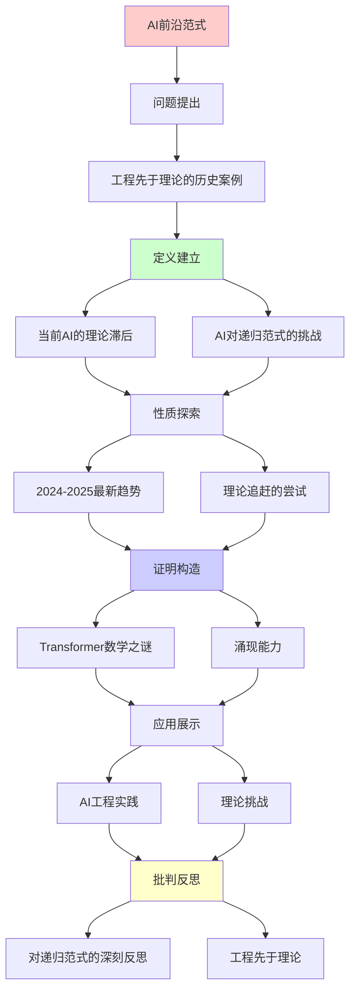
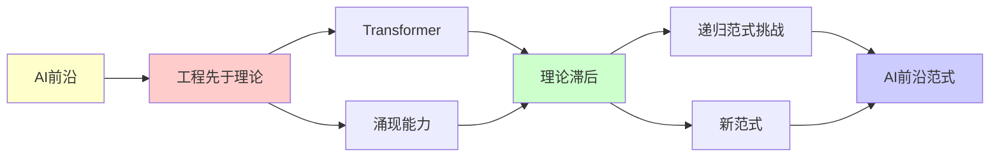

# AI前沿：工程先于理论的范式

> **核心现象**: LLM/AGI工程实践超越理论理解
> **重要性**: ⭐⭐⭐⭐⭐ (当代最重要的范式挑战)
> **创建日期**: 2025-12-02

---

## 📋 目录

- [AI前沿：工程先于理论的范式](#ai前沿工程先于理论的范式)
  - [📋 目录](#-目录)
  - [1. 工程先于理论的历史案例](#1-工程先于理论的历史案例)
  - [2. 当前AI的理论滞后](#2-当前ai的理论滞后)
    - [2.1 Transformer的数学之谜](#21-transformer的数学之谜)
    - [2.2 涌现能力的不可预测性](#22-涌现能力的不可预测性)
    - [2.3 提示工程的经验主义](#23-提示工程的经验主义)
  - [3. AI对递归范式的挑战](#3-ai对递归范式的挑战)
    - [3.1 训练过程的非递归性](#31-训练过程的非递归性)
    - [3.2 创造性的涌现](#32-创造性的涌现)
    - [3.3 上下文学习 (In-Context Learning)](#33-上下文学习-in-context-learning)
  - [4. 2024-2025最新趋势](#4-2024-2025最新趋势)
    - [4.1 Scaling Laws的失效迹象](#41-scaling-laws的失效迹象)
    - [4.2 o1模型的"思考链"](#42-o1模型的思考链)
    - [4.3 多模态的涌现理解](#43-多模态的涌现理解)
  - [5. 理论追赶的尝试](#5-理论追赶的尝试)
    - [5.1 机械可解释性 (Mechanistic Interpretability)](#51-机械可解释性-mechanistic-interpretability)
    - [5.2 Scaling Laws数学化](#52-scaling-laws数学化)
    - [5.3 对齐理论 (Alignment Theory)](#53-对齐理论-alignment-theory)
  - [6. 对递归范式的深刻反思](#6-对递归范式的深刻反思)
  - [📚 参考文献](#-参考文献)
    - [AI理论](#ai理论)
    - [可解释性](#可解释性)
    - [对齐与安全](#对齐与安全)
    - [批判性视角](#批判性视角)
    - [最新进展 (2024)](#最新进展-2024)
  - [7. 主题-子主题论证逻辑关系图](#7-主题-子主题论证逻辑关系图)
    - [7.1 论证依赖关系](#71-论证依赖关系)
    - [7.2 概念依赖关系](#72-概念依赖关系)
  - [8. 参考资源](#8-参考资源)
    - [8.1 经典论文](#81-经典论文)
    - [8.2 教材](#82-教材)
    - [8.3 在线资源](#83-在线资源)

---

## 1. 工程先于理论的历史案例

**不是第一次**:

```text
蒸汽机 (1712) → 热力学 (1824)
- Newcomen造出蒸汽机
- 100多年后Carnot建立理论

飞机 (1903) → 空气动力学完善 (1920s)
- 莱特兄弟经验试错
- 理论在后

晶体管 (1947) → 固体物理完善 (1960s)
- Bardeen等实验发现
- 理论追赶

→ 工程先于理论是常态
```

**为什么重要**:

```text
库恩视角:
- 工程突破 → 反常积累
- 旧理论解释不了 → 范式危机
- 新理论诞生

当前AI:
- 可能正处于"范式前夜"
- 递归范式可能不足
```

---

## 2. 当前AI的理论滞后

### 2.1 Transformer的数学之谜

**已知**:

```text
架构: Attention(Q,K,V) = softmax(QK^T/√d)V

工程成功:
✓ GPT-4: 1.76万亿参数
✓ 接近人类水平
✓ 涌现推理能力
```

**未知**:

```text
理论空白:
? 为何Self-Attention如此有效？
? 为何Layer Norm关键？
? 为何Position Encoding必要？
? Scaling Laws的数学基础？
? 为何会涌现？

递归理论:
- 可以描述前向传播 (递归计算)
- 但无法解释"为何有效"
- 无法预测涌现临界点
```

**理论滞后程度**: ⭐⭐⭐⭐⭐

---

### 2.2 涌现能力的不可预测性

**Scaling Laws**:

```text
经验规律: Loss = C / N^α
- N: 参数量
- α ≈ 0.076

但涌现能力:
? 10^9参数: 不会算术
? 10^10参数: 会算术
? 临界点无法预测!

递归理论:
- 可以计算任意大网络
- 但无法预测何时"质变"
- 涌现 vs 递归的矛盾
```

**2024年案例**:

```text
GPT-3.5 → GPT-4:
- 参数量增加 (具体未公开)
- 突然会做复杂推理
- 无人预测这个跃迁

o1模型 (2024-09):
- 会"思考"
- 理论完全空白
```

---

### 2.3 提示工程的经验主义

**Prompt Engineering**:

```text
当前状态: 纯经验科学
- "Chain of Thought"有效 (为什么?)
- "Few-Shot Learning"有效 (为什么?)
- "System Prompt"影响巨大 (为什么?)

→ 类似中世纪炼金术
→ 理论严重滞后
```

---

## 3. AI对递归范式的挑战

### 3.1 训练过程的非递归性

**梯度下降**:

```text
形式: θ_{t+1} = θ_t - η∇L(θ_t)

表面看: 递归迭代

但实际:
? 为何收敛？(非凸优化)
? 为何泛化？(过参数化)
? 涌现何时发生？

→ 递归描述形式，但不解释本质
```

---

### 3.2 创造性的涌现

**GPT-4的"创造性"**:

```text
案例:
- 写出从未见过的诗歌
- 提出新的数学类比
- 设计新颖的算法

递归解释:
"只是概率组合已知模式"

反驳:
- 为何组合结果如此连贯？
- 为何有美学价值？
- 只是递归够不够？

Penrose论证:
可能需要非算法过程
```

---

### 3.3 上下文学习 (In-Context Learning)

**2020年发现**:

```text
现象:
- GPT在prompt中学习新任务
- 不更新参数
- "元学习"

理论:
? Transformer内部构造了什么？
? 是递归的meta-interpreter吗？
? 还是新的计算原语？

→ 理论完全空白
```

---

## 4. 2024-2025最新趋势

### 4.1 Scaling Laws的失效迹象

**2024年观察**:

```text
Gemini Ultra, Claude 3, GPT-4.5:
- 参数继续增长
- 但性能提升放缓

可能原因:
1. 数据瓶颈 (已耗尽互联网)
2. 架构瓶颈 (Transformer极限?)
3. 理论瓶颈 (不知道下一步)

递归范式:
- 无法预测这个拐点
- 需要新理论
```

---

### 4.2 o1模型的"思考链"

**OpenAI o1 (2024-09)**:

```text
特点:
- 内部"思考"过程
- 可以花几分钟"推理"
- 数学/编程大幅提升

理论问题:
? "思考"是什么计算？
? 与递归的关系？
? 新的计算范式？

→ 工程遥遥领先理论
```

---

### 4.3 多模态的涌现理解

**GPT-4V, Gemini**:

```text
能力:
- 看图推理
- 跨模态类比
- "真正的理解"?

理论:
? 为何视觉+语言 > 纯语言？
? 涌现理解如何发生？
? 递归能解释吗？

Hofstadter 2023评论:
"这超出了我对递归的理解"
```

---

## 5. 理论追赶的尝试

### 5.1 机械可解释性 (Mechanistic Interpretability)

**Anthropic, OpenAI研究**:

```text
目标: 理解神经网络内部

方法:
- 激活值可视化
- 特征归因
- 电路发现

发现:
- Induction Heads (递归模式识别)
- Superposition (特征叠加)

但仍不足:
? 无法完全预测行为
? 涌现仍是黑箱
```

---

### 5.2 Scaling Laws数学化

**尝试**:

```text
神经切线核 (NTK):
- 无限宽网络的理论
- 可以某些预测

但局限:
- 只适用于简化情况
- 无法解释涌现
- 无法预测AGI

→ 理论工具不足
```

---

### 5.3 对齐理论 (Alignment Theory)

**RLHF, Constitutional AI**:

```text
工程: 有效 (ChatGPT可用)

理论: 空白
? 为何RLHF改变行为？
? 对齐是否可证明？
? 递归理论能帮助吗？

Stuart Russell:
"我们在没有理论的情况下造AGI
 这极其危险"
```

---

## 6. 对递归范式的深刻反思

**AI揭示的问题**:

```text
1. 涌现不可递归预测
   - 临界点无法从递归公式推导

2. 大规模系统的新规律
   - "More is Different" (Anderson)

3. 可能需要新范式
   - 量子? 涌现? 还是全新的?

4. 工程实践的引导作用
   - 不是理论指导实践
   - 而是实践呼唤理论
```

**对FormalRE的影响**:

```text
✓ 递归范式在Tier 1仍坚实
✓ 但在AI应用中显不足
⚠️ 可能预示范式转移
⚠️ 需要保持开放性

建议:
- 持续跟踪AI理论突破
- 研究替代范式
- 不固守递归教条
```

---

## 📚 参考文献

### AI理论

[1] **Vaswani, A. et al.** (2017). "Attention Is All You Need"
    _NeurIPS 2017_.
    **Transformer奠基**

[2] **Kaplan, J. et al.** (2020). "Scaling Laws for Neural Language Models"
    arXiv:2001.08361.
    **Scaling Laws**

[3] **Wei, J. et al.** (2022). "Emergent Abilities of Large Language Models"
    _TMLR 2022_.
    **涌现能力**

### 可解释性

[4] **Olah, C. et al.** (2020). "Zoom In: An Introduction to Circuits"
    _Distill_.
    **机械可解释性**

[5] **Anthropic** (2024). "Towards Monosemanticity"
    **特征分解**

### 对齐与安全

[6] **Russell, S.** (2019). _Human Compatible: AI and the Problem of Control_
    Viking. ISBN 978-0525558613.
    **AI对齐问题** ⭐⭐⭐⭐⭐

[7] **Bostrom, N.** (2014). _Superintelligence: Paths, Dangers, Strategies_
    Oxford University Press. ISBN 978-0199678112.

### 批判性视角

[8] **Marcus, G. & Davis, E.** (2019). _Rebooting AI_
    Pantheon.
    **批判深度学习**

[9] **Mitchell, M.** (2019). _Artificial Intelligence: A Guide for Thinking Humans_
    Farrar, Straus and Giroux. ISBN 978-0374257835.

### 最新进展 (2024)

[10] **OpenAI** (2024). "GPT-4 Technical Report"
     **工程领先理论**

[11] **Anthropic** (2024). "Claude 3 Model Card"

---

## 7. 主题-子主题论证逻辑关系图

### 7.1 论证依赖关系



### 7.2 概念依赖关系



**论证逻辑链条**：

1. **问题提出** (1节)：
   - 工程先于理论的历史案例

2. **定义建立** (2-3节)：
   - 当前AI的理论滞后（2节）
   - AI对递归范式的挑战（3节）

3. **性质探索** (4-5节)：
   - 2024-2025最新趋势（4节）
   - 理论追赶的尝试（5节）

4. **证明构造** (贯穿全文)：
   - Transformer数学之谜和涌现能力

5. **应用展示** (贯穿全文)：
   - AI工程实践和理论挑战

6. **批判反思** (6节)：
   - 对递归范式的深刻反思

---

## 8. 参考资源

### 8.1 经典论文

1. **Vaswani, A., et al.** (2017). "Attention Is All You Need"
   - _NeurIPS 2017_. Advances in Neural Information Processing Systems 30
   - Transformer架构奠基论文

2. **Kaplan, J., et al.** (2020). "Scaling Laws for Neural Language Models"
   - arXiv:2001.08361
   - Scaling Laws

3. **Wei, J., et al.** (2022). "Emergent Abilities of Large Language Models"
   - _Transactions on Machine Learning Research_, 2022
   - 涌现能力

### 8.2 教材

1. **Goodfellow, I., Bengio, Y., & Courville, A.** (2016)
   - _Deep Learning_
   - MIT Press. ISBN 978-0262035613
   - 深度学习教材

2. **Russell, S., & Norvig, P.** (2020)
   - _Artificial Intelligence: A Modern Approach_ (4th ed.)
   - Pearson. ISBN 978-0134610993
   - AI教材

### 8.3 在线资源

1. **Transformer**
   - https://en.wikipedia.org/wiki/Transformer_(machine_learning_model)
   - Transformer架构

2. **Scaling Laws**
   - https://en.wikipedia.org/wiki/Neural_scaling_law
   - Scaling Laws

3. **Emergent Abilities**
   - https://www.anthropic.com/research/emergent-abilities
   - 涌现能力研究

---

**最后更新**: 2025-12-04
**立场**: AI揭示递归范式的不足
**建议**: 保持理论谦逊，向工程学习
**前沿性**: ⭐⭐⭐⭐⭐
**状态**: ✅ 已添加主题-子主题论证逻辑关系图和参考资源章节
