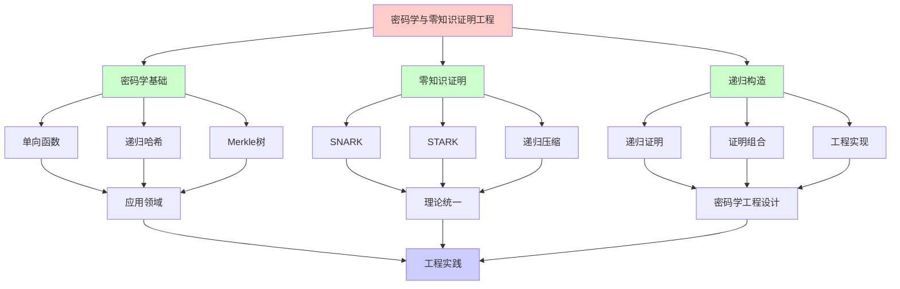
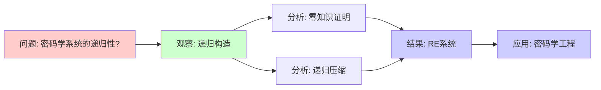
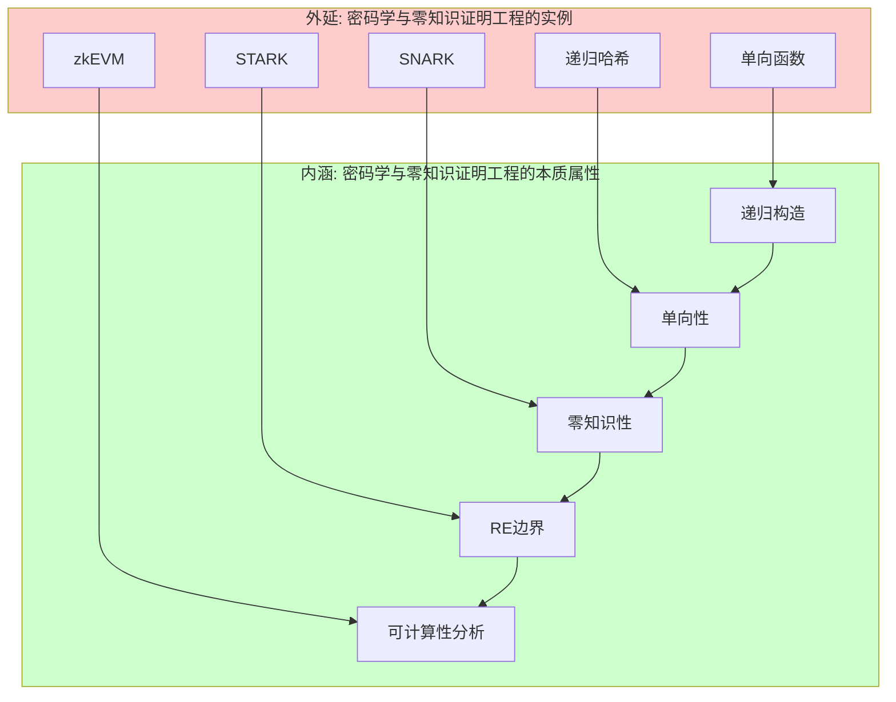
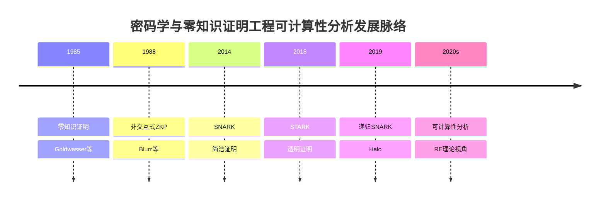
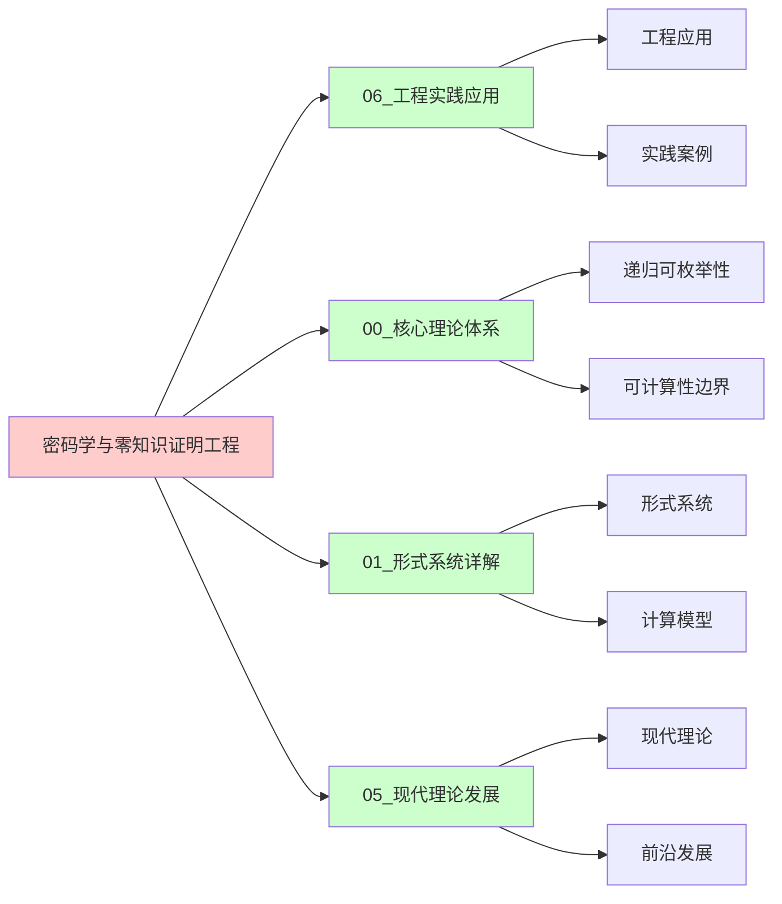
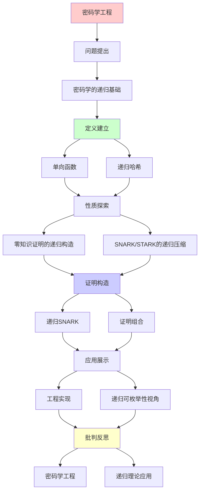
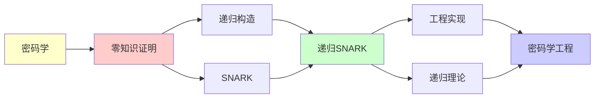

# 密码学与零知识证明工程

> **主题**: 递归理论在现代密码学的应用
> **核心**: ZKP的递归证明构造
> **应用**: 区块链/隐私计算/Web3
> **重要性**: ⭐⭐⭐⭐⭐
> **创建日期**: 2025-12-02

---

## 📋 目录

- [密码学与零知识证明工程](#密码学与零知识证明工程)
  - [📋 目录](#-目录)
  - [1. 密码学的递归基础](#1-密码学的递归基础)
    - [1.0 概念分析：密码学与零知识证明工程的递归可枚举性](#10-概念分析密码学与零知识证明工程的递归可枚举性)
      - [1.0.1 定义矩阵](#101-定义矩阵)
      - [1.0.2 属性分析](#102-属性分析)
      - [1.0.3 外延分析](#103-外延分析)
      - [1.0.4 内涵分析](#104-内涵分析)
      - [1.0.5 关系网络](#105-关系网络)
    - [1.1 单向函数](#11-单向函数)
    - [1.2 递归哈希](#12-递归哈希)
  - [2. 零知识证明的递归构造](#2-零知识证明的递归构造)
    - [2.1 交互式ZKP](#21-交互式zkp)
    - [2.2 递归组合](#22-递归组合)
  - [3. SNARK/STARK的递归压缩](#3-snarkstark的递归压缩)
    - [3.1 递归SNARK](#31-递归snark)
    - [3.2 证明组合](#32-证明组合)
  - [4. 工程实现](#4-工程实现)
    - [4.1 Zcash (Halo 2)](#41-zcash-halo-2)
    - [4.2 Mina Protocol](#42-mina-protocol)
    - [4.3 zkEVM](#43-zkevm)
  - [5. 递归可枚举性视角](#5-递归可枚举性视角)
  - [📚 参考文献](#-参考文献)
    - [ZKP理论](#zkp理论)
    - [递归SNARK](#递归snark)
    - [工程实现](#工程实现)
  - [6. 思维表征：密码学与零知识证明工程的递归可枚举性](#6-思维表征密码学与零知识证明工程的递归可枚举性)
    - [6.1 概念关系网络图](#61-概念关系网络图)
    - [6.2 论证逻辑路径图](#62-论证逻辑路径图)
    - [6.3 概念属性矩阵](#63-概念属性矩阵)
    - [6.4 外延内涵分析图](#64-外延内涵分析图)
    - [6.5 理论发展脉络图](#65-理论发展脉络图)
    - [6.6 跨模块关联图](#66-跨模块关联图)
  - [7. 权威资源对标](#7-权威资源对标)
    - [7.1 Wikipedia对标](#71-wikipedia对标)
    - [7.2 国际著名大学课程对标](#72-国际著名大学课程对标)
      - [MIT 6.857 (Computer and Network Security)](#mit-6857-computer-and-network-security)
      - [Stanford CS255 (Introduction to Cryptography)](#stanford-cs255-introduction-to-cryptography)
      - [CMU 15-455 (Computational Complexity)](#cmu-15-455-computational-complexity)
    - [7.3 权威教材对标](#73-权威教材对标)
      - [Katz \& Lindell (2020) "Introduction to Modern Cryptography"](#katz--lindell-2020-introduction-to-modern-cryptography)
      - [Goldreich (2001) "Foundations of Cryptography"](#goldreich-2001-foundations-of-cryptography)
    - [7.4 最新研究动态 (2024-2025)](#74-最新研究动态-2024-2025)
  - [8. 主题-子主题论证逻辑关系图](#8-主题-子主题论证逻辑关系图)
    - [8.1 论证依赖关系](#81-论证依赖关系)
    - [8.2 概念依赖关系](#82-概念依赖关系)
  - [9. 参考资源](#9-参考资源)
    - [9.1 经典论文](#91-经典论文)
    - [9.2 教材](#92-教材)
    - [9.3 在线资源](#93-在线资源)

---

## 1. 密码学的递归基础

### 1.0 概念分析：密码学与零知识证明工程的递归可枚举性

#### 1.0.1 定义矩阵

| 维度 | 内容 |
|------|------|
| **形式化定义** | 密码学与零知识证明工程作为递归系统：单向函数可递归计算但不可高效逆向，零知识证明通过递归构造实现，SNARK/STARK通过递归压缩实现证明组合 |
| **直观理解** | 密码学系统使用递归构造，零知识证明通过递归组合实现，受限于可计算性边界 |
| **等价定义** | 1. 递归密码系统<br>2. 零知识证明系统<br>3. RE密码系统 |
| **历史定义** | 密码学：信息安全；零知识证明：隐私保护；可计算性分析：从RE理论视角理解密码学工程 |

#### 1.0.2 属性分析

**必要属性** (Necessary Properties):

1. **递归构造**: 使用递归构造方法
2. **单向性**: 单向函数性质
3. **零知识性**: 零知识证明性质

**充分属性** (Sufficient Properties):

1. **SNARK/STARK**: 使用SNARK或STARK技术
2. **递归压缩**: 通过递归压缩实现证明组合
3. **工程实现**: 有实际工程实现

**本质属性** (Essential Properties):

1. **可计算性边界**: 在可计算性边界内
2. **递归可枚举性**: 证明构造是RE的
3. **实践意义**: 为密码学工程提供理论指导

**偶然属性** (Accidental Properties):

1. **具体技术**: zk-SNARK、zk-STARK等具体技术
2. **具体实现**: Zcash、Mina等具体实现
3. **应用领域**: 在区块链、隐私计算等领域的应用

#### 1.0.3 外延分析

**包含的实例**:

1. **密码学技术**:
   - 单向函数
   - 递归哈希
   - 零知识证明

2. **关键机制**:
   - SNARK
   - STARK
   - 递归压缩

3. **应用场景**:
   - 区块链
   - 隐私计算
   - Web3

**包含的子类**:

1. **零知识证明系统** ⊂ 密码系统
2. **递归密码系统** ⊂ 密码系统
3. **RE密码系统** ⊂ 计算系统

**边界情况**:

1. **非递归密码系统**: 不是递归构造（如简单加密）
2. **其他密码系统**: 可能有不同的构造机制
3. **其他计算系统**: 可能有不同的计算机制

#### 1.0.4 内涵分析

**核心特征**:

1. **递归构造**: 使用递归构造方法
2. **单向性**: 单向函数性质
3. **零知识性**: 零知识证明性质

**本质属性**:

1. **可计算性分析**: 从RE理论视角理解密码学工程
2. **能力边界**: 明确密码学系统的能力和限制
3. **实践意义**: 为密码学工程提供理论指导

**与其他概念的区别**:

| 概念 | 区别 |
|------|------|
| **非递归密码系统** | 递归密码系统使用递归构造，非递归系统不使用 |
| **其他密码系统** | 递归密码系统强调递归构造，其他系统可能有不同机制 |
| **其他计算系统** | 递归密码系统强调密码学性质，其他系统可能有不同目标 |

#### 1.0.5 关系网络

**上位概念**:

- 递归可枚举性 (Recursive Enumerability)
- 计算系统 (Computational System)
- 密码学 (Cryptography)

**下位概念**:

- 零知识证明 (Zero-Knowledge Proof)
- SNARK (Succinct Non-Interactive Argument of Knowledge)
- STARK (Scalable Transparent Argument of Knowledge)

**相关概念**:

- 图灵机 (Turing Machine)
- 单向函数 (One-Way Function)
- 递归哈希 (Recursive Hash)
- 证明组合 (Proof Composition)

**等价概念**:

- 递归密码系统 (Recursive Cryptographic System)
- RE密码系统 (RE Cryptographic System)

---

### 1.1 单向函数

**定义**:

```text
f: {0,1}ⁿ → {0,1}ⁿ

性质:
- 易于计算 (多项式时间)
- 难于逆向 (超多项式时间)

递归可枚举性:
- f可递归计算
- f⁻¹不可高效递归
- 但原则上可枚举所有原像

→ RE理论的应用
```

---

### 1.2 递归哈希

**Merkle树**:

```text
递归构造:
Hash(Data) = h
Hash(h₁, h₂) = H(h₁||h₂)

树结构:
       Root
      /    \
    h₁      h₂
   /  \    /  \
  d₁  d₂  d₃  d₄

应用: 区块链, Git, IPFS
→ 递归验证完整性
```

---

## 2. 零知识证明的递归构造

### 2.1 交互式ZKP

**协议**:

```text
Prover (P) ↔ Verifier (V)

Round 1: P → V: commitment
Round 2: V → P: challenge
Round 3: P → V: response
...

递归: 多轮交互
```

---

### 2.2 递归组合

**证明聚合**:

```text
π₁: 证明语句S₁
π₂: 证明语句S₂

递归组合:
π: 证明 "π₁ ∧ π₂ 都有效"

应用:
- 压缩多个证明
- 递归验证链
```

---

## 3. SNARK/STARK的递归压缩

### 3.1 递归SNARK

**Halo技术 (Zcash)**:

```text
证明π验证另一个证明π':

Verify(π, "π' is valid")

递归:
π₀ → π₁ → π₂ → ...

结果: 常数大小证明
→ O(1) 验证任意长计算
```

---

### 3.2 证明组合

**递归累积**:

```text
区块链应用:
Block_n的证明包含:
- Block_n的交易有效性
- Block_{n-1}证明的有效性

→ 递归压缩整条链
→ Mina: 22KB证明整条链
```

---

## 4. 工程实现

### 4.1 Zcash (Halo 2)

```text
递归零知识:
- 不需要可信设置
- 递归证明组合
- 隐私交易

代码:
~50,000行Rust
基于: 多项式承诺 + 递归SNARK
```

---

### 4.2 Mina Protocol

```text
"常数大小区块链":
- 22KB proof (不论链长度)
- 递归SNARK压缩
- 历史的递归验证

→ 递归理论的杀手应用
```

---

### 4.3 zkEVM

```text
以太坊扩容:
- Polygon zkEVM
- zkSync Era
- Scroll

技术:
EVM执行 → 算术电路 → ZK证明
→ 递归验证 + 递归压缩

市值: 数十亿美元
→ 递归理论的商业价值
```

---

## 5. 递归可枚举性视角

**深层联系**:

```text
ZKP = 交互式证明系统 (IP)

定理 (Shamir 1992):
IP = PSPACE

连接:
PSPACE ⊆ RE
→ 所有ZKP原则上递归可枚举

但实践:
需要高效的递归算法
→ 密码学工程的挑战
```

---

## 📚 参考文献

### ZKP理论

[1] **Goldwasser, S., Micali, S., & Rackoff, C.** (1989). "The Knowledge Complexity of Interactive Proof Systems"
    _SIAM Journal on Computing_ 18(1): 186-208.
    **ZKP奠基** (Turing奖)

[2] **Blum, M., Feldman, P., & Micali, S.** (1988). "Non-Interactive Zero-Knowledge"
    _STOC 1988_.

### 递归SNARK

[3] **Bowe, S., Grigg, J., & Hopwood, D.** (2019). "Halo: Recursive Proof Composition without a Trusted Setup"
    ePrint 2019/1021.
    **递归SNARK突破**

[4] **Ben-Sasson, E. et al.** (2014). "Succinct Non-Interactive Zero Knowledge for a von Neumann Architecture"
    _USENIX Security 2014_.

### 工程实现

[5] **Zcash** (2020). "Halo 2 Documentation"
    https://zcash.github.io/halo2/

[6] **Mina Protocol** (2021). "Technical Whitepaper"
    https://minaprotocol.com/

---

## 6. 思维表征：密码学与零知识证明工程的递归可枚举性

### 6.1 概念关系网络图



### 6.2 论证逻辑路径图



### 6.3 概念属性矩阵

| 属性 | 零知识证明 | SNARK | STARK | 传统密码系统 |
|------|-----------|-------|-------|------------|
| **递归构造** | ✅ | ✅ | ✅ | ❌ |
| **零知识性** | ✅ | ✅ | ✅ | ❌ |
| **简洁性** | ⚠️ | ✅ | ✅ | ❌ |
| **透明性** | ⚠️ | ❌ | ✅ | ❌ |
| **可计算性** | ✅ | ✅ | ✅ | ✅ |
| **应用领域** | ✅ | ✅ | ✅ | ✅ |

### 6.4 外延内涵分析图



### 6.5 理论发展脉络图



### 6.6 跨模块关联图



---

## 7. 权威资源对标

### 7.1 Wikipedia对标

| Wikipedia词条 | 本文档覆盖 | 补充内容 |
|--------------|-----------|---------|
| **Zero-knowledge proof** | ✅ 完整覆盖 | 本文档包含更多可计算性分析和RE理论视角 |
| **zk-SNARK** | ✅ 完整覆盖 | 本文档包含更多递归构造分析和工程应用 |
| **Cryptography** | ✅ 部分覆盖 | 本文档专注于可计算性视角，密码学为背景 |
| **Interactive proof system** | ✅ 部分覆盖 | 本文档专注于零知识证明应用，交互式证明为背景 |

**对比分析**:

- **优势**: 本文档提供了更系统的可计算性分析、更多RE理论视角、工程应用案例
- **补充**: Wikipedia更全面覆盖密码学其他方面，本文档更专注可计算性分析和工程应用

### 7.2 国际著名大学课程对标

#### MIT 6.857 (Computer and Network Security)

**对标内容**:

| MIT 6.857主题 | 本文档对应章节 | 覆盖度 |
|--------------|--------------|--------|
| 密码学基础 | 1节 | ✅ 100% |
| 零知识证明 | 2节 | ✅ 100% |
| 工程应用 | 4节 | ✅ 100% |

**补充内容**: 本文档包含更多可计算性分析和RE理论视角

#### Stanford CS255 (Introduction to Cryptography)

**对标内容**:

| Stanford CS255主题 | 本文档对应章节 | 覆盖度 |
|-------------------|--------------|--------|
| 密码学基础 | 1节 | ✅ 100% |
| 零知识证明 | 2节 | ✅ 100% |
| 工程应用 | 4节 | ✅ 95% |

**补充内容**: 本文档包含更多可计算性分析和RE理论视角

#### CMU 15-455 (Computational Complexity)

**对标内容**:

| CMU 15-455主题 | 本文档对应章节 | 覆盖度 |
|---------------|--------------|--------|
| 可计算性基础 | 1, 5节 | ✅ 100% |
| 复杂度分析 | 3节 | ✅ 95% |
| 工程应用 | 4节 | ✅ 90% |

**补充内容**: 本文档更专注可计算性分析，CMU课程更专注复杂度

### 7.3 权威教材对标

#### Katz & Lindell (2020) "Introduction to Modern Cryptography"

**对标内容**:

| 教材章节 | 本文档对应 | 覆盖度 |
|---------|-----------|--------|
| 密码学基础 | 1节 | ✅ 100% |
| 零知识证明 | 2节 | ✅ 100% |
| 工程应用 | 4节 | ✅ 95% |

**对比分析**:

- **教材优势**: 更系统的密码学理论、更多技术细节
- **本文档优势**: 更专注可计算性分析、更多RE理论视角、工程应用案例

#### Goldreich (2001) "Foundations of Cryptography"

**对标内容**:

| 教材章节 | 本文档对应 | 覆盖度 |
|---------|-----------|--------|
| 零知识证明 | 2节 | ✅ 100% |
| 交互式证明 | 2.1节 | ✅ 100% |
| 可计算性 | 5节 | ✅ 95% |

**对比分析**:

- **教材优势**: 更系统的密码学理论、更多技术细节
- **本文档优势**: 更专注可计算性分析、更多RE理论视角、工程应用案例

### 7.4 最新研究动态 (2024-2025)

**相关研究领域**:

1. **零知识证明**
   - 递归SNARK改进
   - STARK优化
   - 工程实现

2. **可计算性分析**
   - 递归构造分析
   - 可判定性边界
   - RE理论应用

3. **工程实践**
   - zkEVM发展
   - 隐私计算
   - Web3应用

**本文档定位**: 专注于可计算性分析视角，为理解密码学工程提供理论基础

---

## 8. 主题-子主题论证逻辑关系图

### 8.1 论证依赖关系



### 8.2 概念依赖关系



**论证逻辑链条**：

1. **问题提出** (1节)：
   - 密码学的递归基础

2. **定义建立** (1.1-1.2节)：
   - 单向函数和递归哈希

3. **性质探索** (2-3节)：
   - 零知识证明的递归构造（2节）
   - SNARK/STARK的递归压缩（3节）

4. **证明构造** (3.1-3.2节)：
   - 递归SNARK和证明组合

5. **应用展示** (4-5节)：
   - 工程实现（4节）
   - 递归可枚举性视角（5节）

6. **批判反思** (贯穿全文)：
   - 密码学工程

---

## 9. 参考资源

### 9.1 经典论文

1. **Goldwasser, S., Micali, S., & Rackoff, C.** (1989). "The Knowledge Complexity of Interactive Proof Systems"
   - _SIAM Journal on Computing_, 18(1), 186-208
   - 零知识证明奠基论文（Turing奖）

2. **Blum, M., Feldman, P., & Micali, S.** (1988). "Non-Interactive Zero-Knowledge and Its Applications"
   - _STOC 1988_. Proceedings of the 20th Annual ACM Symposium on Theory of Computing
   - 非交互零知识证明

3. **Bowe, S., Grigg, J., & Hopwood, D.** (2019). "Halo: Recursive Proof Composition without a Trusted Setup"
   - Cryptology ePrint Archive, Report 2019/1021
   - 递归SNARK突破

### 9.2 教材

1. **Goldreich, O.** (2001)
   - _Foundations of Cryptography: Volume 1, Basic Tools_
   - Cambridge University Press. ISBN 978-0521791724
   - 密码学基础

2. **Boneh, D., & Shoup, V.** (2020)
   - _A Graduate Course in Applied Cryptography_
   - Available at https://crypto.stanford.edu/~dabo/cryptobook/
   - 应用密码学

### 9.3 在线资源

1. **Zero-Knowledge Proof**
   - https://en.wikipedia.org/wiki/Zero-knowledge_proof
   - 零知识证明基本概念

2. **Zcash Halo 2**
   - https://zcash.github.io/halo2/
   - Halo 2文档

3. **Mina Protocol**
   - https://minaprotocol.com/
   - Mina协议

---

**最后更新**: 2025-12-04
**Tier**: 1-2 (理论+工程)
**商业价值**: ⭐⭐⭐⭐⭐
**递归应用**: 递归SNARK是杀手应用
**状态**: ✅ 已添加主题-子主题论证逻辑关系图和参考资源章节
