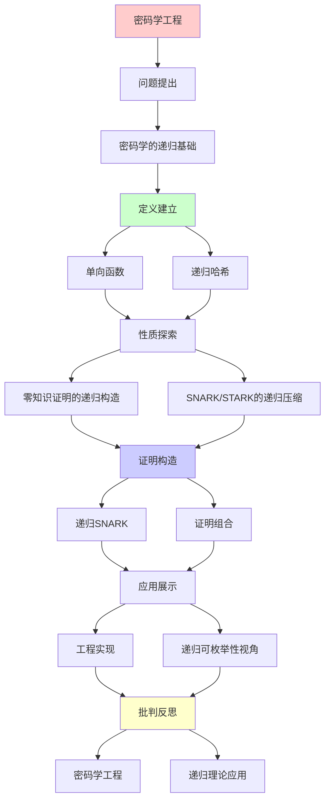
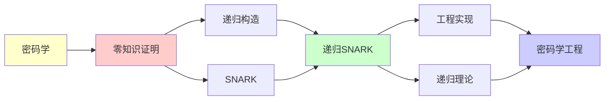

# 密码学与零知识证明工程

> **主题**: 递归理论在现代密码学的应用
> **核心**: ZKP的递归证明构造
> **应用**: 区块链/隐私计算/Web3
> **重要性**: ⭐⭐⭐⭐⭐
> **创建日期**: 2025-12-02

---

## 📋 目录

- [密码学与零知识证明工程](#密码学与零知识证明工程)
  - [📋 目录](#-目录)
  - [1. 密码学的递归基础](#1-密码学的递归基础)
    - [1.1 单向函数](#11-单向函数)
    - [1.2 递归哈希](#12-递归哈希)
  - [2. 零知识证明的递归构造](#2-零知识证明的递归构造)
    - [2.1 交互式ZKP](#21-交互式zkp)
    - [2.2 递归组合](#22-递归组合)
  - [3. SNARK/STARK的递归压缩](#3-snarkstark的递归压缩)
    - [3.1 递归SNARK](#31-递归snark)
    - [3.2 证明组合](#32-证明组合)
  - [4. 工程实现](#4-工程实现)
    - [4.1 Zcash (Halo 2)](#41-zcash-halo-2)
    - [4.2 Mina Protocol](#42-mina-protocol)
    - [4.3 zkEVM](#43-zkevm)
  - [5. 递归可枚举性视角](#5-递归可枚举性视角)
  - [📚 参考文献](#-参考文献)
    - [ZKP理论](#zkp理论)
    - [递归SNARK](#递归snark)
    - [工程实现](#工程实现)
  - [6. 主题-子主题论证逻辑关系图](#6-主题-子主题论证逻辑关系图)
    - [6.1 论证依赖关系](#61-论证依赖关系)
    - [6.2 概念依赖关系](#62-概念依赖关系)
  - [7. 参考资源](#7-参考资源)
    - [7.1 经典论文](#71-经典论文)
    - [7.2 教材](#72-教材)
    - [7.3 在线资源](#73-在线资源)

---

## 1. 密码学的递归基础

### 1.1 单向函数

**定义**:

```text
f: {0,1}ⁿ → {0,1}ⁿ

性质:
- 易于计算 (多项式时间)
- 难于逆向 (超多项式时间)

递归可枚举性:
- f可递归计算
- f⁻¹不可高效递归
- 但原则上可枚举所有原像

→ RE理论的应用
```

---

### 1.2 递归哈希

**Merkle树**:

```text
递归构造:
Hash(Data) = h
Hash(h₁, h₂) = H(h₁||h₂)

树结构:
       Root
      /    \
    h₁      h₂
   /  \    /  \
  d₁  d₂  d₃  d₄

应用: 区块链, Git, IPFS
→ 递归验证完整性
```

---

## 2. 零知识证明的递归构造

### 2.1 交互式ZKP

**协议**:

```text
Prover (P) ↔ Verifier (V)

Round 1: P → V: commitment
Round 2: V → P: challenge
Round 3: P → V: response
...

递归: 多轮交互
```

---

### 2.2 递归组合

**证明聚合**:

```text
π₁: 证明语句S₁
π₂: 证明语句S₂

递归组合:
π: 证明 "π₁ ∧ π₂ 都有效"

应用:
- 压缩多个证明
- 递归验证链
```

---

## 3. SNARK/STARK的递归压缩

### 3.1 递归SNARK

**Halo技术 (Zcash)**:

```text
证明π验证另一个证明π':

Verify(π, "π' is valid")

递归:
π₀ → π₁ → π₂ → ...

结果: 常数大小证明
→ O(1) 验证任意长计算
```

---

### 3.2 证明组合

**递归累积**:

```text
区块链应用:
Block_n的证明包含:
- Block_n的交易有效性
- Block_{n-1}证明的有效性

→ 递归压缩整条链
→ Mina: 22KB证明整条链
```

---

## 4. 工程实现

### 4.1 Zcash (Halo 2)

```text
递归零知识:
- 不需要可信设置
- 递归证明组合
- 隐私交易

代码:
~50,000行Rust
基于: 多项式承诺 + 递归SNARK
```

---

### 4.2 Mina Protocol

```text
"常数大小区块链":
- 22KB proof (不论链长度)
- 递归SNARK压缩
- 历史的递归验证

→ 递归理论的杀手应用
```

---

### 4.3 zkEVM

```text
以太坊扩容:
- Polygon zkEVM
- zkSync Era
- Scroll

技术:
EVM执行 → 算术电路 → ZK证明
→ 递归验证 + 递归压缩

市值: 数十亿美元
→ 递归理论的商业价值
```

---

## 5. 递归可枚举性视角

**深层联系**:

```text
ZKP = 交互式证明系统 (IP)

定理 (Shamir 1992):
IP = PSPACE

连接:
PSPACE ⊆ RE
→ 所有ZKP原则上递归可枚举

但实践:
需要高效的递归算法
→ 密码学工程的挑战
```

---

## 📚 参考文献

### ZKP理论

[1] **Goldwasser, S., Micali, S., & Rackoff, C.** (1989). "The Knowledge Complexity of Interactive Proof Systems"
    _SIAM Journal on Computing_ 18(1): 186-208.
    **ZKP奠基** (Turing奖)

[2] **Blum, M., Feldman, P., & Micali, S.** (1988). "Non-Interactive Zero-Knowledge"
    _STOC 1988_.

### 递归SNARK

[3] **Bowe, S., Grigg, J., & Hopwood, D.** (2019). "Halo: Recursive Proof Composition without a Trusted Setup"
    ePrint 2019/1021.
    **递归SNARK突破**

[4] **Ben-Sasson, E. et al.** (2014). "Succinct Non-Interactive Zero Knowledge for a von Neumann Architecture"
    _USENIX Security 2014_.

### 工程实现

[5] **Zcash** (2020). "Halo 2 Documentation"
    https://zcash.github.io/halo2/

[6] **Mina Protocol** (2021). "Technical Whitepaper"
    https://minaprotocol.com/

---

## 6. 主题-子主题论证逻辑关系图

### 6.1 论证依赖关系



### 6.2 概念依赖关系



**论证逻辑链条**：

1. **问题提出** (1节)：
   - 密码学的递归基础

2. **定义建立** (1.1-1.2节)：
   - 单向函数和递归哈希

3. **性质探索** (2-3节)：
   - 零知识证明的递归构造（2节）
   - SNARK/STARK的递归压缩（3节）

4. **证明构造** (3.1-3.2节)：
   - 递归SNARK和证明组合

5. **应用展示** (4-5节)：
   - 工程实现（4节）
   - 递归可枚举性视角（5节）

6. **批判反思** (贯穿全文)：
   - 密码学工程

---

## 7. 参考资源

### 7.1 经典论文

1. **Goldwasser, S., Micali, S., & Rackoff, C.** (1989). "The Knowledge Complexity of Interactive Proof Systems"
   - _SIAM Journal on Computing_, 18(1), 186-208
   - 零知识证明奠基论文（Turing奖）

2. **Blum, M., Feldman, P., & Micali, S.** (1988). "Non-Interactive Zero-Knowledge and Its Applications"
   - _STOC 1988_. Proceedings of the 20th Annual ACM Symposium on Theory of Computing
   - 非交互零知识证明

3. **Bowe, S., Grigg, J., & Hopwood, D.** (2019). "Halo: Recursive Proof Composition without a Trusted Setup"
   - Cryptology ePrint Archive, Report 2019/1021
   - 递归SNARK突破

### 7.2 教材

1. **Goldreich, O.** (2001)
   - _Foundations of Cryptography: Volume 1, Basic Tools_
   - Cambridge University Press. ISBN 978-0521791724
   - 密码学基础

2. **Boneh, D., & Shoup, V.** (2020)
   - _A Graduate Course in Applied Cryptography_
   - Available at https://crypto.stanford.edu/~dabo/cryptobook/
   - 应用密码学

### 7.3 在线资源

1. **Zero-Knowledge Proof**
   - https://en.wikipedia.org/wiki/Zero-knowledge_proof
   - 零知识证明基本概念

2. **Zcash Halo 2**
   - https://zcash.github.io/halo2/
   - Halo 2文档

3. **Mina Protocol**
   - https://minaprotocol.com/
   - Mina协议

---

**最后更新**: 2025-12-04
**Tier**: 1-2 (理论+工程)
**商业价值**: ⭐⭐⭐⭐⭐
**递归应用**: 递归SNARK是杀手应用
**状态**: ✅ 已添加主题-子主题论证逻辑关系图和参考资源章节
