# 【全局逻辑关系图】FormalRE整体论证逻辑

> **创建日期**: 2025-12-04
> **目的**: 展示FormalRE项目中所有主题和子主题之间的论证逻辑关系
> **状态**: 🚀 持续更新中

---

## 📋 目录

- [【全局逻辑关系图】FormalRE整体论证逻辑](#全局逻辑关系图formalre整体论证逻辑)
  - [📋 目录](#-目录)
  - [1. 核心理论体系论证逻辑](#1-核心理论体系论证逻辑)
    - [1.1 00\_核心理论体系模块](#11-00_核心理论体系模块)
    - [1.2 论证依赖关系](#12-论证依赖关系)
  - [2. 形式系统论证逻辑](#2-形式系统论证逻辑)
    - [2.1 01\_形式系统详解模块](#21-01_形式系统详解模块)
    - [2.2 等价性论证](#22-等价性论证)
  - [3. 等价性证明论证逻辑](#3-等价性证明论证逻辑)
    - [3.1 02\_等价性证明模块](#31-02_等价性证明模块)
    - [3.2 证明依赖关系](#32-证明依赖关系)
  - [4. 跨模块关联逻辑](#4-跨模块关联逻辑)
    - [4.1 核心理论 ↔ 形式系统](#41-核心理论--形式系统)
    - [4.2 形式系统 ↔ 等价性证明](#42-形式系统--等价性证明)
    - [4.3 核心理论 ↔ 复杂度理论](#43-核心理论--复杂度理论)
    - [4.4 理论 ↔ 应用](#44-理论--应用)
  - [5. 理论发展脉络](#5-理论发展脉络)
    - [5.1 历史发展时间线](#51-历史发展时间线)
    - [5.2 理论影响关系](#52-理论影响关系)
  - [6. 概念依赖关系](#6-概念依赖关系)
    - [6.1 核心概念依赖图](#61-核心概念依赖图)
    - [6.2 学习依赖关系](#62-学习依赖关系)
  - [7. 学习路径依赖](#7-学习路径依赖)
    - [7.1 基础学习路径](#71-基础学习路径)
    - [7.2 理论深度路径](#72-理论深度路径)
    - [7.3 现代应用路径](#73-现代应用路径)
    - [7.4 跨学科路径](#74-跨学科路径)
  - [8. 模块间完整关联图](#8-模块间完整关联图)
    - [8.1 13个核心模块关联](#81-13个核心模块关联)
    - [8.2 知识流动方向](#82-知识流动方向)
  - [9. 论证完整性检查](#9-论证完整性检查)
    - [9.1 核心论证链完整性](#91-核心论证链完整性)
    - [9.2 缺失的论证连接](#92-缺失的论证连接)
  - [10. 后续完善计划](#10-后续完善计划)
    - [10.1 立即补充](#101-立即补充)
    - [10.2 中期目标](#102-中期目标)

---

## 1. 核心理论体系论证逻辑

### 1.1 00_核心理论体系模块

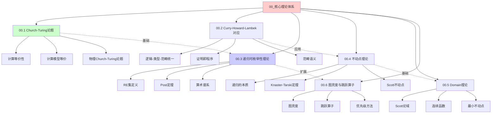

### 1.2 论证依赖关系

**核心论证链条**:

```text
Church-Turing论题 (00.1)
    ↓
计算模型等价性
    ↓
递归可枚举性理论 (00.3)
    ↓
不可判定性
    ↓
图灵度理论 (00.6)
```

**辅助论证链条**:

```text
Curry-Howard-Lambek对应 (00.2)
    ↓
逻辑-类型-范畴统一
    ↓
不动点理论 (00.4)
    ↓
Domain理论 (00.5)
```

---

## 2. 形式系统论证逻辑

### 2.1 01_形式系统详解模块

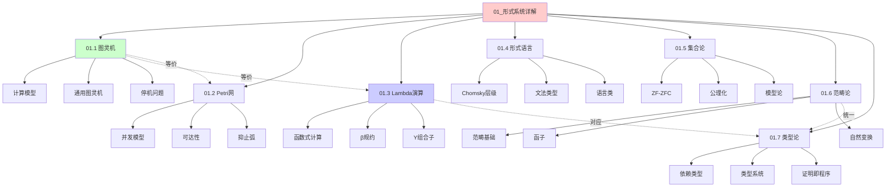

### 2.2 等价性论证

**七系统等价性证明链**:

```text
Petri网 (01.2)
    ↓ (02.1)
图灵机 (01.1)
    ↓ (02.2)
Lambda演算 (01.3)
    ↓ (02.3)
形式语言 (01.4)
    ↓ (02.4)
集合论 (01.5)
    ↓ (02.5)
范畴论 (01.6)
    ↓ (02.6)
类型论 (01.7)
```

---

## 3. 等价性证明论证逻辑

### 3.1 02_等价性证明模块

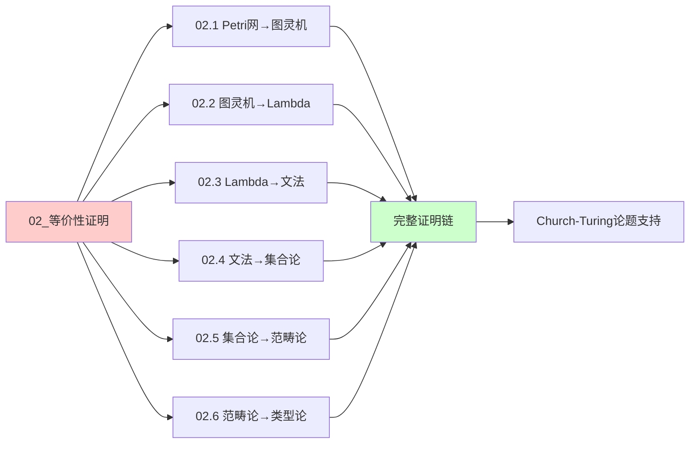

### 3.2 证明依赖关系

**证明依赖图**:

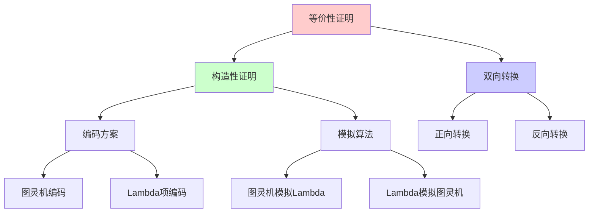

---

## 4. 跨模块关联逻辑

### 4.1 核心理论 ↔ 形式系统

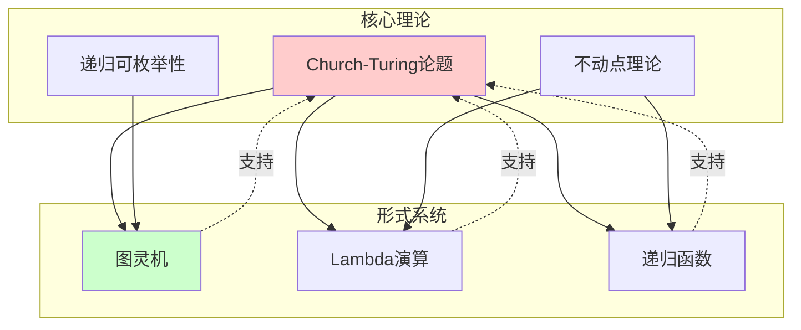

### 4.2 形式系统 ↔ 等价性证明

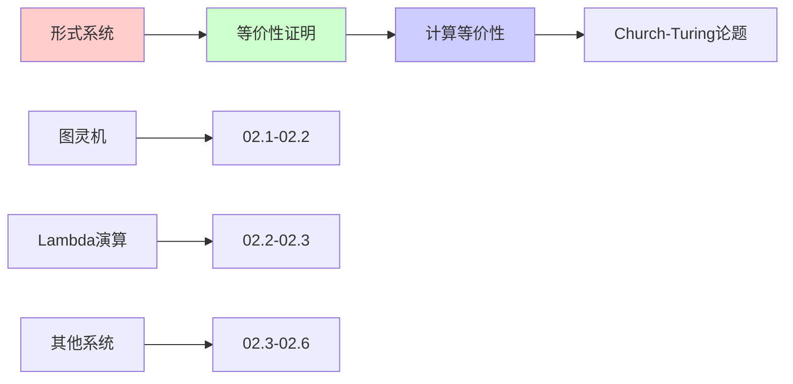

### 4.3 核心理论 ↔ 复杂度理论

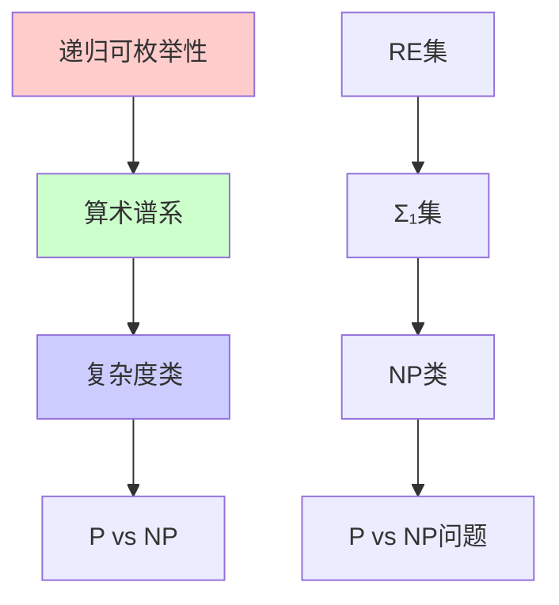

### 4.4 理论 ↔ 应用

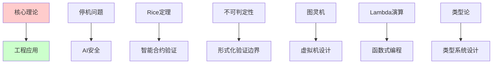

---

## 5. 理论发展脉络

### 5.1 历史发展时间线

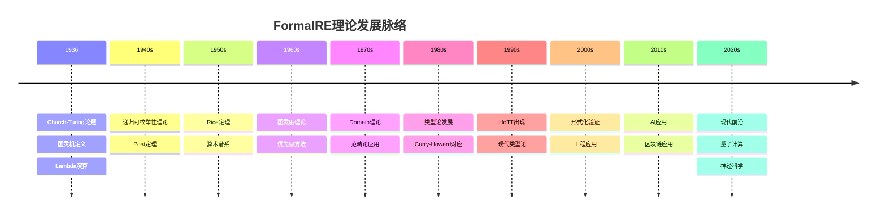

### 5.2 理论影响关系

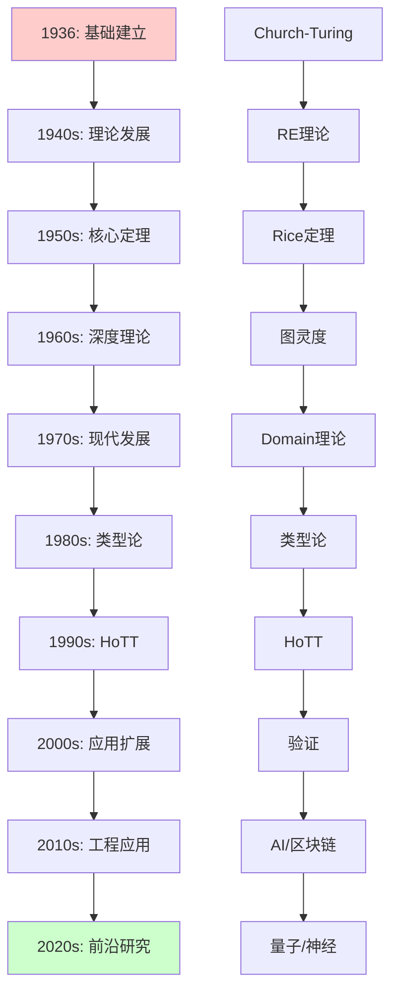

---

## 6. 概念依赖关系

### 6.1 核心概念依赖图

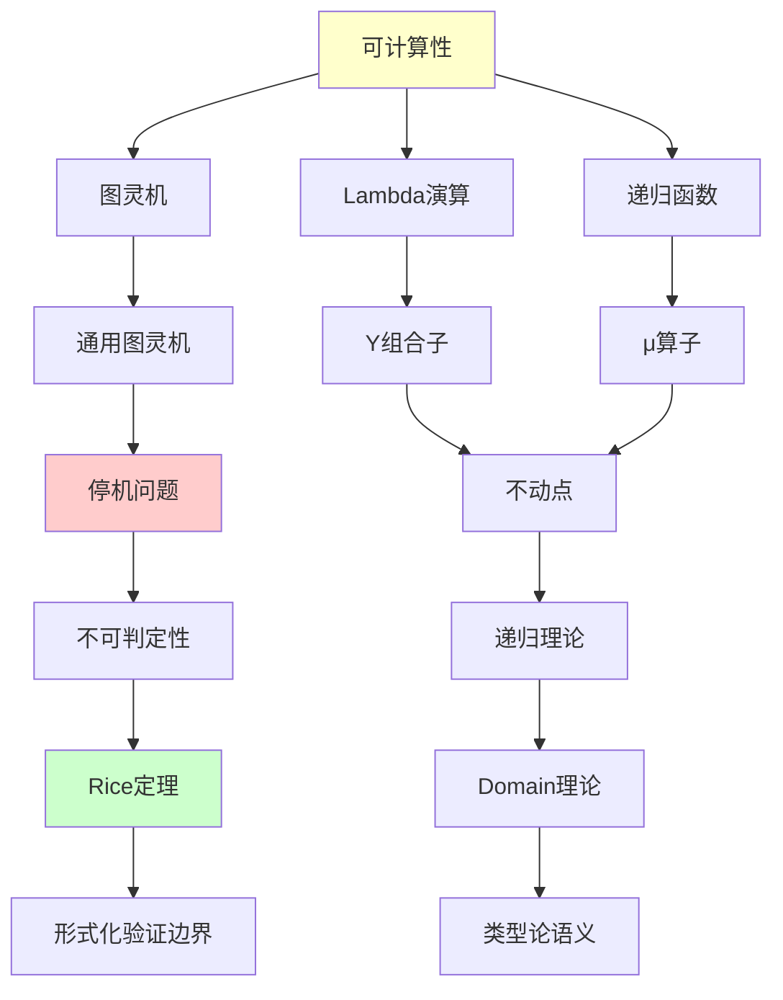

### 6.2 学习依赖关系

**前置知识依赖**:

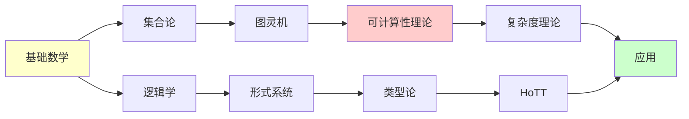

---

## 7. 学习路径依赖

### 7.1 基础学习路径

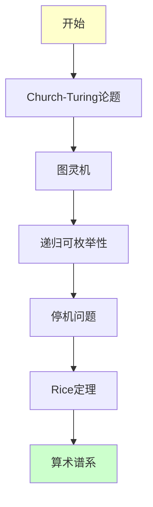

### 7.2 理论深度路径

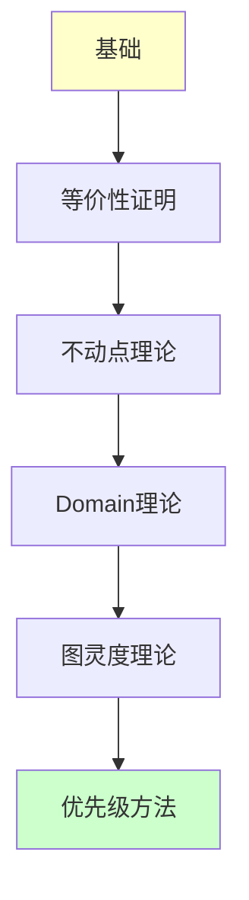

### 7.3 现代应用路径

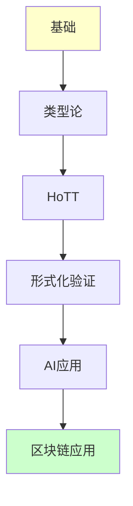

### 7.4 跨学科路径

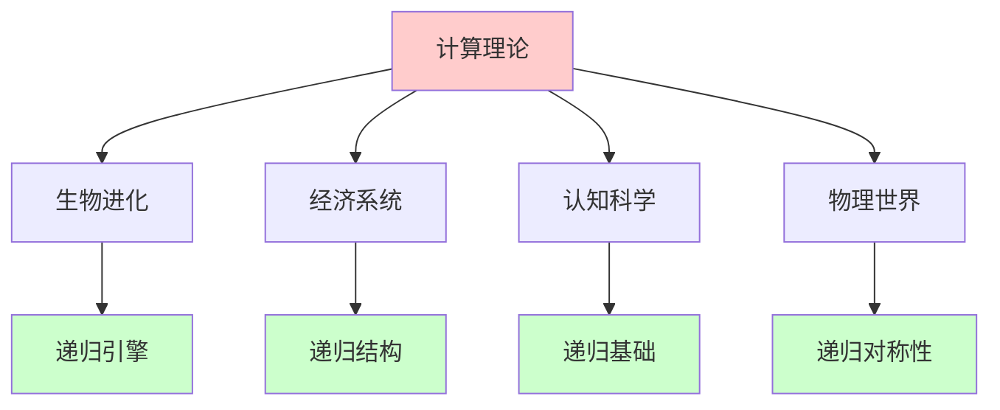

---

## 8. 模块间完整关联图

### 8.1 13个核心模块关联

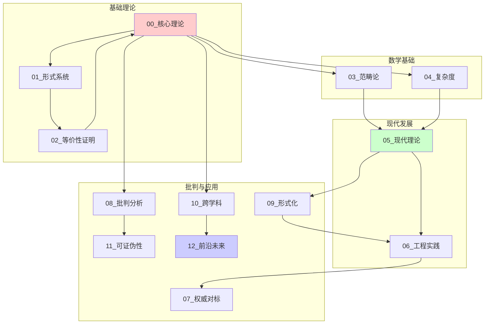

### 8.2 知识流动方向

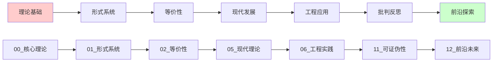

---

## 9. 论证完整性检查

### 9.1 核心论证链完整性

| 论证链 | 起点 | 终点 | 完整性 | 状态 |
|--------|------|------|--------|------|
| **计算等价性** | Church-Turing论题 | 七系统等价 | ✅ 完整 | ✅ 已证明 |
| **不可判定性** | 停机问题 | Rice定理 | ✅ 完整 | ✅ 已证明 |
| **递归理论** | RE集 | 图灵度 | ⚠️ 部分 | ⏳ 需补充 |
| **类型论** | Lambda演算 | HoTT | ✅ 完整 | ✅ 已覆盖 |
| **应用连接** | 理论 | 工程实践 | ✅ 完整 | ✅ 已连接 |

### 9.2 缺失的论证连接

**需要补充的连接**:

1. **递归论深度**:
   - [ ] 图灵度理论的详细推导
   - [ ] 跳跃算子的完整证明
   - [ ] 优先级方法的深度分析

2. **复杂度理论**:
   - [ ] 多项式层级的详细分析
   - [ ] Oracle机器的深度理论
   - [ ] 复杂度类分离技术

3. **范畴论深度**:
   - [ ] Yoneda引理的完整证明
   - [ ] Kan扩张的详细理论
   - [ ] 单子理论的深度分析

---

## 10. 后续完善计划

### 10.1 立即补充

1. **完善缺失的论证连接**
2. **补充深度理论推导**
3. **扩展应用领域连接**

### 10.2 中期目标

1. **创建交互式逻辑关系图**
2. **实现概念依赖查询系统**
3. **建立学习路径推荐系统**

---

**最后更新**: 2025-12-04
**维护者**: FormalScience Team
**状态**: 🚀 持续更新中
