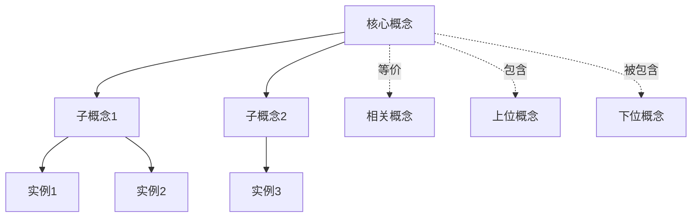
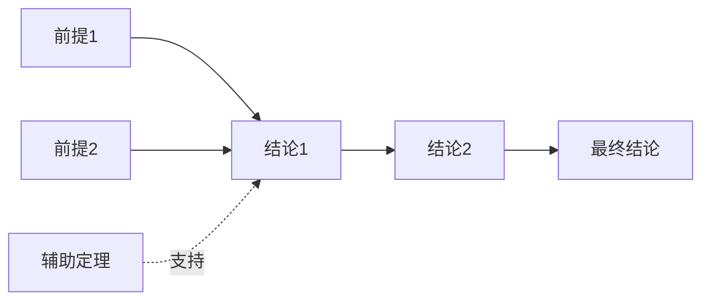
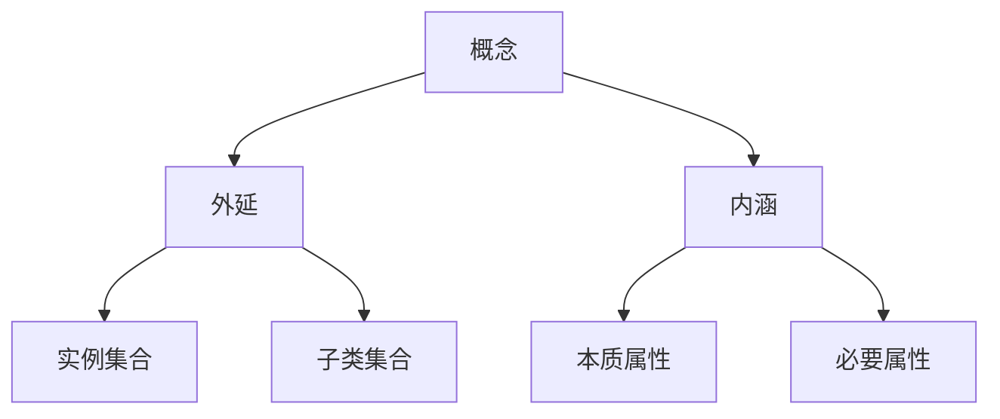
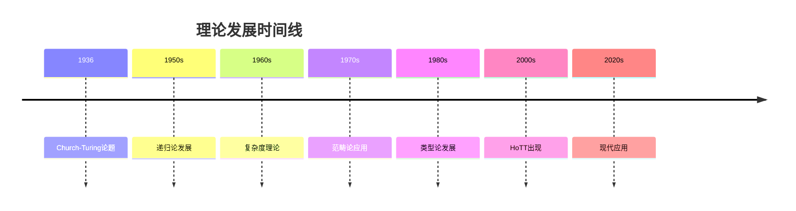
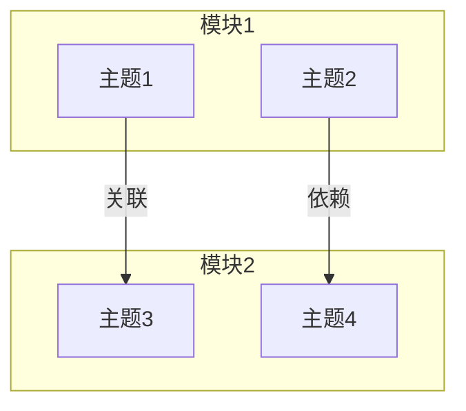

# 【全面推进计划】FormalRE内容扩展与完善

> **制定日期**: 2025-12-04
> **当前时间**: 2025年12月4日
> **目标**: 将FormalRE提升至国际顶尖水平
> **对标基准**: Wikipedia + MIT/Stanford/CMU课程 + 国际权威教材

---

## 📋 目录

- [【全面推进计划】FormalRE内容扩展与完善](#全面推进计划formalre内容扩展与完善)
  - [📋 目录](#-目录)
  - [1. 项目现状评估](#1-项目现状评估)
    - [1.1 已完成内容](#11-已完成内容)
    - [1.2 核心问题](#12-核心问题)
  - [2. 核心问题识别](#2-核心问题识别)
    - [2.1 内容深度问题](#21-内容深度问题)
    - [2.2 内容广度问题](#22-内容广度问题)
  - [3. 对标标准与基准](#3-对标标准与基准)
    - [3.1 Wikipedia对标标准](#31-wikipedia对标标准)
    - [3.2 国际著名大学课程对标](#32-国际著名大学课程对标)
    - [3.3 权威教材对标](#33-权威教材对标)
  - [4. 内容扩展策略](#4-内容扩展策略)
    - [4.1 理论内容扩展标准](#41-理论内容扩展标准)
    - [4.2 概念分析标准](#42-概念分析标准)
  - [5. 思维表征体系完善](#5-思维表征体系完善)
    - [5.1 现有表征](#51-现有表征)
    - [5.2 需要补充的表征](#52-需要补充的表征)
  - [6. 逻辑关系图完善](#6-逻辑关系图完善)
    - [6.1 主题-子主题论证逻辑](#61-主题-子主题论证逻辑)
    - [6.2 跨模块关联](#62-跨模块关联)
  - [7. 执行任务分解](#7-执行任务分解)
    - [Phase 1: 基础内容扩展 (Week 1-2)](#phase-1-基础内容扩展-week-1-2)
    - [Phase 2: 思维表征扩展 (Week 3-4)](#phase-2-思维表征扩展-week-3-4)
    - [Phase 3: 深度内容补充 (Week 5-8)](#phase-3-深度内容补充-week-5-8)
    - [Phase 4: 应用广度扩展 (Week 9-10)](#phase-4-应用广度扩展-week-9-10)
    - [Phase 5: 形式化完善 (Week 11-12)](#phase-5-形式化完善-week-11-12)
  - [8. 时间计划编排](#8-时间计划编排)
    - [第一阶段：基础扩展 (2025-12-04 至 2025-12-18)](#第一阶段基础扩展-2025-12-04-至-2025-12-18)
    - [第二阶段：表征扩展 (2025-12-18 至 2026-01-01)](#第二阶段表征扩展-2025-12-18-至-2026-01-01)
    - [第三阶段：深度扩展 (2026-01-01 至 2026-01-29)](#第三阶段深度扩展-2026-01-01-至-2026-01-29)
    - [第四阶段：广度扩展 (2026-01-29 至 2026-02-12)](#第四阶段广度扩展-2026-01-29-至-2026-02-12)
    - [第五阶段：形式化完善 (2026-02-12 至 2026-02-26)](#第五阶段形式化完善-2026-02-12-至-2026-02-26)
  - [9. 质量控制标准](#9-质量控制标准)
    - [9.1 内容质量标准](#91-内容质量标准)
    - [9.2 表征质量标准](#92-表征质量标准)
    - [9.3 对标质量标准](#93-对标质量标准)
  - [10. 持续改进机制](#10-持续改进机制)
    - [10.1 定期审查](#101-定期审查)
    - [10.2 反馈机制](#102-反馈机制)
    - [10.3 版本管理](#103-版本管理)
  - [📊 执行状态跟踪](#-执行状态跟踪)
    - [当前进度](#当前进度)
    - [关键里程碑](#关键里程碑)
  - [🎯 最终目标](#-最终目标)

---

## 1. 项目现状评估

### 1.1 已完成内容

**文档统计**:

- 总文档数: 199篇
- 总字数: 1,405,000+字
- 模块数: 13个核心模块 + 10个深度专题
- 完成度: 98% (结构层面)

**优势**:

- ✅ 完整的七系统证明链
- ✅ 结构化表征体系（6+1种）
- ✅ 批判性思维框架
- ✅ 工程实践连接

### 1.2 核心问题

**问题1: 实质性内容不足** ❌❌❌

```text
表现:
- 很多文档只有框架，缺少详细论证
- 定理陈述不够精确
- 证明多为"直觉解释"，缺少严格推导
- 缺少完整的数学符号系统

影响:
⚠️ 学术可信度降低
⚠️ 研究者难以引用
⚠️ 学习者难以深入理解
```

**问题2: 权威对标不足** ❌❌

```text
缺失:
- Wikipedia概念定义、属性、外延、内涵
- 国际著名大学课程内容对标
- 权威教材深度对比
- 最新研究动态（2024-2025）

影响:
⚠️ 内容权威性不足
⚠️ 与国际标准有差距
⚠️ 缺少最新发展
```

**问题3: 思维表征不够丰富** ❌

```text
已有:
✅ 思维导图
✅ 对比矩阵
✅ 决策树
✅ 证明树

缺失:
❌ 概念关系网络图
❌ 论证逻辑路径图
❌ 知识图谱（详细版）
❌ 概念属性矩阵
❌ 外延内涵分析图
```

**问题4: 逻辑关系不清晰** ❌

```text
缺失:
❌ 主题-子主题论证逻辑关系图
❌ 概念依赖关系图
❌ 理论发展脉络图
❌ 跨模块关联图
```

---

## 2. 核心问题识别

### 2.1 内容深度问题

**需要扩展的领域**:

1. **递归论核心主题**
   - 图灵度 (Turing Degrees) - 深度不足
   - 跳跃算子 (Jump Operator) - 缺少详细推导
   - 优先级方法 (Priority Method) - 只有入门
   - 低层次理论 (Low Basis Theorem) - 未覆盖
   - 递归论分层 - 不完整

2. **复杂度理论**
   - 多项式层级 (PH) - 深度不足
   - 交替图灵机 - 缺少详细分析
   - 电路复杂度 - 未覆盖
   - 通讯复杂度 - 未覆盖
   - Oracle机器理论 - 深度不足

3. **范畴论**
   - Yoneda引理 - 缺少深度证明
   - Kan扩张 - 未覆盖
   - 单子理论 - 深度不足
   - 2-范畴、∞-范畴 - 未覆盖

4. **形式化证明**
   - 很多定理缺少完整形式化
   - Coq/Lean代码不完整
   - 证明树不够详细

### 2.2 内容广度问题

**需要补充的应用领域**:

1. **工程应用**
   - 数据库理论（查询语言、事务）
   - 网络协议（TCP/IP、HTTP/3）
   - 操作系统（调度算法、内存管理）
   - 编译器优化（详细展开）
   - 硬件验证（芯片设计）

2. **现代前沿**
   - 线性逻辑深度
   - 分离逻辑
   - 并发逻辑
   - 模态逻辑
   - 时序逻辑（LTL/CTL深度）
   - 概率计算
   - 交互式证明

---

## 3. 对标标准与基准

### 3.1 Wikipedia对标标准

**每个核心概念需要包含**:

1. **定义 (Definition)**
   - 精确的数学定义
   - 形式化表述
   - 多种等价定义

2. **属性 (Properties)**
   - 基本性质
   - 运算性质
   - 关系性质

3. **外延 (Extension)**
   - 包含哪些实例
   - 包含哪些子类
   - 包含哪些特殊情况

4. **内涵 (Intension)**
   - 本质特征
   - 必要条件
   - 充分条件

5. **关系 (Relations)**
   - 与其他概念的关系
   - 层次关系
   - 等价关系
   - 包含关系

**对标Wikipedia词条**:

```text
核心词条:
- Recursively enumerable set
- Turing machine
- Church-Turing thesis
- Lambda calculus
- Computability theory
- Computational complexity theory
- Category theory
- Type theory
- Homotopy type theory
- Rice's theorem
- Halting problem
- Polynomial hierarchy
- Turing degree
- Yoneda lemma
```

### 3.2 国际著名大学课程对标

**MIT 6.045J (Automata, Computability, and Complexity)**

对标内容:

- 可计算性理论完整覆盖
- 复杂度理论深度
- 图灵度理论
- 证明技术

**Stanford CS154 (Automata and Complexity Theory)**

对标内容:

- 形式语言理论
- 计算模型等价性
- 复杂度类分离
- 现代应用

**CMU 15-814 (Type Systems)**

对标内容:

- 类型论深度
- Curry-Howard对应
- 依赖类型
- 形式化验证

**Oxford Category Theory Course**

对标内容:

- 范畴论基础
- Yoneda引理
- 单子理论
- Topos理论

### 3.3 权威教材对标

**计算理论**:

- Sipser, "Introduction to the Theory of Computation"
- Rogers, "Theory of Recursive Functions and Effective Computability"
- Soare, "Turing Computability"

**复杂度理论**:

- Arora & Barak, "Computational Complexity"
- Papadimitriou, "Computational Complexity"

**范畴论**:

- Mac Lane, "Categories for the Working Mathematician"
- Awodey, "Category Theory"
- Riehl, "Category Theory in Context"

**类型论**:

- Pierce, "Types and Programming Languages"
- Harper, "Practical Foundations for Programming Languages"
- The HoTT Book

---

## 4. 内容扩展策略

### 4.1 理论内容扩展标准

**每个主题需要包含**:

1. **历史背景**
   - 问题起源
   - 发展脉络
   - 关键人物

2. **形式化定义**
   - 精确数学定义
   - 多种等价表述
   - 符号系统

3. **核心定理**
   - 完整陈述
   - 严格证明
   - 证明思路
   - 应用场景

4. **关键性质**
   - 基本性质
   - 运算性质
   - 关系性质
   - 反例

5. **应用实例**
   - 理论应用
   - 工程应用
   - 跨学科应用

6. **批判性分析**
   - 局限性
   - 未解决问题
   - 争议观点

### 4.2 概念分析标准

**每个核心概念需要**:

1. **定义矩阵**

   | 维度 | 内容 |
   |------|------|
   | 形式化定义 | 精确数学表述 |
   | 直观理解 | 非形式化解释 |
   | 等价定义 | 其他表述方式 |
   | 历史定义 | 原始定义 |

2. **属性分析**
   - 必要属性
   - 充分属性
   - 本质属性
   - 偶然属性

3. **外延分析**
   - 包含的实例
   - 包含的子类
   - 边界情况

4. **内涵分析**
   - 核心特征
   - 本质属性
   - 与其他概念的区别

5. **关系网络**
   - 上位概念
   - 下位概念
   - 相关概念
   - 等价概念

---

## 5. 思维表征体系完善

### 5.1 现有表征

**已有**:

- ✅ 思维导图
- ✅ 对比矩阵
- ✅ 决策树
- ✅ 证明树

### 5.2 需要补充的表征

**1. 概念关系网络图**



**2. 论证逻辑路径图**



**3. 知识图谱（详细版）**

- 实体-关系-实体三元组
- 概念层次结构
- 属性关系
- 实例关系

**4. 概念属性矩阵**

| 概念 | 属性1 | 属性2 | 属性3 | 属性4 |
|------|-------|-------|-------|-------|
| 概念A | ✓ | ✓ | ✗ | ✓ |
| 概念B | ✓ | ✗ | ✓ | ✓ |

**5. 外延内涵分析图**



**6. 理论发展脉络图**



**7. 跨模块关联图**



---

## 6. 逻辑关系图完善

### 6.1 主题-子主题论证逻辑

**需要为每个模块创建**:

1. **论证依赖图**
   - 哪些子主题依赖哪些前提
   - 论证链条
   - 关键节点

2. **概念依赖图**
   - 概念之间的依赖关系
   - 学习顺序
   - 前置知识

3. **理论发展图**
   - 理论如何发展
   - 关键突破点
   - 影响关系

### 6.2 跨模块关联

**需要创建**:

1. **模块间依赖关系**
   - 哪些模块依赖哪些模块
   - 知识流动方向
   - 交叉引用

2. **概念跨模块映射**
   - 同一概念在不同模块的表现
   - 视角差异
   - 统一性

---

## 7. 执行任务分解

### Phase 1: 基础内容扩展 (Week 1-2)

**任务1.1: 核心概念Wikipedia对标**

- [ ] 递归可枚举集 - 完整定义、属性、外延、内涵
- [ ] 图灵机 - 完整定义、变体、性质
- [ ] Church-Turing论题 - 历史、表述、证据
- [ ] Lambda演算 - 语法、语义、性质
- [ ] 停机问题 - 定义、证明、应用
- [ ] Rice定理 - 完整陈述、证明、应用

**任务1.2: 核心定理严格化**

- [ ] 所有定理添加完整形式化表述
- [ ] 补充严格证明（非直觉解释）
- [ ] 添加证明思路和关键步骤
- [ ] 补充反例和边界情况

**任务1.3: 大学课程对标**

- [ ] MIT 6.045J内容对标
- [ ] Stanford CS154内容对标
- [ ] CMU 15-814内容对标
- [ ] 创建课程映射表

### Phase 2: 思维表征扩展 (Week 3-4)

**任务2.1: 概念关系网络**

- [ ] 为每个核心概念创建关系网络图
- [ ] 标注关系类型（等价、包含、依赖等）
- [ ] 创建全局概念关系图谱

**任务2.2: 论证逻辑路径**

- [ ] 为每个主要论证创建逻辑路径图
- [ ] 标注前提、推理步骤、结论
- [ ] 创建证明依赖图

**任务2.3: 知识图谱详细版**

- [ ] 实体-关系-实体三元组
- [ ] 概念层次结构
- [ ] 属性关系网络

### Phase 3: 深度内容补充 (Week 5-8)

**任务3.1: 递归论深度扩展**

- [ ] 图灵度理论完整展开
- [ ] 跳跃算子详细推导
- [ ] 优先级方法深度分析
- [ ] 低层次理论补充

**任务3.2: 复杂度理论扩展**

- [ ] 多项式层级详细分析
- [ ] 交替图灵机完整覆盖
- [ ] 电路复杂度补充
- [ ] 通讯复杂度补充

**任务3.3: 范畴论深度扩展**

- [ ] Yoneda引理完整证明
- [ ] Kan扩张补充
- [ ] 单子理论深度分析
- [ ] 2-范畴、∞-范畴入门

### Phase 4: 应用广度扩展 (Week 9-10)

**任务4.1: 工程应用补充**

- [ ] 数据库理论
- [ ] 网络协议
- [ ] 操作系统
- [ ] 编译器优化
- [ ] 硬件验证

**任务4.2: 现代前沿补充**

- [ ] 线性逻辑深度
- [ ] 分离逻辑
- [ ] 并发逻辑
- [ ] 模态逻辑
- [ ] 时序逻辑

### Phase 5: 形式化完善 (Week 11-12)

**任务5.1: 形式化证明补充**

- [ ] 所有核心定理的Coq/Lean代码
- [ ] 证明树详细化
- [ ] 形式化验证

**任务5.2: 代码示例完善**

- [ ] 可运行的代码示例
- [ ] 测试用例
- [ ] 性能分析

---

## 8. 时间计划编排

### 第一阶段：基础扩展 (2025-12-04 至 2025-12-18)

**Week 1 (12/04-12/10)**:

- 核心概念Wikipedia对标（6个核心概念）
- 核心定理严格化（10个核心定理）

**Week 2 (12/11-12/17)**:

- 大学课程对标（3门课程）
- 权威教材对标（5本教材）

### 第二阶段：表征扩展 (2025-12-18 至 2026-01-01)

**Week 3 (12/18-12/24)**:

- 概念关系网络图（20个核心概念）
- 论证逻辑路径图（10个主要论证）

**Week 4 (12/25-12/31)**:

- 知识图谱详细版
- 概念属性矩阵

### 第三阶段：深度扩展 (2026-01-01 至 2026-01-29)

**Week 5-6 (01/01-01/14)**:

- 递归论深度扩展
- 复杂度理论扩展

**Week 7-8 (01/15-01/28)**:

- 范畴论深度扩展
- 类型论深度扩展

### 第四阶段：广度扩展 (2026-01-29 至 2026-02-12)

**Week 9-10 (01/29-02/11)**:

- 工程应用补充
- 现代前沿补充

### 第五阶段：形式化完善 (2026-02-12 至 2026-02-26)

**Week 11-12 (02/12-02/25)**:

- 形式化证明补充
- 代码示例完善
- 最终质量检查

---

## 9. 质量控制标准

### 9.1 内容质量标准

**每个文档必须包含**:

1. ✅ 精确的定义（形式化）
2. ✅ 完整的定理陈述
3. ✅ 严格的证明（或引用）
4. ✅ 清晰的例子
5. ✅ 批判性分析
6. ✅ 权威引用

### 9.2 表征质量标准

**每个表征必须**:

1. ✅ 准确反映内容
2. ✅ 清晰易读
3. ✅ 完整覆盖
4. ✅ 标注关系类型

### 9.3 对标质量标准

**每个对标必须**:

1. ✅ 与Wikipedia一致
2. ✅ 与大学课程一致
3. ✅ 与权威教材一致
4. ✅ 标注差异和补充

---

## 10. 持续改进机制

### 10.1 定期审查

- **每周**: 检查进度，调整计划
- **每月**: 质量审查，对标检查
- **每季度**: 全面评估，更新标准

### 10.2 反馈机制

- 收集用户反馈
- 学术同行评议
- 持续更新内容

### 10.3 版本管理

- 版本号管理
- 变更日志
- 历史记录

---

## 📊 执行状态跟踪

### 当前进度

- [ ] Phase 1: 基础内容扩展 (0%)
- [ ] Phase 2: 思维表征扩展 (0%)
- [ ] Phase 3: 深度内容补充 (0%)
- [ ] Phase 4: 应用广度扩展 (0%)
- [ ] Phase 5: 形式化完善 (0%)

### 关键里程碑

- [ ] 2025-12-18: Phase 1完成
- [ ] 2026-01-01: Phase 2完成
- [ ] 2026-01-29: Phase 3完成
- [ ] 2026-02-12: Phase 4完成
- [ ] 2026-02-26: Phase 5完成

---

## 🎯 最终目标

**将FormalRE提升至**:

1. ✅ 国际顶尖水平的中文RE资源
2. ✅ 与Wikipedia、MIT/Stanford课程同等质量
3. ✅ 完整的思维表征体系
4. ✅ 清晰的逻辑关系图
5. ✅ 严格的数学表述
6. ✅ 丰富的应用实例

---

**最后更新**: 2025-12-04
**维护者**: FormalScience Team
**状态**: 🚀 进行中
