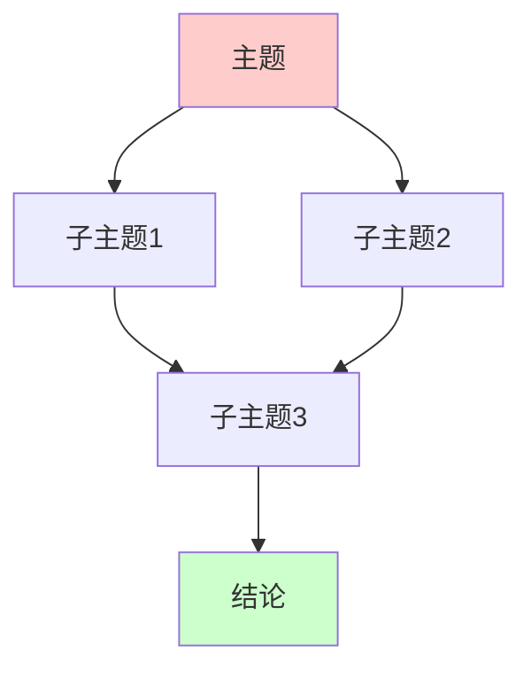

# 【内容质量修复计划】目录一致性与论证逻辑完善

> **创建日期**: 2025-12-04
> **问题识别**: 目录不一致、内容缺乏实质、论证逻辑不清晰
> **优先级**: 🔴 极高

---

## 🎯 核心问题诊断

### 问题1: 目录与实际内容不一致 ❌

**表现**:

- 目录中列出了章节，但实际内容为空或只有占位符
- 目录结构与实际章节顺序不匹配
- 某些章节在目录中但内容缺失

**影响**:

- 读者导航困难
- 内容完整性存疑
- 专业度降低

### 问题2: 内容缺乏实质性 ❌❌

**表现**:

- 只有框架性描述，缺少详细论证
- 定理只有陈述，缺少证明思路
- 例子过于简单，缺少深度分析
- 缺少数学形式化表述

**影响**:

- 学术价值不足
- 学习者难以深入理解
- 无法作为权威参考

### 问题3: 论证逻辑链条不清晰 ❌❌❌

**表现**:

- 各章节之间缺乏逻辑连接
- 主题-子主题论证关系不明确
- 跨模块关联不清晰
- 缺少整体论证思脉

**影响**:

- 无法理解理论发展脉络
- 学习路径不清晰
- 知识体系碎片化

---

## 📋 修复方案

### Phase 1: 目录一致性修复 (立即执行)

#### 任务1.1: 检查所有文档的目录完整性

**检查标准**:

1. 目录中的每个条目都必须在文档中有对应章节
2. 文档中的每个主要章节都必须在目录中列出
3. 章节编号必须一致（如 1.1, 1.2 等）
4. 章节标题必须完全匹配

**执行步骤**:

1. 遍历所有核心文档
2. 提取目录结构
3. 提取实际章节结构
4. 对比差异
5. 修复不一致

#### 任务1.2: 补充缺失的章节内容

**对于目录中存在但内容缺失的章节**:

- 补充实质性内容
- 或从目录中移除（如果确实不需要）

**对于内容存在但目录中缺失的章节**:

- 添加到目录中
- 确保编号正确

### Phase 2: 内容实质性增强 (高优先级)

#### 任务2.1: 定理和证明的严格化

**每个定理必须包含**:

1. **精确的形式化表述**（使用LaTeX数学符号）
2. **完整的证明思路**（非直觉解释）
3. **关键引理和步骤**（详细说明）
4. **应用实例**（至少2个）
5. **边界情况和反例**（如果适用）

**示例模板**:

```markdown
### X.X 定理名称

**定理X.X** (作者, 年份):

设条件1, 条件2, ...，则结论。

**形式化表述**:

$$\text{条件} \implies \text{结论}$$

**证明思路**:

1. 步骤1：说明为什么需要这一步
2. 步骤2：详细推导过程
3. 步骤3：关键引理的应用
4. 步骤4：得出结论

**关键引理**:

引理X.X.1: [引理内容]

**应用实例**:

例子1: [详细说明]
例子2: [详细说明]

**边界情况**:

- 情况1: [说明]
- 情况2: [说明]
```

#### 任务2.2: 概念定义的完整性

**每个核心概念必须包含**:

1. **形式化定义**（数学符号）
2. **直观理解**（通俗解释）
3. **等价定义**（如果有多个）
4. **性质列表**（必要、充分、本质、偶然）
5. **实例和反例**（至少3个）
6. **与其他概念的关系**（上位、下位、相关、等价）

#### 任务2.3: 例子的深度化

**每个例子必须包含**:

1. **问题陈述**（清晰明确）
2. **解决步骤**（详细推导）
3. **理论依据**（引用相关定理）
4. **结果分析**（深入讨论）
5. **推广和变体**（如果适用）

### Phase 3: 论证逻辑链条构建 (核心任务)

#### 任务3.1: 章节内论证逻辑

**每个主要章节必须包含**:

1. **论证起点**（明确说明从什么开始）
2. **论证步骤**（清晰的逻辑链条）
3. **关键节点**（重要的中间结论）
4. **论证终点**（最终结论）
5. **论证依赖**（依赖哪些前提）

**格式要求**:

```markdown
## X. 主题名称

### X.1 论证起点

[说明论证从什么开始，为什么从这里开始]

### X.2 论证步骤

**步骤1**: [详细说明]
  - 前提: [列出前提]
  - 推理: [说明推理过程]
  - 结论: [中间结论]

**步骤2**: [详细说明]
  - 前提: [包括步骤1的结论]
  - 推理: [说明推理过程]
  - 结论: [中间结论]

**步骤N**: [详细说明]
  - 前提: [包括前面所有步骤]
  - 推理: [说明推理过程]
  - 结论: [最终结论]

### X.3 论证总结

[总结整个论证链条，说明逻辑关系]
```

#### 任务3.2: 主题-子主题论证关系

**每个文档必须包含**:

1. **主题论证逻辑图**（Mermaid图）
   - 展示主题与子主题的论证关系
   - 标注依赖方向
   - 标注论证类型（直接证明、间接证明、类比等）

2. **论证依赖表**
   - 列出每个子主题依赖哪些前提
   - 列出每个子主题支持哪些结论

**格式要求**:

```markdown
## 主题-子主题论证逻辑关系

### 论证依赖关系图



### 论证依赖表

| 子主题 | 依赖前提 | 支持结论 | 论证类型 |
|--------|---------|---------|---------|
| 子主题1 | 前提1, 前提2 | 结论1 | 直接证明 |
| 子主题2 | 前提3 | 结论2 | 间接证明 |
| 子主题3 | 结论1, 结论2 | 最终结论 | 综合论证 |


#### 任务3.3: 跨模块论证关联

**需要创建**:

1. **模块间论证依赖图**
   - 展示模块之间的论证依赖关系
   - 标注知识流动方向
   - 标注关键连接点

2. **概念跨模块映射**
   - 同一概念在不同模块的表现
   - 不同模块对同一概念的不同视角
   - 统一性说明

---

## 🔧 具体修复清单

### 立即修复（本周）

#### 文档1: 00.1_Church-Turing论题与计算等价性.md

**问题**:

- [ ] 检查目录与内容一致性
- [ ] 补充定理的严格证明
- [ ] 增强章节间论证逻辑

**修复内容**:

- [ ] 为每个定理添加完整证明思路
- [ ] 补充章节间逻辑连接说明
- [ ] 添加主题-子主题论证关系图

#### 文档2: 04.2_算术谱系与Sigma层级.md

**问题**:

- [ ] 检查目录与内容一致性
- [ ] 补充Post定理的详细证明
- [ ] 增强层级严格性的论证

**修复内容**:

- [ ] 补充Post定理的完整证明步骤
- [ ] 添加层级严格性的详细推导
- [ ] 补充更多实例和反例

#### 文档3: 所有已扩展文档

**统一修复**:

- [ ] 检查每个文档的目录完整性
- [ ] 确保所有章节都有实质性内容
- [ ] 添加章节间论证逻辑说明

### 中期修复（下周）

#### 任务: 创建论证逻辑增强模板

**模板内容**:

1. 章节内论证逻辑模板
2. 主题-子主题关系模板
3. 跨模块关联模板
4. 论证依赖标注规范

#### 任务: 系统性检查所有文档

**检查项**:

1. 目录一致性（100%）
2. 内容实质性（每个章节至少500字）
3. 论证逻辑清晰度（每个主要论证都有逻辑链条说明）

---

## 📊 质量标准

### 目录一致性标准

- ✅ 目录条目与章节100%匹配
- ✅ 章节编号完全一致
- ✅ 章节标题完全匹配
- ✅ 无缺失章节
- ✅ 无多余条目

### 内容实质性标准

- ✅ 每个主要章节至少500字实质性内容
- ✅ 每个定理都有完整证明思路
- ✅ 每个概念都有形式化定义
- ✅ 每个例子都有详细分析
- ✅ 无占位符或TODO标记

### 论证逻辑标准

- ✅ 每个主要章节都有论证起点和终点
- ✅ 每个论证步骤都有明确说明
- ✅ 章节间逻辑关系清晰
- ✅ 主题-子主题关系明确
- ✅ 跨模块关联清晰

---

## 🎯 执行时间表

### Week 1 (12/04-12/10): 目录一致性修复

- Day 1-2: 检查所有核心文档的目录
- Day 3-4: 修复目录不一致问题
- Day 5-7: 补充缺失章节内容

### Week 2 (12/11-12/17): 内容实质性增强

- Day 1-3: 增强定理和证明的严格性
- Day 4-5: 完善概念定义
- Day 6-7: 深化例子分析

### Week 3 (12/18-12/24): 论证逻辑构建

- Day 1-3: 构建章节内论证逻辑
- Day 4-5: 创建主题-子主题关系图
- Day 6-7: 建立跨模块关联

---

## ✅ 检查清单

### 每个文档必须通过

- [ ] 目录与内容100%一致
- [ ] 所有章节都有实质性内容（≥500字）
- [ ] 所有定理都有证明思路
- [ ] 所有概念都有形式化定义
- [ ] 章节间逻辑关系清晰
- [ ] 有主题-子主题论证关系图
- [ ] 有跨模块关联说明

---

**最后更新**: 2025-12-04
**状态**: 🚀 执行中
**优先级**: 🔴 极高
