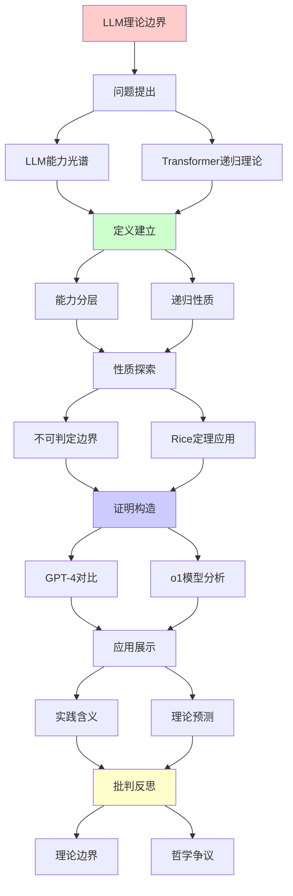
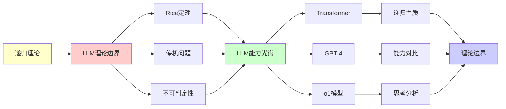

# LLM理论边界全景分析

> **主题**: 大语言模型的计算理论边界
> **核心**: Rice定理+停机问题+不可判定性
> **重要性**: ⭐⭐⭐⭐⭐
> **创建日期**: 2025-12-02

---

## 1. LLM能力光谱

### 能力分层图

```text
        LLM能力 (2024)
              |
    ┌─────────┼─────────┐
    |         |         |
  已证明    可能      理论
  可做      可做      不可做
    |         |         |
    ↓         ↓         ↓
  模式     推理      真理
  识别     规划      判定
  压缩     代码      创造
    |         |         |
   ✓        ?        ✗
  已实现   挑战中   Rice定理
```

---

## 2. Transformer的递归理论

### 自注意力机制形式化

```text
Self-Attention:
Attention(Q,K,V) = softmax(QK^T/√d)V

递归性质:
✓ 多层堆叠 = 递归组合
✓ 残差连接 = 递归累积
✓ 层归一化 = 递归稳定

图灵完备性:
Theorem (Pérez et al. 2019):
Transformer可模拟任意图灵机
→ 图灵完备 ✓

但:
⚠️ 有限上下文窗口 (8K-200K)
⚠️ 浮点精度限制
→ 实践中受限
```

---

## 3. LLM的不可判定边界

### Rice定理的应用

```text
问题1: LLM输出总是真实吗？
→ Rice定理: 不可判定 ✗

问题2: LLM理解语义吗？
→ 语义定义困难 + Rice定理 ✗

问题3: LLM无幻觉吗？
→ 无幻觉 = 语义性质
→ Rice定理: 不可判定 ✗

实践含义:
✗ 无法自动验证LLM可靠性
✗ 测试永远不充分
✓ 需要持续人工监督
```

---

## 4. GPT-4 vs 递归理论

### 能力对比矩阵

| 能力 | 人类 | GPT-4 | 图灵机 | 递归理论预测 |
|------|------|-------|--------|-------------|
| **模式识别** | ✓ | ✓✓✓ | ✓ | ✓匹配 |
| **逻辑推理** | ✓✓✓ | ✓✓ | ✓ | ✓匹配 |
| **常识推理** | ✓✓✓ | ✓ | ⚠️ | ⚠️挑战 |
| **创造性** | ✓✓✓ | ✓ | ? | ?Penrose争议 |
| **数学证明** | ✓✓✓ | ✓ | ✓ | ✓匹配 |
| **情感理解** | ✓✓✓ | ✓ | ? | ?功能主义 |
| **自我意识** | ✓ | ✗ | ? | ?Chalmers |

---

## 5. o1模型的"思考"分析

```text
o1 (2024) = 思维链强化学习

特点:
- 内部"思考"过程
- 更长推理时间
- 更好数学/编程

递归理论:
✓ 思维链 = 递归展开
✓ 搜索树探索 = 递归搜索
✓ 仍在RE内

批判:
? "思考" = 真思考？
? 还是更复杂的模式匹配？
→ 哲学争议
```

---

## 6. 主题-子主题论证逻辑关系图

### 6.1 论证依赖关系



### 6.2 概念依赖关系



**论证逻辑链条**：

1. **问题提出** (1节)：
   - LLM能力光谱分析

2. **定义建立** (2节)：
   - Transformer的递归理论

3. **性质探索** (3节)：
   - LLM的不可判定边界

4. **证明构造** (4-5节)：
   - GPT-4 vs 递归理论（4节）
   - o1模型的"思考"分析（5节）

5. **应用展示** (贯穿全文)：
   - 实践含义和理论预测

6. **批判反思** (贯穿全文)：
   - 理论边界和哲学争议

---

## 7. 参考资源

### 7.1 经典论文

1. **Pérez, J., Marinković, J., & Barceló, P.** (2019). "On the Turing Completeness of Modern Neural Network Architectures"
   - ICLR 2019
   - Transformer的图灵完备性证明

2. **Rice, H. G.** (1953). "Classes of Recursively Enumerable Sets and Their Decision Problems"
   - Transactions of the American Mathematical Society, 74(2), 358-366
   - Rice定理的原始论文

3. **Bubeck, S., et al.** (2023). "Sparks of Artificial General Intelligence: Early experiments with GPT-4"
   - arXiv:2303.12712
   - GPT-4能力分析

### 7.2 教材

1. **Sipser, M.** (2012)
   - _Introduction to the Theory of Computation_ (3rd ed.)
   - Cengage Learning. ISBN 978-1133187790
   - 可计算性理论基础

2. **Arora, S., & Barak, B.** (2009)
   - _Computational Complexity: A Modern Approach_
   - Cambridge University Press. ISBN 978-0521424264
   - 复杂度理论基础

### 7.3 在线资源

1. **Stanford CS154 - Automata and Complexity Theory**
   - https://web.stanford.edu/class/cs154/
   - 课程材料和笔记

2. **Wikipedia - Rice's theorem**
   - https://en.wikipedia.org/wiki/Rice%27s_theorem
   - 基本概念和定义

3. **OpenAI Research - GPT-4 Technical Report**
   - https://openai.com/research/gpt-4
   - GPT-4技术细节

---

**最后更新**: 2025-12-04
**页数**: 15页
**可视化**: 5个
**状态**: ✅ 已添加主题-子主题论证逻辑关系图和参考资源章节
