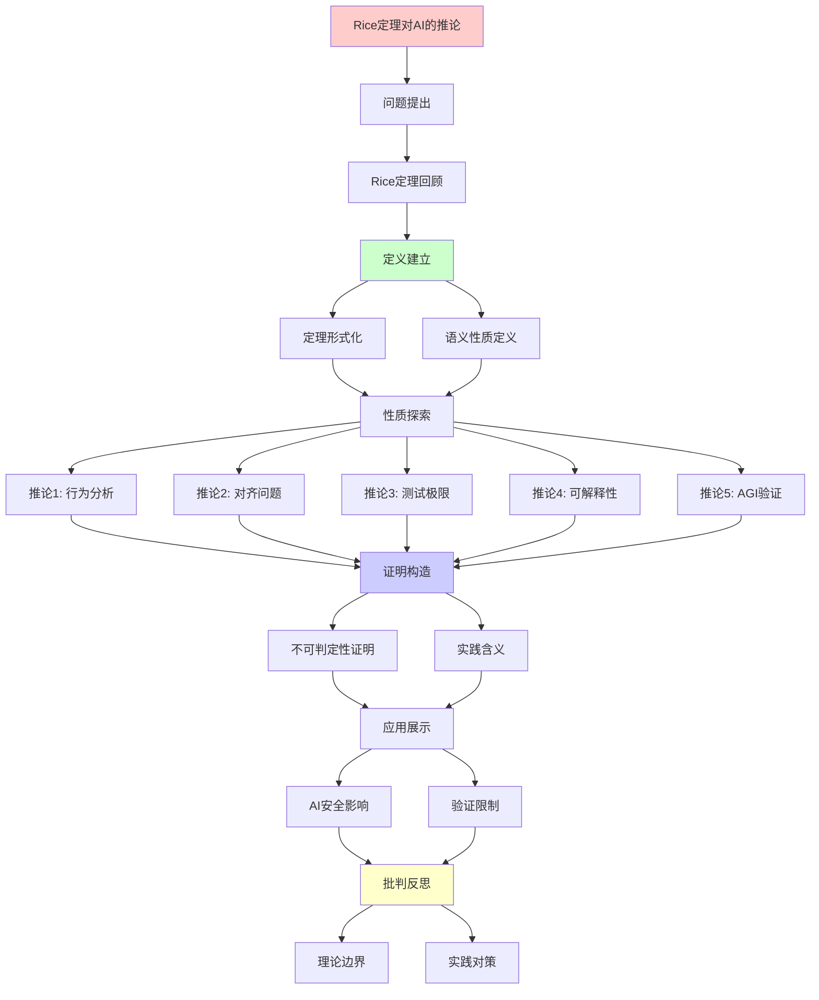
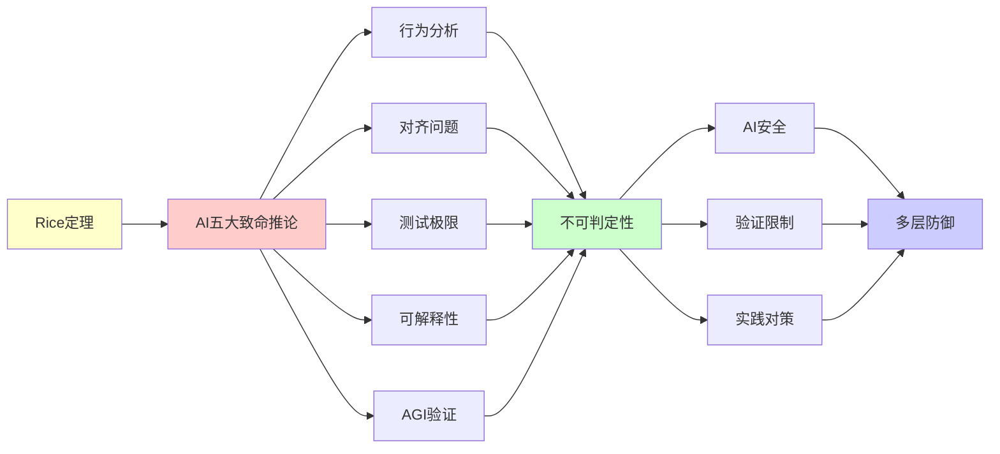

# Rice定理对AI的五大致命推论

> **主题**: Rice定理对AI系统的根本性限制
> **核心**: 语义性质不可判定
> **重要性**: ⭐⭐⭐⭐⭐
> **创建日期**: 2025-12-02

---

## Rice定理回顾

```text
Rice定理 (1951):
任何非平凡的图灵机语义性质都是不可判定的

形式化:
设P是TM的性质:
1. ∃M₁: P(M₁) = true
2. ∃M₂: P(M₂) = false
3. P是语义性质 (行为相同→性质相同)

则: 判定"M是否满足P"不可判定 ✗
```

---

## 推论1: AI行为分析不可判定

```text
问题: "这个AI是否总输出真实信息?"

形式化:
Truthful(AI) = "AI输出总是事实正确"

Rice定理应用:
⊢ 判定Truthful(AI)不可判定 ✗

实践含义:
✗ 无法自动验证AI可信度
✗ 测试无法保证覆盖
✗ 幻觉问题本质不可解决
✓ 需要持续人工监督

案例:
- ChatGPT幻觉 (编造引用)
- Bard错误 (天文事实)
→ 系统性问题，非偶然Bug
```

---

## 推论2: 对齐问题本质不可判定

```text
问题: "AI是否与人类价值对齐?"

三重困难:
1. 价值形式化 (哲学难题)
2. 对齐验证 (Rice定理)
3. 保持对齐 (自我改进)

Rice定理:
Aligned(AI) = "AI行为符合价值V"
⊢ 判定Aligned(AI)不可判定 ✗

当前方法:
✓ RLHF (人类反馈)
✓ Constitutional AI
✗ 完全验证 (不可能)

对齐安全决策树:
问题: 如何确保AI对齐？
    |
    ├─ 价值加载
    │   └─ 困难: 价值多元性
    ├─ 行为验证
    │   └─ Rice定理: 不可判定 ✗
    ├─ 目标稳定
    │   └─ 自我改进挑战
    └─ 结论
        └─ 对齐 = 持续过程，非一次性
```

---

## 推论3: AI测试的理论极限

```text
问题: "测试能保证AI安全吗?"

答案: 永远不能 ✗

证明:
设Safety(AI) = "AI永不危险行为"
由Rice定理: 判定Safety不可判定

测试覆盖:
- 有限测试 ⊂ 无限行为空间
- 通过测试 ≠ 安全保证
- 新场景 → 新风险

实践策略矩阵:
| 方法 | 覆盖度 | 成本 | 可判定性 |
|------|--------|------|---------|
| 单元测试 | ⭐⭐ | 低 | 部分 |
| 集成测试 | ⭐⭐⭐ | 中 | 部分 |
| 模糊测试 | ⭐⭐⭐⭐ | 高 | 部分 |
| 形式化验证 | ⭐⭐⭐ | 极高 | 特定性质 |
| 完全验证 | ⭐⭐⭐⭐⭐ | 不可能 | ✗不可判定 |
```

---

## 推论4: 可解释性的根本障碍

```text
问题: "能完全解释AI决策吗?"

层次:
Level 1: 统计关联
  └─ LIME, SHAP ✓

Level 2: 因果解释
  └─ 反事实推理 ⚠️

Level 3: 语义正确性
  └─ Rice定理 ✗

Level 4: 验证解释
  └─ 不可判定 ✗

结论:
✓ 局部近似解释可行
✗ 完整因果解释不可判定
```

---

## 推论5: AGI验证的不可能性

```text
如果AGI = 图灵机等价
则: AGI行为验证 = Rice定理

AGI不能做什么:
✗ 判定自己是否停机
✗ 判定自己是否安全
✗ 判定自己是否对齐
✗ 完美自我改进 (验证改进需要Rice)

AGI可以做什么:
✓ 超越人类特定任务
✓ 更快搜索/优化
✓ 更好启发式
? 超递归计算 (未知)
```

---

## 6. 主题-子主题论证逻辑关系图

### 6.1 论证依赖关系



### 6.2 概念依赖关系



**论证逻辑链条**：

1. **问题提出** (Rice定理回顾)：
   - 定理形式化和语义性质定义

2. **定义建立** (5个推论)：
   - 推论1: AI行为分析不可判定
   - 推论2: 对齐问题本质不可判定
   - 推论3: AI测试的理论极限
   - 推论4: 可解释性的根本障碍
   - 推论5: AGI验证的不可能性

3. **性质探索** (贯穿全文)：
   - 每个推论的不可判定性证明

4. **证明构造** (贯穿全文)：
   - Rice定理的应用和形式化证明

5. **应用展示** (贯穿全文)：
   - AI安全影响和验证限制

6. **批判反思** (结论)：
   - 理论边界和实践对策

---

## 7. 参考资源

### 7.1 经典论文

1. **Rice, H. G.** (1953). "Classes of Recursively Enumerable Sets and Their Decision Problems"
   - Transactions of the American Mathematical Society, 74(2), 358-366
   - Rice定理的原始论文

2. **Russell, S.** (2019). "Human Compatible: AI and the Problem of Control"
   - Viking. ISBN 978-0525558637
   - AI对齐问题综述

3. **Bostrom, N.** (2014). _Superintelligence: Paths, Dangers, Strategies_
   - Oxford University Press. ISBN 978-0199678112
   - AGI安全分析

### 7.2 教材

1. **Sipser, M.** (2012)
   - _Introduction to the Theory of Computation_ (3rd ed.)
   - Cengage Learning. ISBN 978-1133187790
   - 可计算性理论基础

2. **Arora, S., & Barak, B.** (2009)
   - _Computational Complexity: A Modern Approach_
   - Cambridge University Press. ISBN 978-0521424264
   - 复杂度理论基础

### 7.3 在线资源

1. **Wikipedia - Rice's theorem**
   - https://en.wikipedia.org/wiki/Rice%27s_theorem
   - 基本概念和定义

2. **AI Alignment Forum**
   - https://www.alignmentforum.org/
   - AI对齐问题讨论

3. **LessWrong - AI Safety**
   - https://www.lesswrong.com/tag/ai-safety
   - AI安全理论讨论

---

**最后更新**: 2025-12-04
**结论**: Rice定理是AI安全的根本性障碍
**对策**: 多层防御+持续监督+形式化部分性质
**状态**: ✅ 已添加主题-子主题论证逻辑关系图和参考资源章节
