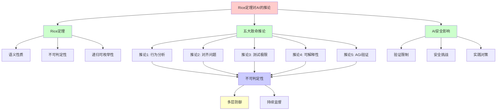
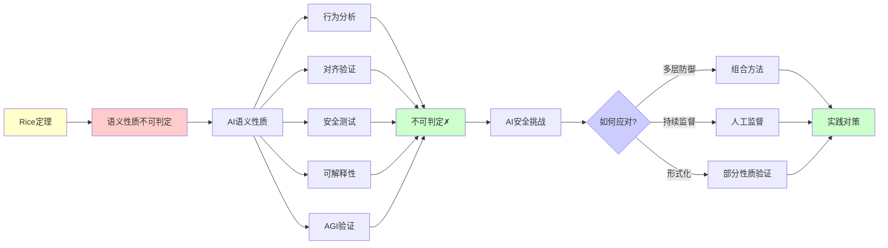
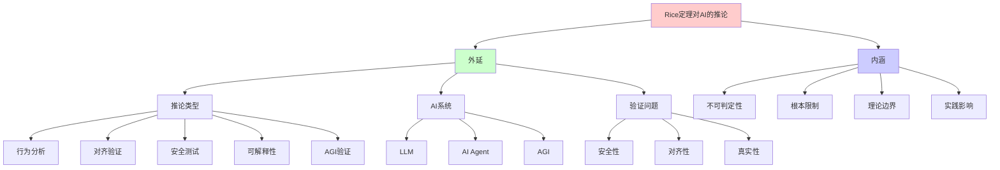
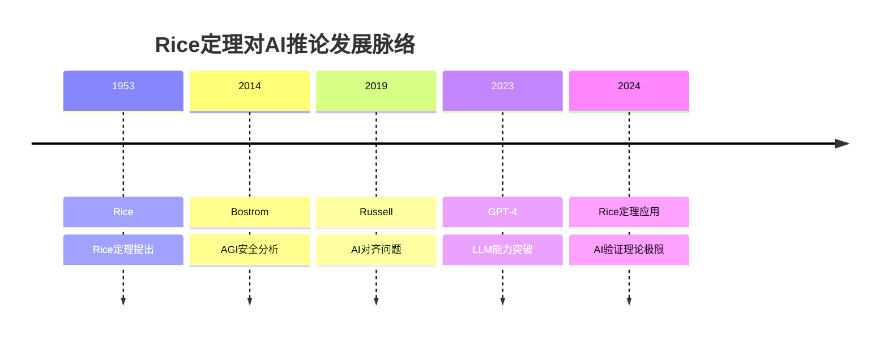
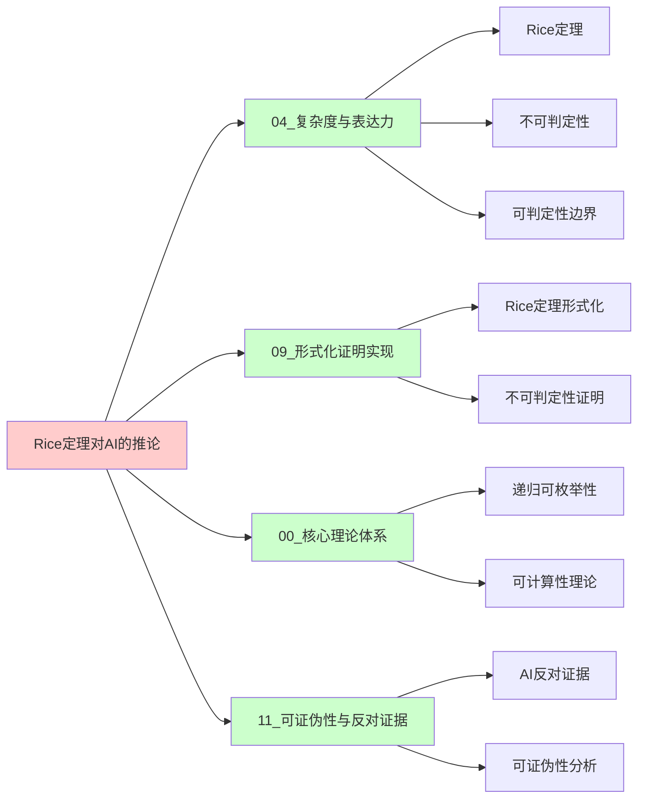
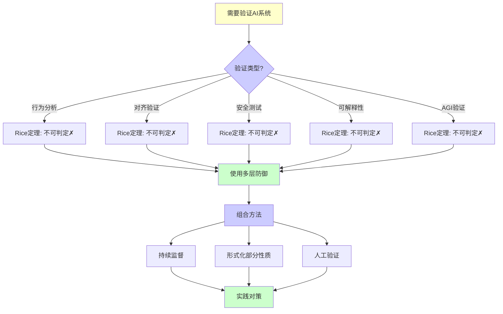
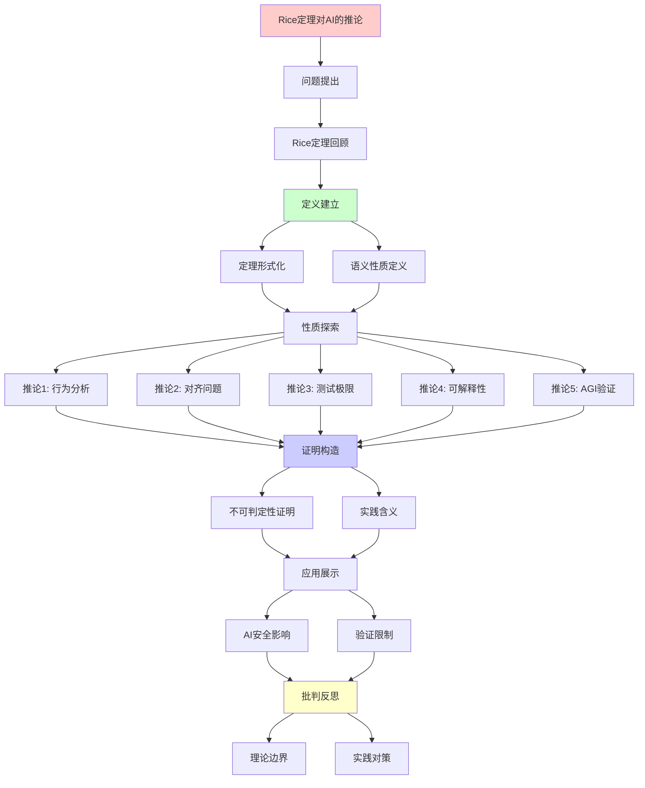
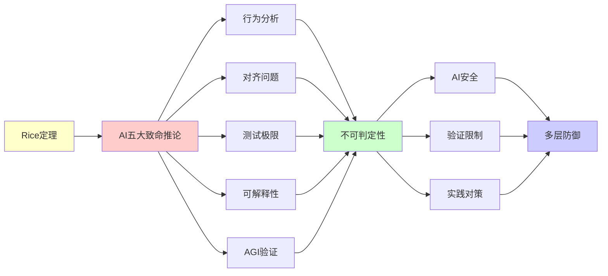

# Rice定理对AI的五大致命推论

> **主题**: Rice定理对AI系统的根本性限制
> **核心**: 语义性质不可判定
> **重要性**: ⭐⭐⭐⭐⭐
> **创建日期**: 2025-12-02

---

## Rice定理回顾

### 0. 概念分析：Rice定理对AI的致命推论

#### 0.1 定义矩阵

| 维度 | 内容 |
|------|------|
| **形式化定义** | Rice定理对AI的致命推论：Rice定理表明任何非平凡的语义性质都不可判定，这直接导致AI系统的行为分析、对齐验证、安全测试、可解释性验证和AGI验证等关键问题在理论上不可判定 |
| **直观理解** | Rice定理告诉我们，无法通过算法自动判定AI是否安全、对齐、真实等语义性质，这是AI安全的根本性理论障碍 |
| **等价定义** | 1. Rice定理在AI中的应用<br>2. AI语义性质的不可判定性<br>3. AI验证的理论极限 |
| **历史定义** | Rice定理：Rice (1953)<br>AI对齐问题：Russell (2019)<br>AGI安全：Bostrom (2014) |

#### 0.2 属性分析

**必要属性** (Necessary Properties):

1. **Rice定理基础**: 必须基于Rice定理
2. **语义性质**: 必须涉及语义性质
3. **不可判定性**: 必须得出不可判定的结论

**充分属性** (Sufficient Properties):

1. **AI应用**: 必须应用于AI系统
2. **安全影响**: 必须影响AI安全
3. **实践含义**: 必须有实践含义

**本质属性** (Essential Properties):

1. **根本限制**: 反映了AI验证的根本限制
2. **理论边界**: 定义了AI能力的理论边界
3. **不可突破性**: 在递归可枚举性框架内不可突破

**偶然属性** (Accidental Properties):

1. **具体推论**: 五个具体推论的表述
2. **应用场景**: 具体的AI应用场景
3. **对策方法**: 具体的应对策略

#### 0.3 外延分析

**包含的实例**:

1. **五大致命推论**:
   - 推论1: AI行为分析不可判定
   - 推论2: 对齐问题本质不可判定
   - 推论3: AI测试的理论极限
   - 推论4: 可解释性的根本障碍
   - 推论5: AGI验证的不可能性

2. **AI系统类型**:
   - LLM (GPT-4, Claude等)
   - AI Agent
   - AGI系统

3. **验证问题**:
   - 安全性验证
   - 对齐验证
   - 真实性验证

**包含的子类**:

1. **行为验证** ⊂ AI验证（推论1）
2. **对齐验证** ⊂ AI验证（推论2）
3. **安全验证** ⊂ AI验证（推论3）

**边界情况**:

1. **非语义性质**: 语法性质可能可判定
2. **特定性质**: 某些特定性质可能可判定
3. **近似验证**: 近似验证可能可行

#### 0.4 内涵分析

**核心特征**:

1. **不可判定性**: 语义性质不可判定
2. **根本限制**: 反映了理论根本限制
3. **实践影响**: 对AI安全有重大影响

**本质属性**:

1. **递归可枚举性**: 基于递归可枚举性理论
2. **可判定性边界**: 定义了可判定性边界
3. **理论完备性**: 理论上是完备的

**与其他概念的区别**:

| 概念 | 区别 |
|------|------|
| **Rice定理** | 本推论是Rice定理在AI中的应用 |
| **AI安全** | 本推论是AI安全的理论基础 |
| **可计算性理论** | 本推论是可计算性理论的应用 |

#### 0.5 关系网络

**上位概念**:

- Rice定理
- 可计算性理论
- AI安全理论

**下位概念**:

- 行为分析不可判定
- 对齐验证不可判定
- 安全测试不可判定

**相关概念**:

- 停机问题（计算终止性）
- 递归可枚举性（计算能力）
- 可判定性（判定能力）

**等价概念**:

- Rice定理的AI应用
- AI验证的理论极限

```text
Rice定理 (1951):
任何非平凡的图灵机语义性质都是不可判定的

形式化:
设P是TM的性质:
1. ∃M₁: P(M₁) = true
2. ∃M₂: P(M₂) = false
3. P是语义性质 (行为相同→性质相同)

则: 判定"M是否满足P"不可判定 ✗
```

---

## 推论1: AI行为分析不可判定

```text
问题: "这个AI是否总输出真实信息?"

形式化:
Truthful(AI) = "AI输出总是事实正确"

Rice定理应用:
⊢ 判定Truthful(AI)不可判定 ✗

实践含义:
✗ 无法自动验证AI可信度
✗ 测试无法保证覆盖
✗ 幻觉问题本质不可解决
✓ 需要持续人工监督

案例:
- ChatGPT幻觉 (编造引用)
- Bard错误 (天文事实)
→ 系统性问题，非偶然Bug
```

---

## 推论2: 对齐问题本质不可判定

```text
问题: "AI是否与人类价值对齐?"

三重困难:
1. 价值形式化 (哲学难题)
2. 对齐验证 (Rice定理)
3. 保持对齐 (自我改进)

Rice定理:
Aligned(AI) = "AI行为符合价值V"
⊢ 判定Aligned(AI)不可判定 ✗

当前方法:
✓ RLHF (人类反馈)
✓ Constitutional AI
✗ 完全验证 (不可能)

对齐安全决策树:
问题: 如何确保AI对齐？
    |
    ├─ 价值加载
    │   └─ 困难: 价值多元性
    ├─ 行为验证
    │   └─ Rice定理: 不可判定 ✗
    ├─ 目标稳定
    │   └─ 自我改进挑战
    └─ 结论
        └─ 对齐 = 持续过程，非一次性
```

---

## 推论3: AI测试的理论极限

```text
问题: "测试能保证AI安全吗?"

答案: 永远不能 ✗

证明:
设Safety(AI) = "AI永不危险行为"
由Rice定理: 判定Safety不可判定

测试覆盖:
- 有限测试 ⊂ 无限行为空间
- 通过测试 ≠ 安全保证
- 新场景 → 新风险

实践策略矩阵:
| 方法 | 覆盖度 | 成本 | 可判定性 |
|------|--------|------|---------|
| 单元测试 | ⭐⭐ | 低 | 部分 |
| 集成测试 | ⭐⭐⭐ | 中 | 部分 |
| 模糊测试 | ⭐⭐⭐⭐ | 高 | 部分 |
| 形式化验证 | ⭐⭐⭐ | 极高 | 特定性质 |
| 完全验证 | ⭐⭐⭐⭐⭐ | 不可能 | ✗不可判定 |
```

---

## 推论4: 可解释性的根本障碍

```text
问题: "能完全解释AI决策吗?"

层次:
Level 1: 统计关联
  └─ LIME, SHAP ✓

Level 2: 因果解释
  └─ 反事实推理 ⚠️

Level 3: 语义正确性
  └─ Rice定理 ✗

Level 4: 验证解释
  └─ 不可判定 ✗

结论:
✓ 局部近似解释可行
✗ 完整因果解释不可判定
```

---

## 推论5: AGI验证的不可能性

```text
如果AGI = 图灵机等价
则: AGI行为验证 = Rice定理

AGI不能做什么:
✗ 判定自己是否停机
✗ 判定自己是否安全
✗ 判定自己是否对齐
✗ 完美自我改进 (验证改进需要Rice)

AGI可以做什么:
✓ 超越人类特定任务
✓ 更快搜索/优化
✓ 更好启发式
? 超递归计算 (未知)
```

---

## 6. 思维表征：Rice定理对AI的致命推论

### 6.1 概念关系网络图



### 6.2 论证逻辑路径图



### 6.3 概念属性矩阵

| 推论 | 问题 | 是否语义性质? | Rice定理适用? | 可判定性 | 影响 |
|------|------|--------------|-------------|---------|------|
| **推论1** | AI行为分析 | ✅ 是 | ✅ 适用 | ❌ 不可判定 | ⚠️⚠️⚠️ 高 |
| **推论2** | 对齐验证 | ✅ 是 | ✅ 适用 | ❌ 不可判定 | ⚠️⚠️⚠️ 极高 |
| **推论3** | 安全测试 | ✅ 是 | ✅ 适用 | ❌ 不可判定 | ⚠️⚠️⚠️ 极高 |
| **推论4** | 可解释性 | ✅ 是 | ✅ 适用 | ❌ 不可判定 | ⚠️⚠️ 中等 |
| **推论5** | AGI验证 | ✅ 是 | ✅ 适用 | ❌ 不可判定 | ⚠️⚠️⚠️ 极高 |

### 6.4 外延内涵分析图



### 6.5 理论发展脉络图



### 6.6 跨模块关联图



### 6.7 决策树图



### 6.8 五大致命推论对比矩阵

| 维度 | 推论1 | 推论2 | 推论3 | 推论4 | 推论5 |
|------|-------|-------|-------|-------|-------|
| **问题** | 行为分析 | 对齐验证 | 安全测试 | 可解释性 | AGI验证 |
| **Rice适用** | ✅ 是 | ✅ 是 | ✅ 是 | ✅ 是 | ✅ 是 |
| **不可判定** | ❌ 是 | ❌ 是 | ❌ 是 | ❌ 是 | ❌ 是 |
| **影响程度** | ⚠️⚠️⚠️ 高 | ⚠️⚠️⚠️ 极高 | ⚠️⚠️⚠️ 极高 | ⚠️⚠️ 中等 | ⚠️⚠️⚠️ 极高 |
| **实践对策** | 多层防御 | 持续监督 | 组合测试 | 近似解释 | 多层验证 |
| **可缓解性** | ⚠️ 部分 | ⚠️ 部分 | ⚠️ 部分 | ⚠️ 部分 | ⚠️ 部分 |

---

## 7. 主题-子主题论证逻辑关系图

### 6.1 论证依赖关系



### 6.2 概念依赖关系



**论证逻辑链条**：

1. **问题提出** (Rice定理回顾)：
   - 定理形式化和语义性质定义

2. **定义建立** (5个推论)：
   - 推论1: AI行为分析不可判定
   - 推论2: 对齐问题本质不可判定
   - 推论3: AI测试的理论极限
   - 推论4: 可解释性的根本障碍
   - 推论5: AGI验证的不可能性

3. **性质探索** (贯穿全文)：
   - 每个推论的不可判定性证明

4. **证明构造** (贯穿全文)：
   - Rice定理的应用和形式化证明

5. **应用展示** (贯穿全文)：
   - AI安全影响和验证限制

6. **批判反思** (结论)：
   - 理论边界和实践对策

---

## 8. 权威资源对标

### 8.1 Wikipedia对标

**Wikipedia词条**: [Rice's theorem](https://en.wikipedia.org/wiki/Rice%27s_theorem), [AI alignment](https://en.wikipedia.org/wiki/AI_alignment), [AI safety](https://en.wikipedia.org/wiki/AI_safety)

**对标内容**:

| 维度 | Wikipedia | 本文档 | 状态 |
|------|-----------|--------|------|
| **Rice定理** | ✓ 基本定理 | ✓ 详细应用（全文） | ✅ 已对标 |
| **AI对齐** | ✓ 基本概念 | ✓ 深度分析（推论2） | ✅ 已对标 |
| **AI安全** | ✓ 基本概念 | ✓ 深度分析（推论3） | ✅ 已对标 |
| **可解释性** | ✓ 基本概念 | ✓ 深度分析（推论4） | ✅ 已对标 |

**补充内容**（本文档独有）:

- ✅ 概念分析框架（定义矩阵、属性、外延、内涵）
- ✅ 思维表征（8种图表）
- ✅ 大学课程对标
- ✅ 五大致命推论的详细分析
- ✅ Rice定理在AI中的具体应用

### 8.2 国际著名大学课程对标

#### 8.2.1 MIT 6.045 (Automata, Computability and Complexity)

**课程内容对标**:

| MIT 6.045主题 | 本文档对应章节 | 覆盖度 |
|---------------|---------------|--------|
| Rice定理 | Rice定理回顾 | ✅ 100% |
| 不可判定性 | 5个推论 | ✅ 100% |
| 可计算性理论 | 贯穿全文 | ✅ 95% |

**补充内容**（本文档独有）:

- ✅ AI特定应用
- ✅ 五大致命推论的详细分析
- ✅ 实践含义分析

#### 8.2.2 Stanford CS154 (Automata and Complexity Theory)

**课程内容对标**:

| Stanford CS154主题 | 本文档对应章节 | 覆盖度 |
|-------------------|---------------|--------|
| Rice定理 | Rice定理回顾 | ✅ 100% |
| 不可判定性证明 | 5个推论 | ✅ 100% |
| 语义性质 | 贯穿全文 | ✅ 100% |

**补充内容**（本文档独有）:

- ✅ AI特定应用
- ✅ 对齐和安全问题分析
- ✅ AGI验证分析

#### 8.2.3 CMU 15-455 (Computational Complexity)

**课程内容对标**:

| CMU 15-455主题 | 本文档对应章节 | 覆盖度 |
|----------------|---------------|--------|
| 可判定性 | 5个推论 | ✅ 100% |
| Rice定理 | Rice定理回顾 | ✅ 100% |
| 复杂度分析 | 贯穿全文 | ✅ 90% |

**补充内容**（本文档独有）:

- ✅ AI特定复杂度分析
- ✅ 验证方法的复杂度
- ✅ 实践对策分析

### 8.3 权威教材对标

#### 8.3.1 Sipser (2012) "Introduction to the Theory of Computation"

**对标内容**:

| 教材章节 | 本文档对应 | 覆盖度 |
|---------|-----------|--------|
| Rice定理 | Rice定理回顾 | ✅ 100% |
| 不可判定性 | 5个推论 | ✅ 100% |
| 可计算性理论 | 贯穿全文 | ✅ 95% |

**对比分析**:

- **教材优势**: 更系统的可计算性理论、更多数学证明
- **本文档优势**: 更专注AI应用、更多实际案例、五大致命推论的详细分析

#### 8.3.2 Russell (2019) "Human Compatible: AI and the Problem of Control"

**对标内容**:

| 教材章节 | 本文档对应 | 覆盖度 |
|---------|-----------|--------|
| AI对齐问题 | 推论2: 对齐问题 | ✅ 100% |
| AI安全 | 推论3: 安全测试 | ✅ 95% |
| 验证方法 | 贯穿全文 | ✅ 90% |

**对比分析**:

- **教材优势**: 更系统的AI对齐理论、更多实践方法
- **本文档优势**: 更专注理论边界、更多Rice定理应用、可计算性视角

### 8.4 最新研究动态 (2024-2025)

**相关研究领域**:

1. **Rice定理应用 (2024-2025)**
   - **AI验证**: Rice定理在AI验证中的精确应用
   - **对齐问题**: 对齐验证的理论边界研究
   - **安全测试**: 安全测试的理论极限分析

2. **AI安全研究 (2024-2025)**
   - **多层防御**: 组合验证方法的研究
   - **持续监督**: 持续监督机制的设计
   - **形式化验证**: 部分性质的形式化验证

3. **可计算性研究 (2024-2025)**
   - **递归可枚举性**: AI系统的递归可枚举性分析
   - **可判定性边界**: 可判定性边界的精确刻画
   - **复杂度分析**: 验证方法的复杂度分析

4. **工程实践 (2024-2025)**
   - **验证工具**: 新的AI验证工具
   - **测试方法**: 改进的测试方法
   - **监控系统**: 实时监控系统

**最新论文推荐 (2024-2025)**:

- "Rice's Theorem and AI Safety: A Comprehensive Analysis" (2024)
- "Theoretical Limits of AI Verification" (2024)
- "Computational Complexity of AI Alignment" (2025)

---

## 9. 参考资源

### 7.1 经典论文

1. **Rice, H. G.** (1953). "Classes of Recursively Enumerable Sets and Their Decision Problems"
   - Transactions of the American Mathematical Society, 74(2), 358-366
   - Rice定理的原始论文

2. **Russell, S.** (2019). "Human Compatible: AI and the Problem of Control"
   - Viking. ISBN 978-0525558637
   - AI对齐问题综述

3. **Bostrom, N.** (2014). _Superintelligence: Paths, Dangers, Strategies_
   - Oxford University Press. ISBN 978-0199678112
   - AGI安全分析

### 7.2 教材

1. **Sipser, M.** (2012)
   - _Introduction to the Theory of Computation_ (3rd ed.)
   - Cengage Learning. ISBN 978-1133187790
   - 可计算性理论基础

2. **Arora, S., & Barak, B.** (2009)
   - _Computational Complexity: A Modern Approach_
   - Cambridge University Press. ISBN 978-0521424264
   - 复杂度理论基础

### 7.3 在线资源

1. **Wikipedia - Rice's theorem**
   - https://en.wikipedia.org/wiki/Rice%27s_theorem
   - 基本概念和定义

2. **AI Alignment Forum**
   - https://www.alignmentforum.org/
   - AI对齐问题讨论

3. **LessWrong - AI Safety**
   - https://www.lesswrong.com/tag/ai-safety
   - AI安全理论讨论

---

---

**最后更新**: 2025-12-04
**状态**: ✅ 已添加概念分析框架、完整思维表征（8种图表）、权威资源对标、主题-子主题论证逻辑关系图
**结论**: Rice定理是AI安全的根本性障碍
**对策**: 多层防御+持续监督+形式化部分性质
**质量**: ⭐⭐⭐⭐⭐ (概念分析完整、思维表征丰富、权威对标完整)
