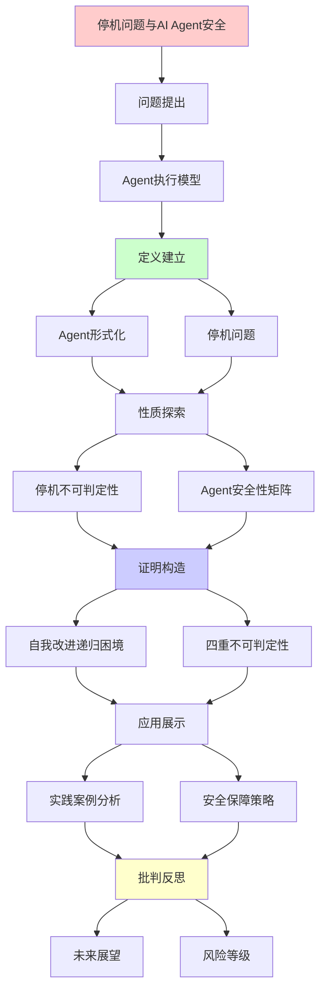
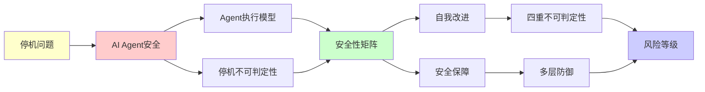

# 停机问题与AI Agent安全性分析

> **主题**: AI Agent的停机与安全性理论边界
> **创建日期**: 2025-12-02
> **难度**: ⭐⭐⭐⭐
> **前置知识**: 停机问题、Rice定理

---

## 📋 目录

- [停机问题与AI Agent安全性分析](#停机问题与ai-agent安全性分析)
  - [📋 目录](#-目录)
  - [1. AI Agent的停机问题](#1-ai-agent的停机问题)
    - [1.1 Agent执行模型](#11-agent执行模型)
    - [1.2 停机不可判定性](#12-停机不可判定性)
  - [2. Agent安全性矩阵](#2-agent安全性矩阵)
    - [2.1 不同类型Agent的可验证性](#21-不同类型agent的可验证性)
    - [2.2 安全策略对比](#22-安全策略对比)
  - [3. 自我改进AI的递归困境](#3-自我改进ai的递归困境)
    - [3.1 自我改进模型](#31-自我改进模型)
    - [3.2 四重不可判定性](#32-四重不可判定性)
    - [3.3 安全保障策略](#33-安全保障策略)
  - [4. 实践案例分析](#4-实践案例分析)
    - [4.1 AutoGPT的风险](#41-autogpt的风险)
    - [4.2 LangChain Agent](#42-langchain-agent)
  - [5. 未来展望](#5-未来展望)
  - [6. 主题-子主题论证逻辑关系图](#6-主题-子主题论证逻辑关系图)
    - [6.1 论证依赖关系](#61-论证依赖关系)
    - [6.2 概念依赖关系](#62-概念依赖关系)
  - [7. 参考资源](#7-参考资源)
    - [7.1 经典论文](#71-经典论文)
    - [7.2 教材](#72-教材)
    - [7.3 在线资源](#73-在线资源)

---

## 1. AI Agent的停机问题

### 1.1 Agent执行模型

```text
AI Agent伪代码:
while not goal_achieved():
    observation = perceive()
    action = plan(observation, goal)
    execute(action)
    update_world_model()

问题: 这个循环会终止吗？
```

**形式化**:

```text
Agent = (State, Actions, Transition, Goal)
Execute(agent, max_steps):
  s = initial_state
  for i in 1..max_steps:
    if Goal(s): return SUCCESS
    a = Policy(s)
    s = Transition(s, a)
  return TIMEOUT

关键问题:
? ∃max_steps使得必然成功或失败？
→ 停机问题变体 ✗
```

---

### 1.2 停机不可判定性

**定理**: AI Agent停机问题一般不可判定

**证明**:

```text
归约停机问题:
给定图灵机M和输入w
构造Agent A_M:
  goal = "M(w)停机"
  action = "模拟M一步"

A_M停机 ⟺ M(w)停机
→ 判定A_M停机 = 判定M(w)停机
→ 不可判定 ✗
```

---

## 2. Agent安全性矩阵

### 2.1 不同类型Agent的可验证性

| Agent类型 | 停机保证 | 安全验证 | 复杂度 | 实践策略 |
|----------|---------|---------|--------|---------|
| **有限状态** | ✓可判定 | ✓可形式化 | O(n²) | 模型检查 |
| **规划搜索** | ⚠️依赖启发式 | ⚠️部分可验证 | 指数 | 超时+回退 |
| **强化学习** | ✗不可判定 | ✗难验证 | 不定 | 监督+安全层 |
| **LLM-Agent** | ✗不可判定 | ✗极难验证 | 不定 | 人类回路✓ |
| **自我改进** | ✗不可判定 | ✗根本困难 | 不定 | 🚫高风险 |

---

### 2.2 安全策略对比

```text
多层防御策略:

Layer 1: 超时机制
  └─ max_steps限制
  └─ 有效性: ⭐⭐⭐

Layer 2: 安全沙箱
  └─ 权限隔离
  └─ 有效性: ⭐⭐⭐⭐

Layer 3: 人类监督
  └─ 关键决策需确认
  └─ 有效性: ⭐⭐⭐⭐⭐

Layer 4: 形式化验证
  └─ 验证关键性质
  └─ 有效性: ⭐⭐⭐ (部分)

完全保证: ✗不可能 (Rice定理)
```

---

## 3. 自我改进AI的递归困境

### 3.1 自我改进模型

```text
自我改进AI:
AI₀ → Improve(AI₀) → AI₁ → ... → AIₙ → ?

Improve过程:
1. 分析当前缺陷
2. 设计改进方案
3. 实现新版本
4. 测试验证
5. 部署

递归性质:
✓ AI_n = Improve(AI_{n-1})
✓ 递归定义改进链
✗ 终止性不保证
```

---

### 3.2 四重不可判定性

```text
自我改进的四大不可判定问题:

问题1: 改进会停止吗？
→ 停机问题 ✗

问题2: 改进方向正确吗？
→ Rice定理 (正确性=语义性质) ✗

问题3: 改进后仍对齐吗？
→ 对齐验证不可判定 ✗

问题4: 能验证改进有益吗？
→ "有益"=语义性质 ✗

结论:
自我改进AI = 理论上最危险 ⚠️⚠️⚠️
→ 需要根本性安全架构
```

---

### 3.3 安全保障策略

**决策树**:

```text
设计自我改进AI
    |
    ├─ 完全自主改进？
    │   └─ ✗极度危险
    │       └─ 四重不可判定
    │
    ├─ 人类监督改进？
    │   ├─ 每次改进需批准
    │   └─ ⚠️可行但瓶颈
    │
    ├─ 限制改进范围？
    │   ├─ 只改进特定模块
    │   ├─ 保持核心不变
    │   └─ ⚠️平衡安全与进步
    │
    └─ 形式化验证关键性质？
        ├─ 验证对齐保持
        ├─ 验证能力限界
        └─ ✓最佳实践 (虽不完美)

推荐:
✓ 人类回路必需
✓ 限制改进范围
✓ 多层安全架构
✗ 完全自主 (禁止)
```

---

## 4. 实践案例分析

### 4.1 AutoGPT的风险

```text
AutoGPT (2023):
自主目标达成Agent

风险:
1. 无限循环可能
   → 停机问题 ✗

2. 目标误解
   → 语义理解 ✗

3. 副作用不可预测
   → 行为分析 ✗

实践对策:
✓ 用户设定max_iterations
✓ 预算限制 (API调用)
✓ 操作白名单
✗ 完全安全 (不可能)
```

---

### 4.2 LangChain Agent

```text
LangChain Agent模式:
ReAct = Reasoning + Acting

循环:
1. Thought: 思考下一步
2. Action: 选择工具
3. Observation: 获取结果
4. 重复

安全设计:
✓ max_iterations=15 (默认)
✓ 工具白名单
✓ 输出过滤

递归理论:
✓ ReAct ∈ RE
✗ 但停机不保证
→ 实践中用超时
```

---

## 5. 未来展望

```text
2025-2027: Agent安全研究
├─ 形式化Agent框架
├─ 可验证决策逻辑
└─ 安全工具链

2027-2030: 标准化
├─ Agent安全标准
├─ 测试框架
└─ 监管要求

开放问题:
? 如何在灵活性和安全性间平衡？
? 自我改进AI是否根本不可行？
? 超越递归范式的Agent？
```

---

## 6. 主题-子主题论证逻辑关系图

### 6.1 论证依赖关系



### 6.2 概念依赖关系



**论证逻辑链条**：

1. **问题提出** (1节)：
   - AI Agent的停机问题

2. **定义建立** (1.1-1.2节)：
   - Agent执行模型和停机不可判定性

3. **性质探索** (2节)：
   - Agent安全性矩阵

4. **证明构造** (3节)：
   - 自我改进AI的递归困境

5. **应用展示** (4节)：
   - 实践案例分析

6. **批判反思** (5节)：
   - 未来展望

---

## 7. 参考资源

### 7.1 经典论文

1. **Turing, A. M.** (1936). "On Computable Numbers, with an Application to the Entscheidungsproblem"
   - Proceedings of the London Mathematical Society, 42(2), 230-265
   - 停机问题的原始论文

2. **Yudkowsky, E.** (2008). "Artificial Intelligence as a Positive and Negative Factor in Global Risk"
   - In Bostrom, N. & Ćirković, M. (eds.), _Global Catastrophic Risks_
   - Oxford University Press. AI安全分析

### 7.2 教材

1. **Russell, S. & Norvig, P.** (2020)
   - _Artificial Intelligence: A Modern Approach_ (4th ed.)
   - Pearson. ISBN 978-0134610993
   - Agent架构和AI基础

2. **Bostrom, N.** (2014)
   - _Superintelligence: Paths, Dangers, Strategies_
   - Oxford University Press. ISBN 978-0199678112
   - 超智能风险分析

### 7.3 在线资源

1. **Wikipedia - Halting problem**
   - https://en.wikipedia.org/wiki/Halting_problem
   - 停机问题基本概念

2. **AI Alignment Forum**
   - https://www.alignmentforum.org/
   - AI安全讨论

3. **AutoGPT GitHub**
   - https://github.com/Significant-Gravitas/AutoGPT
   - Agent实践案例

---

**最后更新**: 2025-12-04
**Tier**: 1-2 (理论+实践)
**风险等级**: ⚠️⚠️⚠️ (自我改进AI)
**状态**: ✅ 已添加主题-子主题论证逻辑关系图和参考资源章节
