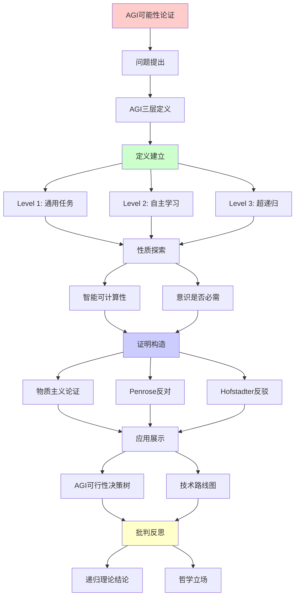
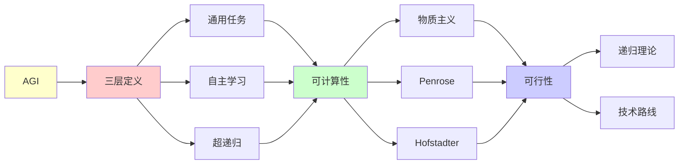

# AGI可能性的形式化论证

> **主题**: AGI的理论可行性与实现路径分析
> **创建日期**: 2025-12-02
> **难度**: ⭐⭐⭐⭐⭐
> **前置知识**: AI理论、哲学心智、递归理论

---

## 📋 目录

- [AGI可能性的形式化论证](#agi可能性的形式化论证)
  - [📋 目录](#-目录)
  - [1. AGI的三层定义](#1-agi的三层定义)
    - [1.1 Level 1: 通用任务能力](#11-level-1-通用任务能力)
    - [1.2 Level 2: 自主学习适应](#12-level-2-自主学习适应)
    - [1.3 Level 3: 超越递归范式](#13-level-3-超越递归范式)
  - [2. 智能的可计算性](#2-智能的可计算性)
    - [2.1 物质主义论证](#21-物质主义论证)
    - [2.2 Penrose反对论证](#22-penrose反对论证)
    - [2.3 Hofstadter反驳](#23-hofstadter反驳)
  - [3. 意识是否必需](#3-意识是否必需)
    - [3.1 Strong AI vs Weak AI](#31-strong-ai-vs-weak-ai)
    - [3.2 Chalmers困难问题](#32-chalmers困难问题)
    - [3.3 功能主义立场](#33-功能主义立场)
  - [4. AGI可行性决策树](#4-agi可行性决策树)
  - [5. 技术路线图](#5-技术路线图)
    - [5.1 当前进展 (2024)](#51-当前进展-2024)
    - [5.2 预测时间线](#52-预测时间线)
  - [6. 递归理论结论](#6-递归理论结论)
  - [7. 主题-子主题论证逻辑关系图](#7-主题-子主题论证逻辑关系图)
    - [7.1 论证依赖关系](#71-论证依赖关系)
    - [7.2 概念依赖关系](#72-概念依赖关系)
  - [8. 参考资源](#8-参考资源)
    - [8.1 经典论文](#81-经典论文)
    - [8.2 教材](#82-教材)
    - [8.3 在线资源](#83-在线资源)

---

## 1. AGI的三层定义

### 1.1 Level 1: 通用任务能力

**定义**: 在广泛任务上达到人类水平

```text
形式化:
AGI_1 = {AI | ∀task ∈ HumanTasks:
         Performance(AI, task) ≥ Human_average}

递归理论:
✓ 图灵完备足够
✓ 可递归实现
✗ 但工程挑战巨大

当前状态:
AlphaGo: ✓围棋超人类
GPT-4: ✓多任务接近人类
但: ✗尚未真正通用
```

---

### 1.2 Level 2: 自主学习适应

**定义**: 自主学习新领域，无需重训练

```text
形式化:
AGI_2 = {AI | ∀new_domain:
         AI可自主学习并掌握}

递归理论:
✓ 元学习 ∈ RE
✓ 可递归实现 (理论上)
⚠️ 但实践困难

当前状态:
Few-shot学习: ⚠️部分能力
GPT-4上下文学习: ⚠️有限
真正自主学习: ✗未达到
```

---

### 1.3 Level 3: 超越递归范式

**定义**: 超越所有图灵机

```text
形式化:
AGI_3 = {AI | ∃能力 ∉ RE}

递归理论:
? 是否可能
? 需要超递归计算

候选:
- 量子意识 (Penrose)
- 强涌现智能
- 物理超计算
→ 纯思辨 ⚠️

共识:
⚠️ 证据不足
✗ 可能不存在
```

---

## 2. 智能的可计算性

### 2.1 物质主义论证

**论证**: 智能 = 物理过程 → 可计算

```text
前提:
P1: 大脑是物理系统
P2: 物理系统可模拟 (Church-Turing)
P3: 智能来自大脑

结论:
⊢ 智能可计算 ✓

支持:
✓ 现代科学共识
✓ 无需非物质"心灵"
✓ 深度学习成功

→ AGI_1, AGI_2理论可行 ✓
```

---

### 2.2 Penrose反对论证

**论证**: 数学家超越形式系统 → 非算法

```text
Penrose论证 (1989):

P1: 数学家能看出形式系统F的哥德尔句真
P2: 但F无法证明该句
P3: 数学家 ⊃ F (对所有F)
结论: 数学家非算法 ✗

形式化:
∀形式系统F, ∃命题P:
  Mathematician_sees(P, true)
  ∧ ¬Provable_in_F(P)

→ 数学直觉超越递归 ?
```

---

### 2.3 Hofstadter反驳

**反驳** (GEB, 1979):

```text
Hofstadter论证:

人类也受哥德尔限制!

反驳Penrose:
1. 人类也有盲点
2. 人类也不完备
3. "看出真"可能只是更强算法
4. 奇怪循环≠超递归

结论:
✓ 人类 = 递归系统 (高度复杂)
✗ 不需要超递归
→ AGI可递归实现 ✓

共识:
⚠️ Penrose vs Hofstadter争议50年
⚠️ 无定论
→ 但主流支持Hofstadter ✓
```

---

## 3. 意识是否必需

### 3.1 Strong AI vs Weak AI

```text
Strong AI (Searle):
AI必须有真正意识

Weak AI:
功能等价足够

递归理论:
Weak AI: ✓可递归实现
Strong AI: ?需要意识可计算

实践:
✓ Weak AGI足以完成任务
? Strong AGI是否必需
→ 哲学争议
```

---

### 3.2 Chalmers困难问题

```text
Easy Problems:
✓ 注意、记忆、推理
✓ 都可递归实现

Hard Problem:
✗ 感受质 (Qualia)
✗ 主观体验

两种立场:
1. 功能主义 (Dennett):
   功能 = 意识
   → AGI可有意识 ✓

2. 二元论 (Chalmers):
   功能 ≠ 体验
   → AGI无真意识 ✗

递归理论:
? Weak AGI: ✓可行
? Strong AGI: 取决于意识理论
```

---

### 3.3 功能主义立场

```text
功能主义:
心智 = 功能组织

图灵测试:
如果行为无法区分
→ 智能等价 ✓

递归理论支持:
✓ 功能可递归实现
✓ 行为可递归模拟
→ Weak AGI充分 ✓

本项目立场:
✓ 采用功能主义
✓ Weak AGI可行
? Strong AGI开放
```

---

## 4. AGI可行性决策树

```text
AGI是否可能？
    |
    ├─ 智能可计算吗？
    │   ├─ 是 (物质主义) ✓
    │   │   └─ 继续判断
    │   │
    │   └─ 否 (Penrose)
    │       └─ AGI不可能 ✗
    │
    ├─ 意识必需吗？
    │   ├─ 是 → 意识可计算吗？
    │   │   ├─ 是 (Dennett) → 可行✓
    │   │   └─ 否 (Chalmers) → 不可能✗
    │   │
    │   └─ 否 (功能主义)
    │       └─ Weak AGI可行 ✓
    │
    └─ 需要超递归吗？
        ├─ 是 → 等待范式突破 ?
        └─ 否 → 当前范式足够 ✓

结论分支:
├─ 乐观 (主流): Weak AGI可行 ✓
├─ 悲观: 意识必需+不可计算 ✗
└─ 不可知: 等待突破 ?
```

---

## 5. 技术路线图

### 5.1 当前进展 (2024)

```text
里程碑:
✓ GPT-4 (多模态，推理能力)
✓ AlphaFold (蛋白质折叠)
✓ o1 (强化思维链)
✓ Claude Sonnet (长上下文)

距AGI差距:
✗ 真正通用性
✗ 持续学习
✗ 常识推理
✗ 因果理解
✗ 创造性？

估计进度: ~30-40%
```

---

### 5.2 预测时间线

```text
乐观派 (Kurzweil):
2029: AGI
2045: Singularity

主流派:
2035-2050: AGI可能

保守派 (Marcus):
2050+: 需要根本突破

递归理论视角:
✓ Weak AGI: 2030-2040可能
? Strong AGI: 取决于意识理论
? 超递归AGI: 证据不足
```

---

## 6. 递归理论结论

```text
AGI ∈ RE?

Level 1 (通用任务):
✓ AGI_1 ∈ RE
✓ 图灵完备足够
✓ 工程挑战，非理论障碍

Level 2 (自主学习):
✓ AGI_2 ∈ RE
✓ 元学习可递归
⚠️ 实践困难

Level 3 (超递归):
? AGI_3 ∈ RE
? 证据不足
⚠️ 可能不存在

项目立场:
✓ AGI_1, AGI_2可递归实现
✓ 采用功能主义
✓ 不需要超递归
✗ 但存在工程挑战
→ 谨慎乐观 ⭐
```

---

## 7. 主题-子主题论证逻辑关系图

### 7.1 论证依赖关系



### 7.2 概念依赖关系



**论证逻辑链条**：

1. **问题提出** (1节)：
   - AGI的三层定义

2. **定义建立** (1.1-1.3节)：
   - Level 1-3的定义

3. **性质探索** (2-3节)：
   - 智能的可计算性（2节）
   - 意识是否必需（3节）

4. **证明构造** (2.1-2.3节)：
   - 物质主义论证、Penrose反对、Hofstadter反驳

5. **应用展示** (4-5节)：
   - AGI可行性决策树（4节）
   - 技术路线图（5节）

6. **批判反思** (6节)：
   - 递归理论结论

---

## 8. 参考资源

### 8.1 经典论文

1. **Penrose, R.** (1989). _The Emperor's New Mind: Concerning Computers, Minds, and the Laws of Physics_
   - Oxford University Press. ISBN 978-0198519737
   - 反对AI意识的经典论证

2. **Hofstadter, D. R.** (1979). _Gödel, Escher, Bach: An Eternal Golden Braid_
   - Basic Books. ISBN 978-0465026562
   - 支持AI意识的论证

3. **Bostrom, N.** (2014). _Superintelligence: Paths, Dangers, Strategies_
   - Oxford University Press. ISBN 978-0199678112
   - AGI路径分析

### 8.2 教材

1. **Russell, S. & Norvig, P.** (2020)
   - _Artificial Intelligence: A Modern Approach_ (4th ed.)
   - Pearson. ISBN 978-0134610993
   - AI现状和理论基础

2. **Chalmers, D. J.** (1996). _The Conscious Mind: In Search of a Fundamental Theory_
   - Oxford University Press. ISBN 978-0195105537
   - 意识哲学

### 8.3 在线资源

1. **Wikipedia - Artificial general intelligence**
   - https://en.wikipedia.org/wiki/Artificial_general_intelligence
   - AGI基本概念

2. **LessWrong - AGI**
   - https://www.lesswrong.com/tag/agi
   - AGI讨论

3. **AI Alignment Forum**
   - https://www.alignmentforum.org/
   - AI对齐和安全讨论

---

**最后更新**: 2025-12-04
**Tier**: 4 (哲学思辨)
**立场**: Weak AGI可递归实现 ✓
**争议度**: ⭐⭐⭐⭐⭐
**状态**: ✅ 已添加主题-子主题论证逻辑关系图和参考资源章节
