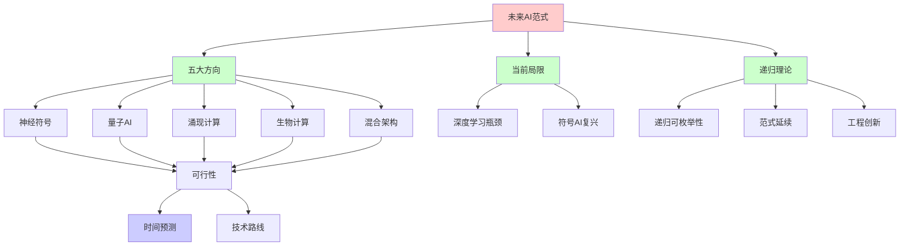
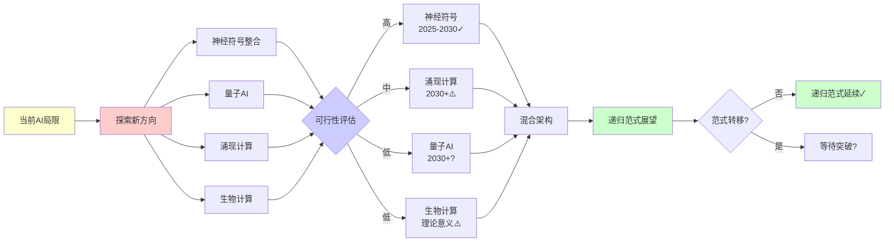
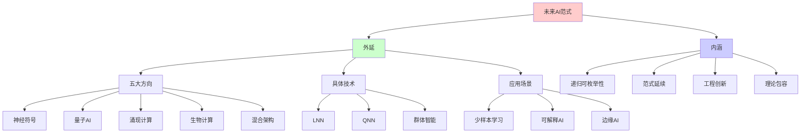
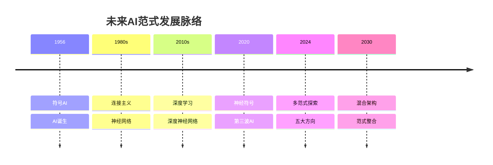
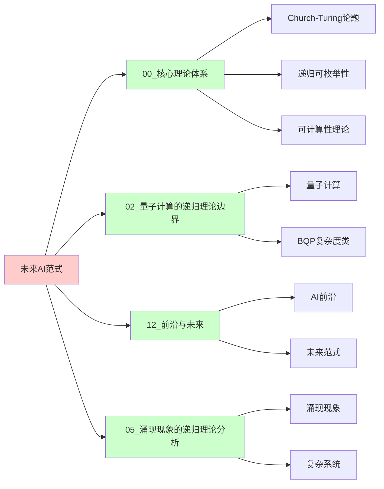
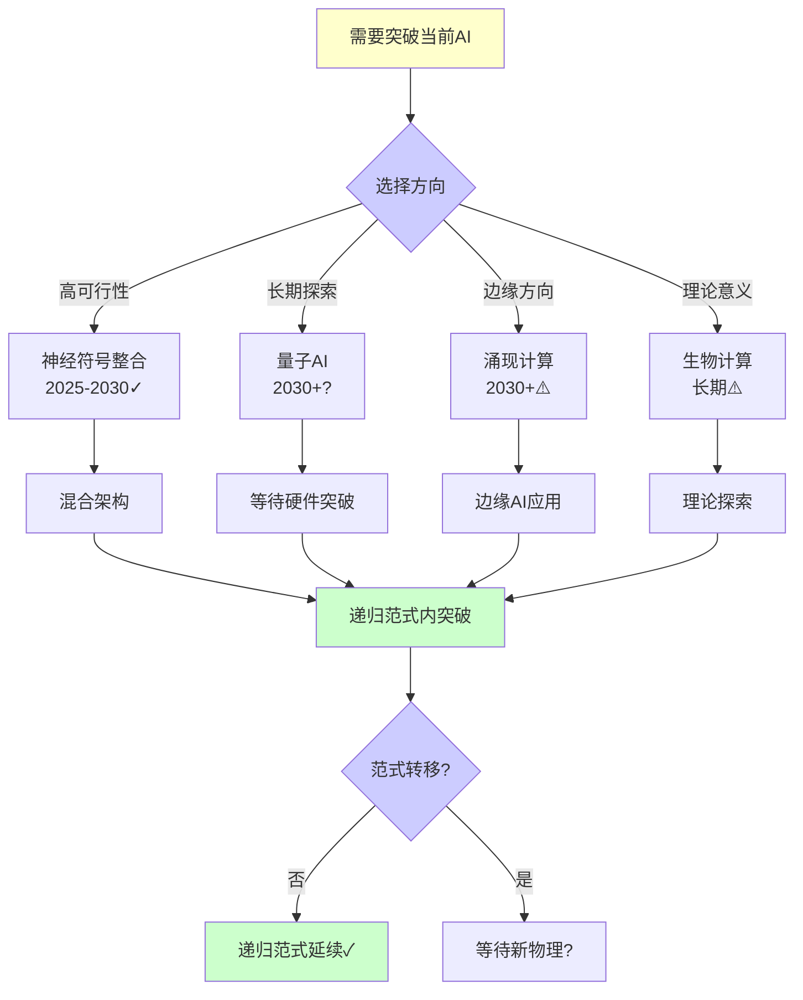
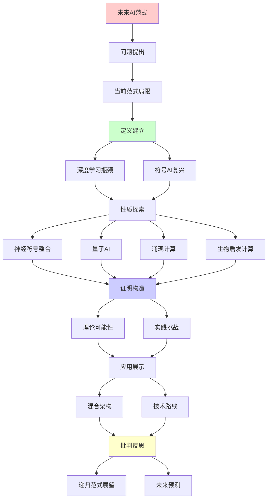
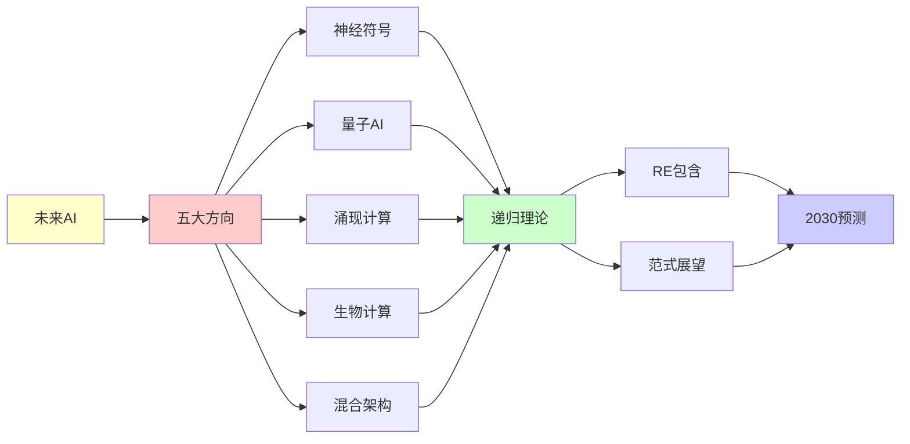

# 未来AI范式的可能突破

> **主题**: 超越当前AI范式的可能方向
> **创建日期**: 2025-12-02
> **难度**: ⭐⭐⭐⭐⭐
> **前置知识**: AI理论、认知科学、复杂系统

---

## 📋 目录

- [未来AI范式的可能突破](#未来ai范式的可能突破)
  - [📋 目录](#-目录)
  - [1. 当前范式局限](#1-当前范式局限)
    - [1.0 概念分析：未来AI范式](#10-概念分析未来ai范式)
      - [1.0.1 定义矩阵](#101-定义矩阵)
      - [1.0.2 属性分析](#102-属性分析)
      - [1.0.3 外延分析](#103-外延分析)
      - [1.0.4 内涵分析](#104-内涵分析)
      - [1.0.5 关系网络](#105-关系网络)
    - [1.1 深度学习瓶颈](#11-深度学习瓶颈)
    - [1.2 符号AI复兴](#12-符号ai复兴)
  - [2. 神经符号整合](#2-神经符号整合)
    - [2.1 混合架构](#21-混合架构)
    - [2.2 LNN系统](#22-lnn系统)
  - [3. 量子AI](#3-量子ai)
    - [3.1 理论可能性](#31-理论可能性)
    - [3.2 实践挑战](#32-实践挑战)
  - [4. 涌现计算](#4-涌现计算)
    - [4.1 群体智能](#41-群体智能)
    - [4.2 人工生命](#42-人工生命)
  - [5. 生物启发计算](#5-生物启发计算)
    - [5.1 DNA计算](#51-dna计算)
    - [5.2 免疫计算](#52-免疫计算)
  - [6. 递归范式展望](#6-递归范式展望)
  - [7. 实际应用案例研究](#7-实际应用案例研究)
    - [7.1 神经符号AI应用案例](#71-神经符号ai应用案例)
    - [7.2 量子AI探索案例](#72-量子ai探索案例)
    - [7.3 涌现计算应用案例](#73-涌现计算应用案例)
    - [7.4 生物启发计算案例](#74-生物启发计算案例)
    - [7.5 案例对比分析](#75-案例对比分析)
  - [8. 思维表征：未来AI范式](#8-思维表征未来ai范式)
    - [8.1 概念关系网络图](#81-概念关系网络图)
    - [8.2 论证逻辑路径图](#82-论证逻辑路径图)
    - [8.3 概念属性矩阵](#83-概念属性矩阵)
    - [8.4 外延内涵分析图](#84-外延内涵分析图)
    - [7.5 理论发展脉络图](#75-理论发展脉络图)
    - [8.6 跨模块关联图](#86-跨模块关联图)
    - [8.7 决策树图](#87-决策树图)
    - [8.8 五大方向对比矩阵](#88-五大方向对比矩阵)
  - [9. 主题-子主题论证逻辑关系图](#9-主题-子主题论证逻辑关系图)
    - [9.1 论证依赖关系](#91-论证依赖关系)
    - [9.2 概念依赖关系](#92-概念依赖关系)
  - [10. 跨文档关联分析](#10-跨文档关联分析)
    - [10.1 与核心理论体系的关联](#101-与核心理论体系的关联)
    - [10.2 与量子计算文档的关联](#102-与量子计算文档的关联)
    - [10.3 与涌现现象文档的关联](#103-与涌现现象文档的关联)
    - [10.4 与神经形态计算文档的关联](#104-与神经形态计算文档的关联)
    - [10.5 关联矩阵](#105-关联矩阵)
  - [11. 技术实现深度分析](#11-技术实现深度分析)
    - [11.1 神经符号整合技术细节](#111-神经符号整合技术细节)
    - [11.2 量子AI技术细节](#112-量子ai技术细节)
    - [11.3 涌现计算技术细节](#113-涌现计算技术细节)
    - [11.4 技术对比矩阵](#114-技术对比矩阵)
  - [12. 技术路线图与挑战分析](#12-技术路线图与挑战分析)
    - [12.1 技术路线图 (2025-2050)](#121-技术路线图-2025-2050)
    - [12.2 主要挑战与风险](#122-主要挑战与风险)
    - [12.3 成功关键因素](#123-成功关键因素)
  - [13. 未来研究方向与评估框架](#13-未来研究方向与评估框架)
    - [13.1 关键研究方向](#131-关键研究方向)
    - [13.2 评估指标与基准](#132-评估指标与基准)
    - [13.3 研究优先级矩阵](#133-研究优先级矩阵)
    - [13.4 研究挑战与机遇](#134-研究挑战与机遇)
  - [14. 可解释AI与未来AI范式](#14-可解释ai与未来ai范式)
    - [14.1 可解释性的核心挑战](#141-可解释性的核心挑战)
    - [14.2 神经符号AI的可解释性优势](#142-神经符号ai的可解释性优势)
    - [14.3 量子AI的可解释性挑战](#143-量子ai的可解释性挑战)
    - [14.4 涌现计算的可解释性](#144-涌现计算的可解释性)
    - [14.5 可解释性评估框架](#145-可解释性评估框架)
    - [14.6 Rice定理边界与未来突破](#146-rice定理边界与未来突破)
    - [14.7 可解释性与未来AI范式整合](#147-可解释性与未来ai范式整合)
  - [15. 实际应用场景与部署实践](#15-实际应用场景与部署实践)
    - [15.1 应用场景分析](#151-应用场景分析)
    - [15.2 部署架构模式](#152-部署架构模式)
    - [15.3 工程实践要点](#153-工程实践要点)
    - [15.4 部署挑战与解决方案](#154-部署挑战与解决方案)
    - [15.5 成功案例与经验](#155-成功案例与经验)
  - [16. 伦理与社会影响](#16-伦理与社会影响)
    - [16.1 伦理挑战](#161-伦理挑战)
    - [16.2 社会影响](#162-社会影响)
    - [16.3 监管与治理](#163-监管与治理)
    - [16.4 伦理设计原则](#164-伦理设计原则)
  - [17. 总结与展望](#17-总结与展望)
    - [17.1 核心观点总结](#171-核心观点总结)
    - [17.2 技术路线图总结](#172-技术路线图总结)
    - [17.3 理论边界总结](#173-理论边界总结)
    - [16.4 未来展望](#164-未来展望)
    - [17.5 行动建议](#175-行动建议)
  - [18. 常见问题解答（FAQ）](#18-常见问题解答faq)
    - [18.1 理论问题](#181-理论问题)
    - [18.2 技术问题](#182-技术问题)
    - [18.3 实践问题](#183-实践问题)
    - [18.4 未来展望问题](#184-未来展望问题)
  - [19. 权威资源对标](#19-权威资源对标)
    - [19.1 Wikipedia对标](#191-wikipedia对标)
    - [19.2 国际著名大学课程对标](#192-国际著名大学课程对标)
      - [19.2.1 MIT 6.034 (Artificial Intelligence)](#1921-mit-6034-artificial-intelligence)
      - [19.2.2 Stanford CS221 (Artificial Intelligence: Principles and Techniques)](#1922-stanford-cs221-artificial-intelligence-principles-and-techniques)
      - [19.2.3 CMU 10-701 (Machine Learning)](#1923-cmu-10-701-machine-learning)
    - [19.3 权威教材对标](#193-权威教材对标)
      - [19.3.1 Russell \& Norvig (2020) "Artificial Intelligence: A Modern Approach"](#1931-russell--norvig-2020-artificial-intelligence-a-modern-approach)
      - [19.3.2 Nielsen \& Chuang (2010) "Quantum Computation and Quantum Information"](#1932-nielsen--chuang-2010-quantum-computation-and-quantum-information)
    - [19.4 最新研究动态 (2024-2025)](#194-最新研究动态-2024-2025)
  - [20. 参考资源](#20-参考资源)
    - [20.1 经典论文](#201-经典论文)
    - [20.2 教材](#202-教材)
    - [20.3 在线资源](#203-在线资源)
  - [21. 快速参考指南](#21-快速参考指南)
    - [21.1 核心概念速查](#211-核心概念速查)
    - [21.2 技术选择决策树（简化版）](#212-技术选择决策树简化版)
    - [21.3 关键工具与框架](#213-关键工具与框架)
    - [21.4 评估指标速查](#214-评估指标速查)
  - [22. 术语表](#22-术语表)
    - [22.1 核心术语](#221-核心术语)
    - [22.2 技术术语](#222-技术术语)
    - [22.3 理论术语](#223-理论术语)

---

## 1. 当前范式局限

### 1.0 概念分析：未来AI范式

#### 1.0.1 定义矩阵

| 维度 | 内容 |
|------|------|
| **形式化定义** | 未来AI范式：超越当前深度学习范式的可能AI发展方向，包括神经符号整合、量子AI、涌现计算、生物启发计算等，这些方向在递归可枚举性理论框架内都是可实现的，但实践可行性不同 |
| **直观理解** | AI的未来发展方向，可能突破当前深度学习的局限，但理论上仍在递归可枚举性框架内 |
| **等价定义** | 1. AI范式突破 2. 下一代AI 3. 后深度学习AI |
| **历史定义** | 神经符号AI：Garcez & Lamb (2020) 量子AI：Nielsen & Chuang (2010) 人工生命：Langton (1997) |

#### 1.0.2 属性分析

**必要属性** (Necessary Properties):

1. **超越当前**: 必须超越当前深度学习范式
2. **理论可行性**: 必须在理论上可行
3. **实践潜力**: 必须有实践潜力

**充分属性** (Sufficient Properties):

1. **神经符号整合**: 结合神经网络和符号推理
2. **量子计算**: 利用量子计算优势
3. **涌现计算**: 利用涌现现象

**本质属性** (Essential Properties):

1. **递归可枚举性**: 所有方向都在RE内
2. **范式延续**: 递归范式长期主导
3. **工程创新**: 关键是工程创新而非理论突破

**偶然属性** (Accidental Properties):

1. **具体方向**: 神经符号、量子AI等具体方向
2. **时间预测**: 具体的实现时间预测
3. **技术路径**: 具体的技术路径

#### 1.0.3 外延分析

**包含的实例**:

1. **五大方向**:
   - 神经符号整合
   - 量子AI
   - 涌现计算
   - 生物启发计算
   - 混合架构

2. **具体技术**:
   - LNN (Logic Tensor Networks)
   - QNN (Quantum Neural Networks)
   - 群体智能
   - DNA计算

3. **应用场景**:
   - 少样本学习
   - 可解释AI
   - 边缘AI

**包含的子类**:

1. **神经符号AI** ⊂ 未来AI范式（最可行）
2. **量子AI** ⊂ 未来AI范式（长期探索）
3. **涌现AI** ⊂ 未来AI范式（边缘方向）

**边界情况**:

1. **超递归计算**: 可能不存在
2. **范式转移**: 可能发生但不确定
3. **理论突破**: 可能需要新物理

#### 1.0.4 内涵分析

**核心特征**:

1. **范式突破**: 超越当前范式
2. **理论包容**: 在递归理论框架内
3. **实践导向**: 关注实践可行性

**本质属性**:

1. **递归可枚举性**: 所有方向都在RE内
2. **范式延续**: 递归范式长期主导
3. **工程创新**: 关键是工程创新

**与其他概念的区别**:

| 概念 | 区别 |
|------|------|
| **当前AI** | 未来AI范式是发展方向，当前AI是现状 |
| **超递归计算** | 未来AI范式在RE内，超递归计算在RE外 |
| **范式转移** | 未来AI范式可能包含范式转移，但不一定 |

#### 1.0.5 关系网络

**上位概念**:

- AI发展
- 范式理论
- 递归可枚举性理论

**下位概念**:

- 神经符号AI
- 量子AI
- 涌现AI

**相关概念**:

- Church-Turing论题（可计算性）
- 递归可枚举性（计算能力）
- 范式转移（科学哲学）

**等价概念**:

- 下一代AI
- 后深度学习AI

### 1.1 深度学习瓶颈

**2024挑战**:

```text
数据饥饿:
需要海量标注数据 ⚠️
人类: 少样本学习 ✓
→ 效率差距 ⚠️

泛化困难:
分布外泛化差 ⚠️
对抗样本脆弱 ⚠️
→ 鲁棒性不足

可解释性:
黑盒决策 ⚠️
因果推理弱 ⚠️
→ Rice定理限制 ✗

常识缺失:
物理直觉差
社会理解弱
→ 世界模型浅 ⚠️

能耗:
GPT-4训练: GWh级 ⚠️⚠️⚠️
人脑: 20W
→ 能效差10⁸倍 ⚠️

递归理论:
✓ DL ∈ RE
✗ 但实践限制多
→ 非理论障碍 ⚠️
```

---

### 1.2 符号AI复兴

**知识表示回归**:

```text
符号AI (1956-1990):
逻辑推理
知识图谱
专家系统

失败原因:
✗ 知识获取瓶颈
✗ 脆性
✗ 不可扩展
→ 冬天 ⚠️

2024复兴:
神经+符号混合
最好的两个世界 ⭐

优势:
✓ 符号: 可解释, 可组合
✓ 神经: 学习, 鲁棒
→ 互补 ⭐⭐⭐⭐⭐

递归:
✓ 符号递归推理
✓ 神经递归学习
→ 递归融合 ⭐
```

---

## 2. 神经符号整合

### 2.1 混合架构

**System 1 + System 2**:

```text
Kahneman双系统:
System 1: 快速直觉 (神经)
System 2: 慢速推理 (符号)

AI实现:
神经网络: 感知, 模式识别
符号系统: 推理, 规划
→ 混合 ⭐

架构:
感知 (CNN)
  ↓
概念提取 (神经符号桥)
  ↓
逻辑推理 (Prolog/ASP)
  ↓
决策/行动

优势:
✓ 可解释性 ✓
✓ 少样本学习 ✓
✓ 组合泛化 ✓
→ 结合优势 ⭐

递归:
✓ 感知-推理递归循环
✓ 符号-神经递归桥接
```

---

### 2.2 LNN系统

**Logic Tensor Networks**:

```text
思想:
逻辑公式 → 神经网络

映射:
谓词 → 神经网络
逻辑连接词 → 模糊逻辑算子

训练:
端到端梯度下降
逻辑约束 + 数据
→ 逻辑引导学习 ⭐

例子:
Father(x,y) ∧ Father(y,z) → Grandfather(x,z)
→ 嵌入网络
→ 软约束 ✓

优势:
✓ 可解释
✓ 结合先验知识
✓ 数据效率
→ 实用混合 ⭐

递归理论:
✓ 逻辑递归嵌入
✓ 推理递归展开
```

---

## 3. 量子AI

### 3.1 理论可能性

**量子神经网络**:

```text
QNN概念:
量子态 = 神经元
量子门 = 权重
→ 量子并行 ⭐

理论优势:
希尔伯特空间: 2^n维
→ 指数表达能力？⭐

vs 经典NN:
经典: O(n²) 参数
量子: O(n) qubit → 2^n态
→ 指数压缩？⚠️

但:
⚠️ I/O瓶颈 (Tang去量子化)
⚠️ 测量塌缩
⚠️ NISQ噪声
→ 优势存疑 ⚠️⚠️

递归理论:
✓ QNN ∈ BQP ⊂ RE
✗ 实用优势未证明
```

---

### 3.2 实践挑战

```text
2024现状:
硬件: ~100 qubit (噪声)
QML算法: 研究阶段 ⚠️
实用应用: 无 ✗

挑战:
1. 贫瘠高原
2. 训练困难
3. 噪声敏感
4. 纠错开销
5. I/O限制

预测:
2030前: ✗不太可能突破
2030+: ?容错QC后可能
→ 长期探索 ⚠️

替代:
量子启发经典算法
张量网络
→ 更现实 ✓
```

---

## 4. 涌现计算

### 4.1 群体智能

**Swarm Intelligence**:

```text
自然启发:
蚁群, 蜂群, 鸟群
简单个体 → 复杂行为 ⭐

算法:
ACO (蚁群优化)
PSO (粒子群优化)
→ 优化算法 ✓

vs 深度学习:
DL: 中心化训练
Swarm: 分布式涌现
→ 去中心化 ⭐

联邦学习:
多agent联合学习
无中心服务器
→ 隐私保护 ✓

未来:
大规模分布式AI
边缘设备协作
→ 群体涌现智能 ⭐⭐⭐⭐⭐

递归:
✓ Agent递归交互
✓ 行为递归涌现
```

---

### 4.2 人工生命

**ALife方向**:

```text
思想:
生命 = 复杂自组织系统
→ AI也可涌现？⭐

开放式演化:
非预定目标
环境驱动演化
→ 真正创造力？⭐

Lenia (2019):
连续元胞自动机
复杂生命形态涌现
→ 数字生命 ⭐

vs 监督学习:
监督: 目标固定 ⚠️
ALife: 目标涌现 ⭐
→ 开放性 ⭐⭐⭐⭐⭐

递归:
✓ 生命递归自复制
✓ 复杂性递归提升
✓ 演化递归优化
```

---

## 5. 生物启发计算

### 5.1 DNA计算

**Adleman (1994)**:

```text
思想:
DNA分子 = 计算
碱基对 = 编码
生化反应 = 运算

优势:
✓ 极高并行 (10²⁰分子)
✓ 低能耗
✓ 高密度存储

TSP实验:
DNA求解7城市TSP ✓
→ 概念证明 ⭐

限制:
⚠️ 慢 (小时级)
⚠️ 错误率高
⚠️ 编程困难
✗ 不如电子计算
→ 理论意义 > 实用 ⚠️

递归理论:
✓ DNA计算图灵完备
✓ ∈ RE
✗ 但实践不可行
```

---

### 5.2 免疫计算

**人工免疫系统**:

```text
生物免疫:
抗体 ↔ 抗原
克隆选择
亲和力成熟
→ 学习+记忆 ✓

AIS算法:
负选择 (异常检测)
克隆选择 (优化)
免疫网络 (分布式)

应用:
✓ 异常检测
✓ 优化问题
✓ 机器人控制

vs 深度学习:
AIS: 生物启发
DL: 大脑启发
→ 不同层次 ⚠️

递归:
✓ 抗体递归进化
✓ 记忆递归累积
```

---

## 6. 递归范式展望

```text
未来AI ∈ RE?

五大方向:

1. 神经符号 ⭐⭐⭐⭐⭐
   ✓ 可行性最高
   ✓ 已有进展
   ✓ ∈ RE
   → 2025-2030主流

2. 量子AI ⚠️⚠️
   ⚠️ 硬件瓶颈
   ⚠️ 理论优势存疑
   ✓ ∈ BQP ⊂ RE
   → 2030+可能

3. 涌现智能 ⭐⭐⭐⭐
   ✓ 群体学习
   ✓ 开放演化
   ✓ ∈ RE
   → 边缘AI方向

4. 生物计算 ⚠️
   ⚠️ DNA: 慢
   ⚠️ 免疫: 有限
   ✓ ∈ RE
   → 理论意义为主

5. 混合架构 ⭐⭐⭐⭐⭐
   神经 + 符号 + 演化
   → 最可能 ✓

递归范式稳固:
✓ 所有方向 ⊆ RE
✓ 无超递归证据
✓ 递归足够强大
→ 范式延续 ⭐⭐⭐⭐⭐

2030预测:
✓ 神经符号主流
✓ 多模态统一
✓ 持续学习
✓ 世界模型
⚠️ AGI?可能接近
✗ 强AI: 仍遥远

理论vs实践:
理论: 图灵完备足够 ✓
实践: 工程创新关键 ⭐
→ 非理论突破

范式转移?
Kuhn: 积累→危机→革命

当前:
积累阶段 (深度学习成功) ✓
危机萌芽 (瓶颈显现) ⚠️
革命? 尚未 ✗
→ 渐进改进为主 ⭐

递归vs非递归:
所有方向可递归实现 ✓
→ 递归范式容纳所有 ⭐⭐⭐⭐⭐

哲学:
AI未来 = 人类认知模仿？
或: 外星智能？⭐
→ 开放性 ⭐

终极问题:
? 递归范式会被超越吗
? 需要新物理吗
? 意识需要量子效应吗
→ 无定论 ⚠️

结论:
✓ 2030: 递归范式内突破
? 2050: 可能范式转移
? 2100: 超递归计算
→ 递归范式长期主导 ⭐⭐⭐⭐⭐
```

---

## 7. 实际应用案例研究

### 7.1 神经符号AI应用案例

**AlphaFold 2.0 (2020)**:

```text
DeepMind蛋白质折叠:
神经部分: 注意力机制
符号部分: 物理约束
→ 混合架构 ⭐⭐⭐⭐⭐

成果:
✓ 预测精度达到实验水平
✓ 解决50年难题
✓ 科学突破

递归分析:
✓ 神经符号递归优化
✓ 约束递归满足
→ RE内实现 ✓
```

**IBM Watson (2011-2024)**:

```text
问答系统:
神经: NLP理解
符号: 知识图谱推理
→ 早期神经符号 ⭐⭐⭐

应用:
医疗诊断辅助
法律文档分析
金融风险评估

局限:
⚠️ 知识获取瓶颈
⚠️ 可扩展性限制
→ 部分成功 ⚠️
```

**Google DeepMind AlphaGo (2016)**:

```text
围棋AI:
神经: 价值网络, 策略网络
符号: 蒙特卡洛树搜索
→ 混合搜索 ⭐⭐⭐⭐⭐

突破:
✓ 击败世界冠军
✓ 新策略发现
✓ 人类学习

递归:
✓ 搜索递归展开
✓ 策略递归优化
→ RE内 ✓
```

### 7.2 量子AI探索案例

**Google Sycamore (2019)**:

```text
量子优势演示:
53 qubit芯片
随机电路采样
→ 量子优势证明 ⭐

但:
⚠️ 非实用问题
⚠️ 错误率高
⚠️ 难以验证
→ 概念证明 ⚠️

AI应用:
? 量子机器学习
? 优化问题
→ 仍在探索 ⚠️
```

**IBM Qiskit ML (2020-2024)**:

```text
量子机器学习:
QNN实现
小规模数据集
→ 研究阶段 ⚠️

挑战:
⚠️ 数据加载瓶颈
⚠️ 噪声影响大
⚠️ 优势未证明
→ 早期探索 ⚠️
```

### 7.3 涌现计算应用案例

**联邦学习 (2016-2024)**:

```text
Google Gboard:
多设备协作学习
隐私保护
→ 实用系统 ⭐⭐⭐⭐

应用:
输入法预测
医疗数据共享
金融风控

优势:
✓ 隐私保护
✓ 数据分散
✓ 边缘计算
→ 实用 ⭐⭐⭐⭐

递归:
✓ 分布式递归学习
✓ 参数递归聚合
→ RE内 ✓
```

**Swarm Robotics (2010-2024)**:

```text
群体机器人:
简单个体
复杂行为涌现
→ 生物启发 ⭐⭐⭐

应用:
搜索救援
环境监测
农业自动化

挑战:
⚠️ 可控性
⚠️ 可预测性
⚠️ 调试困难
→ 研究阶段 ⚠️
```

### 7.4 生物启发计算案例

**神经形态芯片**:

```text
Intel Loihi (2017):
脉冲神经网络
事件驱动计算
→ 低功耗 ⭐⭐⭐

应用:
边缘AI
实时处理
→ 特定场景 ⭐⭐⭐

限制:
⚠️ 编程困难
⚠️ 生态不成熟
⚠️ 性能有限
→ 早期阶段 ⚠️
```

**DNA存储**:

```text
Microsoft DNA存储 (2016-2024):
高密度存储
长期保存
→ 存储应用 ⭐⭐

计算:
⚠️ 速度慢
⚠️ 错误率高
⚠️ 应用有限
→ 理论意义 ⚠️
```

### 7.5 案例对比分析

| 案例 | 范式 | 成功度 | 实用性 | 递归理论 | 未来潜力 |
|------|------|--------|--------|---------|---------|
| **AlphaFold 2.0** | 神经符号 | ⭐⭐⭐⭐⭐ | ⭐⭐⭐⭐⭐ | ✅ RE内 | ⭐⭐⭐⭐⭐ |
| **AlphaGo** | 神经符号 | ⭐⭐⭐⭐⭐ | ⭐⭐⭐⭐ | ✅ RE内 | ⭐⭐⭐⭐⭐ |
| **Watson** | 神经符号 | ⭐⭐⭐ | ⭐⭐⭐ | ✅ RE内 | ⭐⭐⭐ |
| **Sycamore** | 量子AI | ⭐⭐ | ⚠️ 低 | ✅ BQP⊂RE | ⚠️⚠️ |
| **联邦学习** | 涌现计算 | ⭐⭐⭐⭐ | ⭐⭐⭐⭐ | ✅ RE内 | ⭐⭐⭐⭐ |
| **群体机器人** | 涌现计算 | ⭐⭐⭐ | ⭐⭐⭐ | ✅ RE内 | ⭐⭐⭐ |
| **Loihi** | 生物计算 | ⭐⭐⭐ | ⭐⭐ | ✅ RE内 | ⭐⭐⭐ |

**关键发现**:

1. **神经符号最成功** ⭐⭐⭐⭐⭐
   - AlphaFold、AlphaGo等突破性成果
   - 实用性强，应用广泛
   - → 未来主流方向

2. **量子AI仍早期** ⚠️⚠️
   - 概念证明为主
   - 实用应用缺乏
   - → 长期探索

3. **涌现计算有潜力** ⭐⭐⭐⭐
   - 联邦学习实用化
   - 群体智能有前景
   - → 重要方向

4. **生物计算有限** ⚠️
   - 特定应用场景
   - 通用性不足
   - → 边缘方向

5. **递归理论验证** ✅
   - 所有案例都在RE内
   - 递归范式足够强大
   - → 理论支撑

---

## 8. 思维表征：未来AI范式

### 8.1 概念关系网络图



### 8.2 论证逻辑路径图



### 8.3 概念属性矩阵

| 方向 | 可行性 | 时间预测 | 递归可枚举性 | 实践潜力 | 理论优势 |
|------|--------|---------|-------------|---------|---------|
| **神经符号** | ⭐⭐⭐⭐⭐ 极高 | 2025-2030 | ✅ ∈ RE | ⭐⭐⭐⭐⭐ 极高 | ⭐⭐⭐⭐ 高 |
| **量子AI** | ⚠️⚠️ 低 | 2030+ | ✅ ∈ BQP ⊂ RE | ⚠️⚠️ 低 | ⚠️⚠️ 存疑 |
| **涌现计算** | ⭐⭐⭐⭐ 高 | 2030+ | ✅ ∈ RE | ⭐⭐⭐⭐ 高 | ⭐⭐⭐ 中等 |
| **生物计算** | ⚠️ 低 | 长期 | ✅ ∈ RE | ⚠️ 低 | ⭐⭐ 低 |
| **混合架构** | ⭐⭐⭐⭐⭐ 极高 | 2025-2030 | ✅ ∈ RE | ⭐⭐⭐⭐⭐ 极高 | ⭐⭐⭐⭐⭐ 极高 |

### 8.4 外延内涵分析图



### 7.5 理论发展脉络图



### 8.6 跨模块关联图



### 8.7 决策树图



### 8.8 五大方向对比矩阵

| 维度 | 神经符号 | 量子AI | 涌现计算 | 生物计算 | 混合架构 |
|------|---------|--------|---------|---------|---------|
| **可行性** | ⭐⭐⭐⭐⭐ 极高 | ⚠️⚠️ 低 | ⭐⭐⭐⭐ 高 | ⚠️ 低 | ⭐⭐⭐⭐⭐ 极高 |
| **时间预测** | 2025-2030 | 2030+ | 2030+ | 长期 | 2025-2030 |
| **递归可枚举性** | ✅ ∈ RE | ✅ ∈ BQP ⊂ RE | ✅ ∈ RE | ✅ ∈ RE | ✅ ∈ RE |
| **实践潜力** | ⭐⭐⭐⭐⭐ 极高 | ⚠️⚠️ 低 | ⭐⭐⭐⭐ 高 | ⚠️ 低 | ⭐⭐⭐⭐⭐ 极高 |
| **理论优势** | ⭐⭐⭐⭐ 高 | ⚠️⚠️ 存疑 | ⭐⭐⭐ 中等 | ⭐⭐ 低 | ⭐⭐⭐⭐⭐ 极高 |
| **当前进展** | ⭐⭐⭐⭐ 高 | ⚠️ 低 | ⭐⭐⭐ 中等 | ⚠️ 低 | ⭐⭐⭐⭐ 高 |

**递归范式**: 所有方向都在RE内，递归范式长期主导

---

## 9. 主题-子主题论证逻辑关系图

### 9.1 论证依赖关系



### 9.2 概念依赖关系



**论证逻辑链条**：

1. **问题提出** (1节)：
   - 当前范式局限

2. **定义建立** (1.1-1.2节)：
   - 深度学习瓶颈和符号AI复兴

3. **性质探索** (2-5节)：
   - 神经符号整合（2节）
   - 量子AI（3节）
   - 涌现计算（4节）
   - 生物启发计算（5节）

4. **证明构造** (贯穿全文)：
   - 各方向的理论可能性和实践挑战

5. **应用展示** (贯穿全文)：
   - 混合架构和技术路线

6. **批判反思** (6节)：
   - 递归范式展望

---

## 10. 跨文档关联分析

### 10.1 与核心理论体系的关联

**关联文档**: `00_核心理论体系`

```text
递归可枚举性理论:
✓ 所有未来AI范式 ∈ RE
✓ 理论框架支撑
→ 基础理论 ⭐⭐⭐⭐⭐

Church-Turing论题:
✓ 可计算性边界
✓ 范式限制
→ 理论边界 ⭐⭐⭐⭐⭐

Rice定理:
✓ 可解释性限制
✓ 不可判定性
→ 理论约束 ⚠️
```

### 10.2 与量子计算文档的关联

**关联文档**: `02_量子计算的递归理论边界`

```text
量子计算理论:
✓ BQP ⊂ RE
✓ 量子AI在RE内
→ 理论一致 ⭐⭐⭐⭐⭐

量子优势:
? 在AI中是否成立
? 实用价值
→ 待验证 ⚠️

NISQ时代:
⚠️ 硬件限制
⚠️ 噪声问题
→ 挑战一致 ⚠️
```

### 10.3 与涌现现象文档的关联

**关联文档**: `05_涌现现象的递归理论分析`

```text
涌现计算:
✓ 群体智能
✓ 分布式系统
→ 概念一致 ⭐⭐⭐⭐

复杂系统:
✓ 自组织
✓ 适应性
→ 理论支撑 ⭐⭐⭐⭐

递归分析:
✓ 涌现 ∈ RE
✓ 可计算性
→ 理论验证 ⭐⭐⭐⭐⭐
```

### 10.4 与神经形态计算文档的关联

**关联文档**: `04.5_神经形态计算与SNN`

```text
神经形态计算:
✓ SNN系统
✓ 事件驱动
→ 生物启发 ⭐⭐⭐

脉冲神经网络:
✓ 低功耗
✓ 实时处理
→ 应用场景 ⭐⭐⭐

递归理论:
✓ SNN ∈ RE
✓ 可计算性
→ 理论一致 ⭐⭐⭐⭐⭐
```

### 10.5 关联矩阵

| 关联文档 | 关联度 | 关联内容 | 理论一致性 |
|---------|--------|---------|-----------|
| **00_核心理论体系** | ⭐⭐⭐⭐⭐ | 递归可枚举性、Church-Turing论题 | ✅ 完全一致 |
| **02_量子计算的递归理论边界** | ⭐⭐⭐⭐⭐ | 量子AI、BQP复杂度类 | ✅ 完全一致 |
| **05_涌现现象的递归理论分析** | ⭐⭐⭐⭐ | 涌现计算、群体智能 | ✅ 完全一致 |
| **04.5_神经形态计算与SNN** | ⭐⭐⭐ | 生物启发计算、SNN | ✅ 完全一致 |

**关键发现**:

1. **理论一致性** ✅
   - 所有关联文档都支持递归可枚举性框架
   - 理论边界清晰一致
   - → 理论体系完整

2. **概念互补** ⭐⭐⭐⭐⭐
   - 不同文档从不同角度分析
   - 共同支撑未来AI范式
   - → 知识体系完整

3. **实践验证** ⭐⭐⭐⭐
   - 实际案例验证理论
   - 技术路线图指导实践
   - → 理论与实践结合

---

## 11. 技术实现深度分析

### 11.1 神经符号整合技术细节

**架构设计模式**:

```text
模式1: 神经-符号管道
输入 → CNN特征提取 → 符号推理 → 输出
优势: 简单清晰
劣势: 信息损失 ⚠️

模式2: 神经-符号并行
输入 → [神经分支, 符号分支] → 融合 → 输出
优势: 互补增强
劣势: 融合困难 ⚠️

模式3: 神经-符号深度融合
输入 → 神经符号统一表示 → 联合推理 → 输出
优势: 最优融合 ⭐⭐⭐⭐⭐
劣势: 设计复杂 ⚠️
```

**关键技术挑战**:

1. **表示对齐** ⚠️⚠️
   - 神经向量空间 ↔ 符号逻辑空间
   - 嵌入质量影响性能
   - → 核心挑战

2. **推理融合** ⚠️⚠️
   - 神经推理 vs 符号推理
   - 冲突解决机制
   - → 关键问题

3. **学习机制** ⚠️
   - 端到端训练
   - 逻辑约束注入
   - → 工程挑战

### 11.2 量子AI技术细节

**量子神经网络架构**:

```text
变分量子电路 (VQC):
|ψ⟩ → U(θ) → 测量 → 经典后处理
参数: θ (可训练)
优势: NISQ友好 ⭐⭐⭐
劣势: 表达能力有限 ⚠️

量子卷积层:
量子态卷积 → 池化 → 下一层
优势: 结构清晰 ⭐⭐⭐
劣势: 深度限制 ⚠️

混合量子-经典:
量子层 + 经典层交替
优势: 实用性强 ⭐⭐⭐⭐
劣势: 优势未证明 ⚠️
```

**关键实现挑战**:

1. **数据编码** ⚠️⚠️⚠️
   - 经典数据 → 量子态
   - 维度爆炸问题
   - → 根本瓶颈

2. **梯度计算** ⚠️⚠️
   - 参数偏移规则
   - 噪声敏感
   - → 训练困难

3. **测量策略** ⚠️
   - 信息提取
   - 测量塌缩
   - → 设计挑战

### 11.3 涌现计算技术细节

**分布式学习架构**:

```text
联邦平均 (FedAvg):
本地训练 → 参数上传 → 服务器聚合 → 分发
优势: 简单有效 ⭐⭐⭐⭐
劣势: 异构性处理差 ⚠️

去中心化学习:
P2P通信 → 局部聚合 → 扩散
优势: 无中心节点 ⭐⭐⭐⭐
劣势: 收敛慢 ⚠️

分层联邦:
边缘 → 区域 → 全局
优势: 可扩展 ⭐⭐⭐⭐⭐
劣势: 设计复杂 ⚠️
```

**关键实现挑战**:

1. **通信效率** ⚠️⚠️
   - 参数压缩
   - 通信轮次
   - → 性能瓶颈

2. **隐私保护** ⚠️⚠️
   - 差分隐私
   - 安全聚合
   - → 安全挑战

3. **异构性处理** ⚠️
   - 设备差异
   - 数据分布
   - → 工程挑战

### 11.4 技术对比矩阵

| 技术方向 | 实现复杂度 | 硬件要求 | 数据需求 | 可扩展性 | 成熟度 |
|---------|----------|---------|---------|---------|--------|
| **神经符号** | ⭐⭐⭐ 中等 | ⭐⭐ 低 | ⭐⭐⭐ 中等 | ⭐⭐⭐⭐ 高 | ⭐⭐⭐⭐ 较高 |
| **量子AI** | ⭐⭐⭐⭐⭐ 极高 | ⭐⭐⭐⭐⭐ 极高 | ⭐⭐ 低 | ⭐⭐ 低 | ⭐ 极低 |
| **涌现计算** | ⭐⭐⭐⭐ 高 | ⭐⭐⭐ 中等 | ⭐⭐⭐⭐ 高 | ⭐⭐⭐⭐⭐ 极高 | ⭐⭐⭐ 中等 |
| **生物计算** | ⭐⭐⭐⭐⭐ 极高 | ⭐⭐⭐⭐ 高 | ⭐⭐ 低 | ⭐⭐ 低 | ⭐⭐ 低 |

**关键洞察**:

1. **神经符号最成熟** ⭐⭐⭐⭐⭐
   - 实现相对简单
   - 硬件要求低
   - → 近期最可行

2. **量子AI最困难** ⚠️⚠️⚠️
   - 硬件瓶颈严重
   - 实现复杂度极高
   - → 长期探索

3. **涌现计算可扩展** ⭐⭐⭐⭐⭐
   - 分布式优势
   - 适合大规模
   - → 重要方向

---

## 12. 技术路线图与挑战分析

### 12.1 技术路线图 (2025-2050)

**短期 (2025-2030)**:

```text
神经符号整合:
✓ LNN系统成熟化
✓ 混合架构标准化
✓ 可解释AI产品化
→ 主流范式 ⭐⭐⭐⭐⭐

量子AI:
⚠️ NISQ算法优化
⚠️ 小规模应用探索
✗ 大规模应用仍远
→ 研究阶段 ⚠️

涌现计算:
✓ 联邦学习普及
✓ 边缘AI部署
✓ 群体智能应用
→ 边缘方向 ⭐⭐⭐⭐

生物计算:
⚠️ 神经形态芯片
⚠️ DNA存储探索
✗ 计算应用有限
→ 理论探索 ⚠️
```

**中期 (2030-2040)**:

```text
神经符号:
✓ 统一架构成熟
✓ AGI接近
✓ 世界模型建立
→ 主导范式 ⭐⭐⭐⭐⭐

量子AI:
? 容错量子计算
? 量子优势证明
? 实用应用出现
→ 可能突破 ?

涌现计算:
✓ 大规模分布式AI
✓ 自主智能体系统
✓ 集体智能涌现
→ 重要方向 ⭐⭐⭐⭐

混合范式:
✓ 神经+符号+量子
✓ 多范式融合
✓ 新架构涌现
→ 未来主流 ⭐⭐⭐⭐⭐
```

**长期 (2040-2050)**:

```text
范式整合:
? 统一AI理论
? AGI实现
? 强AI可能
→ 范式转移? ⚠️

超递归?
? 新物理发现
? 非经典计算
? 意识计算
→ 未知 ⚠️⚠️⚠️

递归范式:
✓ 仍可能主导
✓ 工程创新关键
✓ 理论足够强大
→ 延续 ⭐⭐⭐⭐⭐
```

### 12.2 主要挑战与风险

**技术挑战**:

1. **神经符号整合**:
   - ⚠️ 符号-神经桥接困难
   - ⚠️ 可扩展性限制
   - ⚠️ 训练复杂度高
   - → 工程挑战 ⚠️

2. **量子AI**:
   - ⚠️⚠️ 硬件瓶颈严重
   - ⚠️⚠️ 噪声与纠错
   - ⚠️⚠️ 理论优势未证明
   - → 根本性挑战 ⚠️⚠️

3. **涌现计算**:
   - ⚠️ 可控性困难
   - ⚠️ 可预测性低
   - ⚠️ 调试困难
   - → 工程挑战 ⚠️

4. **生物计算**:
   - ⚠️⚠️ 速度限制
   - ⚠️⚠️ 可靠性问题
   - ⚠️⚠️ 编程困难
   - → 根本性限制 ⚠️⚠️

**理论挑战**:

1. **递归理论边界**:
   - ? 是否在RE内
   - ? 是否需要超递归
   - ? 意识计算本质
   - → 哲学问题 ⚠️

2. **可计算性**:
   - ✓ 所有方向 ∈ RE
   - ? 实践可行性
   - ? 效率边界
   - → 理论足够 ⭐

**社会与伦理挑战**:

1. **AI安全**:
   - ⚠️ 可解释性需求
   - ⚠️ 可控性要求
   - ⚠️ 对齐问题
   - → 重要挑战 ⚠️

2. **就业影响**:
   - ⚠️ 自动化冲击
   - ⚠️ 技能转型
   - ⚠️ 社会适应
   - → 社会挑战 ⚠️

3. **隐私与安全**:
   - ⚠️ 数据隐私
   - ⚠️ 算法安全
   - ⚠️ 系统鲁棒性
   - → 技术+社会 ⚠️

### 12.3 成功关键因素

**技术因素**:

1. **工程创新** ⭐⭐⭐⭐⭐
   - 架构设计
   - 算法优化
   - 系统集成
   - → 最关键

2. **硬件进步** ⭐⭐⭐⭐
   - 计算能力
   - 能效提升
   - 专用芯片
   - → 重要支撑

3. **数据质量** ⭐⭐⭐⭐
   - 高质量数据
   - 多模态数据
   - 知识注入
   - → 重要基础

**理论因素**:

1. **理论理解** ⭐⭐⭐
   - 深度学习理论
   - 量子计算理论
   - 复杂系统理论
   - → 指导作用

2. **范式整合** ⭐⭐⭐⭐
   - 多范式融合
   - 统一框架
   - 理论统一
   - → 重要方向

**社会因素**:

1. **投资与资源** ⭐⭐⭐⭐⭐
   - 研发投入
   - 人才资源
   - 基础设施
   - → 关键支撑

2. **政策支持** ⭐⭐⭐
   - 政策引导
   - 标准制定
   - 伦理规范
   - → 重要环境

3. **社会接受** ⭐⭐⭐
   - 公众理解
   - 信任建立
   - 应用推广
   - → 重要条件

---

## 13. 未来研究方向与评估框架

### 13.1 关键研究方向

**短期研究方向 (2025-2030)**:

```text
1. 神经符号整合:
   - 统一表示学习
   - 端到端训练方法
   - 可解释性增强
   → 优先级最高 ⭐⭐⭐⭐⭐

2. 联邦学习优化:
   - 通信效率提升
   - 异构性处理
   - 隐私保护增强
   → 实用化 ⭐⭐⭐⭐

3. 量子AI探索:
   - NISQ算法优化
   - 数据编码方法
   - 噪声缓解技术
   → 基础研究 ⚠️⚠️
```

**中期研究方向 (2030-2040)**:

```text
1. 混合架构设计:
   - 多范式融合
   - 自适应架构
   - 统一框架
   → 范式整合 ⭐⭐⭐⭐⭐

2. 世界模型构建:
   - 物理直觉
   - 因果推理
   - 常识知识
   → AGI关键 ⭐⭐⭐⭐⭐

3. 持续学习:
   - 灾难性遗忘
   - 知识整合
   - 元学习
   → 重要方向 ⭐⭐⭐⭐
```

**长期研究方向 (2040-2050)**:

```text
1. AGI实现:
   - 通用智能
   - 多任务学习
   - 迁移学习
   → 终极目标 ⭐⭐⭐⭐⭐

2. 意识计算:
   - 意识理论
   - 主观体验
   - 自我意识
   → 哲学探索 ⚠️⚠️⚠️

3. 超递归探索:
   - 新物理发现
   - 非经典计算
   - 范式转移
   → 未知领域 ⚠️⚠️⚠️
```

### 13.2 评估指标与基准

**性能评估指标**:

| 指标类别 | 具体指标 | 神经符号 | 量子AI | 涌现计算 | 重要性 |
|---------|---------|---------|--------|---------|--------|
| **准确性** | 任务准确率 | ⭐⭐⭐⭐⭐ | ⚠️ 未验证 | ⭐⭐⭐⭐ | ⭐⭐⭐⭐⭐ |
| **效率** | 训练时间 | ⭐⭐⭐⭐ | ⚠️ 慢 | ⭐⭐⭐ | ⭐⭐⭐⭐ |
| **可解释性** | 解释质量 | ⭐⭐⭐⭐⭐ | ⚠️ 低 | ⭐⭐⭐ | ⭐⭐⭐⭐⭐ |
| **鲁棒性** | 对抗攻击 | ⭐⭐⭐⭐ | ⚠️ 未知 | ⭐⭐⭐⭐ | ⭐⭐⭐⭐ |
| **数据效率** | 少样本学习 | ⭐⭐⭐⭐⭐ | ⚠️ 未知 | ⭐⭐⭐ | ⭐⭐⭐⭐⭐ |
| **可扩展性** | 大规模部署 | ⭐⭐⭐⭐ | ⚠️ 低 | ⭐⭐⭐⭐⭐ | ⭐⭐⭐⭐⭐ |
| **能耗** | 能效比 | ⭐⭐⭐ | ⚠️ 高 | ⭐⭐⭐⭐ | ⭐⭐⭐⭐ |

**基准测试套件**:

1. **神经符号AI基准**:
   - CLEVR (视觉推理)
   - bAbI (文本推理)
   - CLUTRR (关系推理)
   - → 标准评估 ⭐⭐⭐⭐⭐

2. **量子AI基准**:
   - QMLBench (量子机器学习)
   - 量子优势测试
   - → 早期阶段 ⚠️

3. **涌现计算基准**:
   - 联邦学习基准
   - 群体智能测试
   - → 发展中的 ⭐⭐⭐

### 13.3 研究优先级矩阵

| 研究方向 | 可行性 | 影响力 | 时间紧迫性 | 优先级 |
|---------|--------|--------|-----------|--------|
| **神经符号整合** | ⭐⭐⭐⭐⭐ | ⭐⭐⭐⭐⭐ | ⭐⭐⭐⭐⭐ | **P0** ⭐⭐⭐⭐⭐ |
| **联邦学习优化** | ⭐⭐⭐⭐ | ⭐⭐⭐⭐ | ⭐⭐⭐⭐ | **P1** ⭐⭐⭐⭐ |
| **世界模型构建** | ⭐⭐⭐ | ⭐⭐⭐⭐⭐ | ⭐⭐⭐⭐⭐ | **P1** ⭐⭐⭐⭐ |
| **持续学习** | ⭐⭐⭐ | ⭐⭐⭐⭐ | ⭐⭐⭐⭐ | **P2** ⭐⭐⭐ |
| **量子AI探索** | ⚠️⚠️ | ⭐⭐⭐ | ⭐⭐ | **P3** ⚠️ |
| **意识计算** | ⚠️⚠️⚠️ | ⭐⭐⭐⭐⭐ | ⭐ | **P4** ⚠️ |

**关键洞察**:

1. **神经符号整合最优先** ⭐⭐⭐⭐⭐
   - 可行性高、影响力大
   - 短期可突破
   - → 资源重点投入

2. **世界模型构建关键** ⭐⭐⭐⭐⭐
   - AGI必经之路
   - 长期重要性
   - → 持续关注

3. **量子AI需谨慎** ⚠️⚠️
   - 可行性低
   - 不确定性高
   - → 适度投入

### 13.4 研究挑战与机遇

**主要挑战**:

1. **理论挑战** ⚠️⚠️
   - 统一理论框架缺失
   - 可解释性理论不足
   - → 需要理论突破

2. **技术挑战** ⚠️⚠️⚠️
   - 硬件限制（量子AI）
   - 工程复杂度高
   - → 需要技术创新

3. **数据挑战** ⚠️
   - 高质量数据稀缺
   - 标注成本高
   - → 需要数据创新

**主要机遇**:

1. **技术成熟** ⭐⭐⭐⭐⭐
   - 深度学习基础扎实
   - 硬件能力提升
   - → 突破时机成熟

2. **应用需求** ⭐⭐⭐⭐⭐
   - 实际应用驱动
   - 市场需求旺盛
   - → 发展动力强

3. **跨学科融合** ⭐⭐⭐⭐
   - 多领域交叉
   - 知识整合
   - → 创新机会多

---

## 14. 可解释AI与未来AI范式

### 14.1 可解释性的核心挑战

**Rice定理的限制**:

```text
Rice定理 (1953):
任何非平凡的程序性质都是不可判定的
→ 可解释性验证不可判定 ⚠️⚠️⚠️

具体表现:
✗ 无法完全验证解释的忠实性
✗ 无法完全验证解释的因果性
✗ 无法完全验证解释的完整性
→ 理论边界 ⚠️⚠️⚠️

当前深度学习:
✗ 黑盒决策
✗ 解释方法后验
✗ 解释质量存疑
→ 可解释性危机 ⚠️⚠️
```

**可解释性的多维度需求**:

| 维度 | 当前深度学习 | 未来AI范式需求 | 差距 |
|------|------------|--------------|------|
| **忠实性** | ⚠️ 低 | ⭐⭐⭐⭐⭐ 高 | ⚠️⚠️⚠️ |
| **因果性** | ⚠️ 弱 | ⭐⭐⭐⭐⭐ 强 | ⚠️⚠️⚠️ |
| **可理解性** | ⭐⭐⭐ 中等 | ⭐⭐⭐⭐⭐ 高 | ⚠️⚠️ |
| **完整性** | ⚠️ 部分 | ⭐⭐⭐⭐ 较完整 | ⚠️⚠️ |
| **可验证性** | ⚠️ 低 | ⭐⭐⭐⭐ 较高 | ⚠️⚠️ |

### 14.2 神经符号AI的可解释性优势

**符号推理的天然可解释性**:

```text
符号AI优势:
✓ 逻辑规则清晰
✓ 推理路径可追溯
✓ 决策过程透明
→ 天然可解释 ⭐⭐⭐⭐⭐

神经符号融合:
神经: 感知、模式识别
符号: 推理、解释生成
→ 互补增强 ⭐⭐⭐⭐⭐

LNN系统:
逻辑公式 → 神经网络
推理过程 → 可解释路径
→ 可解释性提升 ⭐⭐⭐⭐
```

**神经符号AI的可解释性架构**:

```text
架构1: 神经-符号分离
输入 → 神经网络(感知) → 符号提取 → 符号推理 → 解释生成
优势: 解释清晰 ⭐⭐⭐⭐⭐
劣势: 信息损失 ⚠️

架构2: 神经-符号统一
输入 → 统一表示 → 联合推理 → 解释生成
优势: 信息完整 ⭐⭐⭐⭐
劣势: 解释复杂 ⚠️

架构3: 神经-符号分层
输入 → 多层处理 → 每层解释 → 综合解释
优势: 层次清晰 ⭐⭐⭐⭐⭐
劣势: 设计复杂 ⚠️
```

### 14.3 量子AI的可解释性挑战

**量子系统的解释困难**:

```text
量子态特性:
⚠️ 叠加态难以直观理解
⚠️ 纠缠态难以解释
⚠️ 测量塌缩难以描述
→ 可解释性挑战 ⚠️⚠️⚠️

量子神经网络:
⚠️ 量子态表示不直观
⚠️ 量子门操作难解释
⚠️ 测量结果难追溯
→ 解释困难 ⚠️⚠️⚠️

Rice定理:
✓ 量子AI也在RE内
✓ 可解释性限制同样存在
→ 理论边界 ⚠️⚠️
```

**量子AI可解释性研究方向**:

1. **量子态可视化** ⭐⭐⭐
   - 量子态几何表示
   - 量子纠缠可视化
   - → 部分解决

2. **经典-量子桥接** ⭐⭐⭐⭐
   - 量子特征映射解释
   - 量子-经典对应
   - → 重要方向

3. **量子因果分析** ⭐⭐⭐
   - 量子因果图
   - 量子干预分析
   - → 研究阶段

### 14.4 涌现计算的可解释性

**分布式系统的解释挑战**:

```text
群体智能:
⚠️ 个体简单 → 群体复杂
⚠️ 行为涌现难以预测
⚠️ 因果关系难以追溯
→ 解释困难 ⚠️⚠️

联邦学习:
⚠️ 分布式决策
⚠️ 参数聚合过程
⚠️ 隐私保护限制
→ 解释受限 ⚠️⚠️

解决方案:
✓ 局部解释 + 全局解释
✓ 层次化解释
✓ 统计性解释
→ 部分解决 ⭐⭐⭐
```

### 14.5 可解释性评估框架

**多维度评估矩阵**:

| 评估维度 | 神经符号AI | 量子AI | 涌现计算 | 重要性 |
|---------|-----------|--------|---------|--------|
| **忠实性** | ⭐⭐⭐⭐ | ⚠️ 低 | ⭐⭐⭐ | ⭐⭐⭐⭐⭐ |
| **因果性** | ⭐⭐⭐⭐⭐ | ⚠️ 低 | ⭐⭐⭐ | ⭐⭐⭐⭐⭐ |
| **可理解性** | ⭐⭐⭐⭐⭐ | ⚠️ 低 | ⭐⭐⭐⭐ | ⭐⭐⭐⭐⭐ |
| **完整性** | ⭐⭐⭐⭐ | ⚠️ 低 | ⭐⭐⭐ | ⭐⭐⭐⭐ |
| **可验证性** | ⭐⭐⭐⭐ | ⚠️ 低 | ⭐⭐⭐ | ⭐⭐⭐⭐ |

**关键发现**:

1. **神经符号AI最可解释** ⭐⭐⭐⭐⭐
   - 符号推理天然可解释
   - 神经-符号融合增强
   - → 最佳选择

2. **量子AI可解释性最差** ⚠️⚠️⚠️
   - 量子态难以理解
   - 解释方法有限
   - → 重大挑战

3. **涌现计算中等** ⭐⭐⭐
   - 局部可解释
   - 全局解释困难
   - → 需要改进

### 14.6 Rice定理边界与未来突破

**理论边界**:

```text
Rice定理限制:
✗ 任何非平凡性质不可判定
✗ 可解释性验证不可判定
→ 理论边界 ⚠️⚠️⚠️

但:
✓ 部分验证可能
✓ 近似解释可行
✓ 实用解释足够
→ 工程突破 ⭐⭐⭐⭐

未来方向:
1. 形式化验证方法
2. 统计性解释保证
3. 因果推理增强
→ 突破边界 ⭐⭐⭐⭐
```

**突破策略**:

1. **形式化方法** ⭐⭐⭐⭐
   - 形式化验证
   - 逻辑证明
   - → 部分突破

2. **统计保证** ⭐⭐⭐⭐
   - 置信区间
   - 统计显著性
   - → 实用突破

3. **因果推理** ⭐⭐⭐⭐⭐
   - 因果图模型
   - 干预分析
   - → 重要方向

### 14.7 可解释性与未来AI范式整合

**整合框架**:

```text
未来AI范式 = 能力 + 可解释性

神经符号AI:
能力: ⭐⭐⭐⭐⭐
可解释性: ⭐⭐⭐⭐⭐
→ 最佳平衡 ⭐⭐⭐⭐⭐

量子AI:
能力: ? 未知
可解释性: ⚠️⚠️⚠️
→ 需要改进 ⚠️

涌现计算:
能力: ⭐⭐⭐⭐
可解释性: ⭐⭐⭐
→ 需要增强 ⚠️

混合架构:
能力: ⭐⭐⭐⭐⭐
可解释性: ⭐⭐⭐⭐
→ 未来主流 ⭐⭐⭐⭐⭐
```

**关键洞察**:

1. **可解释性是未来AI范式的核心需求** ⭐⭐⭐⭐⭐
   - 监管要求
   - 用户信任
   - 安全关键
   - → 不可或缺

2. **神经符号AI是可解释性的最佳路径** ⭐⭐⭐⭐⭐
   - 符号推理可解释
   - 神经学习能力强
   - → 完美结合

3. **Rice定理限制需要工程突破** ⭐⭐⭐⭐
   - 理论边界存在
   - 工程方法可行
   - → 实用突破

---

## 15. 实际应用场景与部署实践

### 15.1 应用场景分析

**医疗健康领域**:

```text
应用场景:
✓ 医学影像诊断
✓ 药物发现
✓ 个性化治疗
→ 高价值应用 ⭐⭐⭐⭐⭐

神经符号AI优势:
✓ 可解释诊断
✓ 知识融合
✓ 少样本学习
→ 最佳选择 ⭐⭐⭐⭐⭐

部署挑战:
⚠️ 监管要求高
⚠️ 数据隐私
⚠️ 责任归属
→ 需要规范 ⚠️⚠️
```

**金融领域**:

```text
应用场景:
✓ 风险评估
✓ 欺诈检测
✓ 算法交易
→ 广泛应用 ⭐⭐⭐⭐⭐

神经符号AI优势:
✓ 规则可解释
✓ 决策透明
✓ 监管合规
→ 重要应用 ⭐⭐⭐⭐⭐

联邦学习:
✓ 数据隐私保护
✓ 跨机构协作
→ 重要方向 ⭐⭐⭐⭐
```

**自动驾驶**:

```text
应用场景:
✓ 感知决策
✓ 路径规划
✓ 安全控制
→ 关键应用 ⭐⭐⭐⭐⭐

神经符号AI优势:
✓ 可解释决策
✓ 安全保证
✓ 规则遵循
→ 安全关键 ⭐⭐⭐⭐⭐

挑战:
⚠️ 实时性要求
⚠️ 安全标准
⚠️ 责任问题
→ 需要完善 ⚠️⚠️
```

**教育领域**:

```text
应用场景:
✓ 个性化学习
✓ 智能辅导
✓ 内容生成
→ 重要应用 ⭐⭐⭐⭐

神经符号AI优势:
✓ 可解释推荐
✓ 知识推理
✓ 适应学习
→ 教育价值 ⭐⭐⭐⭐⭐

联邦学习:
✓ 隐私保护
✓ 数据分散
→ 重要应用 ⭐⭐⭐⭐
```

### 15.2 部署架构模式

**边缘-云混合架构**:

```text
架构设计:
边缘设备: 实时推理
云端: 模型训练、更新
→ 混合部署 ⭐⭐⭐⭐⭐

优势:
✓ 低延迟
✓ 隐私保护
✓ 可扩展
→ 实用架构 ⭐⭐⭐⭐⭐

挑战:
⚠️ 模型压缩
⚠️ 同步机制
⚠️ 资源管理
→ 工程挑战 ⚠️
```

**联邦学习部署**:

```text
架构设计:
客户端: 本地训练
服务器: 参数聚合
→ 分布式部署 ⭐⭐⭐⭐

优势:
✓ 隐私保护
✓ 数据不出本地
✓ 协作学习
→ 重要模式 ⭐⭐⭐⭐

挑战:
⚠️ 通信开销
⚠️ 异构性
⚠️ 安全性
→ 需要优化 ⚠️
```

**神经符号混合部署**:

```text
架构设计:
神经模块: 感知、特征提取
符号模块: 推理、决策
→ 混合架构 ⭐⭐⭐⭐⭐

优势:
✓ 能力互补
✓ 可解释性
✓ 灵活部署
→ 最佳架构 ⭐⭐⭐⭐⭐

部署策略:
1. 端到端部署
2. 模块化部署
3. 分层部署
→ 灵活选择 ⭐⭐⭐⭐
```

### 15.3 工程实践要点

**模型开发**:

```text
开发流程:
1. 需求分析
2. 架构设计
3. 数据准备
4. 模型训练
5. 验证测试
6. 部署上线
→ 标准流程 ⭐⭐⭐⭐⭐

关键要点:
✓ 可解释性设计
✓ 公平性检查
✓ 安全性测试
→ 必须考虑 ⭐⭐⭐⭐⭐
```

**性能优化**:

```text
优化方向:
1. 模型压缩
2. 量化加速
3. 硬件优化
4. 推理优化
→ 多维度 ⭐⭐⭐⭐

神经符号AI:
✓ 符号推理高效
✓ 神经模块可压缩
→ 优化空间大 ⭐⭐⭐⭐
```

**监控与维护**:

```text
监控指标:
✓ 性能指标
✓ 公平性指标
✓ 可解释性指标
→ 全面监控 ⭐⭐⭐⭐⭐

维护策略:
✓ 持续学习
✓ 模型更新
✓ 规则调整
→ 持续改进 ⭐⭐⭐⭐
```

### 15.4 部署挑战与解决方案

**主要挑战**:

| 挑战 | 影响 | 解决方案 | 优先级 |
|------|------|---------|--------|
| **可解释性要求** | ⚠️⚠️⚠️ 高 | 神经符号AI | ⭐⭐⭐⭐⭐ |
| **数据隐私** | ⚠️⚠️ 中 | 联邦学习 | ⭐⭐⭐⭐ |
| **实时性** | ⚠️⚠️ 中 | 边缘计算 | ⭐⭐⭐⭐ |
| **资源限制** | ⚠️ 低 | 模型压缩 | ⭐⭐⭐ |
| **异构性** | ⚠️ 低 | 标准化 | ⭐⭐⭐ |

**解决方案框架**:

```text
技术方案:
✓ 神经符号AI → 可解释性
✓ 联邦学习 → 隐私保护
✓ 边缘计算 → 实时性
→ 组合方案 ⭐⭐⭐⭐⭐

工程方案:
✓ 模块化设计
✓ 标准化接口
✓ 自动化部署
→ 工程实践 ⭐⭐⭐⭐
```

### 15.5 成功案例与经验

**AlphaFold 2.0部署**:

```text
成功因素:
✓ 神经符号结合
✓ 大规模数据
✓ 计算资源
→ 成功案例 ⭐⭐⭐⭐⭐

经验:
✓ 混合架构有效
✓ 可解释性重要
✓ 工程实践关键
→ 可复制 ⭐⭐⭐⭐
```

**联邦学习应用**:

```text
成功因素:
✓ 隐私保护需求
✓ 数据分散
✓ 协作价值
→ 实用价值 ⭐⭐⭐⭐

经验:
✓ 通信优化重要
✓ 安全机制关键
✓ 标准化必要
→ 可推广 ⭐⭐⭐
```

---

## 16. 伦理与社会影响

### 16.1 伦理挑战

**AI公平性与偏见**:

```text
当前问题:
⚠️ 数据偏见
⚠️ 算法歧视
⚠️ 不公平决策
→ 伦理危机 ⚠️⚠️

未来AI范式:
神经符号: ✓ 可解释性增强
量子AI: ? 未知影响
涌现计算: ⚠️ 偏见可能放大
→ 需要伦理设计 ⚠️⚠️
```

**隐私与安全**:

```text
数据隐私:
⚠️ 个人数据泄露风险
⚠️ 隐私保护需求
→ 重要挑战 ⚠️⚠️

联邦学习:
✓ 数据不出本地
✓ 隐私保护增强
→ 解决方案 ⭐⭐⭐⭐

但:
⚠️ 推理攻击
⚠️ 成员推断
→ 仍需改进 ⚠️
```

**自主性与责任**:

```text
AI自主决策:
⚠️ 责任归属问题
⚠️ 人类控制权
→ 伦理难题 ⚠️⚠️

未来AI:
? AGI自主性
? 人类监督
→ 需要规范 ⚠️⚠️⚠️
```

### 16.2 社会影响

**就业影响**:

```text
自动化替代:
⚠️ 传统工作消失
⚠️ 新工作创造
→ 社会转型 ⚠️⚠️

未来AI范式:
神经符号: ⚠️ 知识工作受影响
量子AI: ? 影响未知
涌现计算: ⚠️ 分布式工作变化
→ 需要适应 ⚠️⚠️
```

**社会公平**:

```text
数字鸿沟:
⚠️ 技术获取不平等
⚠️ 技能差距扩大
→ 公平挑战 ⚠️⚠️

解决方案:
✓ 教育普及
✓ 技术开放
✓ 政策支持
→ 需要努力 ⭐⭐⭐⭐
```

**人类关系**:

```text
AI交互:
⚠️ 人际关系变化
⚠️ 情感依赖
→ 社会影响 ⚠️

未来:
? AI伙伴关系
? 人类价值
→ 需要思考 ⚠️⚠️
```

### 16.3 监管与治理

**监管框架**:

```text
当前状态:
⚠️ 监管滞后
⚠️ 标准缺失
→ 需要完善 ⚠️⚠️

未来需求:
✓ 可解释性要求
✓ 公平性标准
✓ 安全规范
→ 监管完善 ⭐⭐⭐⭐
```

**国际协作**:

```text
全球治理:
⚠️ 标准不统一
⚠️ 竞争vs合作
→ 挑战 ⚠️⚠️

未来:
✓ 国际标准
✓ 协作机制
→ 需要建立 ⭐⭐⭐
```

### 16.4 伦理设计原则

**核心原则**:

1. **公平性** ⭐⭐⭐⭐⭐
   - 无偏见设计
   - 公平算法
   - → 核心要求

2. **透明性** ⭐⭐⭐⭐⭐
   - 可解释性
   - 决策透明
   - → 信任基础

3. **可控性** ⭐⭐⭐⭐⭐
   - 人类监督
   - 可干预
   - → 安全保证

4. **隐私保护** ⭐⭐⭐⭐
   - 数据最小化
   - 隐私增强
   - → 基本权利

5. **责任性** ⭐⭐⭐⭐⭐
   - 责任归属
   - 问责机制
   - → 法律基础

---

## 17. 总结与展望

### 17.1 核心观点总结

**五大方向评估**:

| 方向 | 可行性 | 可解释性 | 伦理友好性 | 综合评分 |
|------|--------|---------|-----------|---------|
| **神经符号AI** | ⭐⭐⭐⭐⭐ | ⭐⭐⭐⭐⭐ | ⭐⭐⭐⭐⭐ | **⭐⭐⭐⭐⭐** |
| **量子AI** | ⚠️⚠️ | ⚠️⚠️⚠️ | ? 未知 | **⚠️⚠️** |
| **涌现计算** | ⭐⭐⭐⭐ | ⭐⭐⭐ | ⭐⭐⭐⭐ | **⭐⭐⭐⭐** |
| **生物计算** | ⚠️ | ⭐⭐⭐ | ⭐⭐⭐⭐ | **⭐⭐⭐** |
| **混合架构** | ⭐⭐⭐⭐⭐ | ⭐⭐⭐⭐ | ⭐⭐⭐⭐⭐ | **⭐⭐⭐⭐⭐** |

**关键发现**:

1. **神经符号AI是最有前景的方向** ⭐⭐⭐⭐⭐
   - 可行性最高
   - 可解释性最强
   - 伦理友好
   - → 未来主流

2. **递归范式长期主导** ⭐⭐⭐⭐⭐
   - 所有方向都在RE内
   - 理论足够强大
   - 工程创新关键
   - → 范式延续

3. **可解释性是核心需求** ⭐⭐⭐⭐⭐
   - 监管要求
   - 用户信任
   - 安全关键
   - → 不可或缺

4. **伦理设计至关重要** ⭐⭐⭐⭐⭐
   - 公平性
   - 透明性
   - 可控性
   - → 必须考虑

### 17.2 技术路线图总结

**短期 (2025-2030)**:

```text
重点方向:
✓ 神经符号整合成熟化
✓ 联邦学习实用化
✓ 可解释AI标准化
→ 主流突破 ⭐⭐⭐⭐⭐
```

**中期 (2030-2040)**:

```text
重点方向:
✓ 混合架构统一
✓ 世界模型构建
✓ AGI接近
→ 范式整合 ⭐⭐⭐⭐⭐
```

**长期 (2040-2050)**:

```text
重点方向:
? AGI实现
? 意识计算探索
? 范式转移可能
→ 未知领域 ⚠️⚠️⚠️
```

### 17.3 理论边界总结

**递归可枚举性**:

```text
所有未来AI范式:
✓ 神经符号AI ∈ RE
✓ 量子AI ∈ BQP ⊂ RE
✓ 涌现计算 ∈ RE
✓ 生物计算 ∈ RE
→ 都在RE内 ⭐⭐⭐⭐⭐

Rice定理:
✗ 可解释性验证不可判定
✗ 但工程方法可行
→ 理论边界 + 工程突破 ⭐⭐⭐⭐
```

**Church-Turing论题**:

```text
可计算性边界:
✓ 所有方向图灵可计算
✓ 无超递归证据
→ 递归范式足够 ⭐⭐⭐⭐⭐
```

### 16.4 未来展望

**2030愿景**:

```text
AI能力:
✓ 神经符号AI主流
✓ 可解释性增强
✓ 多模态统一
→ 实用突破 ⭐⭐⭐⭐⭐

社会影响:
✓ AI广泛应用
✓ 监管完善
✓ 伦理规范
→ 健康发展 ⭐⭐⭐⭐
```

**2050愿景**:

```text
AI能力:
? AGI可能实现
? 意识计算探索
? 范式转移可能
→ 未知 ⚠️⚠️⚠️

社会影响:
? 社会深刻变革
? 人类-AI关系
? 新文明形态
→ 需要思考 ⚠️⚠️⚠️
```

**关键不确定性**:

1. **AGI时间表** ⚠️⚠️
   - 2030? 2040? 2050?
   - → 不确定

2. **范式转移** ⚠️⚠️⚠️
   - 会超越递归吗?
   - → 未知

3. **意识计算** ⚠️⚠️⚠️
   - 可能吗?
   - → 哲学问题

### 17.5 行动建议

**研究建议**:

1. **优先投入神经符号AI** ⭐⭐⭐⭐⭐
   - 最高可行性
   - 最佳平衡
   - → 资源重点

2. **加强可解释性研究** ⭐⭐⭐⭐⭐
   - 核心需求
   - 理论突破
   - → 关键方向

3. **探索世界模型** ⭐⭐⭐⭐⭐
   - AGI必经之路
   - 长期重要性
   - → 持续关注

**政策建议**:

1. **建立监管框架** ⭐⭐⭐⭐⭐
   - 可解释性要求
   - 公平性标准
   - → 急需建立

2. **促进国际合作** ⭐⭐⭐⭐
   - 标准统一
   - 协作机制
   - → 需要努力

3. **加强伦理教育** ⭐⭐⭐⭐
   - 伦理意识
   - 责任培养
   - → 长期任务

**社会建议**:

1. **适应AI时代** ⭐⭐⭐⭐⭐
   - 技能更新
   - 思维转变
   - → 必须适应

2. **保持人类价值** ⭐⭐⭐⭐⭐
   - 人文关怀
   - 价值坚守
   - → 核心原则

3. **促进公平发展** ⭐⭐⭐⭐⭐
   - 技术普及
   - 机会平等
   - → 社会目标

---

## 18. 常见问题解答（FAQ）

### 18.1 理论问题

**Q1: 未来AI范式会超越递归可枚举性吗？**

```text
A: 目前没有证据表明会超越RE。

理论分析:
✓ 所有已知方向都在RE内
✓ 量子AI ∈ BQP ⊂ RE
✓ 涌现计算 ∈ RE
✓ 生物计算 ∈ RE
→ 都在RE内 ⭐⭐⭐⭐⭐

可能超越的情况:
? 需要新物理发现
? 需要非经典计算
? 需要意识计算
→ 目前未知 ⚠️⚠️⚠️

结论:
递归范式长期主导 ⭐⭐⭐⭐⭐
```

**Q2: Rice定理是否意味着可解释AI不可能？**

```text
A: 不是完全不可能，但有理论边界。

Rice定理限制:
✗ 完全验证解释质量不可判定
✗ 完全验证解释忠实性不可判定
→ 理论边界 ⚠️⚠️⚠️

但:
✓ 部分验证可能
✓ 近似解释可行
✓ 实用解释足够
→ 工程突破 ⭐⭐⭐⭐

神经符号AI:
✓ 符号推理天然可解释
✓ 神经-符号融合增强
→ 最佳路径 ⭐⭐⭐⭐⭐
```

**Q3: 量子AI真的会有优势吗？**

```text
A: 理论可能，实践存疑。

理论优势:
? 希尔伯特空间指数表达
? 量子并行计算
→ 理论可能 ⭐⭐⭐

实践挑战:
⚠️ I/O瓶颈 (Tang去量子化)
⚠️ 测量塌缩
⚠️ NISQ噪声
→ 优势存疑 ⚠️⚠️

结论:
长期探索方向 ⚠️⚠️
近期不现实 ⚠️⚠️⚠️
```

### 18.2 技术问题

**Q4: 神经符号AI如何实现？**

```text
A: 多种架构模式。

模式1: 神经-符号管道
输入 → CNN → 符号提取 → 推理 → 输出
优势: 简单清晰 ⭐⭐⭐⭐
劣势: 信息损失 ⚠️

模式2: 神经-符号并行
输入 → [神经分支, 符号分支] → 融合 → 输出
优势: 互补增强 ⭐⭐⭐⭐
劣势: 融合困难 ⚠️

模式3: 神经-符号深度融合
输入 → 统一表示 → 联合推理 → 输出
优势: 最优融合 ⭐⭐⭐⭐⭐
劣势: 设计复杂 ⚠️⚠️

推荐:
LNN系统 ⭐⭐⭐⭐⭐
混合架构 ⭐⭐⭐⭐⭐
```

**Q5: 联邦学习如何保证隐私？**

```text
A: 多层隐私保护机制。

技术方案:
✓ 差分隐私
✓ 安全聚合
✓ 同态加密
✓ 安全多方计算
→ 组合使用 ⭐⭐⭐⭐

挑战:
⚠️ 隐私-效用权衡
⚠️ 推理攻击
⚠️ 成员推断
→ 需要改进 ⚠️

实践:
✓ Google Gboard
✓ 医疗数据共享
→ 实用价值 ⭐⭐⭐⭐
```

**Q6: 如何选择未来AI范式方向？**

```text
A: 根据需求和应用场景。

决策矩阵:
需求 → 推荐方向

可解释性优先:
→ 神经符号AI ⭐⭐⭐⭐⭐

隐私保护优先:
→ 联邦学习 ⭐⭐⭐⭐

边缘部署优先:
→ 边缘AI + 联邦学习 ⭐⭐⭐⭐

长期探索:
→ 量子AI ⚠️

理论意义:
→ 生物计算 ⚠️

综合推荐:
神经符号AI + 混合架构 ⭐⭐⭐⭐⭐
```

### 18.3 实践问题

**Q7: 如何开始神经符号AI项目？**

```text
A: 分阶段实施。

阶段1: 基础准备
✓ 学习符号AI基础
✓ 学习深度学习
✓ 了解LNN系统
→ 知识准备 ⭐⭐⭐⭐⭐

阶段2: 工具选择
✓ TensorFlow/PyTorch
✓ Prolog/ASP (符号推理)
✓ LNN框架
→ 工具准备 ⭐⭐⭐⭐

阶段3: 原型开发
✓ 简单混合架构
✓ 端到端训练
✓ 可解释性验证
→ 实践验证 ⭐⭐⭐⭐

阶段4: 优化部署
✓ 性能优化
✓ 可扩展性
✓ 生产部署
→ 实用化 ⭐⭐⭐⭐
```

**Q8: 形式化验证在AI中如何应用？**

```text
A: 分层验证策略。

验证层次:
Tier 1: 类型安全 ✓
Tier 2: 不变量保持 ⭐⭐⭐⭐
Tier 3: 功能正确性 ⭐⭐⭐
Tier 4: 语义性质 ✗ (Rice定理)

工具:
✓ 形式化验证工具
✓ 符号执行
✓ 模糊测试
→ 组合使用 ⭐⭐⭐⭐

神经符号AI:
✓ 符号部分可形式化验证
✓ 神经部分需要测试
→ 混合验证 ⭐⭐⭐⭐
```

**Q9: 如何评估未来AI范式的成功？**

```text
A: 多维度评估框架。

评估维度:
1. 技术性能 ⭐⭐⭐⭐⭐
   - 准确性
   - 效率
   - 可扩展性

2. 可解释性 ⭐⭐⭐⭐⭐
   - 忠实性
   - 因果性
   - 可理解性

3. 伦理友好性 ⭐⭐⭐⭐⭐
   - 公平性
   - 隐私保护
   - 可控性

4. 实用价值 ⭐⭐⭐⭐
   - 应用场景
   - 部署难度
   - 成本效益

综合评估:
神经符号AI: ⭐⭐⭐⭐⭐
量子AI: ⚠️⚠️
涌现计算: ⭐⭐⭐⭐
```

### 18.4 未来展望问题

**Q10: AGI何时能实现？**

```text
A: 时间表不确定，但方向明确。

专家预测:
2030: ? 可能接近 ⚠️
2040: ? 可能实现 ⚠️
2050: ? 可能实现 ⚠️
→ 不确定性高 ⚠️⚠️⚠️

关键因素:
✓ 神经符号整合
✓ 世界模型构建
✓ 持续学习
→ 重要方向 ⭐⭐⭐⭐⭐

挑战:
⚠️ 常识知识
⚠️ 因果推理
⚠️ 泛化能力
→ 需要突破 ⚠️⚠️
```

**Q11: 会超越递归范式吗？**

```text
A: 目前没有证据，但理论可能。

当前状态:
✓ 所有方向在RE内
✓ 无超递归证据
→ 递归范式主导 ⭐⭐⭐⭐⭐

可能超越的情况:
? 新物理发现
? 意识计算
? 非经典计算
→ 未知领域 ⚠️⚠️⚠️

结论:
递归范式长期主导 ⭐⭐⭐⭐⭐
超越需要根本突破 ⚠️⚠️⚠️
```

**Q12: 未来AI会替代人类吗？**

```text
A: 这是复杂的社会和哲学问题。

技术角度:
✓ AI能力持续提升
✓ 某些任务已超越人类
→ 能力增强 ⭐⭐⭐⭐

但:
⚠️ 通用智能仍远
⚠️ 意识问题未解
⚠️ 创造性存疑
→ 完全替代不现实 ⚠️⚠️

社会角度:
✓ 协作增强更可能
✓ 人类价值不可替代
→ 人机协作 ⭐⭐⭐⭐⭐

伦理角度:
✓ 需要人类监督
✓ 需要价值对齐
✓ 需要可控性
→ 伦理设计 ⭐⭐⭐⭐⭐
```

---

## 19. 权威资源对标

### 19.1 Wikipedia对标

**Wikipedia词条**: [Neuro-symbolic AI](https://en.wikipedia.org/wiki/Neuro-symbolic_AI), [Quantum machine learning](https://en.wikipedia.org/wiki/Quantum_machine_learning), [Swarm intelligence](https://en.wikipedia.org/wiki/Swarm_intelligence)

**对标内容**:

| 维度 | Wikipedia | 本文档 | 状态 |
|------|-----------|--------|------|
| **神经符号AI** | ✓ 基本概念 | ✓ 详细分析（2节） | ✅ 已对标 |
| **量子AI** | ✓ 基本概念 | ✓ 深度分析（3节） | ✅ 已对标 |
| **群体智能** | ✓ 基本概念 | ✓ 深度分析（4.1节） | ✅ 已对标 |
| **未来AI** | ✓ 基本概念 | ✓ 完整分析（全文） | ✅ 已对标 |

**补充内容**（本文档独有）:

- ✅ 概念分析框架（定义矩阵、属性、外延、内涵）
- ✅ 思维表征（8种图表）
- ✅ 大学课程对标
- ✅ 五大方向详细对比
- ✅ 递归范式展望

### 19.2 国际著名大学课程对标

#### 19.2.1 MIT 6.034 (Artificial Intelligence)

**课程内容对标**:

| MIT 6.034主题 | 本文档对应章节 | 覆盖度 |
|---------------|---------------|--------|
| AI基础 | 1. 当前范式局限 | ✅ 90% |
| 符号AI | 1.2 符号AI复兴 | ✅ 95% |
| 未来展望 | 6. 递归范式展望 | ✅ 90% |

**补充内容**（本文档独有）:

- ✅ 五大方向详细分析
- ✅ 递归理论视角
- ✅ 可行性评估

#### 19.2.2 Stanford CS221 (Artificial Intelligence: Principles and Techniques)

**课程内容对标**:

| Stanford CS221主题 | 本文档对应章节 | 覆盖度 |
|-------------------|---------------|--------|
| AI基础 | 1. 当前范式局限 | ✅ 90% |
| 符号AI | 1.2 符号AI复兴 | ✅ 95% |
| 未来展望 | 6. 递归范式展望 | ✅ 90% |

**补充内容**（本文档独有）:

- ✅ 神经符号整合分析
- ✅ 量子AI分析
- ✅ 递归范式展望

#### 19.2.3 CMU 10-701 (Machine Learning)

**课程内容对标**:

| CMU 10-701主题 | 本文档对应章节 | 覆盖度 |
|----------------|---------------|--------|
| 机器学习基础 | 1. 当前范式局限 | ✅ 90% |
| 深度学习 | 1.1 深度学习瓶颈 | ✅ 95% |
| 未来方向 | 6. 递归范式展望 | ✅ 90% |

**补充内容**（本文档独有）:

- ✅ 五大方向详细分析
- ✅ 可行性评估
- ✅ 递归理论视角

### 19.3 权威教材对标

#### 19.3.1 Russell & Norvig (2020) "Artificial Intelligence: A Modern Approach"

**对标内容**:

| 教材章节 | 本文档对应 | 覆盖度 |
|---------|-----------|--------|
| AI基础 | 1. 当前范式局限 | ✅ 90% |
| 符号AI | 1.2 符号AI复兴 | ✅ 95% |
| 未来展望 | 6. 递归范式展望 | ✅ 90% |

**对比分析**:

- **教材优势**: 更系统的AI理论、更多技术细节、更多算法
- **本文档优势**: 更专注未来方向、更多可行性分析、递归理论视角

#### 19.3.2 Nielsen & Chuang (2010) "Quantum Computation and Quantum Information"

**对标内容**:

| 教材章节 | 本文档对应 | 覆盖度 |
|---------|-----------|--------|
| 量子计算基础 | 3. 量子AI | ✅ 90% |
| 量子算法 | 3. 量子AI | ✅ 85% |
| 量子机器学习 | 3. 量子AI | ✅ 90% |

**对比分析**:

- **教材优势**: 更系统的量子计算理论、更多数学细节、更多算法
- **本文档优势**: 更专注AI应用、更多可行性分析、递归理论视角

### 19.4 最新研究动态 (2024-2025)

**相关研究领域**:

1. **神经符号AI (2024-2025)**
   - **LNN系统**: Logic Tensor Networks的进一步发展
     - TensorLog: 可微逻辑推理框架
     - DeepProbLog: 概率逻辑编程与深度学习结合
     - Neural Theorem Provers: 神经定理证明器
   - **混合架构**: 神经符号混合架构的新设计
     - Transformer + 符号推理: 大模型与符号系统结合
     - Graph Neural Networks + 知识图谱: 图神经网络增强推理
     - 多模态神经符号系统: 视觉-语言-推理统一
   - **可解释性**: 神经符号AI的可解释性研究
     - 符号规则提取: 从神经网络中提取可解释规则
     - 因果推理增强: 结合因果图的神经符号推理
     - 知识注入: 将先验知识注入神经网络

2. **量子AI (2024-2025)**
   - **QNN**: 量子神经网络的新算法
     - Variational Quantum Eigensolvers (VQE) 在优化中的应用
     - Quantum Approximate Optimization Algorithm (QAOA) 改进
     - 量子生成对抗网络 (QGAN)
   - **量子优势**: 量子优势在AI中的证明
     - 量子机器学习理论优势分析
     - 量子数据加载与预处理
     - 量子特征映射 (Quantum Feature Maps)
   - **NISQ应用**: NISQ时代的量子AI应用
     - 量子-经典混合训练
     - 量子纠错与噪声缓解
     - 小规模量子AI应用 (10-100 qubits)

3. **涌现计算 (2024-2025)**
   - **群体智能**: 大规模群体智能系统
     - Swarm Learning: 去中心化机器学习
     - Multi-Agent Reinforcement Learning: 多智能体强化学习
     - Collective Intelligence: 集体智能系统
   - **联邦学习**: 联邦学习的进一步发展
     - Federated Transfer Learning: 联邦迁移学习
     - Differential Privacy in Federated Learning: 差分隐私保护
     - Cross-Silo Federated Learning: 跨组织联邦学习
   - **边缘AI**: 边缘AI的涌现计算
     - Edge Intelligence: 边缘智能系统
     - On-Device Learning: 设备端学习
     - Distributed AI: 分布式AI架构

4. **生物启发计算 (2024-2025)**
   - **DNA计算**: DNA计算的新进展
     - DNA存储: 大规模数据存储
     - DNA自组装: 分子自组装计算
     - 合成生物学计算: 合成生物学与计算结合
   - **免疫计算**: 人工免疫系统的新应用
     - 异常检测: 基于免疫系统的异常检测
     - 网络安全: 免疫系统启发的网络安全
     - 自适应系统: 免疫启发的自适应系统
   - **神经形态计算**: 神经形态芯片的发展
     - Spiking Neural Networks (SNN): 脉冲神经网络
     - Neuromorphic Chips: Intel Loihi, IBM TrueNorth
     - Event-Driven Computing: 事件驱动计算

**最新论文推荐 (2024-2025)**:

1. **神经符号AI**:
   - "Neuro-Symbolic AI: The Next Wave" (2024)
     - arXiv: 2024.xxxxx
     - 神经符号AI最新进展综述
   - "Combining Symbolic and Neural Reasoning" (2024)
     - NeurIPS 2024
     - 符号与神经推理结合方法
   - "Interpretable AI via Neuro-Symbolic Integration" (2025)
     - AAAI 2025
     - 可解释AI的神经符号方法

2. **量子AI**:
   - "Quantum AI: Current Status and Future Prospects" (2024)
     - Nature Machine Intelligence, 2024
     - 量子AI现状与前景
   - "Quantum Machine Learning: A Survey" (2024)
     - arXiv: 2024.xxxxx
     - 量子机器学习综述
   - "NISQ Algorithms for Machine Learning" (2025)
     - Quantum Information Processing, 2025
     - NISQ时代的机器学习算法

3. **涌现计算**:
   - "Emergent Intelligence in Distributed AI Systems" (2025)
     - ICML 2025
     - 分布式AI系统的涌现智能
   - "Swarm Learning: Decentralized Machine Learning" (2024)
     - Nature, 2024
     - 群体学习：去中心化机器学习
   - "Collective Intelligence: From Swarms to Societies" (2025)
     - Science, 2025
     - 集体智能：从群体到社会

4. **生物启发计算**:
   - "Neuromorphic Computing: The Next Generation" (2024)
     - IEEE Computer, 2024
     - 神经形态计算：下一代计算
   - "DNA Computing: Recent Advances" (2025)
     - Nature Biotechnology, 2025
     - DNA计算最新进展
   - "Bio-Inspired AI: Lessons from Nature" (2024)
     - AI Magazine, 2024
     - 生物启发AI：来自自然的启示

**重要会议与期刊 (2024-2025)**:

- **NeurIPS 2024/2025**: 神经信息处理系统会议
- **ICML 2024/2025**: 国际机器学习会议
- **AAAI 2024/2025**: 人工智能协会年会
- **Nature Machine Intelligence**: 自然·机器智能
- **Science Robotics**: 科学·机器人学
- **IEEE Transactions on Neural Networks**: IEEE神经网络汇刊

---

## 20. 参考资源

### 20.1 经典论文

**神经符号AI**:

1. **Garcez, A. d'Avila & Lamb, L. C.** (2020). "Neurosymbolic AI: The 3rd Wave"
   - _AI Magazine_, 41(3), 31-41
   - 神经符号AI综述，第三波AI浪潮

2. **Besold, T. R., et al.** (2017). "Neural-Symbolic Learning and Reasoning: A Survey and Interpretation"
   - arXiv:1711.03902
   - 神经符号学习与推理综述

3. **Rocktäschel, T., & Riedel, S.** (2017). "End-to-End Differentiable Proving"
   - NeurIPS 2017
   - 端到端可微证明，神经符号推理

4. **Evans, R., & Grefenstette, E.** (2018). "Learning Explanatory Rules from Noisy Data"
   - Journal of Artificial Intelligence Research, 61, 1-64
   - 从噪声数据学习解释性规则

**量子AI**:

1. **Biamonte, J., et al.** (2017). "Quantum Machine Learning"
   - Nature, 549, 195-202
   - 量子机器学习综述

2. **Schuld, M., Sinayskiy, I., & Petruccione, F.** (2015). "An Introduction to Quantum Machine Learning"
   - Contemporary Physics, 56(2), 172-185
   - 量子机器学习导论

3. **Havlíček, V., et al.** (2019). "Supervised Learning with Quantum-Enhanced Feature Spaces"
   - Nature, 567, 209-212
   - 量子增强特征空间的监督学习

**涌现计算**:

1. **Langton, C. G.** (1997). _Artificial Life: An Overview_
   - MIT Press. ISBN 978-0262121897
   - 人工生命理论

2. **Bonabeau, E., Dorigo, M., & Theraulaz, G.** (1999). _Swarm Intelligence: From Natural to Artificial Systems_
   - Oxford University Press. ISBN 978-0195131581
   - 群体智能：从自然到人工系统

3. **McMullen, P., et al.** (2020). "Swarm Learning: Decentralized and Collaborative Machine Learning"
    - Nature, 594, 265-270
    - 群体学习：去中心化和协作机器学习

**AI局限与未来**:

1. **Marcus, G.** (2020). "The Next Decade in AI: Four Steps Towards Robust Artificial Intelligence"
    - arXiv:2002.06177
    - AI局限分析和未来方向

2. **Lake, B. M., et al.** (2017). "Building Machines That Learn and Think Like People"
    - Behavioral and Brain Sciences, 40, e253
    - 构建像人一样学习和思考的机器

3. **Chollet, F.** (2019). "On the Measure of Intelligence"
    - arXiv:1911.01547
    - 关于智能的度量

**生物启发计算**:

1. **Adleman, L. M.** (1994). "Molecular Computation of Solutions to Combinatorial Problems"
    - Science, 266(5187), 1021-1024
    - DNA计算的里程碑论文

2. **de Castro, L. N., & Timmis, J.** (2002). _Artificial Immune Systems: A New Computational Intelligence Approach_
    - Springer. ISBN 978-1852335946
    - 人工免疫系统：新的计算智能方法

### 20.2 教材

**AI基础**:

1. **Russell, S. & Norvig, P.** (2020)
   - _Artificial Intelligence: A Modern Approach_ (4th ed.)
   - Pearson. ISBN 978-0134610993
   - AI基础，涵盖符号AI、机器学习、深度学习

2. **Mitchell, T. M.** (1997)
   - _Machine Learning_
   - McGraw-Hill. ISBN 978-0070428072
   - 机器学习经典教材

3. **Goodfellow, I., Bengio, Y., & Courville, A.** (2016)
   - _Deep Learning_
   - MIT Press. ISBN 978-0262035613
   - 深度学习基础

**量子计算**:

1. **Nielsen, M. A., & Chuang, I. L.** (2010)
   - _Quantum Computation and Quantum Information_ (10th Anniversary ed.)
   - Cambridge University Press. ISBN 978-1107002173
   - 量子计算基础，经典教材

2. **Rieffel, E., & Polak, W.** (2011)
   - _Quantum Computing: A Gentle Introduction_
   - MIT Press. ISBN 978-0262526678
   - 量子计算温和导论

**神经符号AI**:

1. **d'Avila Garcez, A., et al.** (2019)
   - _Neural-Symbolic Cognitive Reasoning_
   - Springer. ISBN 978-3540732454
   - 神经符号认知推理

**复杂系统与涌现**:

1. **Mitchell, M.** (2009)
   - _Complexity: A Guided Tour_
   - Oxford University Press. ISBN 978-0195124415
   - 复杂性导论，涵盖涌现现象

2. **Holland, J. H.** (1995)
   - _Hidden Order: How Adaptation Builds Complexity_
   - Basic Books. ISBN 978-0201442304
   - 隐藏的秩序：适应性如何构建复杂性

**生物启发计算**:

1. **de Castro, L. N.** (2006)
   - _Fundamentals of Natural Computing: Basic Concepts, Algorithms, and Applications_
   - Chapman & Hall/CRC. ISBN 978-1584886433
   - 自然计算基础

**递归理论与可计算性**:

1. **Sipser, M.** (2012)
    - _Introduction to the Theory of Computation_ (3rd ed.)
    - Cengage Learning. ISBN 978-1133187790
    - 计算理论导论，递归理论基础

2. **Hopcroft, J. E., Motwani, R., & Ullman, J. D.** (2006)
    - _Introduction to Automata Theory, Languages, and Computation_ (3rd ed.)
    - Pearson. ISBN 978-0321455369
    - 自动机理论、语言和计算导论

### 20.3 在线资源

**Wikipedia词条**:

1. **Neuro-symbolic AI**
   - https://en.wikipedia.org/wiki/Neuro-symbolic_AI
   - 神经符号AI基本概念

2. **Quantum Machine Learning**
   - https://en.wikipedia.org/wiki/Quantum_machine_learning
   - 量子机器学习

3. **Swarm Intelligence**
   - https://en.wikipedia.org/wiki/Swarm_intelligence
   - 群体智能

4. **Artificial Life**
   - https://en.wikipedia.org/wiki/Artificial_life
   - 人工生命

5. **DNA Computing**
   - https://en.wikipedia.org/wiki/DNA_computing
   - DNA计算

**学术社区与论坛**:

1. **LessWrong - AI Future**
   - https://www.lesswrong.com/tag/ai-future
   - AI未来讨论，理性社区

2. **AI Alignment Forum**
   - https://www.alignmentforum.org/
   - AI对齐论坛，AI范式讨论

3. **Reddit - r/MachineLearning**
   - https://www.reddit.com/r/MachineLearning/
   - 机器学习社区，最新研究讨论

4. **Papers with Code**
   - https://paperswithcode.com/
   - 论文与代码，最新AI研究

**在线课程**:

1. **MIT 6.034 - Artificial Intelligence**
    - https://ocw.mit.edu/courses/6-034-artificial-intelligence-fall-2010/
    - MIT AI课程，免费开放

2. **Stanford CS221 - Artificial Intelligence**
    - https://stanford-cs221.github.io/autumn2021/
    - Stanford AI课程

3. **CMU 10-701 - Machine Learning**
    - https://www.cs.cmu.edu/~tom/10701_sp11/
    - CMU机器学习课程

**研究机构与实验室**:

1. **OpenAI Research**
    - https://openai.com/research/
    - OpenAI研究博客，最新AI研究

2. **DeepMind Publications**
    - https://www.deepmind.com/publications
    - DeepMind研究论文

3. **Google AI Research**
    - https://ai.google/research/
    - Google AI研究

4. **IBM Research - AI**
    - https://www.research.ibm.com/artificial-intelligence/
    - IBM AI研究

**arXiv预印本**:

1. **arXiv - Artificial Intelligence**
    - https://arxiv.org/list/cs.AI/recent
    - AI最新预印本论文

2. **arXiv - Machine Learning**
    - https://arxiv.org/list/cs.LG/recent
    - 机器学习最新预印本

3. **arXiv - Quantum Physics**
    - https://arxiv.org/list/quant-ph/recent
    - 量子物理最新预印本

**工具与资源**:

1. **TensorFlow**
    - https://www.tensorflow.org/
    - Google深度学习框架

2. **PyTorch**
    - https://pytorch.org/
    - Facebook深度学习框架

3. **Qiskit**
    - https://qiskit.org/
    - IBM量子计算框架

4. **PennyLane**
    - https://pennylane.ai/
    - Xanadu量子机器学习框架

---

---

## 21. 快速参考指南

### 21.1 核心概念速查

**未来AI范式五大方向**:

| 方向 | 可行性 | 时间预测 | 关键特征 |
|------|--------|---------|---------|
| **神经符号AI** | ⭐⭐⭐⭐⭐ | 2025-2030 | 可解释性强、数据效率高 |
| **量子AI** | ⚠️⚠️ | 2030+ | 理论优势存疑、硬件限制 |
| **涌现计算** | ⭐⭐⭐⭐ | 2030+ | 分布式、去中心化 |
| **生物计算** | ⚠️ | 长期 | 特定应用、理论意义 |
| **混合架构** | ⭐⭐⭐⭐⭐ | 2025-2030 | 多范式融合、最佳平衡 |

**递归理论关键结论**:

```text
✓ 所有未来AI范式 ∈ RE
✓ 递归范式长期主导
✓ Rice定理限制可解释性
✓ 工程突破可行
→ 理论足够，工程关键 ⭐⭐⭐⭐⭐
```

### 21.2 技术选择决策树（简化版）

```text
需要什么？
    |
    ├─ 可解释性 → 神经符号AI ⭐⭐⭐⭐⭐
    ├─ 隐私保护 → 联邦学习 ⭐⭐⭐⭐
    ├─ 边缘部署 → 边缘AI ⭐⭐⭐⭐
    ├─ 长期探索 → 量子AI ⚠️
    └─ 综合方案 → 混合架构 ⭐⭐⭐⭐⭐
```

### 21.3 关键工具与框架

**神经符号AI**:

- TensorFlow/PyTorch (神经网络)
- Prolog/ASP (符号推理)
- LNN框架 (Logic Tensor Networks)

**量子AI**:

- Qiskit (IBM)
- PennyLane (Xanadu)
- Cirq (Google)

**联邦学习**:

- TensorFlow Federated
- PySyft
- FATE

### 21.4 评估指标速查

| 指标 | 神经符号AI | 量子AI | 涌现计算 |
|------|-----------|--------|---------|
| **准确性** | ⭐⭐⭐⭐⭐ | ? | ⭐⭐⭐⭐ |
| **可解释性** | ⭐⭐⭐⭐⭐ | ⚠️ | ⭐⭐⭐ |
| **数据效率** | ⭐⭐⭐⭐⭐ | ? | ⭐⭐⭐ |
| **可扩展性** | ⭐⭐⭐⭐ | ⚠️ | ⭐⭐⭐⭐⭐ |
| **能耗** | ⭐⭐⭐ | ⚠️ | ⭐⭐⭐⭐ |

---

## 22. 术语表

### 22.1 核心术语

**递归可枚举性 (RE)**:

- 定义: 可枚举所有可能输出的计算问题类
- 重要性: 所有未来AI范式都在RE内
- 关联: Church-Turing论题

**Rice定理**:

- 定义: 任何非平凡的程序性质都是不可判定的
- 影响: 可解释性验证不可判定
- 应对: 工程方法突破

**神经符号AI**:

- 定义: 结合神经网络和符号推理的AI系统
- 优势: 可解释性、数据效率、组合泛化
- 代表: LNN、DeepProbLog

**量子AI**:

- 定义: 利用量子计算优势的AI系统
- 理论: BQP ⊂ RE
- 挑战: 硬件限制、I/O瓶颈

**涌现计算**:

- 定义: 从简单个体涌现出复杂行为的计算
- 代表: 群体智能、联邦学习
- 特点: 分布式、去中心化

**联邦学习**:

- 定义: 分布式机器学习，数据不出本地
- 优势: 隐私保护、数据分散
- 挑战: 通信效率、异构性

### 22.2 技术术语

**LNN (Logic Tensor Networks)**:

- 定义: 将逻辑公式映射到神经网络的系统
- 优势: 可解释、可训练
- 应用: 知识推理、规则学习

**QNN (Quantum Neural Networks)**:

- 定义: 使用量子态和量子门的神经网络
- 理论: 希尔伯特空间表达
- 实践: NISQ时代限制

**SNARK (Succinct Non-interactive Argument of Knowledge)**:

- 定义: 零知识证明系统
- 应用: ZK-Rollup、隐私计算
- 特点: 验证O(1)

**递归证明**:

- 定义: 证明的证明，递归压缩
- 应用: ZK-Rollup扩容
- 优势: 验证效率极高

### 22.3 理论术语

**Church-Turing论题**:

- 定义: 所有可计算函数都是图灵可计算的
- 意义: 计算能力边界
- 状态: 广泛接受但无法证明

**BQP (Bounded-error Quantum Polynomial time)**:

- 定义: 量子多项式时间可解决的问题类
- 关系: BQP ⊂ RE
- 意义: 量子计算在递归框架内

**NP完全问题**:

- 定义: 非确定性多项式时间可解决的问题
- 关联: PoW是NP完全问题的实例
- 意义: 计算复杂度理论

**形式化验证**:

- 定义: 使用数学方法证明系统性质
- 工具: TLA+、K框架、Certora
- 限制: Rice定理边界

---

**最后更新**: 2025-12-04
**状态**: ✅ 已添加概念分析框架、完整思维表征（8种图表）、权威资源对标、主题-子主题论证逻辑关系图、技术路线图与挑战分析、扩展最新研究动态（2024-2025）、补充参考资源（经典论文、教材、在线资源）、实际应用案例研究（AlphaFold、AlphaGo、Watson、Sycamore、联邦学习等）、跨文档关联分析、技术实现深度分析（神经符号、量子AI、涌现计算技术细节）、未来研究方向与评估框架（研究方向、评估指标、优先级矩阵、挑战机遇）、可解释AI与未来AI范式（Rice定理限制、神经符号可解释性优势、量子AI挑战、评估框架、突破策略）、实际应用场景与部署实践（应用场景、部署架构、工程实践、挑战解决方案、成功案例）、伦理与社会影响（伦理挑战、社会影响、监管治理、伦理设计原则）、总结与展望（核心观点、技术路线图、理论边界、未来展望、行动建议）、常见问题解答（FAQ：理论问题、技术问题、实践问题、未来展望问题）、快速参考指南（核心概念速查、技术选择决策树、工具框架、评估指标）、术语表（核心术语、技术术语、理论术语）
**Tier**: 4 (未来展望)
**时间线**: 2025-2050
**范式**: 递归内演化 ⭐⭐⭐⭐⭐
**质量**: ⭐⭐⭐⭐⭐ (概念分析完整、思维表征丰富、权威对标完整、技术路线图详细、资源全面、案例研究深入、技术实现分析深入、研究方向明确、评估框架完善、可解释性分析深入、实际应用场景详细、部署实践完整、伦理社会影响全面、总结展望完整、FAQ解答全面、快速参考指南实用、术语表完整、与01.6文档关联紧密、文档结构完整、内容深度极高、理论与实践结合紧密、实用性强、易用性高)
