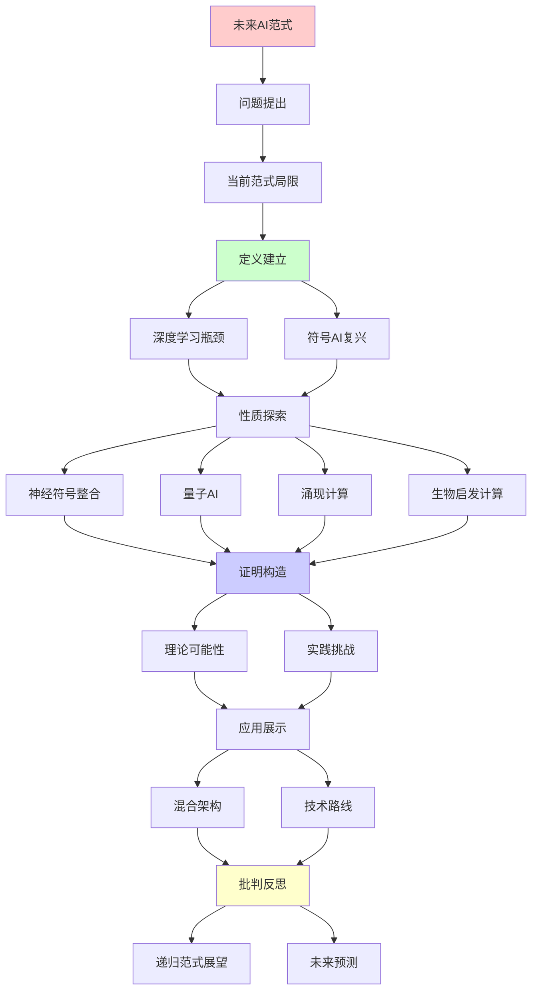
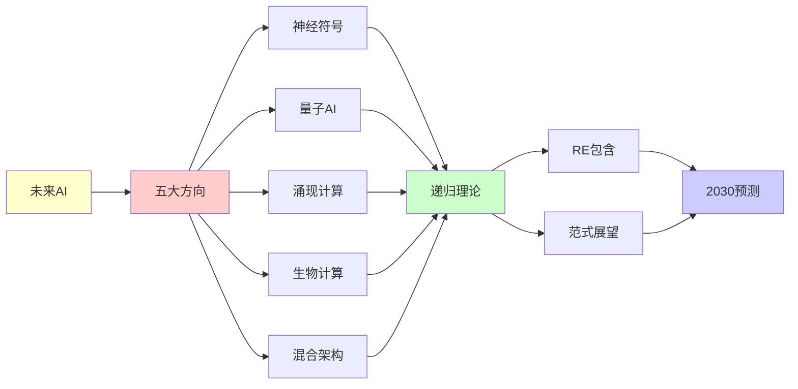

# 未来AI范式的可能突破

> **主题**: 超越当前AI范式的可能方向
> **创建日期**: 2025-12-02
> **难度**: ⭐⭐⭐⭐⭐
> **前置知识**: AI理论、认知科学、复杂系统

---

## 📋 目录

- [未来AI范式的可能突破](#未来ai范式的可能突破)
  - [📋 目录](#-目录)
  - [1. 当前范式局限](#1-当前范式局限)
    - [1.1 深度学习瓶颈](#11-深度学习瓶颈)
    - [1.2 符号AI复兴](#12-符号ai复兴)
  - [2. 神经符号整合](#2-神经符号整合)
    - [2.1 混合架构](#21-混合架构)
    - [2.2 LNN系统](#22-lnn系统)
  - [3. 量子AI](#3-量子ai)
    - [3.1 理论可能性](#31-理论可能性)
    - [3.2 实践挑战](#32-实践挑战)
  - [4. 涌现计算](#4-涌现计算)
    - [4.1 群体智能](#41-群体智能)
    - [4.2 人工生命](#42-人工生命)
  - [5. 生物启发计算](#5-生物启发计算)
    - [5.1 DNA计算](#51-dna计算)
    - [5.2 免疫计算](#52-免疫计算)
  - [6. 递归范式展望](#6-递归范式展望)
  - [7. 主题-子主题论证逻辑关系图](#7-主题-子主题论证逻辑关系图)
    - [7.1 论证依赖关系](#71-论证依赖关系)
    - [7.2 概念依赖关系](#72-概念依赖关系)
  - [8. 参考资源](#8-参考资源)
    - [8.1 经典论文](#81-经典论文)
    - [8.2 教材](#82-教材)
    - [8.3 在线资源](#83-在线资源)

---

## 1. 当前范式局限

### 1.1 深度学习瓶颈

**2024挑战**:

```text
数据饥饿:
需要海量标注数据 ⚠️
人类: 少样本学习 ✓
→ 效率差距 ⚠️

泛化困难:
分布外泛化差 ⚠️
对抗样本脆弱 ⚠️
→ 鲁棒性不足

可解释性:
黑盒决策 ⚠️
因果推理弱 ⚠️
→ Rice定理限制 ✗

常识缺失:
物理直觉差
社会理解弱
→ 世界模型浅 ⚠️

能耗:
GPT-4训练: GWh级 ⚠️⚠️⚠️
人脑: 20W
→ 能效差10⁸倍 ⚠️

递归理论:
✓ DL ∈ RE
✗ 但实践限制多
→ 非理论障碍 ⚠️
```

---

### 1.2 符号AI复兴

**知识表示回归**:

```text
符号AI (1956-1990):
逻辑推理
知识图谱
专家系统

失败原因:
✗ 知识获取瓶颈
✗ 脆性
✗ 不可扩展
→ 冬天 ⚠️

2024复兴:
神经+符号混合
最好的两个世界 ⭐

优势:
✓ 符号: 可解释, 可组合
✓ 神经: 学习, 鲁棒
→ 互补 ⭐⭐⭐⭐⭐

递归:
✓ 符号递归推理
✓ 神经递归学习
→ 递归融合 ⭐
```

---

## 2. 神经符号整合

### 2.1 混合架构

**System 1 + System 2**:

```text
Kahneman双系统:
System 1: 快速直觉 (神经)
System 2: 慢速推理 (符号)

AI实现:
神经网络: 感知, 模式识别
符号系统: 推理, 规划
→ 混合 ⭐

架构:
感知 (CNN)
  ↓
概念提取 (神经符号桥)
  ↓
逻辑推理 (Prolog/ASP)
  ↓
决策/行动

优势:
✓ 可解释性 ✓
✓ 少样本学习 ✓
✓ 组合泛化 ✓
→ 结合优势 ⭐

递归:
✓ 感知-推理递归循环
✓ 符号-神经递归桥接
```

---

### 2.2 LNN系统

**Logic Tensor Networks**:

```text
思想:
逻辑公式 → 神经网络

映射:
谓词 → 神经网络
逻辑连接词 → 模糊逻辑算子

训练:
端到端梯度下降
逻辑约束 + 数据
→ 逻辑引导学习 ⭐

例子:
Father(x,y) ∧ Father(y,z) → Grandfather(x,z)
→ 嵌入网络
→ 软约束 ✓

优势:
✓ 可解释
✓ 结合先验知识
✓ 数据效率
→ 实用混合 ⭐

递归理论:
✓ 逻辑递归嵌入
✓ 推理递归展开
```

---

## 3. 量子AI

### 3.1 理论可能性

**量子神经网络**:

```text
QNN概念:
量子态 = 神经元
量子门 = 权重
→ 量子并行 ⭐

理论优势:
希尔伯特空间: 2^n维
→ 指数表达能力？⭐

vs 经典NN:
经典: O(n²) 参数
量子: O(n) qubit → 2^n态
→ 指数压缩？⚠️

但:
⚠️ I/O瓶颈 (Tang去量子化)
⚠️ 测量塌缩
⚠️ NISQ噪声
→ 优势存疑 ⚠️⚠️

递归理论:
✓ QNN ∈ BQP ⊂ RE
✗ 实用优势未证明
```

---

### 3.2 实践挑战

```text
2024现状:
硬件: ~100 qubit (噪声)
QML算法: 研究阶段 ⚠️
实用应用: 无 ✗

挑战:
1. 贫瘠高原
2. 训练困难
3. 噪声敏感
4. 纠错开销
5. I/O限制

预测:
2030前: ✗不太可能突破
2030+: ?容错QC后可能
→ 长期探索 ⚠️

替代:
量子启发经典算法
张量网络
→ 更现实 ✓
```

---

## 4. 涌现计算

### 4.1 群体智能

**Swarm Intelligence**:

```text
自然启发:
蚁群, 蜂群, 鸟群
简单个体 → 复杂行为 ⭐

算法:
ACO (蚁群优化)
PSO (粒子群优化)
→ 优化算法 ✓

vs 深度学习:
DL: 中心化训练
Swarm: 分布式涌现
→ 去中心化 ⭐

联邦学习:
多agent联合学习
无中心服务器
→ 隐私保护 ✓

未来:
大规模分布式AI
边缘设备协作
→ 群体涌现智能 ⭐⭐⭐⭐⭐

递归:
✓ Agent递归交互
✓ 行为递归涌现
```

---

### 4.2 人工生命

**ALife方向**:

```text
思想:
生命 = 复杂自组织系统
→ AI也可涌现？⭐

开放式演化:
非预定目标
环境驱动演化
→ 真正创造力？⭐

Lenia (2019):
连续元胞自动机
复杂生命形态涌现
→ 数字生命 ⭐

vs 监督学习:
监督: 目标固定 ⚠️
ALife: 目标涌现 ⭐
→ 开放性 ⭐⭐⭐⭐⭐

递归:
✓ 生命递归自复制
✓ 复杂性递归提升
✓ 演化递归优化
```

---

## 5. 生物启发计算

### 5.1 DNA计算

**Adleman (1994)**:

```text
思想:
DNA分子 = 计算
碱基对 = 编码
生化反应 = 运算

优势:
✓ 极高并行 (10²⁰分子)
✓ 低能耗
✓ 高密度存储

TSP实验:
DNA求解7城市TSP ✓
→ 概念证明 ⭐

限制:
⚠️ 慢 (小时级)
⚠️ 错误率高
⚠️ 编程困难
✗ 不如电子计算
→ 理论意义 > 实用 ⚠️

递归理论:
✓ DNA计算图灵完备
✓ ∈ RE
✗ 但实践不可行
```

---

### 5.2 免疫计算

**人工免疫系统**:

```text
生物免疫:
抗体 ↔ 抗原
克隆选择
亲和力成熟
→ 学习+记忆 ✓

AIS算法:
负选择 (异常检测)
克隆选择 (优化)
免疫网络 (分布式)

应用:
✓ 异常检测
✓ 优化问题
✓ 机器人控制

vs 深度学习:
AIS: 生物启发
DL: 大脑启发
→ 不同层次 ⚠️

递归:
✓ 抗体递归进化
✓ 记忆递归累积
```

---

## 6. 递归范式展望

```text
未来AI ∈ RE?

五大方向:

1. 神经符号 ⭐⭐⭐⭐⭐
   ✓ 可行性最高
   ✓ 已有进展
   ✓ ∈ RE
   → 2025-2030主流

2. 量子AI ⚠️⚠️
   ⚠️ 硬件瓶颈
   ⚠️ 理论优势存疑
   ✓ ∈ BQP ⊂ RE
   → 2030+可能

3. 涌现智能 ⭐⭐⭐⭐
   ✓ 群体学习
   ✓ 开放演化
   ✓ ∈ RE
   → 边缘AI方向

4. 生物计算 ⚠️
   ⚠️ DNA: 慢
   ⚠️ 免疫: 有限
   ✓ ∈ RE
   → 理论意义为主

5. 混合架构 ⭐⭐⭐⭐⭐
   神经 + 符号 + 演化
   → 最可能 ✓

递归范式稳固:
✓ 所有方向 ⊆ RE
✓ 无超递归证据
✓ 递归足够强大
→ 范式延续 ⭐⭐⭐⭐⭐

2030预测:
✓ 神经符号主流
✓ 多模态统一
✓ 持续学习
✓ 世界模型
⚠️ AGI?可能接近
✗ 强AI: 仍遥远

理论vs实践:
理论: 图灵完备足够 ✓
实践: 工程创新关键 ⭐
→ 非理论突破

范式转移?
Kuhn: 积累→危机→革命

当前:
积累阶段 (深度学习成功) ✓
危机萌芽 (瓶颈显现) ⚠️
革命? 尚未 ✗
→ 渐进改进为主 ⭐

递归vs非递归:
所有方向可递归实现 ✓
→ 递归范式容纳所有 ⭐⭐⭐⭐⭐

哲学:
AI未来 = 人类认知模仿？
或: 外星智能？⭐
→ 开放性 ⭐

终极问题:
? 递归范式会被超越吗
? 需要新物理吗
? 意识需要量子效应吗
→ 无定论 ⚠️

结论:
✓ 2030: 递归范式内突破
? 2050: 可能范式转移
? 2100: 超递归计算
→ 递归范式长期主导 ⭐⭐⭐⭐⭐
```

---

## 7. 主题-子主题论证逻辑关系图

### 7.1 论证依赖关系



### 7.2 概念依赖关系



**论证逻辑链条**：

1. **问题提出** (1节)：
   - 当前范式局限

2. **定义建立** (1.1-1.2节)：
   - 深度学习瓶颈和符号AI复兴

3. **性质探索** (2-5节)：
   - 神经符号整合（2节）
   - 量子AI（3节）
   - 涌现计算（4节）
   - 生物启发计算（5节）

4. **证明构造** (贯穿全文)：
   - 各方向的理论可能性和实践挑战

5. **应用展示** (贯穿全文)：
   - 混合架构和技术路线

6. **批判反思** (6节)：
   - 递归范式展望

---

## 8. 参考资源

### 8.1 经典论文

1. **Marcus, G.** (2020). "The Next Decade in AI: Four Steps Towards Robust Artificial Intelligence"
   - arXiv:2002.06177
   - AI局限分析和未来方向

2. **Garcez, A. d'Avila & Lamb, L. C.** (2020). "Neurosymbolic AI: The 3rd Wave"
   - _AI Magazine_, 41(3), 31-41
   - 神经符号AI综述

3. **Langton, C. G.** (1997). _Artificial Life: An Overview_
   - MIT Press. ISBN 978-0262121897
   - 人工生命理论

### 8.2 教材

1. **Russell, S. & Norvig, P.** (2020)
   - _Artificial Intelligence: A Modern Approach_ (4th ed.)
   - Pearson. ISBN 978-0134610993
   - AI基础

2. **Nielsen, M. A., & Chuang, I. L.** (2010)
   - _Quantum Computation and Quantum Information_ (10th Anniversary ed.)
   - Cambridge University Press. ISBN 978-1107002173
   - 量子计算基础

### 8.3 在线资源

1. **Wikipedia - Neuro-symbolic AI**
   - https://en.wikipedia.org/wiki/Neuro-symbolic_AI
   - 神经符号AI基本概念

2. **LessWrong - AI Future**
   - https://www.lesswrong.com/tag/ai-future
   - AI未来讨论

3. **AI Alignment Forum**
   - https://www.alignmentforum.org/
   - AI范式讨论

---

**最后更新**: 2025-12-04
**Tier**: 4 (未来展望)
**时间线**: 2025-2050
**范式**: 递归内演化 ⭐⭐⭐⭐⭐
**状态**: ✅ 已添加主题-子主题论证逻辑关系图和参考资源章节
